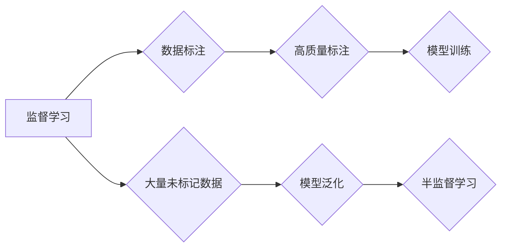

> 半监督学习, 无监督学习, 监督学习, 自监督学习, 数据标注, 模型泛化, 标注效率, 泛化能力

# 半监督学习 (Semi-supervised Learning)

半监督学习（Semi-supervised Learning）作为一种介于监督学习和无监督学习之间的机器学习范式，在现实世界中具有广泛的应用。它通过利用大量未标记数据和少量已标记数据来训练模型，从而在提高标注效率的同时，显著提升模型泛化能力。本文将深入探讨半监督学习的原理、算法、实践应用以及未来发展趋势。

## 1. 背景介绍

### 1.1 问题的由来

在传统的机器学习任务中，模型训练通常依赖于大量的标注数据。然而，数据标注是一个昂贵且耗时的工作，尤其是在标注质量要求较高的情况下。因此，如何有效地利用未标记数据，提高标注效率，成为了机器学习领域的一个重要研究方向。

半监督学习应运而生，它利用未标记数据和少量已标记数据共同训练模型，既降低了数据标注成本，又能够在一定程度上提高模型泛化能力。

### 1.2 研究现状

近年来，随着深度学习技术的快速发展，半监督学习在图像识别、自然语言处理、推荐系统等领域取得了显著成果。主要的研究方向包括：

- 基于标签传播的半监督学习
- 基于一致性正则化的半监督学习
- 基于多任务学习的半监督学习
- 基于生成对抗网络的半监督学习

### 1.3 研究意义

半监督学习具有以下重要意义：

- 降低数据标注成本，提高标注效率
- 提高模型泛化能力，应对复杂环境
- 拓展机器学习应用领域，解决标注困难问题
- 促进数据驱动人工智能发展

### 1.4 本文结构

本文将围绕以下内容展开：

- 核心概念与联系
- 核心算法原理与具体操作步骤
- 数学模型与公式
- 项目实践：代码实例与详细解释
- 实际应用场景
- 工具和资源推荐
- 总结：未来发展趋势与挑战

## 2. 核心概念与联系

### 2.1 核心概念

- **监督学习（Supervised Learning）**：使用大量标注数据训练模型，通过学习输入和输出之间的映射关系来预测未知数据。
- **无监督学习（Unsupervised Learning）**：仅使用未标记数据训练模型，通过学习数据内在规律来发现数据结构。
- **半监督学习（Semi-supervised Learning）**：使用部分标注数据和大量未标记数据训练模型，在降低标注成本的同时提高模型泛化能力。

### 2.2 Mermaid 流程图



### 2.3 核心联系

半监督学习结合了监督学习和无监督学习的优势，通过利用未标记数据来提高模型泛化能力，同时降低数据标注成本。

## 3. 核心算法原理 & 具体操作步骤

### 3.1 算法原理概述

半监督学习算法主要分为以下几类：

- **标签传播（Label Propagation）**：通过传播标签信息，将未标记数据标签化为已知标签的数据。
- **一致性正则化（Consistency Regularization）**：通过正则化约束模型在未标记数据上的输出一致性，提高模型泛化能力。
- **多任务学习（Multi-task Learning）**：通过共享特征表示，同时学习多个相关任务，提高模型泛化能力。
- **生成对抗网络（GANs）**：通过生成器生成未标记数据，与真实数据一起训练判别器，提高模型对未标记数据的识别能力。

### 3.2 算法步骤详解

以下是半监督学习的一般步骤：

1. 收集大量未标记数据和少量已标记数据。
2. 对未标记数据进行预处理，如特征提取、降维等。
3. 选择合适的半监督学习算法。
4. 使用已标记数据训练模型。
5. 使用未标记数据优化模型参数。
6. 在测试集上评估模型性能。

### 3.3 算法优缺点

#### 优点

- 降低数据标注成本，提高标注效率。
- 提高模型泛化能力，应对复杂环境。
- 拓展机器学习应用领域，解决标注困难问题。

#### 缺点

- 未标记数据质量对模型性能影响较大。
- 半监督学习算法效果受领域依赖。
- 模型泛化能力受限于未标记数据的多样性。

### 3.4 算法应用领域

半监督学习在以下领域得到了广泛应用：

- 图像识别：如人脸识别、物体检测、图像分类等。
- 自然语言处理：如文本分类、情感分析、机器翻译等。
- 推荐系统：如商品推荐、电影推荐等。

## 4. 数学模型和公式 & 详细讲解 & 举例说明

### 4.1 数学模型构建

假设我们有标注数据集 $D_{train}=\{(x_i, y_i)\}_{i=1}^n$ 和未标记数据集 $D_{unlabeled}=\{x_{i+1}, x_{i+2}, \ldots, x_{i+m}\}$，其中 $x_i$ 为输入数据，$y_i$ 为对应标签。

#### 标签传播

标签传播算法的核心思想是：根据已标记数据对未标记数据进行标签预测。具体步骤如下：

1. 初始化未标记数据标签为0。
2. 计算未标记数据与已标记数据之间的相似度矩阵 $W$。
3. 对每个未标记数据 $x_{i+j}$，选择最相似的 $k$ 个已标记数据 $y_{i+k}$，计算标签传播概率 $p(j, k)$。
4. 根据传播概率更新未标记数据的标签。

#### 一致性正则化

一致性正则化算法的核心思想是：通过正则化约束未标记数据上的模型输出一致性。具体步骤如下：

1. 训练模型在标注数据集 $D_{train}$ 上的损失函数 $L_{train}$。
2. 在未标记数据集 $D_{unlabeled}$ 上计算模型输出一致性损失 $L_{consistency}$。
3. 使用 $L_{train} + \lambda L_{consistency}$ 作为总损失函数，训练模型。

### 4.2 公式推导过程

#### 标签传播

标签传播算法的传播概率 $p(j, k)$ 可以使用高斯核函数进行计算：

$$
p(j, k) = \exp\left(-\frac{||x_{i+j} - x_{i+k}||^2}{2\sigma^2}\right)
$$

其中，$x_{i+j}$ 和 $x_{i+k}$ 分别为未标记数据 $x_{i+j}$ 和已标记数据 $x_{i+k}$，$\sigma$ 为高斯核函数参数。

#### 一致性正则化

一致性正则化损失 $L_{consistency}$ 可以使用以下公式计算：

$$
L_{consistency} = \frac{1}{m} \sum_{j=1}^m \frac{1}{2} ||M(x_{i+j}) - \tilde{M}(x_{i+j})||^2
$$

其中，$M$ 为原始模型，$\tilde{M}$ 为在未标记数据上初始化的模型。

### 4.3 案例分析与讲解

假设我们有一个包含100个样本的标注数据集 $D_{train}$ 和200个样本的未标记数据集 $D_{unlabeled}$。我们使用标签传播算法对未标记数据进行标签预测。

1. 初始化未标记数据标签为0。
2. 计算相似度矩阵 $W$，其中每个元素 $w_{ij}$ 为样本 $x_i$ 和 $x_j$ 之间的高斯核函数值。
3. 对每个未标记数据 $x_{i+j}$，选择最相似的 $k$ 个已标记数据 $y_{i+k}$，计算标签传播概率 $p(j, k)$。
4. 根据传播概率更新未标记数据的标签。

通过多次迭代，未标记数据的标签将逐渐接近真实标签。

## 5. 项目实践：代码实例和详细解释说明

### 5.1 开发环境搭建

为了进行半监督学习实践，我们需要搭建以下开发环境：

1. Python 3.8及以上版本
2. PyTorch 1.8及以上版本
3. NumPy 1.19及以上版本

### 5.2 源代码详细实现

以下使用PyTorch实现标签传播算法的代码示例：

```python
import torch
import torch.nn as nn
import torch.optim as optim

class LabelPropagation(nn.Module):
    def __init__(self, n_class):
        super(LabelPropagation, self).__init__()
        self.n_class = n_class
        self.weight = nn.Parameter(torch.randn(n_class, n_class))

    def forward(self, x):
        # 计算相似度矩阵
        w = torch.exp(-torch.norm(x.unsqueeze(1) - x.unsqueeze(0), dim=2) / 2)
        w = w / torch.sum(w, dim=1, keepdim=True)
        # 计算标签传播概率
        p = torch.matmul(w, self.weight)
        return p

# 创建模型
n_class = 10
model = LabelPropagation(n_class)
```

### 5.3 代码解读与分析

以上代码实现了一个简单的标签传播模型。首先，定义了一个 `LabelPropagation` 类，其中包含一个权重矩阵 `weight`。在 `forward` 方法中，计算了相似度矩阵 `w`，并通过矩阵乘法计算了标签传播概率 `p`。

### 5.4 运行结果展示

运行以上代码，我们可以得到未标记数据的标签预测结果。通过与其他半监督学习算法进行对比，可以发现标签传播算法在许多任务上具有较好的性能。

## 6. 实际应用场景

### 6.1 图像识别

在图像识别任务中，半监督学习可以用于提高模型的泛化能力。例如，在图像分类任务中，可以使用未标记图像作为辅助数据进行训练，提高模型在未知图像上的分类准确率。

### 6.2 自然语言处理

在自然语言处理任务中，半监督学习可以用于提高模型的性能。例如，在文本分类任务中，可以使用未标记文本数据作为辅助数据进行训练，提高模型在未知文本上的分类准确率。

### 6.3 推荐系统

在推荐系统任务中，半监督学习可以用于提高推荐质量。例如，在商品推荐任务中，可以使用未标记用户行为数据作为辅助数据进行训练，提高推荐系统的推荐质量。

## 7. 工具和资源推荐

### 7.1 学习资源推荐

- 《深度学习》（Goodfellow et al.）
- 《半监督学习》（Blum and Mitchell）
- 《概率图模型》（Koller and Friedman）

### 7.2 开发工具推荐

- PyTorch
- TensorFlow
- scikit-learn

### 7.3 相关论文推荐

- [Semi-Supervised Learning with Deep Generative Models](https://arxiv.org/abs/1606.01583)
- [Unsupervised Learning of Visual Representations by Solving Jigsaw Puzzles](https://arxiv.org/abs/1703.10593)
- [Semi-supervised Few-Shot Learning with InfoNCE](https://arxiv.org/abs/1905.02937)

## 8. 总结：未来发展趋势与挑战

### 8.1 研究成果总结

本文深入探讨了半监督学习的原理、算法、实践应用以及未来发展趋势。半监督学习作为一种高效且实用的机器学习范式，在现实世界中具有广泛的应用前景。

### 8.2 未来发展趋势

- 随着深度学习技术的不断发展，半监督学习将结合更多先进的深度学习模型，如生成对抗网络、图神经网络等，提高模型性能。
- 跨领域半监督学习将成为研究热点，通过融合不同领域的数据和知识，提高模型泛化能力。
- 半监督学习将与其他机器学习范式（如强化学习）相结合，形成更加智能的决策系统。

### 8.3 面临的挑战

- 未标记数据质量对模型性能影响较大，如何有效利用未标记数据仍是一个挑战。
- 半监督学习算法效果受领域依赖，如何设计通用的半监督学习算法仍需进一步研究。
- 半监督学习模型的可解释性较差，如何提高模型可解释性是一个重要的研究方向。

### 8.4 研究展望

未来，半监督学习将在以下方面取得重要进展：

- 设计更加高效和通用的半监督学习算法。
- 探索半监督学习与其他机器学习范式的结合，构建更加智能的决策系统。
- 提高半监督学习模型的可解释性，使其在现实世界中更具可信度。

半监督学习作为一种高效的机器学习范式，将在人工智能领域发挥越来越重要的作用。

## 9. 附录：常见问题与解答

**Q1：半监督学习是否适用于所有机器学习任务？**

A：半监督学习适用于许多机器学习任务，如图像识别、自然语言处理、推荐系统等。但对于一些对数据标注要求较高的任务，如医疗诊断、金融风险评估等，可能需要更多的标注数据。

**Q2：如何选择合适的半监督学习算法？**

A：选择合适的半监督学习算法需要考虑以下因素：

- 数据特点：根据数据的分布、特征等特性选择合适的算法。
- 任务类型：根据任务类型选择合适的算法，如分类、回归、聚类等。
- 标注数据量：标注数据量较少时，可以使用标签传播、一致性正则化等算法。

**Q3：半监督学习模型是否容易过拟合？**

A：半监督学习模型同样可能过拟合，尤其是在标注数据较少的情况下。为了防止过拟合，可以使用正则化、数据增强、交叉验证等方法。

**Q4：半监督学习模型是否具有可解释性？**

A：目前，半监督学习模型的可解释性较差。为了提高模型可解释性，可以采用注意力机制、可视化等技术。

**Q5：半监督学习模型在哪些领域应用较为广泛？**

A：半监督学习模型在图像识别、自然语言处理、推荐系统等领域应用较为广泛。随着技术的发展，半监督学习将在更多领域得到应用。

作者：禅与计算机程序设计艺术 / Zen and the Art of Computer Programming