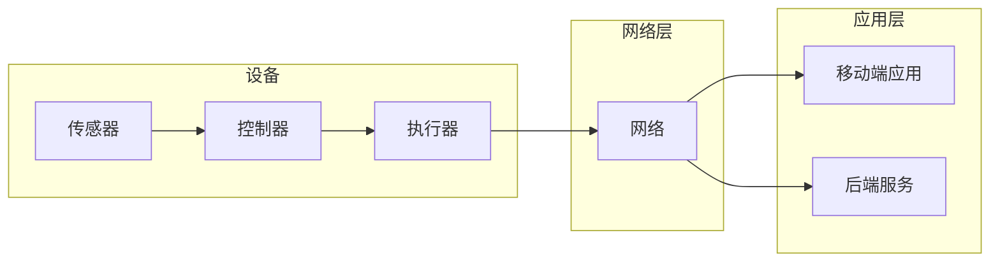

> 关键词：智能家居，物联网，Java编程，硬件接口，RESTful API，MQTT协议，微控制器，传感器，Android应用

# 基于Java的智能家居设计：Java程序员的物联网硬件入门指南

智能家居技术的兴起，让我们的生活变得更加便捷和智能。作为Java程序员，我们不仅能够开发出强大的后端服务，还可以通过学习物联网硬件知识，参与到智能家居系统的构建中。本文将带您从Java程序员的视角，了解智能家居设计的基本原理，掌握与硬件设备交互的方法，并给出一个简单的项目实践案例。

## 1. 背景介绍

### 1.1 智能家居的兴起

随着物联网（IoT）技术的快速发展，智能家居市场正在迅速扩张。智能家居设备可以远程控制，实现家庭环境的自动化管理，提高居住舒适度、节能环保，并提升家庭安全。

### 1.2 Java程序员的角色

Java程序员在智能家居领域可以发挥重要作用，他们可以负责开发以下角色：

- **后端服务开发**：构建智能家居系统的核心服务，如用户认证、设备管理、数据存储等。
- **移动端应用开发**：开发Android或iOS应用程序，用于控制和管理智能家居设备。
- **硬件接口开发**：编写与硬件设备交互的代码，实现设备数据的采集和控制。

### 1.3 本文结构

本文将按照以下结构展开：

- 介绍智能家居设计中的核心概念和架构。
- 深入讲解与硬件设备交互的算法原理和步骤。
- 提供一个基于Java的智能家居项目实践案例。
- 探讨智能家居的实际应用场景和未来发展趋势。

## 2. 核心概念与联系

### 2.1 智能家居核心概念

- **传感器**：用于感知环境状态，如温度、湿度、光照等。
- **控制器**：接收传感器数据，并根据设定规则控制执行器。
- **执行器**：根据控制器的指令执行相应动作，如开关灯、调节温度等。
- **网络**：连接智能家居设备，实现数据传输和控制指令的发送。

### 2.2 智能家居架构



### 2.3 Java与智能家居的联系

Java程序员可以通过以下方式与智能家居硬件交互：

- **Java API**：使用Java编写的硬件接口库，如Java IoT (IoT) Platform。
- **RESTful API**：通过HTTP请求与智能家居设备的RESTful API进行交互。
- **MQTT协议**：使用MQTT协议进行轻量级的数据传输。

## 3. 核心算法原理 & 具体操作步骤

### 3.1 算法原理概述

智能家居系统中的核心算法主要包括：

- **数据采集与处理**：采集传感器数据，进行初步处理。
- **控制策略**：根据传感器数据和预设规则，生成控制指令。
- **设备通信**：通过网络将控制指令发送给执行器。

### 3.2 算法步骤详解

#### 3.2.1 数据采集与处理

1. 初始化传感器设备。
2. 定期读取传感器数据。
3. 对数据进行初步处理，如去噪、滤波等。

#### 3.2.2 控制策略

1. 根据传感器数据和历史数据，判断设备状态。
2. 根据预设规则，生成控制指令。
3. 将控制指令发送给控制器。

#### 3.2.3 设备通信

1. 使用网络连接到智能家居设备。
2. 发送HTTP请求或MQTT消息，包含控制指令。
3. 接收设备响应，确认指令执行结果。

### 3.3 算法优缺点

#### 3.3.1 优点

- **跨平台**：Java语言具有跨平台特性，可以开发出可在不同操作系统上运行的智能家居系统。
- **可扩展性**：Java生态系统丰富，可以方便地集成各种库和框架，提高开发效率。
- **安全性**：Java具有较好的安全性，可以保证智能家居系统的安全性。

#### 3.3.2 缺点

- **性能**：Java在性能方面可能不如C或C++等编译型语言。
- **资源消耗**：Java应用程序可能占用较多内存和CPU资源。

### 3.4 算法应用领域

Java算法在智能家居领域的应用包括：

- **环境监测**：监测温度、湿度、光照等环境参数。
- **能源管理**：控制家电设备，实现节能环保。
- **安全监控**：监控家庭安全，如门锁状态、烟雾报警等。

## 4. 数学模型和公式 & 详细讲解 & 举例说明

### 4.1 数学模型构建

智能家居系统中的数学模型主要包括：

- **传感器数据模型**：描述传感器数据的统计特性。
- **控制策略模型**：描述控制指令的生成过程。
- **设备通信模型**：描述设备通信的协议和流程。

### 4.2 公式推导过程

以传感器数据模型为例，假设传感器数据服从正态分布，其概率密度函数为：

$$
f(x) = \frac{1}{\sqrt{2\pi\sigma^2}} e^{-\frac{(x-\mu)^2}{2\sigma^2}}
$$

其中，$x$ 为传感器数据，$\mu$ 为均值，$\sigma$ 为标准差。

### 4.3 案例分析与讲解

假设我们要根据温度传感器数据控制空调的开关。当温度高于设定值时，开启空调；当温度低于设定值时，关闭空调。

```java
public class TemperatureController {
    private double temperatureThreshold = 25.0; // 设定温度阈值
    private boolean isAirConditionerOn = false; // 空调开关状态

    public void updateTemperature(double temperature) {
        if (temperature > temperatureThreshold) {
            if (!isAirConditionerOn) {
                turnOnAirConditioner();
            }
        } else {
            if (isAirConditionerOn) {
                turnOffAirConditioner();
            }
        }
    }

    private void turnOnAirConditioner() {
        // 开启空调的代码
        isAirConditionerOn = true;
    }

    private void turnOffAirConditioner() {
        // 关闭空调的代码
        isAirConditionerOn = false;
    }
}
```

## 5. 项目实践：代码实例和详细解释说明

### 5.1 开发环境搭建

1. 安装Java开发环境，如JDK、IDE（如Eclipse、IntelliJ IDEA）。
2. 安装MQTT客户端库，如Paho MQTT。
3. 准备开发板或Arduino，如ESP8266、ESP32等。

### 5.2 源代码详细实现

#### 5.2.1 温度传感器数据采集

```java
import com.pi4j.io.gpio.GpioController;
import com.pi4j.io.gpio.GpioFactory;
import com.pi4j.io.gpio.GpioPin;
import com.pi4j.io.gpio.GpioPinDigitalInput;
import com.pi4j.io.gpio.PinPullResistor;
import com.pi4j.io.gpio.RaspiPin;
import com.pi4j.io.gpio.event.GpioPinAnalogValueListener;
import com.pi4j.io.gpio.event.GpioPinListenerAnalog;

public class TemperatureSensor {
    private GpioController gpio;
    private GpioPinDigitalInput pin;

    public TemperatureSensor() {
        gpio = GpioFactory.getInstance();
        pin = gpio.provisionDigitalInputPin(RaspiPin.GPIO_02, PinPullResistor.PULL_DOWN);
        pin.addPinListener(new GpioPinListenerAnalog() {
            @Override
            public void notify(GpioPin pin, double value) {
                // 处理温度传感器数据
                System.out.println("Temperature: " + value);
            }
        });
    }

    public void shutdown() {
        gpio.shutdown();
    }
}
```

#### 5.2.2 空调控制

```java
public class AirConditionerController {
    private boolean isOn;

    public AirConditionerController() {
        this.isOn = false;
    }

    public void turnOn() {
        this.isOn = true;
        // 开启空调的代码
    }

    public void turnOff() {
        this.isOn = false;
        // 关闭空调的代码
    }
}
```

#### 5.2.3 MQTT通信

```java
import org.eclipse.paho.client.mqttv3.IMqttDeliveryToken;
import org.eclipse.paho.client.mqttv3.MqttCallback;
import org.eclipse.paho.client.mqttv3.MqttClient;
import org.eclipse.paho.client.mqttv3.MqttConnectOptions;
import org.eclipse.paho.client.mqttv3.MqttMessage;

public class MqttClientExample implements MqttCallback {
    private MqttClient client;
    private String topic;

    public MqttClientExample(String brokerUrl, String topic) {
        this.topic = topic;
        MqttConnectOptions options = new MqttConnectOptions();
        options.setCleanSession(true);
        client = new MqttClient(brokerUrl, "client-id");
        client.setCallback(this);
        try {
            client.connect(options);
            client.subscribe(topic);
        } catch (Exception e) {
            e.printStackTrace();
        }
    }

    @Override
    public void connectionLost(Throwable cause) {
        // 连接丢失处理
    }

    @Override
    public void deliveryComplete(IMqttDeliveryToken token) {
        // 消息发送完成处理
    }

    @Override
    public void messageArrived(String topic, MqttMessage message) throws Exception {
        // 处理接收到的消息
        String payload = new String(message.getPayload());
        System.out.println("Received message: " + payload);
        if (payload.equals("turn-on")) {
            airConditionerController.turnOn();
        } else if (payload.equals("turn-off")) {
            airConditionerController.turnOff();
        }
    }
}
```

### 5.3 代码解读与分析

以上代码展示了如何使用Java编写智能家居控制器的核心功能：

- **TemperatureSensor** 类负责采集温度传感器数据。
- **AirConditionerController** 类负责控制空调的开关。
- **MqttClientExample** 类负责与MQTT服务器通信，接收控制指令。

### 5.4 运行结果展示

在开发板上运行以上代码，连接到MQTT服务器，发送“turn-on”或“turn-off”消息，可以控制空调的开关。

## 6. 实际应用场景

智能家居技术在以下场景中具有广泛的应用：

- **家庭自动化**：控制照明、温度、湿度等环境参数，实现家庭环境的舒适和节能。
- **安全监控**：监控门锁状态、烟雾报警等，提高家庭安全。
- **健康监测**：监测家庭成员的健康状况，如心率、血压等。
- **能源管理**：控制家电设备的开关，实现能源节约。

## 7. 工具和资源推荐

### 7.1 学习资源推荐

- 《Java Programming for the Internet of Things》
- 《Java IoT Platform》
- 《Building Internet of Things with Arduino, Python, and Raspberry Pi》

### 7.2 开发工具推荐

- Java开发环境：JDK、IDE（Eclipse、IntelliJ IDEA）
- MQTT客户端库：Paho MQTT
- 开发板：ESP8266、ESP32

### 7.3 相关论文推荐

- 《Home Automation and the Internet of Things》
- 《The Internet of Things: A Survey》
- 《The Internet of Things in Action》

## 8. 总结：未来发展趋势与挑战

### 8.1 研究成果总结

智能家居技术的发展，让我们的生活变得更加便捷和智能。Java程序员可以通过学习物联网硬件知识，参与到智能家居系统的构建中。

### 8.2 未来发展趋势

- **更加智能化的控制**：智能家居系统将更加智能化，能够根据用户习惯和场景自动调整设备状态。
- **更加个性化的体验**：智能家居系统将更加个性化，能够根据用户需求提供定制化的服务。
- **更加开放的平台**：智能家居平台将更加开放，支持更多第三方设备和服务的接入。

### 8.3 面临的挑战

- **安全性**：智能家居系统需要保证用户数据的安全，防止黑客攻击。
- **隐私保护**：智能家居系统需要保护用户隐私，防止个人信息泄露。
- **标准统一**：智能家居行业标准需要统一，方便设备之间的互联互通。

### 8.4 研究展望

智能家居技术的发展，将为我们的生活带来更多便利和可能性。Java程序员可以继续学习物联网硬件知识，为智能家居的发展贡献力量。

## 9. 附录：常见问题与解答

**Q1：Java是否适合开发智能家居系统？**

A：是的，Java适合开发智能家居系统。Java具有跨平台、可扩展、安全性高等优点，可以满足智能家居系统开发的需求。

**Q2：如何选择合适的智能家居设备？**

A：选择智能家居设备时，需要考虑以下因素：

- **兼容性**：设备是否支持标准的通信协议，如MQTT、HTTP等。
- **易用性**：设备的操作界面是否友好，是否易于上手。
- **稳定性**：设备的稳定性如何，能否长时间稳定运行。

**Q3：如何保证智能家居系统的安全性？**

A：为了保证智能家居系统的安全性，需要采取以下措施：

- **数据加密**：对传输数据进行加密，防止数据泄露。
- **访问控制**：限制对智能家居系统的访问权限。
- **安全更新**：及时更新设备固件和软件，修复已知漏洞。

**Q4：如何实现智能家居设备的互联互通？**

A：实现智能家居设备的互联互通，需要以下步骤：

- **标准协议**：选择统一的通信协议，如MQTT、HTTP等。
- **设备认证**：对设备进行认证，确保设备安全接入。
- **数据交换**：定义数据交换格式，实现设备之间的数据交互。

通过以上问题的解答，相信您对智能家居系统的开发已经有了更深入的了解。

---

作者：禅与计算机程序设计艺术 / Zen and the Art of Computer Programming