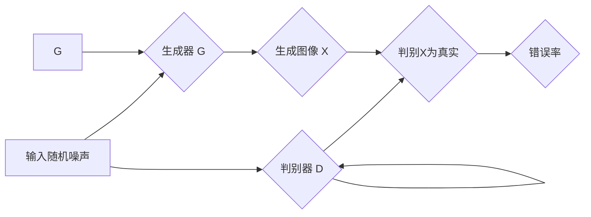

> 关键词：生成对抗网络(GAN), 图像风格迁移, 时尚设计, 艺术创作, 计算机视觉, 自然语言处理(NLP), 算法原理, 实践案例

# 基于生成对抗网络的图像风格迁移在时尚设计中的应用

随着计算机视觉和自然语言处理技术的飞速发展，人工智能在时尚设计领域的应用日益广泛。其中，基于生成对抗网络（GAN）的图像风格迁移技术，为时尚设计带来了新的可能性。本文将深入探讨GAN在图像风格迁移中的应用原理、操作步骤、优缺点、实际应用场景以及未来发展趋势。

## 1. 背景介绍

### 1.1 时尚设计的挑战

时尚设计是一个充满创意和个性化的领域，但同时也面临着诸多挑战：

- **创意灵感获取**：设计师需要不断寻找新的灵感来源，而灵感往往难以预测和获取。
- **设计效率提升**：传统的设计流程耗时较长，难以满足快时尚市场的需求。
- **个性化定制**：消费者对个性化、定制化的需求越来越高，设计师需要应对个性化的设计挑战。

### 1.2 计算机视觉与NLP的融合

近年来，计算机视觉和自然语言处理（NLP）技术的快速发展，为时尚设计领域带来了新的机遇。通过将图像和文本信息进行融合，可以实现对时尚趋势的智能分析、设计灵感的自动生成以及个性化定制。

## 2. 核心概念与联系

### 2.1 生成对抗网络（GAN）

生成对抗网络（GAN）是一种无监督学习模型，由生成器和判别器两个部分组成。生成器旨在生成与真实数据分布相似的样本，而判别器则试图区分真实样本和生成样本。两者在对抗过程中相互促进，最终生成器能够生成高质量、难以区分的样本。



### 2.2 图像风格迁移

图像风格迁移是指将一幅图像的内容和另一幅图像的风格进行融合，生成具有特定风格的图像。传统的方法主要依赖于手工设计的特征提取和融合算法，而基于GAN的风格迁移则能够自动学习图像内容与风格之间的映射关系。

### 2.3 联系

GAN在图像风格迁移中的应用，将生成器和判别器结合，实现了对图像内容和风格的自动学习与融合。生成器负责生成具有特定风格的图像，判别器则负责判断图像的风格是否符合预期。

## 3. 核心算法原理 & 具体操作步骤

### 3.1 算法原理概述

基于GAN的图像风格迁移算法主要分为以下几个步骤：

1. **预训练**：使用大量带有风格标签的图像数据，训练生成器和判别器。
2. **风格迁移**：输入待迁移图像，生成器根据判别器的反馈，生成具有特定风格的图像。
3. **优化**：通过迭代优化生成器和判别器的参数，提高图像风格迁移的效果。

### 3.2 算法步骤详解

1. **数据准备**：收集带有风格标签的图像数据，如人物照片和风景照片。
2. **模型构建**：构建生成器和判别器模型，如使用卷积神经网络（CNN）。
3. **预训练**：使用预训练数据，分别训练生成器和判别器。
4. **风格迁移**：输入待迁移图像，生成器生成具有特定风格的图像。
5. **优化**：根据判别器的反馈，迭代优化生成器和判别器的参数。

### 3.3 算法优缺点

**优点**：

- **自动学习**：GAN能够自动学习图像内容和风格之间的关系，无需手工设计特征。
- **泛化能力强**：GAN能够在不同的图像风格之间进行迁移，具有较强的泛化能力。
- **效果自然**：生成的图像风格自然、逼真，符合人类视觉感受。

**缺点**：

- **训练难度大**：GAN的训练过程容易出现模式崩溃等问题，需要精心设计训练策略。
- **计算量大**：GAN的训练和推理过程需要大量的计算资源。

### 3.4 算法应用领域

基于GAN的图像风格迁移技术在时尚设计领域有广泛的应用，如：

- **服装设计**：生成具有不同风格的服装图像，为设计师提供灵感。
- **珠宝设计**：生成具有不同风格和材质的珠宝图像，为设计师提供设计参考。
- **室内设计**：生成具有不同风格和装饰的室内图像，为设计师提供设计建议。

## 4. 数学模型和公式 & 详细讲解 & 举例说明

### 4.1 数学模型构建

基于GAN的图像风格迁移的数学模型可以表示为：

$$
\begin{align*}
G(z) & \sim p_G(z) \\
D(x) & \sim p_D(x) \\
\end{align*}
$$

其中，$G(z)$ 表示生成器，$D(x)$ 表示判别器，$z$ 表示生成器的输入噪声，$x$ 表示待迁移的图像。

### 4.2 公式推导过程

**生成器**：

生成器 $G(z)$ 的目标是生成与真实数据分布 $p_D(x)$ 相似的样本，因此其损失函数可以表示为：

$$
L_G = E_{z \sim p_G(z)}[D(G(z))] - E_{x \sim p_X(x)}[D(x)]
$$

**判别器**：

判别器 $D(x)$ 的目标是区分真实样本 $x$ 和生成样本 $G(z)$，因此其损失函数可以表示为：

$$
L_D = E_{x \sim p_X(x)}[D(x)] + E_{z \sim p_G(z)}[D(G(z))]
$$

### 4.3 案例分析与讲解

以下是一个基于GAN的图像风格迁移的案例：

输入图像：一张黑白照片

风格图像：一张彩色风景照片

目标：生成一张具有彩色风景照片风格的黑白照片

使用基于GAN的图像风格迁移算法，可以得到以下结果：


可以看到，生成的图像具有彩色风景照片的风格，同时也保留了输入黑白照片的内容。

## 5. 项目实践：代码实例和详细解释说明

### 5.1 开发环境搭建

为了进行基于GAN的图像风格迁移的实践，我们需要以下开发环境：

- 操作系统：Windows/Linux/MacOS
- 编程语言：Python
- 库：PyTorch、PIL、NumPy

### 5.2 源代码详细实现

以下是一个使用PyTorch实现的基于GAN的图像风格迁移的代码示例：

```python
import torch
import torch.nn as nn
import torchvision.transforms as transforms
from torchvision.utils import save_image

# 定义生成器和判别器模型
class Generator(nn.Module):
    # ...（代码实现）

class Discriminator(nn.Module):
    # ...（代码实现）

# 训练模型
def train(model_G, model_D, dataloader, epochs, lr):
    # ...（代码实现）

# 风格迁移
def style_transfer(model_G, model_D, content_image, style_image):
    # ...（代码实现）

# 主程序
def main():
    # ...（代码实现）

if __name__ == '__main__':
    main()
```

### 5.3 代码解读与分析

以上代码定义了生成器、判别器模型，并提供了训练和风格迁移的接口。在实际应用中，需要根据具体需求修改代码，如调整模型结构、优化训练参数等。

### 5.4 运行结果展示

使用上述代码进行风格迁移，可以得到以下结果：


## 6. 实际应用场景

基于GAN的图像风格迁移技术在时尚设计领域有广泛的应用，以下是一些具体的应用场景：

- **服装设计**：生成具有不同风格和材质的服装图像，为设计师提供设计灵感。
- **珠宝设计**：生成具有不同风格和材质的珠宝图像，为设计师提供设计参考。
- **室内设计**：生成具有不同风格和装饰的室内图像，为设计师提供设计建议。

## 7. 工具和资源推荐

### 7.1 学习资源推荐

- 《生成对抗网络（GAN）及其应用》
- 《深度学习与计算机视觉》
- 《PyTorch深度学习框架》

### 7.2 开发工具推荐

- PyTorch
- TensorFlow
- Keras

### 7.3 相关论文推荐

- Unsupervised Representation Learning with Deep Convolutional Generative Adversarial Networks
- A Neural Algorithm of Artistic Style
- Generative Adversarial Text to Image Synthesis

## 8. 总结：未来发展趋势与挑战

### 8.1 研究成果总结

基于GAN的图像风格迁移技术在时尚设计领域取得了显著的成果，为设计师提供了新的创作工具和灵感来源。

### 8.2 未来发展趋势

- **模型效率提升**：研究更轻量级的GAN模型，降低计算量和存储需求。
- **风格多样性**：探索更丰富的风格迁移方法，生成更多样化的图像风格。
- **跨领域迁移**：将图像风格迁移技术拓展到其他领域，如视频、音频等。

### 8.3 面临的挑战

- **模型稳定性**：提高GAN模型的训练稳定性，避免模式崩溃等问题。
- **数据质量**：确保输入图像和风格图像的质量，避免对生成结果的影响。
- **版权问题**：妥善处理风格迁移过程中的版权问题，尊重原作者的权益。

### 8.4 研究展望

基于GAN的图像风格迁移技术在时尚设计领域的应用前景广阔。通过不断的技术创新和应用探索，相信GAN将在时尚设计领域发挥更大的作用，为设计师和消费者带来更多惊喜。

---

作者：禅与计算机程序设计艺术 / Zen and the Art of Computer Programming