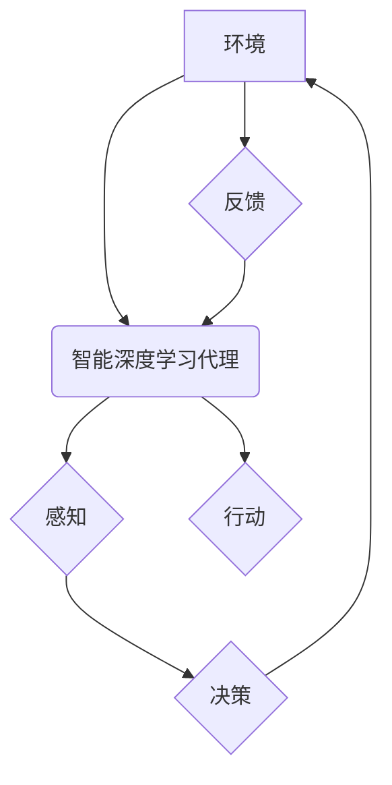

## AI人工智能深度学习算法：智能深度学习代理的使用强化学习优化决策

> 关键词：深度学习、强化学习、智能代理、决策优化、算法原理、实践应用、未来趋势

## 1. 背景介绍

在当今数据爆炸的时代，人工智能（AI）正以惊人的速度发展，深度学习作为AI的核心技术之一，在图像识别、自然语言处理、语音识别等领域取得了突破性的进展。然而，深度学习模型通常是静态的，缺乏对动态环境的适应能力。强化学习（Reinforcement Learning，RL）作为一种能够学习并优化决策策略的机器学习方法，为深度学习模型赋予了适应性和自主学习的能力。

智能深度学习代理（Intelligent Deep Learning Agents）是指能够感知环境、采取行动并通过强化学习算法优化决策的智能体。这些代理在各种复杂环境中展现出强大的应用潜力，例如机器人控制、游戏AI、自动驾驶、金融交易等。

## 2. 核心概念与联系

**2.1 深度学习**

深度学习是一种基于多层人工神经网络的机器学习方法。它能够从海量数据中学习复杂的特征表示，并用于各种任务，例如图像分类、文本生成、语音识别等。

**2.2 强化学习**

强化学习是一种基于交互学习的机器学习方法。智能代理通过与环境交互，根据环境反馈（奖励或惩罚）调整其行为策略，最终学习到最优的决策策略。

**2.3 智能深度学习代理**

智能深度学习代理将深度学习和强化学习相结合，能够学习并优化其在复杂环境中的决策策略。

**2.4  架构图**



## 3. 核心算法原理 & 具体操作步骤

**3.1 算法原理概述**

强化学习的核心思想是通过奖励机制引导智能代理学习最优的行为策略。智能代理在环境中采取行动，根据环境反馈获得奖励或惩罚。通过不断地学习和调整行为策略，智能代理最终能够最大化累积的奖励。

**3.2 算法步骤详解**

1. **环境建模:** 建立一个数学模型来描述环境的状态、动作和奖励。
2. **策略初始化:** 初始化智能代理的行为策略，例如随机策略或贪婪策略。
3. **环境交互:** 智能代理与环境交互，根据当前状态采取行动。
4. **奖励获取:** 环境根据智能代理的行动提供奖励或惩罚。
5. **策略更新:** 使用强化学习算法更新智能代理的行为策略，例如Q学习、SARSA等。
6. **重复步骤3-5:** 重复以上步骤，直到智能代理学习到最优的决策策略。

**3.3 算法优缺点**

**优点:**

* 能够学习复杂决策策略。
* 不需要明确的规则和模型。
* 能够适应动态环境。

**缺点:**

* 训练过程可能很长。
* 需要大量的训练数据。
* 容易陷入局部最优解。

**3.4 算法应用领域**

* 机器人控制
* 游戏AI
* 自动驾驶
* 金融交易
* 医疗诊断

## 4. 数学模型和公式 & 详细讲解 & 举例说明

**4.1 数学模型构建**

强化学习问题可以建模为一个马尔可夫决策过程（Markov Decision Process，MDP）。MDP由以下几个要素组成：

* 状态空间 S：环境可能存在的全部状态。
* 动作空间 A：智能代理可以采取的全部动作。
* 转移概率矩阵 P：描述从一个状态到另一个状态的概率。
* 奖励函数 R：描述智能代理在某个状态采取某个动作后获得的奖励。
* 折扣因子 γ：控制未来奖励的权重。

**4.2 公式推导过程**

Q学习算法的目标是学习一个状态-动作价值函数 Q(s, a)，该函数表示在状态 s 下采取动作 a 的期望累积奖励。

Q学习算法的更新规则如下：

$$Q(s, a) \leftarrow Q(s, a) + \alpha [r + \gamma \max_{a'} Q(s', a') - Q(s, a)]$$

其中：

* α：学习率
* r：在状态 s 下采取动作 a 后获得的奖励
* s'：状态 s 下采取动作 a 后转移到的下一个状态
* a'：在下一个状态 s' 中可以采取的动作

**4.3 案例分析与讲解**

例如，考虑一个简单的环境，智能代理在一个迷宫中寻找出口。

* 状态空间 S：迷宫中的所有位置。
* 动作空间 A：向上、向下、向左、向右四个方向。
* 转移概率矩阵 P：描述从一个位置移动到另一个位置的概率。
* 奖励函数 R：到达出口时获得最大奖励，其他情况下获得较小的奖励。

使用 Q学习算法，智能代理可以学习到在每个位置采取哪个方向移动可以获得最大的累积奖励，最终找到出口。

## 5. 项目实践：代码实例和详细解释说明

**5.1 开发环境搭建**

* Python 3.x
* TensorFlow 或 PyTorch 深度学习框架
* NumPy 科学计算库
* Matplotlib 数据可视化库

**5.2 源代码详细实现**

```python
import numpy as np
import tensorflow as tf

# 定义环境
class Environment:
    def __init__(self):
        #...

    def step(self, action):
        #...

# 定义 Q 学习算法
class QLearningAgent:
    def __init__(self, state_size, action_size, learning_rate=0.1, discount_factor=0.9):
        #...

    def learn(self, state, action, reward, next_state):
        #...

# 创建环境和智能代理
env = Environment()
agent = QLearningAgent(env.state_size, env.action_size)

# 训练智能代理
for episode in range(num_episodes):
    state = env.reset()
    while True:
        action = agent.choose_action(state)
        next_state, reward, done = env.step(action)
        agent.learn(state, action, reward, next_state)
        state = next_state
        if done:
            break

# 测试智能代理
state = env.reset()
while True:
    action = agent.choose_action(state)
    next_state, reward, done = env.step(action)
    state = next_state
    if done:
        break
```

**5.3 代码解读与分析**

* 环境类定义了环境的状态、动作、奖励和转移概率。
* Q学习算法类实现了 Q 值更新规则。
* 主程序创建了环境和智能代理，并进行训练和测试。

**5.4 运行结果展示**

训练完成后，智能代理能够在环境中完成任务，例如在迷宫中找到出口。

## 6. 实际应用场景

**6.1 机器人控制**

强化学习可以用于训练机器人控制策略，例如让机器人学会行走、抓取物体、导航等。

**6.2 游戏AI**

强化学习可以用于训练游戏AI，例如让游戏AI学会玩游戏、策略决策等。

**6.3 自动驾驶**

强化学习可以用于训练自动驾驶系统，例如让自动驾驶汽车学会避障、规划路线、控制速度等。

**6.4 金融交易**

强化学习可以用于训练金融交易策略，例如让交易系统学会买卖股票、管理风险等。

**6.5 未来应用展望**

随着人工智能技术的不断发展，强化学习在更多领域将发挥重要作用，例如医疗诊断、个性化推荐、自然语言处理等。

## 7. 工具和资源推荐

**7.1 学习资源推荐**

* **书籍:**
    * Reinforcement Learning: An Introduction by Richard S. Sutton and Andrew G. Barto
    * Deep Reinforcement Learning Hands-On by Maxim Lapan
* **课程:**
    * Deep Reinforcement Learning Specialization by DeepLearning.AI
    * Reinforcement Learning by David Silver (University of DeepMind)

**7.2 开发工具推荐**

* **TensorFlow:** https://www.tensorflow.org/
* **PyTorch:** https://pytorch.org/
* **OpenAI Gym:** https://gym.openai.com/

**7.3 相关论文推荐**

* Deep Q-Network (DQN)
* Proximal Policy Optimization (PPO)
* Trust Region Policy Optimization (TRPO)

## 8. 总结：未来发展趋势与挑战

**8.1 研究成果总结**

近年来，强化学习取得了显著进展，在各种应用领域取得了成功。

**8.2 未来发展趋势**

* **更强大的算法:** 研究更强大、更鲁棒的强化学习算法，例如能够解决更复杂问题的算法。
* **更有效的训练方法:** 研究更有效的训练方法，例如减少训练时间和数据需求。
* **更广泛的应用:** 将强化学习应用到更多领域，例如医疗、教育、金融等。

**8.3 面临的挑战**

* **样本效率:** 强化学习算法通常需要大量的训练数据，如何提高样本效率是一个重要的挑战。
* **可解释性:** 强化学习模型的决策过程通常难以解释，如何提高模型的可解释性是一个重要的研究方向。
* **安全性和可靠性:** 强化学习系统在实际应用中需要保证安全性和可靠性，如何确保系统安全可靠是一个重要的挑战。

**8.4 研究展望**

未来，强化学习将继续是一个重要的研究方向，其发展将推动人工智能技术的进步，并为人类社会带来更多福祉。

## 9. 附录：常见问题与解答

**9.1 Q: 强化学习和监督学习有什么区别？**

**A:** 强化学习和监督学习都是机器学习方法，但它们的区别在于数据类型和学习目标。监督学习使用标记数据训练模型，目标是预测输出变量。强化学习使用奖励信号训练模型，目标是学习最优的行为策略。

**9.2 Q: 强化学习算法有哪些？**

**A:** 常见的强化学习算法包括 Q 学习、SARSA、Deep Q-Network (DQN)、Proximal Policy Optimization (PPO)、Trust Region Policy Optimization (TRPO) 等。

**9.3 Q: 如何评估强化学习算法的性能？**

**A:** 强化学习算法的性能通常通过累积奖励来评估。更高的累积奖励表示更好的性能。

作者：禅与计算机程序设计艺术 / Zen and the Art of Computer Programming 


