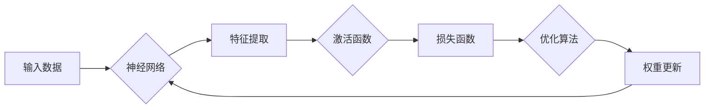

# AI人工智能深度学习算法：构建高效深度学习模型的基础

> 关键词：深度学习，神经网络，算法原理，模型优化，应用场景，实践教程

## 1. 背景介绍

随着计算机技术的发展，人工智能（AI）已成为当今科技领域的热门话题。深度学习作为AI的重要分支，凭借其强大的数据学习和处理能力，在图像识别、自然语言处理、语音识别等领域取得了显著的成果。本文将深入探讨深度学习算法的原理，并提供构建高效深度学习模型的基础知识。

## 2. 核心概念与联系

### 2.1 核心概念

#### 2.1.1 深度学习

深度学习是一种利用神经网络模型模拟人脑处理信息方式的机器学习技术。它通过多层神经网络对数据进行学习，逐步提取特征，最终实现复杂的模式识别和决策。

#### 2.1.2 神经网络

神经网络由多个相互连接的神经元组成，每个神经元接收输入信号，经过非线性变换后输出结果。神经网络通过不断学习和调整权重，实现对数据的分类、回归、聚类等任务。

#### 2.1.3 激活函数

激活函数为神经网络提供非线性特性，使模型能够学习复杂的数据分布。常见的激活函数有Sigmoid、ReLU、Tanh等。

#### 2.1.4 权重与偏置

权重和偏置是神经网络中的参数，用于控制信号在神经元之间的传递。通过优化这些参数，神经网络可以学习到更有效的特征表示。

#### 2.1.5 损失函数

损失函数用于衡量模型预测值与真实值之间的差异。常见的损失函数有均方误差（MSE）、交叉熵损失（Cross Entropy）等。

### 2.2 核心概念原理和架构的 Mermaid 流程图



### 2.3 核心概念联系

深度学习算法通过神经网络模拟人脑处理信息的过程，使用激活函数引入非线性特性，并通过权重和偏置调整模型参数。损失函数用于评估模型性能，优化算法用于更新参数，从而提高模型精度。

## 3. 核心算法原理 & 具体操作步骤

### 3.1 算法原理概述

深度学习算法的核心原理是多层神经网络，通过反向传播算法更新参数，最小化损失函数，实现数据的分类、回归、聚类等任务。

### 3.2 算法步骤详解

#### 3.2.1 数据预处理

- 数据清洗：去除异常值、缺失值等不完整数据。
- 数据归一化：将数据缩放到[0,1]或[-1,1]区间，提高训练效率。
- 数据增强：通过旋转、翻转、裁剪等方式扩充数据集，提高模型泛化能力。

#### 3.2.2 构建神经网络

- 选择合适的网络结构，如全连接神经网络、卷积神经网络、循环神经网络等。
- 设置激活函数，如ReLU、Sigmoid等。
- 初始化权重和偏置。

#### 3.2.3 损失函数

- 选择合适的损失函数，如MSE、交叉熵损失等。
- 计算模型预测值与真实值之间的差异。

#### 3.2.4 优化算法

- 选择合适的优化算法，如梯度下降、Adam等。
- 更新权重和偏置，最小化损失函数。

#### 3.2.5 模型评估

- 使用测试集评估模型性能。
- 调整模型参数，提高模型精度。

### 3.3 算法优缺点

#### 3.3.1 优点

- 强大的数据学习和处理能力。
- 适用于各种数据类型和任务。
- 能够学习到复杂的数据分布。

#### 3.3.2 缺点

- 训练数据需求量大。
- 计算资源消耗高。
- 难以解释模型决策过程。

### 3.4 算法应用领域

深度学习算法在以下领域取得了显著成果：

- 图像识别：人脸识别、物体检测、图像分类等。
- 自然语言处理：文本分类、机器翻译、语音识别等。
- 语音识别：语音到文本转换、语音合成等。
- 推荐系统：商品推荐、新闻推荐、电影推荐等。
- 医疗诊断：疾病诊断、药物研发、基因分析等。

## 4. 数学模型和公式 & 详细讲解 & 举例说明

### 4.1 数学模型构建

深度学习算法的数学模型主要包括：

- 神经元激活函数：
  $$f(x) = \sigma(x)$$
- 权重和偏置：
  $$
w = \{w_1, w_2, ..., w_n\}
$$
$$b = \{b_1, b_2, ..., b_n\}
$$
- 反向传播算法：
  $$
\Delta w = \alpha \cdot \frac{\partial J}{\partial w}
$$
  $$
\Delta b = \alpha \cdot \frac{\partial J}{\partial b}
$$

### 4.2 公式推导过程

以下以全连接神经网络为例，推导反向传播算法的公式。

#### 4.2.1 损失函数

假设损失函数为MSE：
$$
J = \frac{1}{2} \sum_{i=1}^n (y_i - \hat{y}_i)^2
$$

#### 4.2.2 梯度计算

计算损失函数对每个参数的梯度：
$$
\frac{\partial J}{\partial w_{ij}} = \frac{\partial J}{\partial \hat{y}_i} \cdot \frac{\partial \hat{y}_i}{\partial w_{ij}}
$$
$$
\frac{\partial J}{\partial b_j} = \frac{\partial J}{\partial \hat{y}_i} \cdot \frac{\partial \hat{y}_i}{\partial b_j}
$$

其中 $\hat{y}_i$ 为第 $i$ 个神经元的输出，$y_i$ 为真实标签。

#### 4.2.3 梯度下降

根据梯度计算结果，更新权重和偏置：
$$
w_{ij} \leftarrow w_{ij} - \alpha \cdot \frac{\partial J}{\partial w_{ij}}
$$
$$
b_j \leftarrow b_j - \alpha \cdot \frac{\partial J}{\partial b_j}
$$

### 4.3 案例分析与讲解

以一个简单的二分类问题为例，解释深度学习算法的原理。

#### 4.3.1 数据集

数据集包含两个特征 $x_1, x_2$ 和一个标签 $y$，其中 $y$ 为类别标签（0或1）。

#### 4.3.2 模型结构

选择一个简单的全连接神经网络，包含一个输入层、一个隐藏层和一个输出层。

#### 4.3.3 损失函数

选择MSE作为损失函数。

#### 4.3.4 训练过程

通过反向传播算法，不断更新模型参数，直至收敛。

#### 4.3.5 结果分析

经过训练后，模型能够根据新的输入数据预测类别标签。

## 5. 项目实践：代码实例和详细解释说明

### 5.1 开发环境搭建

- 安装Python环境，推荐使用Anaconda。
- 安装深度学习框架，如TensorFlow、PyTorch等。
- 安装相关库，如NumPy、Scikit-learn等。

### 5.2 源代码详细实现

以下使用TensorFlow实现上述二分类问题的深度学习模型：

```python
import tensorflow as tf
from tensorflow.keras.models import Sequential
from tensorflow.keras.layers import Dense

# 构建模型
model = Sequential([
    Dense(10, input_dim=2, activation='relu'),
    Dense(1, activation='sigmoid')
])

# 编译模型
model.compile(optimizer='adam', loss='mean_squared_error', metrics=['accuracy'])

# 训练模型
model.fit(X_train, y_train, epochs=100, batch_size=10, validation_data=(X_test, y_test))

# 评估模型
print(model.evaluate(X_test, y_test))
```

### 5.3 代码解读与分析

- `Sequential`：创建一个线性堆叠的模型，即一个顺序的层。
- `Dense`：全连接层，用于实现多层神经网络。
- `compile`：编译模型，设置优化器、损失函数和评估指标。
- `fit`：训练模型，使用训练数据对模型进行训练。
- `evaluate`：评估模型，在测试集上评估模型性能。

## 6. 实际应用场景

深度学习算法在以下场景中得到了广泛应用：

- 图像识别：人脸识别、物体检测、图像分类等。
- 自然语言处理：文本分类、机器翻译、语音识别等。
- 语音识别：语音到文本转换、语音合成等。
- 推荐系统：商品推荐、新闻推荐、电影推荐等。
- 医疗诊断：疾病诊断、药物研发、基因分析等。
- 金融领域：风险评估、欺诈检测、信用评分等。

## 7. 工具和资源推荐

### 7.1 学习资源推荐

- 《深度学习》
- 《Python深度学习》
- TensorFlow官方文档
- PyTorch官方文档

### 7.2 开发工具推荐

- TensorFlow
- PyTorch
- Keras
- Scikit-learn

### 7.3 相关论文推荐

- Deep Learning (Goodfellow et al., 2016)
- A Comprehensive Survey on Deep Learning for Natural Language Processing (Dai and Le, 2019)
- Deep Learning for Computer Vision: A Review (Wang et al., 2020)

## 8. 总结：未来发展趋势与挑战

### 8.1 研究成果总结

本文对深度学习算法的原理、应用场景和未来发展趋势进行了全面探讨。深度学习作为一种强大的机器学习技术，在各个领域取得了显著的成果。随着技术的不断发展，深度学习将在更多场景中得到应用，为人类社会带来更多创新和变革。

### 8.2 未来发展趋势

#### 8.2.1 模型轻量化

为了降低模型的计算复杂度和存储空间，模型轻量化将成为未来深度学习的一个重要趋势。

#### 8.2.2 可解释性

提高模型的可解释性，让模型决策过程更加透明，是深度学习技术的一个重要挑战。

#### 8.2.3 自适应学习

自适应学习能够在不断变化的环境中，自动调整模型参数，提高模型的泛化能力。

### 8.3 面临的挑战

#### 8.3.1 数据质量

高质量的数据是深度学习模型训练的基础，如何获取和清洗高质量数据是深度学习领域的一个重要挑战。

#### 8.3.2 计算资源

深度学习模型的训练需要大量的计算资源，如何优化计算资源的使用效率是深度学习领域的一个重要挑战。

#### 8.3.3 算法可解释性

提高模型的可解释性，让模型决策过程更加透明，是深度学习技术的一个重要挑战。

### 8.4 研究展望

未来，深度学习技术将在以下方向取得突破：

- 模型轻量化
- 可解释性
- 自适应学习
- 跨领域迁移学习
- 深度学习与物理定律的结合

深度学习技术的发展将推动人工智能技术的进步，为人类社会带来更多创新和变革。

## 9. 附录：常见问题与解答

**Q1：什么是深度学习？**

A1：深度学习是一种利用神经网络模型模拟人脑处理信息方式的机器学习技术。它通过多层神经网络对数据进行学习，逐步提取特征，最终实现复杂的模式识别和决策。

**Q2：深度学习算法有哪些优点？**

A2：深度学习算法具有强大的数据学习和处理能力，适用于各种数据类型和任务，能够学习到复杂的数据分布。

**Q3：深度学习算法有哪些应用领域？**

A3：深度学习算法在图像识别、自然语言处理、语音识别、推荐系统、医疗诊断、金融领域等领域得到了广泛应用。

**Q4：如何构建高效的深度学习模型？**

A4：构建高效的深度学习模型需要遵循以下原则：
- 选择合适的模型结构
- 使用合适的激活函数和优化算法
- 对数据进行预处理
- 优化模型参数
- 调整超参数
- 使用有效的正则化技术

**Q5：深度学习算法有哪些挑战？**

A5：深度学习算法面临的挑战包括数据质量、计算资源、算法可解释性等。

作者：禅与计算机程序设计艺术 / Zen and the Art of Computer Programming