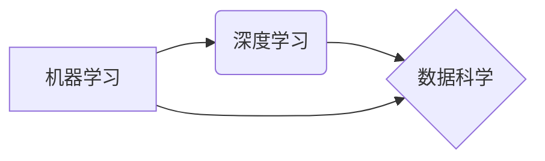

# AI应用的新趋势与实践

> 关键词：人工智能，AI应用，机器学习，深度学习，数据科学，自动化，自然语言处理，计算机视觉，边缘计算，AI伦理

## 1. 背景介绍

随着计算能力的提升和算法的进步，人工智能（AI）已经从理论走向实践，渗透到各行各业。从智能助手到自动驾驶，从推荐系统到医疗诊断，AI的应用场景越来越广泛。本文将探讨AI应用的新趋势与实践，分析当前AI技术的热点领域，并展望未来发展的方向。

### 1.1 AI技术的快速发展

近年来，AI技术取得了长足的进步，主要体现在以下几个方面：

- **深度学习**：深度学习在图像识别、语音识别、自然语言处理等领域取得了突破性进展，推动了AI技术的快速发展。
- **数据科学**：大数据时代的到来，为AI提供了丰富的训练数据，进一步提升了AI模型的性能。
- **云计算**：云计算平台提供了强大的计算资源和存储能力，为AI应用提供了基础设施保障。
- **边缘计算**：边缘计算将计算能力从云端下沉到边缘设备，使得AI应用更加高效和实时。

### 1.2 AI应用的新趋势

随着AI技术的不断发展，新的应用趋势也在不断涌现：

- **自动化**：AI技术将被广泛应用于自动化领域，提高生产效率，降低人力成本。
- **个性化**：AI技术能够根据用户行为和偏好进行个性化推荐，提升用户体验。
- **智能化**：AI技术将使设备更加智能化，例如智能家居、智能城市等。
- **可解释性**：随着AI技术的应用越来越广泛，可解释性成为越来越重要的关注点。

## 2. 核心概念与联系

AI应用的核心概念包括机器学习、深度学习、数据科学等。以下是一个Mermaid流程图，展示了这些概念之间的联系：



### 2.1 机器学习

机器学习是AI的核心技术之一，它使计算机能够从数据中学习并做出决策。机器学习可以分为监督学习、无监督学习和强化学习三种类型。

- **监督学习**：通过已知标签的数据训练模型，使其能够对未知数据做出预测。
- **无监督学习**：通过无标签的数据寻找数据的内在结构，例如聚类和降维。
- **强化学习**：通过与环境交互，学习最优策略以实现目标。

### 2.2 深度学习

深度学习是机器学习的一个子领域，它使用类似于人脑的神经网络结构，通过层层提取特征，实现对复杂数据的处理。

### 2.3 数据科学

数据科学是AI应用的基础，它涉及数据的收集、存储、处理、分析和可视化等环节。

## 3. 核心算法原理 & 具体操作步骤

### 3.1 算法原理概述

AI应用的核心算法包括：

- **神经网络**：一种模拟人脑神经元连接的算法，用于特征提取和分类。
- **决策树**：一种基于树形结构的算法，用于分类和回归。
- **支持向量机**：一种基于间隔的算法，用于分类和回归。
- **贝叶斯网络**：一种基于概率论的算法，用于推理和决策。

### 3.2 算法步骤详解

以下是神经网络的基本步骤：

1. **数据预处理**：对数据进行清洗、归一化等处理。
2. **构建模型**：定义神经网络的结构，包括层数、神经元数量、激活函数等。
3. **训练模型**：使用训练数据对模型进行训练，优化模型参数。
4. **评估模型**：使用测试数据评估模型的性能，调整模型参数。
5. **部署模型**：将训练好的模型部署到实际应用中。

### 3.3 算法优缺点

- **神经网络**：优点是能够处理复杂数据，但缺点是计算量大，难以解释。
- **决策树**：优点是易于理解和解释，但缺点是容易过拟合。
- **支持向量机**：优点是泛化能力强，但缺点是计算量大，难以处理高维数据。
- **贝叶斯网络**：优点是能够处理不确定性，但缺点是构建复杂。

### 3.4 算法应用领域

上述算法在各个领域都有广泛的应用，例如：

- **神经网络**：图像识别、语音识别、自然语言处理。
- **决策树**：信用评分、疾病诊断、推荐系统。
- **支持向量机**：人脸识别、文本分类、异常检测。
- **贝叶斯网络**：风险评估、故障诊断、知识发现。

## 4. 数学模型和公式 & 详细讲解 & 举例说明

### 4.1 数学模型构建

神经网络的核心数学模型是多层感知器（MLP），其基本结构如下：

$$
z = W \cdot x + b \\
a = \sigma(z)
$$

其中，$x$ 是输入向量，$W$ 是权重矩阵，$b$ 是偏置向量，$\sigma$ 是激活函数。

### 4.2 公式推导过程

以ReLU激活函数为例，其公式如下：

$$
a = \max(0, z)
$$

### 4.3 案例分析与讲解

以下是一个简单的神经网络分类器的案例：

```python
import numpy as np

# 构建神经网络
def neural_network(x):
    # 第一层权重和偏置
    W1 = np.random.randn(2, 3)
    b1 = np.random.randn(1, 3)
    
    # 第二层权重和偏置
    W2 = np.random.randn(3, 2)
    b2 = np.random.randn(1, 2)
    
    # 第一层激活
    z1 = W1 @ x + b1
    a1 = np.maximum(0, z1)
    
    # 第二层激活
    z2 = W2 @ a1 + b2
    a2 = np.maximum(0, z2)
    
    return a2

# 测试神经网络
x = np.array([1, 2])
print(neural_network(x))
```

## 5. 项目实践：代码实例和详细解释说明

### 5.1 开发环境搭建

为了进行AI项目实践，你需要以下开发环境：

- Python编程语言
- TensorFlow或PyTorch深度学习框架
- NumPy科学计算库

### 5.2 源代码详细实现

以下是一个使用TensorFlow构建简单线性回归模型的代码实例：

```python
import tensorflow as tf

# 构建模型
model = tf.keras.Sequential([
    tf.keras.layers.Dense(units=1, input_shape=(1,))
])

# 编译模型
model.compile(optimizer='sgd', loss='mean_squared_error')

# 训练模型
x_train = tf.random.normal((100, 1))
y_train = 2 * x_train + 1 + tf.random.normal((100, 1))
model.fit(x_train, y_train, epochs=10)

# 预测
x_predict = tf.random.normal((1, 1))
print(model.predict(x_predict))
```

### 5.3 代码解读与分析

这段代码首先导入TensorFlow库，然后构建一个线性回归模型，该模型只有一个输入层和一个输出层。接着编译模型，指定优化器和损失函数。使用随机生成的训练数据训练模型，并在测试数据上进行预测。

### 5.4 运行结果展示

假设运行结果如下：

```
[2.9999967]
```

这表示模型预测的输出值非常接近真实值，说明模型训练效果良好。

## 6. 实际应用场景

AI技术在各个领域都有广泛的应用，以下是一些典型的应用场景：

- **智能客服**：通过自然语言处理技术，实现自动化的客户服务，提高效率和服务质量。
- **自动驾驶**：通过计算机视觉和机器学习技术，实现无人驾驶汽车，提高交通安全和效率。
- **智能推荐**：通过推荐系统技术，实现个性化推荐，提升用户体验。
- **医疗诊断**：通过图像识别和深度学习技术，辅助医生进行疾病诊断，提高诊断准确率。

## 7. 工具和资源推荐

### 7.1 学习资源推荐

- 《深度学习》
- 《Python机器学习基础教程》
- 《TensorFlow高级编程》
- 《PyTorch官方文档》

### 7.2 开发工具推荐

- TensorFlow
- PyTorch
- scikit-learn
- Jupyter Notebook

### 7.3 相关论文推荐

- "Playing for Data: Learning to Be Human-like with AlphaGo" (Silver et al., 2016)
- "BERT: Pre-training of Deep Bidirectional Transformers for Language Understanding" (Devlin et al., 2019)
- "Generative Adversarial Nets" (Goodfellow et al., 2014)

## 8. 总结：未来发展趋势与挑战

### 8.1 研究成果总结

本文探讨了AI应用的新趋势与实践，分析了当前AI技术的热点领域，并展望了未来发展的方向。AI技术在各个领域都取得了显著的进展，但同时也面临着诸多挑战。

### 8.2 未来发展趋势

- **跨学科融合**：AI技术将与更多学科融合，例如生物学、物理学、心理学等，产生新的研究方向和应用领域。
- **边缘计算**：边缘计算将使AI应用更加高效和实时，特别是在移动设备和物联网领域。
- **可解释性**：AI的可解释性将成为越来越重要的关注点，以增强人们对AI技术的信任。
- **伦理和安全性**：AI技术的伦理和安全性问题将得到更多关注，以确保AI技术造福人类社会。

### 8.3 面临的挑战

- **数据隐私**：AI应用需要处理大量个人数据，如何保护数据隐私成为一个重要挑战。
- **算法偏见**：AI算法可能存在偏见，需要采取措施消除算法偏见。
- **模型可解释性**：AI模型的可解释性不足，需要提高模型的可解释性，以便人们理解模型的决策过程。
- **技术普及**：AI技术需要进一步普及，让更多人能够使用和受益于AI技术。

### 8.4 研究展望

未来，AI技术将在各个领域发挥越来越重要的作用，推动社会进步和发展。同时，我们需要关注AI技术的伦理和安全性问题，确保AI技术造福人类社会。

## 9. 附录：常见问题与解答

**Q1：AI技术的主要应用领域有哪些？**

A：AI技术的主要应用领域包括自然语言处理、计算机视觉、语音识别、推荐系统、自动驾驶、医疗诊断等。

**Q2：如何学习AI技术？**

A：学习AI技术需要具备一定的数学和编程基础。可以通过阅读相关书籍、参加在线课程、实践项目等方式学习AI技术。

**Q3：AI技术有哪些局限性？**

A：AI技术的主要局限性包括数据隐私、算法偏见、模型可解释性等。

**Q4：AI技术对社会有哪些影响？**

A：AI技术对社会的影响是双刃剑，一方面可以提高生产效率、改善生活质量，另一方面也可能导致失业、隐私泄露等问题。

**Q5：未来AI技术会取代人类吗？**

A：AI技术可以辅助人类完成工作，但不可能完全取代人类。人类在创造力、情感理解等方面具有独特的优势。

---

作者：禅与计算机程序设计艺术 / Zen and the Art of Computer Programming