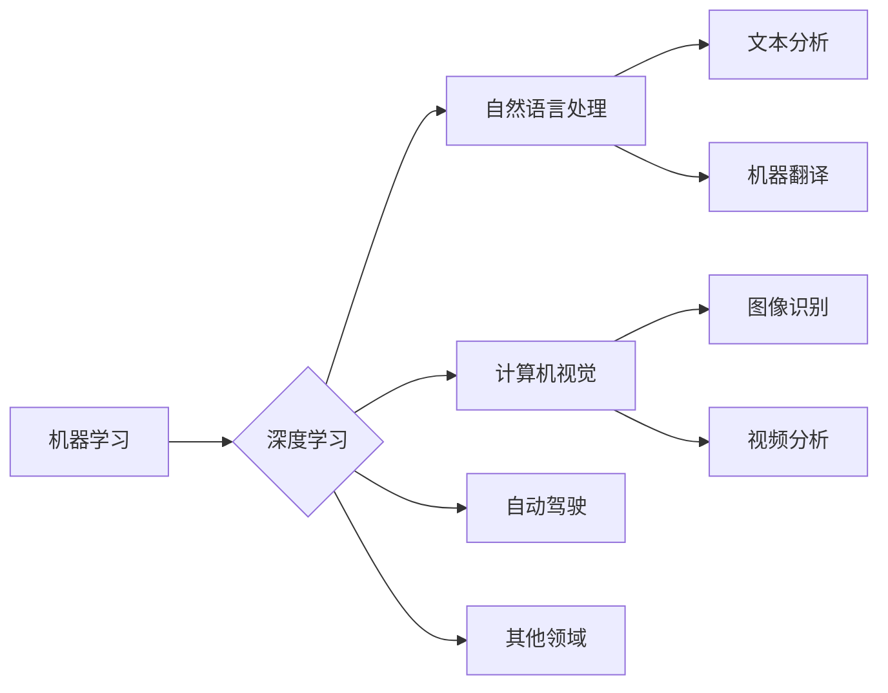

> 人工智能，机器学习，深度学习，自动驾驶，自然语言处理，智能推荐，Andrej Karpathy，未来趋势，技术挑战

# Andrej Karpathy：人工智能的未来发展机遇

人工智能（AI）作为当今科技领域的明星，正以前所未有的速度和深度改变着我们的世界。Andrej Karpathy，作为深度学习领域的知名专家和苹果公司AI团队的前负责人，他的工作对AI的发展产生了深远的影响。本文将探讨Andrej Karpathy对人工智能未来发展的看法，以及他所预见的发展机遇。

## 1. 背景介绍

Andrej Karpathy在AI领域的贡献主要体现在自然语言处理（NLP）和机器学习（ML）领域。他曾任职于OpenAI，参与了GPT-3等革命性项目的开发。在加入苹果公司后，他领导了Siri语音助手的技术发展，推动了语音识别和自然语言理解技术的进步。Karpathy对AI的未来发展充满期待，并提出了许多有见地的观点。

## 2. 核心概念与联系

### 2.1 AI的核心概念

人工智能的核心概念包括：

- **机器学习（ML）**：机器学习是AI的一个子领域，它使计算机系统能够从数据中学习并做出决策或预测，而无需显式编程。

- **深度学习（DL）**：深度学习是一种特殊的机器学习方法，它使用多层神经网络来模拟人脑处理信息的方式。

- **自然语言处理（NLP）**：NLP是AI的一个分支，它使计算机能够理解、解释和生成人类语言。

- **计算机视觉**：计算机视觉是AI的一个分支，它使计算机能够通过图像和视频理解周围的世界。

- **自动驾驶**：自动驾驶是AI在交通领域的应用，它使汽车能够在没有人类司机的情况下行驶。

### 2.2 Mermaid 流程图

以下是一个简化的Mermaid流程图，展示了AI的核心概念及其相互关系：



## 3. 核心算法原理 & 具体操作步骤

### 3.1 算法原理概述

AI的核心算法原理是基于数据学习模式和知识。深度学习通过多层神经网络模拟人脑的学习过程，从而能够从数据中学习复杂的模式。

### 3.2 算法步骤详解

AI算法的步骤通常包括：

1. **数据收集**：收集用于训练的数据。

2. **数据预处理**：清洗和格式化数据，以便于模型处理。

3. **模型选择**：选择合适的模型架构，如卷积神经网络（CNN）或递归神经网络（RNN）。

4. **模型训练**：使用训练数据训练模型。

5. **模型评估**：使用验证数据评估模型的性能。

6. **模型部署**：将训练好的模型部署到实际应用中。

### 3.3 算法优缺点

- **优点**：AI算法能够处理大量数据，并从数据中学习复杂的模式，从而做出准确的预测或决策。

- **缺点**：AI算法需要大量的数据和计算资源，并且可能难以解释其决策过程。

### 3.4 算法应用领域

AI算法在以下领域有广泛的应用：

- **医疗**：诊断疾病、个性化治疗。

- **金融**：风险评估、欺诈检测。

- **交通**：自动驾驶、交通流量管理。

- **零售**：个性化推荐、库存管理。

## 4. 数学模型和公式 & 详细讲解 & 举例说明

### 4.1 数学模型构建

深度学习模型通常基于以下数学模型：

- **神经网络**：由多个神经元组成的层次化结构，用于处理和传递数据。

- **损失函数**：用于衡量模型预测与实际结果之间的差异。

- **优化算法**：用于调整模型参数，以最小化损失函数。

### 4.2 公式推导过程

以下是一个简单的神经网络损失函数的例子：

$$
L = \frac{1}{2} \sum_{i=1}^{N} (y_i - \hat{y}_i)^2
$$

其中，$y_i$ 是真实标签，$\hat{y}_i$ 是模型预测的标签。

### 4.3 案例分析与讲解

以自动驾驶为例，我们可以使用卷积神经网络（CNN）来识别道路上的行人。首先，我们收集大量的带有标签的图像数据。然后，我们使用CNN对图像进行特征提取，并通过损失函数评估模型的性能。最后，我们调整模型参数，以最小化损失函数，从而提高模型的准确率。

## 5. 项目实践：代码实例和详细解释说明

### 5.1 开发环境搭建

为了进行AI项目实践，我们需要以下开发环境：

- 编程语言：Python

- 深度学习框架：TensorFlow或PyTorch

- 计算机硬件：GPU（推荐NVIDIA）

### 5.2 源代码详细实现

以下是一个使用TensorFlow构建简单神经网络模型的基本代码示例：

```python
import tensorflow as tf

# 创建模型
model = tf.keras.Sequential([
    tf.keras.layers.Flatten(input_shape=(28, 28)),
    tf.keras.layers.Dense(128, activation='relu'),
    tf.keras.layers.Dense(10, activation='softmax')
])

# 编译模型
model.compile(optimizer='adam',
              loss='sparse_categorical_crossentropy',
              metrics=['accuracy'])

# 训练模型
model.fit(x_train, y_train, epochs=5)

# 评估模型
model.evaluate(x_test, y_test)
```

### 5.3 代码解读与分析

这段代码定义了一个简单的神经网络模型，用于识别手写数字。模型由两个密集层（全连接层）组成，第一个层有128个神经元，第二个层有10个神经元（对应10个数字类别）。使用Adam优化器和交叉熵损失函数进行编译和训练。

### 5.4 运行结果展示

在完成模型训练后，我们可以使用测试集来评估模型的性能。如果模型性能良好，它应该能够正确地识别手写数字。

## 6. 实际应用场景

### 6.1 自动驾驶

自动驾驶是AI在交通领域的一个重要应用。通过使用计算机视觉和传感器数据，自动驾驶汽车可以识别道路上的行人和车辆，并做出相应的决策。

### 6.2 智能推荐

智能推荐系统，如Netflix和Amazon，使用AI来分析用户行为和偏好，从而为用户提供个性化的推荐。

### 6.3 自然语言处理

NLP技术被广泛应用于聊天机器人、翻译服务和情感分析等领域。

## 7. 工具和资源推荐

### 7.1 学习资源推荐

- Coursera的《机器学习》课程

- TensorFlow官方文档

- PyTorch官方文档

### 7.2 开发工具推荐

- Jupyter Notebook

- Google Colab

- AWS机器学习平台

### 7.3 相关论文推荐

- "ImageNet Classification with Deep Convolutional Neural Networks" by Krizhevsky et al.

- "Sequence to Sequence Learning with Neural Networks" by Sutskever et al.

## 8. 总结：未来发展趋势与挑战

### 8.1 研究成果总结

AI技术在过去几十年取得了巨大的进步，从简单的分类任务到复杂的决策制定，AI已经证明了其强大的能力。

### 8.2 未来发展趋势

- AI将继续向更复杂、更智能的方向发展。

- AI将与其他技术（如物联网、区块链等）融合，创造新的应用场景。

- AI将变得更加普及，成为日常生活的一部分。

### 8.3 面临的挑战

- AI的安全性和伦理问题需要得到解决。

- AI的隐私保护需要得到加强。

- AI的技术普及需要更多的教育和培训。

### 8.4 研究展望

未来的AI研究将集中在以下方面：

- 开发更加安全、可靠和可解释的AI系统。

- 探索AI在不同领域的应用，如医疗、教育、环境等。

- 研究AI的伦理和道德问题，确保AI技术的发展符合人类社会的价值观。

## 9. 附录：常见问题与解答

**Q1：AI是否会取代人类？**

A: AI不会取代人类，而是与人类协作，提高生产力和生活质量。

**Q2：AI是否会导致失业？**

A: AI可能会导致某些行业的就业岗位减少，但也会创造新的就业机会。

**Q3：AI的安全性和伦理问题如何解决？**

A: 需要制定相应的法律法规，并加强AI技术的伦理研究。

**Q4：AI的未来发展趋势是什么？**

A: AI将继续向更加智能、更加普及的方向发展。

**Q5：如何学习AI技术？**

A: 可以通过在线课程、书籍和实际项目来学习AI技术。

---

作者：禅与计算机程序设计艺术 / Zen and the Art of Computer Programming