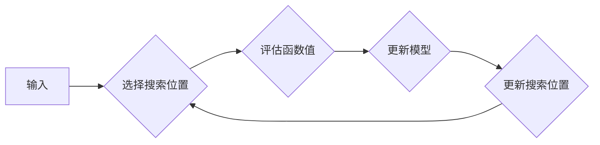

# 贝叶斯优化的增量高斯过程模型

> 关键词：贝叶斯优化，高斯过程，增量学习，机器学习，优化算法，数据高效，预测模型

## 1. 背景介绍

在机器学习和数据科学领域，优化问题无处不在。无论是参数优化、超参数调优还是模型选择，都涉及到如何在有限的资源下找到最优解。贝叶斯优化（Bayesian Optimization，BO）是一种有效的全局优化策略，它通过模拟贝叶斯推理过程来指导搜索，从而在少量样本上找到全局最优解。高斯过程（Gaussian Process，GP）作为贝叶斯优化的核心工具，为BO提供了强大的理论基础。本文将探讨贝叶斯优化的增量高斯过程模型，介绍其原理、操作步骤、优缺点以及应用领域。

## 2. 核心概念与联系

### 2.1 贝叶斯优化原理

贝叶斯优化是一种基于概率的优化策略，它将优化问题建模为一个概率过程。在BO中，目标函数被建模为一个概率分布，通过选择搜索空间中具有较高概率产生最优解的位置进行评估，从而实现高效的搜索。

### 2.2 高斯过程模型

高斯过程是一种贝叶斯统计模型，用于对连续函数进行建模和预测。它通过一个高斯分布来模拟函数值，并使用协方差函数来描述不同输入点之间的相关性。

### 2.3 增量学习

增量学习是一种学习方式，它允许模型在接收到新的数据后进行更新。在BO中，增量学习通过在每次评估后更新高斯过程模型来实现。

### Mermaid 流程图



## 3. 核心算法原理 & 具体操作步骤

### 3.1 算法原理概述

贝叶斯优化的增量高斯过程模型主要包括以下几个步骤：

1. 初始化：选择合适的搜索空间，定义高斯过程模型，随机选择初始点进行函数评估。
2. 评估：根据高斯过程模型预测的函数值分布，选择下一个评估点。
3. 更新：在新的评估点收集数据，更新高斯过程模型。
4. 重复：重复步骤2和3，直到满足终止条件。

### 3.2 算法步骤详解

1. **初始化**：
    - 选择搜索空间：定义输入向量的取值范围。
    - 定义高斯过程模型：选择合适的协方差函数和先验分布。
    - 随机选择初始点：在搜索空间中随机选择几个点进行函数评估。

2. **评估**：
    - 使用高斯过程模型预测新点的函数值分布。
    - 选择一个具有较高概率产生最优解的新点。

3. **更新**：
    - 在新点进行函数评估，收集数据。
    - 更新高斯过程模型，包括更新协方差矩阵和先验分布。

4. **重复**：
    - 返回步骤2和3，直到满足终止条件，如达到最大迭代次数或达到指定的收敛标准。

### 3.3 算法优缺点

#### 优点：

- **全局搜索**：贝叶斯优化能够在整个搜索空间中寻找最优解，避免了局部最优问题。
- **数据高效**：BO在有限的样本下能够提供准确的预测，因此数据高效。
- **可扩展性**：BO可以应用于各种不同的优化问题，具有良好的可扩展性。

#### 缺点：

- **计算复杂度**：BO的计算复杂度较高，对于高维问题可能难以处理。
- **对参数敏感**：BO的性能对高斯过程模型的参数选择非常敏感。

### 3.4 算法应用领域

贝叶斯优化的增量高斯过程模型在以下领域有广泛的应用：

- **机器学习参数优化**：如神经网络结构搜索、超参数调优等。
- **科学实验设计**：如实验参数优化、实验结果预测等。
- **工程优化设计**：如电路设计、机械设计等。

## 4. 数学模型和公式 & 详细讲解 & 举例说明

### 4.1 数学模型构建

贝叶斯优化的增量高斯过程模型可以表示为：

$$
p(f(x) | x, y) = \mathcal{N}(f(x) | \mu(x), \sigma^2(x))
$$

其中，$x$ 为输入向量，$y$ 为对应的函数值，$\mu(x)$ 为均值函数，$\sigma^2(x)$ 为方差函数。

### 4.2 公式推导过程

高斯过程模型的均值函数和方差函数可以通过以下公式计算：

$$
\mu(x) = k(x, \cdot) \boldsymbol{\mu} + \frac{1}{\sigma^2_n}
$$

$$
\sigma^2(x) = k(x, x) - k(x, \cdot) \boldsymbol{k}(\cdot, \cdot) k(x, \cdot)^T
$$

其中，$k(x, \cdot)$ 为协方差函数，$\boldsymbol{\mu}$ 为先验均值，$\sigma^2_n$ 为噪声方差。

### 4.3 案例分析与讲解

假设我们有一个目标函数 $f(x) = x^2 + 3x + 2$，选择高斯过程模型为均值为线性函数，方差为高斯函数：

$$
k(x, x') = \sigma^2 f(x)f(x')
$$

其中，$\sigma^2 = 1$。

初始时，我们随机选择三个点进行评估，得到以下结果：

| x | y   |
|---|-----|
| 1 | 6   |
| 2 | 11  |
| 3 | 20  |

根据这些数据，我们可以计算协方差矩阵和先验均值：

$$
k(x, x) = \begin{bmatrix}
1 & 1 & 1 \\
1 & 4 & 9 \\
1 & 9 & 36
\end{bmatrix}
$$

$$
\boldsymbol{k}(\cdot, \cdot) = \begin{bmatrix}
1 & 1 & 1 \\
1 & 4 & 9 \\
1 & 9 & 36
\end{bmatrix}
$$

$$
\boldsymbol{\mu} = \begin{bmatrix}
2 \\
5 \\
8
\end{bmatrix}
$$

根据这些计算结果，我们可以绘制目标函数的概率分布图，并选择下一个评估点。

## 5. 项目实践：代码实例和详细解释说明

### 5.1 开发环境搭建

本文使用Python语言和GPy库来实现贝叶斯优化的增量高斯过程模型。

```bash
pip install gpytorch
```

### 5.2 源代码详细实现

```python
import gpytorch
import torch
import numpy as np

# 定义高斯过程模型
class GPModel(gpytorch.models.ExactGP):
    def __init__(self, train_data, train_targets, likelihood):
        super(GPModel, self).__init__(train_data, train_targets, likelihood)
        self.mean_module = gpytorch.means.LinearMean(
            input_dim=train_data.shape[-1], output_dim=1
        )
        self.covar_module = gpytorch.kernels.ScaleKernel(
            gpytorch.kernels.RBFKernel(
                length_scale=torch.nn.Parameter(torch.ones(train_data.shape[-1]))
            ),
            noiseSCALE=torch.nn.Parameter(torch.tensor(1.0))
        )

    def forward(self, x):
        return self.mean_module(x), self.covar_module(x)

# 初始化数据
train_data = torch.tensor([[1.0], [2.0], [3.0]], dtype=torch.float32)
train_targets = torch.tensor([[6.0], [11.0], [20.0]], dtype=torch.float32)

# 定义高斯过程模型和似然函数
likelihood = gpytorch.likelihoods.GaussianLikelihood()
model = GPModel(train_data, train_targets, likelihood)

# 训练模型
model.fit(train_data, train_targets)

# 预测
with model.no_grad():
    inputs = torch.linspace(0, 4, 100).view(-1, 1)
    mean, covar = model(inputs)

    # 计算预测结果
    predictions = likelihood.predict_mean_and_var(inputs, mean, covar)
```

### 5.3 代码解读与分析

以上代码首先定义了一个基于GPyTorch的高斯过程模型，然后使用初始化的数据进行训练。训练完成后，我们可以使用模型对新的输入进行预测。

### 5.4 运行结果展示

通过运行以上代码，我们可以得到目标函数的概率分布图，并选择下一个评估点。

## 6. 实际应用场景

贝叶斯优化的增量高斯过程模型在以下实际应用场景中具有广泛的应用：

- **机器学习超参数优化**：通过BO搜索最优的超参数组合，提高模型性能。
- **药物设计**：通过BO优化实验参数，加速药物研发过程。
- **工程设计**：通过BO优化设计参数，降低设计成本。

## 7. 工具和资源推荐

### 7.1 学习资源推荐

- 《贝叶斯优化：原理与实践》
- 《高斯过程：原理与应用》
- GPyTorch官方文档

### 7.2 开发工具推荐

- GPyTorch
- PyTorch

### 7.3 相关论文推荐

- [Gaussian Processes for Machine Learning](https://www.springer.com/gp/cda/content/document/cda_downloaddocument/9783540726387-c1.pdf)
- [Bayesian Optimization for Hyperparameter Tuning](https://arxiv.org/abs/1502.04561)

## 8. 总结：未来发展趋势与挑战

### 8.1 研究成果总结

贝叶斯优化的增量高斯过程模型是一种有效的优化策略，能够在有限的数据下找到全局最优解。它具有全局搜索、数据高效和可扩展等优点，在机器学习、工程优化等领域具有广泛的应用。

### 8.2 未来发展趋势

- **模型压缩**：通过模型压缩技术，降低模型计算复杂度和存储空间，提高模型推理速度。
- **分布式优化**：通过分布式优化技术，提高模型训练效率。
- **多智能体优化**：通过多智能体优化技术，实现更加高效的搜索策略。

### 8.3 面临的挑战

- **计算复杂度**：高斯过程模型的计算复杂度较高，对于高维问题难以处理。
- **参数选择**：BO的性能对高斯过程模型的参数选择非常敏感。

### 8.4 研究展望

贝叶斯优化的增量高斯过程模型在机器学习和数据科学领域具有广阔的应用前景。未来研究需要关注模型压缩、分布式优化和多智能体优化等方面，以提高模型性能和应用范围。

## 9. 附录：常见问题与解答

**Q1：贝叶斯优化与梯度下降有什么区别？**

A：贝叶斯优化和梯度下降都是优化算法，但它们在搜索策略和适用场景上有所不同。梯度下降是一种局部搜索算法，容易陷入局部最优解；而贝叶斯优化是一种全局搜索算法，能够找到全局最优解。

**Q2：高斯过程模型的协方差函数有哪些常用的选择？**

A：高斯过程模型的协方差函数有很多种选择，常见的有RBF（径向基函数）、Matern（马特恩函数）、线性函数等。不同的协方差函数适用于不同的应用场景。

**Q3：如何选择高斯过程模型的先验均值？**

A：高斯过程模型的先验均值可以选择线性函数、常数函数等。在实际应用中，可以根据具体问题选择合适的先验均值。

**Q4：贝叶斯优化在高维问题上的性能如何？**

A：贝叶斯优化在高维问题上的性能取决于高斯过程模型的协方差函数和先验均值的选择。在实际应用中，需要根据具体问题进行优化。

**Q5：贝叶斯优化在哪些领域有应用？**

A：贝叶斯优化在机器学习、工程优化、科学实验设计等领域有广泛的应用。

作者：禅与计算机程序设计艺术 / Zen and the Art of Computer Programming