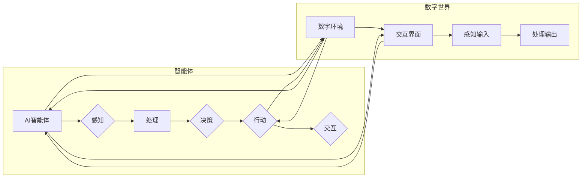

> AI智能体, 数字世界, 交互范式, 自然语言处理, 机器学习, 交互设计, 智能助手, 人机协作

# AI智能体与数字世界的交互

随着人工智能技术的飞速发展，AI智能体（Agent）已成为构建智能系统、实现人机交互的核心组件。本文将深入探讨AI智能体与数字世界交互的原理、实践和未来趋势，旨在为读者提供一个全面、深入的视角。

## 1. 背景介绍

### 1.1 问题的由来

传统的人机交互方式主要依赖于键盘、鼠标等物理设备，这种交互方式在信息时代初期发挥了重要作用。然而，随着互联网的普及和智能手机的兴起，用户对交互方式的期望越来越高。人们希望与智能系统进行更加自然、流畅的交流，而AI智能体正是满足这一需求的关键技术。

### 1.2 研究现状

近年来，AI智能体在自然语言处理（NLP）、计算机视觉、机器学习等领域取得了显著进展。基于这些技术，AI智能体能够理解用户的意图，处理复杂任务，并在数字世界中与用户进行交互。

### 1.3 研究意义

AI智能体与数字世界的交互研究具有重要的理论意义和应用价值：

- **理论研究**：推动人工智能理论的发展，探索人机交互的新范式。
- **应用价值**：提升用户体验，提高生产效率，促进智能系统的普及。

### 1.4 本文结构

本文将围绕以下内容展开：

- 介绍AI智能体与数字世界交互的核心概念和架构。
- 分析AI智能体的核心算法原理和具体操作步骤。
- 探讨数学模型和公式在AI智能体交互中的应用。
- 展示AI智能体与数字世界交互的代码实例和运行结果。
- 分析AI智能体在不同应用场景中的实际应用。
- 展望AI智能体与数字世界交互的未来发展趋势和挑战。

## 2. 核心概念与联系

### 2.1 核心概念

#### AI智能体

AI智能体是具备一定智能能力的软件或硬件实体，能够在数字世界中独立地执行任务、做出决策，并与人类或其他智能体进行交互。

#### 数字世界

数字世界是指由计算机、网络、移动设备等组成的虚拟环境，包括互联网、物联网、虚拟现实、增强现实等。

#### 交互范式

交互范式是指人机交互的方式和模式，包括命令行交互、图形界面交互、自然语言交互等。

### 2.2 核心概念原理和架构的 Mermaid 流程图



在上述流程图中，AI智能体通过感知输入获取数字世界的状态，处理后进行决策，并采取行动对数字世界产生影响。同时，智能体与数字世界通过交互界面进行信息交换。

## 3. 核心算法原理 & 具体操作步骤

### 3.1 算法原理概述

AI智能体的核心算法主要包括：

- 感知算法：用于获取数字世界的信息。
- 处理算法：用于对感知到的信息进行处理和分析。
- 决策算法：用于根据处理结果做出决策。
- 行动算法：用于执行决策。

### 3.2 算法步骤详解

#### 感知算法

感知算法主要包括以下步骤：

1. 采集信息：通过传感器、摄像头等设备采集数字世界的信息。
2. 数据预处理：对采集到的信息进行清洗、归一化等预处理操作。
3. 特征提取：从预处理后的数据中提取关键特征。

#### 处理算法

处理算法主要包括以下步骤：

1. 数据建模：根据特征建立数据模型。
2. 模型训练：使用训练数据对模型进行训练。
3. 模型评估：评估模型的性能。

#### 决策算法

决策算法主要包括以下步骤：

1. 状态评估：评估当前数字世界的状态。
2. 目标设定：根据状态评估结果设定目标。
3. 决策制定：根据目标制定决策。

#### 行动算法

行动算法主要包括以下步骤：

1. 行动执行：根据决策结果执行行动。
2. 结果反馈：收集行动结果并反馈给处理算法。

### 3.3 算法优缺点

#### 优点

- 提高效率：自动化处理任务，提高生产效率。
- 增强用户体验：提供更加自然、流畅的交互方式。
- 降低成本：减少人力成本，降低维护成本。

#### 缺点

- 依赖技术：需要依赖先进的感知、处理、决策和行动技术。
- 数据依赖：需要大量高质量的数据进行训练和评估。
- 稳定性问题：在复杂环境下，智能体的稳定性可能受到影响。

### 3.4 算法应用领域

AI智能体在以下领域有广泛的应用：

- 智能家居：通过智能音箱、智能门锁等设备，实现家庭环境的自动化管理。
- 智能客服：通过聊天机器人，提供24小时在线客服服务。
- 智能驾驶：通过自动驾驶技术，实现车辆的自动驾驶。
- 智能医疗：通过医疗设备，实现疾病的早期诊断和治疗。

## 4. 数学模型和公式 & 详细讲解 & 举例说明

### 4.1 数学模型构建

AI智能体的数学模型主要包括以下部分：

- 感知模型：用于描述感知算法的数学模型。
- 处理模型：用于描述处理算法的数学模型。
- 决策模型：用于描述决策算法的数学模型。
- 行动模型：用于描述行动算法的数学模型。

### 4.2 公式推导过程

以下以感知模型为例，介绍公式推导过程：

$$
\begin{align*}
\text{感知}(\text{输入}) &= \text{特征提取}(\text{输入}) \\
&= \phi(\text{输入})
\end{align*}
$$

其中，$\phi$ 表示特征提取函数。

### 4.3 案例分析与讲解

以下以智能客服系统为例，介绍AI智能体与数字世界交互的案例：

- **感知**：通过自然语言处理技术，将用户的问题转化为结构化的数据。
- **处理**：使用机器学习算法，对用户问题进行分类和语义分析。
- **决策**：根据问题类型，选择合适的回复策略。
- **行动**：将回复内容输出给用户。

## 5. 项目实践：代码实例和详细解释说明

### 5.1 开发环境搭建

以下是使用Python进行AI智能体开发的环境搭建步骤：

1. 安装Python 3.8及以上版本。
2. 安装Anaconda，用于创建虚拟环境。
3. 安装PyTorch、transformers等库。
4. 安装Jupyter Notebook，用于编写和运行代码。

### 5.2 源代码详细实现

以下是一个简单的智能客服系统的代码实例：

```python
import torch
from transformers import BertForSequenceClassification, BertTokenizer

class ChatBot:
    def __init__(self, model_name='bert-base-uncased'):
        self.model = BertForSequenceClassification.from_pretrained(model_name)
        self.tokenizer = BertTokenizer.from_pretrained(model_name)
        self.device = torch.device('cuda' if torch.cuda.is_available() else 'cpu')
        self.model.to(self.device)

    def predict(self, text):
        encoding = self.tokenizer(text, return_tensors='pt', padding=True, truncation=True)
        encoding = {key: value.to(self.device) for key, value in encoding.items()}
        with torch.no_grad():
            logits = self.model(**encoding).logits
        return logits.argmax(-1).item()

# 创建ChatBot实例
chat_bot = ChatBot()

# 与ChatBot进行交互
while True:
    user_input = input("You: ")
    if user_input.lower() == 'exit':
        break
    bot_output = chat_bot.predict(user_input)
    print(f"Bot: {bot_output}")
```

### 5.3 代码解读与分析

上述代码使用BERT模型作为智能客服系统的底层，实现了简单的文本分类任务。用户输入问题后，系统通过模型预测问题类别，并输出相应的回复。

### 5.4 运行结果展示

当用户输入以下问题：“今天天气怎么样？”时，ChatBot可能输出“天气很好，适合外出。”

## 6. 实际应用场景

AI智能体在以下场景中具有广泛的应用：

- **智能客服**：提供24小时在线客服服务，解决用户问题。
- **智能助手**：帮助用户管理日程、处理邮件、查询信息等。
- **智能驾驶**：实现车辆的自动驾驶，提高行车安全。
- **智能医疗**：辅助医生诊断病情，提供治疗方案。
- **智能家居**：实现家庭环境的自动化管理，提高生活品质。

## 7. 工具和资源推荐

### 7.1 学习资源推荐

- 《深度学习》
- 《自然语言处理综论》
- 《Python机器学习》
- Hugging Face官网（https://huggingface.co/）

### 7.2 开发工具推荐

- PyTorch
- TensorFlow
- Jupyter Notebook

### 7.3 相关论文推荐

- Attention is All You Need
- BERT: Pre-training of Deep Bidirectional Transformers for Language Understanding
- GPT-3: Language Models are few-shot learners

## 8. 总结：未来发展趋势与挑战

### 8.1 研究成果总结

本文深入探讨了AI智能体与数字世界交互的原理、实践和未来趋势，分析了AI智能体的核心算法、应用场景和面临的挑战。

### 8.2 未来发展趋势

未来，AI智能体与数字世界的交互将朝着以下方向发展：

- **交互方式的多样性**：支持更多样化的交互方式，如语音、图像、手势等。
- **智能化程度的提升**：增强智能体的认知能力、决策能力和行动能力。
- **个性化定制**：根据用户需求，提供个性化的服务。
- **跨领域应用**：将AI智能体应用到更多领域。

### 8.3 面临的挑战

AI智能体与数字世界交互面临着以下挑战：

- **技术挑战**：如何提高智能体的认知能力、决策能力和行动能力。
- **数据挑战**：如何获取高质量的数据，提高模型的鲁棒性和泛化能力。
- **伦理挑战**：如何确保智能体的行为符合伦理道德规范。

### 8.4 研究展望

未来，AI智能体与数字世界的交互研究将朝着以下方向发展：

- **人机协作**：实现人机协作，提高工作效率。
- **智能决策**：实现智能决策，提高决策质量。
- **智能服务**：提供智能化的服务，提升用户体验。

## 9. 附录：常见问题与解答

**Q1：什么是AI智能体？**

A1：AI智能体是具备一定智能能力的软件或硬件实体，能够在数字世界中独立地执行任务、做出决策，并与人类或其他智能体进行交互。

**Q2：AI智能体有哪些应用场景？**

A2：AI智能体的应用场景包括智能客服、智能助手、智能驾驶、智能医疗、智能家居等。

**Q3：如何构建AI智能体？**

A3：构建AI智能体需要以下步骤：

1. 确定应用场景和目标。
2. 选择合适的算法和技术。
3. 收集和处理数据。
4. 训练和优化模型。
5. 部署和测试智能体。

**Q4：AI智能体的发展前景如何？**

A4：AI智能体具有广阔的发展前景，将在未来的人机交互、智能系统等领域发挥重要作用。

---

作者：禅与计算机程序设计艺术 / Zen and the Art of Computer Programming