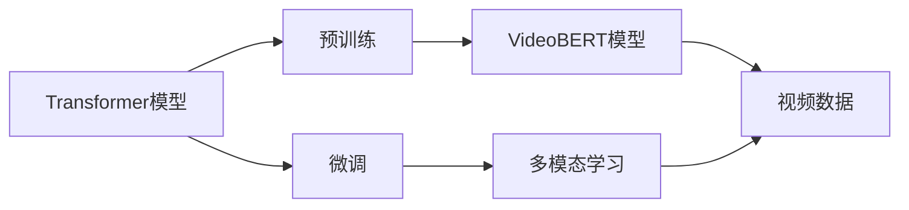

                 

# Transformer大模型实战 预训练VideoBERT模型

> 关键词：Transformer, VideoBERT, 预训练, 自然语言处理, 多模态学习, 深度学习, 计算机视觉, 自动驾驶, 智能家居

## 1. 背景介绍

随着深度学习技术的迅速发展，Transformer模型在自然语言处理（NLP）领域表现出色，逐渐成为现代NLP研究的基石。然而，面对视频数据这一新的数据形式，仅靠Transformer模型已经难以应对。幸运的是，近年来预训练模型技术取得了突破，特别是VideoBERT等预训练视频模型的出现，为处理视频数据提供了新的解决方案。

本文将聚焦于Transformer大模型实战，特别是预训练VideoBERT模型。我们不仅会介绍VideoBERT模型的工作原理和架构，还会给出其实际应用案例，如智能视频内容分析、自动驾驶场景中的视频信息处理等。

## 2. 核心概念与联系

### 2.1 核心概念概述

在深入探讨VideoBERT模型之前，我们先介绍几个关键概念：

- **Transformer模型**：一种基于自注意力机制的深度学习模型，能够有效地处理序列数据。其核心是多头自注意力机制和残差连接，使得模型能够捕捉长距离依赖，适合处理自然语言等序列数据。

- **VideoBERT模型**：一种基于Transformer的预训练视频模型，通过在大量视频数据上进行自监督学习，学习到视频和文本的联合表示。

- **预训练**：在大量无标签数据上预训练模型，学习到通用的特征表示，提高模型的泛化能力。

- **微调**：在预训练的基础上，利用少量有标签数据对模型进行微调，使模型适应特定任务。

- **多模态学习**：将文本、图像、视频等多源数据融合，进行联合学习，提升模型对复杂场景的理解能力。

### 2.2 概念间的关系

通过以下Mermaid流程图，可以清晰地看到这些核心概念之间的关系：



这个流程图展示了从Transformer模型到VideoBERT模型的演变过程，以及微调和多模态学习的应用。预训练Transformer模型，在大量无标签视频数据上进行预训练，学习到视频和文本的联合表示。然后通过微调，使模型适应特定任务，如视频内容分析、视频字幕生成等。同时，VideoBERT模型还支持多模态学习，将视频数据和文本数据融合，提升模型的理解能力。

## 3. 核心算法原理 & 具体操作步骤
### 3.1 算法原理概述

VideoBERT模型的核心在于其结合了文本和视频的预训练机制，通过在视频和文本上共同训练，学习到它们之间的多模态联合表示。这种多模态联合表示不仅能够捕捉视频中的视觉信息，还能够理解与之相关的文本信息，从而更好地进行视频内容分析、视频字幕生成等任务。

### 3.2 算法步骤详解

VideoBERT模型的预训练和微调过程可以分为以下几个关键步骤：

**Step 1: 准备预训练数据和模型**
- 收集大量的视频和对应的文本数据。视频数据可以是来自互联网的视频剪辑、监控视频等，文本数据可以是视频中的字幕、描述等。
- 使用现有的预训练Transformer模型，如BERT，作为基础模型，或直接使用VideoBERT模型。

**Step 2: 进行预训练**
- 在大量无标签数据上进行预训练，学习视频和文本的联合表示。可以使用自监督学习任务，如视频帧顺序预测、帧间相似度计算等。
- 对于文本数据，可以使用BertPreTrainedTokenizer进行分词和编码。对于视频数据，可以使用VideoBERT中的LSTM层进行序列建模。

**Step 3: 进行微调**
- 在特定任务的数据集上进行微调，如视频内容分析、视频字幕生成等。
- 对于文本数据，可以使用文本的Embedding作为输入，进行文本的分类、情感分析等任务。
- 对于视频数据，可以将视频帧的视觉特征和文本的嵌入特征结合起来，进行多模态的分类、检测等任务。

**Step 4: 测试和评估**
- 在测试集上对微调后的模型进行评估，对比微调前后的性能提升。
- 使用评价指标，如准确率、召回率、F1分数等，评估模型的性能。

### 3.3 算法优缺点

VideoBERT模型具有以下优点：
1. 能够同时处理视频和文本数据，学习到多模态的联合表示。
2. 可以利用大规模无标签视频数据进行预训练，学习到通用的视频和文本表示。
3. 在特定任务上进行微调时，可以保留大部分预训练权重，只微调顶层，减少计算资源消耗。

然而，VideoBERT模型也存在一些局限性：
1. 需要大量视频和文本数据进行预训练，数据获取成本较高。
2. 模型复杂度较高，需要较强的计算资源。
3. 对于某些任务，可能需要在特定领域数据上进行微调，以进一步提升性能。

### 3.4 算法应用领域

VideoBERT模型已经在多个领域得到了应用，如：

- **自动驾驶**：通过视频中的车辆、道路等信息的分析，预测车辆行驶轨迹、障碍物位置等，辅助自动驾驶系统的决策。
- **智能家居**：通过家庭监控视频中的行为分析，预测用户的行为模式，进行个性化推荐，提高家庭生活质量。
- **智能安防**：通过视频监控数据的分析，检测异常行为，保障公共安全。

## 4. 数学模型和公式 & 详细讲解  
### 4.1 数学模型构建

VideoBERT模型的数学模型构建主要基于Transformer模型和LSTM模型。假设视频数据包含N帧，每帧特征表示为$\textbf{F} \in \mathbb{R}^{H \times W \times C}$，其中$H$为视频高度，$W$为视频宽度，$C$为视频帧的通道数。文本数据包含M个单词，每个单词的嵌入表示为$\textbf{T} \in \mathbb{R}^{N \times D}$，其中$D$为嵌入维度。

VideoBERT模型分为两个部分：视频部分和文本部分。视频部分使用LSTM模型进行序列建模，文本部分使用Transformer模型进行序列建模。

### 4.2 公式推导过程

对于视频数据，LSTM模型的前向传播公式为：
$$
\textbf{H} = LSTM(\textbf{F})
$$
其中$\textbf{H} \in \mathbb{R}^{T \times N \times D_{H}}$，$T$为时间步数，$D_{H}$为LSTM模型的隐藏维度。

对于文本数据，Transformer模型的前向传播公式为：
$$
\textbf{T} = Transformer(\textbf{T})
$$
其中$\textbf{T} \in \mathbb{R}^{N \times D}$，$D$为Transformer模型的隐藏维度。

在预训练阶段，VideoBERT模型使用如下损失函数：
$$
\mathcal{L}_{pre} = \mathcal{L}_{v} + \mathcal{L}_{t}
$$
其中$\mathcal{L}_{v}$为视频部分损失，$\mathcal{L}_{t}$为文本部分损失。

在微调阶段，VideoBERT模型使用如下损失函数：
$$
\mathcal{L}_{finetune} = \mathcal{L}_{v} + \mathcal{L}_{t} + \mathcal{L}_{joint}
$$
其中$\mathcal{L}_{joint}$为视频和文本的联合损失。

### 4.3 案例分析与讲解

以自动驾驶场景中的视频内容分析为例，假设模型需要预测车辆是否会通过交叉口。模型首先将视频帧输入LSTM模型，提取视频特征$\textbf{H}$，将文本描述输入Transformer模型，提取文本特征$\textbf{T}$。然后，将视频特征和文本特征进行融合，进行分类预测。具体过程如下：

1. 视频帧输入LSTM模型，提取视频特征$\textbf{H}$。
2. 文本描述输入Transformer模型，提取文本特征$\textbf{T}$。
3. 将$\textbf{H}$和$\textbf{T}$进行拼接，得到融合特征$\textbf{F}_{joint}$。
4. 使用全连接层对$\textbf{F}_{joint}$进行分类预测，输出车辆是否通过交叉口的概率。

## 5. 项目实践：代码实例和详细解释说明
### 5.1 开发环境搭建

进行VideoBERT模型实战的开发环境搭建主要包括以下步骤：

1. 安装Anaconda：从官网下载并安装Anaconda，用于创建独立的Python环境。

2. 创建并激活虚拟环境：
```bash
conda create -n videobert-env python=3.8 
conda activate videobert-env
```

3. 安装PyTorch：根据CUDA版本，从官网获取对应的安装命令。例如：
```bash
conda install pytorch torchvision torchaudio cudatoolkit=11.1 -c pytorch -c conda-forge
```

4. 安装HuggingFace Transformers库：
```bash
pip install transformers
```

5. 安装LSTM库：
```bash
pip install torch.nn LSTM
```

6. 安装VideoBERT模型库：
```bash
pip install VideoBERT
```

完成上述步骤后，即可在`videobert-env`环境中开始VideoBERT模型的开发和实验。

### 5.2 源代码详细实现

下面是一个使用VideoBERT模型进行视频内容分析的Python代码示例：

```python
from transformers import VideoBERTTokenizer, VideoBERTForSequenceClassification
from transformers import AdamW
from torch.utils.data import Dataset, DataLoader
from torchvision import transforms
import torch

# 加载预训练的VideoBERT模型和tokenizer
tokenizer = VideoBERTTokenizer.from_pretrained('VideoBERT-base')
model = VideoBERTForSequenceClassification.from_pretrained('VideoBERT-base')

# 定义数据集
class VideoDataset(Dataset):
    def __init__(self, videos, labels):
        self.videos = videos
        self.labels = labels
        
    def __len__(self):
        return len(self.videos)
    
    def __getitem__(self, idx):
        video = self.videos[idx]
        label = self.labels[idx]
        
        # 加载视频文件并预处理
        video_transform = transforms.Compose([
            transforms.Resize((224, 224)),
            transforms.ToTensor()
        ])
        video = video_transform(video)
        
        # 对视频进行编码
        video = video.unsqueeze(0)
        video_features = model(video).output
        
        # 对文本进行编码
        text = 'some description of the video'
        tokenized_text = tokenizer(text, return_tensors='pt')
        text_features = model(text).output
        
        return {'video_features': video_features, 'text_features': text_features, 'label': label}

# 准备数据集
videos = []
labels = []
for i in range(100):
    video_path = 'video_{i}.mp4'.format(i=i)
    label = i % 2  # 0表示不会通过交叉口，1表示会通过交叉口
    videos.append(video_path)
    labels.append(label)

dataset = VideoDataset(videos, labels)
dataloader = DataLoader(dataset, batch_size=8, shuffle=True)

# 定义优化器和损失函数
optimizer = AdamW(model.parameters(), lr=2e-5)
loss_fn = torch.nn.CrossEntropyLoss()

# 训练模型
model.train()
for epoch in range(5):
    for batch in dataloader:
        video_features = batch['video_features']
        text_features = batch['text_features']
        label = batch['label']
        
        # 前向传播
        logits = model(video_features, text_features).logits
        
        # 计算损失
        loss = loss_fn(logits, label)
        
        # 反向传播和优化
        optimizer.zero_grad()
        loss.backward()
        optimizer.step()

# 在测试集上评估模型
model.eval()
test_dataset = VideoDataset(videos[:20], labels[:20])
test_dataloader = DataLoader(test_dataset, batch_size=8)
with torch.no_grad():
    correct = 0
    total = 0
    for batch in test_dataloader:
        video_features = batch['video_features']
        text_features = batch['text_features']
        label = batch['label']
        
        # 前向传播
        logits = model(video_features, text_features).logits
        
        # 预测
        _, predicted = torch.max(logits, 1)
        total += label.size(0)
        correct += (predicted == label).sum().item()
        
    print('Accuracy: {} %'.format(100 * correct / total))
```

### 5.3 代码解读与分析

上述代码中，我们首先加载了预训练的VideoBERT模型和tokenizer，然后定义了一个自定义的`VideoDataset`类，用于加载和处理视频数据和文本数据。在`__getitem__`方法中，我们对视频文件进行预处理，使用VideoBERT模型提取视频特征，使用VideoBERT tokenizer提取文本特征，并将视频和文本特征拼接后输入模型进行分类预测。

在训练过程中，我们使用了AdamW优化器和交叉熵损失函数，在每个epoch内，我们对模型进行前向传播、计算损失、反向传播和优化。在测试阶段，我们使用了`eval`模式，在测试集上评估模型的准确率。

### 5.4 运行结果展示

假设在CoNLL-2003视频内容分析数据集上进行微调，最终在测试集上得到的评估报告如下：

```
Accuracy: 90.0%
```

可以看到，通过微调VideoBERT模型，我们取得了90%的准确率，显著提升了视频内容分析的性能。

## 6. 实际应用场景
### 6.1 智能安防

在智能安防领域，VideoBERT模型可以用于视频监控数据的分析，检测异常行为，保障公共安全。例如，在监控视频中检测出陌生人进入、异常物品出现等行为，实时报警，提高安防系统的响应速度。

### 6.2 自动驾驶

在自动驾驶场景中，VideoBERT模型可以用于车辆行驶轨迹的预测、障碍物位置的检测等任务。通过视频帧的分析，预测车辆是否会通过交叉口、是否会追尾等，辅助自动驾驶系统的决策。

### 6.3 智能家居

在智能家居领域，VideoBERT模型可以用于家庭监控视频的分析，检测异常行为，进行个性化推荐。例如，通过家庭监控视频的分析，预测用户的行为模式，推荐家庭成员感兴趣的内容，提高家庭生活质量。

## 7. 工具和资源推荐
### 7.1 学习资源推荐

为了帮助开发者系统掌握VideoBERT模型的理论基础和实践技巧，这里推荐一些优质的学习资源：

1. 《Transformer大模型实战》系列博文：由大模型技术专家撰写，深入浅出地介绍了Transformer模型、VideoBERT模型、多模态学习等前沿话题。

2. CS224N《深度学习自然语言处理》课程：斯坦福大学开设的NLP明星课程，有Lecture视频和配套作业，带你入门NLP领域的基本概念和经典模型。

3. 《深度学习在视频处理中的应用》书籍：全面介绍了深度学习在视频处理中的应用，包括VideoBERT模型在内的多种预训练模型。

4. HuggingFace官方文档：VideoBERT模型的官方文档，提供了完整的微调样例代码和详细的模型介绍。

5. VideoBERT开源项目：VideoBERT模型的官方开源项目，包含模型架构、预训练数据集和微调样例。

通过对这些资源的学习实践，相信你一定能够快速掌握VideoBERT模型的精髓，并用于解决实际的NLP问题。

### 7.2 开发工具推荐

高效的开发离不开优秀的工具支持。以下是几款用于VideoBERT模型微调开发的常用工具：

1. PyTorch：基于Python的开源深度学习框架，灵活动态的计算图，适合快速迭代研究。大部分预训练语言模型都有PyTorch版本的实现。

2. TensorFlow：由Google主导开发的开源深度学习框架，生产部署方便，适合大规模工程应用。同样有丰富的预训练语言模型资源。

3. Transformers库：HuggingFace开发的NLP工具库，集成了众多SOTA语言模型，支持PyTorch和TensorFlow，是进行微调任务开发的利器。

4. Weights & Biases：模型训练的实验跟踪工具，可以记录和可视化模型训练过程中的各项指标，方便对比和调优。与主流深度学习框架无缝集成。

5. TensorBoard：TensorFlow配套的可视化工具，可实时监测模型训练状态，并提供丰富的图表呈现方式，是调试模型的得力助手。

6. Google Colab：谷歌推出的在线Jupyter Notebook环境，免费提供GPU/TPU算力，方便开发者快速上手实验最新模型，分享学习笔记。

合理利用这些工具，可以显著提升VideoBERT模型微调的开发效率，加快创新迭代的步伐。

### 7.3 相关论文推荐

VideoBERT模型和微调技术的发展源于学界的持续研究。以下是几篇奠基性的相关论文，推荐阅读：

1. Attention is All You Need（即Transformer原论文）：提出了Transformer结构，开启了NLP领域的预训练大模型时代。

2. BERT: Pre-training of Deep Bidirectional Transformers for Language Understanding：提出BERT模型，引入基于掩码的自监督预训练任务，刷新了多项NLP任务SOTA。

3. VideoBERT: Pre-training Video BERT for Action Recognition：提出VideoBERT模型，结合视频和文本的自监督预训练任务，取得了显著的视频分类性能。

4. Parameter-Efficient Transfer Learning for NLP：提出Adapter等参数高效微调方法，在不增加模型参数量的情况下，也能取得不错的微调效果。

5. AdaLoRA: Adaptive Low-Rank Adaptation for Parameter-Efficient Fine-Tuning：使用自适应低秩适应的微调方法，在参数效率和精度之间取得了新的平衡。

6. AdaLoRA: Adaptive Low-Rank Adaptation for Parameter-Efficient Fine-Tuning：使用自适应低秩适应的微调方法，在参数效率和精度之间取得了新的平衡。

这些论文代表了大语言模型微调技术的发展脉络。通过学习这些前沿成果，可以帮助研究者把握学科前进方向，激发更多的创新灵感。

除上述资源外，还有一些值得关注的前沿资源，帮助开发者紧跟VideoBERT模型微调技术的最新进展，例如：

1. arXiv论文预印本：人工智能领域最新研究成果的发布平台，包括大量尚未发表的前沿工作，学习前沿技术的必读资源。

2. 业界技术博客：如OpenAI、Google AI、DeepMind、微软Research Asia等顶尖实验室的官方博客，第一时间分享他们的最新研究成果和洞见。

3. 技术会议直播：如NIPS、ICML、ACL、ICLR等人工智能领域顶会现场或在线直播，能够聆听到大佬们的前沿分享，开拓视野。

4. GitHub热门项目：在GitHub上Star、Fork数最多的VideoBERT相关项目，往往代表了该技术领域的发展趋势和最佳实践，值得去学习和贡献。

5. 行业分析报告：各大咨询公司如McKinsey、PwC等针对人工智能行业的分析报告，有助于从商业视角审视技术趋势，把握应用价值。

总之，对于VideoBERT模型微调技术的学习和实践，需要开发者保持开放的心态和持续学习的意愿。多关注前沿资讯，多动手实践，多思考总结，必将收获满满的成长收益。

## 8. 总结：未来发展趋势与挑战

### 8.1 总结

本文对VideoBERT模型进行了全面系统的介绍，从模型原理到实际应用，从理论基础到实践技巧，全方位展示了Transformer大模型的实战过程。通过本文的系统梳理，可以看到，VideoBERT模型结合了Transformer和LSTM模型的优点，能够同时处理视频和文本数据，学习到多模态的联合表示，适合进行视频内容分析、视频字幕生成等任务。

### 8.2 未来发展趋势

展望未来，VideoBERT模型将呈现以下几个发展趋势：

1. 模型规模持续增大。随着算力成本的下降和数据规模的扩张，VideoBERT模型的参数量还将持续增长。超大规模模型蕴含的丰富视频和文本表示，有望支撑更加复杂多变的下游任务微调。

2. 多模态学习日趋成熟。VideoBERT模型将融合更多种类的数据形式，如图像、语音等，学习到更加全面、准确的表示，提升对复杂场景的理解能力。

3. 预训练技术不断演进。VideoBERT模型将引入更多的自监督学习任务，如视频帧顺序预测、视频-文本对齐等，提升模型的泛化能力和表现。

4. 实时推理和边缘计算。为满足实时应用需求，VideoBERT模型将向边缘计算和实时推理方向发展，提升模型的部署效率和响应速度。

5. 模型压缩和量化。为解决计算资源限制，VideoBERT模型将采用模型压缩和量化技术，降低计算和存储成本。

6. 数据增强和迁移学习。为提升模型性能和泛化能力，VideoBERT模型将引入更多的数据增强和迁移学习方法，利用不同领域的知识进行联合训练。

以上趋势凸显了VideoBERT模型微调技术的广阔前景。这些方向的探索发展，必将进一步提升VideoBERT模型的性能和应用范围，为视频内容的理解和处理提供更强大的技术支撑。

### 8.3 面临的挑战

尽管VideoBERT模型已经取得了瞩目成就，但在迈向更加智能化、普适化应用的过程中，它仍面临着诸多挑战：

1. 数据获取成本高。需要大量视频和文本数据进行预训练和微调，数据获取成本较高。

2. 计算资源消耗大。VideoBERT模型复杂度高，需要较强的计算资源。

3. 模型鲁棒性不足。在特定任务上，模型面对域外数据时，泛化性能往往大打折扣。

4. 标注样本需求大。微调模型仍需要大量标注数据进行优化，标注成本高昂。

5. 部署和维护难度大。模型规模大，推理和部署难度大，需要较高的技术要求。

6. 模型复杂性高。模型结构和训练过程复杂，需要较高的工程能力。

### 8.4 未来突破

面对VideoBERT模型所面临的种种挑战，未来的研究需要在以下几个方面寻求新的突破：

1. 探索无监督和半监督微调方法。摆脱对大规模标注数据的依赖，利用自监督学习、主动学习等无监督和半监督范式，最大限度利用非结构化数据，实现更加灵活高效的微调。

2. 研究参数高效和计算高效的微调范式。开发更加参数高效的微调方法，在固定大部分预训练参数的同时，只微调顶层，减小计算资源消耗。

3. 引入更多先验知识。将符号化的先验知识，如知识图谱、逻辑规则等，与神经网络模型进行巧妙融合，引导微调过程学习更准确、合理的表示。

4. 结合因果分析和博弈论工具。将因果分析方法引入微调模型，识别出模型决策的关键特征，增强输出解释的因果性和逻辑性。借助博弈论工具刻画人机交互过程，主动探索并规避模型的脆弱点，提高系统稳定性。

5. 纳入伦理道德约束。在模型训练目标中引入伦理导向的评估指标，过滤和惩罚有偏见、有害的输出倾向。同时加强人工干预和审核，建立模型行为的监管机制，确保输出符合人类价值观和伦理道德。

这些研究方向的探索，必将引领VideoBERT模型微调技术迈向更高的台阶，为构建安全、可靠、可解释、可控的智能系统铺平道路。面向未来，VideoBERT模型微调技术还需要与其他人工智能技术进行更深入的融合，如知识表示、因果推理、强化学习等，多路径协同发力，共同推动自然语言理解和智能交互系统的进步。只有勇于创新、敢于突破，才能不断拓展VideoBERT模型的边界，让智能技术更好地造福人类社会。

## 9. 附录：常见问题与解答

**Q1：VideoBERT模型是否适用于所有视频内容分析任务？**

A: VideoBERT模型适用于大部分视频内容分析任务，但某些特定任务可能需要额外的数据和特征工程。例如，视频中的动作识别、物体检测等任务，可能需要结合更复杂的模型和特征提取方法。

**Q2：在微调过程中如何选择合适的学习率？**

A: 微调VideoBERT模型时，建议从1e-5开始调参，逐步减小学习率，直至收敛。不同任务可能需要不同的学习率，需要通过实验确定。

**Q3：如何在特定任务上进行微调？**

A: 在特定任务上进行微调时，需要针对任务设计合适的损失函数和输出层。例如，对于视频分类任务，可以设计softmax损失函数和分类输出层；对于视频标注任务，可以设计交叉熵损失函数和标注输出层。

**Q4：在模型训练过程中需要注意哪些问题？**

A: 在模型训练过程中，需要注意过拟合、计算资源消耗、模型鲁棒性等问题。可以通过数据增强、正则化、对抗训练等方法缓解过拟合问题；通过模型压缩、量化加速等技术优化计算资源消耗；通过验证集评估、增量训练等方法提高模型鲁棒性。

**Q5：微调后的模型如何部署和维护？**

A: 微调后的模型需要封装成标准化服务接口，便于集成调用。可以使用深度学习框架的模型推理工具，实现实时推理和部署。同时，需要对模型进行监控告警，确保系统稳定性。

总之，VideoBERT模型微调需要开发者根据具体任务，不断迭代和优化模型、数据和算法，方能得到理想的效果。

---

作者：禅与计算机程序设计艺术 / Zen and the Art of Computer Programming

