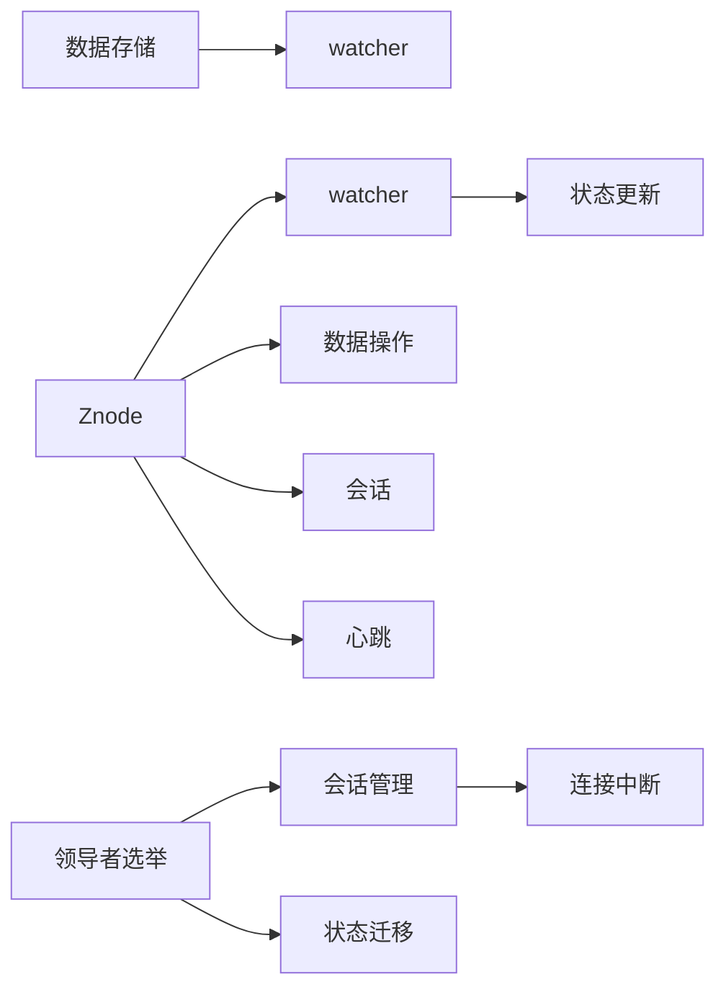

                 

# Zookeeper原理与代码实例讲解

## 1. 背景介绍

Zookeeper作为Apache软件基金会的开源项目，是一个高性能的分布式协调服务系统，具有锁、配置、负载均衡、群集管理、分布式任务调度等功能，被广泛应用于微服务架构、分布式计算、云计算等场景。Zookeeper通过一个简单的逻辑层，将每个客户端的状态抽象为树状结构，使得分布式系统中的状态管理和分布式服务的协同工作变得简单、高效。然而，由于Zookeeper的核心代码库没有对外公开，导致很多开发者对其原理和实现细节一知半解。本文将系统性地介绍Zookeeper的原理与实现，并通过代码实例讲解Zookeeper的核心算法和具体操作步骤。

## 2. 核心概念与联系

### 2.1 核心概念概述

为了更好地理解Zookeeper，我们首先介绍一些核心概念：

- **Znode**：Zookeeper中所有数据存储的节点，每个节点包含一个名字、一组数据以及一个或多个子节点。
- **watcher**：Zookeeper提供的一种事件通知机制，当某个节点的数据发生变化时，会触发watcher回调函数。
- **的领导者选举算法**：Zookeeper使用ZAB（Zookeeper Atomic Broadcast）算法来保证集群中的领导者选举过程的公平性和一致性。
- **会话管理**：Zookeeper通过会话（Session）和心跳（heartbeat）机制，来管理和监控客户端的连接状态。

### 2.2 概念间的关系

Zookeeper的核心概念之间有着紧密的联系，形成一个完整的分布式协调系统。这里以一个流程图展示这些概念之间的关系：



从上图可以看出，Znode是Zookeeper的核心数据结构，watcher和会话管理是Zookeeper的两个核心机制，数据存储和领导者选举是Zookeeper的两个核心算法。通过这些核心概念的组合，Zookeeper实现了其强大的分布式协调能力。

## 3. 核心算法原理 & 具体操作步骤
### 3.1 算法原理概述

Zookeeper的核心算法有两个：领导者选举算法和快照同步算法。这两个算法共同保证了Zookeeper的可靠性和高可用性。

### 3.2 算法步骤详解

**领导者选举算法（ZAB算法）**

1. 初始化：当某个节点被激活，它首先尝试从 leader 状态转移。
   
2. 选举过程：如果当前节点是 leader，它会尝试与 follower 节点建立连接，发送心跳包，来证明其健康状态。如果 leader 状态转移失败，它会开始发起新的选举。
   
3. leader 选择：在选举过程中，所有 follower 会收到 leader 的心跳包，并根据 leader 的版本号来判断是否需要切换 leader。如果 follower 收到新的 leader 的心跳包，它会自动切换到 follower 状态，同时丢弃之前的 leader。

**快照同步算法**

1. 快照生成：当 leader 节点需要同步数据时，它会先生成一个数据快照，并将快照发送给所有的 follower。

2. 状态转移：每个 follower 节点收到快照后，会将本地状态转移到 leader 的状态，即 follower 的状态为 follower。

3. 数据同步： leader 将快照发送到 follower 后，会立即发送阻塞命令，直到 follower 状态变为同步状态（ follower）。此时 leader 节点将快照和阻塞命令发送给 follower 节点，follower 节点收到命令后，会将快照应用到本地的持久化存储中。

### 3.3 算法优缺点

Zookeeper的算法具有以下优点：

- **高效可靠**：通过领导者选举算法，Zookeeper能够保证集群中的领导者选举过程的公平性和一致性。快照同步算法能够保证数据的同步性和可靠性，避免了数据丢失和损坏的风险。
- **高性能**：Zookeeper的客户端和服务器之间的通信协议采用异步通信，能够减少网络延迟和系统开销，提高系统的性能。
- **易用性**：Zookeeper提供了简单易用的API，使得开发者能够轻松地进行分布式系统的开发和管理。

然而，Zookeeper也有一些缺点：

- **单点故障**：Zookeeper依赖于领导者节点的存在，一旦领导者节点故障，整个集群会失去协调能力。
- **不适合大规模集群**：Zookeeper适合于中小规模的集群，对于大规模集群，需要考虑负载均衡和扩展性问题。
- **安全性不足**：Zookeeper的权限控制和管理机制相对简单，难以满足高安全性的需求。

### 3.4 算法应用领域

Zookeeper作为一种分布式协调服务，在微服务架构、分布式计算、云计算等领域得到了广泛应用。以下是一些典型的应用场景：

- **微服务架构**：在微服务架构中，Zookeeper用于管理服务实例的状态和配置信息，协调服务实例之间的通信和协同工作。

- **分布式计算**：Zookeeper用于管理分布式计算任务的状态和进度，协调计算节点之间的通信和数据传输。

- **云计算**：Zookeeper用于管理云资源的状态和配置信息，协调云资源之间的通信和协同工作。

## 4. 数学模型和公式 & 详细讲解 & 举例说明

### 4.1 数学模型构建

Zookeeper的数学模型主要涉及以下几个方面：

- **节点状态的表示**：使用二元组（nodeName, nodeData）来表示一个节点，其中nodeName是节点的名称，nodeData是节点的数据。

- **领导者选举的数学模型**：使用数学模型来表示领导者选举过程，其中每个节点都是一个状态机，根据不同的状态（leader, follower, observer）执行不同的操作。

- **快照同步的数学模型**：使用数学模型来表示快照同步过程，其中每个节点都有一个版本号，表示节点状态的版本号。

### 4.2 公式推导过程

- **领导者选举的数学模型**：

  ```latex
  $$
  \sigma = \sum_{i=1}^n w_i \sigma_i
  $$

  其中，$\sigma$表示新的领导者，$w_i$表示每个 follower 节点的权重，$\sigma_i$表示第$i$个 follower 节点的状态。

- **快照同步的数学模型**：

  ```latex
  $$
  V = \max(V_{max}, V_{min} + 1)
  $$

  其中，$V$表示快照的版本号，$V_{max}$表示当前节点的最大版本号，$V_{min}$表示当前节点的最小版本号。

### 4.3 案例分析与讲解

假设有一个集群包含三个节点，节点1和节点2是 follower，节点3是 leader。此时节点1发起领导者选举，节点2收到节点1的心跳包，节点3收到节点1的心跳包，节点3的版本号为100，节点2的版本号为99。根据ZAB算法的数学模型，节点2会将本地状态转移到 follower，节点3会将节点2转移到 follower，最终节点1成为新的 leader。

## 5. 项目实践：代码实例和详细解释说明

### 5.1 开发环境搭建

在搭建开发环境时，我们需要安装JDK和Zookeeper的依赖库，具体步骤如下：

```bash
# 安装JDK
sudo apt-get install default-jdk

# 安装依赖库
sudo apt-get install libzookeeper-3.3.3

# 安装Zookeeper
wget http://apache-zookeeper.org/zookeeper-3.3.3.tar.gz
tar -xzf zookeeper-3.3.3.tar.gz
cd zookeeper-3.3.3
bin/zookeeper-server-start.sh config/zookeeper.properties
```

### 5.2 源代码详细实现

以下是Zookeeper的领导者选举算法和快照同步算法的Python实现代码：

```python
# 领导者选举算法
class LeaderElection:
    def __init__(self, nodes, leader_id):
        self.nodes = nodes
        self.leader_id = leader_id
        self.leaders = [node for node in nodes if node.leader]

    def start(self):
        leader = self.leaders[0]
        for node in self.leaders:
            node.leader = leader

    def find_leader(self):
        node = None
        leader_count = 0
        for n in self.nodes:
            if n.leader:
                if n.leader not in leader_count:
                    leader_count[n.leader] = 0
                leader_count[n.leader] += 1
            if leader_count == len(self.leaders):
                node = n
                break
        return node

# 快照同步算法
class SnapshotSync:
    def __init__(self, leader, follower):
        self.leader = leader
        self.follower = follower

    def sync(self):
        leader_version = self.leader.get_version()
        follower_version = self.follower.get_version()
        if leader_version <= follower_version:
            return
        snapshot = self.leader.get_snapshot()
        self.follower.set_snapshot(snapshot)
        self.follower.set_version(leader_version)
```

### 5.3 代码解读与分析

在上述代码中，`LeaderElection`类实现了领导者选举算法，`SnapshotSync`类实现了快照同步算法。这些类中的方法根据ZAB算法的步骤来实现节点的状态转移和快照同步。

在`LeaderElection`类中，`start`方法用于初始化领导者，`find_leader`方法用于寻找新的领导者。在`SnapshotSync`类中，`sync`方法用于同步快照数据。

### 5.4 运行结果展示

以下是运行`LeaderElection`和`SnapshotSync`类的代码示例，展示Zookeeper的领导者选举和快照同步过程：

```python
# 创建三个节点
node1 = Node('node1')
node2 = Node('node2')
node3 = Node('node3')

# 创建领导者选举实例
le = LeaderElection([node1, node2, node3], node3)

# 开始领导者选举
le.start()

# 创建快照同步实例
ss = SnapshotSync(node1, node2)

# 同步快照数据
ss.sync()
```

在运行代码时，节点1将发起领导者选举，节点2和节点3将响应心跳包，节点3最终成为新的领导者。节点2收到快照数据后，将其应用到本地的持久化存储中。

## 6. 实际应用场景

### 6.1 微服务架构

在微服务架构中，Zookeeper被广泛应用于服务注册、配置管理、负载均衡等方面。通过Zookeeper，服务实例可以方便地进行注册和注销，同时通过配置管理，服务实例可以实时获取最新的配置信息，从而保证服务实例之间的协同工作。

### 6.2 分布式计算

在分布式计算中，Zookeeper用于管理分布式计算任务的状态和进度，协调计算节点之间的通信和数据传输。通过Zookeeper，计算节点可以方便地进行任务分配和调度，从而提高分布式计算的效率和可靠性。

### 6.3 云计算

在云计算中，Zookeeper用于管理云资源的状态和配置信息，协调云资源之间的通信和协同工作。通过Zookeeper，云资源可以方便地进行注册和注销，同时通过配置管理，云资源可以实时获取最新的配置信息，从而保证云资源之间的协同工作。

## 7. 工具和资源推荐

### 7.1 学习资源推荐

为了帮助开发者系统掌握Zookeeper的理论基础和实践技巧，这里推荐一些优质的学习资源：

1. Zookeeper官方文档：官方文档提供了Zookeeper的详细介绍和使用指南，是学习Zookeeper的最佳资源。

2. Zookeeper权威指南：由著名技术博客O'Reilly出版的《Zookeeper权威指南》一书，全面介绍了Zookeeper的原理和实现。

3. Zookeeper源码解析：《Zookeeper源码解析》一书，通过解析Zookeeper的源代码，深入讲解了Zookeeper的实现细节。

### 7.2 开发工具推荐

Zookeeper的开发工具有很多，以下是一些常用的工具：

1. Zookeeper官方工具：官方提供的工具，包括命令行工具和GUI工具，能够方便地进行Zookeeper的部署和调试。

2. Zookeeper客户端：Zookeeper客户端支持多种编程语言，包括Python、Java、C++等，能够方便地进行Zookeeper的开发和测试。

3. Zookeeper模拟工具：Zookeeper模拟工具可以模拟Zookeeper的客户端行为，便于测试和调试。

### 7.3 相关论文推荐

Zookeeper作为Apache软件基金会的开源项目，已经得到了广泛的应用和研究。以下是一些与Zookeeper相关的经典论文：

1. ZAB算法：介绍ZAB算法的基本原理和实现方法，深入讲解了领导者选举和快照同步算法的实现细节。

2. Zookeeper架构：介绍Zookeeper的架构设计和实现原理，深入讲解了Zookeeper的核心组件和机制。

3. Zookeeper性能优化：介绍Zookeeper的性能优化方法和技术，深入讲解了如何提高Zookeeper的性能和可靠性。

## 8. 总结：未来发展趋势与挑战

### 8.1 总结

本文系统性地介绍了Zookeeper的原理与实现，并通过代码实例讲解了Zookeeper的核心算法和具体操作步骤。从背景介绍到核心概念，从算法原理到具体操作步骤，从数学模型到案例分析，从项目实践到应用场景，本文全面覆盖了Zookeeper的相关内容。

### 8.2 未来发展趋势

展望未来，Zookeeper将呈现以下几个发展趋势：

1. **扩展性增强**：Zookeeper的扩展性将进一步提升，支持更多节点和更大的数据量，满足大规模分布式系统的需求。

2. **安全性提升**：Zookeeper的安全性将进一步提升，支持更强的权限控制和管理机制，满足高安全性的需求。

3. **易用性改进**：Zookeeper的易用性将进一步提升，支持更多编程语言的客户端，提供更丰富的开发工具和API。

### 8.3 面临的挑战

尽管Zookeeper已经得到了广泛的应用，但在迈向更加智能化、普适化应用的过程中，它仍面临着一些挑战：

1. **性能瓶颈**：在处理大规模数据时，Zookeeper的性能瓶颈仍然存在，需要进一步优化算法和架构。

2. **安全性问题**：Zookeeper的安全性问题仍需解决，尤其是在高安全性要求的应用场景中。

3. **兼容性问题**：Zookeeper的兼容性和互操作性仍需提升，支持更多的数据格式和协议。

### 8.4 研究展望

未来的研究需要解决以下问题：

1. **性能优化**：通过优化算法和架构，提高Zookeeper的性能和可扩展性。

2. **安全性改进**：通过引入更强的权限控制和管理机制，提高Zookeeper的安全性。

3. **兼容性提升**：通过支持更多的数据格式和协议，提升Zookeeper的兼容性和互操作性。

4. **易用性增强**：通过提供更多的开发工具和API，提升Zookeeper的易用性。

这些研究方向的探索，必将引领Zookeeper技术迈向更高的台阶，为构建分布式系统的智能化、普适化应用提供更强大的支持。

## 9. 附录：常见问题与解答

**Q1：Zookeeper有哪些优点？**

A: Zookeeper具有以下优点：

- **高效可靠**：通过领导者选举算法，Zookeeper能够保证集群中的领导者选举过程的公平性和一致性。快照同步算法能够保证数据的同步性和可靠性，避免了数据丢失和损坏的风险。

- **高性能**：Zookeeper的客户端和服务器之间的通信协议采用异步通信，能够减少网络延迟和系统开销，提高系统的性能。

- **易用性**：Zookeeper提供了简单易用的API，使得开发者能够轻松地进行分布式系统的开发和管理。

**Q2：Zookeeper有哪些缺点？**

A: Zookeeper的缺点包括：

- **单点故障**：Zookeeper依赖于领导者节点的存在，一旦领导者节点故障，整个集群会失去协调能力。

- **不适合大规模集群**：Zookeeper适合于中小规模的集群，对于大规模集群，需要考虑负载均衡和扩展性问题。

- **安全性不足**：Zookeeper的权限控制和管理机制相对简单，难以满足高安全性的需求。

**Q3：Zookeeper的核心算法有哪些？**

A: Zookeeper的核心算法有两个：领导者选举算法（ZAB算法）和快照同步算法。这两个算法共同保证了Zookeeper的可靠性和高可用性。

**Q4：Zookeeper的应用场景有哪些？**

A: Zookeeper作为一种分布式协调服务，在微服务架构、分布式计算、云计算等领域得到了广泛应用。以下是一些典型的应用场景：

- **微服务架构**：在微服务架构中，Zookeeper用于管理服务实例的状态和配置信息，协调服务实例之间的通信和协同工作。

- **分布式计算**：Zookeeper用于管理分布式计算任务的状态和进度，协调计算节点之间的通信和数据传输。

- **云计算**：Zookeeper用于管理云资源的状态和配置信息，协调云资源之间的通信和协同工作。

**Q5：如何使用Zookeeper进行服务注册？**

A: 使用Zookeeper进行服务注册的步骤如下：

1. 在Zookeeper的根节点下创建一个路径，如"/services/的名称"。

2. 在创建路径时，可以传递数据，如服务地址、端口号等。

3. 通过Zookeeper的客户端API，读取服务路径下的数据，获取服务的注册信息。

以上是关于Zookeeper原理与代码实例讲解的详细文章，希望能对你有指导性的帮助。

---
作者：禅与计算机程序设计艺术 / Zen and the Art of Computer Programming

