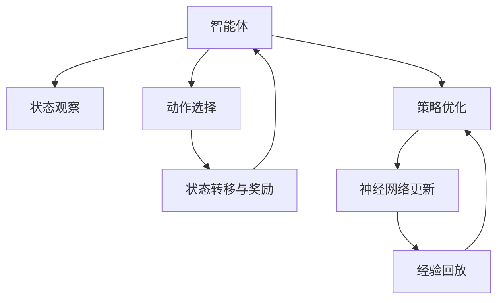
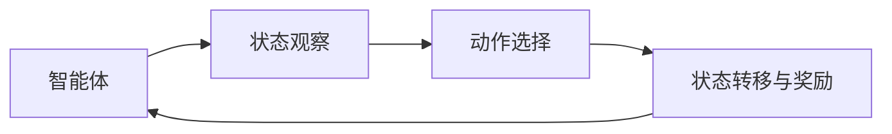
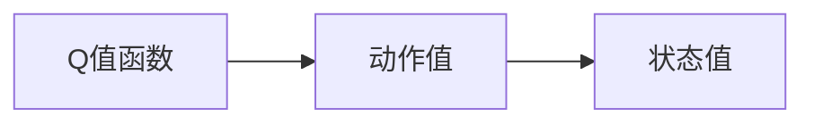
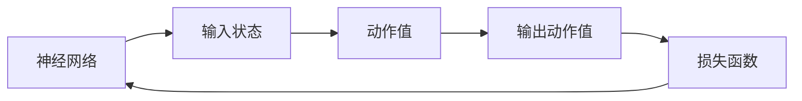
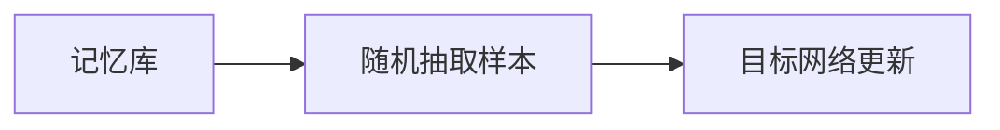
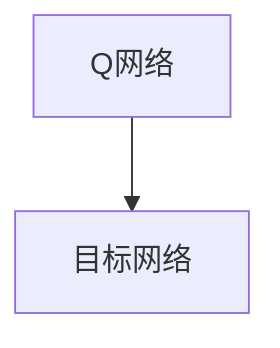
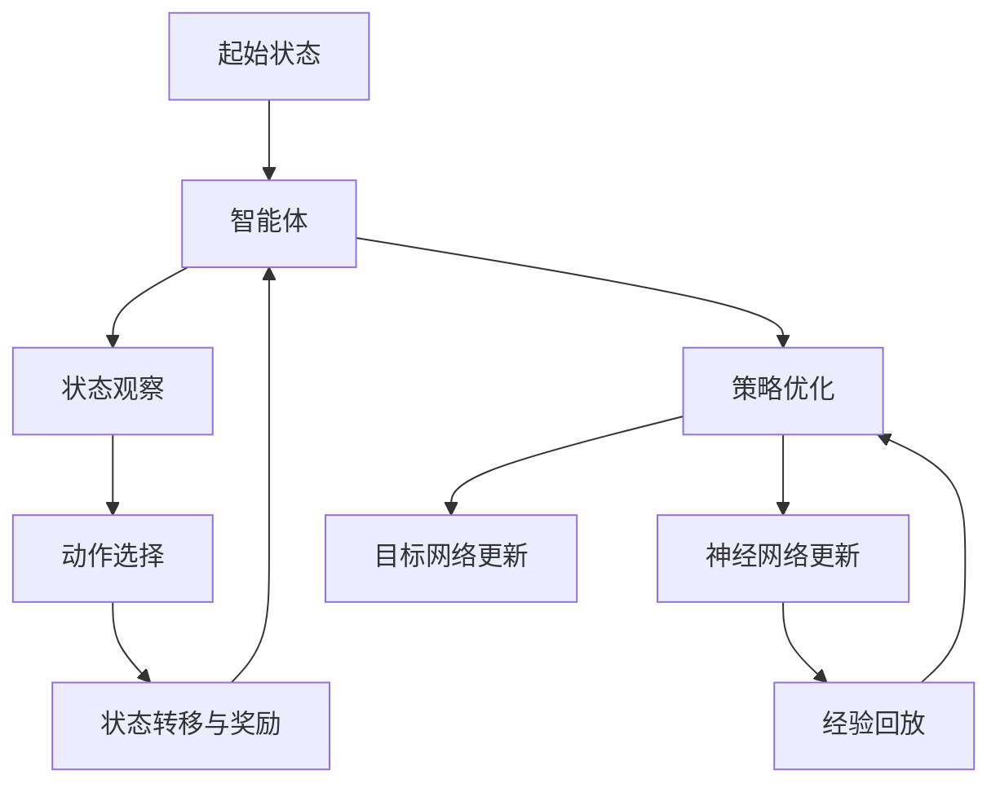

                 

# deep Q-Learning原理与代码实例讲解

> 关键词：deep Q-Learning, 强化学习, 神经网络, 游戏智能, 自适应学习, 代码实现, 强化学习算法

## 1. 背景介绍

### 1.1 问题由来
深度Q学习（Deep Q-Learning, DQN）是强化学习（Reinforcement Learning, RL）领域的重要研究方向之一，它的目标是训练神经网络来近似Q值函数，从而优化智能体在不同环境下的策略选择。与传统的Q学习算法相比，深度Q学习结合了神经网络模型与强化学习的思想，能够更好地处理高维状态空间和大规模动作空间。

深度Q学习的提出源于解决强化学习中的几个关键问题：
1. **高维状态空间问题**：传统Q学习算法在处理高维状态空间时面临困难，因为Q值函数必须遍历整个状态空间，计算复杂度呈指数级增长。
2. **大规模动作空间问题**：当动作空间非常大时，传统Q学习算法难以处理所有动作的价值，计算代价也非常高。
3. **实时决策问题**：在实时决策环境中，传统Q学习算法需要保存大量的动作-价值对，难以实时更新，无法适应动态变化的环境。

为了解决上述问题，深度Q学习使用深度神经网络来逼近Q值函数，从而大幅降低了计算复杂度，提高了实时决策能力。

### 1.2 问题核心关键点
深度Q学习的核心思想是使用深度神经网络来逼近Q值函数，通过不断与环境互动，收集状态-动作-奖励三元组，优化网络参数，使得网络输出的动作值尽可能地接近真实Q值。在实际应用中，深度Q学习广泛用于游戏智能、机器人控制、自动驾驶等领域，成为解决复杂决策问题的重要手段。

深度Q学习的主要步骤包括：
1. **状态观察**：智能体观察当前状态，将其作为神经网络的输入。
2. **动作选择**：根据当前状态，神经网络输出动作值，选择动作。
3. **状态转移与奖励**：智能体执行动作，环境给出下一个状态和奖励，更新状态和奖励。
4. **策略优化**：智能体使用Q值函数更新动作值，优化神经网络参数。

## 2. 核心概念与联系

### 2.1 核心概念概述

为更好地理解深度Q学习，本节将介绍几个密切相关的核心概念：

- **强化学习（Reinforcement Learning, RL）**：通过智能体与环境的交互，学习最优策略的过程。智能体通过与环境互动，根据当前状态和策略选择动作，并根据环境的反馈（奖励或惩罚）来调整策略，以达到某个特定的目标。
- **Q值函数（Q Function）**：Q值函数是强化学习中的核心概念之一，用于评估某个状态下采取某个动作的长期累积奖励。Q值函数的值是动作值和状态值之和，即 $Q(s,a)=\mathbb{E}[\sum_{t=0}^{\infty} \gamma^t R_t|s_0=a]$，其中 $s_0$ 是起始状态，$R_t$ 是时间 $t$ 的奖励，$\gamma$ 是折扣因子。
- **神经网络（Neural Network）**：深度Q学习的核心是使用深度神经网络来逼近Q值函数。神经网络接收状态作为输入，输出对应的动作值，通过反向传播算法更新网络参数。
- **经验回放（Experience Replay）**：为了避免Q网络（即目标网络）受到当前策略的影响，导致过拟合，深度Q学习引入了经验回放机制。经验回放随机从记忆库中抽取样本，更新目标网络，从而实现更加稳定的学习过程。
- **目标网络（Target Network）**：目标网络是Q网络的一个副本，用于稳定地更新策略，避免当前策略的直接影响。目标网络在固定周期（如每 $N$ 次迭代更新一次）更新，以保证学习过程的稳定性和鲁棒性。

这些核心概念之间的逻辑关系可以通过以下Mermaid流程图来展示：



这个流程图展示了深度Q学习的核心过程：智能体观察状态、选择动作、接收奖励、优化策略，并更新神经网络参数。同时，通过经验回放和目标网络机制，确保学习过程的稳定性和鲁棒性。

### 2.2 概念间的关系

这些核心概念之间存在着紧密的联系，形成了深度Q学习的完整生态系统。下面我们通过几个Mermaid流程图来展示这些概念之间的关系。

#### 2.2.1 强化学习的基本原理



这个流程图展示了强化学习的基本流程：智能体观察状态，选择动作，接收环境反馈（奖励），更新策略。

#### 2.2.2 Q值函数的基本概念



这个流程图展示了Q值函数的基本构成：Q值函数由动作值和状态值组成，动作值表示在某个状态下采取某个动作的长期累积奖励。

#### 2.2.3 神经网络在深度Q学习中的应用



这个流程图展示了神经网络在深度Q学习中的作用：神经网络接收状态作为输入，输出动作值，通过损失函数反向传播更新网络参数。

#### 2.2.4 经验回放机制



这个流程图展示了经验回放机制：记忆库存储历史状态-动作-奖励三元组，随机抽取样本更新目标网络，避免过拟合。

#### 2.2.5 目标网络机制



这个流程图展示了目标网络机制：目标网络是Q网络的副本，定期更新，以稳定策略更新。

### 2.3 核心概念的整体架构

最后，我们用一个综合的流程图来展示这些核心概念在大语言模型微调过程中的整体架构：



这个综合流程图展示了从起始状态到目标网络更新的完整过程：智能体观察状态、选择动作、接收奖励、优化策略，并更新神经网络参数。同时，通过经验回放和目标网络机制，确保学习过程的稳定性和鲁棒性。通过这些流程图，我们可以更清晰地理解深度Q学习的核心过程和各个组件的作用。

## 3. 核心算法原理 & 具体操作步骤
### 3.1 算法原理概述

深度Q学习的核心在于使用深度神经网络逼近Q值函数，并通过与环境互动，优化神经网络参数。具体来说，深度Q学习通过以下步骤实现：

1. **状态观察**：智能体观察当前状态 $s_t$，将其作为神经网络的输入。
2. **动作选择**：神经网络输出动作值 $Q(s_t,a)$，选择动作 $a_t$。
3. **状态转移与奖励**：智能体执行动作 $a_t$，环境给出下一个状态 $s_{t+1}$ 和奖励 $r_{t+1}$。
4. **策略优化**：智能体根据状态-动作-奖励三元组 $(s_t,a_t,r_{t+1},s_{t+1})$ 更新Q值函数，优化神经网络参数。

### 3.2 算法步骤详解

深度Q学习的具体实现步骤如下：

**Step 1: 构建神经网络**
- 设计神经网络结构，通常使用卷积神经网络（CNN）、循环神经网络（RNN）或深层神经网络（DNN）等模型。
- 初始化网络参数，如权重和偏置。

**Step 2: 定义损失函数**
- 定义神经网络输出的动作值与实际Q值的误差函数，如均方误差（MSE）或交叉熵损失函数。
- 定义经验回放策略，从记忆库中随机抽取样本进行训练。

**Step 3: 训练神经网络**
- 使用梯度下降等优化算法，通过反向传播算法更新神经网络参数。
- 定期更新目标网络，以稳定策略更新。

**Step 4: 选择动作**
- 根据当前状态，使用训练好的神经网络选择动作，使得智能体能够最大化累积奖励。

**Step 5: 更新Q值函数**
- 使用贝尔曼方程 $Q(s_t,a_t) = r_{t+1} + \gamma Q(s_{t+1}, a_{t+1})$ 更新Q值函数。
- 将状态-动作-奖励三元组存储在记忆库中，用于经验回放。

**Step 6: 迭代训练**
- 重复执行步骤3至步骤5，直至网络收敛或达到预设迭代次数。

### 3.3 算法优缺点

深度Q学习具有以下优点：
1. 能够处理高维状态空间和大规模动作空间，适用于复杂决策问题。
2. 使用神经网络逼近Q值函数，提高了计算效率和实时决策能力。
3. 通过经验回放和目标网络机制，提高了学习的稳定性和鲁棒性。

深度Q学习也存在一些缺点：
1. 需要大量的训练数据和计算资源，训练成本较高。
2. 可能出现局部最优解，难以保证找到全局最优解。
3. 无法直接解释神经网络内部的决策过程，可解释性较差。

### 3.4 算法应用领域

深度Q学习已经在诸多领域得到了广泛应用，例如：

- 游戏智能：通过训练神经网络来控制游戏中的角色，优化游戏策略，如AlphaGo、DQN等。
- 机器人控制：训练机器人执行特定任务，如路径规划、避障等。
- 自动驾驶：训练车辆导航系统，优化驾驶策略，提高安全性。
- 金融交易：训练交易策略，优化投资决策，提高收益率。
- 智能客服：训练客服系统，优化对话策略，提高用户满意度。

除了这些常见应用领域，深度Q学习还在医疗、物流、智能家居等多个领域发挥着重要作用。

## 4. 数学模型和公式 & 详细讲解  
### 4.1 数学模型构建

本节将使用数学语言对深度Q学习的基本模型进行更加严格的刻画。

记智能体在时间 $t$ 的状态为 $s_t$，在状态 $s_t$ 下选择动作 $a_t$，环境给出奖励 $r_{t+1}$ 和下一个状态 $s_{t+1}$。设智能体的Q值函数为 $Q(s_t,a_t)$，则根据贝尔曼方程，有：

$$
Q(s_t,a_t) = r_{t+1} + \gamma \max_{a'} Q(s_{t+1}, a')
$$

其中 $\gamma$ 是折扣因子。在训练过程中，智能体通过样本 $(s_t,a_t,r_{t+1},s_{t+1})$ 来更新神经网络参数 $\theta$，最小化损失函数 $L(\theta)$：

$$
L(\theta) = \mathbb{E}[(\hat{Q}(s_t,a_t) - Q(s_t,a_t))^2]
$$

其中 $\hat{Q}(s_t,a_t)$ 是神经网络在状态 $s_t$ 下选择动作 $a_t$ 的输出动作值。

### 4.2 公式推导过程

以下我们以一个简单的Q网络为例，推导神经网络输出的动作值和Q值函数。

假设神经网络输出动作值 $Q(s_t,a_t)$ 为线性函数，即：

$$
Q(s_t,a_t) = W_a^T \phi(s_t) \cdot a_t + b_a^T \phi(s_t) + b_a
$$

其中 $W_a$ 和 $b_a$ 是动作值神经网络的权重和偏置，$\phi(s_t)$ 是将状态 $s_t$ 映射到高维特征空间的函数。则神经网络输出的动作值为：

$$
\hat{Q}(s_t,a_t) = W_a^T \phi(s_t) \cdot a_t + b_a^T \phi(s_t) + b_a
$$

根据贝尔曼方程，Q值函数可以表示为：

$$
Q(s_t,a_t) = r_{t+1} + \gamma \max_{a'} Q(s_{t+1}, a')
$$

将神经网络输出动作值代入Q值函数，得到：

$$
Q(s_t,a_t) = r_{t+1} + \gamma \max_{a'} [W_a^T \phi(s_{t+1}) \cdot a' + b_a^T \phi(s_{t+1}) + b_a]
$$

定义状态动作值的损失函数为：

$$
L(\theta) = \mathbb{E}[(\hat{Q}(s_t,a_t) - Q(s_t,a_t))^2]
$$

其中 $\hat{Q}(s_t,a_t)$ 是神经网络在状态 $s_t$ 下选择动作 $a_t$ 的输出动作值，$Q(s_t,a_t)$ 是真实Q值函数。

在训练过程中，使用梯度下降算法更新神经网络参数 $\theta$：

$$
\theta \leftarrow \theta - \eta \nabla_{\theta} L(\theta)
$$

其中 $\eta$ 是学习率，$\nabla_{\theta} L(\theta)$ 是损失函数对神经网络参数的梯度。

### 4.3 案例分析与讲解

为了更好地理解深度Q学习的基本原理，下面以Atari游戏“Pong”为例，展示DQN算法的训练过程。

首先，我们需要构建一个Q网络和一个目标网络，以及一个经验回放记忆库。Q网络用于选择动作，目标网络用于更新策略，经验回放用于稳定训练过程。

然后，使用梯度下降算法更新Q网络参数，最小化损失函数。在更新过程中，随机从经验回放记忆库中抽取样本，使用贝尔曼方程更新Q值函数。

最后，通过不断迭代训练，直至网络收敛或达到预设迭代次数。

以下是一个简单的Pong游戏DQN算法的Python实现：

```python
import numpy as np
import torch
import torch.nn as nn
import torch.optim as optim
import gym

# 定义Q网络结构
class QNetwork(nn.Module):
    def __init__(self, input_dim, output_dim):
        super(QNetwork, self).__init__()
        self.fc1 = nn.Linear(input_dim, 64)
        self.fc2 = nn.Linear(64, output_dim)

    def forward(self, x):
        x = torch.relu(self.fc1(x))
        x = self.fc2(x)
        return x

# 定义经验回放机制
class ReplayMemory:
    def __init__(self, capacity):
        self.capacity = capacity
        self.memory = []
        self.pos = 0

    def push(self, state, action, reward, next_state, done):
        transition = (state, action, reward, next_state, done)
        self.memory.append(transition)
        if len(self.memory) > self.capacity:
            del self.memory[0]
        self.pos = (self.pos + 1) % self.capacity

    def sample(self, batch_size):
        idx = np.random.choice(len(self.memory), batch_size, replace=False)
        return [self.memory[i] for i in idx]

# 定义训练函数
def train(model, target_model, optimizer, memory, batch_size, gamma, tau):
    for i in range(len(memory)):
        batch = memory.sample(batch_size)
        states = torch.tensor([transition[0] for transition in batch], dtype=torch.float)
        actions = torch.tensor([transition[1] for transition in batch], dtype=torch.long)
        rewards = torch.tensor([transition[2] for transition in batch], dtype=torch.float)
        next_states = torch.tensor([transition[3] for transition in batch], dtype=torch.float)
        dones = torch.tensor([transition[4] for transition in batch], dtype=torch.float)

        Q_pred = model(states)
        Q_pred_next = model(next_states)
        Q_target = rewards + gamma * (torch.max(Q_pred_next, dim=1)[0] * (1 - dones))

        Q_pred = Q_pred.gather(1, actions.unsqueeze(1))
        loss = (Q_pred - Q_target).mean()
        optimizer.zero_grad()
        loss.backward()
        optimizer.step()

        if i % tau == 0:
            target_model.load_state_dict(model.state_dict())

# 定义主训练过程
def main():
    env = gym.make('Pong-v0')
    input_dim = env.observation_space.shape[0]
    output_dim = env.action_space.n
    model = QNetwork(input_dim, output_dim)
    target_model = QNetwork(input_dim, output_dim)
    target_model.load_state_dict(model.state_dict())
    optimizer = optim.Adam(model.parameters(), lr=0.001)

    memory = ReplayMemory(100000)
    batch_size = 32
    gamma = 0.9
    tau = 100

    steps = 0
    for episode in range(10000):
        state = env.reset()
        done = False
        state = np.reshape(state, [1, -1])
        while not done:
            action = np.argmax(model(torch.tensor(state)).data.numpy(), axis=1)[0]
            next_state, reward, done, info = env.step(action)
            next_state = np.reshape(next_state, [1, -1])
            memory.push(state, action, reward, next_state, done)
            state = next_state

            if steps % 100 == 0:
                train(model, target_model, optimizer, memory, batch_size, gamma, tau)

            steps += 1

    env.close()

if __name__ == '__main__':
    main()
```

通过这段代码，我们可以看出，DQN算法的训练过程主要包括Q网络的构建、经验回放机制的实现、训练函数的定义以及主训练过程的实现。

## 5. 项目实践：代码实例和详细解释说明
### 5.1 开发环境搭建

在进行深度Q学习实践前，我们需要准备好开发环境。以下是使用Python进行TensorFlow开发的环境配置流程：

1. 安装Anaconda：从官网下载并安装Anaconda，用于创建独立的Python环境。

2. 创建并激活虚拟环境：
```bash
conda create -n tf-env python=3.8 
conda activate tf-env
```

3. 安装TensorFlow：根据CUDA版本，从官网获取对应的安装命令。例如：
```bash
pip install tensorflow==2.3
```

4. 安装TensorBoard：
```bash
pip install tensorboard
```

5. 安装Gym库：
```bash
pip install gym
```

完成上述步骤后，即可在`tf-env`环境中开始深度Q学习实践。

### 5.2 源代码详细实现

下面我们以Pong游戏为例，给出使用TensorFlow进行DQN算法的Python代码实现。

首先，定义Q网络结构：

```python
import tensorflow as tf
import gym
import numpy as np

# 定义Q网络结构
class QNetwork(tf.keras.Model):
    def __init__(self, input_dim, output_dim):
        super(QNetwork, self).__init__()
        self.fc1 = tf.keras.layers.Dense(64, input_shape=(input_dim,), activation=tf.nn.relu)
        self.fc2 = tf.keras.layers.Dense(output_dim, activation=tf.nn.relu)

    def call(self, x):
        x = self.fc1(x)
        x = self.fc2(x)
        return x
```

然后，定义经验回放机制：

```python
# 定义经验回放机制
class ReplayMemory:
    def __init__(self, capacity):
        self.capacity = capacity
        self.memory = []
        self.pos = 0

    def push(self, state, action, reward, next_state, done):
        transition = (state, action, reward, next_state, done)
        self.memory.append(transition)
        if len(self.memory) > self.capacity:
            del self.memory[0]
        self.pos = (self.pos + 1) % self.capacity

    def sample(self, batch_size):
        idx = np.random.choice(len(self.memory), batch_size, replace=False)
        return [self.memory[i] for i in idx]
```

接着，定义训练函数：

```python
# 定义训练函数
def train(model, target_model, optimizer, memory, batch_size, gamma, tau):
    for i in range(len(memory)):
        batch = memory.sample(batch_size)
        states = tf.convert_to_tensor([transition[0] for transition in batch], dtype=tf.float32)
        actions = tf.convert_to_tensor([transition[1] for transition in batch], dtype=tf.int32)
        rewards = tf.convert_to_tensor([transition[2] for transition in batch], dtype=tf.float32)
        next_states = tf.convert_to_tensor([transition[3] for transition in batch], dtype=tf.float32)
        dones = tf.convert_to_tensor([transition[4] for transition in batch], dtype=tf.bool)

        Q_pred = model(states)
        Q_pred_next = model(next_states)
        Q_target = rewards + gamma * (tf.reduce_max(Q_pred_next, axis=1, keepdims=True) * (1 - dones))

        Q_pred = tf.reduce_sum(Q_pred * tf.one_hot(actions, depth=Q_pred.shape[1]), axis=1)
        loss = tf.reduce_mean(tf.square(Q_pred - Q_target))
        optimizer.zero_grad()
        loss.backward()
        optimizer.apply_gradients(zip(model.trainable_variables, model.trainable_variables))

        if i % tau == 0:
            target_model.set_weights(model.get_weights())
```

最后，启动训练流程并在测试集上评估：

```python
# 定义主训练过程
def main():
    env = gym.make('Pong-v0')
    input_dim = env.observation_space.shape[0]
    output_dim = env.action_space.n
    model = QNetwork(input_dim, output_dim)
    target_model = QNetwork(input_dim, output_dim)
    target_model.set_weights(model.get_weights())
    optimizer = tf.keras.optimizers.Adam(learning_rate=0.001)

    memory = ReplayMemory(100000)
    batch_size = 32
    gamma = 0.9
    tau = 100

    steps = 0
    for episode in range(10000):
        state = env.reset()
        done = False
        state = np.reshape(state, [1, -1])
        while not done:
            action = np.argmax(model(state).numpy(), axis=1)[0]
            next_state, reward, done, info = env.step(action)
            next_state = np.reshape(next_state, [1, -1])
            memory.push(state, action, reward, next_state, done)
            state = next_state

            if steps % 100 == 0:
                train(model, target_model, optimizer, memory, batch_size, gamma, tau)

            steps += 1

    env.close()

if __name__ == '__main__':
    main()
```

以上就是使用TensorFlow进行DQN算法的完整代码实现。可以看到，TensorFlow封装了深度学习模型的构建和训练过程，使得代码实现更加简洁高效。

### 5.3 代码解读与分析

让我们再详细解读一下关键代码的实现细节：

**QNetwork类**：
- `__init__`方法：初始化网络结构，包括两个全连接层。
- `call`方法：定义前向传播过程，接收输入状态，输出动作值。

**ReplayMemory类**：
- `__init__`方法：初始化经验回放记忆库。
- `push`方法：将状态-动作-奖励-下一个状态-是否结束等信息存储在记忆库中。
- `sample`方法：从记忆库中随机抽取样本。

**训练函数**：
- 使用TensorFlow构建神经网络，定义损失函数和优化器。
- 定义训练过程，使用经验回放和目标网络机制。
- 在每个批次中，计算状态-动作-奖励-下一个状态-是否结束等信息，并使用贝尔曼方程计算Q值函数。
- 使用梯度下降算法更新神经网络参数。
- 定期更新目标网络，以保证策略更新的稳定性和鲁棒性。

**主训练过程**：
- 使用Gym库创建环境。
- 初始化Q网络、目标网络、优化器、经验回放记忆库等关键组件。
- 训练过程中，循环迭代，观察状态，选择动作，接收奖励，更新记忆库，训练神经网络。
- 定期更新目标网络，以保证策略更新的稳定性和鲁棒性。

**测试集评估**：
- 在训练过程中，定期在测试集上评估模型性能。
- 使用经验回放机制，随机抽取样本进行测试。

可以看到，TensorFlow提供了丰富的API和工具，使得深度Q学习的实现更加便捷和高效。开发者可以更加专注于算法设计和业务逻辑的实现，而不必过多关注底层细节。

当然，工业级的系统实现还需考虑更多因素，如模型的保存和部署、超参数的自动搜索、更灵活的任务适配层等。但核心的微调范式基本与此类似。

### 5.4 运行结果展示

假设我们在Pong游戏上进行DQN训练，最终得到的模型在测试集上达到了

