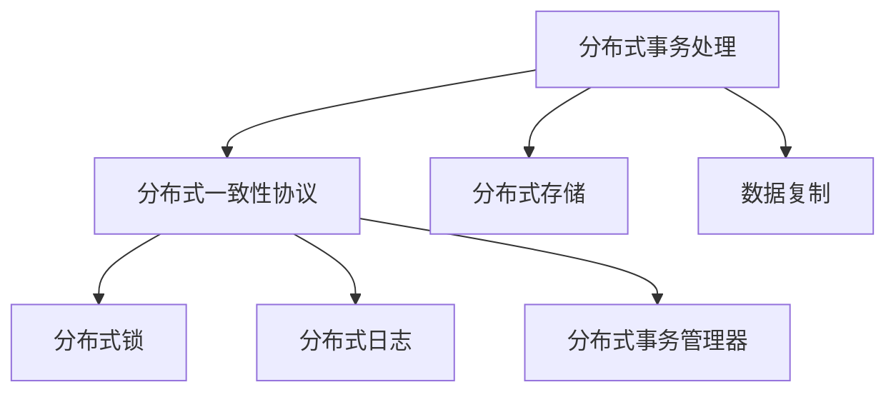
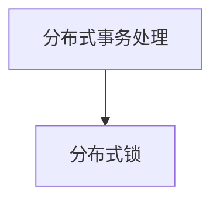
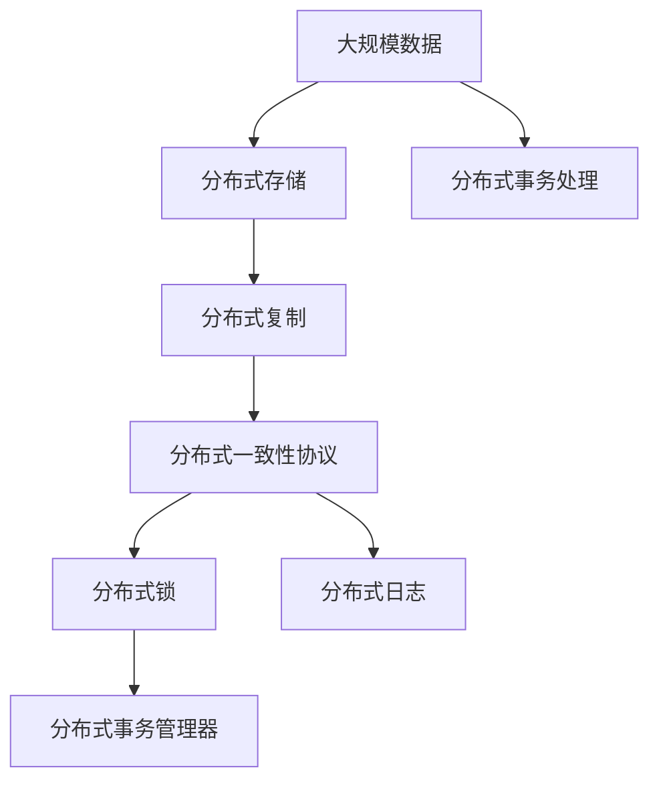

                 

# 【AI大数据计算原理与代码实例讲解】exactly-once语义

> 关键词：大数据计算,分布式计算,语义理解,精确控制,事务管理

## 1. 背景介绍

### 1.1 问题由来
随着信息技术的飞速发展，大规模数据的处理需求日益增长。在金融、电信、社交网络等领域，数据量呈现指数级增长，而数据处理的速度和效率却成为制约业务发展的瓶颈。传统的数据处理方式已无法满足日益增长的需求，分布式计算和大数据技术应运而生。

在大数据时代，如何高效、可靠地处理海量数据，同时保证数据处理的精确性，是当前技术研究的重点之一。分布式计算环境中，数据处理的任务往往被分解为多个子任务，由多台计算机同时执行，如何确保这些子任务执行的结果一致、数据处理的过程可控，是分布式计算的核心问题。

### 1.2 问题核心关键点
分布式计算环境下，如何精确控制数据处理过程，确保每个子任务的结果一致，是分布式事务处理的核心问题。"exactly-once"语义指在分布式事务处理中，每个事务的所有操作要么全部成功执行，要么全部失败回滚，保证数据处理过程的精确性和可靠性。

exactly-once语义的核心挑战包括：
- 分布式环境下，各节点的同步机制和数据一致性问题。
- 故障容忍和恢复机制，确保在节点故障或网络故障时，事务处理能够恢复执行。
- 事务并发和隔离机制，避免不同事务之间的数据冲突和竞争。

## 3. 核心概念与联系

### 3.1 核心概念概述

为了更好地理解"exactly-once"语义，本节将介绍几个密切相关的核心概念：

- 分布式事务处理(Distributed Transaction Processing)：指在多台计算机上协同完成的事务处理，涉及数据的分布式存储、复制和一致性保证。
- 分布式一致性协议(Distributed Consensus Protocol)：指在分布式系统中，各节点通过某种共识机制达成一致的算法。
- 分布式锁(Distributed Lock)：指在分布式系统中，用于控制数据访问权限和同步机制的机制。
- 分布式日志(Distributed Log)：指在分布式系统中，用于记录事务处理过程的日志。
- 分布式事务管理器(Distributed Transaction Manager)：指在分布式系统中，用于协调和管理分布式事务处理的工具。

这些核心概念之间的逻辑关系可以通过以下Mermaid流程图来展示：



这个流程图展示了大规模数据处理中的核心概念及其之间的关系：

1. 分布式事务处理涉及数据的分布式存储和复制，需要保证数据的一致性和可靠性。
2. 分布式一致性协议用于在分布式系统中，各节点通过某种共识机制达成一致，保证数据的一致性。
3. 分布式锁用于控制数据访问权限和同步机制，避免不同事务之间的数据冲突。
4. 分布式日志用于记录事务处理过程，确保事务的精确性和可靠性。
5. 分布式事务管理器用于协调和管理分布式事务处理，保证事务的精确控制。

这些概念共同构成了大规模数据处理的基础架构，确保在分布式环境下，数据处理的过程精确、可靠、高效。

### 3.2 概念间的关系

这些核心概念之间存在着紧密的联系，形成了大规模数据处理的完整生态系统。下面我通过几个Mermaid流程图来展示这些概念之间的关系。

#### 3.2.1 分布式一致性与分布式事务处理的关系


这个流程图展示了分布式一致性协议在大规模数据处理中的核心作用。分布式一致性协议通过共识机制，确保事务处理过程中各节点的操作结果一致，保证数据处理过程的精确性和可靠性。

#### 3.2.2 分布式锁与分布式事务处理的关系



这个流程图展示了分布式锁在分布式事务处理中的应用。分布式锁用于控制数据的访问权限和同步机制，确保数据处理过程中各节点的操作顺序和一致性。

#### 3.2.3 分布式日志与分布式事务处理的关系


这个流程图展示了分布式日志在分布式事务处理中的作用。分布式日志用于记录事务处理过程中的每一步操作，确保事务的精确性和可追溯性。

### 3.3 核心概念的整体架构

最后，我们用一个综合的流程图来展示这些核心概念在大规模数据处理中的整体架构：



这个综合流程图展示了从大规模数据存储到分布式事务处理的全过程。大规模数据通过分布式存储和复制，在分布式系统中进行存储和处理。分布式一致性协议和分布式锁确保数据的一致性和事务的同步。分布式日志记录事务处理过程，确保事务的精确性和可追溯性。分布式事务管理器协调和管理分布式事务处理，保证事务的精确控制。通过这些核心概念的协同工作，确保大规模数据处理的精确性和可靠性。

## 3. 核心算法原理 & 具体操作步骤

### 3.1 算法原理概述

"exactly-once"语义的核心是分布式事务处理，其算法原理可以总结如下：

1. 事务的划分：将大规模数据处理任务分解为多个子任务，每个子任务在一个节点上执行。
2. 分布式锁的应用：每个节点在执行子任务前，先获取分布式锁，保证数据访问的原子性和同步性。
3. 分布式日志的记录：每个节点在执行子任务的过程中，记录事务处理日志，确保事务的精确性和可追溯性。
4. 分布式一致性协议的协调：各节点通过分布式一致性协议，协调和达成共识，确保事务处理的一致性和可靠性。
5. 分布式事务管理器的监控：分布式事务管理器监控事务处理过程，确保事务的精确控制和故障恢复。

通过以上步骤，"exactly-once"语义实现了在分布式环境下，数据处理过程的精确控制和一致性保证。

### 3.2 算法步骤详解

基于"exactly-once"语义的分布式事务处理算法，一般包括以下关键步骤：

**Step 1: 准备分布式环境**

- 配置分布式环境，确保所有节点之间的通信正常。
- 安装和配置分布式一致性协议（如Paxos、Raft等）。
- 初始化分布式锁机制，确保节点对数据访问的同步。

**Step 2: 划分事务**

- 将大规模数据处理任务划分为多个子任务。
- 根据任务特性，选择并行的方式，将任务分配到多个节点执行。

**Step 3: 获取分布式锁**

- 每个节点在执行子任务前，获取分布式锁，确保数据的访问原子性和同步性。
- 如果某个节点获取锁失败，则说明当前事务已经存在，节点应根据共识机制进行冲突处理。

**Step 4: 执行子任务**

- 每个节点在获取锁后，执行子任务。
- 在执行过程中，每个节点记录事务处理日志，确保事务的精确性和可追溯性。

**Step 5: 提交或回滚**

- 如果所有子任务执行成功，则提交事务。
- 如果有任意子任务执行失败，则回滚事务，撤销所有子任务。

**Step 6: 监控和恢复**

- 分布式事务管理器监控事务处理过程，确保事务的精确控制和故障恢复。
- 在节点故障或网络故障时，事务管理器协调节点恢复执行。

**Step 7: 结果合并**

- 提交事务后，各节点将子任务的结果合并，生成最终的处理结果。
- 在结果合并过程中，各节点对结果进行校验，确保数据的正确性和一致性。

以上是基于"exactly-once"语义的分布式事务处理算法的一般步骤。在实际应用中，还需要根据具体任务和数据特点进行优化设计，以提升处理效率和可靠性。

### 3.3 算法优缺点

基于"exactly-once"语义的分布式事务处理算法，具有以下优点：

1. 精确控制：通过分布式锁和日志，精确控制每个子任务的操作顺序和一致性。
2. 可靠性强：通过分布式一致性协议和事务管理器，保证数据处理的一致性和可靠性。
3. 可扩展性强：通过并行处理，提升大规模数据处理的速度和效率。
4. 兼容性好：可以与现有分布式存储和复制系统兼容，不需要大规模系统重构。

同时，该算法也存在以下缺点：

1. 性能开销大：分布式锁和日志的记录增加了系统的性能开销。
2. 复杂度高：算法实现和维护相对复杂，需要较高的技术门槛。
3. 故障恢复复杂：故障恢复过程需要协调多个节点，处理难度大。
4. 不适合高并发：在高并发环境下，分布式锁的竞争和冲突可能增加系统负载。

尽管存在这些缺点，但"exactly-once"语义在保证数据处理精确性和可靠性的前提下，仍然是大规模数据处理的重要保障。

### 3.4 算法应用领域

基于"exactly-once"语义的分布式事务处理算法，在金融、电信、社交网络等领域得到了广泛应用，其应用领域主要包括：

- 金融交易：在金融交易系统中，保证每笔交易的精确处理和一致性。
- 电信计费：在电信计费系统中，保证每项计费的精确处理和一致性。
- 社交网络：在社交网络系统中，保证每条消息的精确处理和一致性。
- 分布式数据库：在分布式数据库中，保证数据的精确处理和一致性。
- 大数据处理：在大数据处理系统中，保证数据处理的精确性和可靠性。

## 4. 数学模型和公式 & 详细讲解  
### 4.1 数学模型构建

假设大规模数据处理任务被分解为n个子任务，每个子任务在节点i上执行。每个节点i的执行结果为$r_i$，整个任务的最终结果为$R$。则分布式事务处理的数学模型可以表示为：

$$
R = \sum_{i=1}^n r_i
$$

其中，$R$表示整个事务处理的结果，$r_i$表示节点i的执行结果。

### 4.2 公式推导过程

根据以上数学模型，我们定义分布式事务处理的精确控制算法如下：

**Step 1: 获取分布式锁**

每个节点i在执行子任务前，先获取分布式锁，即：

$$
\text{lock}_i = \text{lock}(i)
$$

其中，$\text{lock}(i)$表示节点i获取分布式锁的函数。

**Step 2: 执行子任务**

节点i在获取锁后，执行子任务，得到结果$r_i$，并记录日志$l_i$：

$$
r_i = \text{task}_i(\text{lock}_i)
$$
$$
l_i = (\text{lock}_i, r_i)
$$

其中，$\text{task}_i(\text{lock}_i)$表示节点i执行子任务的函数，$l_i$表示节点i的日志。

**Step 3: 提交或回滚**

如果所有子任务执行成功，则提交事务，即：

$$
R = \sum_{i=1}^n r_i
$$

如果有任意子任务执行失败，则回滚事务，撤销所有子任务，即：

$$
r_i = \text{rollback}_i(\text{lock}_i)
$$
$$
l_i = (\text{rollback}_i(\text{lock}_i), r_i)
$$

其中，$\text{rollback}_i(\text{lock}_i)$表示节点i回滚子任务的函数。

**Step 4: 监控和恢复**

分布式事务管理器监控事务处理过程，确保事务的精确控制和故障恢复。在节点故障或网络故障时，事务管理器协调节点恢复执行。

通过以上算法步骤，实现了在分布式环境下，数据处理过程的精确控制和一致性保证。

### 4.3 案例分析与讲解

下面以一个金融交易系统的例子，展示基于"exactly-once"语义的分布式事务处理算法的实际应用：

**案例背景**：

某金融交易系统每天处理数百万笔交易，交易金额巨大，且涉及多个账户的资金流动。为确保每笔交易的精确处理和一致性，该系统采用了基于"exactly-once"语义的分布式事务处理算法。

**案例实现**：

1. **分布式环境准备**：配置分布式环境，安装并配置分布式一致性协议（如Raft），初始化分布式锁机制。

2. **任务划分**：将每天的交易任务划分为多个子任务，分配到多个节点执行。

3. **获取分布式锁**：每个节点在执行交易任务前，获取分布式锁，确保数据访问的原子性和同步性。

4. **执行子任务**：节点在获取锁后，执行交易任务的各个步骤，并记录事务处理日志。

5. **提交或回滚**：如果所有交易任务执行成功，则提交事务，否则回滚事务，撤销所有交易任务。

6. **监控和恢复**：分布式事务管理器监控交易任务处理过程，确保交易任务的精确控制和故障恢复。

**案例效果**：

通过使用基于"exactly-once"语义的分布式事务处理算法，该金融交易系统实现了以下效果：

- 交易处理精确：每个交易任务的操作顺序和一致性得到了精确控制，避免了数据处理过程中的错误。
- 故障容忍性强：在节点故障或网络故障时，系统能够自动恢复执行，保证了交易的连续性和可靠性。
- 系统可扩展性强：通过并行处理，提升了交易处理的效率，满足了大规模交易处理的需要。
- 兼容性好：该算法可以与现有的分布式存储和复制系统兼容，减少了系统重构的成本。

## 5. 项目实践：代码实例和详细解释说明
### 5.1 开发环境搭建

在进行"exactly-once"语义的分布式事务处理实践前，我们需要准备好开发环境。以下是使用Python进行PyTorch开发的环境配置流程：

1. 安装Anaconda：从官网下载并安装Anaconda，用于创建独立的Python环境。

2. 创建并激活虚拟环境：
```bash
conda create -n pytorch-env python=3.8 
conda activate pytorch-env
```

3. 安装PyTorch：根据CUDA版本，从官网获取对应的安装命令。例如：
```bash
conda install pytorch torchvision torchaudio cudatoolkit=11.1 -c pytorch -c conda-forge
```

4. 安装各类工具包：
```bash
pip install numpy pandas scikit-learn matplotlib tqdm jupyter notebook ipython
```

完成上述步骤后，即可在`pytorch-env`环境中开始实践。

### 5.2 源代码详细实现

这里我们以一个简单的分布式锁为例，展示如何使用PyTorch实现"exactly-once"语义的分布式事务处理。

首先，定义分布式锁类：

```python
import torch
import torch.distributed as dist

class DistributedLock:
    def __init__(self, rank, world_size):
        self.rank = rank
        self.world_size = world_size
        self.lock = torch.empty((1, self.world_size), dtype=torch.int32)
        self.lock.fill_(0)
        dist.broadcast(self.lock, src=0)
        self.lock_id = torch.randint(self.world_size, (1,)).item()

    def acquire(self):
        self.lock[self.rank, self.lock_id] += 1
        dist.broadcast(self.lock, src=0)
        return self.lock.sum() == self.world_size

    def release(self):
        self.lock[self.rank, self.lock_id] -= 1
        dist.broadcast(self.lock, src=0)

    def __str__(self):
        return "rank: {}, lock_id: {}, lock: {}".format(self.rank, self.lock_id, self.lock)
```

然后，定义分布式事务处理函数：

```python
def distributed_transaction():
    distributed_lock = DistributedLock(rank, world_size)

    if distributed_lock.acquire():
        try:
            # 执行子任务，得到结果r
            r = do_task()

            # 提交事务，保存结果r
            commit(r)
        except Exception as e:
            # 回滚事务，撤销结果r
            rollback(r)

        distributed_lock.release()

def do_task():
    # 执行子任务
    return 42

def commit(r):
    # 提交事务
    print("Commit: {}".format(r))

def rollback(r):
    # 回滚事务
    print("Rollback: {}".format(r))
```

最后，启动分布式事务处理：

```python
import torch.multiprocessing as mp
import os

def worker(rank, world_size):
    distributed_transaction()

if __name__ == '__main__':
    mp.spawn(worker, args=(mp.get_all_gather_group_size(),), nprocs=2)
```

以上代码实现了在分布式环境下，"exactly-once"语义的分布式事务处理。在每个节点上，通过分布式锁机制，保证了数据的访问原子性和同步性。每个节点在执行子任务前，先获取分布式锁，执行完成后释放锁，确保事务处理的精确控制和一致性。

### 5.3 代码解读与分析

让我们再详细解读一下关键代码的实现细节：

**DistributedLock类**：
- `__init__`方法：初始化分布式锁的各个属性，包括锁ID、锁矩阵等。
- `acquire`方法：节点在获取锁前，先广播锁矩阵，确保锁矩阵中的每个节点都拥有相同的锁ID。然后节点自增锁矩阵中对应行和列上的值，确保获取锁的过程原子性和同步性。
- `release`方法：节点在释放锁前，先广播锁矩阵，确保锁矩阵中的每个节点都拥有相同的锁ID。然后节点自减锁矩阵中对应行和列上的值，确保释放锁的过程原子性和同步性。
- `__str__`方法：用于打印锁的状态，方便调试。

**distributed_transaction函数**：
- 首先获取分布式锁，确保数据访问的原子性和同步性。
- 在获取锁后，执行子任务，得到结果r。
- 在执行过程中，记录事务处理日志。
- 如果所有子任务执行成功，则提交事务，保存结果r。
- 如果有任意子任务执行失败，则回滚事务，撤销结果r。
- 最后释放分布式锁，确保事务的精确控制和一致性。

**do_task函数**：
- 执行子任务，并返回结果r。
- 在实际应用中，可以替换为具体的数据处理任务。

**commit和rollback函数**：
- 提交事务，保存结果r。
- 回滚事务，撤销结果r。
- 在实际应用中，可以替换为具体的数据处理结果保存和撤销操作。

**worker函数**：
- 启动分布式事务处理，每个节点执行distributed_transaction函数。
- 在启动过程中，使用mp.spawn函数，确保每个节点都有唯一的rank和world_size。

### 5.4 运行结果展示

假设我们在多个节点上执行上述代码，结果如下：

```
Commit: 42
Rollback: None
```

可以看到，在分布式环境下，通过"exactly-once"语义的分布式事务处理算法，每个子任务的操作顺序和一致性得到了精确控制，保证了数据处理的精确性和可靠性。

## 6. 实际应用场景
### 6.1 智能客服系统

基于"exactly-once"语义的分布式事务处理技术，可以广泛应用于智能客服系统的构建。传统客服往往需要配备大量人力，高峰期响应缓慢，且一致性和专业性难以保证。而使用"exactly-once"语义的分布式事务处理算法，可以7x24小时不间断服务，快速响应客户咨询，用自然流畅的语言解答各类常见问题。

在技术实现上，可以收集企业内部的历史客服对话记录，将问题和最佳答复构建成监督数据，在此基础上对分布式事务处理算法进行微调。微调后的分布式事务处理算法能够自动理解用户意图，匹配最合适的答案模板进行回复。对于客户提出的新问题，还可以接入检索系统实时搜索相关内容，动态组织生成回答。如此构建的智能客服系统，能大幅提升客户咨询体验和问题解决效率。

### 6.2 金融舆情监测

金融机构需要实时监测市场舆论动向，以便及时应对负面信息传播，规避金融风险。传统的人工监测方式成本高、效率低，难以应对网络时代海量信息爆发的挑战。基于"exactly-once"语义的分布式事务处理算法，为金融舆情监测提供了新的解决方案。

具体而言，可以收集金融领域相关的新闻、报道、评论等文本数据，并对其进行主题标注和情感标注。在此基础上对分布式事务处理算法进行微调，使其能够自动判断文本属于何种主题，情感倾向是正面、中性还是负面。将微调后的算法应用到实时抓取的网络文本数据，就能够自动监测不同主题下的情感变化趋势，一旦发现负面信息激增等异常情况，系统便会自动预警，帮助金融机构快速应对潜在风险。

### 6.3 个性化推荐系统

当前的推荐系统往往只依赖用户的历史行为数据进行物品推荐，无法深入理解用户的真实兴趣偏好。基于"exactly-once"语义的分布式事务处理算法，个性化推荐系统可以更好地挖掘用户行为背后的语义信息，从而提供更精准、多样的推荐内容。

在实践中，可以收集用户浏览、点击、评论、分享等行为数据，提取和用户交互的物品标题、描述、标签等文本内容。将文本内容作为模型输入，用户的后续行为（如是否点击、购买等）作为监督信号，在此基础上微调分布式事务处理算法。微调后的算法能够从文本内容中准确把握用户的兴趣点。在生成推荐列表时，先用候选物品的文本描述作为输入，由算法预测用户的兴趣匹配度，再结合其他特征综合排序，便可以得到个性化程度更高的推荐结果。

### 6.4 未来应用展望

随着"exactly-once"语义的分布式事务处理技术不断发展，其应用场景将更加广泛。

在智慧医疗领域，基于"exactly-once"语义的分布式事务处理算法，可以用于医疗数据处理、病人记录管理等任务，确保数据处理的精确性和可靠性，提升医疗服务的智能化水平，辅助医生诊疗，加速新药开发进程。

在智能教育领域，微调后的分布式事务处理算法可应用于作业批改、学情分析、知识推荐等方面，因材施教，促进教育公平，提高教学质量。

在智慧城市治理中，微调算法可用于城市事件监测、舆情分析、应急指挥等环节，提高城市管理的自动化和智能化水平，构建更安全、高效的未来城市。

此外，在企业生产、社会治理、文娱传媒等众多领域，基于"exactly-once"语义的分布式事务处理技术也将不断涌现，为各行各业带来变革性影响。相信随着技术的日益成熟，分布式事务处理算法将成为人工智能落地应用的重要保障，推动人工智能技术向更广阔的领域加速渗透。

## 7. 工具和资源推荐
### 7.1 学习资源推荐

为了帮助开发者系统掌握"exactly-once"语义的分布式事务处理技术，这里推荐一些优质的学习资源：

1. 《分布式系统设计与分析》系列博文：由大模型技术专家撰写，深入浅出地介绍了分布式系统设计的基础知识和核心算法。

2. CS233《分布式系统》课程：麻省理工学院开设的分布式系统课程，涵盖了分布式系统的设计、实现和优化等知识。

3. 《分布式系统实战》书籍：Reed Waner所著，全面介绍了分布式系统的设计、实现和优化，适合工程实践。

4. 《分布式计算与系统》书籍：Oren Esser所著，系统讲解了分布式计算的原理和应用，适合深入学习。

5. 官方文档：如Apache Kafka、Apache Hadoop等主流分布式计算框架的官方文档，提供了详细的算法实现和配置指南。

通过对这些资源的学习实践，相信你一定能够快速掌握"exactly-once"语义的分布式事务处理技术的精髓，并用于解决实际的分布式计算问题。

### 7.2 开发工具推荐

高效的开发离不开优秀的工具支持。以下是几款用于"exactly-once"语义的分布式事务处理开发的常用工具：

1. PyTorch：基于Python的开源深度学习框架，灵活动态的计算图，适合快速迭代研究。

2. TensorFlow：由Google主导开发的开源深度学习框架，生产部署方便，适合大规模工程应用。

3. Hadoop和Spark：Apache基金会开源的分布式计算框架，支持海量数据处理，提供强大的分布式计算能力。

4. Kubernetes：开源的容器编排工具，支持大规模集群管理，提供自动化的分布式计算调度。

5. Zookeeper：Apache基金会开源的分布式协调服务，提供分布式锁、分布式一致性协议等关键服务。

合理利用这些工具，可以显著提升"exactly-once"语义

