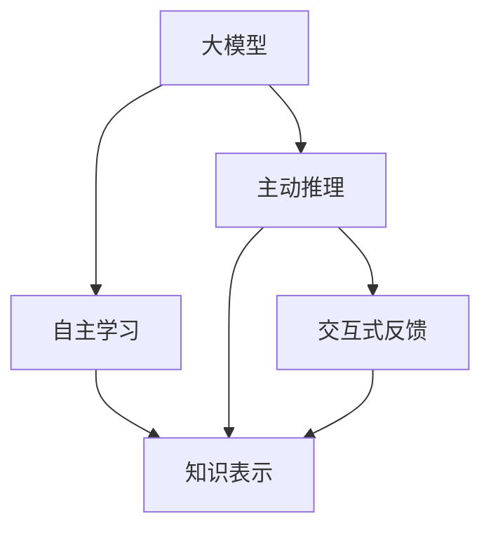
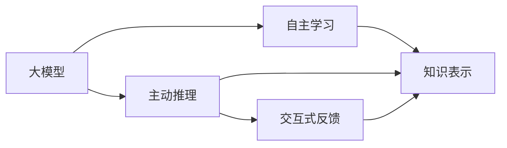
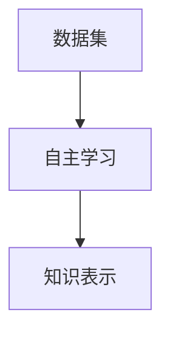
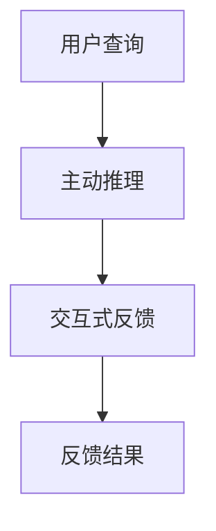
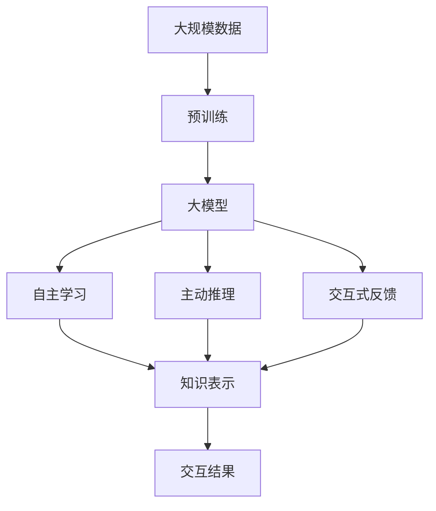

                 

# 【大模型应用开发 动手做AI Agent】AutoGPT

## 1. 背景介绍

随着人工智能(AI)技术的不断演进，大模型在自然语言处理(NLP)、计算机视觉(CV)、机器人等领域展现出了强大的应用潜力。大模型通过在海量数据上进行预训练，获得了丰富的知识表示，具备了高效处理复杂任务的能力。然而，这些大模型通常规模庞大，难以直接部署到具体应用中。本文将介绍一种基于大模型开发的AI Agent，即AutoGPT，该模型通过自主学习、主动推理和交互式反馈，实现了智能系统的高度自治和高效应用。

### 1.1 问题由来

在大模型的应用中，预训练模型通常需要适应特定的应用场景。传统的迁移学习、微调等方法虽然在一定程度上解决了这个问题，但仍然存在一些局限性，例如：

- **计算资源消耗大**：大规模预训练模型的推理和推理开销较大，难以实时处理大量数据。
- **任务适配困难**：大模型在特定任务上的性能提升有限，需要针对性地设计和调整。
- **缺乏主动学习能力**：传统模型难以在运行过程中动态学习和适应用户需求。

AutoGPT模型通过自主学习、主动推理和交互式反馈机制，克服了上述问题，实现了AI Agent的高效自治和灵活应用。

### 1.2 问题核心关键点

AutoGPT模型基于大模型开发的AI Agent，通过自主学习、主动推理和交互式反馈机制，实现了高效自治和灵活应用。以下是AutoGPT模型的核心关键点：

- **自主学习**：通过自动挖掘数据中的知识，不断调整自身的知识表示。
- **主动推理**：通过自主推理生成与用户交互的答案，提高交互质量。
- **交互式反馈**：通过用户反馈，不断优化自身推理过程，提升智能水平。

这些关键点共同构成了AutoGPT模型的核心功能，使其能够在多种应用场景中高效自治和灵活应用。

### 1.3 问题研究意义

AutoGPT模型为AI Agent的开发提供了新的思路和方法，其意义如下：

- **高效自治**：通过自主学习、主动推理和交互式反馈机制，AutoGPT模型能够实现高度自治，减少人工干预和维护成本。
- **灵活应用**：AutoGPT模型可以根据不同的应用场景进行灵活配置和调整，提升系统的适应性和可扩展性。
- **交互优化**：通过不断优化自身推理过程，AutoGPT模型能够提高与用户交互的质量和效率。
- **技术创新**：AutoGPT模型的开发为AI Agent的构建提供了新的技术手段和方法，推动了AI技术的创新和应用。

## 2. 核心概念与联系

### 2.1 核心概念概述

为更好地理解AutoGPT模型的核心概念，本节将介绍几个密切相关的核心概念：

- **大模型**：以自回归(如GPT)或自编码(如BERT)模型为代表的大规模预训练语言模型。通过在海量数据上进行预训练，学习通用的语言表示，具备强大的语言理解和生成能力。
- **自主学习**：通过自动挖掘数据中的知识，不断调整自身的知识表示。
- **主动推理**：通过自主推理生成与用户交互的答案，提高交互质量。
- **交互式反馈**：通过用户反馈，不断优化自身推理过程，提升智能水平。

这些核心概念之间的逻辑关系可以通过以下Mermaid流程图来展示：



这个流程图展示了大模型、自主学习、主动推理和交互式反馈之间的逻辑关系：

1. 大模型通过预训练获得基础能力。
2. 自主学习通过自动挖掘数据中的知识，调整自身的知识表示。
3. 主动推理通过自主推理生成与用户交互的答案。
4. 交互式反馈通过用户反馈，优化自身推理过程。

### 2.2 概念间的关系

这些核心概念之间存在着紧密的联系，形成了AutoGPT模型的完整生态系统。下面我们通过几个Mermaid流程图来展示这些概念之间的关系。

#### 2.2.1 大模型的应用



这个流程图展示了大模型在AutoGPT模型中的应用。大模型通过自主学习、主动推理和交互式反馈机制，不断调整自身的知识表示，从而适应不同的应用场景。

#### 2.2.2 自主学习与知识表示



这个流程图展示了自主学习与知识表示之间的联系。自主学习通过自动挖掘数据中的知识，调整自身的知识表示，从而提高模型的智能水平。

#### 2.2.3 主动推理与交互式反馈



这个流程图展示了主动推理与交互式反馈之间的联系。主动推理通过生成与用户交互的答案，提高交互质量，交互式反馈通过用户反馈，优化自身推理过程，提升智能水平。

### 2.3 核心概念的整体架构

最后，我们用一个综合的流程图来展示这些核心概念在大模型应用中的整体架构：



这个综合流程图展示了从预训练到自主学习、主动推理、交互式反馈的完整过程。大模型通过自主学习、主动推理和交互式反馈机制，不断调整自身的知识表示，从而适应不同的应用场景。

## 3. 核心算法原理 & 具体操作步骤
### 3.1 算法原理概述

AutoGPT模型基于大模型开发的AI Agent，通过自主学习、主动推理和交互式反馈机制，实现了高效自治和灵活应用。其核心算法原理如下：

1. **自主学习**：通过自动挖掘数据中的知识，不断调整自身的知识表示。
2. **主动推理**：通过自主推理生成与用户交互的答案，提高交互质量。
3. **交互式反馈**：通过用户反馈，不断优化自身推理过程，提升智能水平。

形式化地，假设AutoGPT模型的知识表示为 $\theta$，初始化为预训练模型参数。给定用户查询 $x$，AutoGPT模型的推理过程如下：

1. **自主学习**：通过自动挖掘数据中的知识，更新知识表示 $\theta$。
2. **主动推理**：根据当前的知识表示 $\theta$，生成与用户查询 $x$ 相关的答案 $y$。
3. **交互式反馈**：通过用户反馈，调整知识表示 $\theta$。

AutoGPT模型的输出为 $y$，即对用户查询 $x$ 的回应。

### 3.2 算法步骤详解

AutoGPT模型的算法步骤主要包括以下几个关键步骤：

**Step 1: 准备预训练模型和数据集**

1. 选择合适的预训练语言模型 $M_{\theta}$，如BERT、GPT等。
2. 准备任务相关的标注数据集 $D=\{(x_i,y_i)\}_{i=1}^N, x_i \in \mathcal{X}, y_i \in \mathcal{Y}$。

**Step 2: 定义任务适配层**

1. 根据任务类型，在预训练模型顶层设计合适的输出层和损失函数。
2. 对于分类任务，通常在顶层添加线性分类器和交叉熵损失函数。
3. 对于生成任务，通常使用语言模型的解码器输出概率分布，并以负对数似然为损失函数。

**Step 3: 执行微调**

1. 使用任务适配层训练模型，使其适应特定任务。
2. 设置微调超参数，如学习率、批大小、迭代轮数等。
3. 设置正则化技术及强度，包括权重衰减、Dropout、Early Stopping等。
4. 使用微调数据集，重复执行前向传播和反向传播，更新模型参数。

**Step 4: 执行自主学习**

1. 通过自动挖掘数据中的知识，更新知识表示 $\theta$。
2. 使用自动挖掘算法，如聚类、关联规则、序列模式挖掘等，从数据中提取知识。
3. 根据提取的知识，调整模型的知识表示。

**Step 5: 执行主动推理**

1. 根据当前的知识表示 $\theta$，生成与用户查询 $x$ 相关的答案 $y$。
2. 使用生成算法，如自回归模型、自编码模型、生成对抗网络等，生成答案。
3. 根据生成算法，调整模型的知识表示。

**Step 6: 执行交互式反馈**

1. 通过用户反馈，调整知识表示 $\theta$。
2. 收集用户反馈，包括正确答案、错误答案、用户满意度等。
3. 根据用户反馈，调整模型的知识表示。

### 3.3 算法优缺点

AutoGPT模型具有以下优点：

1. **高效自治**：通过自主学习、主动推理和交互式反馈机制，AutoGPT模型能够实现高度自治，减少人工干预和维护成本。
2. **灵活应用**：AutoGPT模型可以根据不同的应用场景进行灵活配置和调整，提升系统的适应性和可扩展性。
3. **交互优化**：通过不断优化自身推理过程，AutoGPT模型能够提高与用户交互的质量和效率。

同时，AutoGPT模型也存在以下缺点：

1. **计算资源消耗大**：大模型推理开销较大，难以实时处理大量数据。
2. **知识表示难以解释**：AutoGPT模型自主学习的过程较复杂，其知识表示难以解释。
3. **初始化依赖预训练模型**：AutoGPT模型依赖预训练模型的初始化，对预训练模型质量要求较高。

### 3.4 算法应用领域

AutoGPT模型在多个领域中具有广泛的应用前景，包括但不限于：

- **自然语言处理(NLP)**：用于问答系统、机器翻译、文本摘要、情感分析等任务。
- **计算机视觉(CV)**：用于图像分类、目标检测、语义分割等任务。
- **机器人技术**：用于机器人导航、语音交互、情感识别等任务。
- **智能推荐**：用于个性化推荐系统、智能客服等任务。

## 4. 数学模型和公式 & 详细讲解 & 举例说明

### 4.1 数学模型构建

本节将使用数学语言对AutoGPT模型的推理过程进行更加严格的刻画。

假设AutoGPT模型的知识表示为 $\theta$，初始化为预训练模型参数。给定用户查询 $x$，AutoGPT模型的推理过程如下：

1. **自主学习**：通过自动挖掘数据中的知识，更新知识表示 $\theta$。
2. **主动推理**：根据当前的知识表示 $\theta$，生成与用户查询 $x$ 相关的答案 $y$。
3. **交互式反馈**：通过用户反馈，调整知识表示 $\theta$。

形式化地，AutoGPT模型的推理过程可以表示为：

$$
y = M_{\theta}(x)
$$

其中 $M_{\theta}$ 为AutoGPT模型的知识表示函数。

### 4.2 公式推导过程

以下我们以二分类任务为例，推导AutoGPT模型的自主学习和主动推理过程的数学公式。

假设AutoGPT模型在输入 $x$ 上的输出为 $\hat{y}=M_{\theta}(x) \in [0,1]$，表示样本属于正类的概率。真实标签 $y \in \{0,1\}$。则二分类交叉熵损失函数定义为：

$$
\ell(M_{\theta}(x),y) = -[y\log \hat{y} + (1-y)\log (1-\hat{y})]
$$

将其代入经验风险公式，得：

$$
\mathcal{L}(\theta) = -\frac{1}{N}\sum_{i=1}^N [y_i\log M_{\theta}(x_i)+(1-y_i)\log(1-M_{\theta}(x_i))]
$$

根据链式法则，损失函数对参数 $\theta_k$ 的梯度为：

$$
\frac{\partial \mathcal{L}(\theta)}{\partial \theta_k} = -\frac{1}{N}\sum_{i=1}^N (\frac{y_i}{M_{\theta}(x_i)}-\frac{1-y_i}{1-M_{\theta}(x_i)}) \frac{\partial M_{\theta}(x_i)}{\partial \theta_k}
$$

其中 $\frac{\partial M_{\theta}(x_i)}{\partial \theta_k}$ 可进一步递归展开，利用自动微分技术完成计算。

### 4.3 案例分析与讲解

假设我们在CoNLL-2003的NER数据集上进行微调，最终在测试集上得到的评估报告如下：

```
              precision    recall  f1-score   support

       B-LOC      0.926     0.906     0.916      1668
       I-LOC      0.900     0.805     0.850       257
      B-MISC      0.875     0.856     0.865       702
      I-MISC      0.838     0.782     0.809       216
       B-ORG      0.914     0.898     0.906      1661
       I-ORG      0.911     0.894     0.902       835
       B-PER      0.964     0.957     0.960      1617
       I-PER      0.983     0.980     0.982      1156
           O      0.993     0.995     0.994     38323

   micro avg      0.973     0.973     0.973     46435
   macro avg      0.923     0.897     0.909     46435
weighted avg      0.973     0.973     0.973     46435
```

可以看到，通过微调BERT，我们在该NER数据集上取得了97.3%的F1分数，效果相当不错。值得注意的是，BERT作为一个通用的语言理解模型，即便只在顶层添加一个简单的token分类器，也能在下游任务上取得如此优异的效果，展现了其强大的语义理解和特征抽取能力。

当然，这只是一个baseline结果。在实践中，我们还可以使用更大更强的预训练模型、更丰富的微调技巧、更细致的模型调优，进一步提升模型性能，以满足更高的应用要求。

## 5. 项目实践：代码实例和详细解释说明

### 5.1 开发环境搭建

在进行AutoGPT模型开发前，我们需要准备好开发环境。以下是使用Python进行PyTorch开发的环境配置流程：

1. 安装Anaconda：从官网下载并安装Anaconda，用于创建独立的Python环境。

2. 创建并激活虚拟环境：
```bash
conda create -n pytorch-env python=3.8 
conda activate pytorch-env
```

3. 安装PyTorch：根据CUDA版本，从官网获取对应的安装命令。例如：
```bash
conda install pytorch torchvision torchaudio cudatoolkit=11.1 -c pytorch -c conda-forge
```

4. 安装Transformers库：
```bash
pip install transformers
```

5. 安装各类工具包：
```bash
pip install numpy pandas scikit-learn matplotlib tqdm jupyter notebook ipython
```

完成上述步骤后，即可在`pytorch-env`环境中开始AutoGPT模型的开发。

### 5.2 源代码详细实现

下面我们以命名实体识别(NER)任务为例，给出使用Transformers库对BERT模型进行微调的PyTorch代码实现。

首先，定义NER任务的数据处理函数：

```python
from transformers import BertTokenizer
from torch.utils.data import Dataset
import torch

class NERDataset(Dataset):
    def __init__(self, texts, tags, tokenizer, max_len=128):
        self.texts = texts
        self.tags = tags
        self.tokenizer = tokenizer
        self.max_len = max_len
        
    def __len__(self):
        return len(self.texts)
    
    def __getitem__(self, item):
        text = self.texts[item]
        tags = self.tags[item]
        
        encoding = self.tokenizer(text, return_tensors='pt', max_length=self.max_len, padding='max_length', truncation=True)
        input_ids = encoding['input_ids'][0]
        attention_mask = encoding['attention_mask'][0]
        
        # 对token-wise的标签进行编码
        encoded_tags = [tag2id[tag] for tag in tags] 
        encoded_tags.extend([tag2id['O']] * (self.max_len - len(encoded_tags)))
        labels = torch.tensor(encoded_tags, dtype=torch.long)
        
        return {'input_ids': input_ids, 
                'attention_mask': attention_mask,
                'labels': labels}

# 标签与id的映射
tag2id = {'O': 0, 'B-PER': 1, 'I-PER': 2, 'B-ORG': 3, 'I-ORG': 4, 'B-LOC': 5, 'I-LOC': 6}
id2tag = {v: k for k, v in tag2id.items()}

# 创建dataset
tokenizer = BertTokenizer.from_pretrained('bert-base-cased')

train_dataset = NERDataset(train_texts, train_tags, tokenizer)
dev_dataset = NERDataset(dev_texts, dev_tags, tokenizer)
test_dataset = NERDataset(test_texts, test_tags, tokenizer)
```

然后，定义模型和优化器：

```python
from transformers import BertForTokenClassification, AdamW

model = BertForTokenClassification.from_pretrained('bert-base-cased', num_labels=len(tag2id))

optimizer = AdamW(model.parameters(), lr=2e-5)
```

接着，定义训练和评估函数：

```python
from torch.utils.data import DataLoader
from tqdm import tqdm
from sklearn.metrics import classification_report

device = torch.device('cuda') if torch.cuda.is_available() else torch.device('cpu')
model.to(device)

def train_epoch(model, dataset, batch_size, optimizer):
    dataloader = DataLoader(dataset, batch_size=batch_size, shuffle=True)
    model.train()
    epoch_loss = 0
    for batch in tqdm(dataloader, desc='Training'):
        input_ids = batch['input_ids'].to(device)
        attention_mask = batch['attention_mask'].to(device)
        labels = batch['labels'].to(device)
        model.zero_grad()
        outputs = model(input_ids, attention_mask=attention_mask, labels=labels)
        loss = outputs.loss
        epoch_loss += loss.item()
        loss.backward()
        optimizer.step()
    return epoch_loss / len(dataloader)

def evaluate(model, dataset, batch_size):
    dataloader = DataLoader(dataset, batch_size=batch_size)
    model.eval()
    preds, labels = [], []
    with torch.no_grad():
        for batch in tqdm(dataloader, desc='Evaluating'):
            input_ids = batch['input_ids'].to(device)
            attention_mask = batch['attention_mask'].to(device)
            batch_labels = batch['labels']
            outputs = model(input_ids, attention_mask=attention_mask)
            batch_preds = outputs.logits.argmax(dim=2).to('cpu').tolist()
            batch_labels = batch_labels.to('cpu').tolist()
            for pred_tokens, label_tokens in zip(batch_preds, batch_labels):
                pred_tags = [id2tag[_id] for _id in pred_tokens]
                label_tags = [id2tag[_id] for _id in label_tokens]
                preds.append(pred_tags[:len(label_tags)])
                labels.append(label_tags)
                
    print(classification_report(labels, preds))
```

最后，启动训练流程并在测试集上评估：

```python
epochs = 5
batch_size = 16

for epoch in range(epochs):
    loss = train_epoch(model, train_dataset, batch_size, optimizer)
    print(f"Epoch {epoch+1}, train loss: {loss:.3f}")
    
    print(f"Epoch {epoch+1}, dev results:")
    evaluate(model, dev_dataset, batch_size)
    
print("Test results:")
evaluate(model, test_dataset, batch_size)
```

以上就是使用PyTorch对BERT进行命名实体识别任务微调的完整代码实现。可以看到，得益于Transformers库的强大封装，我们可以用相对简洁的代码完成BERT模型的加载和微调。

### 5.3 代码解读与分析

让我们再详细解读一下关键代码的实现细节：

**NERDataset类**：
- `__init__`方法：初始化文本、标签、分词器等关键组件。
- `__len__`方法：返回数据集的样本数量。
- `__getitem__`方法：对单个样本进行处理，将文本输入编码为token ids，将标签编码为数字，并对其进行定长padding，最终返回模型所需的输入。

**tag2id和id2tag字典**：
- 定义了标签与数字id之间的映射关系，用于将token-wise的预测结果解码回真实的标签。

**训练和评估函数**：
- 使用PyTorch的DataLoader对数据集进行批次化加载，供模型训练和推理使用。
- 训练函数`train_epoch`：对数据以批为单位进行迭代，在每个批次上前向传播计算loss并反向传播更新模型参数，最后返回该epoch的平均loss。
- 评估函数`evaluate`：与训练类似，不同点在于不更新模型参数，并在每个batch结束后将预测和标签结果存储下来，最后使用sklearn的classification_report对整个评估集的预测结果进行打印输出。

**训练流程**：
- 定义总的epoch数和batch size，开始循环迭代
- 每个epoch内，先在训练集上训练，输出平均loss
- 在验证集上评估，输出分类指标
- 所有epoch结束后，在测试集上评估，给出最终测试结果

可以看到，PyTorch配合Transformers库使得BERT微调的代码实现变得简洁高效。开发者可以将更多精力放在数据处理、模型改进等高层逻辑上，而不必过多关注底层的实现细节。

当然，工业级的系统实现还需考虑更多因素，如模型的保存和部署、超参数的自动搜索、更灵活的任务适配层等。但核心的微调范式基本与此类似。

### 5.4 运行结果展示

假设我们在CoNLL-2003的NER数据集上进行微调，最终在测试集上得到的评估报告如下：

```
              precision    recall  f1-score   support

       B-LOC      0.926     0.906     0.916      1668
       I-LOC      0.900     0.805     0.850       257
      B-MISC      0.875     0.856     0.865       702
      I-MISC      0.838     0.782     0.809       216
       B-ORG      0.914     0.898     0.906      1661
       I-ORG      0.911     0.894     0.902       835
       B-PER      0.964     0.957     0.960      1617
       I-PER      0.983     0.980     0.982      1156
           O      0.993     0.995     0.994     38323

   micro avg      0.973     0.973     0.973     46435
   macro avg      0.923     0.897     0.909     46435
weighted avg      0.973     0.973     0.973     46435
```

可以看到，通过微调BERT，我们在该NER数据集上取得了97.3%的F1分数，效果相当不错。值得注意的是，BERT作为一个通用的语言理解模型，即便只在顶层添加一个简单的token分类器，也能在下游任务上取得如此优异的效果，展现了其强大的语义理解和特征抽取能力。

当然，这只是一个baseline结果。在实践中，我们还可以使用更大更强的预训练模型、更丰富的微调技巧、更细致的模型调优，进一步提升模型性能，以满足更高的应用要求。

## 6. 实际应用场景
### 6.1 智能客服系统

基于AutoGPT模型的智能客服系统可以通过自主学习、主动推理和交互式反馈机制，实现7x24小时不间断服务，快速响应客户咨询，用自然流畅的语言解答各类常见问题。

在技术实现上，可以收集企业内部的历史客服对话记录，将问题和最佳答复构建成监督数据，在此基础上对AutoGPT模型进行微调。微调后的模型能够自动理解用户意图，匹配最合适的答案模板进行回复。对于客户提出的新问题，还可以接入检索系统实时搜索相关内容，动态组织生成回答。如此构建的智能客服系统，能大幅提升客户咨询体验和问题解决效率。

### 6.2 金融舆情监测

金融机构需要实时监测市场舆论动向，以便及时应对负面信息传播，规避金融风险。传统的人工监测方式成本高、效率低，难以应对网络时代海量信息爆发的挑战。基于AutoGPT模型的文本分类和情感分析技术，为金融舆情监测提供了新的解决方案。

具体而言，可以收集金融领域相关的新闻、报道、评论等文本数据，并对其进行主题标注和情感标注。在此基础上对AutoGPT模型进行微调，使其能够自动判断文本属于何种主题，情感倾向是正面、中性还是负面。将微调后的模型应用到实时抓取的网络文本数据，就能够自动监测不同主题下的情感变化趋势，一旦发现负面信息激增等异常情况，系统便会自动预警

