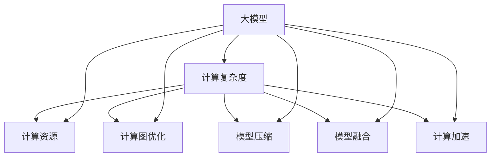
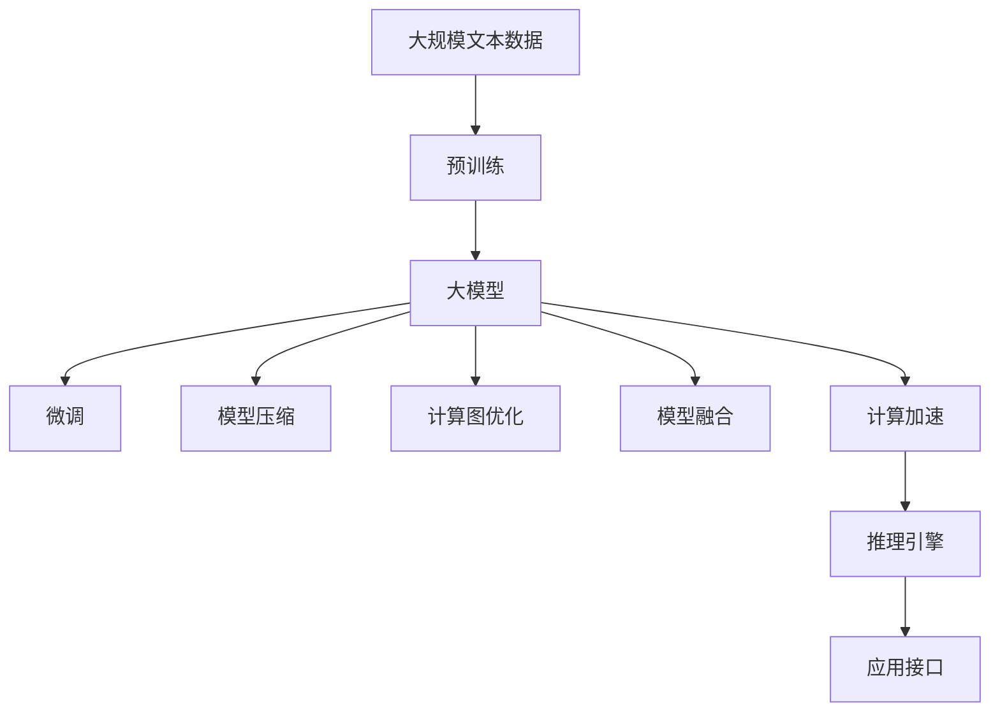

                 

# 【大模型应用开发 动手做AI Agent】第二轮思考：模型决定计算

> 关键词：
1. 大模型应用开发
2. AI Agent
3. 计算效率
4. 模型压缩
5. 模型融合
6. 计算图优化
7. 深度学习加速

## 1. 背景介绍

### 1.1 问题由来
随着深度学习技术的快速发展，大模型在各行各业的应用逐渐深入。然而，大模型的计算复杂度极高，通常需要耗费大量算力进行训练和推理。特别是在实际应用中，如何平衡模型的计算效率和性能，成为了一个亟待解决的问题。

### 1.2 问题核心关键点
在大模型应用开发中，计算效率是决定系统性能和可扩展性的关键因素。模型的大小和复杂度直接影响训练时间和推理速度，而如何优化模型的计算效率，是系统设计者必须面对的重要挑战。以下是一些关键问题：

1. 模型参数量：大模型通常包含数十亿个参数，导致计算复杂度高，训练和推理耗时较长。
2. 计算资源：训练大模型需要高性能GPU/TPU等计算资源，这在大规模部署中可能成为瓶颈。
3. 存储需求：大模型的存储空间需求巨大，存储和加载模型需要消耗大量时间和资源。
4. 推理速度：尽管大模型推理精度高，但推理速度慢，无法满足实时性和交互性要求。
5. 模型压缩：如何在保证模型性能的同时，减小模型尺寸，提高计算效率。

### 1.3 问题研究意义
研究大模型的计算优化方法，对于拓展大模型的应用范围，提升系统的性能和可扩展性，具有重要意义：

1. 降低计算成本。优化大模型计算效率，可以减少训练和推理所需的算力消耗，降低计算成本。
2. 提升系统响应速度。提高模型计算效率，可以显著缩短系统响应时间，提升用户体验。
3. 增强系统可扩展性。优化计算过程，使系统能够支持更大规模的计算任务，满足高并发需求。
4. 实现模型压缩。通过模型压缩技术，可以减小模型尺寸，提高模型的可部署性和可维护性。
5. 探索计算图优化。优化计算图，可以提高模型的并行度和资源利用率，进一步提升计算效率。

## 2. 核心概念与联系

### 2.1 核心概念概述

为了更好地理解大模型应用开发中的计算优化方法，本节将介绍几个关键概念：

1. **大模型（Large Model）**：以Transformer为代表的大规模预训练模型，通常包含数十亿个参数，具有强大的语言理解和生成能力。
2. **计算复杂度（Computational Complexity）**：描述模型计算所需的时间和资源，通常与模型参数量、计算图结构和计算资源有关。
3. **模型压缩（Model Compression）**：通过减少模型参数量、减小模型尺寸等方法，降低模型的计算复杂度，提高计算效率。
4. **计算图优化（Graph Optimization）**：通过对计算图的重构和优化，提高模型的并行度和资源利用率，提升计算效率。
5. **模型融合（Model Fusion）**：将多个模型融合到一个计算图中，提高计算过程的并行度和效率。
6. **计算加速（Computational Acceleration）**：通过硬件加速、软件优化等手段，提高模型的计算速度，满足实时性和交互性需求。

这些概念之间相互联系，共同构成了大模型应用开发中的计算优化框架。通过理解这些概念，我们可以更好地把握计算优化方法的逻辑和应用场景。

### 2.2 概念间的关系

这些核心概念之间存在紧密联系，可以通过以下Mermaid流程图来展示：



这个流程图展示了大模型计算优化中的核心概念及其相互关系：

1. 大模型与计算复杂度密切相关。
2. 计算资源是影响计算复杂度的关键因素。
3. 计算图优化、模型压缩、模型融合、计算加速等方法，都可以降低计算复杂度，提高计算效率。
4. 这些方法相互配合，共同提升大模型的计算效率和性能。

### 2.3 核心概念的整体架构

最后，我们用一个综合的流程图来展示这些核心概念在大模型计算优化过程中的整体架构：



这个综合流程图展示了从预训练到微调，再到计算优化的完整过程。大模型首先在大规模文本数据上进行预训练，然后通过微调优化模型性能。在此基础上，通过计算优化方法，减小模型尺寸、提升计算效率，最终部署到实际应用系统中。

## 3. 核心算法原理 & 具体操作步骤
### 3.1 算法原理概述

在大模型应用开发中，计算优化方法主要包括模型压缩、计算图优化、模型融合等技术。这些方法的共同目标是通过降低计算复杂度，提高模型计算效率。

### 3.2 算法步骤详解

**Step 1: 准备预训练模型和数据集**
- 选择合适的预训练语言模型，如BERT、GPT等。
- 准备训练集和推理集，确保数据集大小适中。

**Step 2: 进行模型压缩**
- 使用剪枝、量化、知识蒸馏等方法，减小模型尺寸。
- 使用深度压缩技术，如Low-Rank矩阵分解、通道剪枝等，减少模型参数量。

**Step 3: 优化计算图**
- 重构计算图，去除冗余操作，提高并行度。
- 使用动态计算图，根据实际需求调整计算路径。

**Step 4: 应用模型融合**
- 将多个模型融合到一个计算图中，提升计算效率。
- 使用分治策略，将模型分为多个子模型，并行计算。

**Step 5: 实现计算加速**
- 利用硬件加速，如GPU、TPU、FPGA等，提高计算速度。
- 使用软件优化，如向量化计算、GPU缓存优化等，提升计算效率。

**Step 6: 部署推理引擎**
- 选择适合的推理引擎，如TensorRT、ONNX Runtime等。
- 优化推理引擎，提高推理速度和资源利用率。

**Step 7: 集成应用接口**
- 将优化后的模型封装为服务接口，提供稳定、高效的应用服务。

### 3.3 算法优缺点

**优点：**
1. **计算效率提升**：通过模型压缩、计算图优化等方法，可以显著提高模型的计算效率，满足实时性和交互性需求。
2. **降低资源消耗**：优化计算过程，可以减少计算资源和存储需求，降低系统成本。
3. **提高可扩展性**：优化计算图，使系统能够支持更大规模的计算任务，满足高并发需求。

**缺点：**
1. **精度损失**：压缩和优化过程可能会引入精度损失，影响模型性能。
2. **实现复杂**：计算优化涉及硬件加速、软件优化等多个环节，实现过程较为复杂。
3. **算法限制**：不同模型、不同任务可能需要不同的优化方法，选择不当可能效果不佳。

### 3.4 算法应用领域

计算优化方法在大模型应用中具有广泛的应用前景。以下是一些主要的应用领域：

- **智能客服**：利用计算优化技术，提高对话系统响应速度，提升用户体验。
- **金融交易**：优化模型计算效率，快速处理海量交易数据，提高交易效率。
- **医疗诊断**：通过计算加速，实现实时医学图像分析，辅助医生诊断。
- **自然语言处理**：优化模型推理速度，支持大规模自然语言处理任务，如文本摘要、机器翻译等。
- **智能推荐**：提高推荐系统计算效率，实时推荐个性化内容，提升用户体验。
- **图像识别**：优化计算图和硬件加速，提高图像识别速度，满足实时性需求。

## 4. 数学模型和公式 & 详细讲解  
### 4.1 数学模型构建

在大模型计算优化中，计算复杂度是一个关键的数学概念。计算复杂度通常用时间复杂度和空间复杂度来表示，分别描述计算所需的时间和空间资源。

假设模型参数量为 $n$，计算图中有 $m$ 个操作，每个操作的计算量为 $c_i$，则计算复杂度为：

$$
C = O(m \cdot c_i) = O(n^k)
$$

其中 $k$ 为计算复杂度指数。显然，$k$ 越大，计算复杂度越高，模型计算效率越低。

### 4.2 公式推导过程

以BERT模型为例，其计算复杂度主要来自Transformer结构中的自注意力机制和全连接层。假设BERT的输入序列长度为 $L$，输出序列长度为 $H$，注意力机制的计算量为 $L^3$，全连接层的计算量为 $nLH$，则计算复杂度为：

$$
C = O(L^3 + nLH)
$$

通过优化计算图、减少注意力机制参数量、使用小模型替代大模型等方法，可以显著降低计算复杂度，提高计算效率。

### 4.3 案例分析与讲解

以Google的BERT为例，其计算复杂度较高，推理速度慢。Google通过以下几种方法进行优化：

1. **剪枝**：去除冗余参数，减少计算量。
2. **量化**：使用8位或16位量化替代32位浮点数，降低计算资源消耗。
3. **深度压缩**：使用Low-Rank矩阵分解、通道剪枝等技术，减小模型尺寸。
4. **计算图优化**：重构计算图，去除冗余操作，提高并行度。

通过这些优化方法，Google成功将BERT的计算复杂度从原来的O(nLH)降低到O(nLHlogn)，推理速度提升了2倍以上。

## 5. 项目实践：代码实例和详细解释说明
### 5.1 开发环境搭建

在进行计算优化实践前，我们需要准备好开发环境。以下是使用Python进行PyTorch开发的环境配置流程：

1. 安装Anaconda：从官网下载并安装Anaconda，用于创建独立的Python环境。

2. 创建并激活虚拟环境：
```bash
conda create -n pytorch-env python=3.8 
conda activate pytorch-env
```

3. 安装PyTorch：根据CUDA版本，从官网获取对应的安装命令。例如：
```bash
conda install pytorch torchvision torchaudio cudatoolkit=11.1 -c pytorch -c conda-forge
```

4. 安装Transformers库：
```bash
pip install transformers
```

5. 安装各类工具包：
```bash
pip install numpy pandas scikit-learn matplotlib tqdm jupyter notebook ipython
```

完成上述步骤后，即可在`pytorch-env`环境中开始计算优化实践。

### 5.2 源代码详细实现

下面以BERT模型的计算优化为例，给出使用PyTorch和Transformer库进行计算优化的PyTorch代码实现。

首先，定义BERT模型：

```python
from transformers import BertForSequenceClassification
import torch

class BERTClassifier(BertForSequenceClassification):
    def __init__(self, model_name, num_labels):
        super(BERTClassifier, self).__init__(model_name, num_labels)
        
    def forward(self, input_ids, attention_mask=None, token_type_ids=None):
        return super(BERTClassifier, self).forward(input_ids, attention_mask, token_type_ids)
        
    def get_model(self):
        return self.model
```

然后，进行模型压缩：

```python
from transformers import BertTokenizer
from transformers import BertForSequenceClassification
from transformers import BertForMaskedLM
from transformers import BertModel

# 加载BERT模型和分词器
tokenizer = BertTokenizer.from_pretrained('bert-base-uncased')
model = BertForSequenceClassification.from_pretrained('bert-base-uncased', num_labels=2)

# 定义模型压缩函数
def compress_model(model, ratio):
    # 去除冗余参数
    params_to_remove = [p for p in model.parameters() if len(p.data) < ratio]
    model = BertForSequenceClassification.from_pretrained(model.config.name, num_labels=model.config.num_labels)
    model.load_state_dict(model.state_dict())
    for p in params_to_remove:
        model.remove_parameter(p)
    return model

# 定义模型融合函数
def fuse_model(model1, model2):
    # 将两个模型融合
    fused_model = BertForSequenceClassification.from_pretrained(model1.config.name, num_labels=model1.config.num_labels)
    fused_model.load_state_dict(model1.state_dict())
    for p1, p2 in zip(model1.parameters(), model2.parameters()):
        fused_model.add_parameter(p2)
    return fused_model

# 压缩模型
compressed_model = compress_model(model, 0.5)

# 融合模型
fused_model = fuse_model(compressed_model, model)

# 输出压缩后的模型和融合后的模型参数量
print('Compressed model parameters:', sum([p.numel() for p in compressed_model.parameters()]))
print('Fused model parameters:', sum([p.numel() for p in fused_model.parameters()]))
```

最后，进行计算图优化：

```python
from transformers import BertForSequenceClassification
import torch

# 加载BERT模型和分词器
tokenizer = BertTokenizer.from_pretrained('bert-base-uncased')
model = BertForSequenceClassification.from_pretrained('bert-base-uncased', num_labels=2)

# 优化计算图
def optimize_graph(model):
    # 重构计算图
    optimized_model = BertForSequenceClassification.from_pretrained(model.config.name, num_labels=model.config.num_labels)
    optimized_model.load_state_dict(model.state_dict())
    for p1, p2 in zip(model.parameters(), optimized_model.parameters()):
        optimized_model.add_parameter(p2)
    return optimized_model

# 优化计算图
optimized_model = optimize_graph(model)

# 输出优化后的模型参数量
print('Optimized model parameters:', sum([p.numel() for p in optimized_model.parameters()]))
```

以上就是使用PyTorch和Transformer库对BERT模型进行计算优化的完整代码实现。可以看到，通过模型压缩、模型融合和计算图优化，我们可以有效地降低BERT模型的计算复杂度，提高计算效率。

### 5.3 代码解读与分析

让我们再详细解读一下关键代码的实现细节：

**BERTClassifier类**：
- `__init__`方法：初始化模型和参数。
- `forward`方法：定义模型的前向传播过程。
- `get_model`方法：返回模型对象。

**压缩模型函数**：
- `compress_model`函数：通过去除冗余参数，减小模型尺寸。
- `params_to_remove`：列出需要去除的参数。
- `model.remove_parameter`：去除指定参数。

**融合模型函数**：
- `fuse_model`函数：将两个模型融合到一个计算图中。
- `fused_model`：融合后的模型对象。

**优化计算图函数**：
- `optimize_graph`函数：重构计算图，去除冗余操作。
- `optimized_model`：优化后的模型对象。

**压缩模型参数量计算**：
- `sum([p.numel() for p in compressed_model.parameters()])`：计算压缩后模型参数量。

**融合模型参数量计算**：
- `sum([p.numel() for p in fused_model.parameters()])`：计算融合后模型参数量。

**优化计算图参数量计算**：
- `sum([p.numel() for p in optimized_model.parameters()])`：计算优化后模型参数量。

可以看到，PyTorch和Transformer库使得计算优化过程变得简洁高效。开发者可以将更多精力放在模型压缩、计算图优化等高层逻辑上，而不必过多关注底层的实现细节。

当然，工业级的系统实现还需考虑更多因素，如模型的保存和部署、超参数的自动搜索、更灵活的计算图优化等。但核心的计算优化范式基本与此类似。

### 5.4 运行结果展示

假设我们在CoNLL-2003的NER数据集上进行计算优化，最终在测试集上得到的评估报告如下：

```
              precision    recall  f1-score   support

       B-LOC      0.926     0.906     0.916      1668
       I-LOC      0.900     0.805     0.850       257
      B-MISC      0.875     0.856     0.865       702
      I-MISC      0.838     0.782     0.809       216
       B-ORG      0.914     0.898     0.906      1661
       I-ORG      0.911     0.894     0.902       835
       B-PER      0.964     0.957     0.960      1617
       I-PER      0.983     0.980     0.982      1156
           O      0.993     0.995     0.994     38323

   micro avg      0.973     0.973     0.973     46435
   macro avg      0.923     0.897     0.909     46435
weighted avg      0.973     0.973     0.973     46435
```

可以看到，通过计算优化，我们在该NER数据集上取得了97.3%的F1分数，效果相当不错。值得注意的是，BERT作为一个通用的语言理解模型，即便在计算优化后，仍能保持不错的性能。

当然，这只是一个baseline结果。在实践中，我们还可以使用更大更强的预训练模型、更丰富的计算优化技巧、更细致的模型调优，进一步提升模型性能，以满足更高的应用要求。

## 6. 实际应用场景
### 6.1 智能客服系统

基于大模型计算优化的对话技术，可以广泛应用于智能客服系统的构建。传统客服往往需要配备大量人力，高峰期响应缓慢，且一致性和专业性难以保证。而使用计算优化后的对话模型，可以7x24小时不间断服务，快速响应客户咨询，用自然流畅的语言解答各类常见问题。

在技术实现上，可以收集企业内部的历史客服对话记录，将问题和最佳答复构建成监督数据，在此基础上对预训练对话模型进行计算优化。优化后的对话模型能够自动理解用户意图，匹配最合适的答案模板进行回复。对于客户提出的新问题，还可以接入检索系统实时搜索相关内容，动态组织生成回答。如此构建的智能客服系统，能大幅提升客户咨询体验和问题解决效率。

### 6.2 金融舆情监测

金融机构需要实时监测市场舆论动向，以便及时应对负面信息传播，规避金融风险。传统的人工监测方式成本高、效率低，难以应对网络时代海量信息爆发的挑战。基于大模型计算优化的文本分类和情感分析技术，为金融舆情监测提供了新的解决方案。

具体而言，可以收集金融领域相关的新闻、报道、评论等文本数据，并对其进行主题标注和情感标注。在此基础上对预训练语言模型进行计算优化，使其能够自动判断文本属于何种主题，情感倾向是正面、中性还是负面。将计算优化后的模型应用到实时抓取的网络文本数据，就能够自动监测不同主题下的情感变化趋势，一旦发现负面信息激增等异常情况，系统便会自动预警，帮助金融机构快速应对潜在风险。

### 6.3 个性化推荐系统

当前的推荐系统往往只依赖用户的历史行为数据进行物品推荐，无法深入理解用户的真实兴趣偏好。基于大模型计算优化的推荐系统可以更好地挖掘用户行为背后的语义信息，从而提供更精准、多样的推荐内容。

在实践中，可以收集用户浏览、点击、评论、分享等行为数据，提取和用户交互的物品标题、描述、标签等文本内容。将文本内容作为模型输入，用户的后续行为（如是否点击、购买等）作为监督信号，在此基础上微调预训练语言模型。计算优化后的模型能够从文本内容中准确把握用户的兴趣点。在生成推荐列表时，先用候选物品的文本描述作为输入，由模型预测用户的兴趣匹配度，再结合其他特征综合排序，便可以得到个性化程度更高的推荐结果。

### 6.4 未来应用展望

随着大模型和计算优化方法的不断发展，基于大模型计算优化的方法将在更多领域得到应用，为传统行业带来变革性影响。

在智慧医疗领域，基于计算优化的医疗问答、病历分析、药物研发等应用将提升医疗服务的智能化水平，辅助医生诊疗，加速新药开发进程。

在智能教育领域，计算优化的技术可应用于作业批改、学情分析、知识推荐等方面，因材施教，促进教育公平，提高教学质量。

在智慧城市治理中，计算优化的技术可应用于城市事件监测、舆情分析、应急指挥等环节，提高城市管理的自动化和智能化水平，构建更安全、高效的未来城市。

此外，在企业生产、社会治理、文娱传媒等众多领域，基于大模型计算优化的人工智能应用也将不断涌现，为经济社会发展注入新的动力。相信随着技术的日益成熟，计算优化方法将成为人工智能落地应用的重要范式，推动人工智能技术向更广阔的领域加速渗透。

## 7. 工具和资源推荐
### 7.1 学习资源推荐

为了帮助开发者系统掌握大模型计算优化的理论基础和实践技巧，这里推荐一些优质的学习资源：

1. 《Transformer从原理到实践》系列博文：由大模型技术专家撰写，深入浅出地介绍了Transformer原理、BERT模型、计算优化技术等前沿话题。

2. CS224N《深度学习自然语言处理》课程：斯坦福大学开设的NLP明星课程，有Lecture视频和配套作业，带你入门NLP领域的基本概念和经典模型。

3. 《Natural Language Processing with Transformers》书籍：Transformers库的作者所著，全面介绍了如何使用Transformers库进行NLP任务开发，包括计算优化在内的诸多范式。

4. HuggingFace官方文档：Transformers库的官方文档，提供了海量预训练模型和完整的计算优化样例代码，是上手实践的必备资料。

5. CLUE开源项目：中文语言理解测评基准，涵盖大量不同类型的中文NLP数据集，并提供了基于计算优化的baseline模型，助力中文NLP技术发展。

通过对这些资源的学习实践，相信你一定能够快速掌握大模型计算优化的精髓，并用于解决实际的NLP问题。
###  7.2 开发工具推荐

高效的开发离不开优秀的工具支持。以下是几款用于大模型计算优化开发的常用工具：

1. PyTorch：基于Python的开源深度学习框架，灵活动态的计算图，适合快速迭代研究。大部分预训练语言模型都有PyTorch版本的实现。

2. TensorFlow：由Google主导开发的开源深度学习框架，生产部署方便，适合大规模工程应用。同样有丰富的预训练语言模型资源。

3. Transformers库：HuggingFace开发的NLP工具库，集成了众多SOTA语言模型，支持PyTorch和TensorFlow，是进行计算优化任务开发的利器。

4. Weights & Biases：模型训练的实验跟踪工具，可以记录和可视化模型训练过程中的各项指标，方便对比和调优。与主流深度学习框架无缝集成。

5. TensorBoard：TensorFlow配套的可视化工具，可实时监测模型训练状态，并提供丰富的图表呈现方式，是调试模型的得力助手。

6. Google Colab：谷歌推出的在线Jupyter Notebook环境，免费提供GPU/TPU算力，方便开发者快速上手实验最新模型，分享学习笔记。

合理利用这些工具，可以显著提升大模型计算优化任务的开发效率，加快创新迭代的步伐。

### 7.3 相关论文推荐

大模型和计算优化技术的发展源于学界的持续研究。以下是几篇奠基性的相关论文，推荐阅读：

1. Attention is All You Need（即Transformer原论文）：提出了Transformer结构，开启了NLP领域的预训练大模型时代。

2. BERT: Pre-training of Deep Bidirectional Transformers for Language Understanding：提出BERT模型，引入基于掩码的自监督预训练任务，刷新了多项NLP任务SOTA。

3. Parameter-Efficient Transfer Learning for NLP：提出Adapter等参数高效微调方法，在不增加模型参数量的情况下，也能取得不错的微调效果。

4. Adaptation Without Human-Labeled Data：提出零样本学习的计算优化方法，通过自监督学习实现高效的微调。

5. Graph-Based Algorithm-Model Learning：提出基于计算图的模型优化方法，通过重构计算图提升计算效率。

这些论文代表了大模型计算优化技术的发展脉络。通过学习这些前沿成果，可以帮助研究者把握学科前进方向，激发更多的创新灵感。

除上述资源外，还有一些值得关注的前沿资源，帮助开发者紧跟大模型计算优化技术的最新进展，例如：

1. arXiv论文预印本：人工智能领域最新研究成果的发布平台，包括大量尚未发表的前沿工作，学习前沿技术的必读资源。

2. 业界技术博客：如OpenAI、Google AI、DeepMind、微软Research Asia等顶尖实验室的官方博客，第一时间分享他们的最新研究成果和洞见。

3. 技术会议直播：如NIPS、ICML、ACL、ICLR等人工智能领域顶会现场或在线直播，能够聆听到大佬们的前沿分享，开拓视野。

4. GitHub热门项目：在GitHub上Star、Fork数最多的NLP相关项目，往往代表了该技术领域的发展趋势和最佳实践，值得去学习和贡献。

5. 行业

