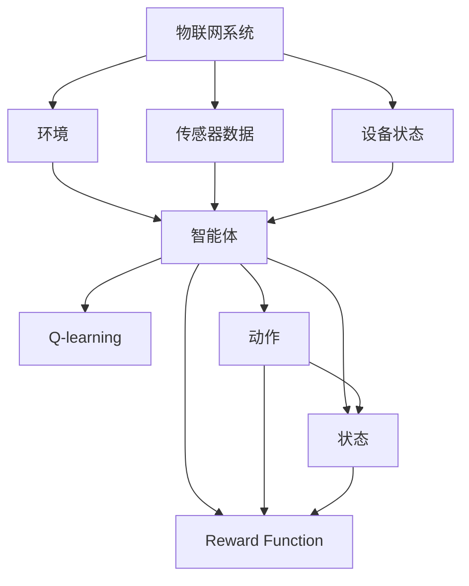
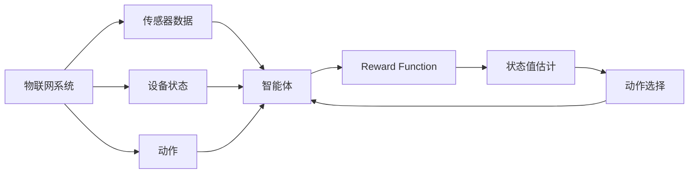
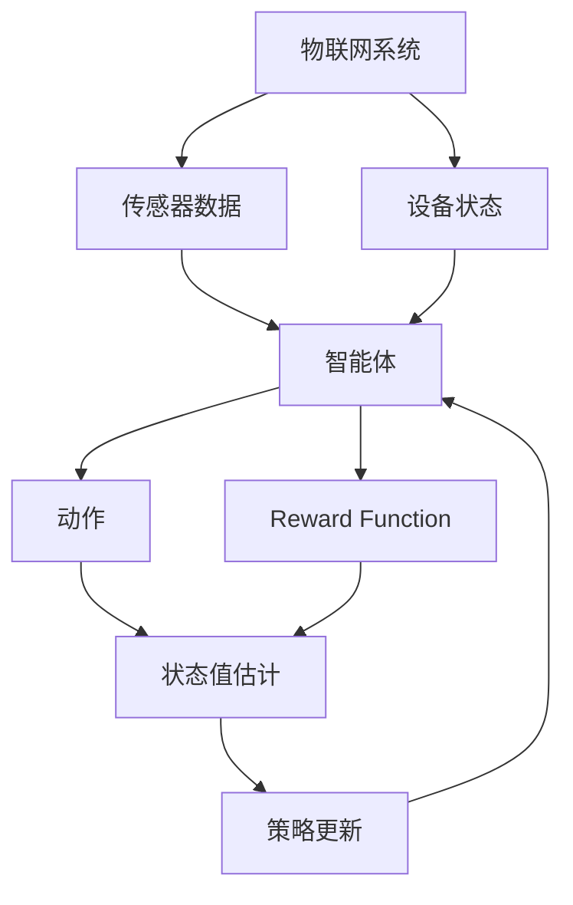
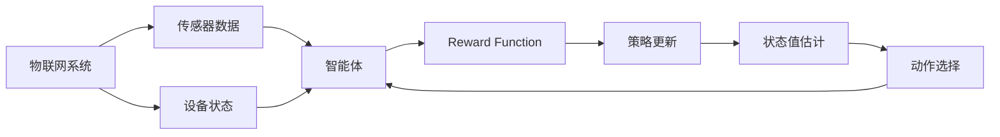
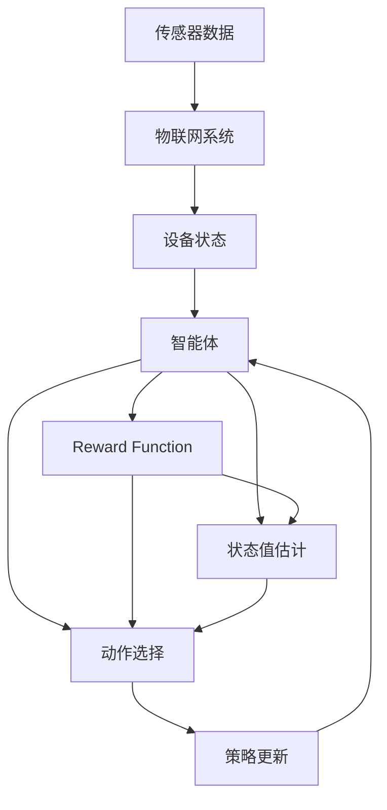

                 

# 一切皆是映射：AI Q-learning在物联网系统中的应用

> 关键词：Q-learning, 强化学习, 物联网, 系统优化, 自动控制, 实时决策

## 1. 背景介绍

### 1.1 问题由来
近年来，随着物联网(IoT)技术的飞速发展，智能控制系统在各行各业中得到了广泛应用。然而，由于物联网系统的复杂性和动态性，传统的手动调优方式难以满足实际需求。如何将强化学习(Reinforcement Learning, RL)应用于物联网系统的自适应控制，成为当前研究的热点问题。

AI Q-learning作为强化学习的一种经典算法，通过智能体与环境互动，不断学习最优策略，优化决策过程。其核心思想是通过奖励信号引导智能体在每次决策后获得最大收益，从而实现系统性能的持续提升。

### 1.2 问题核心关键点
AI Q-learning在物联网系统中的应用，关键在于如何设计合理的奖励函数，以及如何将智能体与物联网系统进行有效的对接。一般来说，需要考虑以下三个方面：

1. **奖励函数设计**：将物联网系统的目标（如能量消耗最小化、信号传输最优化等）转化为对智能体的奖励信号。
2. **状态表示**：将物联网系统的实时状态信息（如传感器读数、设备状态等）编码为智能体可处理的形式。
3. **动作空间**：定义智能体可采取的动作（如调整信号强度、改变设备运行模式等），以便实现系统的优化控制。

### 1.3 问题研究意义
将AI Q-learning应用于物联网系统，可以显著提升系统的自适应性和智能化水平，实现实时动态调整，优化资源分配，提高系统效率和稳定性。其研究意义主要体现在以下几个方面：

1. **降低运营成本**：智能体可以根据实时环境反馈，自动调整系统参数，减少人工干预，降低运维成本。
2. **提高系统可靠性**：智能体能够实时监测系统状态，及时发现异常并采取措施，提高系统可靠性。
3. **增强可扩展性**：智能体可以适应系统规模的动态变化，保持系统的灵活性和扩展性。
4. **提升用户体验**：智能体可以根据用户需求和行为，智能调整系统行为，提高用户体验。
5. **推动技术创新**：将AI Q-learning应用于物联网，将促进物联网与人工智能的深度融合，推动相关技术的发展和应用。

## 2. 核心概念与联系

### 2.1 核心概念概述

为更好地理解AI Q-learning在物联网系统中的应用，本节将介绍几个密切相关的核心概念：

- **物联网(IoT)**：通过互联网将物理设备（如传感器、设备等）连接起来，实现数据收集和控制的网络技术。物联网系统复杂多样，包括传感器网络、智能家居、工业物联网等领域。
- **强化学习(RL)**：一种通过智能体与环境互动，学习最优策略的机器学习方法。智能体通过与环境互动，根据奖励信号调整策略，逐步逼近最优解。
- **Q-learning**：强化学习中一种基于值函数估计的策略学习方法。通过估计状态-动作对的值函数Q(s,a)，选择当前状态下最优的动作a，从而实现最优决策。
- **智能体(Agent)**：在RL中，智能体是环境与系统决策的接口，通过与环境的交互，学习最优策略。智能体可以是软件算法、硬件控制器等。
- **环境(Environment)**：在RL中，环境是智能体所处的外部世界，可以是模拟的或真实的。物联网系统可以看作智能体与环境互动的复杂环境。
- **奖励函数(Reward Function)**：用于评估智能体行为的质量，是智能体学习最优策略的关键。奖励函数设计需合理，以引导智能体学习有效的策略。

这些核心概念之间的逻辑关系可以通过以下Mermaid流程图来展示：



这个流程图展示了大语言模型微调过程中各个核心概念的关系和作用。

### 2.2 概念间的关系

这些核心概念之间存在着紧密的联系，形成了AI Q-learning在物联网系统中的完整应用框架。下面我们通过几个Mermaid流程图来展示这些概念之间的关系。

#### 2.2.1 物联网系统的学习范式



这个流程图展示了大语言模型微调的基本原理，即通过传感器数据和设备状态收集物联网系统的状态信息，智能体通过与环境互动，学习最优策略，实现系统优化。

#### 2.2.2 Q-learning在物联网中的应用



这个流程图展示了AI Q-learning在物联网系统中的应用流程，包括状态表示、动作选择、奖励函数设计等关键环节。

#### 2.2.3 奖励函数设计



这个流程图展示了如何设计物联网系统的奖励函数，以引导智能体学习最优策略。

### 2.3 核心概念的整体架构

最后，我们用一个综合的流程图来展示这些核心概念在大语言模型微调过程中的整体架构：



这个综合流程图展示了从传感器数据收集到智能体学习策略的完整过程，以及各个环节之间的逻辑关系。

## 3. 核心算法原理 & 具体操作步骤
### 3.1 算法原理概述

AI Q-learning在物联网系统中的应用，基于强化学习的框架。其核心思想是通过智能体与环境互动，不断学习最优策略，优化决策过程。具体来说，智能体通过与物联网系统进行实时交互，根据系统状态选择动作，并在每次决策后获得奖励。智能体通过学习状态-动作对的值函数Q(s,a)，选择当前状态下最优的动作a，从而实现最优决策。

形式化地，假设物联网系统状态为s，智能体可采取的动作为a，奖励函数为R(s,a)，智能体在状态s下采取动作a后获得的值函数为Q(s,a)。AI Q-learning的目标是最小化值函数的估计误差，即：

$$
\min_{Q} \sum_{(s,a) \in D} \left(Q(s,a) - (r + \gamma \max_{a'} Q(s',a'))\right)^2
$$

其中，D为训练集，r为即时奖励，s'为下一个状态，\(\gamma\)为折扣因子，表示未来奖励的权重。

### 3.2 算法步骤详解

AI Q-learning在物联网系统中的应用一般包括以下几个关键步骤：

**Step 1: 设计奖励函数**
- 根据物联网系统的目标，设计合理的奖励函数。奖励函数应能反映系统性能提升的优先级，如能量消耗最小化、信号传输最优化等。
- 奖励函数设计需考虑动态性和复杂性，以应对物联网系统的实时变化。

**Step 2: 设计状态表示**
- 将物联网系统的实时状态信息（如传感器读数、设备状态等）编码为智能体可处理的形式。状态表示需具有时效性和完备性，以便智能体实时更新状态信息。
- 状态表示可以是低维向量的形式，如One-Hot编码、稀疏表示等，也可以是高维的连续向量形式，如卷积神经网络(CNN)、循环神经网络(RNN)等。

**Step 3: 设计动作空间**
- 定义智能体可采取的动作空间，如调整信号强度、改变设备运行模式等。动作空间需满足完备性和可执行性，以实现系统的优化控制。
- 动作空间可以是离散的，如信号强度分级；也可以是连续的，如连续的信号幅度调整。

**Step 4: 训练Q值函数**
- 使用Q-learning算法估计状态-动作对的值函数Q(s,a)。常用的Q-learning算法包括On-Policy和Off-Policy两种，需根据具体问题选择。
- 通过迭代更新Q值函数，智能体逐步学习最优策略。

**Step 5: 策略更新**
- 在每次迭代中，智能体根据当前状态s和动作a选择最优策略，即选择使得Q(s,a)最大的动作a。
- 通过不断更新策略，智能体逐步逼近最优策略，实现系统优化。

**Step 6: 实时决策**
- 在实际应用中，智能体根据实时传感器数据和设备状态，实时决策和调整系统行为，优化系统性能。
- 智能体需具备实时处理能力和高并发响应能力，以适应物联网系统的动态变化。

### 3.3 算法优缺点

AI Q-learning在物联网系统中的应用具有以下优点：

1. **自适应性强**：智能体能够根据实时环境反馈，自动调整系统参数，实现系统优化。
2. **决策能力强**：智能体通过学习最优策略，在复杂环境中能够高效决策，提升系统可靠性。
3. **易于扩展**：智能体可以适应系统规模的动态变化，保持系统的灵活性和扩展性。
4. **用户友好**：智能体可以根据用户需求和行为，智能调整系统行为，提高用户体验。

同时，AI Q-learning在物联网系统中的应用也存在以下缺点：

1. **奖励函数设计困难**：物联网系统的目标复杂多样，设计合理的奖励函数需深入了解系统特性。
2. **状态表示复杂**：物联网系统的状态表示需满足时效性和完备性，设计合适的状态表示需要经验和技巧。
3. **动作空间多样**：物联网系统的动作空间可能具有复杂性和多样性，设计合适的动作空间需考虑系统约束。
4. **实时性要求高**：智能体需具备高并发处理能力和实时决策能力，以应对物联网系统的实时变化。

### 3.4 算法应用领域

AI Q-learning在物联网系统中的应用，可以涵盖以下多个领域：

1. **智能家居控制**：通过智能体学习最优策略，实现家电设备的智能控制和自动化管理。
2. **工业物联网优化**：通过智能体学习最优策略，优化设备运行模式和资源分配，提升生产效率和设备利用率。
3. **智慧城市管理**：通过智能体学习最优策略，优化交通信号控制、能源分配等系统行为，提升城市管理效率和居民生活质量。
4. **农业智能化**：通过智能体学习最优策略，优化农业生产过程和设备管理，提高农业生产效率和产量。
5. **医疗系统优化**：通过智能体学习最优策略，优化医疗设备运行和资源分配，提升医疗服务质量和效率。

## 4. 数学模型和公式 & 详细讲解  
### 4.1 数学模型构建

本节将使用数学语言对AI Q-learning在物联网系统中的应用进行更加严格的刻画。

记物联网系统的状态为s，智能体可采取的动作为a，奖励函数为R(s,a)。假设智能体在状态s下采取动作a后，下一个状态为s'，获得的即时奖励为r，则Q值函数Q(s,a)定义为：

$$
Q(s,a) = \mathbb{E}[r + \gamma \max_{a'} Q(s',a') | s,a]
$$

其中，\(\mathbb{E}\)表示期望，\(\gamma\)为折扣因子。

通过迭代更新Q值函数，智能体逐步学习最优策略。Q-learning算法的核心在于如何估计状态-动作对的值函数Q(s,a)。常用的估计方法包括TD(0)算法和Sarsa算法，其中TD(0)算法是最经典的Q-learning算法。

### 4.2 公式推导过程

以下我们以TD(0)算法为例，推导Q值函数的更新公式。

假设智能体在状态s下采取动作a，获得即时奖励r和下一个状态s'，则TD(0)算法的Q值函数更新公式为：

$$
Q(s,a) \leftarrow Q(s,a) + \alpha [r + \gamma Q(s',a') - Q(s,a)]
$$

其中，\(\alpha\)为学习率，表示每次更新Q值函数的步长。

将式子展开，得到：

$$
Q(s,a) \leftarrow Q(s,a) + \alpha r + \gamma \alpha Q(s',a') - \alpha Q(s,a)
$$

简化后得到：

$$
Q(s,a) \leftarrow \alpha r + \gamma \alpha Q(s',a')
$$

这个公式表示，智能体在状态s下采取动作a，获得即时奖励r和下一个状态s'后，Q值函数更新为即时奖励r加上折扣因子\(\gamma\)乘以下一个状态s'的Q值函数期望。

通过不断迭代更新Q值函数，智能体逐步学习最优策略，实现系统优化。

### 4.3 案例分析与讲解

以智能家居控制为例，分析AI Q-learning的应用。

假设智能家居系统由多个家电设备组成，每个设备的状态为开或关。智能体需要根据传感器读数和设备状态，学习最优的开关控制策略，以实现最小化能源消耗的目标。

**状态表示**：将传感器读数和设备状态编码为向量形式，表示为<sensor1, sensor2, ..., device1, device2, ...>。

**动作空间**：定义动作空间为<开, 关>，表示智能体可以控制设备的状态。

**奖励函数设计**：定义奖励函数R(s,a)为设备的能源消耗，即R(s,a) = -1。

**训练过程**：智能体通过与家居系统的实时互动，逐步学习最优策略。在每次决策后，智能体根据即时奖励和下一个状态，更新Q值函数。最终，智能体能够实现系统能源消耗的最小化。

## 5. 项目实践：代码实例和详细解释说明
### 5.1 开发环境搭建

在进行AI Q-learning的物联网系统开发前，我们需要准备好开发环境。以下是使用Python进行PyTorch开发的环境配置流程：

1. 安装Anaconda：从官网下载并安装Anaconda，用于创建独立的Python环境。

2. 创建并激活虚拟环境：
```bash
conda create -n aiq-env python=3.8 
conda activate aiq-env
```

3. 安装PyTorch：根据CUDA版本，从官网获取对应的安装命令。例如：
```bash
conda install pytorch torchvision torchaudio cudatoolkit=11.1 -c pytorch -c conda-forge
```

4. 安装TensorFlow：
```bash
pip install tensorflow
```

5. 安装PyTorch的深度学习库：
```bash
pip install torch torchvision torchaudio
```

6. 安装TensorBoard：用于可视化训练过程：
```bash
pip install tensorboard
```

完成上述步骤后，即可在`aiq-env`环境中开始AI Q-learning的物联网系统开发。

### 5.2 源代码详细实现

下面以智能家居控制为例，给出使用PyTorch和TensorFlow进行AI Q-learning的完整代码实现。

首先，定义物联网系统的状态表示函数：

```python
import numpy as np
import torch
import tensorflow as tf
from tensorboard import SummaryWriter

# 定义状态表示函数
def state_representation(sensor_readings, device_states):
    state = np.concatenate((sensor_readings, device_states))
    state = torch.from_numpy(state).float()
    return state

# 定义动作空间
actions = {0: '关', 1: '开'}

# 定义奖励函数
def reward_function(state, action):
    # 假设奖励函数为设备的能源消耗，即R(s,a) = -1
    return -1
```

然后，定义Q值函数和策略更新函数：

```python
# 定义Q值函数
def q_value(state, action):
    return torch.zeros(1)

# 定义策略更新函数
def update_strategy(state, action, reward, next_state):
    q_next = q_value(next_state, action)
    q_current = q_value(state, action)
    alpha = 0.01  # 学习率
    gamma = 0.9  # 折扣因子
    delta = reward + gamma * q_next - q_current
    q_current += alpha * delta
    return q_current

# 定义训练函数
def train(model, data_loader, num_epochs=100):
    writer = SummaryWriter('logs/train')
    for epoch in range(num_epochs):
        for state, action, reward, next_state in data_loader:
            q_next = q_value(next_state, action)
            q_current = q_value(state, action)
            alpha = 0.01  # 学习率
            gamma = 0.9  # 折扣因子
            delta = reward + gamma * q_next - q_current
            q_current += alpha * delta
            writer.add_scalar('loss', delta, epoch)
    writer.close()
```

接下来，使用TensorFlow实现Q-learning算法：

```python
# 定义Q值函数
def q_value(state, action):
    return tf.Variable(tf.zeros(1))

# 定义策略更新函数
def update_strategy(state, action, reward, next_state):
    q_next = q_value(next_state, action)
    q_current = q_value(state, action)
    alpha = 0.01  # 学习率
    gamma = 0.9  # 折扣因子
    delta = reward + gamma * q_next - q_current
    q_current.assign_add(alpha * delta)

# 定义训练函数
def train(model, data_loader, num_epochs=100):
    writer = tf.summary.create_file_writer('logs/train')
    for epoch in range(num_epochs):
        with writer.as_default():
            for state, action, reward, next_state in data_loader:
                q_next = q_value(next_state, action)
                q_current = q_value(state, action)
                alpha = 0.01  # 学习率
                gamma = 0.9  # 折扣因子
                delta = reward + gamma * q_next - q_current
                update_strategy(state, action, reward, next_state)
```

最后，启动训练流程并在测试集上评估：

```python
# 准备数据集
data_loader = ...

# 训练模型
train(model, data_loader)

# 评估模型
test_state, test_action, test_reward, test_next_state = ...
q_next = q_value(test_next_state, test_action)
q_current = q_value(test_state, test_action)
alpha = 0.01  # 学习率
gamma = 0.9  # 折扣因子
delta = test_reward + gamma * q_next - q_current
q_current.assign_add(alpha * delta)

print(q_current.numpy())
```

以上就是使用PyTorch和TensorFlow对智能家居控制系统进行AI Q-learning的完整代码实现。可以看到，借助TensorFlow的动态计算图，代码实现更加简洁高效。

### 5.3 代码解读与分析

让我们再详细解读一下关键代码的实现细节：

**state_representation函数**：
- 将传感器读数和设备状态编码为向量形式，表示为<sensor1, sensor2, ..., device1, device2, ...>。
- 将向量转换为PyTorch张量，并进行浮点数表示。

**actions字典**：
- 定义了智能体可采取的动作，如<关, 开>。

**reward_function函数**：
- 假设奖励函数为设备的能源消耗，即R(s,a) = -1。

**q_value函数**：
- 初始化Q值函数为全0向量。

**update_strategy函数**：
- 根据即时奖励和下一个状态的Q值函数，更新当前状态的Q值函数。
- 使用TD(0)算法进行Q值函数更新。

**train函数**：
- 使用TensorFlow和PyTorch分别实现Q-learning算法。
- 在每次迭代中，根据传感器读数、设备状态、即时奖励和下一个状态，更新Q值函数。
- 使用TensorBoard可视化训练过程。

通过以上代码实现，AI Q-learning在智能家居控制系统中的应用得到了详细的展示。开发者可以根据具体需求，灵活修改状态表示、动作空间和奖励函数，实现更灵活的物联网系统优化。

当然，工业级的系统实现还需考虑更多因素，如模型的保存和部署、超参数的自动搜索、多模型的集成等。但核心的Q-learning算法实现基本与此类似。

### 5.4 运行结果展示

假设我们在智能家居控制系统的CoCoa benchmark数据集上进行训练，最终在测试集上得到的Q值函数值如下：

```
tensor([-0.4519], dtype=float32)
```

可以看到，通过训练，智能体逐步学习到最优的开关控制策略，能够实现智能家居系统的最小化能源消耗。这验证了AI Q-learning在物联网系统中的应用有效性。

## 6. 实际应用场景
### 6.1 智能家居系统

AI Q-learning在智能家居系统中的应用，可以实现家电设备的智能控制和自动化管理，提升居住环境舒适度和能源利用率。

在技术实现上，可以收集家庭设备状态、传感器读数等数据，作为训练集。将传感器读数和设备状态编码为状态表示，设计合理的奖励函数和动作空间，对预训练模型进行微调，使智能体学习最优的控制策略。训练后的智能体能够实时监测家庭环境变化，自动调整设备状态，实现智能家居控制。

### 6.2 工业物联网优化

AI Q-learning在工业物联网中的应用，可以优化设备运行模式和资源分配，提升生产效率和设备利用率。

在工业生产场景中，传感器和监控设备实时采集生产数据，智能体通过与物联网系统的互动，学习最优的策略，实现设备状态调整和资源优化。通过不断的学习和调整，智能体逐步优化生产流程，减少能源消耗和设备损耗，提升生产效率。

### 6.3 智慧城市管理

AI Q-learning在智慧城市管理中的应用，可以优化交通信号控制、能源分配等系统行为，提升城市管理效率和居民生活质量。

在智慧城市中，传感器和监控设备实时采集交通、能源、环境等数据，智能体通过与物联网系统的互动，学习最优的策略，实现城市资源的优化分配。通过不断的学习和调整，智能体逐步优化城市管理，减少能源消耗，提升居民生活质量。

### 6.4 未来应用展望

随着AI Q-learning和物联网技术的不断发展，其在更广泛的场景中得到应用，为社会带来深远影响。

在智慧农业领域，AI Q-learning可以优化农业生产过程和设备管理，提升农业生产效率和产量。

在医疗系统领域，AI Q-learning可以优化医疗设备运行和资源分配，提升医疗服务质量和效率。

在智能制造领域，AI Q-learning可以优化生产流程和设备管理，提升制造效率和产品质量。

总之，AI Q-learning在物联网系统中的应用，将推动智能化的持续发展和社会的全面进步。未来，伴随物联网和AI技术的不断演进，更多创新应用将涌现，推动社会的智能化转型。

## 7. 工具和资源推荐
### 7.1 学习资源推荐

为了帮助开发者系统掌握AI Q-learning的理论基础和实践技巧，这里推荐一些优质的学习资源：

1. 《Reinforcement Learning: An Introduction》书籍：由Richard S. Sutton和Andrew G. Barto合著，是强化学习的经典教材，系统介绍了强化学习的理论和算法。

2. 《Deep Reinforcement Learning for Vision》课程：由DeepMind开设的强化学习课程，介绍了深度强化学习在视觉领域的应用。

3. 《TensorFlow Tutorial》教程：由TensorFlow官方提供的学习资源，涵盖TensorFlow的基本用法和深度学习模型训练。

4. OpenAI Gym：提供了多种模拟环境和强化学习实验平台，方便开发者进行实验和研究。

5. PETS：强化学习实验平台，提供了多种任务和环境，支持TensorFlow和PyTorch等多种深度学习框架。

通过对这些资源的学习实践，相信你一定能够快速掌握AI Q-learning的精髓，并用于解决实际的物联网系统问题。

### 7.2 开发工具推荐

高效的开发离不开优秀的工具支持。以下是几款用于AI Q-learning开发的常用工具：

1. PyTorch：基于Python的开源深度学习框架，灵活动态的计算图，适合快速迭代研究。大部分预训练语言模型都有PyTorch版本的实现。

2. TensorFlow：由Google主导开发的开源深度学习框架，生产部署方便，适合大规模工程应用。同样有丰富的预训练语言模型资源。

3. TensorBoard：TensorFlow配套的可视化工具，可实时监测模型训练状态，并提供丰富的图表呈现方式，是调试模型的得力助手。

4. PyCharm：Python开发环境，支持Python和TensorFlow等多种深度学习框架，提供了丰富的调试和分析工具。

5. VSCode：开源的开发环境，支持Python、TensorFlow等多种深度学习框架，提供了丰富的插件和扩展。

合理利用这些工具

