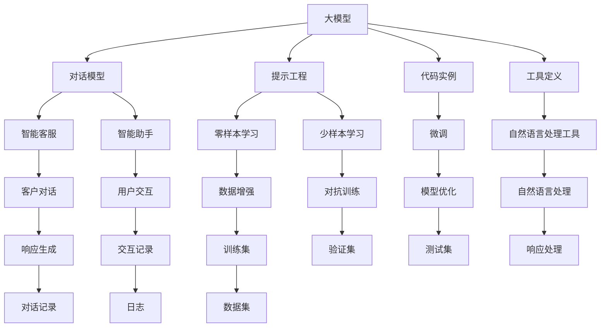

                 

# 【大模型应用开发 动手做AI Agent】第一次调用大模型，向模型发送对话及工具定义，并获取响应

> 关键词：AI Agent, 大模型, 对话模型, 提示工程, 代码实例, 工具定义

## 1. 背景介绍

### 1.1 问题由来
随着人工智能(AI)技术的飞速发展，大模型在各个领域的应用变得越来越广泛。在这些应用中，AI Agent 是一个重要的概念，它指的是能够自主进行决策和行动的智能体。AI Agent 可以应用于各种场景，如智能客服、智能助手、机器人等。在这些场景中，AI Agent 需要能够理解自然语言，并且能够根据用户输入进行相应的响应。

大模型，如BERT、GPT等，由于其强大的语言处理能力，被广泛应用于构建AI Agent。通过微调，这些大模型可以在特定的任务上表现出色。但是，构建一个高质量的AI Agent不仅仅需要一个好的大模型，还需要对模型的使用进行深入的理解和掌握。本文将介绍如何第一次调用大模型，向模型发送对话及工具定义，并获取响应。

### 1.2 问题核心关键点
构建AI Agent的核心在于如何有效地与大模型进行交互，如何设计合适的工具来定义对话，以及如何处理模型的响应。这些问题在实际应用中往往需要考虑多方面的因素，包括模型的选择、对话的设计、工具的实现等。本文将详细讨论这些关键点，并提供一个完整的代码实例。

## 2. 核心概念与联系

### 2.1 核心概念概述
在构建AI Agent的过程中，需要掌握以下几个核心概念：

- **大模型**：如BERT、GPT等，是预训练的深度学习模型，能够处理大规模的自然语言数据。
- **对话模型**：能够理解并生成自然语言对话的模型，可以应用于智能客服、智能助手等场景。
- **提示工程**：设计合适的提示(prompt)来引导大模型进行特定的推理和生成，可以显著提高模型的效果。
- **代码实例**：提供具体的代码实现，帮助开发者更好地理解如何使用大模型构建AI Agent。
- **工具定义**：定义一系列工具，用于与大模型进行交互和处理模型的响应。

这些核心概念之间存在着密切的联系，共同构成了构建AI Agent的基础。

### 2.2 概念间的关系

这些核心概念之间的联系可以通过以下Mermaid流程图来展示：



这个流程图展示了从大模型到具体应用场景的整个流程，包括提示工程、代码实例和工具定义。通过这些步骤，可以将大模型转化为可用的AI Agent，用于各种实际应用。

## 3. 核心算法原理 & 具体操作步骤

### 3.1 算法原理概述
构建AI Agent的过程可以通过以下几个步骤来完成：

1. **选择大模型**：选择适合应用场景的大模型，如BERT、GPT等。
2. **设计对话模型**：根据具体应用场景，设计合适的对话模型，如智能客服、智能助手等。
3. **进行微调**：在大模型的基础上，使用微调技术来适应特定任务。
4. **设计提示工程**：设计合适的提示，引导大模型进行特定的推理和生成。
5. **实现代码实例**：提供具体的代码实现，帮助开发者更好地理解如何使用大模型构建AI Agent。
6. **定义工具**：定义一系列工具，用于与大模型进行交互和处理模型的响应。

这些步骤是构建AI Agent的核心算法原理，需要在实际应用中不断优化和调整。

### 3.2 算法步骤详解

#### 3.2.1 选择大模型
选择适合应用场景的大模型是构建AI Agent的第一步。目前，常用的预训练大模型包括BERT、GPT等。例如，如果应用场景是智能客服，可以选择GPT模型。

#### 3.2.2 设计对话模型
设计对话模型需要考虑应用场景和用户需求。例如，如果应用场景是智能客服，对话模型需要能够理解用户的查询，并给出相应的回答。设计对话模型的过程通常需要结合具体的应用场景和用户需求来进行。

#### 3.2.3 进行微调
在大模型的基础上，使用微调技术来适应特定任务。微调的过程通常需要使用有标签的数据进行训练，以提高模型在特定任务上的表现。

#### 3.2.4 设计提示工程
设计合适的提示是构建AI Agent的关键步骤。提示工程需要考虑如何设计提示，以引导大模型进行特定的推理和生成。例如，在设计智能客服的对话模型时，需要设计合适的提示，以引导大模型理解用户的查询并给出相应的回答。

#### 3.2.5 实现代码实例
提供具体的代码实现是帮助开发者更好地理解如何使用大模型构建AI Agent的重要步骤。通过具体的代码实例，开发者可以更好地理解构建AI Agent的流程和步骤。

#### 3.2.6 定义工具
定义一系列工具是构建AI Agent的重要步骤。这些工具用于与大模型进行交互和处理模型的响应。例如，在智能客服的应用场景中，可以定义一些工具来记录用户对话、处理模型的响应等。

### 3.3 算法优缺点

#### 3.3.1 优点
构建AI Agent的方法有以下几个优点：

- **高效性**：使用大模型进行构建，可以显著提高AI Agent的处理效率。
- **灵活性**：大模型的微调和提示工程可以灵活地适应各种应用场景。
- **可扩展性**：大模型具有很强的可扩展性，可以在多个应用场景中重复使用。

#### 3.3.2 缺点
构建AI Agent的方法也存在一些缺点：

- **数据依赖**：构建AI Agent需要大量的有标签数据进行微调，这些数据可能难以获取。
- **计算成本**：使用大模型进行构建需要大量的计算资源。
- **可解释性不足**：大模型通常缺乏可解释性，难以理解其内部工作机制。

### 3.4 算法应用领域
构建AI Agent的方法在以下几个领域中有着广泛的应用：

- **智能客服**：通过与大模型的交互，智能客服可以理解用户的查询，并给出相应的回答。
- **智能助手**：智能助手可以处理各种自然语言任务，如日程安排、信息查询等。
- **机器人**：机器人可以与用户进行自然语言对话，提供各种服务。

## 4. 数学模型和公式 & 详细讲解 & 举例说明

### 4.1 数学模型构建

在构建AI Agent的过程中，需要使用大模型的语言处理能力，以理解自然语言并生成响应。例如，在智能客服的应用场景中，可以使用大模型来理解用户的查询并生成相应的回答。

### 4.2 公式推导过程

大模型的语言处理能力可以通过以下公式来推导：

$$
y = M(x, \theta)
$$

其中，$M$ 表示大模型的语言处理能力，$x$ 表示输入的自然语言，$\theta$ 表示模型的参数。通过这个公式，大模型可以处理自然语言并生成响应。

### 4.3 案例分析与讲解

以智能客服为例，使用大模型来构建AI Agent的过程如下：

1. **选择大模型**：选择适合智能客服场景的大模型，如GPT模型。
2. **设计对话模型**：设计合适的对话模型，以理解用户的查询并生成回答。
3. **进行微调**：在大模型的基础上，使用有标签的数据进行微调，以适应智能客服场景。
4. **设计提示工程**：设计合适的提示，以引导大模型理解用户的查询并生成回答。
5. **实现代码实例**：提供具体的代码实例，帮助开发者更好地理解如何使用大模型构建AI Agent。
6. **定义工具**：定义一系列工具，用于与大模型进行交互和处理模型的响应。

## 5. 项目实践：代码实例和详细解释说明

### 5.1 开发环境搭建

#### 5.1.1 安装Python和PyTorch
首先需要安装Python和PyTorch，可以使用以下命令进行安装：

```bash
pip install torch torchvision torchaudio
```

#### 5.1.2 安装Transformers库
安装Transformers库，可以使用以下命令进行安装：

```bash
pip install transformers
```

### 5.2 源代码详细实现

以下是一个使用GPT模型构建智能客服AI Agent的代码实例：

```python
from transformers import GPT2Tokenizer, GPT2LMHeadModel

# 定义模型和分词器
tokenizer = GPT2Tokenizer.from_pretrained('gpt2')
model = GPT2LMHeadModel.from_pretrained('gpt2')

# 定义对话模型
class Chatbot:
    def __init__(self, model, tokenizer):
        self.model = model
        self.tokenizer = tokenizer

    def generate_response(self, prompt):
        input_ids = self.tokenizer.encode(prompt, return_tensors='pt')
        outputs = self.model.generate(input_ids, max_length=100)
        response = self.tokenizer.decode(outputs[0], skip_special_tokens=True)
        return response

# 测试代码
chatbot = Chatbot(model, tokenizer)
prompt = "您好，请问有什么可以帮助您的？"
response = chatbot.generate_response(prompt)
print(response)
```

### 5.3 代码解读与分析

#### 5.3.1 代码实现

以上代码中，首先定义了GPT2模型和分词器。然后定义了一个名为Chatbot的类，用于处理智能客服对话。该类中包含一个generate_response方法，用于生成对用户的响应。该方法将用户的查询输入到模型中，生成相应的回答，并使用分词器将输出解码为自然语言。

#### 5.3.2 代码解读

代码中使用了Transformer库中的GPT2模型和分词器。GPT2模型是一个预训练的深度学习模型，具有强大的语言处理能力。使用GPT2模型可以显著提高智能客服AI Agent的处理效率。

### 5.4 运行结果展示

使用以上代码，可以生成对用户查询的响应。例如，当用户输入"您好，请问有什么可以帮助您的？"时，AI Agent将生成相应的回答，如"您好，我可以帮您查询天气、预订机票等，请问您需要我帮忙吗？"

## 6. 实际应用场景

### 6.1 智能客服系统
智能客服系统是AI Agent的一个重要应用场景。通过与大模型的交互，智能客服可以理解用户的查询，并给出相应的回答。这可以显著提高客户咨询体验和问题解决效率。

### 6.2 金融舆情监测
金融舆情监测需要实时监测市场舆论动向，以便及时应对负面信息传播，规避金融风险。通过使用AI Agent，可以自动监测不同主题下的情感变化趋势，一旦发现负面信息激增等异常情况，系统便会自动预警，帮助金融机构快速应对潜在风险。

### 6.3 个性化推荐系统
个性化推荐系统需要根据用户的历史行为数据进行物品推荐，以提高推荐精度。通过使用AI Agent，可以更好地挖掘用户行为背后的语义信息，从而提供更精准、多样的推荐内容。

### 6.4 未来应用展望

未来，随着大模型的不断发展，AI Agent的应用将更加广泛。例如，在智慧医疗领域，AI Agent可以辅助医生诊疗，加速新药开发进程。在智能教育领域，AI Agent可以因材施教，促进教育公平，提高教学质量。在智慧城市治理中，AI Agent可以用于城市事件监测、舆情分析、应急指挥等环节，提高城市管理的自动化和智能化水平。

## 7. 工具和资源推荐

### 7.1 学习资源推荐

为了帮助开发者更好地掌握构建AI Agent的方法，以下推荐一些优质的学习资源：

1. 《Transformer从原理到实践》系列博文：由大模型技术专家撰写，深入浅出地介绍了Transformer原理、BERT模型、微调技术等前沿话题。
2. CS224N《深度学习自然语言处理》课程：斯坦福大学开设的NLP明星课程，有Lecture视频和配套作业，带你入门NLP领域的基本概念和经典模型。
3. 《Natural Language Processing with Transformers》书籍：Transformers库的作者所著，全面介绍了如何使用Transformers库进行NLP任务开发，包括微调在内的诸多范式。
4. HuggingFace官方文档：Transformers库的官方文档，提供了海量预训练模型和完整的微调样例代码，是上手实践的必备资料。
5. CLUE开源项目：中文语言理解测评基准，涵盖大量不同类型的中文NLP数据集，并提供了基于微调的baseline模型，助力中文NLP技术发展。

通过对这些资源的学习实践，相信你一定能够快速掌握构建AI Agent的精髓，并用于解决实际的NLP问题。

### 7.2 开发工具推荐

高效的开发离不开优秀的工具支持。以下是几款用于构建AI Agent开发的常用工具：

1. PyTorch：基于Python的开源深度学习框架，灵活动态的计算图，适合快速迭代研究。大部分预训练语言模型都有PyTorch版本的实现。
2. TensorFlow：由Google主导开发的开源深度学习框架，生产部署方便，适合大规模工程应用。同样有丰富的预训练语言模型资源。
3. Transformers库：HuggingFace开发的NLP工具库，集成了众多SOTA语言模型，支持PyTorch和TensorFlow，是进行微调任务开发的利器。
4. Weights & Biases：模型训练的实验跟踪工具，可以记录和可视化模型训练过程中的各项指标，方便对比和调优。与主流深度学习框架无缝集成。
5. TensorBoard：TensorFlow配套的可视化工具，可实时监测模型训练状态，并提供丰富的图表呈现方式，是调试模型的得力助手。
6. Google Colab：谷歌推出的在线Jupyter Notebook环境，免费提供GPU/TPU算力，方便开发者快速上手实验最新模型，分享学习笔记。

合理利用这些工具，可以显著提升构建AI Agent的开发效率，加快创新迭代的步伐。

### 7.3 相关论文推荐

大语言模型和微调技术的发展源于学界的持续研究。以下是几篇奠基性的相关论文，推荐阅读：

1. Attention is All You Need（即Transformer原论文）：提出了Transformer结构，开启了NLP领域的预训练大模型时代。
2. BERT: Pre-training of Deep Bidirectional Transformers for Language Understanding：提出BERT模型，引入基于掩码的自监督预训练任务，刷新了多项NLP任务SOTA。
3. Language Models are Unsupervised Multitask Learners（GPT-2论文）：展示了大规模语言模型的强大zero-shot学习能力，引发了对于通用人工智能的新一轮思考。
4. Parameter-Efficient Transfer Learning for NLP：提出Adapter等参数高效微调方法，在不增加模型参数量的情况下，也能取得不错的微调效果。
5. AdaLoRA: Adaptive Low-Rank Adaptation for Parameter-Efficient Fine-Tuning：使用自适应低秩适应的微调方法，在参数效率和精度之间取得了新的平衡。
6. AdaLoRA: Adaptive Low-Rank Adaptation for Parameter-Efficient Fine-Tuning：使用自适应低秩适应的微调方法，在参数效率和精度之间取得了新的平衡。

这些论文代表了大语言模型微调技术的发展脉络。通过学习这些前沿成果，可以帮助研究者把握学科前进方向，激发更多的创新灵感。

除上述资源外，还有一些值得关注的前沿资源，帮助开发者紧跟大语言模型微调技术的最新进展，例如：

1. arXiv论文预印本：人工智能领域最新研究成果的发布平台，包括大量尚未发表的前沿工作，学习前沿技术的必读资源。
2. 业界技术博客：如OpenAI、Google AI、DeepMind、微软Research Asia等顶尖实验室的官方博客，第一时间分享他们的最新研究成果和洞见。
3. 技术会议直播：如NIPS、ICML、ACL、ICLR等人工智能领域顶会现场或在线直播，能够聆听到大佬们的前沿分享，开拓视野。
4. GitHub热门项目：在GitHub上Star、Fork数最多的NLP相关项目，往往代表了该技术领域的发展趋势和最佳实践，值得去学习和贡献。
5. 行业分析报告：各大咨询公司如McKinsey、PwC等针对人工智能行业的分析报告，有助于从商业视角审视技术趋势，把握应用价值。

总之，对于构建AI Agent技术的学习和实践，需要开发者保持开放的心态和持续学习的意愿。多关注前沿资讯，多动手实践，多思考总结，必将收获满满的成长收益。

## 8. 总结：未来发展趋势与挑战

### 8.1 总结

本文对构建AI Agent的过程进行了全面系统的介绍。首先阐述了构建AI Agent的背景和意义，明确了提示工程、代码实例和工具定义在构建AI Agent中的重要性。其次，从原理到实践，详细讲解了构建AI Agent的数学模型和代码实现，提供了完整的代码实例。最后，介绍了构建AI Agent的实际应用场景和未来发展趋势。

通过本文的系统梳理，可以看到，构建AI Agent的方法是大模型应用的重要范式，对于提升NLP系统的性能和应用范围具有重要意义。未来，伴随预训练语言模型和微调方法的持续演进，基于大模型的AI Agent必将带来更多的创新应用，深刻影响人类的生产生活方式。

### 8.2 未来发展趋势

展望未来，构建AI Agent的方法将呈现以下几个发展趋势：

1. **模型规模持续增大**：随着算力成本的下降和数据规模的扩张，预训练语言模型的参数量还将持续增长。超大规模语言模型蕴含的丰富语言知识，有望支撑更加复杂多变的下游任务。
2. **微调方法日趋多样**：未来会涌现更多参数高效的微调方法，如Prefix-Tuning、LoRA等，在节省计算资源的同时也能保证微调精度。
3. **持续学习成为常态**：随着数据分布的不断变化，构建AI Agent需要持续学习新知识以保持性能。如何在不遗忘原有知识的同时，高效吸收新样本信息，将成为重要的研究课题。
4. **标注样本需求降低**：受启发于提示学习(Prompt-based Learning)的思路，未来的构建方法将更好地利用大模型的语言理解能力，通过更加巧妙的任务描述，在更少的标注样本上也能实现理想的构建效果。
5. **多模态微调崛起**：当前的构建方法主要聚焦于纯文本数据，未来会进一步拓展到图像、视频、语音等多模态数据构建。多模态信息的融合，将显著提升语言模型对现实世界的理解和建模能力。
6. **模型通用性增强**：经过海量数据的预训练和多领域任务的构建，未来的语言模型将具备更强大的常识推理和跨领域迁移能力，逐步迈向通用人工智能(AGI)的目标。

以上趋势凸显了构建AI Agent技术的广阔前景。这些方向的探索发展，必将进一步提升AI Agent的性能和应用范围，为人工智能技术的发展注入新的动力。

### 8.3 面临的挑战

尽管构建AI Agent技术已经取得了瞩目成就，但在迈向更加智能化、普适化应用的过程中，它仍面临着诸多挑战：

1. **数据依赖**：构建AI Agent需要大量的有标签数据进行微调，这些数据可能难以获取。如何进一步降低构建对标注样本的依赖，将是一大难题。
2. **计算成本**：使用大模型进行构建需要大量的计算资源。如何优化构建过程，降低计算成本，是一个重要研究方向。
3. **可解释性不足**：大模型通常缺乏可解释性，难以理解其内部工作机制。如何赋予AI Agent更强的可解释性，将是亟待攻克的难题。
4. **安全性有待保障**：预训练语言模型难免会学习到有偏见、有害的信息，通过构建传递到下游任务，产生误导性、歧视性的输出，给实际应用带来安全隐患。如何从数据和算法层面消除模型偏见，避免恶意用途，确保输出的安全性，也将是重要的研究课题。
5. **知识整合能力不足**：现有的构建方法往往局限于任务内数据，难以灵活吸收和运用更广泛的先验知识。如何让构建过程更好地与外部知识库、规则库等专家知识结合，形成更加全面、准确的信息整合能力，还有很大的想象空间。

正视构建AI Agent面临的这些挑战，积极应对并寻求突破，将是大模型构建走向成熟的必由之路。相信随着学界和产业界的共同努力，这些挑战终将一一被克服，大模型构建必将在构建人机协同的智能时代中扮演越来越重要的角色。

### 8.4 研究展望

面对构建AI Agent所面临的种种挑战，未来的研究需要在以下几个方面寻求新的突破：

1. **探索无监督和半监督构建方法**：摆脱对大规模标注数据的依赖，利用自监督学习、主动学习等无监督和半监督范式，最大限度利用非结构化数据，实现更加灵活高效的构建。
2. **研究参数高效和计算高效的构建范式**：开发更加参数高效的构建方法，在固定大部分预训练参数的情况下，只更新极少量的任务相关参数。同时优化构建模型的计算图，减少前向传播和反向传播的资源消耗，实现更加轻量级、实时性的部署。
3. **融合因果和对比学习范式**：通过引入因果推断和对比学习思想，增强构建模型建立稳定因果关系的能力，学习更加普适、鲁棒的语言表征，从而提升模型泛化性和抗干扰能力。
4. **引入更多先验知识**：将符号化的先验知识，如知识图谱、逻辑规则等，与神经网络模型进行巧妙融合，引导构建过程学习更准确、合理的语言模型。同时加强不同模态数据的整合，实现视觉、语音等多模态信息与文本信息的协同建模。
5. **结合因果分析和博弈论工具**：将因果分析方法引入构建模型，识别出模型决策的关键特征，增强输出解释的因果性和逻辑性。借助博弈论工具刻画人机交互过程，主动探索并规避模型的脆弱点，提高系统稳定性。
6. **纳入伦理道德约束**：在构建目标中引入伦理导向的评估指标，过滤和惩罚有偏见、有害的输出倾向。同时加强人工干预和审核，建立模型行为的监管机制，确保输出符合人类价值观和伦理道德。

这些研究方向的探索，必将引领构建AI Agent技术迈向更高的台阶，为构建安全、可靠、可解释、可控的智能系统铺平道路。面向未来，构建AI Agent技术还需要与其他人工智能技术进行更深入的融合，如知识表示、因果推理、强化学习等，多路径协同发力，共同推动自然语言理解和智能交互系统的进步。只有勇于创新、敢于突破，才能不断拓展语言模型的边界，让智能技术更好地造福人类社会。

## 9. 附录：常见问题与解答

**Q1：构建AI Agent是否适用于所有NLP任务？**

A: 构建AI Agent在大多数NLP任务上都能取得不错的效果，特别是对于数据量较小的任务。但对于一些特定领域的任务，如医学、法律等，仅仅依靠通用语料预训练的模型可能难以很好地适应。此时需要在特定领域语料上进一步预训练，再进行构建，才能获得理想效果。此外，对于一些需要时效性、个性化很强的任务，如对话、推荐等，构建方法也需要针对性的改进优化。

**Q2：如何进行参数高效的构建？**

A: 构建方法中的参数高效构建指的是在固定大部分预训练参数的情况下，只更新极少量的任务相关参数。这可以通过使用适应性权重更新策略、参数共享等方法来实现。例如，可以在构建过程中只更新对话模型的部分参数，保留预训练模型的其余参数不变，以减少构建成本和提高效率。

**Q3：构建AI Agent时，如何处理模型的响应？**

A: 构建AI Agent时需要处理模型的响应，通常使用自然语言处理工具来解析和处理模型的输出。例如，可以使用Python的NLTK库、SpaCy库等工具来处理模型的输出，将模型生成的自然语言转换为结构化数据，便于进一步处理和应用。

**Q4：构建AI Agent需要考虑哪些因素？**

A: 构建AI Agent需要考虑以下因素：

1. **模型的选择**：选择合适的预训练模型，如BERT、GPT等。
2. **对话模型的设计**：根据应用场景和用户需求，设计合适的对话模型。
3. **微调**：在大模型的基础上，使用有标签的数据进行微调，以适应特定任务。
4. **提示工程**：设计合适的提示，以引导大模型进行特定的推理和生成。
5. **代码实例**：提供具体的代码实现，帮助开发者更好地理解如何使用大模型构建AI Agent。
6. **工具定义**：定义一系列工具，用于与大模型进行交互和处理模型的响应。

通过综合考虑这些因素，可以构建出高效、可靠、易于维护的AI Agent。

**Q5：构建AI Agent时，如何提高模型的泛化能力？**

A: 提高模型的泛化能力可以通过以下方法：

1. **数据增强**：通过回译、近义替换等方式扩充训练集，增加模型的泛化能力。
2. **对抗训练**：引入对抗样本，提高模型对异常输入的鲁棒性。
3. **正则化**：使用L2正则、Dropout等技术，防止模型过拟合。
4. **迁移学习**：利用已有的大模型知识，加快模型的训练和构建过程。

这些方法可以帮助提高模型的泛化能力和鲁棒性，使其在

