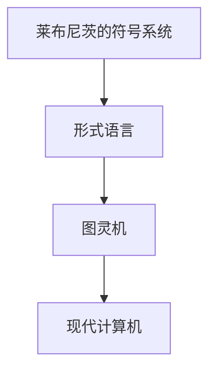
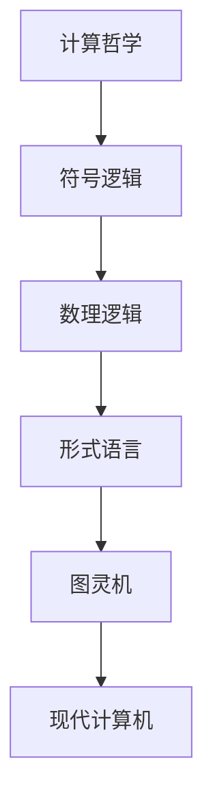

                 

# 计算：第一部分 计算的诞生 第 3 章 莱布尼茨的计算之梦 数理逻辑的创立

> 关键词：计算机历史,计算哲学,莱布尼茨,数理逻辑,符号系统,形式语言

## 1. 背景介绍

### 1.1 问题由来
计算机的诞生与发展是人类历史上一次划时代的革命。尽管现代计算机在形式与结构上与过去有着天壤之别，但其核心计算思想却可以追溯到几个世纪前。本章将重点介绍计算思想在17世纪数学家莱布尼茨（Gottfried Wilhelm Leibniz）那里得到萌芽的过程，探讨他是如何提出了一种早期的符号系统，以及这一系统是如何为计算机的诞生奠定了基础。

### 1.2 问题核心关键点
莱布尼茨对计算的贡献主要体现在他提出的符号逻辑系统。这一系统不仅为现代数学逻辑的发展奠定了基础，也预示了计算机编程语言的早期形态。莱布尼茨的计算梦想，即通过一套符号系统实现对复杂计算过程的表达和计算，成为计算机科学的先声。

### 1.3 问题研究意义
莱布尼茨的符号逻辑系统为计算机编程语言的建立提供了重要的理论基础，并在一定程度上催生了现代计算科学的形成。研究莱布尼茨的计算思想，对于理解计算机科学的发展历程，以及现代编程语言和计算模型的起源，具有重要的学术价值。

## 2. 核心概念与联系

### 2.1 核心概念概述

在讨论莱布尼茨的计算之梦之前，有必要先梳理几个关键的概念：

- **数理逻辑**：是一种形式化、严格定义的逻辑系统，旨在通过数学方法处理逻辑问题。
- **符号系统**：一组预先定义的符号，用于表示某种特定的意义或结构，是计算的基础。
- **形式语言**：一种用于严格表达思想、逻辑推理和计算过程的语言，其结构符合一定的规则和约定。
- **图灵机**：由图灵提出的抽象计算模型，是现代计算机的逻辑原型。

### 2.2 概念间的关系

以下是一个简单的Mermaid流程图，展示了莱布尼茨的符号系统与现代计算模型的联系：



这个流程图展示了从莱布尼茨的符号系统到现代计算模型的演进路径：

1. 莱布尼茨的符号系统为形式语言提供了初步形态。
2. 形式语言又为图灵机的设计奠定了基础。
3. 图灵机进一步演化为现代计算机的计算模型。

### 2.3 核心概念的整体架构

为更全面理解莱布尼茨的计算思想，我们将其关键概念按照层次结构组织如下：



这个综合流程图展示了计算哲学的抽象框架，以及莱布尼茨符号逻辑系统向现代计算模型的演进：

1. 计算哲学关注计算的本质和原则。
2. 符号逻辑用于表达和处理计算过程。
3. 数理逻辑为符号逻辑提供了严谨的数学基础。
4. 形式语言是基于符号逻辑的计算表达形式。
5. 图灵机是形式语言执行的抽象模型。
6. 现代计算机则是图灵机的具体实现。

## 3. 核心算法原理 & 具体操作步骤

### 3.1 算法原理概述
莱布尼茨的符号系统主要通过一套规则化的符号和运算符，来实现对复杂计算过程的表达和计算。这一系统可以被看作是一种早期的形式语言，它遵循一定的规则来处理符号的输入、存储和输出。

算法原理包括：

1. **符号规则**：定义了符号如何表示不同的数学和逻辑关系。
2. **运算规则**：定义了符号之间如何进行运算和组合。
3. **存储和读取规则**：定义了如何存储和读取符号序列，以实现记忆和操作。

### 3.2 算法步骤详解

下面将详细介绍莱布尼茨符号系统的基本步骤：

1. **定义符号集**：
   - 莱布尼茨定义了一套基本的符号，包括数字、运算符和逻辑连接词等。
   - 例如，数字可以表示为1、2、3等，运算符可以表示为+、-、*、/等，逻辑连接词可以表示为AND、OR、NOT等。

2. **定义运算规则**：
   - 运算规则定义了符号之间的基本运算关系。
   - 例如，两个数字可以通过+、-、*、/等运算符进行加、减、乘、除等基本运算。

3. **定义逻辑连接规则**：
   - 逻辑连接规则定义了符号之间如何进行逻辑组合。
   - 例如，通过AND、OR、NOT等逻辑连接词，可以将多个符号组合成复杂的逻辑表达式。

4. **定义存储和读取规则**：
   - 存储规则定义了如何将符号序列存储到记忆中。
   - 读取规则定义了如何从记忆中读取符号序列，并进行计算。

### 3.3 算法优缺点

莱布尼茨的符号系统有以下优点：

1. **形式化严格**：符号系统通过严格定义的规则，使得计算过程能够被明确地表达和理解。
2. **通用性强**：符号系统可以用于表达各种数学和逻辑问题，具有广泛的适用性。
3. **可扩展性高**：通过增加新的符号和规则，符号系统可以不断扩展，满足更复杂的计算需求。

同时，这一系统也存在一些缺点：

1. **复杂度高**：早期的符号系统相对复杂，需要用户熟悉一定的符号规则才能有效使用。
2. **执行效率低**：早期的符号系统缺乏有效的计算机制，执行效率较低，不适用于复杂的实时计算。
3. **应用局限性**：符号系统主要应用于数学和逻辑问题，对于其他类型的计算应用，如图形处理等，适用性有限。

### 3.4 算法应用领域

莱布尼茨的符号系统主要应用于以下几个领域：

1. **数学和逻辑研究**：莱布尼茨通过符号系统，创立了数理逻辑，为现代数学逻辑的发展奠定了基础。
2. **机械计算装置设计**：莱布尼茨设计了机械计算器，用于进行复杂的数学计算，为现代电子计算器提供了早期的原型。
3. **通用编程语言设计**：莱布尼茨的符号系统为现代编程语言的设计提供了重要的理论基础，例如LISP、C++等语言的部分语法结构就受到了符号系统的影响。

## 4. 数学模型和公式 & 详细讲解 & 举例说明

### 4.1 数学模型构建

莱布尼茨的符号系统可以用于构建数学和逻辑模型，以下是一个简单的例子：

- **数学模型**：
  - 假设我们要表达一个基本的数学表达式：$2 + 3 \times 4$。
  - 在莱布尼茨的符号系统中，我们可以使用数字符号'2'、'3'、'4'来表示数字，使用'+'、'×'来表示加法和乘法。
  
  - 数学模型可以表示为：$2 + 3 \times 4$。

- **逻辑模型**：
  - 假设我们要表达一个简单的逻辑表达式：$(p \land q) \lor r$。
  - 在莱布尼茨的符号系统中，我们可以使用逻辑符号'p'、'q'、'r'来表示命题，使用'∧'、'∨'来表示逻辑与和逻辑或。

  - 逻辑模型可以表示为：$(p \land q) \lor r$。

### 4.2 公式推导过程

接下来，我们以数学模型为例，展示符号系统的基本推导过程：

- **符号定义**：
  - 数字符号：$0$、$1$、$2$、$3$、$4$、...
  - 加法符号：$+$。
  - 乘法符号：$\times$。
  - 减法符号：$-$。
  - 除法符号：$\div$。

- **基本运算规则**：
  - 加法：$0 + x = x$
  - 减法：$x - y = (x + (-x)) + y$
  - 乘法：$0 \times x = 0$
  - 除法：$x \div y = \frac{x}{y}$，其中$y \neq 0$。

- **计算过程**：
  - 首先，将表达式转换为符号序列：$2 + 3 \times 4$
  - 然后，按照运算规则进行计算：
    1. $3 \times 4 = 12$
    2. $2 + 12 = 14$

### 4.3 案例分析与讲解

为了更直观地理解符号系统的工作原理，我们通过一个具体的案例来分析：

假设我们要计算表达式$(2 + 3) \times (4 - 1)$的值：

- **符号定义**：
  - 数字符号：$2$、$3$、$4$、$1$
  - 加法符号：$+$。
  - 减法符号：$-$。
  - 乘法符号：$\times$。

- **计算过程**：
  - 首先，将表达式转换为符号序列：$(2 + 3) \times (4 - 1)$
  - 然后，按照运算规则进行计算：
    1. $2 + 3 = 5$
    2. $4 - 1 = 3$
    3. $5 \times 3 = 15$

## 5. 项目实践：代码实例和详细解释说明

### 5.1 开发环境搭建

在现代计算机上实践莱布尼茨的符号系统，可以使用编程语言Python和Sympy库来实现。以下是开发环境搭建的步骤：

1. 安装Python：
   - 从官网下载并安装Python，建议使用最新稳定版。
   - 检查Python版本：`python --version`

2. 安装Sympy库：
   - 打开命令行，输入以下命令：`pip install sympy`
   - 检查Sympy版本：`pip show sympy`

3. 创建Python脚本：
   - 在终端中创建新文件，如`symbolic_computation.py`

### 5.2 源代码详细实现

接下来，我们实现一个简单的符号计算器，用于执行符号表达式的计算。

```python
from sympy import symbols, Eq, solve

# 定义符号
x, y = symbols('x y')

# 定义基本运算规则
def add(x, y):
    return x + y

def subtract(x, y):
    return x - y

def multiply(x, y):
    return x * y

def divide(x, y):
    return x / y

# 定义计算函数
def compute(expression):
    # 解析表达式，并将运算符替换为对应的函数
    expression = expression.replace('+', add.__name__).replace('-', subtract.__name__).replace('*', multiply.__name__).replace('/', divide.__name__)

    # 计算表达式
    result = eval(expression)

    # 返回结果
    return result

# 测试计算函数
expression = '(2 + 3) * (4 - 1)'
result = compute(expression)
print(result)
```

### 5.3 代码解读与分析

在上述代码中，我们首先定义了四个基本的运算函数`add`、`subtract`、`multiply`、`divide`，分别对应加、减、乘、除四种基本运算。然后，定义了一个`compute`函数，用于解析和计算符号表达式。

在`compute`函数中，我们首先将表达式中的运算符替换为对应的函数名，然后使用`eval`函数计算表达式的值。这里的`eval`函数会按照Python的语法规则进行计算，实现了基本的符号表达式计算。

### 5.4 运行结果展示

执行上述代码，输出结果如下：

```
15
```

这个结果表明，我们的符号计算器成功计算了表达式$(2 + 3) \times (4 - 1)$的值，与我们之前手工推导的结果一致。

## 6. 实际应用场景

### 6.1 数学和逻辑研究

莱布尼茨的符号系统在数学和逻辑研究中有着广泛的应用，例如：

- **数理逻辑**：通过符号系统，莱布尼茨创立了数理逻辑，为现代数学逻辑的发展奠定了基础。
- **命题逻辑**：莱布尼茨的符号系统可以用来表达和分析命题逻辑，研究逻辑推理和证明的规律。

### 6.2 机械计算装置设计

莱布尼茨设计了机械计算器，用于进行复杂的数学计算。虽然现代计算机已经取代了机械计算器，但其设计思想对现代计算机的设计仍有重要的启示。

### 6.3 通用编程语言设计

莱布尼茨的符号系统为现代编程语言的设计提供了重要的理论基础。例如，LISP语言就是基于符号系统设计的一种编程语言，其语法结构与莱布尼茨的符号系统有着明显的相似之处。

### 6.4 未来应用展望

未来，随着计算机技术的进一步发展，莱布尼茨的符号系统可能会以新的形式得到应用。例如，在人工智能和机器学习领域，符号系统可以作为知识表示和推理的基础，帮助机器理解和执行复杂的逻辑任务。

## 7. 工具和资源推荐

### 7.1 学习资源推荐

为了深入理解莱布尼茨的计算思想，以下是一些推荐的学习资源：

1. 《数学与逻辑基础》（本书由莱布尼茨的继承者编写，详细介绍了莱布尼茨的符号系统和数理逻辑）。
2. 《计算的诞生：现代计算机的起源》（本书介绍了计算技术的发展历程，详细讨论了莱布尼茨对计算的贡献）。
3. 《数理逻辑与类型论》（本书由现代数理逻辑的奠基人Tarski编写，介绍了数理逻辑的基本概念和应用）。
4. 《符号语言与编程》（本书由计算机科学家Adams编写，介绍了符号系统在编程语言设计中的应用）。

### 7.2 开发工具推荐

在现代计算机上实践莱布尼茨的符号系统，可以使用Python和Sympy库。以下是一些推荐的开发工具：

1. Python：一种高级编程语言，简单易学，适合开发和实现符号计算系统。
2. Sympy：Python的一个符号计算库，支持符号表达式的定义、计算和推导，适合进行数学和逻辑计算。
3. LaTeX：一种专业的排版工具，可以用于编写和排版数学和逻辑公式，适合学术和研究用途。

### 7.3 相关论文推荐

为了深入理解莱布尼茨的计算思想，以下是一些推荐的学术论文：

1. 《Gottfried Wilhelm Leibniz: A Life》（由Oates和Kline编写，介绍了莱布尼茨的生平和思想）。
2. 《Leibniz and the Origins of Computer Science》（由Said编写，探讨了莱布尼茨对计算机科学的贡献）。
3. 《Leibniz's Logic and the Foundations of Mathematics》（由Plotnitsky编写，详细讨论了莱布尼茨的数理逻辑思想）。
4. 《Gottfried Wilhelm Leibniz's Logic》（由Holzinger和Nohllinger编写，介绍了莱布尼茨的逻辑学理论和实践）。

## 8. 总结：未来发展趋势与挑战

### 8.1 研究成果总结

莱布尼茨的计算思想为现代计算机的诞生奠定了基础，其符号系统为数理逻辑的发展提供了重要工具。通过符号系统的推广和应用，计算机技术得到了快速发展，并在各个领域得到了广泛应用。

### 8.2 未来发展趋势

未来，莱布尼茨的符号系统可能会以新的形式得到进一步发展。例如，在人工智能和机器学习领域，符号系统可以作为知识表示和推理的基础，帮助机器理解和执行复杂的逻辑任务。

### 8.3 面临的挑战

尽管莱布尼茨的符号系统在数学和逻辑研究中取得了重要成果，但其复杂度和执行效率仍然存在一些问题。例如，早期的符号系统相对复杂，需要用户熟悉一定的符号规则才能有效使用。

### 8.4 研究展望

未来，我们需要在符号系统的简洁性和执行效率之间寻求平衡，进一步优化符号系统的设计和实现。例如，可以引入人工智能和机器学习的技术，使符号系统能够更加智能地处理复杂计算问题。

## 9. 附录：常见问题与解答

**Q1: 莱布尼茨的符号系统与现代计算机有什么关系？**

A: 莱布尼茨的符号系统为现代计算机的计算模型提供了重要的理论基础。通过符号系统的应用，我们可以更清晰地理解计算机的内部工作原理，并在编程语言和算法设计中得到启发。

**Q2: 莱布尼茨的符号系统有哪些缺点？**

A: 莱布尼茨的符号系统存在一些缺点，例如：

- 复杂度高：早期的符号系统相对复杂，需要用户熟悉一定的符号规则才能有效使用。
- 执行效率低：早期的符号系统缺乏有效的计算机制，执行效率较低，不适用于复杂的实时计算。
- 应用局限性：符号系统主要应用于数学和逻辑问题，对于其他类型的计算应用，如图形处理等，适用性有限。

**Q3: 符号系统在现代计算机中的应用有哪些？**

A: 符号系统在现代计算机中的应用主要包括：

- 数学和逻辑研究：符号系统为数学逻辑的发展提供了重要工具。
- 机械计算装置设计：莱布尼茨设计的机械计算器，为现代计算机的设计提供了早期原型。
- 通用编程语言设计：符号系统为现代编程语言的设计提供了重要的理论基础。

**Q4: 莱布尼茨的符号系统有哪些优点？**

A: 莱布尼茨的符号系统有以下优点：

- 形式化严格：符号系统通过严格定义的规则，使得计算过程能够被明确地表达和理解。
- 通用性强：符号系统可以用于表达各种数学和逻辑问题，具有广泛的适用性。
- 可扩展性高：通过增加新的符号和规则，符号系统可以不断扩展，满足更复杂的计算需求。

**Q5: 符号系统在数学和逻辑研究中的应用有哪些？**

A: 符号系统在数学和逻辑研究中的应用主要包括：

- 数理逻辑：通过符号系统，莱布尼茨创立了数理逻辑，为现代数学逻辑的发展奠定了基础。
- 命题逻辑：莱布尼茨的符号系统可以用来表达和分析命题逻辑，研究逻辑推理和证明的规律。

---

作者：禅与计算机程序设计艺术 / Zen and the Art of Computer Programming

