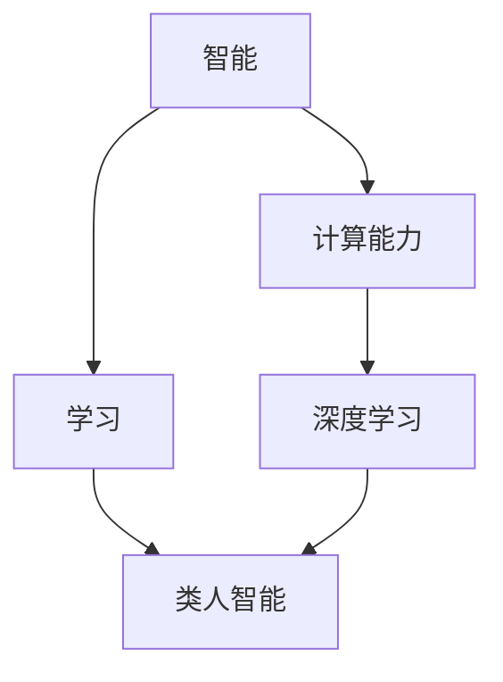

                 

# 计算：第四部分 计算的极限 第 12 章 机器能思考吗 聪明的乌鸦

> 关键词：人工智能,机器学习,深度学习,计算极限,智能,乌鸦

## 1. 背景介绍

### 1.1 问题由来

随着计算技术的发展，机器能思考、具有智能的观念逐渐变得流行。从早期的图灵测试到现今的深度学习，人类对机器智能的追求从未停歇。然而，对于机器是否真的能思考，能否具备与人类类似的智能，学界和产业界始终存在不同的看法。

### 1.2 问题核心关键点

机器能思考的核心问题包括以下几点：
1. **智能的定义**：如何定义智能，它是怎么样的？
2. **机器智能的实现**：现有技术能否实现机器智能？
3. **智能的边界**：机器的智能程度是否能够与人类匹敌？
4. **智能的应用**：智能机器在实际生活中的应用价值。

这些关键点反映了当前机器智能研究的焦点和难点，也构成了本章的核心内容。

### 1.3 问题研究意义

研究机器能否思考，不仅有助于揭示智能的本质，而且对于推动人工智能技术的发展具有重要意义。它不仅关乎技术层面，更关乎伦理、法律、社会等多个领域，具有深远的理论价值和实际意义。

## 2. 核心概念与联系

### 2.1 核心概念概述

在本节中，我们将介绍几个与机器智能相关的重要概念，并讨论它们之间的联系。

- **智能(Smartness)**：指机器能够理解和执行复杂任务的能力。
- **计算能力(Computational Power)**：指机器执行算法和处理信息的能力。
- **学习(Learning)**：指机器通过经验调整其行为以适应特定任务的过程。
- **深度学习(Deep Learning)**：一种使用多层次神经网络模型进行学习的机器学习技术。
- **类人智能(Human-like Intelligence)**：指机器在某些方面展现出类似于人类的智能行为。

这些概念共同构成了机器智能的核心领域，下面我们将详细讨论它们之间的联系。

### 2.2 概念间的关系

这些核心概念之间的联系可以用以下 Mermaid 流程图来展示：



这个流程图展示了智能、计算能力、学习和深度学习之间的相互关系。

- 智能依赖于计算能力和学习，这是实现智能的基础。
- 深度学习是一种实现学习的技术手段，可以用于提升计算能力。
- 类人智能是指机器在特定方面展现出类似人类的智能，它是智能的一个子集。

通过这些概念的关系，我们可以更清晰地理解机器智能的实现机制。

## 3. 核心算法原理 & 具体操作步骤

### 3.1 算法原理概述

机器智能的核心算法原理基于深度学习。深度学习模型通过多层次的神经网络对大量数据进行学习，提取出高层次的特征表示，进而实现对复杂任务的识别和预测。其核心思想是通过学习大量的数据和模型参数，让机器能够理解和执行复杂的任务。

### 3.2 算法步骤详解

深度学习模型的训练步骤通常包括以下几个步骤：

1. **数据准备**：收集和预处理训练数据，生成输入和标签对。
2. **模型定义**：定义模型的结构和参数，通常使用神经网络模型。
3. **模型训练**：使用训练数据对模型进行优化，通常采用梯度下降算法。
4. **模型评估**：使用测试数据评估模型的性能，通常采用准确率、精确率、召回率等指标。
5. **模型部署**：将训练好的模型部署到实际应用中，进行推理预测。

下面以一个简单的分类问题为例，详细说明深度学习模型的训练过程。

### 3.3 算法优缺点

深度学习的优点包括：
1. **自动特征提取**：通过多层次的神经网络，深度学习能够自动提取出数据中的高层次特征。
2. **泛化能力强**：深度学习模型在大规模数据上训练得到的特征表示，能够很好地泛化到新的数据上。
3. **处理非结构化数据**：深度学习能够处理图像、语音、文本等多种类型的非结构化数据。

其缺点包括：
1. **计算资源消耗大**：深度学习模型通常需要大量的计算资源进行训练和推理。
2. **模型复杂度高**：深度学习模型的结构复杂，难以解释和调试。
3. **数据依赖性强**：深度学习模型的性能高度依赖于训练数据的质量和数量。

### 3.4 算法应用领域

深度学习技术在多个领域都有广泛应用，包括但不限于：

- **计算机视觉**：如图像分类、目标检测、图像生成等。
- **自然语言处理**：如文本分类、机器翻译、对话系统等。
- **语音识别**：如语音识别、语音合成等。
- **推荐系统**：如商品推荐、新闻推荐等。

## 4. 数学模型和公式 & 详细讲解 & 举例说明

### 4.1 数学模型构建

在深度学习中，我们通常使用多层次的神经网络模型来表示复杂的数据结构和特征。以一个简单的两层神经网络为例，其数学模型可以表示为：

$$
y = W_2 \sigma(W_1 x + b_1) + b_2
$$

其中，$x$ 为输入数据，$y$ 为输出，$W_1, W_2$ 为权重，$b_1, b_2$ 为偏置，$\sigma$ 为激活函数。

### 4.2 公式推导过程

接下来，我们将对上述模型进行详细推导。首先，使用链式法则对模型求导，得到损失函数对权重和偏置的梯度：

$$
\frac{\partial \mathcal{L}}{\partial W_1} = \frac{\partial \mathcal{L}}{\partial y} \frac{\partial y}{\partial W_1}
$$

将 $y$ 的表达式代入上述公式，得到：

$$
\frac{\partial \mathcal{L}}{\partial W_1} = \frac{\partial \mathcal{L}}{\partial y} \frac{\partial y}{\partial x} \frac{\partial x}{\partial W_1}
$$

进一步展开和简化，得到：

$$
\frac{\partial \mathcal{L}}{\partial W_1} = \frac{\partial \mathcal{L}}{\partial y} \sigma'(W_1 x + b_1)
$$

其中，$\sigma'$ 为激活函数的导数。

### 4.3 案例分析与讲解

假设我们的任务是二分类任务，即判断一张图片是否含有猫。我们使用上述模型进行训练，并使用交叉熵损失函数作为损失函数。训练过程中，我们计算模型输出与真实标签之间的差异，并使用梯度下降算法优化模型参数。在训练过程中，我们不断调整权重和偏置，使得模型在测试集上的表现尽可能好。

## 5. 项目实践：代码实例和详细解释说明

### 5.1 开发环境搭建

在本节中，我们将详细介绍深度学习模型的开发环境搭建。

1. **安装Python**：
   - 从官网下载并安装Python，建议安装最新版本。
   - 配置环境变量，设置Python的路径。

2. **安装深度学习框架**：
   - 安装TensorFlow或PyTorch等深度学习框架。

3. **安装相关工具**：
   - 安装Numpy、Pandas、Scikit-Learn等工具。

### 5.2 源代码详细实现

下面以一个简单的手写数字识别为例，展示使用TensorFlow进行深度学习模型的实现。

```python
import tensorflow as tf
from tensorflow.keras import layers

# 定义模型
model = tf.keras.Sequential([
    layers.Flatten(input_shape=(28, 28)),
    layers.Dense(128, activation='relu'),
    layers.Dense(10, activation='softmax')
])

# 编译模型
model.compile(optimizer='adam', loss='sparse_categorical_crossentropy', metrics=['accuracy'])

# 训练模型
model.fit(x_train, y_train, epochs=10, validation_data=(x_test, y_test))
```

### 5.3 代码解读与分析

上述代码中，我们首先定义了一个包含两个密集层的神经网络模型。模型接收28x28的图像输入，输出为10个类别的概率分布。模型使用Adam优化器和交叉熵损失函数进行编译，并使用训练数据进行10个epoch的训练。在每个epoch后，模型在测试集上进行评估，输出模型在测试集上的精度。

### 5.4 运行结果展示

训练完成后，我们可以使用模型对新数据进行预测，例如：

```python
import numpy as np
from tensorflow.keras.preprocessing.image import load_img, img_to_array

# 加载图像
img = load_img('example.jpg', target_size=(28, 28))
img_array = img_to_array(img)
img_array = np.expand_dims(img_array, axis=0)

# 预测图像类别
predictions = model.predict(img_array)
class_index = np.argmax(predictions)
```

## 6. 实际应用场景

### 6.1 智能系统

深度学习技术已经被广泛应用于智能系统的开发中，例如：

- **自动驾驶**：通过深度学习模型对摄像头、雷达等传感器数据进行处理，实现自动驾驶。
- **机器人导航**：使用深度学习模型对环境进行建模和路径规划，实现机器人的自主导航。

### 6.2 医疗诊断

深度学习在医疗诊断中也有广泛应用，例如：

- **医学影像分析**：通过深度学习模型对CT、MRI等医学影像进行分析和诊断。
- **基因组分析**：使用深度学习模型对基因组数据进行分析，发现新的基因与疾病的关联。

### 6.3 自然语言处理

自然语言处理是深度学习的重要应用领域，例如：

- **机器翻译**：使用深度学习模型实现语言之间的自动翻译。
- **情感分析**：通过深度学习模型对文本进行情感分类，判断情感倾向。

## 7. 工具和资源推荐

### 7.1 学习资源推荐

为了帮助读者更好地掌握深度学习技术，推荐以下学习资源：

1. **《深度学习》书籍**：Ian Goodfellow等人的经典之作，涵盖深度学习的基本原理和实践方法。
2. **Coursera《深度学习专项课程》**：由Andrew Ng主讲的深度学习课程，内容系统全面，适合初学者和进阶者。
3. **Kaggle竞赛**：参加Kaggle竞赛，实战练习深度学习模型。
4. **GitHub开源项目**：在GitHub上查找深度学习相关的开源项目，学习优秀的代码实现。

### 7.2 开发工具推荐

以下是一些常用的深度学习开发工具：

1. **TensorFlow**：由Google开发的深度学习框架，支持多种平台和硬件。
2. **PyTorch**：由Facebook开发的深度学习框架，支持动态计算图，易于调试。
3. **Keras**：一个高级深度学习框架，提供了简单易用的接口。

### 7.3 相关论文推荐

以下是几篇深度学习领域的经典论文，推荐读者阅读：

1. **《ImageNet Classification with Deep Convolutional Neural Networks》**：AlexNet论文，提出使用卷积神经网络进行图像分类。
2. **《Long Short-Term Memory》**：LSTM论文，提出使用长短期记忆网络进行时间序列预测。
3. **《Attention is All You Need》**：Transformer论文，提出使用注意力机制进行自然语言处理。

## 8. 总结：未来发展趋势与挑战

### 8.1 研究成果总结

深度学习技术在过去几年中取得了飞速的发展，成为人工智能领域的热门技术。深度学习模型在图像识别、语音识别、自然语言处理等方面取得了显著的成果。

### 8.2 未来发展趋势

未来深度学习技术的发展趋势包括：

1. **模型规模持续增大**：随着计算资源的增加，深度学习模型的规模将继续增大，以容纳更多的参数和更复杂的模型结构。
2. **模型应用领域扩展**：深度学习技术将应用到更多的领域，例如医疗、金融、交通等。
3. **模型可解释性增强**：深度学习模型的可解释性是一个重要的研究方向，未来的研究将致力于开发更易于解释的模型。

### 8.3 面临的挑战

深度学习技术在发展过程中也面临诸多挑战：

1. **数据依赖性**：深度学习模型需要大量的数据进行训练，而数据的获取和标注成本较高。
2. **计算资源消耗大**：深度学习模型通常需要大量的计算资源进行训练和推理，这对硬件要求较高。
3. **模型可解释性不足**：深度学习模型往往是“黑盒”系统，难以解释其内部的决策过程。

### 8.4 研究展望

未来深度学习研究的方向包括：

1. **模型可解释性研究**：开发更易于解释的深度学习模型，增强模型的可理解性。
2. **数据生成技术**：研究如何生成更多高质量的数据，减少对标注数据的依赖。
3. **模型压缩技术**：研究如何压缩深度学习模型，降低计算资源消耗。

## 9. 附录：常见问题与解答

**Q1: 深度学习模型如何训练？**

A: 深度学习模型的训练通常包括以下几个步骤：
1. 数据准备：收集和预处理训练数据，生成输入和标签对。
2. 模型定义：定义模型的结构和参数，通常使用神经网络模型。
3. 模型训练：使用训练数据对模型进行优化，通常采用梯度下降算法。
4. 模型评估：使用测试数据评估模型的性能，通常采用准确率、精确率、召回率等指标。
5. 模型部署：将训练好的模型部署到实际应用中，进行推理预测。

**Q2: 深度学习模型如何优化？**

A: 深度学习模型的优化通常采用以下方法：
1. 梯度下降算法：通过不断调整模型参数，使得损失函数最小化。
2. 正则化技术：如L2正则、Dropout等，防止模型过拟合。
3. 学习率调整：采用学习率衰减、warmup等策略，逐步减小学习率。
4. 数据增强：通过对训练样本进行改写、回译等方式丰富训练集多样性。

**Q3: 深度学习模型存在哪些问题？**

A: 深度学习模型存在以下问题：
1. 计算资源消耗大：深度学习模型通常需要大量的计算资源进行训练和推理。
2. 模型复杂度高：深度学习模型的结构复杂，难以解释和调试。
3. 数据依赖性强：深度学习模型的性能高度依赖于训练数据的质量和数量。

**Q4: 深度学习模型如何应用？**

A: 深度学习模型可以应用于以下领域：
1. 计算机视觉：如图像分类、目标检测、图像生成等。
2. 自然语言处理：如文本分类、机器翻译、对话系统等。
3. 语音识别：如语音识别、语音合成等。
4. 推荐系统：如商品推荐、新闻推荐等。

通过这些学习资源和工具，相信读者能够更全面地了解深度学习技术，并应用于实际项目中。

