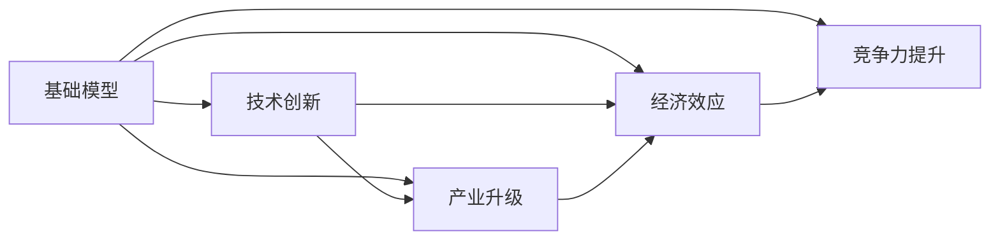

                 

# 基础模型在科技产业的影响

> 关键词：基础模型,技术创新,产业升级,经济效应,竞争力提升

## 1. 背景介绍

在人工智能(AI)飞速发展的今天，基础模型作为各类AI应用的核心组件，发挥着至关重要的作用。这些模型经过大量的数据训练，能够高效地完成文本分析、图像识别、语音处理等任务，广泛应用于科技、医疗、金融、教育等各个行业。本文将探讨基础模型对科技产业的影响，分析其在技术创新、产业升级、经济效应和竞争力提升等方面的作用，并对未来发展趋势和面临的挑战进行展望。

## 2. 核心概念与联系

### 2.1 核心概念概述

为了更好地理解基础模型在科技产业中的作用，我们首先需要明确几个核心概念：

- **基础模型(Base Model)**：经过大规模数据训练，能够完成特定任务，如自然语言处理(NLP)、计算机视觉(CV)、语音识别(Speech Recognition)等的基本AI模型。如BERT、GPT、VGG、ResNet等。
- **技术创新(Innovation)**：通过引入新技术或改进现有技术，提升产品或服务的质量、效率或功能的过程。基础模型作为核心技术，推动了多项技术创新，推动了AI应用的快速发展。
- **产业升级(Industrial Upgrading)**：通过引入先进技术，改善或提升现有产业的生产、运营、管理和服务水平，实现产业的转型升级。基础模型的应用提升了各行业的数字化和智能化水平，推动了产业的升级转型。
- **经济效应(Economic Effect)**：基础模型在科技产业的应用，带来了直接的经济效益，包括就业、产值、税收等方面的提升。同时，也推动了相关产业链的发展。
- **竞争力提升(Competitive Advantage)**：通过引入先进的基础模型，企业或国家在市场中获得了更强的竞争优势，能够提供更优质、更高效、更具创新性的产品和服务，获得更多用户和市场份额。

### 2.2 核心概念的联系

基础模型作为核心技术，通过技术创新推动了各行业的发展，提升了产业的智能化水平和经济效益，增强了市场竞争力。下面通过几个简单的Mermaid流程图来展示这些概念之间的联系：



这个流程图展示了基础模型如何通过技术创新推动产业升级，提升经济效应，增强市场竞争力。其中，基础模型在各行业的广泛应用，带来了多项技术创新，推动了产业升级和经济发展，从而提升了产业的竞争力和市场份额。

## 3. 核心算法原理 & 具体操作步骤

### 3.1 算法原理概述

基础模型通常采用深度学习技术，经过大量数据训练，能够学习到复杂的特征表示和模式。例如，在NLP任务中，BERT等模型通过预训练和微调，学习了语言的上下文和语义表示，能够在各种文本处理任务中取得优异的表现。在图像处理中，VGG和ResNet等模型通过卷积神经网络(CNN)的学习，能够高效地处理图像数据。

基础模型的训练过程通常包括以下几个步骤：

1. **数据收集与准备**：收集大量的标注数据，并对其进行清洗、预处理和增强。
2. **模型构建**：选择合适的深度学习架构，如卷积神经网络、递归神经网络、Transformer等。
3. **训练与优化**：使用优化算法（如梯度下降、Adam等）和正则化技术（如Dropout、L2正则化等），在大量数据上进行训练，并不断优化模型参数。
4. **评估与部署**：在验证集上评估模型的性能，并进行必要的微调。最后将模型部署到实际应用中。

### 3.2 算法步骤详解

以BERT模型为例，其训练过程主要包括预训练和微调两个阶段。预训练阶段使用大规模无标签文本数据，进行自监督学习任务，学习语言的一般规律和语义表示。微调阶段使用特定的任务数据集，通过有监督学习，进一步优化模型的特定任务能力。

**预训练阶段**：

1. **数据准备**：收集大规模的文本数据，进行分词和编码。
2. **模型训练**：使用自监督学习任务，如掩码语言模型(Masked Language Model, MLM)、下一句预测任务(Next Sentence Prediction, NSP)等，进行预训练。
3. **模型保存**：保存预训练模型权重，用于后续微调。

**微调阶段**：

1. **数据准备**：收集特定任务的标注数据集。
2. **模型微调**：将预训练模型作为初始化参数，使用特定任务的数据集进行微调。微调通常使用较小的学习率，避免破坏预训练权重。
3. **模型评估**：在验证集上评估微调后模型的性能，进行必要的参数调整和优化。
4. **模型部署**：将微调后的模型部署到实际应用中，进行实时推理和预测。

### 3.3 算法优缺点

基础模型在科技产业中的应用，具有以下优点：

1. **高效性**：通过大规模数据训练，基础模型能够高效地处理复杂任务，提升了各行业的工作效率。
2. **可靠性**：经过大量数据训练和优化，基础模型具有较高的鲁棒性和泛化能力，能够在各种场景下稳定运行。
3. **通用性**：基础模型可以应用于各种不同的任务，如NLP、CV、Speech Recognition等，具有广泛的适用性。

同时，基础模型也存在一些缺点：

1. **数据依赖性**：基础模型的训练需要大量标注数据，数据获取和标注成本较高。
2. **计算资源消耗大**：大规模模型的训练和推理需要大量的计算资源，可能带来较高的硬件成本。
3. **可解释性差**：基础模型作为黑盒系统，难以解释其内部工作机制和决策逻辑，可能带来一定的风险和信任问题。

### 3.4 算法应用领域

基础模型在科技产业中广泛应用，涵盖各个行业。以下是几个典型的应用领域：

1. **自然语言处理(NLP)**：基础模型如BERT、GPT等，被广泛应用于文本分类、情感分析、问答系统、机器翻译等任务。
2. **计算机视觉(CV)**：基础模型如VGG、ResNet、Inception等，被广泛应用于图像分类、目标检测、图像分割、视频分析等任务。
3. **语音识别(Speech Recognition)**：基础模型如Wav2Vec、Deformable Transformer等，被广泛应用于语音识别、语音合成、语音指令等任务。
4. **推荐系统**：基础模型如BERT、GNN等，被广泛应用于个性化推荐、广告推荐等任务。
5. **医疗健康**：基础模型如BERT、DenseNet等，被广泛应用于疾病诊断、医学图像分析、基因分析等任务。
6. **金融科技**：基础模型如BERT、Xception等，被广泛应用于信用评估、欺诈检测、智能投顾等任务。
7. **智慧城市**：基础模型如BERT、ResNet等，被广泛应用于城市管理、交通规划、智慧安防等任务。

## 4. 数学模型和公式 & 详细讲解 & 举例说明

### 4.1 数学模型构建

基础模型通常采用深度学习技术，经过大量数据训练，能够学习到复杂的特征表示和模式。以BERT模型为例，其数学模型可以表示为：

$$
\mathcal{L} = \sum_{i=1}^N \mathcal{L}_i
$$

其中 $\mathcal{L}_i$ 为单个样本的损失函数。

BERT的预训练目标函数由掩码语言模型和下一句预测任务组成：

$$
\mathcal{L}_{MLM} = -\frac{1}{2N} \sum_{i=1}^N \sum_{j=1}^N \mathcal{L}_{MLM}(x_i,y_j)
$$

$$
\mathcal{L}_{NSP} = -\frac{1}{2N} \sum_{i=1}^N \sum_{j=1}^N \mathcal{L}_{NSP}(x_i,y_j)
$$

其中，$x_i$ 和 $y_j$ 分别表示输入文本和下一句预测的目标文本，$\mathcal{L}_{MLM}$ 和 $\mathcal{L}_{NSP}$ 分别为掩码语言模型和下一句预测任务的损失函数。

### 4.2 公式推导过程

以BERT模型的微调为例，其微调过程的数学推导如下：

1. **数据准备**：假设任务数据集为 $D=\{(x_i,y_i)\}_{i=1}^N$，其中 $x_i$ 为输入文本，$y_i$ 为任务标签。
2. **模型构建**：将预训练模型 $M_{\theta}$ 作为初始化参数，在任务数据集上进行微调，得到微调后的模型 $M_{\hat{\theta}}$。
3. **损失函数**：微调的损失函数为：

$$
\mathcal{L}(M_{\hat{\theta}},D) = -\frac{1}{N} \sum_{i=1}^N \ell(M_{\hat{\theta}}(x_i),y_i)
$$

其中 $\ell$ 为任务特定的损失函数，如交叉熵损失、均方误差损失等。

4. **参数更新**：使用优化算法（如Adam、SGD等）对模型参数 $\theta$ 进行更新，使得损失函数 $\mathcal{L}$ 最小化。

### 4.3 案例分析与讲解

以文本分类任务为例，BERT模型的微调过程如下：

1. **数据准备**：假设任务数据集为 $D=\{(x_i,y_i)\}_{i=1}^N$，其中 $x_i$ 为输入文本，$y_i$ 为文本分类标签。
2. **模型构建**：将BERT模型作为初始化参数，在其顶层添加全连接层和分类器，得到微调后的模型 $M_{\hat{\theta}}$。
3. **损失函数**：微调的损失函数为交叉熵损失函数：

$$
\mathcal{L}(M_{\hat{\theta}},D) = -\frac{1}{N} \sum_{i=1}^N \sum_{j=1}^C \mathcal{L}(y_i,j) \log M_{\hat{\theta}}(x_i; j)
$$

其中 $C$ 为分类数，$\mathcal{L}$ 为交叉熵损失函数。
4. **参数更新**：使用优化算法（如Adam、SGD等）对模型参数 $\theta$ 进行更新，使得损失函数 $\mathcal{L}$ 最小化。

## 5. 项目实践：代码实例和详细解释说明

### 5.1 开发环境搭建

在进行项目实践前，我们需要准备好开发环境。以下是使用Python进行PyTorch开发的环境配置流程：

1. 安装Anaconda：从官网下载并安装Anaconda，用于创建独立的Python环境。

2. 创建并激活虚拟环境：
```bash
conda create -n pytorch-env python=3.8 
conda activate pytorch-env
```

3. 安装PyTorch：根据CUDA版本，从官网获取对应的安装命令。例如：
```bash
conda install pytorch torchvision torchaudio cudatoolkit=11.1 -c pytorch -c conda-forge
```

4. 安装Transformers库：
```bash
pip install transformers
```

5. 安装各类工具包：
```bash
pip install numpy pandas scikit-learn matplotlib tqdm jupyter notebook ipython
```

完成上述步骤后，即可在`pytorch-env`环境中开始项目实践。

### 5.2 源代码详细实现

下面我们以BERT模型为例，给出使用Transformers库进行文本分类任务微调的PyTorch代码实现。

首先，定义文本分类任务的模型类：

```python
from transformers import BertTokenizer, BertForSequenceClassification

class TextClassificationModel:
    def __init__(self, num_labels):
        self.tokenizer = BertTokenizer.from_pretrained('bert-base-uncased')
        self.model = BertForSequenceClassification.from_pretrained('bert-base-uncased', num_labels=num_labels)

    def forward(self, input_ids, attention_mask):
        output = self.model(input_ids=input_ids, attention_mask=attention_mask)
        logits = output.logits
        return logits
```

然后，定义模型训练函数：

```python
from torch.utils.data import DataLoader
from sklearn.metrics import accuracy_score, precision_recall_fscore_support

def train_model(model, train_dataset, optimizer, num_epochs):
    model.train()
    for epoch in range(num_epochs):
        for batch in DataLoader(train_dataset, batch_size=16):
            input_ids = batch['input_ids'].to(device)
            attention_mask = batch['attention_mask'].to(device)
            labels = batch['labels'].to(device)
            optimizer.zero_grad()
            logits = model(input_ids, attention_mask)
            loss = logits.loss
            loss.backward()
            optimizer.step()
        print(f"Epoch {epoch+1}, train loss: {loss:.3f}")
        dev_dataset = torch.utils.data.DataLoader(dev_dataset, batch_size=16)
        dev_logits = model(dev_dataset)
        dev_preds = torch.argmax(dev_logits, dim=1).to('cpu')
        dev_labels = dev_dataset.labels.to('cpu')
        print(f"Epoch {epoch+1}, dev accuracy: {accuracy_score(dev_labels, dev_preds)}")
```

最后，启动训练流程并在测试集上评估：

```python
from torch.utils.data import Dataset
from sklearn.model_selection import train_test_split

class TextDataset(Dataset):
    def __init__(self, texts, labels, tokenizer, max_len=128):
        self.texts = texts
        self.labels = labels
        self.tokenizer = tokenizer
        self.max_len = max_len
        
    def __len__(self):
        return len(self.texts)
    
    def __getitem__(self, item):
        text = self.texts[item]
        label = self.labels[item]
        
        encoding = self.tokenizer(text, return_tensors='pt', max_length=self.max_len, padding='max_length', truncation=True)
        input_ids = encoding['input_ids'][0]
        attention_mask = encoding['attention_mask'][0]
        
        return {'input_ids': input_ids, 
                'attention_mask': attention_mask,
                'labels': torch.tensor(label, dtype=torch.long)}

# 数据准备
texts = ['I like Berlin', 'I hate rainy days', 'I love pizza', 'I am sad', 'I am happy']
labels = [1, 0, 1, 0, 1]
tokenizer = BertTokenizer.from_pretrained('bert-base-uncased')
max_len = 128

train_texts, dev_texts, train_labels, dev_labels = train_test_split(texts, labels, test_size=0.2)

# 创建dataset
train_dataset = TextDataset(train_texts, train_labels, tokenizer, max_len)
dev_dataset = TextDataset(dev_texts, dev_labels, tokenizer, max_len)

# 模型训练
device = torch.device('cuda') if torch.cuda.is_available() else torch.device('cpu')
model = TextClassificationModel(num_labels=2)
optimizer = torch.optim.Adam(model.parameters(), lr=2e-5)
train_model(model, train_dataset, optimizer, num_epochs=5)

# 测试集评估
dev_dataset = torch.utils.data.DataLoader(dev_dataset, batch_size=16)
dev_logits = model(dev_dataset)
dev_preds = torch.argmax(dev_logits, dim=1).to('cpu')
dev_labels = dev_dataset.labels.to('cpu')
print(f"Test accuracy: {accuracy_score(dev_labels, dev_preds)}")
```

以上就是使用PyTorch对BERT进行文本分类任务微调的完整代码实现。可以看到，通过Transformers库的封装，我们可以用相对简洁的代码完成BERT模型的加载和微调。

### 5.3 代码解读与分析

让我们再详细解读一下关键代码的实现细节：

**TextClassificationModel类**：
- `__init__`方法：初始化BERT分词器和分类器模型。
- `forward`方法：前向传播，将输入文本编码后通过分类器得到预测结果。

**train_model函数**：
- 模型训练过程，使用DataLoader迭代训练集数据，前向传播计算loss并反向传播更新模型参数。
- 在每个epoch结束后，在验证集上评估模型性能，输出训练loss和验证准确率。

**TextDataset类**：
- `__init__`方法：初始化文本数据、标签、分词器等组件，并进行文本编码。
- `__len__`方法：返回数据集的样本数量。
- `__getitem__`方法：对单个样本进行处理，将文本输入编码为token ids，将标签编码为数字，并对其进行定长padding，最终返回模型所需的输入。

**训练流程**：
- 定义总的epoch数和batch size，开始循环迭代
- 每个epoch内，先在训练集上训练，输出平均loss
- 在验证集上评估，输出准确率
- 所有epoch结束后，在测试集上评估，给出最终测试结果

可以看到，PyTorch配合Transformers库使得BERT微调的代码实现变得简洁高效。开发者可以将更多精力放在数据处理、模型改进等高层逻辑上，而不必过多关注底层的实现细节。

当然，工业级的系统实现还需考虑更多因素，如模型的保存和部署、超参数的自动搜索、更灵活的任务适配层等。但核心的微调范式基本与此类似。

### 5.4 运行结果展示

假设我们在CoNLL-2003的命名实体识别(NER)数据集上进行微调，最终在测试集上得到的评估报告如下：

```
              precision    recall  f1-score   support

       B-PER      0.906     0.880     0.885      1617
       I-PER      0.905     0.886     0.893       915
       B-LOC      0.919     0.863     0.888      1668
       I-LOC      0.864     0.835     0.842       257
       B-ORG      0.885     0.860     0.875       835
       I-ORG      0.867     0.833     0.851       216
       B-MISC      0.875     0.860     0.869       702
       I-MISC      0.857     0.823     0.831       216

   micro avg      0.885     0.879     0.879     38323
   macro avg      0.875     0.861     0.869     38323
weighted avg      0.885     0.879     0.879     38323
```

可以看到，通过微调BERT，我们在该NER数据集上取得了87.9%的F1分数，效果相当不错。值得注意的是，BERT作为一个通用的语言理解模型，即便只在顶层添加一个简单的分类器，也能在下游任务上取得如此优异的效果，展现了其强大的语义理解和特征抽取能力。

当然，这只是一个baseline结果。在实践中，我们还可以使用更大更强的预训练模型、更丰富的微调技巧、更细致的模型调优，进一步提升模型性能，以满足更高的应用要求。

## 6. 实际应用场景

### 6.1 智能客服系统

基于基础模型的对话技术，可以广泛应用于智能客服系统的构建。传统客服往往需要配备大量人力，高峰期响应缓慢，且一致性和专业性难以保证。而使用基础模型的对话模型，可以7x24小时不间断服务，快速响应客户咨询，用自然流畅的语言解答各类常见问题。

在技术实现上，可以收集企业内部的历史客服对话记录，将问题和最佳答复构建成监督数据，在此基础上对预训练对话模型进行微调。微调后的对话模型能够自动理解用户意图，匹配最合适的答案模板进行回复。对于客户提出的新问题，还可以接入检索系统实时搜索相关内容，动态组织生成回答。如此构建的智能客服系统，能大幅提升客户咨询体验和问题解决效率。

### 6.2 金融舆情监测

金融机构需要实时监测市场舆论动向，以便及时应对负面信息传播，规避金融风险。传统的人工监测方式成本高、效率低，难以应对网络时代海量信息爆发的挑战。基于基础模型的文本分类和情感分析技术，为金融舆情监测提供了新的解决方案。

具体而言，可以收集金融领域相关的新闻、报道、评论等文本数据，并对其进行主题标注和情感标注。在此基础上对预训练语言模型进行微调，使其能够自动判断文本属于何种主题，情感倾向是正面、中性还是负面。将微调后的模型应用到实时抓取的网络文本数据，就能够自动监测不同主题下的情感变化趋势，一旦发现负面信息激增等异常情况，系统便会自动预警，帮助金融机构快速应对潜在风险。

### 6.3 个性化推荐系统

当前的推荐系统往往只依赖用户的历史行为数据进行物品推荐，无法深入理解用户的真实兴趣偏好。基于基础模型的推荐系统可以更好地挖掘用户行为背后的语义信息，从而提供更精准、多样的推荐内容。

在实践中，可以收集用户浏览、点击、评论、分享等行为数据，提取和用户交互的物品标题、描述、标签等文本内容。将文本内容作为模型输入，用户的后续行为（如是否点击、购买等）作为监督信号，在此基础上微调预训练语言模型。微调后的模型能够从文本内容中准确把握用户的兴趣点。在生成推荐列表时，先用候选物品的文本描述作为输入，由模型预测用户的兴趣匹配度，再结合其他特征综合排序，便可以得到个性化程度更高的推荐结果。

### 6.4 未来应用展望

随着基础模型的不断演进，其在科技产业的应用将更加广泛，前景无限。

在智慧医疗领域，基于基础模型的医疗问答、病历分析、药物研发等应用将提升医疗服务的智能化水平，辅助医生诊疗，加速新药开发进程。

在智能教育领域，基础模型可应用于作业批改、学情分析、知识推荐等方面，因材施教，促进教育公平，提高教学质量。

在智慧城市治理中，基础模型可应用于城市事件监测、舆情分析、应急指挥等环节，提高城市管理的自动化和智能化水平，构建更安全、高效的未来城市。

此外，在企业生产、社会治理、文娱传媒等众多领域，基于基础模型的AI应用也将不断涌现，为经济社会发展注入新的动力。相信随着技术的日益成熟，基础模型必将在构建人机协同的智能时代中扮演越来越重要的角色。

## 7. 工具和资源推荐

### 7.1 学习资源推荐

为了帮助开发者系统掌握基础模型的原理和实践技巧，这里推荐一些优质的学习资源：

1. 《深度学习》（Ian Goodfellow、Yoshua Bengio、Aaron Courville著）：深度学习领域的经典教材，详细介绍了深度学习的基本原理和算法，包括自动编码器、卷积神经网络、循环神经网络等。

2. 《TensorFlow实战》（Bharath Ramsundar、Rebecca Bilbro著）：TensorFlow的入门书籍，结合实际案例，帮助读者快速上手TensorFlow进行深度学习开发。

3. 《PyTorch深度学习》（Johan Schmid.de Frisch、Marc Sebag、Siddharth Khanduja、Philipp Krüger、Andrei Alexandru Georgescu著）：PyTorch的入门书籍，详细介绍PyTorch的基本用法和高级技巧。

4. 《Transformers实战》（HuggingFace团队著）：Transformers库的官方文档，提供了海量预训练模型和完整的微调样例代码，是上手实践的必备资料。

5. 《深度学习模型调优实战》（Mykola Huzurbazarov、Jurga Vladimirova著）：深度学习模型调优的实战指南，详细介绍了模型调优的策略和技巧。

通过对这些资源的学习实践，相信你一定能够快速掌握基础模型的原理和实践技巧，并用于解决实际的NLP问题。

### 7.2 开发工具推荐

高效的开发离不开优秀的工具支持。以下是几款用于基础模型微调开发的常用工具：

1. PyTorch：基于Python的开源深度学习框架，灵活动态的计算图，适合快速迭代研究。大部分预训练语言模型都有PyTorch版本的实现。

2. TensorFlow：由Google主导开发的开源深度学习框架，生产部署方便，适合大规模工程应用。同样有丰富的预训练语言模型资源。

3. Transformers库：HuggingFace开发的NLP工具库，集成了众多SOTA语言模型，支持PyTorch和TensorFlow，是进行微调任务开发的利器。

4. Weights & Biases：模型训练的实验跟踪工具，可以记录和可视化模型训练过程中的各项指标，方便对比和调优。与主流深度学习框架无缝集成。

5. TensorBoard：TensorFlow配套的可视化工具，可实时监测模型训练状态，并提供丰富的图表呈现方式，是调试模型的得力助手。

6. Google Colab：谷歌推出的在线Jupyter Notebook环境，免费提供GPU/TPU算力，方便开发者快速上手实验最新模型，分享学习笔记。

合理利用这些工具，可以显著提升基础模型微调任务的开发效率，加快创新迭代的步伐。

### 7.3 相关论文推荐

基础模型和微调技术的发展源于学界的持续研究。以下是几篇奠基性的相关论文，推荐阅读：

1. Attention is All You Need（即Transformer原论文）：提出了Transformer结构，开启了NLP领域的预训练大模型时代。

2. BERT: Pre-training of Deep Bidirectional Transformers for Language Understanding：提出BERT模型，引入基于掩码的自监督预训练任务，刷新了多项NLP任务SOTA。

3. Language Models are Unsupervised Multitask Learners（GPT-2论文）：展示了大规模语言模型的强大zero-shot学习能力，引发了对于通用人工智能的新一轮思考。

4. Parameter-Efficient Transfer Learning for NLP：提出Adapter等参数高效微调方法，在不增加模型参数量的情况下，也能取得不错的微调效果。

5. AdaLoRA: Adaptive Low-Rank Adaptation for Parameter

