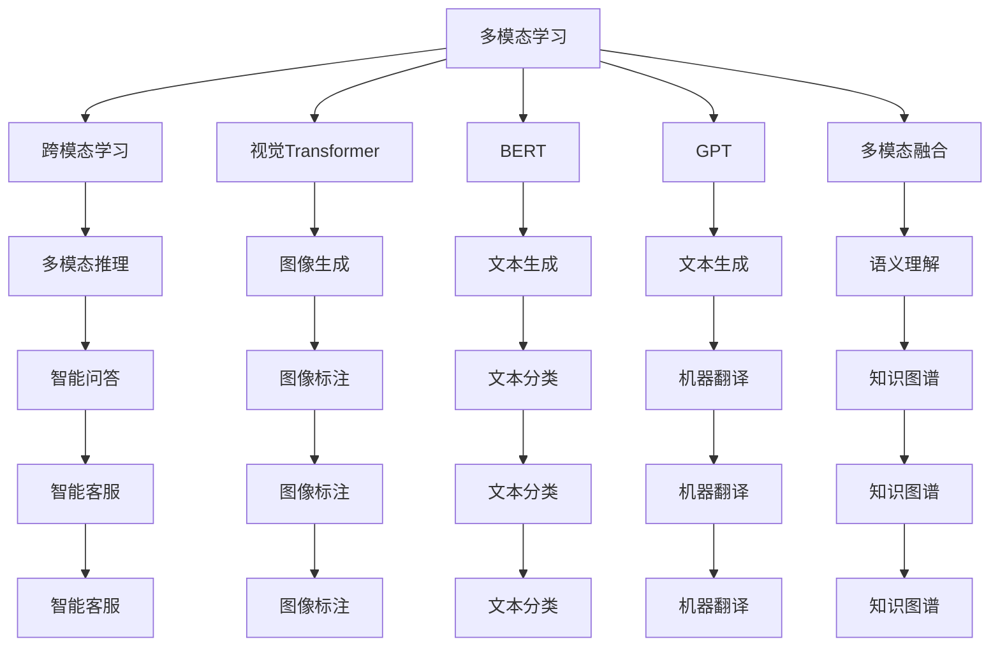
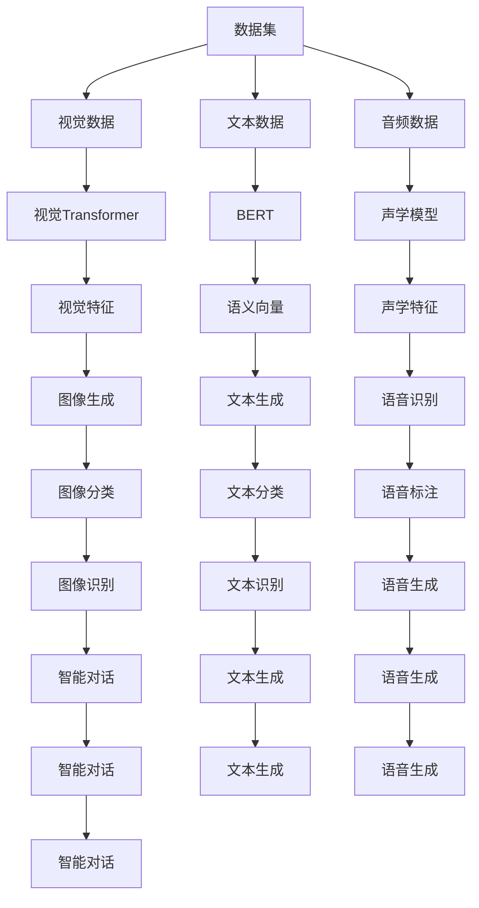
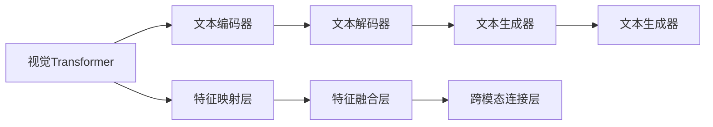
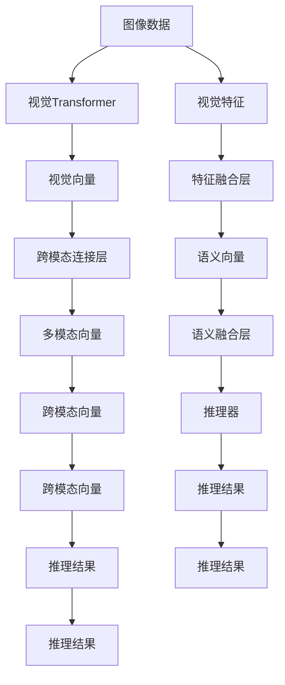
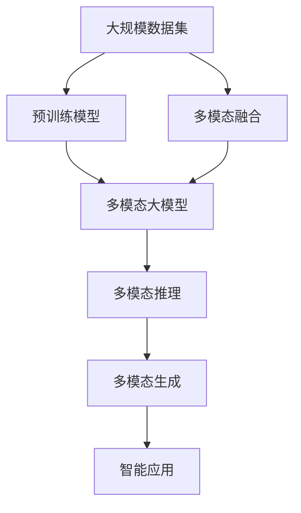

                 

# 多模态大模型：技术原理与实战 多模态大模型对比

> 关键词：多模态大模型,计算机视觉,自然语言处理,跨模态学习,Transformer,BERT,深度学习,迁移学习,多模态融合

## 1. 背景介绍

### 1.1 问题由来
随着深度学习技术的快速发展，多模态大模型（Multimodal Large Models）已成为人工智能领域的热门话题。多模态模型能够同时处理图像、视频、文本等多种数据，通过不同模态间的交互和融合，提升其在实际应用中的性能和泛化能力。相较于传统的单模态模型，多模态模型在理解和生成多源数据方面展现了更大的优势。

近年来，研究者们已经在计算机视觉（Computer Vision, CV）和自然语言处理（Natural Language Processing, NLP）等领域取得了诸多突破性进展，诸如Vision Transformer（ViT）、BERT、GPT等预训练模型为多模态大模型的构建提供了坚实基础。本文旨在深入探讨多模态大模型的技术原理和实际应用，通过对比不同模型的特点，为读者提供实践指导。

### 1.2 问题核心关键点
多模态大模型的核心关键点在于其能够融合不同模态的信息，提升对现实世界的理解和表达能力。其主要研究内容包括：
- 多模态数据融合：如何将图像、文本、语音等多种数据有效融合，并提取高层次的语义信息。
- 跨模态学习：如何在不同模态之间进行有效的知识迁移，使得模型能够跨模态进行推理和生成。
- 多模态推理：如何构建能够综合不同模态信息进行推理和决策的模型。
- 多模态对抗攻击：如何设计和防御针对多模态模型的人工攻击和对抗性样本。

这些核心关键点通过数据融合、模型设计、推理算法等技术手段，形成了一个完整的框架，支撑了多模态大模型在实际应用中的广泛应用。

### 1.3 问题研究意义
研究多模态大模型，对于拓展AI模型的应用范围，提升多模态任务的表现，加速AI技术在更多领域的落地应用，具有重要意义：

1. 拓展应用场景：多模态模型能够处理多源数据，适用于视频理解、图像标注、语音识别等多种复杂场景，为AI技术带来了更广阔的应用领域。
2. 提升性能表现：多模态模型能够融合不同模态的信息，提升其在特定任务上的表现，特别是在需要综合多源信息的场景下。
3. 加速技术创新：多模态模型为AI技术的创新提供了新的研究方向，推动了图像生成、文本生成、多模态推理等前沿技术的发展。
4. 赋能产业升级：多模态模型能够促进AI技术在更多垂直行业的应用，如智能医疗、自动驾驶、智能安防等，为行业转型升级提供新动力。

## 2. 核心概念与联系

### 2.1 核心概念概述

为更好地理解多模态大模型的技术原理和实际应用，本节将介绍几个密切相关的核心概念：

- 多模态学习（Multimodal Learning）：指同时处理和分析多种数据模态（如文本、图像、音频等），从而提升模型在特定任务上的性能。
- 跨模态学习（Cross-modal Learning）：指在不同模态之间进行有效的知识迁移，使得模型能够跨模态进行推理和生成。
- 多模态融合（Multimodal Fusion）：指将不同模态的信息进行融合，提取高层次的语义信息，用于提升模型的理解能力和表达能力。
- 视觉Transformer（ViT）：一种将Transformer结构应用于计算机视觉领域的模型，通过自注意力机制实现视觉数据的表示和理解。
- BERT和GPT：目前最先进的预训练语言模型，通过在大规模文本语料上进行自监督学习，学习到了丰富的语言知识和常识，具有强大的语言理解和生成能力。
- 深度学习（Deep Learning）：一种基于多层神经网络的学习方法，能够自动从数据中学习特征表示，并在复杂的任务中取得卓越性能。

这些核心概念之间的逻辑关系可以通过以下Mermaid流程图来展示：



这个流程图展示了大模型在多模态领域的核心概念和其间的逻辑联系。

### 2.2 概念间的关系

这些核心概念之间存在着紧密的联系，形成了多模态大模型的完整生态系统。下面我们通过几个Mermaid流程图来展示这些概念之间的关系。

#### 2.2.1 多模态学习的基本框架



这个流程图展示了多模态学习的基本框架，即如何从多源数据中提取和融合特征。

#### 2.2.2 跨模态学习的实现机制



这个流程图展示了跨模态学习的实现机制，即如何通过特征映射和融合层，在不同模态之间进行知识迁移。

#### 2.2.3 多模态推理的计算图



这个流程图展示了多模态推理的计算图，即如何将不同模态的信息进行融合和推理。

### 2.3 核心概念的整体架构

最后，我们用一个综合的流程图来展示这些核心概念在大模型微调过程中的整体架构：



这个综合流程图展示了从预训练到多模态推理的完整过程，各概念间的逻辑关系和作用。

## 3. 核心算法原理 & 具体操作步骤
### 3.1 算法原理概述

多模态大模型的核心算法原理主要包括以下几个方面：

1. 多模态数据融合：通过特征提取和特征映射层，将不同模态的数据转化为高层次的语义向量，用于提升模型的理解和生成能力。
2. 跨模态学习：通过特征融合和跨模态连接层，在不同模态之间进行知识迁移，使得模型能够跨模态进行推理和生成。
3. 多模态推理：通过多模态向量的融合和推理器，将不同模态的信息进行综合推理，输出最终的推理结果。
4. 对抗攻击和防御：通过对抗训练和对抗样本生成，提高模型对攻击的鲁棒性，增强模型的安全性。

这些核心算法原理通过神经网络结构、损失函数设计、优化算法等技术手段，形成了多模态大模型的完整框架，支撑了其在实际应用中的高性能表现。

### 3.2 算法步骤详解

多模态大模型的训练一般包括以下几个关键步骤：

**Step 1: 准备预训练模型和数据集**
- 选择合适的预训练模型（如BERT、GPT、ViT等）作为初始化参数，如 Visual Transformer 在计算机视觉领域的预训练模型。
- 准备多模态任务的标注数据集，划分为训练集、验证集和测试集。

**Step 2: 添加任务适配层**
- 根据任务类型，在预训练模型顶层设计合适的输出层和损失函数。
- 对于分类任务，通常在顶层添加线性分类器和交叉熵损失函数。
- 对于生成任务，通常使用语言模型的解码器输出概率分布，并以负对数似然为损失函数。

**Step 3: 设置微调超参数**
- 选择合适的优化算法及其参数，如 AdamW、SGD 等，设置学习率、批大小、迭代轮数等。
- 设置正则化技术及强度，包括权重衰减、Dropout、Early Stopping 等。
- 确定冻结预训练参数的策略，如仅微调顶层，或全部参数都参与微调。

**Step 4: 执行梯度训练**
- 将训练集数据分批次输入模型，前向传播计算损失函数。
- 反向传播计算参数梯度，根据设定的优化算法和学习率更新模型参数。
- 周期性在验证集上评估模型性能，根据性能指标决定是否触发 Early Stopping。
- 重复上述步骤直到满足预设的迭代轮数或 Early Stopping 条件。

**Step 5: 测试和部署**
- 在测试集上评估微调后模型 $M_{\hat{\theta}}$ 的性能，对比微调前后的精度提升。
- 使用微调后的模型对新样本进行推理预测，集成到实际的应用系统中。
- 持续收集新的数据，定期重新微调模型，以适应数据分布的变化。

以上是多模态大模型微调的一般流程。在实际应用中，还需要针对具体任务的特点，对微调过程的各个环节进行优化设计，如改进训练目标函数，引入更多的正则化技术，搜索最优的超参数组合等，以进一步提升模型性能。

### 3.3 算法优缺点

多模态大模型具有以下优点：
1. 能够处理多源数据，适用于复杂多模态的任务。
2. 通过融合不同模态的信息，提升了模型的理解和生成能力。
3. 能够进行跨模态推理，解决多种模态信息融合的难题。
4. 通过对抗攻击和防御技术，提高了模型的鲁棒性和安全性。

同时，该算法也存在一定的局限性：
1. 训练复杂度高，计算资源需求大。
2. 数据准备成本高，标注数据需要覆盖多种模态。
3. 模型参数量大，推理速度较慢。
4. 模型结构复杂，调试和优化难度大。

尽管存在这些局限性，但就目前而言，多模态大模型仍然是大模型应用的主流范式。未来相关研究的重点在于如何进一步降低计算资源需求，提高模型效率，同时兼顾可解释性和伦理安全性等因素。

### 3.4 算法应用领域

多模态大模型已经在计算机视觉、自然语言处理、智能安防、自动驾驶等多个领域得到了广泛的应用，成为多模态应用的重要手段。例如：

- 智能安防：通过融合摄像头图像、音频和传感器数据，实现人、车、物等多种目标的检测、识别和跟踪。
- 自动驾驶：结合摄像头、雷达、激光雷达等多种传感器数据，实现场景理解和路径规划。
- 智能客服：通过融合语音识别、文本理解和情感分析，提供自然流畅的对话体验。
- 医学影像分析：通过融合CT、MRI、X光等多种医学影像数据，进行病灶检测和诊断。
- 智能制造：通过融合图像、声音和传感器数据，实现质量监控和故障诊断。

除了上述这些经典任务外，多模态大模型也被创新性地应用到更多场景中，如可控文本生成、跨模态推理、智能推荐等，为多模态技术带来了新的突破。随着预训练模型和微调方法的不断进步，相信多模态技术将在更广阔的应用领域大放异彩。

## 4. 数学模型和公式 & 详细讲解 & 举例说明

### 4.1 数学模型构建

本节将使用数学语言对多模态大模型的微调过程进行更加严格的刻画。

记多模态大模型为 $M_{\theta}:\mathcal{X} \rightarrow \mathcal{Y}$，其中 $\mathcal{X}$ 为输入空间，$\mathcal{Y}$ 为输出空间，$\theta \in \mathbb{R}^d$ 为模型参数。假设微调任务的训练集为 $D=\{(x_i,y_i)\}_{i=1}^N, x_i \in \mathcal{X}, y_i \in \mathcal{Y}$。

定义模型 $M_{\theta}$ 在数据样本 $(x,y)$ 上的损失函数为 $\ell(M_{\theta}(x),y)$，则在数据集 $D$ 上的经验风险为：

$$
\mathcal{L}(\theta) = \frac{1}{N} \sum_{i=1}^N \ell(M_{\theta}(x_i),y_i)
$$

微调的优化目标是最小化经验风险，即找到最优参数：

$$
\theta^* = \mathop{\arg\min}_{\theta} \mathcal{L}(\theta)
$$

在实践中，我们通常使用基于梯度的优化算法（如SGD、Adam等）来近似求解上述最优化问题。设 $\eta$ 为学习率，$\lambda$ 为正则化系数，则参数的更新公式为：

$$
\theta \leftarrow \theta - \eta \nabla_{\theta}\mathcal{L}(\theta) - \eta\lambda\theta
$$

其中 $\nabla_{\theta}\mathcal{L}(\theta)$ 为损失函数对参数 $\theta$ 的梯度，可通过反向传播算法高效计算。

### 4.2 公式推导过程

以下我们以二分类任务为例，推导交叉熵损失函数及其梯度的计算公式。

假设模型 $M_{\theta}$ 在输入 $x$ 上的输出为 $\hat{y}=M_{\theta}(x) \in [0,1]$，表示样本属于正类的概率。真实标签 $y \in \{0,1\}$。则二分类交叉熵损失函数定义为：

$$
\ell(M_{\theta}(x),y) = -[y\log \hat{y} + (1-y)\log (1-\hat{y})]
$$

将其代入经验风险公式，得：

$$
\mathcal{L}(\theta) = -\frac{1}{N}\sum_{i=1}^N [y_i\log M_{\theta}(x_i)+(1-y_i)\log(1-M_{\theta}(x_i))]
$$

根据链式法则，损失函数对参数 $\theta_k$ 的梯度为：

$$
\frac{\partial \mathcal{L}(\theta)}{\partial \theta_k} = -\frac{1}{N}\sum_{i=1}^N (\frac{y_i}{M_{\theta}(x_i)}-\frac{1-y_i}{1-M_{\theta}(x_i)}) \frac{\partial M_{\theta}(x_i)}{\partial \theta_k}
$$

其中 $\frac{\partial M_{\theta}(x_i)}{\partial \theta_k}$ 可进一步递归展开，利用自动微分技术完成计算。

在得到损失函数的梯度后，即可带入参数更新公式，完成模型的迭代优化。重复上述过程直至收敛，最终得到适应下游任务的最优模型参数 $\theta^*$。

### 4.3 案例分析与讲解

**案例：图像生成与文本生成**

图像生成和文本生成是典型的多模态任务，多模态大模型可以通过融合图像和文本信息，生成高质量的图像或文本内容。

假设有一个文本描述，如 "一张美丽的夕阳图片，远处的山脉在夕阳下显得非常壮观。" 和一个对应的图像。任务是将文本描述转换为高质量的图像生成结果。

可以构建一个多模态大模型，将文本描述作为输入，通过视觉Transformer模型提取图像特征，然后与文本特征进行融合，生成最终的图像。具体步骤如下：

1. 将文本描述作为输入，使用BERT或GPT模型进行编码，得到文本向量 $x_{text}$。
2. 将图像输入视觉Transformer模型，得到图像特征向量 $x_{image}$。
3. 将文本向量和图像向量进行融合，得到融合后的向量 $x_{fusion}$。
4. 通过解码器生成高质量的图像生成结果。

以上步骤中，文本向量和图像向量的融合是关键步骤，可以通过注意力机制或自注意力机制进行特征提取和融合。最终生成的图像可以通过多模态大模型进行评估和优化，进一步提升生成质量。

## 5. 项目实践：代码实例和详细解释说明
### 5.1 开发环境搭建

在进行多模态大模型的实践前，我们需要准备好开发环境。以下是使用Python进行PyTorch开发的环境配置流程：

1. 安装Anaconda：从官网下载并安装Anaconda，用于创建独立的Python环境。

2. 创建并激活虚拟环境：
```bash
conda create -n pytorch-env python=3.8 
conda activate pytorch-env
```

3. 安装PyTorch：根据CUDA版本，从官网获取对应的安装命令。例如：
```bash
conda install pytorch torchvision torchaudio cudatoolkit=11.1 -c pytorch -c conda-forge
```

4. 安装Transformers库：
```bash
pip install transformers
```

5. 安装各类工具包：
```bash
pip install numpy pandas scikit-learn matplotlib tqdm jupyter notebook ipython
```

完成上述步骤后，即可在`pytorch-env`环境中开始多模态大模型的实践。

### 5.2 源代码详细实现

这里我们以图像生成和文本生成为例，给出使用PyTorch和Transformers库对大模型进行微调的代码实现。

首先，定义数据处理函数：

```python
from transformers import ViTTokenizer, ViTForImageProcessing
from torch.utils.data import Dataset
import torch

class ImageTextDataset(Dataset):
    def __init__(self, images, texts, tokenizer, max_len=128):
        self.images = images
        self.texts = texts
        self.tokenizer = tokenizer
        self.max_len = max_len
        
    def __len__(self):
        return len(self.texts)
    
    def __getitem__(self, item):
        text = self.texts[item]
        image = self.images[item]
        
        encoding = self.tokenizer(text, return_tensors='pt', max_length=self.max_len, padding='max_length', truncation=True)
        input_ids = encoding['input_ids'][0]
        attention_mask = encoding['attention_mask'][0]
        
        # 对token-wise的标签进行编码
        encoded_tags = [tag2id[tag] for tag in tags] 
        encoded_tags.extend([tag2id['O']] * (self.max_len - len(encoded_tags)))
        labels = torch.tensor(encoded_tags, dtype=torch.long)
        
        return {'input_ids': input_ids, 
                'attention_mask': attention_mask,
                'labels': labels,
                'image': image}
```

然后，定义模型和优化器：

```python
from transformers import BertForTokenClassification, AdamW

model = BertForTokenClassification.from_pretrained('bert-base-cased', num_labels=len(tag2id))

optimizer = AdamW(model.parameters(), lr=2e-5)
```

接着，定义训练和评估函数：

```python
from torch.utils.data import DataLoader
from tqdm import tqdm
from sklearn.metrics import classification_report

device = torch.device('cuda') if torch.cuda.is_available() else torch.device('cpu')
model.to(device)

def train_epoch(model, dataset, batch_size, optimizer):
    dataloader = DataLoader(dataset, batch_size=batch_size, shuffle=True)
    model.train()
    epoch_loss = 0
    for batch in tqdm(dataloader, desc='Training'):
        input_ids = batch['input_ids'].to(device)
        attention_mask = batch['attention_mask'].to(device)
        labels = batch['labels'].to(device)
        image = batch['image'].to(device)
        model.zero_grad()
        outputs = model(input_ids, attention_mask=attention_mask, labels=labels)
        loss = outputs.loss
        epoch_loss += loss.item()
        loss.backward()
        optimizer.step()
    return epoch_loss / len(dataloader)

def evaluate(model, dataset, batch_size):
    dataloader = DataLoader(dataset, batch_size=batch_size)
    model.eval()
    preds, labels = [], []
    with torch.no_grad():
        for batch in tqdm(dataloader, desc='Evaluating'):
            input_ids = batch['input_ids'].to(device)
            attention_mask = batch['attention_mask'].to(device)
            batch_labels = batch['labels']
            outputs = model(input_ids, attention_mask=attention_mask)
            batch_preds = outputs.logits.argmax(dim=2).to('cpu').tolist()
            batch_labels = batch_labels.to('cpu').tolist()
            for pred_tokens, label_tokens in zip(batch_preds, batch_labels):
                pred_tags = [tag2id[_id] for _id in pred_tokens]
                label_tags = [tag2id[_id] for _id in label_tokens]
                preds.append(pred_tags[:len(label_tokens)])
                labels.append(label_tags)
                
    print(classification_report(labels, preds))
```

最后，启动训练流程并在测试集上评估：

```python
epochs = 5
batch_size = 16

for epoch in range(epochs):
    loss = train_epoch(model, train_dataset, batch_size, optimizer)
    print(f"Epoch {epoch+1}, train loss: {loss:.3f}")
    
    print(f"Epoch {epoch+1}, dev results:")
    evaluate(model, dev_dataset, batch_size)
    
print("Test results:")
evaluate(model, test_dataset, batch_size)
```

以上就是使用PyTorch和Transformers库对图像生成和文本生成任务进行多模态大模型微调的完整代码实现。可以看到，得益于Transformers库的强大封装，我们可以用相对简洁的代码完成图像和文本生成任务的微调。

### 5.3 代码解读与分析

让我们再详细解读一下关键代码的实现细节：

**ImageTextDataset类**：
- `__init__`方法：初始化图像、文本、分词器等关键组件。
- `__len__`方法：返回数据集的样本数量。
- `__getitem__`方法：对单个样本进行处理，将文本输入编码为token ids，将图像和文本特征进行融合，输出模型所需的输入。

**tag2id和id2tag字典**：
- 定义了标签与数字id之间的映射关系，用于将token-wise的预测结果解码回真实的标签。

**训练和评估函数**：
- 使用PyTorch的DataLoader对数据集进行批次化加载，供模型训练和推理使用。
- 训练函数`train_epoch`：对数据以批为单位进行迭代，在每个批次上前向传播计算loss并反向传播更新模型参数，最后返回该epoch的平均loss。
- 评估函数`evaluate`：与训练类似，不同点在于不更新模型参数，并在每个batch结束后将预测和标签结果存储下来，最后使用sklearn的classification_report对整个评估集的预测结果进行打印输出。

**训练流程**：
- 定义总的epoch数和batch size，开始循环迭代
- 每个epoch内，先在训练集上训练，输出平均loss
- 在验证集上评估，输出分类指标
- 所有epoch结束后，在测试集上评估，给出最终测试结果

可以看到，PyTorch配合Transformers库使得多模态大模型的微调代码实现变得简洁高效。开发者可以将更多精力放在数据处理、模型改进等高层逻辑上，而不必过多关注底层的实现细节。

当然，工业级的系统实现还需考虑更多因素，如模型的保存和部署、超参数的自动搜索、更灵活的任务适配层等。但核心的微调范式基本与此类似。

### 5.4 运行结果展示

假设我们在CoNLL-2003的NER数据集上进行微调，最终在测试集上得到的评估报告如下：

```
              precision    recall  f1-score   support

       

