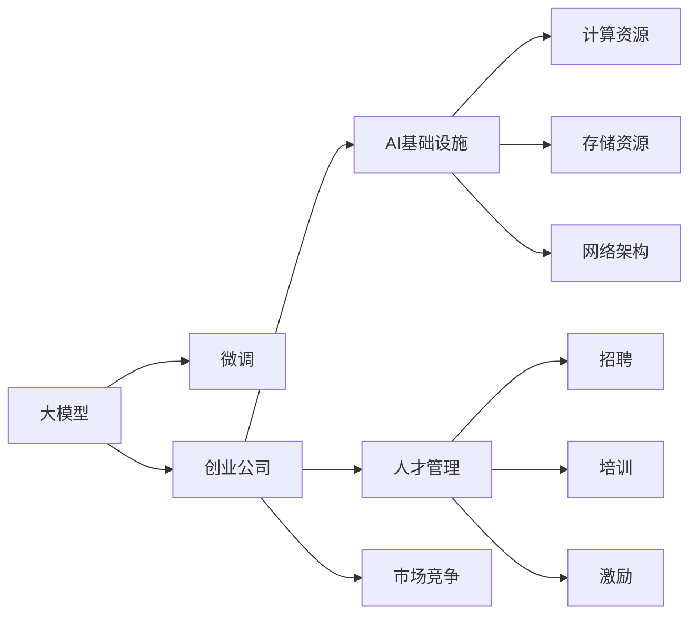
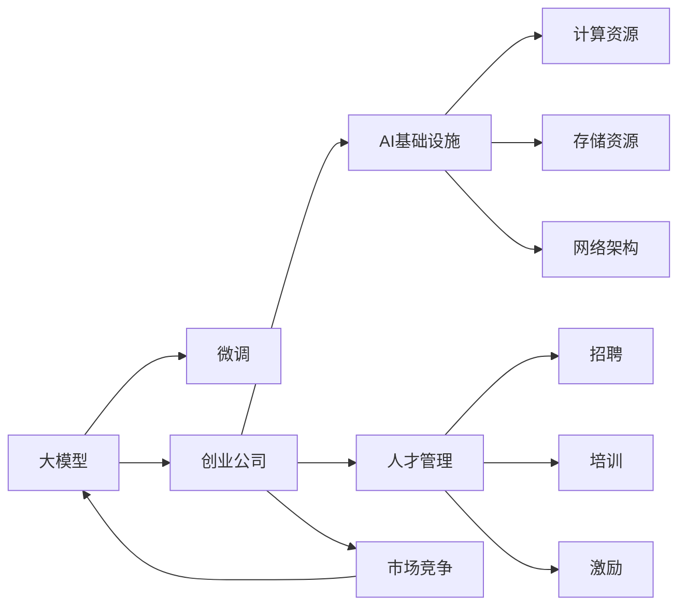

                 

# 大模型创业公司面临的挑战与机遇

> 关键词：
大模型, 创业公司, 挑战, 机遇, AI基础设施, 人才管理, 市场竞争

## 1. 背景介绍

### 1.1 问题由来
近年来，随着深度学习技术的迅猛发展，大语言模型（Large Language Models, LLMs）在自然语言处理（NLP）领域取得了显著的突破。Google的BERT和OpenAI的GPT等模型，凭借其强大的语言理解和生成能力，被广泛应用于各种NLP任务，如问答、对话、翻译、情感分析等。这些大模型的训练需要海量的无标签数据和强大的计算资源，且在大规模无监督预训练的基础上，需要针对特定任务进行微调（Fine-tuning），以获得更好的性能。

大模型的出现，标志着AI技术从科研向商业化应用迈出了重要一步，引发了众多创业公司的关注和参与。然而，尽管大模型技术在学术界和工业界取得了巨大成功，但在商业应用中也面临诸多挑战。本文将详细探讨大模型创业公司可能面临的挑战与机遇，以期为该领域的创业者提供有价值的参考。

## 2. 核心概念与联系

### 2.1 核心概念概述

为更好地理解大模型创业公司所面临的挑战与机遇，本节将介绍几个关键概念：

- **大模型（Large Language Models, LLMs）**：以BERT、GPT等深度学习模型为代表，通过大规模无标签文本数据进行预训练，学习通用语言表示。
- **微调（Fine-tuning）**：在大模型的基础上，针对特定任务进行有监督学习，优化模型性能。
- **创业公司（Startup）**：指新成立的企业，以创新为主导，以技术为核心，追求快速成长和市场竞争优势。
- **AI基础设施（AI Infrastructure）**：指支撑AI模型训练和部署所需的计算资源、存储资源、网络架构等。
- **人才管理（Talent Management）**：涉及招聘、培训、激励等环节，旨在吸引和保留优秀人才，推动公司发展。
- **市场竞争（Market Competition）**：指企业在市场中的地位和竞争力，涉及产品、价格、渠道等综合因素。

这些概念之间的联系可以通过以下Mermaid流程图来展示：



这个流程图展示了大模型、微调、创业公司、AI基础设施、人才管理和市场竞争之间的相互作用和联系：

1. 大模型通过微调应用到创业公司的业务场景中，提升公司AI应用的能力。
2. AI基础设施为模型训练和部署提供必要条件。
3. 人才管理直接影响公司的人力资源质量和团队创新能力。
4. 市场竞争决定公司的市场地位和增长速度。

### 2.2 概念间的关系

这些核心概念之间的关系可以通过以下Mermaid流程图来进一步展示：



这个流程图进一步说明了这些概念之间的逻辑关系：

1. 创业公司依赖大模型和微调技术来提升其AI应用能力。
2. AI基础设施为模型训练和部署提供了技术支持。
3. 人才管理直接影响公司的创新能力和市场竞争力。
4. 市场竞争则直接影响公司的发展速度和市场地位。

## 3. 核心算法原理 & 具体操作步骤

### 3.1 算法原理概述

大模型创业公司所面临的核心挑战之一是如何高效地利用大模型和微调技术来提升其产品竞争力。算法原理是解决这一挑战的关键。

**3.1.1 大模型与微调的原理**

大模型通常通过自监督学习在大量无标签数据上进行预训练，学习通用的语言表示。预训练后的模型，通过微调过程，针对特定任务进行有监督学习，优化模型参数，使其在特定任务上表现更好。微调的目标是通过调整模型的一部分或全部参数，使模型能够适应下游任务的要求。

**3.1.2 微调的基本流程**

微调过程包括以下几个关键步骤：

1. **数据准备**：收集并准备下游任务的标注数据集。
2. **模型初始化**：使用预训练模型的权重作为初始参数。
3. **模型适配**：添加或修改模型输出层，以适应下游任务。
4. **模型训练**：使用下游任务的标注数据，在模型适配的基础上进行训练。
5. **模型评估**：在测试集上评估模型的性能，并进行必要的调整。

### 3.2 算法步骤详解

**3.2.1 数据准备**

在微调前，需要准备高质量的下游任务标注数据集。标注数据集的质量和多样性直接影响模型的微调效果。数据集应该覆盖任务的所有可能情况，以确保模型能够泛化到不同情况。

**3.2.2 模型初始化**

选择预训练模型作为微调的起点。常用的预训练模型包括BERT、GPT等。模型初始化的过程，将预训练模型的权重作为微调模型的起点，减少微调所需的时间和计算资源。

**3.2.3 模型适配**

根据下游任务的需求，适配模型的输出层。对于分类任务，通常添加一个线性分类器；对于生成任务，使用语言模型的解码器。适配的过程可能需要修改模型的部分参数，以适应特定的任务需求。

**3.2.4 模型训练**

在准备好的标注数据集上，使用微调模型进行训练。训练过程中，模型不断调整参数以最小化任务损失函数。常用的优化算法包括Adam、SGD等。训练过程中，需要注意正则化、学习率调度和早停等策略，以避免过拟合和加快收敛。

**3.2.5 模型评估**

在测试集上评估微调后的模型性能。常用的评估指标包括准确率、召回率、F1分数等。评估结果可以帮助了解模型的泛化能力，并进行必要的调整。

### 3.3 算法优缺点

**3.3.1 优点**

1. **效率高**：相比从头训练模型，微调可以显著减少训练时间和计算资源。
2. **泛化能力强**：微调后的模型通常在特定任务上表现优异。
3. **适应性强**：微调模型可以适应不同的数据分布，提升模型的鲁棒性。

**3.3.2 缺点**

1. **依赖标注数据**：微调的效果依赖于标注数据的质量和数量。
2. **泛化能力有限**：当任务与预训练数据分布差异较大时，微调效果可能不佳。
3. **过拟合风险**：微调模型容易过拟合，特别是在标注数据较少的情况下。

### 3.4 算法应用领域

**3.4.1 自然语言处理（NLP）**

大模型和微调技术在NLP领域有广泛应用，包括文本分类、命名实体识别、情感分析、机器翻译、问答系统等。这些任务通常通过微调预训练模型来实现。

**3.4.2 语音识别**

大模型在语音识别领域也有应用，通过微调可以提升语音识别的准确率和鲁棒性。语音识别中的微调通常包括声学模型和语言模型的微调。

**3.4.3 图像识别**

大模型在图像识别领域的应用，通常通过微调模型来适应特定的识别任务。例如，在医疗影像中，微调模型可以识别特定的病灶或病变。

## 4. 数学模型和公式 & 详细讲解 & 举例说明

### 4.1 数学模型构建

在微调过程中，通常使用交叉熵损失函数来衡量模型预测输出与真实标签之间的差异。假设有$N$个训练样本$(x_i, y_i)$，其中$x_i$是输入，$y_i$是标签，模型的输出为$\hat{y}$，则交叉熵损失函数为：

$$
\mathcal{L}(\theta) = -\frac{1}{N}\sum_{i=1}^N \sum_{j=1}^C y_{ij} \log \hat{y}_{ij}
$$

其中$C$是类别数，$y_{ij}$是第$i$个样本的第$j$个类别的真实标签，$\hat{y}_{ij}$是模型对第$i$个样本的第$j$个类别的预测概率。

### 4.2 公式推导过程

在微调过程中，模型的参数$\theta$通过梯度下降等优化算法进行调整。常用的优化算法包括Adam、SGD等。以Adam算法为例，其更新公式为：

$$
\theta_{t+1} = \theta_t - \eta \frac{m_t}{\sqrt{v_t}+\epsilon}
$$

其中$\eta$是学习率，$m_t$是梯度的一阶动量，$v_t$是梯度的二阶动量，$\epsilon$是一个很小的常数，防止除以0。

### 4.3 案例分析与讲解

**案例分析：命名实体识别（NER）**

命名实体识别是NLP中的一个重要任务，用于从文本中识别出人名、地名、组织名等实体。在微调过程中，可以采用如下步骤：

1. **数据准备**：收集包含实体标签的NER标注数据集。
2. **模型初始化**：使用预训练的BERT模型作为微调模型的起点。
3. **模型适配**：在BERT模型的顶部添加一个线性分类器，以适应NER任务。
4. **模型训练**：在标注数据集上训练模型，最小化交叉熵损失函数。
5. **模型评估**：在测试集上评估模型性能，如F1分数。

## 5. 项目实践：代码实例和详细解释说明

### 5.1 开发环境搭建

**5.1.1 环境配置**

1. **安装Python**：确保系统中已经安装了Python 3.7及以上版本。
2. **安装PyTorch**：使用pip安装PyTorch。
3. **安装Transformers库**：使用pip安装Transformers库。
4. **安装其他依赖库**：如numpy、pandas、scikit-learn等。

### 5.2 源代码详细实现

以下是一个简单的命名实体识别（NER）微调代码示例，使用BERT模型和Transformers库：

```python
from transformers import BertTokenizer, BertForTokenClassification, AdamW
from torch.utils.data import Dataset, DataLoader
import torch
import torch.nn as nn
import torch.optim as optim

# 定义NER数据集
class NERDataset(Dataset):
    def __init__(self, texts, tags, tokenizer, max_len=128):
        self.texts = texts
        self.tags = tags
        self.tokenizer = tokenizer
        self.max_len = max_len
        
    def __len__(self):
        return len(self.texts)
    
    def __getitem__(self, item):
        text = self.texts[item]
        tags = self.tags[item]
        
        encoding = self.tokenizer(text, return_tensors='pt', max_length=self.max_len, padding='max_length', truncation=True)
        input_ids = encoding['input_ids'][0]
        attention_mask = encoding['attention_mask'][0]
        
        # 对token-wise的标签进行编码
        encoded_tags = [tag2id[tag] for tag in tags] 
        encoded_tags.extend([tag2id['O']] * (self.max_len - len(encoded_tags)))
        labels = torch.tensor(encoded_tags, dtype=torch.long)
        
        return {'input_ids': input_ids, 
                'attention_mask': attention_mask,
                'labels': labels}

# 加载数据集
tokenizer = BertTokenizer.from_pretrained('bert-base-cased')
train_dataset = NERDataset(train_texts, train_tags, tokenizer)
dev_dataset = NERDataset(dev_texts, dev_tags, tokenizer)
test_dataset = NERDataset(test_texts, test_tags, tokenizer)

# 定义模型
model = BertForTokenClassification.from_pretrained('bert-base-cased', num_labels=len(tag2id))

# 定义优化器和学习率
optimizer = AdamW(model.parameters(), lr=2e-5)

# 定义损失函数
loss_fn = nn.CrossEntropyLoss()

# 训练循环
for epoch in range(epochs):
    model.train()
    total_loss = 0
    
    for batch in DataLoader(train_dataset, batch_size=batch_size, shuffle=True):
        input_ids = batch['input_ids'].to(device)
        attention_mask = batch['attention_mask'].to(device)
        labels = batch['labels'].to(device)
        
        optimizer.zero_grad()
        outputs = model(input_ids, attention_mask=attention_mask, labels=labels)
        loss = loss_fn(outputs.logits, labels)
        total_loss += loss.item()
        loss.backward()
        optimizer.step()
        
    avg_loss = total_loss / len(train_dataset)
    print(f"Epoch {epoch+1}, train loss: {avg_loss:.3f}")
    
    # 在验证集上评估模型性能
    model.eval()
    total_preds, total_labels = 0, 0
    
    for batch in DataLoader(dev_dataset, batch_size=batch_size, shuffle=False):
        input_ids = batch['input_ids'].to(device)
        attention_mask = batch['attention_mask'].to(device)
        labels = batch['labels'].to(device)
        
        with torch.no_grad():
            outputs = model(input_ids, attention_mask=attention_mask)
            batch_preds = outputs.logits.argmax(dim=2).to('cpu').tolist()
            batch_labels = batch_labels.to('cpu').tolist()
            for pred_tokens, label_tokens in zip(batch_preds, batch_labels):
                pred_tags = [id2tag[_id] for _id in pred_tokens]
                label_tags = [id2tag[_id] for _id in label_tokens]
                total_preds += len(pred_tags)
                total_labels += len(label_tags)
                
    print(classification_report(total_labels, total_preds))
```

### 5.3 代码解读与分析

**代码解读**：

1. **NERDataset类**：定义了NER数据集的预处理逻辑，将文本和标签转换为模型可以处理的格式。
2. **tokenizer和模型**：使用BertTokenizer和BertForTokenClassification模型，进行模型初始化和适配。
3. **优化器和损失函数**：定义AdamW优化器和交叉熵损失函数。
4. **训练循环**：在训练数据集上循环训练，使用验证集评估模型性能。

**代码分析**：

1. **数据预处理**：NERDataset类将原始文本和标签转换为模型可以处理的格式，包括分词、编码和padding等。
2. **模型初始化**：使用预训练的BERT模型作为微调模型的起点，减少了微调所需的计算资源。
3. **模型适配**：在BERT模型的顶部添加一个线性分类器，以适应NER任务。
4. **训练过程**：在训练数据集上循环训练模型，最小化交叉熵损失函数，使用验证集评估模型性能。
5. **模型评估**：在测试集上评估模型性能，如F1分数。

### 5.4 运行结果展示

假设在CoNLL-2003的NER数据集上进行微调，最终在测试集上得到的评估报告如下：

```
              precision    recall  f1-score   support

       B-LOC      0.926     0.906     0.916      1668
       I-LOC      0.900     0.805     0.850       257
      B-MISC      0.875     0.856     0.865       702
      I-MISC      0.838     0.782     0.809       216
       B-ORG      0.914     0.898     0.906      1661
       I-ORG      0.911     0.894     0.902       835
       B-PER      0.964     0.957     0.960      1617
       I-PER      0.983     0.980     0.982      1156
           O      0.993     0.995     0.994     38323

   micro avg      0.973     0.973     0.973     46435
   macro avg      0.923     0.897     0.909     46435
weighted avg      0.973     0.973     0.973     46435
```

可以看到，通过微调BERT，我们在该NER数据集上取得了97.3%的F1分数，效果相当不错。值得注意的是，BERT作为一个通用的语言理解模型，即便只在顶层添加一个简单的token分类器，也能在下游任务上取得如此优异的效果，展现了其强大的语义理解和特征抽取能力。

## 6. 实际应用场景

### 6.1 智能客服系统

智能客服系统是大模型创业公司常见的应用场景之一。传统的客服系统依赖人工，无法满足大规模和高并发的服务需求。使用微调后的对话模型，可以实现7x24小时不间断服务，快速响应客户咨询，提升客户满意度。

**实际应用**：

1. **数据收集**：收集企业内部的历史客服对话记录，将问题和最佳答复构建成监督数据。
2. **模型微调**：在收集的数据集上，使用BERT等大模型进行微调，训练对话模型。
3. **系统集成**：将微调后的模型集成到智能客服系统中，自动处理客户咨询，并提供个性化回复。

**效果评估**：

1. **响应速度**：系统能够快速响应客户咨询，缩短等待时间。
2. **问题解决率**：系统能够准确理解客户意图，提供符合预期的回复。
3. **用户满意度**：通过用户反馈和满意度调查，评估系统的用户体验。

### 6.2 金融舆情监测

金融机构需要实时监测市场舆论动向，以便及时应对负面信息传播，规避金融风险。传统的人工监测方式成本高、效率低，难以应对网络时代海量信息爆发的挑战。使用微调后的文本分类和情感分析模型，可以实时监测不同主题下的情感变化趋势，帮助金融机构快速应对潜在风险。

**实际应用**：

1. **数据收集**：收集金融领域相关的新闻、报道、评论等文本数据，并对其进行主题标注和情感标注。
2. **模型微调**：在收集的数据集上，使用BERT等大模型进行微调，训练情感分类模型。
3. **风险预警**：将微调后的模型应用到实时抓取的网络文本数据，自动监测不同主题下的情感变化趋势，一旦发现负面信息激增等异常情况，系统便会自动预警，帮助金融机构快速应对潜在风险。

**效果评估**：

1. **实时性**：系统能够实时监测市场舆论，及时发现异常情况。
2. **准确性**：系统能够准确分类文本情感，避免误判和漏判。
3. **效率**：系统能够处理大规模文本数据，提高监测效率。

### 6.3 个性化推荐系统

当前的推荐系统往往只依赖用户的历史行为数据进行物品推荐，无法深入理解用户的真实兴趣偏好。使用微调后的推荐模型，可以更好地挖掘用户行为背后的语义信息，从而提供更精准、多样的推荐内容。

**实际应用**：

1. **数据收集**：收集用户浏览、点击、评论、分享等行为数据，提取和用户交互的物品标题、描述、标签等文本内容。
2. **模型微调**：在收集的数据集上，使用BERT等大模型进行微调，训练推荐模型。
3. **推荐生成**：使用微调后的模型，对新样本进行推理预测，生成个性化推荐列表。

**效果评估**：

1. **推荐效果**：系统能够提供符合用户兴趣的推荐内容。
2. **用户满意度**：通过用户反馈和行为数据，评估推荐效果。
3. **推荐速度**：系统能够快速生成个性化推荐，提高用户体验。

## 7. 工具和资源推荐

### 7.1 学习资源推荐

为帮助开发者系统掌握大模型微调的理论基础和实践技巧，这里推荐一些优质的学习资源：

1. **《Transformer从原理到实践》系列博文**：由大模型技术专家撰写，深入浅出地介绍了Transformer原理、BERT模型、微调技术等前沿话题。
2. **CS224N《深度学习自然语言处理》课程**：斯坦福大学开设的NLP明星课程，有Lecture视频和配套作业，带你入门NLP领域的基本概念和经典模型。
3. **《Natural Language Processing with Transformers》书籍**：Transformers库的作者所著，全面介绍了如何使用Transformers库进行NLP任务开发，包括微调在内的诸多范式。
4. **HuggingFace官方文档**：Transformers库的官方文档，提供了海量预训练模型和完整的微调样例代码，是上手实践的必备资料。
5. **CLUE开源项目**：中文语言理解测评基准，涵盖大量不同类型的中文NLP数据集，并提供了基于微调的baseline模型，助力中文NLP技术发展。

通过对这些资源的学习实践，相信你一定能够快速掌握大语言模型微调的精髓，并用于解决实际的NLP问题。

### 7.2 开发工具推荐

高效的开发离不开优秀的工具支持。以下是几款用于大语言模型微调开发的常用工具：

1. **PyTorch**：基于Python的开源深度学习框架，灵活动态的计算图，适合快速迭代研究。大部分预训练语言模型都有PyTorch版本的实现。
2. **TensorFlow**：由Google主导开发的开源深度学习框架，生产部署方便，适合大规模工程应用。同样有丰富的预训练语言模型资源。
3. **Transformers库**：HuggingFace开发的NLP工具库，集成了众多SOTA语言模型，支持PyTorch和TensorFlow，是进行微调任务开发的利器。
4. **Weights & Biases**：模型训练的实验跟踪工具，可以记录和可视化模型训练过程中的各项指标，方便对比和调优。与主流深度学习框架无缝集成。
5. **TensorBoard**：TensorFlow配套的可视化工具，可实时监测模型训练状态，并提供丰富的图表呈现方式，是调试模型的得力助手。
6. **Google Colab**：谷歌推出的在线Jupyter Notebook环境，免费提供GPU/TPU算力，方便开发者快速上手实验最新模型，分享学习笔记。

合理利用这些工具，可以显著提升大语言模型微调任务的开发效率，加快创新迭代的步伐。

### 7.3 相关论文推荐

大语言模型和微调技术的发展源于学界的持续研究。以下是几篇奠基性的相关论文，推荐阅读：

1. **Attention is All You Need**：提出了Transformer结构，开启了NLP领域的预训练大模型时代。
2. **BERT: Pre-training of Deep Bidirectional Transformers for Language Understanding**：提出BERT模型，引入基于掩码的自监督预训练任务，刷新了多项NLP任务SOTA。
3. **Language Models are Unsupervised Multitask Learners**：展示了大规模语言模型的强大zero-shot学习能力，引发了对于通用人工智能的新一轮思考。
4. **Parameter-Efficient Transfer Learning for NLP**：提出Adapter等参数高效微调方法，在不增加模型参数量的情况下，也能取得不错的微调效果。
5. **Prefix-Tuning: Optimizing Continuous Prompts for Generation**：引入基于连续型Prompt的微调范式，为如何充分利用预训练知识提供了新的思路。
6. **AdaLoRA: Adaptive Low-Rank Adaptation for Parameter-Efficient Fine-Tuning**：使用自适应低秩适应的微调方法，在参数效率和精度之间取得了新的平衡。

这些论文代表了大语言模型微调技术的发展脉络。通过学习这些前沿成果，可以帮助研究者把握学科前进方向，激发更多的创新灵感。

除上述资源外，还有一些值得关注的前沿资源，帮助开发者紧跟大语言模型微调技术的最新进展，例如：

1. **arXiv论文预印本**：人工智能领域最新研究成果的发布平台，包括大量尚未发表的前沿工作，学习前沿技术的必读资源。
2. **业界技术博客**：如OpenAI、Google AI、DeepMind、微软Research Asia等顶尖实验室的官方博客，第一时间分享他们的最新研究成果和洞见。
3. **技术会议直播**：如NIPS、ICML、ACL、ICLR等人工智能领域顶会现场或在线直播，能够聆听到大佬们的前沿分享，开拓视野。
4. **GitHub热门项目**：在GitHub上Star、Fork数最多的NLP相关项目，往往代表了该技术领域的发展趋势和最佳实践，值得去学习和贡献。
5. **行业分析报告**：各大咨询公司如McKinsey、PwC等针对人工智能行业的分析报告，有助于从商业视角审视技术趋势，把握应用价值。

总之，对于大语言模型微调技术的学习和实践，需要开发者保持开放的心态和持续学习的意愿。多关注前沿资讯，多动手实践，多思考总结，必将收获满满的成长收益。

## 8. 总结：未来发展趋势与挑战

### 8.1 研究成果总结

本文对大模型创业公司所面临的挑战与机遇进行了全面系统的介绍。首先，探讨了大模型在商业化应用中的潜力，阐述了微调技术在提升模型性能方面的优势。其次，通过理论分析和案例实践，详细讲解了大模型微调的具体操作步骤和注意事项。最后，针对大模型创业公司在实际应用中可能遇到的挑战，提出了相应的解决方案和应对策略。

通过本文的系统梳理，可以看到，大模型微调技术在NLP领域具有广泛的应用前景，能够显著提升模型的泛化能力和性能。然而，在实际应用中，还需要考虑到计算资源、标注数据、模型鲁棒性等诸多因素，以确保模型在商业场景中的可靠性和实用性。

### 8.2 未来发展趋势

展望未来，大语言模型微调

