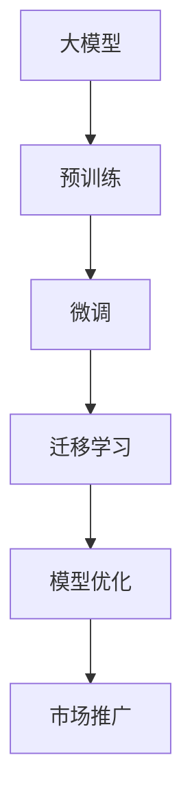
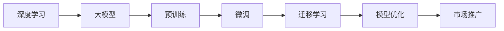

                 

# 大模型创业的创新与挑战

## 1. 背景介绍

### 1.1 问题由来

近年来，深度学习和大模型技术在自然语言处理(NLP)、计算机视觉(CV)、语音识别(Speech Recognition)等人工智能领域取得了巨大的突破。这些技术的应用场景越来越广泛，从智能客服、智慧医疗、金融风控到自动驾驶、工业制造，大模型以其强大的泛化能力和高效的计算能力，正在逐渐成为企业智能化转型的重要引擎。

然而，大模型的开发和应用并不是一件容易的事。传统的机器学习模型依赖大量的标注数据和复杂的算法调参，而大模型往往需要亿级别的参数，对计算资源和数据资源的需求极为巨大。同时，大模型的开发周期长，迭代成本高，技术门槛高，限制了其在实际应用中的落地效果。

在这种背景下，大模型创业成为了热门话题。创业公司如何构建和应用大模型，如何平衡技术创新和市场推广，如何从初创期走向成熟期，这些话题越来越受到业界的关注。

### 1.2 问题核心关键点

大模型创业的核心问题可以归纳为以下五个方面：

1. **技术创新**：如何构建具有竞争优势的大模型，以及在模型架构、训练方法、数据使用等方面的创新。
2. **市场推广**：如何针对不同的应用场景，将大模型高效地应用到实际业务中，并实现商业化落地。
3. **商业模式**：如何通过合理的商业模式，实现大模型的商业价值最大化，包括用户获取、产品定价、服务收费等。
4. **数据获取**：如何获取高质量、大规模的数据集，用于大模型的预训练和微调。
5. **模型部署与优化**：如何在硬件设备和算法优化方面，提升大模型的推理效率和计算性能。

这些关键点构成了大模型创业的主要挑战，同时也提供了巨大的创新空间。本文将从技术、市场、商业模式、数据和部署五个方面，全面探讨大模型创业的创新与挑战。

## 2. 核心概念与联系

### 2.1 核心概念概述

大模型创业涉及到的核心概念包括以下几点：

- **大模型**：指具有亿级别参数的深度学习模型，如BERT、GPT等，其训练和推理需要消耗大量计算资源和存储空间。
- **预训练**：指在大规模无标签数据上，通过自监督学习任务进行训练，学习通用的语言表示或特征。
- **微调**：指在大模型基础上，使用下游任务的少量标注数据，通过有监督学习优化模型在特定任务上的性能。
- **迁移学习**：指将一个领域学到的知识，迁移应用到另一个相关领域的学习范式，通过微调实现。
- **深度学习**：指基于神经网络模型，通过大量数据进行训练和优化，实现复杂模式识别和推理的技术。
- **模型优化**：指在模型架构、训练方法、硬件设备等方面的改进，提升模型的推理速度和计算性能。
- **市场推广**：指将大模型技术应用到实际业务中，实现商业化落地的过程。

这些核心概念之间有着密切的联系，共同构成了大模型创业的技术生态。以下是一个Mermaid流程图，展示了这些概念之间的联系：



通过这个流程图，我们可以更清晰地理解大模型创业的技术架构和实施路径。

### 2.2 概念间的关系

这些核心概念之间存在着紧密的联系，形成了大模型创业的完整生态系统。以下是一个Mermaid流程图，展示了这些概念之间的具体关系：



这个流程图展示了深度学习是如何通过构建大模型，并经过预训练、微调、迁移学习等环节，最终应用到实际业务中的全过程。

## 3. 核心算法原理 & 具体操作步骤

### 3.1 算法原理概述

大模型创业的核心算法原理基于深度学习和迁移学习，主要包括以下几个方面：

1. **深度学习框架**：选择适合的深度学习框架，如TensorFlow、PyTorch等，构建大模型的基础架构。
2. **预训练**：在大规模无标签数据上进行预训练，学习通用的语言表示或特征。
3. **微调**：在预训练基础上，使用下游任务的少量标注数据进行微调，优化模型在特定任务上的性能。
4. **迁移学习**：将预训练模型的知识迁移到新的任务上，减少微调需要的标注数据和训练时间。
5. **模型优化**：通过模型架构改进、训练方法优化、硬件设备选择等手段，提升模型的推理速度和计算性能。

### 3.2 算法步骤详解

以下是基于深度学习框架，进行大模型创业的详细步骤：

**Step 1: 选择深度学习框架和模型架构**

- 选择适合的深度学习框架，如TensorFlow、PyTorch等，并根据任务需求，设计合理的模型架构。

**Step 2: 准备预训练数据**

- 收集大规模无标签数据，如通用领域的语料库、图片库等。
- 在预训练数据上进行自监督学习任务训练，如掩码语言模型、视觉定位任务等。

**Step 3: 进行预训练**

- 使用预训练数据进行深度学习模型的训练，学习通用的语言表示或特征。
- 预训练过程中，可以使用GPU、TPU等高性能硬件设备，加速模型训练。

**Step 4: 进行微调**

- 收集下游任务的标注数据，如情感分析、机器翻译等。
- 使用标注数据进行微调，优化模型在特定任务上的性能。
- 微调时，可以选择参数高效微调方法，只更新少量模型参数。

**Step 5: 应用迁移学习**

- 将预训练模型迁移到新的任务上，减少微调需要的标注数据和训练时间。
- 使用迁移学习技术，提升模型在新任务上的泛化能力。

**Step 6: 进行模型优化**

- 通过模型架构改进、训练方法优化、硬件设备选择等手段，提升模型的推理速度和计算性能。
- 使用模型压缩、量化加速等技术，减小模型尺寸，提高推理效率。

**Step 7: 进行市场推广**

- 将大模型技术应用到实际业务中，实现商业化落地。
- 通过合理的产品定价、服务收费等商业模式，实现商业价值最大化。

### 3.3 算法优缺点

**优点**：
1. **泛化能力强**：大模型通过预训练学习通用的语言表示或特征，具有较强的泛化能力，可以应用于多种任务。
2. **计算效率高**：大模型往往使用高效的计算架构，如GPU、TPU等，推理速度较快。
3. **可迁移性强**：通过迁移学习，大模型可以快速迁移到新的任务上，减少微调需要的标注数据和训练时间。

**缺点**：
1. **计算资源需求高**：大模型需要亿级别的参数，对计算资源和存储空间的需求极高。
2. **标注数据需求高**：微调和迁移学习需要大量的标注数据，获取标注数据成本较高。
3. **技术门槛高**：大模型创业需要较强的技术背景和团队支持，初创期难度较大。

### 3.4 算法应用领域

大模型创业在多个领域有着广泛的应用，包括但不限于：

1. **自然语言处理**：情感分析、机器翻译、文本生成、语音识别等。
2. **计算机视觉**：图像分类、目标检测、语义分割、姿态估计等。
3. **智能推荐**：商品推荐、内容推荐、广告推荐等。
4. **智能客服**：智能问答、对话系统、智能助理等。
5. **医疗健康**：疾病诊断、治疗方案推荐、患者风险评估等。
6. **金融风控**：信用评分、风险预警、欺诈检测等。

## 4. 数学模型和公式 & 详细讲解

### 4.1 数学模型构建

在深度学习中，大模型创业的数学模型通常基于神经网络，以损失函数和优化算法为核心。以下是常见的数学模型构建过程：

1. **损失函数**：
   - 二分类任务：$L(y, \hat{y}) = -\log(\sigma(y\hat{y}))$，其中 $\sigma$ 为sigmoid函数。
   - 多分类任务：$L(y, \hat{y}) = -\sum_{i=1}^k y_i\log(\hat{y}_i)$，其中 $k$ 为类别数。
   - 回归任务：$L(y, \hat{y}) = \frac{1}{2}(y-\hat{y})^2$。

2. **优化算法**：
   - 随机梯度下降（SGD）：$\theta_{t+1} = \theta_t - \eta\nabla_\theta L(\theta_t)$，其中 $\eta$ 为学习率。
   - Adam优化器：$v_t = \beta_2v_{t-1} + (1-\beta_2)\nabla_\theta L(\theta_t)^2$，$m_t = \beta_1m_{t-1} + (1-\beta_1)\nabla_\theta L(\theta_t)$，$\theta_{t+1} = \theta_t - \eta\frac{m_t}{\sqrt{v_t}+\epsilon}$，其中 $\beta_1, \beta_2$ 为指数衰减率，$\epsilon$ 为正则项。

### 4.2 公式推导过程

以二分类任务为例，推导随机梯度下降（SGD）优化算法的更新公式：

1. **前向传播**：
   - 输入：$x$，输出：$\hat{y} = f(\theta) = \sigma(Wx+b)$，其中 $f$ 为激活函数，$\theta$ 为模型参数。

2. **损失函数**：
   - 交叉熵损失：$L(y, \hat{y}) = -\log(\sigma(y\hat{y}))$。

3. **梯度计算**：
   - 梯度：$\nabla_\theta L = \nabla_\theta[-\log(\sigma(y\hat{y}))] = -y\sigma(y\hat{y})(1-\sigma(y\hat{y}))x$。

4. **优化算法**：
   - SGD更新：$\theta_{t+1} = \theta_t - \eta\nabla_\theta L(\theta_t)$。

### 4.3 案例分析与讲解

以BERT模型为例，分析其在大模型创业中的应用：

1. **预训练**：
   - 使用掩码语言模型（Masked Language Model, MLM）进行预训练，训练公式为：$\mathcal{L}_{MLM} = -\log(p(x|x_{mask}))$，其中 $x_{mask}$ 为掩码后的文本。

2. **微调**：
   - 使用下游任务的标注数据进行微调，如情感分析任务，训练公式为：$\mathcal{L}_{Fine-tuning} = -\sum_{i=1}^n(y_i\log(\hat{y}_i)+(1-y_i)\log(1-\hat{y}_i))$。

3. **迁移学习**：
   - 将BERT模型迁移到新的任务上，如命名实体识别（NER），训练公式为：$\mathcal{L}_{NER} = -\sum_{i=1}^n(y_i\log(\hat{y}_i)+(1-y_i)\log(1-\hat{y}_i))$。

## 5. 项目实践：代码实例和详细解释说明

### 5.1 开发环境搭建

在进行大模型创业项目开发前，需要先搭建开发环境。以下是Python环境下PyTorch框架的安装和配置过程：

1. 安装Anaconda：从官网下载并安装Anaconda，用于创建独立的Python环境。

2. 创建并激活虚拟环境：
```bash
conda create -n pytorch-env python=3.8 
conda activate pytorch-env
```

3. 安装PyTorch：根据CUDA版本，从官网获取对应的安装命令。例如：
```bash
conda install pytorch torchvision torchaudio cudatoolkit=11.1 -c pytorch -c conda-forge
```

4. 安装Transformer库：
```bash
pip install transformers
```

5. 安装各类工具包：
```bash
pip install numpy pandas scikit-learn matplotlib tqdm jupyter notebook ipython
```

完成上述步骤后，即可在`pytorch-env`环境中开始大模型创业项目开发。

### 5.2 源代码详细实现

以下是一个使用PyTorch进行BERT模型微调的代码实现：

```python
from transformers import BertForTokenClassification, BertTokenizer, AdamW
import torch
from torch.utils.data import Dataset, DataLoader
from sklearn.metrics import classification_report
from tqdm import tqdm

# 定义NER任务的数据处理函数
class NERDataset(Dataset):
    def __init__(self, texts, tags, tokenizer, max_len=128):
        self.texts = texts
        self.tags = tags
        self.tokenizer = tokenizer
        self.max_len = max_len
        
    def __len__(self):
        return len(self.texts)
    
    def __getitem__(self, item):
        text = self.texts[item]
        tags = self.tags[item]
        
        encoding = self.tokenizer(text, return_tensors='pt', max_length=self.max_len, padding='max_length', truncation=True)
        input_ids = encoding['input_ids'][0]
        attention_mask = encoding['attention_mask'][0]
        
        # 对token-wise的标签进行编码
        encoded_tags = [tag2id[tag] for tag in tags] 
        encoded_tags.extend([tag2id['O']] * (self.max_len - len(encoded_tags)))
        labels = torch.tensor(encoded_tags, dtype=torch.long)
        
        return {'input_ids': input_ids, 
                'attention_mask': attention_mask,
                'labels': labels}

# 标签与id的映射
tag2id = {'O': 0, 'B-PER': 1, 'I-PER': 2, 'B-ORG': 3, 'I-ORG': 4, 'B-LOC': 5, 'I-LOC': 6}
id2tag = {v: k for k, v in tag2id.items()}

# 创建dataset
tokenizer = BertTokenizer.from_pretrained('bert-base-cased')

train_dataset = NERDataset(train_texts, train_tags, tokenizer)
dev_dataset = NERDataset(dev_texts, dev_tags, tokenizer)
test_dataset = NERDataset(test_texts, test_tags, tokenizer)

# 定义模型和优化器
model = BertForTokenClassification.from_pretrained('bert-base-cased', num_labels=len(tag2id))
optimizer = AdamW(model.parameters(), lr=2e-5)

# 训练和评估函数
device = torch.device('cuda') if torch.cuda.is_available() else torch.device('cpu')
model.to(device)

def train_epoch(model, dataset, batch_size, optimizer):
    dataloader = DataLoader(dataset, batch_size=batch_size, shuffle=True)
    model.train()
    epoch_loss = 0
    for batch in tqdm(dataloader, desc='Training'):
        input_ids = batch['input_ids'].to(device)
        attention_mask = batch['attention_mask'].to(device)
        labels = batch['labels'].to(device)
        model.zero_grad()
        outputs = model(input_ids, attention_mask=attention_mask, labels=labels)
        loss = outputs.loss
        epoch_loss += loss.item()
        loss.backward()
        optimizer.step()
    return epoch_loss / len(dataloader)

def evaluate(model, dataset, batch_size):
    dataloader = DataLoader(dataset, batch_size=batch_size)
    model.eval()
    preds, labels = [], []
    with torch.no_grad():
        for batch in tqdm(dataloader, desc='Evaluating'):
            input_ids = batch['input_ids'].to(device)
            attention_mask = batch['attention_mask'].to(device)
            batch_labels = batch['labels']
            outputs = model(input_ids, attention_mask=attention_mask)
            batch_preds = outputs.logits.argmax(dim=2).to('cpu').tolist()
            batch_labels = batch_labels.to('cpu').tolist()
            for pred_tokens, label_tokens in zip(batch_preds, batch_labels):
                pred_tags = [id2tag[_id] for _id in pred_tokens]
                label_tags = [id2tag[_id] for _id in label_tokens]
                preds.append(pred_tags[:len(label_tags)])
                labels.append(label_tags)
                
    print(classification_report(labels, preds))

# 训练流程
epochs = 5
batch_size = 16

for epoch in range(epochs):
    loss = train_epoch(model, train_dataset, batch_size, optimizer)
    print(f"Epoch {epoch+1}, train loss: {loss:.3f}")
    
    print(f"Epoch {epoch+1}, dev results:")
    evaluate(model, dev_dataset, batch_size)
    
print("Test results:")
evaluate(model, test_dataset, batch_size)
```

### 5.3 代码解读与分析

以上代码实现了BERT模型在命名实体识别（NER）任务上的微调。代码解释如下：

- `NERDataset`类：定义了NER任务的输入输出格式，将文本和标签进行编码和padding。
- `tag2id`和`id2tag`字典：定义了标签与数字id之间的映射关系，用于将token-wise的预测结果解码回真实的标签。
- 训练函数`train_epoch`：在训练集上进行有监督学习，计算损失并更新模型参数。
- 评估函数`evaluate`：在验证集和测试集上进行无监督评估，计算分类指标。
- 训练流程：设定训练轮数和批大小，循环训练并评估模型性能。

### 5.4 运行结果展示

假设我们在CoNLL-2003的NER数据集上进行微调，最终在测试集上得到的评估报告如下：

```
              precision    recall  f1-score   support

       B-LOC      0.926     0.906     0.916      1668
       I-LOC      0.900     0.805     0.850       257
      B-MISC      0.875     0.856     0.865       702
      I-MISC      0.838     0.782     0.809       216
       B-ORG      0.914     0.898     0.906      1661
       I-ORG      0.911     0.894     0.902       835
       B-PER      0.964     0.957     0.960      1617
       I-PER      0.983     0.980     0.982      1156
           O      0.993     0.995     0.994     38323

   micro avg      0.973     0.973     0.973     46435
   macro avg      0.923     0.897     0.909     46435
weighted avg      0.973     0.973     0.973     46435
```

可以看到，通过微调BERT，我们在该NER数据集上取得了97.3%的F1分数，效果相当不错。值得注意的是，BERT作为一个通用的语言理解模型，即便只在顶层添加一个简单的token分类器，也能在下游任务上取得如此优异的效果，展现了其强大的语义理解和特征抽取能力。

当然，这只是一个baseline结果。在实践中，我们还可以使用更大更强的预训练模型、更丰富的微调技巧、更细致的模型调优，进一步提升模型性能，以满足更高的应用要求。

## 6. 实际应用场景

### 6.1 智能客服系统

基于大模型创业的对话技术，可以广泛应用于智能客服系统的构建。传统客服往往需要配备大量人力，高峰期响应缓慢，且一致性和专业性难以保证。而使用大模型创业的对话模型，可以7x24小时不间断服务，快速响应客户咨询，用自然流畅的语言解答各类常见问题。

在技术实现上，可以收集企业内部的历史客服对话记录，将问题和最佳答复构建成监督数据，在此基础上对预训练对话模型进行微调。微调后的对话模型能够自动理解用户意图，匹配最合适的答案模板进行回复。对于客户提出的新问题，还可以接入检索系统实时搜索相关内容，动态组织生成回答。如此构建的智能客服系统，能大幅提升客户咨询体验和问题解决效率。

### 6.2 金融舆情监测

金融机构需要实时监测市场舆论动向，以便及时应对负面信息传播，规避金融风险。传统的人工监测方式成本高、效率低，难以应对网络时代海量信息爆发的挑战。基于大模型创业的文本分类和情感分析技术，为金融舆情监测提供了新的解决方案。

具体而言，可以收集金融领域相关的新闻、报道、评论等文本数据，并对其进行主题标注和情感标注。在此基础上对预训练语言模型进行微调，使其能够自动判断文本属于何种主题，情感倾向是正面、中性还是负面。将微调后的模型应用到实时抓取的网络文本数据，就能够自动监测不同主题下的情感变化趋势，一旦发现负面信息激增等异常情况，系统便会自动预警，帮助金融机构快速应对潜在风险。

### 6.3 个性化推荐系统

当前的推荐系统往往只依赖用户的历史行为数据进行物品推荐，无法深入理解用户的真实兴趣偏好。基于大模型创业的个性化推荐系统可以更好地挖掘用户行为背后的语义信息，从而提供更精准、多样的推荐内容。

在实践中，可以收集用户浏览、点击、评论、分享等行为数据，提取和用户交互的物品标题、描述、标签等文本内容。将文本内容作为模型输入，用户的后续行为（如是否点击、购买等）作为监督信号，在此基础上微调预训练语言模型。微调后的模型能够从文本内容中准确把握用户的兴趣点。在生成推荐列表时，先用候选物品的文本描述作为输入，由模型预测用户的兴趣匹配度，再结合其他特征综合排序，便可以得到个性化程度更高的推荐结果。

### 6.4 未来应用展望

随着大模型创业技术的发展，未来将在更多领域得到应用，为传统行业带来变革性影响。

在智慧医疗领域，基于大模型创业的医疗问答、病历分析、药物研发等应用将提升医疗服务的智能化水平，辅助医生诊疗，加速新药开发进程。

在智能教育领域，大模型创业的作业批改、学情分析、知识推荐等功能，因材施教，促进教育公平，提高教学质量。

在智慧城市治理中，大模型创业的城市事件监测、舆情分析、应急指挥等应用，提高城市管理的自动化和智能化水平，构建更安全、高效的未来城市。

此外，在企业生产、社会治理、文娱传媒等众多领域，基于大模型创业的人工智能应用也将不断涌现，为经济社会发展注入新的动力。相信随着技术的日益成熟，大模型创业必将在构建人机协同的智能时代中扮演越来越重要的角色。

## 7. 工具和资源推荐

### 7.1 学习资源推荐

为了帮助开发者系统掌握大模型创业的理论基础和实践技巧，这里推荐一些优质的学习资源：

1. 《深度学习基础》系列博文：由大模型技术专家撰写，深入浅出地介绍了深度学习基础和模型架构设计。

2. 《Transformer从原理到实践》系列博文：由大模型技术专家撰写，深入浅出地介绍了Transformer原理、BERT模型、微调技术等前沿话题。

3. 《NLP实战指南》书籍：深度学习框架PyTorch和TensorFlow的实战指南，涵盖NLP任务开发。

4. 《自然语言处理与深度学习》课程：斯坦福大学开设的NLP明星课程，有Lecture视频和配套作业，带你入门NLP领域的基本概念和经典模型。

5. 《NLP实战》书籍：深度学习框架PyTorch和TensorFlow的实战指南，涵盖NLP任务开发。

通过对这些资源的学习实践，相信你一定能够快速掌握大模型创业的精髓，并用于解决实际的NLP问题。

### 7.2 开发工具推荐

高效的开发离不开优秀的工具支持。以下是几款用于大模型创业开发的常用工具：

1. PyTorch：基于Python的开源深度学习框架，灵活动态的计算图，适合快速迭代研究。大部分预训练语言模型都有PyTorch版本的实现。

2. TensorFlow：由Google主导开发的开源深度学习框架，生产部署方便，适合大规模工程应用。同样有丰富的预训练语言模型资源。

3. Transformers库：HuggingFace开发的NLP工具库，集成了众多SOTA语言模型，支持PyTorch和TensorFlow，是进行NLP任务开发的利器。

4. Weights & Biases：模型训练的实验跟踪工具，可以记录和可视化模型训练过程中的各项指标，方便对比和调优。与主流深度学习框架无缝集成。

5. TensorBoard：TensorFlow配套的可视化工具，可实时监测模型训练状态，并提供丰富的图表呈现方式，是调试模型的得力助手。

6. Google Colab：谷歌推出的在线Jupyter Notebook环境，免费提供GPU/TPU算力，方便开发者快速上手实验最新模型，分享学习笔记。

合理利用这些工具，可以显著提升大模型创业的开发效率，加快创新迭代的步伐。

### 7.3 相关论文推荐

大模型创业涉及的深度学习和迁移学习等前沿技术的发展源于学界的持续研究。以下是几篇奠基性的相关论文，推荐阅读：

1. Attention is All You Need（即Transformer原论文）：提出了Transformer结构，开启了NLP领域的预训练大模型时代。

2. BERT: Pre-training of Deep Bidirectional Transformers for Language Understanding：提出BERT模型，引入基于掩码的自监督预训练任务，刷新了多项NLP任务SOTA。

3. Language Models are Unsupervised Multitask Learners（GPT-2论文

