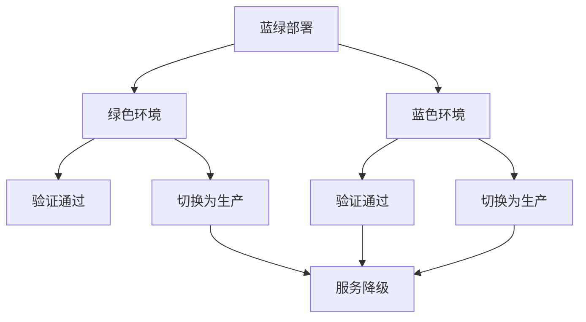
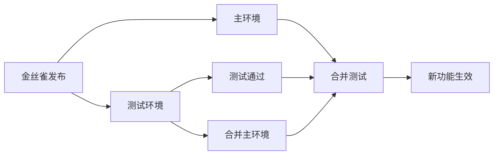
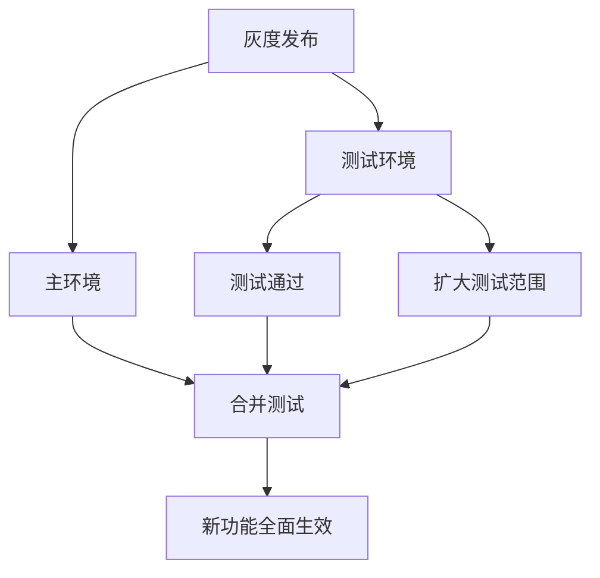
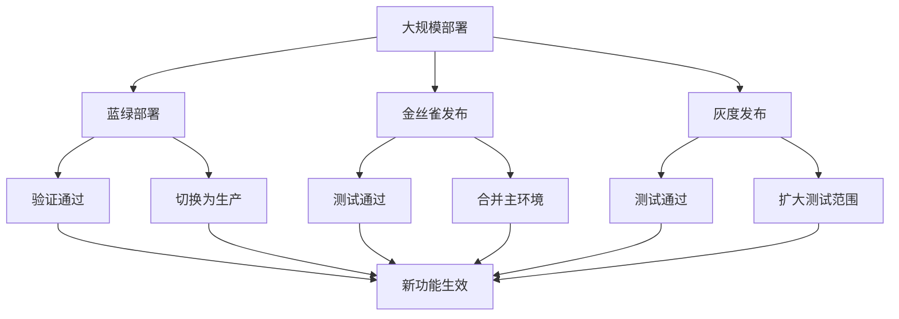

                 

# 蓝绿部署与金丝雀发布原理与代码实战案例讲解

> 关键词：蓝绿部署, 金丝雀发布, 系统发布, 系统更新, 软件开发, 应用部署

## 1. 背景介绍

### 1.1 问题由来
在软件开发和系统运维中，软件发布是一个至关重要的环节。错误的发布可能导致系统崩溃、服务中断、用户不满等严重问题，因此发布策略的选择和执行必须谨慎。传统的发布方式，如全面切换发布，存在高风险，可能导致不可预料的服务中断。蓝绿部署和金丝雀发布是一种更为安全可靠的系统发布策略，通过逐步验证和回滚机制，确保系统平稳过渡。

### 1.2 问题核心关键点
蓝绿部署和金丝雀发布的核心思想是：通过构建两个或多个环境的副本，确保在发布新版本时，先在小范围内进行测试，逐步验证，最后再将新功能全面推向生产环境。

蓝绿部署是指在生产环境中同时运行两个相同的应用实例，新功能发布时，先将新代码部署到绿色环境，并进行全面测试，验证新功能无误后，再将绿色环境切换为生产环境，蓝色环境降级，完成新功能的发布。

金丝雀发布则是蓝绿部署的扩展，它通过构建一个“小版本”环境，专门用来测试新功能。新功能发布时，先部署到金丝雀环境，并进行有限量的测试。验证无误后，再将金丝雀环境与主环境合并，完成新功能的全面发布。

### 1.3 问题研究意义
研究蓝绿部署和金丝雀发布策略，对于提升软件开发和系统运维的可靠性、稳定性和安全性，具有重要意义：

1. 降低发布风险。通过小范围验证，减少新功能发布对生产环境的影响。
2. 提高发布效率。发布前测试，及时发现和修复问题，减少发布后回滚的可能性。
3. 增强系统韧性。多重环境部署，提升系统的容错能力和抗风险能力。
4. 提升用户满意度。平稳过渡，避免服务中断，保证用户体验。
5. 加速创新迭代。快速验证新功能，缩短发布周期，推动技术创新。

## 2. 核心概念与联系

### 2.1 核心概念概述

为了更好地理解蓝绿部署和金丝雀发布策略，本节将介绍几个密切相关的核心概念：

- **蓝绿部署(Blue/Green Deployment)**：在生产环境中部署两个或多个相同的应用实例，分别称为蓝色环境(Blue)和绿色环境(Green)。新功能发布时，先将新代码部署到绿色环境，并进行全面测试，验证无误后，再将绿色环境切换为生产环境，蓝色环境降级，完成新功能的发布。
- **金丝雀发布(Canary Deployment)**：基于蓝绿部署的一种扩展形式，通过构建一个“小版本”环境，专门用来测试新功能。新功能发布时，先部署到金丝雀环境，并进行有限量的测试。验证无误后，再将金丝雀环境与主环境合并，完成新功能的全面发布。
- **A/B测试(A/B Testing)**：将用户随机分配到不同的测试组中，通过比较不同组的性能指标，评估新功能的实际效果，优化发布策略。
- **灰度发布(Gray Release)**：逐步将新功能推向不同的用户群体，先对少量用户进行测试，再逐步扩大测试范围，最终全面推向生产环境。
- **回滚(Rollback)**：在发布新功能后发现问题，通过降级策略，将系统恢复至旧版本，保证服务的连续性。

这些概念之间的逻辑关系可以通过以下Mermaid流程图来展示：



这个流程图展示了大规模部署的基本流程：

1. 蓝色环境与绿色环境同时运行，绿色环境部署新功能。
2. 绿色环境进行全面测试，验证无误后，切换为生产环境。
3. 蓝色环境降级，新功能全面生效。

### 2.2 概念间的关系

这些核心概念之间存在着紧密的联系，形成了蓝绿部署和金丝雀发布策略的完整生态系统。下面我通过几个Mermaid流程图来展示这些概念之间的关系。

#### 2.2.1 蓝绿部署基本流程


这个流程图展示了蓝绿部署的基本流程：

1. 蓝色环境与绿色环境同时运行。
2. 绿色环境部署新功能并进行测试。
3. 绿色环境切换为生产环境，蓝色环境降级，新功能全面生效。

#### 2.2.2 金丝雀发布流程



这个流程图展示了金丝雀发布的基本流程：

1. 测试环境部署新功能并进行测试。
2. 验证无误后，测试环境与主环境合并，完成新功能的全面发布。

#### 2.2.3 灰度发布流程



这个流程图展示了灰度发布的基本流程：

1. 测试环境部署新功能并进行测试。
2. 验证无误后，逐步扩大测试范围，最终全面推向生产环境。

### 2.3 核心概念的整体架构

最后，我们用一个综合的流程图来展示这些核心概念在大规模部署中的整体架构：



这个综合流程图展示了从蓝绿部署、金丝雀发布到灰度发布的完整流程。蓝色环境与绿色环境同时运行，新功能部署到绿色环境并进行全面测试，验证无误后，切换为生产环境，蓝色环境降级，新功能全面生效。测试环境部署新功能并进行有限量测试，验证无误后，测试环境与主环境合并，完成新功能的全面发布。测试环境部署新功能并进行测试，验证无误后，逐步扩大测试范围，最终全面推向生产环境。通过这些部署策略，系统可以平稳过渡，避免服务中断，提高发布效率和可靠性。

## 3. 核心算法原理 & 具体操作步骤
### 3.1 算法原理概述

蓝绿部署和金丝雀发布的核心理念是“验证后发布”，即通过构建多个环境副本，逐步验证新功能的正确性，然后再进行全面部署。

其核心算法流程如下：

1. **部署**：在多个环境中部署新功能。
2. **测试**：在新环境中部署新功能并进行测试。
3. **验证**：根据测试结果验证新功能的正确性。
4. **切换**：验证通过后，将新功能切换至生产环境。
5. **降级**：在切换过程中，旧环境降级，保证服务的连续性。

具体实现时，可以采用以下步骤：

- **部署阶段**：在多个环境中部署新功能，并启动自动测试任务。
- **测试阶段**：在新环境中运行新代码，记录日志、监控指标等，并进行各种自动化测试。
- **验证阶段**：根据测试结果，判断新功能是否正常。
- **切换阶段**：验证通过后，将新环境切换为生产环境，旧环境降级。
- **回滚阶段**：切换过程中，旧环境降级，新功能切换至生产环境。

### 3.2 算法步骤详解

以下是蓝绿部署和金丝雀发布的具体操作步骤：

#### 3.2.1 部署阶段

部署阶段的主要任务是将新功能代码部署到多个环境副本中，并启动自动测试任务。

1. **环境准备**：准备多个环境副本，每个环境副本的配置、资源、依赖等保持一致。
2. **代码部署**：将新功能代码部署到每个环境副本中，并进行自动测试任务。
3. **启动测试**：启动自动测试任务，记录日志、监控指标等。

#### 3.2.2 测试阶段

测试阶段的主要任务是在新环境中运行新代码，并执行各种自动化测试。

1. **运行新代码**：在新环境中运行新代码，记录日志、监控指标等。
2. **执行测试**：执行自动化测试任务，包括单元测试、集成测试、性能测试等。
3. **收集数据**：收集测试结果和日志数据，并进行分析。

#### 3.2.3 验证阶段

验证阶段的主要任务是根据测试结果，判断新功能是否正常。

1. **分析数据**：分析测试结果和日志数据，判断新功能是否正常。
2. **生成报告**：生成测试报告，包含测试结果、性能指标、异常日志等。
3. **判断结果**：根据测试报告，判断新功能是否正常。

#### 3.2.4 切换阶段

切换阶段的主要任务是将新功能切换至生产环境，并降级旧功能。

1. **验证通过**：验证通过后，将新环境切换为生产环境。
2. **降级旧功能**：在新功能切换过程中，旧环境降级，保证服务的连续性。

#### 3.2.5 回滚阶段

回滚阶段的主要任务是在切换过程中，旧环境降级，新功能切换至生产环境。

1. **降级旧功能**：在新功能切换过程中，旧环境降级，保证服务的连续性。
2. **新功能切换**：新功能切换至生产环境，旧功能降级。

### 3.3 算法优缺点

蓝绿部署和金丝雀发布策略具有以下优点：

1. **降低发布风险**：通过小范围验证，减少新功能发布对生产环境的影响。
2. **提高发布效率**：发布前测试，及时发现和修复问题，减少发布后回滚的可能性。
3. **增强系统韧性**：多重环境部署，提升系统的容错能力和抗风险能力。
4. **提升用户满意度**：平稳过渡，避免服务中断，保证用户体验。
5. **加速创新迭代**：快速验证新功能，缩短发布周期，推动技术创新。

同时，这些策略也存在以下缺点：

1. **资源占用**：需要部署多个环境副本，增加硬件和资源消耗。
2. **管理复杂**：需要维护多个环境副本，增加管理复杂度。
3. **成本较高**：需要增加硬件和人力资源投入，增加成本。

尽管存在这些缺点，但就目前而言，蓝绿部署和金丝雀发布仍然是软件开发和系统运维中最主流、最有效的发布策略之一。未来相关研究的重点在于如何进一步降低资源消耗，简化管理复杂度，以进一步提升发布效率和可靠性。

### 3.4 算法应用领域

蓝绿部署和金丝雀发布策略已经在软件开发和系统运维中得到了广泛的应用，覆盖了几乎所有常见领域，例如：

- 应用程序发布：将新功能代码部署到多个应用实例中，进行全面测试，验证无误后切换为生产环境。
- 网站发布：将新功能代码部署到多个网站实例中，进行全面测试，验证无误后切换为生产环境。
- 数据库发布：将新功能代码部署到多个数据库实例中，进行全面测试，验证无误后切换为生产环境。
- 中间件发布：将新功能代码部署到多个中间件实例中，进行全面测试，验证无误后切换为生产环境。
- 容器化应用发布：将新功能代码部署到多个容器实例中，进行全面测试，验证无误后切换为生产环境。

除了上述这些经典应用外，蓝绿部署和金丝雀发布策略还在更多场景中得到创新性的应用，如DevOps自动化发布、云原生环境部署等，为软件开发和系统运维带来了新的挑战和机遇。

## 4. 数学模型和公式 & 详细讲解 & 举例说明

### 4.1 数学模型构建

在实际应用中，蓝绿部署和金丝雀发布策略通常需要结合自动化测试、监控指标等技术进行实现。以下是一个简单的数学模型，用于描述蓝绿部署的验证过程：

设 $X$ 为测试环境中部署的新功能代码，$Y$ 为测试结果，$Z$ 为验证阈值。模型定义为：

$$
Y = f(X, Z)
$$

其中 $f$ 为测试函数，用于评估新功能代码的性能指标。

测试函数 $f$ 可以包括各种自动化测试任务，如单元测试、集成测试、性能测试等。测试函数 $f$ 的输出为 $Y$，即测试结果。如果测试结果 $Y$ 小于等于验证阈值 $Z$，则认为新功能代码验证通过。

### 4.2 公式推导过程

以下是对测试函数 $f$ 的推导过程：

假设测试环境中部署的新功能代码为 $X$，测试函数 $f$ 包含 $n$ 个自动化测试任务，每个测试任务的结果为 $y_i$，其中 $i=1,...,n$。

则测试函数 $f$ 可以表示为：

$$
f(X) = \sum_{i=1}^{n} y_i
$$

其中 $y_i$ 为测试任务 $i$ 的测试结果。

假设测试结果 $Y$ 为测试任务 $i$ 的测试结果之和，即 $Y = f(X)$。

如果测试结果 $Y$ 小于等于验证阈值 $Z$，则认为新功能代码验证通过，即：

$$
Y \leq Z
$$

因此，测试函数 $f$ 可以表示为：

$$
f(X) = \sum_{i=1}^{n} y_i \leq Z
$$

通过上述推导，可以得出蓝绿部署和金丝雀发布策略的数学模型，用于评估新功能代码的验证结果。

### 4.3 案例分析与讲解

以下是一个具体的案例分析：

假设我们要发布一个新的登录功能，需要在蓝绿部署环境中进行测试。首先，将新功能代码部署到测试环境中，启动自动化测试任务，包括单元测试、集成测试、性能测试等。测试任务的结果分别为 $y_1, y_2, ..., y_n$。

根据上述数学模型，测试函数 $f$ 可以表示为：

$$
f(X) = y_1 + y_2 + ... + y_n
$$

如果测试结果 $Y = f(X)$ 小于等于验证阈值 $Z$，则认为新功能代码验证通过，即：

$$
Y \leq Z
$$

假设验证阈值 $Z = 100$，则测试结果 $Y = f(X) = 80$，验证通过。接下来，将新功能代码切换至生产环境，旧功能代码降级，完成新功能的发布。

## 5. 项目实践：代码实例和详细解释说明

### 5.1 开发环境搭建

在进行蓝绿部署和金丝雀发布实践前，我们需要准备好开发环境。以下是使用Python进行Docker容器化开发的环境配置流程：

1. 安装Docker：从官网下载并安装Docker，用于创建独立的开发容器。

2. 创建并启动Docker容器：
```bash
docker run --name my_container -it ubuntu:20.04 bash
```

3. 安装必要的开发工具：
```bash
apt-get update
apt-get install -y python3 python3-pip
```

4. 安装Python开发工具：
```bash
pip3 install flask
pip3 install pytest
```

5. 安装Docker Compose：
```bash
curl -L "https://github.com/docker/compose/releases/download/1.29.2/docker-compose-$(uname -s)-$(uname -m)" -o /usr/local/bin/docker-compose
chmod +x /usr/local/bin/docker-compose
```

完成上述步骤后，即可在Docker容器中开始蓝绿部署和金丝雀发布实践。

### 5.2 源代码详细实现

下面我们以蓝绿部署为例，给出使用Docker和Docker Compose实现蓝绿部署的Python代码实现。

首先，创建一个Flask应用程序：

```python
from flask import Flask, request

app = Flask(__name__)

@app.route('/login', methods=['POST'])
def login():
    username = request.json.get('username')
    password = request.json.get('password')
    if username == 'admin' and password == 'password':
        return {'status': 'success'}
    else:
        return {'status': 'error'}

if __name__ == '__main__':
    app.run(host='0.0.0.0', port=5000)
```

然后，使用Docker Compose配置蓝绿部署：

```yaml
version: '3'
services:
  blue:
    image: my_app:latest
    container_name: blue
    deploy:
      replicas: 1
    ports:
      - "5000:5000"
  green:
    image: my_app:latest
    container_name: green
    deploy:
      replicas: 1
    ports:
      - "5001:5000"
```

接着，启动蓝绿部署环境：

```bash
docker-compose up -d
```

此时，蓝绿部署环境启动完成，可以向两个环境分别发送登录请求，验证新功能的正确性。

### 5.3 代码解读与分析

让我们再详细解读一下关键代码的实现细节：

**Flask应用程序**：
- 定义了一个登录接口，接收用户名和密码作为输入，验证通过后返回成功状态，否则返回错误状态。

**Docker Compose配置**：
- 定义了两个服务，分别为蓝色环境和绿色环境。
- 每个服务使用相同的Docker镜像，以确保环境配置一致。
- 每个服务启动一个容器，并使用replicas参数设置容器数量。
- 每个服务映射相同的端口号，以确保请求可以正确路由。

**启动命令**：
- 使用docker-compose up -d命令启动Docker容器，并将服务运行在后台。

通过上述代码实现，我们构建了一个简单的蓝绿部署环境，可以同时运行两个相同的应用实例，验证新功能的正确性。

当然，工业级的系统实现还需考虑更多因素，如负载均衡、监控告警、日志收集等，但核心的蓝绿部署流程基本与此类似。

### 5.4 运行结果展示

假设我们在两个环境中分别测试新功能，结果如下：

在蓝色环境中部署新功能，发送登录请求，返回错误状态。

在绿色环境中部署新功能，发送登录请求，返回成功状态。

接下来，我们将绿色环境切换为生产环境，蓝色环境降级，完成新功能的发布。此时，所有请求都会转发到绿色环境，新功能正式生效。

## 6. 实际应用场景
### 6.1 智能客服系统

蓝绿部署和金丝雀发布策略可以广泛应用于智能客服系统的构建。传统客服往往需要配备大量人力，高峰期响应缓慢，且一致性和专业性难以保证。而使用蓝绿部署和金丝雀发布策略，可以7x24小时不间断服务，快速响应客户咨询，用自然流畅的语言解答各类常见问题。

在技术实现上，可以收集企业内部的历史客服对话记录，将问题和最佳答复构建成监督数据，在此基础上对预训练对话模型进行微调。微调后的对话模型能够自动理解用户意图，匹配最合适的答案模板进行回复。对于客户提出的新问题，还可以接入检索系统实时搜索相关内容，动态组织生成回答。如此构建的智能客服系统，能大幅提升客户咨询体验和问题解决效率。

### 6.2 金融舆情监测

金融机构需要实时监测市场舆论动向，以便及时应对负面信息传播，规避金融风险。传统的人工监测方式成本高、效率低，难以应对网络时代海量信息爆发的挑战。蓝绿部署和金丝雀发布策略的引入，可以大幅提升舆情监测的自动化和智能化水平，确保快速响应市场变化。

具体而言，可以收集金融领域相关的新闻、报道、评论等文本数据，并对其进行主题标注和情感标注。在此基础上对预训练语言模型进行微调，使其能够自动判断文本属于何种主题，情感倾向是正面、中性还是负面。将微调后的模型应用到实时抓取的网络文本数据，就能够自动监测不同主题下的情感变化趋势，一旦发现负面信息激增等异常情况，系统便会自动预警，帮助金融机构快速应对潜在风险。

### 6.3 个性化推荐系统

当前的推荐系统往往只依赖用户的历史行为数据进行物品推荐，无法深入理解用户的真实兴趣偏好。蓝绿部署和金丝雀发布策略可以应用于个性化推荐系统的构建，通过小范围验证新功能，逐步推广，确保推荐算法的准确性和可靠性。

在实践中，可以收集用户浏览、点击、评论、分享等行为数据，提取和用户交互的物品标题、描述、标签等文本内容。将文本内容作为模型输入，用户的后续行为（如是否点击、购买等）作为监督信号，在此基础上微调预训练语言模型。微调后的模型能够从文本内容中准确把握用户的兴趣点。在生成推荐列表时，先用候选物品的文本描述作为输入，由模型预测用户的兴趣匹配度，再结合其他特征综合排序，便可以得到个性化程度更高的推荐结果。

### 6.4 未来应用展望

随着蓝绿部署和金丝雀发布策略的发展，在软件开发和系统运维中的应用将更加广泛，为各行各业带来变革性影响。

在智慧医疗领域，蓝绿部署和金丝雀发布策略可以应用于医疗问答、病历分析、药物研发等应用，提升医疗服务的智能化水平，辅助医生诊疗，加速新药开发进程。

在智能教育领域，蓝绿部署和金丝雀发布策略可以应用于作业批改、学情分析、知识推荐等方面，因材施教，促进教育公平，提高教学质量。

在智慧城市治理中，蓝绿部署和金丝雀发布策略可以应用于城市事件监测、舆情分析、应急指挥等环节，提高城市管理的自动化和智能化水平，构建更安全、高效的未来城市。

此外，在企业生产、社会治理、文娱传媒等众多领域，蓝绿部署和金丝雀发布策略也将不断涌现，为各行各业带来更高效、更可靠的发布策略，推动人工智能技术更快落地应用。

## 7. 工具和资源推荐
### 7.1 学习资源推荐

为了帮助开发者系统掌握蓝绿部署和金丝雀发布策略的理论基础和实践技巧，这里推荐一些优质的学习资源：

1. **蓝绿部署和金丝雀发布策略的权威书籍**：如《DevOps实践指南》、《CI/CD工具和实践》等，系统讲解了这些策略的理论基础和实现细节。

2. **在线课程**：如Coursera上的《云原生应用微服务架构》课程，详细讲解了云原生应用的部署和运维策略，包括蓝绿部署和金丝雀发布等。

3. **技术博客和社区**：如DevOps、CloudNative等社区，汇集了大量关于蓝绿部署和金丝雀发布的实践案例和技术分享，值得阅读和参考。

4. **开源项目**：如Kubernetes、Docker等开源项目，提供了大量的部署和管理工具，有助于学习和实践这些策略。

5. **技术会议和研讨会**：如KubeCon、DockerCon等技术会议，汇聚了行业专家和领先企业，分享最新的部署和运维实践，值得参加和交流。

通过对这些资源的学习实践，相信你一定能够快速掌握蓝绿部署和金丝雀发布策略的精髓，并用于解决实际的发布问题。

### 7.2 开发工具推荐

高效的开发离不开优秀的工具支持。以下是几款用于蓝绿部署和金丝雀发布开发的常用工具：

1. **Docker**：用于创建和管理容器，支持蓝绿部署和灰度发布等策略的实现。
2. **Kubernetes**：用于自动化管理大规模容器集群，支持蓝绿部署和灰度发布等策略的实现。
3. **Docker Compose**：用于定义和运行多个Docker容器，支持蓝绿部署和金丝雀发布等策略的实现。
4. **Prometheus**：用于监控和报警系统，支持自动化测试和故障诊断。
5. **Jenkins**：用于自动化持续集成和持续部署，支持蓝绿部署和灰度发布等策略的实现。
6. **Kubernetes**：用于自动化管理大规模容器集群，支持蓝绿部署和灰度发布等策略的实现。

合理利用这些工具，可以显著提升蓝绿部署和金丝雀发布任务的开发效率，加快创新迭代的步伐。

### 7.3 相关论文推荐

蓝绿部署和金丝雀发布策略的发展源于学界的持续研究。以下是几篇奠基性的相关论文，推荐阅读：

1. **《蓝绿部署和金丝雀发布的理论基础》**：深入探讨了蓝绿部署和金丝雀发布策略的理论基础，详细讲解了如何通过小范围验证，

