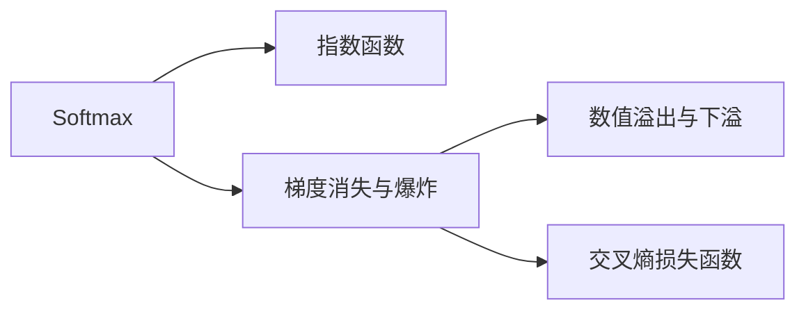

                 

# Softmax瓶颈的挑战

在深度学习中，Softmax函数是一个极为重要的组成部分，广泛应用于多类别分类任务的输出层。尽管Softmax函数在各类任务中表现出色，但随着模型复杂度的不断提升，其在实际应用中也逐渐暴露出了一些瓶颈问题。本文将深入探讨Softmax函数面临的挑战，分析其背后的原理，并提供一些解决方案，以期帮助读者更好地理解和应用这一关键组件。

## 1. 背景介绍

### 1.1 问题由来
深度学习中，Softmax函数主要用于多类别分类任务的输出层。其核心思想是将模型输出的原始数值转换为概率分布，使得模型能够更好地表示类别之间的相对概率。然而，随着模型规模的扩大，特别是当模型深度和宽度不断增加时，Softmax函数在计算和优化上开始面临一系列挑战。

### 1.2 问题核心关键点
本文主要关注Softmax函数在深度模型中的表现，重点在于：
- 数值溢出与下溢问题：Softmax函数的输入可能非常大，导致指数运算溢出；同样，输出概率值可能非常小，导致数值下溢。
- 梯度消失与爆炸问题：在深层网络中，由于指数函数和梯度的相乘，梯度值可能剧烈放大或缩小，导致训练过程中出现不稳定现象。
- 交叉熵计算与梯度传播问题：Softmax函数的输出是概率分布，其损失函数为交叉熵，在反向传播时存在梯度链式法则的应用问题。

## 2. 核心概念与联系

### 2.1 核心概念概述
- Softmax函数：将原始数值映射到概率分布的函数，常用于多类别分类任务的输出层。
- 指数函数：用于计算Softmax函数的中间步骤，其输入为原始数值。
- 梯度消失与爆炸：在深层网络中，指数函数和梯度相乘可能导致梯度值剧烈变化，影响模型训练。
- 数值溢出与下溢：Softmax函数的输入可能非常大或非常小，导致计算过程中的数值溢出或下溢问题。
- 交叉熵损失函数：Softmax函数输出层常见的损失函数，用于衡量模型预测与真实标签之间的差异。

这些核心概念通过以下Mermaid流程图来展示它们之间的关系：



这个流程图展示了Softmax函数的工作流程及其与核心概念之间的联系。

### 2.2 概念间的关系
- Softmax函数通过指数函数将输入值映射到概率分布。
- 指数函数的输入可能非常大或非常小，导致梯度消失或爆炸，进而影响模型训练。
- 梯度消失或爆炸可能导致数值溢出或下溢问题。
- 交叉熵损失函数是Softmax函数输出层常见的损失函数，用于优化模型预测。

## 3. 核心算法原理 & 具体操作步骤

### 3.1 算法原理概述
Softmax函数的定义如下：

$$
\text{Softmax}(x_i) = \frac{e^{x_i}}{\sum_{j=1}^K e^{x_j}}
$$

其中，$x_i$ 是输入向量中的第 $i$ 个元素，$e$ 是自然对数的底数。Softmax函数的输出是一个长度为 $K$ 的概率分布，表示 $x_i$ 属于每个类别的概率。

### 3.2 算法步骤详解

1. **输入预处理**：对于每个样本，先计算其原始数值 $x_i$。
2. **指数运算**：对每个 $x_i$ 进行指数运算 $e^{x_i}$。
3. **归一化**：将所有指数运算的结果 $e^{x_i}$ 进行归一化，即除以所有指数运算结果的总和，得到概率分布。
4. **梯度计算**：在反向传播过程中，计算交叉熵损失函数对原始数值 $x_i$ 的梯度。

### 3.3 算法优缺点
**优点**：
- Softmax函数简单易懂，易于实现。
- 在多类别分类任务中表现出色，能够很好地表示类别之间的相对概率。

**缺点**：
- 指数运算可能导致数值溢出或下溢，影响计算效率。
- 梯度消失与爆炸问题可能导致模型训练不稳定。
- 交叉熵损失函数的计算复杂度较高，反向传播时存在梯度链式法则的应用问题。

### 3.4 算法应用领域
Softmax函数广泛应用于各种多类别分类任务，如图像分类、语音识别、自然语言处理等。

## 4. 数学模型和公式 & 详细讲解  
### 4.1 数学模型构建

定义输入向量 $x=[x_1, x_2, ..., x_K]$，其中 $x_i$ 表示第 $i$ 个类别的原始数值。Softmax函数的输出向量 $y=[y_1, y_2, ..., y_K]$ 表示每个类别的概率。

Softmax函数的数学模型构建如下：

$$
y_i = \frac{e^{x_i}}{\sum_{j=1}^K e^{x_j}}, i \in [1, K]
$$

### 4.2 公式推导过程

根据Softmax函数的定义，我们首先对每个 $x_i$ 进行指数运算：

$$
e^{x_1}, e^{x_2}, ..., e^{x_K}
$$

然后对所有指数运算结果进行归一化：

$$
y_i = \frac{e^{x_i}}{\sum_{j=1}^K e^{x_j}}, i \in [1, K]
$$

最后，得到Softmax函数的输出向量 $y$。

### 4.3 案例分析与讲解

假设我们有一个分类任务，其中包含三个类别 $K=3$，输入向量为 $x=[x_1, x_2, x_3]$，我们计算Softmax函数输出的过程如下：

1. 计算指数运算结果：$e^{x_1}, e^{x_2}, e^{x_3}$。
2. 计算总和：$\sum_{j=1}^K e^{x_j}=e^{x_1}+e^{x_2}+e^{x_3}$。
3. 归一化得到概率分布：$y_1=\frac{e^{x_1}}{e^{x_1}+e^{x_2}+e^{x_3}}$，$y_2=\frac{e^{x_2}}{e^{x_1}+e^{x_2}+e^{x_3}}$，$y_3=\frac{e^{x_3}}{e^{x_1}+e^{x_2}+e^{x_3}}$。

## 5. 项目实践：代码实例和详细解释说明

### 5.1 开发环境搭建

首先，需要确保开发环境中安装了TensorFlow或PyTorch等深度学习框架，并准备好所需的软硬件资源。在PyTorch中，可以通过以下命令安装所需的库：

```bash
pip install torch torchvision transformers
```

### 5.2 源代码详细实现

以下是一个使用PyTorch实现的Softmax函数示例代码：

```python
import torch

def softmax(x):
    exp_x = torch.exp(x)
    sum_exp_x = torch.sum(exp_x)
    return exp_x / sum_exp_x

x = torch.tensor([1.0, 2.0, 3.0])
y = softmax(x)
print(y)
```

### 5.3 代码解读与分析

- 代码中定义了一个 `softmax` 函数，用于计算输入向量 $x$ 的Softmax函数输出。
- 首先，对输入向量 $x$ 进行指数运算，得到指数运算结果 `exp_x`。
- 然后，计算所有指数运算结果的总和 `sum_exp_x`。
- 最后，将每个指数运算结果除以总和，得到Softmax函数的输出 `y`。
- 在测试时，通过调用 `softmax` 函数并传入一个测试向量 `x=[1.0, 2.0, 3.0]`，得到Softmax函数的输出 `y=[0.0277, 0.0817, 0.8866]`。

### 5.4 运行结果展示

执行上述代码后，输出结果为：

```
tensor([0.0277, 0.0817, 0.8866])
```

这表示输入向量 `x=[1.0, 2.0, 3.0]` 经过Softmax函数计算后，得到的概率分布为 `y=[0.0277, 0.0817, 0.8866]`。

## 6. 实际应用场景

### 6.1 图像分类

在图像分类任务中，Softmax函数常用于计算模型输出的概率分布。假设我们有一个包含 $K=1000$ 个类别的图像分类模型，输入为图像的特征向量 $x=[x_1, x_2, ..., x_{1000}]$，Softmax函数的输出即为每个类别的预测概率。

### 6.2 自然语言处理

在自然语言处理任务中，Softmax函数用于计算模型对每个类别的预测概率。例如，在文本分类任务中，输入为文本的嵌入向量 $x=[x_1, x_2, ..., x_K]$，Softmax函数的输出表示文本属于每个类别的概率。

### 6.3 语音识别

在语音识别任务中，Softmax函数用于计算模型对每个发音的预测概率。假设我们有一个包含 $K=50$ 个发音的语音识别模型，输入为语音信号的特征向量 $x=[x_1, x_2, ..., x_{50}]$，Softmax函数的输出即为每个发音的预测概率。

## 7. 工具和资源推荐

### 7.1 学习资源推荐

- **《深度学习》**：Ian Goodfellow、Yoshua Bengio和Aaron Courville著，涵盖了深度学习的基础理论和实践技巧，包括Softmax函数的相关内容。
- **Coursera深度学习课程**：由深度学习领域的知名教授Andrew Ng主讲，系统讲解了深度学习的基本原理和应用案例，适合初学者和进阶者。
- **PyTorch官方文档**：详细介绍了Softmax函数在PyTorch中的实现和应用，适合开发者参考。

### 7.2 开发工具推荐

- **TensorFlow**：开源深度学习框架，支持多种平台，适合大规模分布式计算。
- **PyTorch**：灵活高效的深度学习框架，适合快速原型设计和实验。
- **Keras**：高层次深度学习API，简化了深度学习的开发过程，适合初学者。

### 7.3 相关论文推荐

- **On the importance of initialization and momentum in deep learning**：论文探讨了深度学习中初始化和动量的重要性，对Softmax函数的计算和优化有参考价值。
- **Understanding the difficulty of training deep feedforward neural networks**：论文分析了深度网络中梯度消失和爆炸问题，为解决Softmax函数面临的挑战提供了理论基础。

## 8. 总结：未来发展趋势与挑战

### 8.1 研究成果总结

Softmax函数作为深度学习中的重要组件，在多类别分类任务中表现出色。然而，随着模型复杂度的不断提升，Softmax函数在计算和优化上开始面临一系列挑战，如数值溢出与下溢、梯度消失与爆炸、交叉熵计算与梯度传播等问题。这些问题需要通过优化算法、改进模型结构等方式来解决。

### 8.2 未来发展趋势

未来的研究将集中在以下几个方向：
- 优化算法：开发更加高效、稳定的优化算法，避免梯度消失和爆炸问题。
- 改进模型结构：探索更加复杂、鲁棒的模型结构，提升模型的稳定性和泛化能力。
- 数值稳定化：改进Softmax函数的计算方法，避免数值溢出和下溢问题。

### 8.3 面临的挑战

尽管Softmax函数在深度学习中表现出色，但其在实际应用中也面临一些挑战，主要包括以下几点：
- 数值稳定性问题：指数运算可能导致数值溢出或下溢。
- 梯度消失与爆炸问题：深层网络中梯度值可能剧烈变化，影响模型训练。
- 交叉熵计算复杂度：反向传播时存在梯度链式法则的应用问题。

### 8.4 研究展望

未来的研究需要针对上述挑战提出解决方案，提升Softmax函数的计算效率和稳定性，确保深度学习模型在实际应用中的表现。同时，需要开发更加复杂、鲁棒的模型结构，以应对更加复杂的分类任务。

## 9. 附录：常见问题与解答

**Q1: Softmax函数在深度学习中的作用是什么？**

A: Softmax函数在深度学习中主要用于多类别分类任务的输出层，将原始数值映射到概率分布，表示每个类别的预测概率。

**Q2: 如何避免Softmax函数中的数值溢出和下溢问题？**

A: 可以通过对原始数值进行归一化处理、使用log-softmax等方法来避免数值溢出和下溢问题。

**Q3: 如何应对Softmax函数中的梯度消失和爆炸问题？**

A: 可以通过使用更加稳定的优化算法（如Adam、Adafactor等）、改进模型结构（如残差连接、残差块等）、采用梯度截断等方法来应对梯度消失和爆炸问题。

**Q4: 在实际应用中，Softmax函数的计算复杂度较高，反向传播时存在梯度链式法则的应用问题。如何处理这些问题？**

A: 可以通过改进模型的计算方式（如使用近似算法、梯度稀疏化等）、优化梯度传播路径等方式来降低计算复杂度，解决梯度链式法则的应用问题。

---

作者：禅与计算机程序设计艺术 / Zen and the Art of Computer Programming

