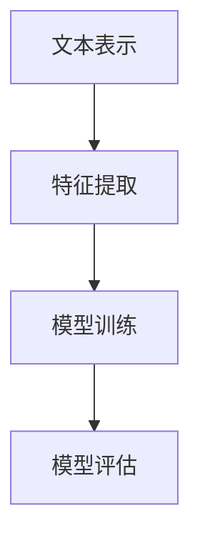
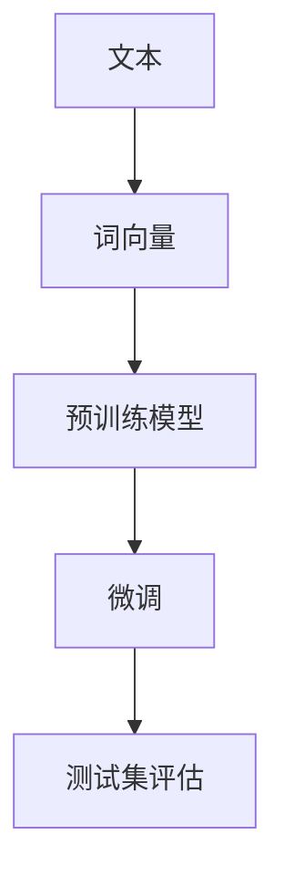
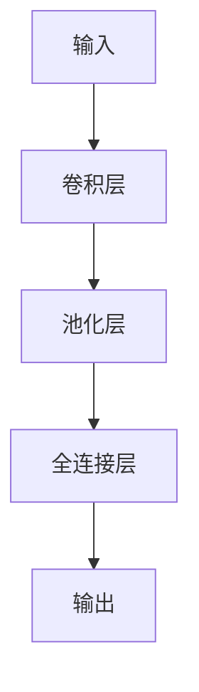
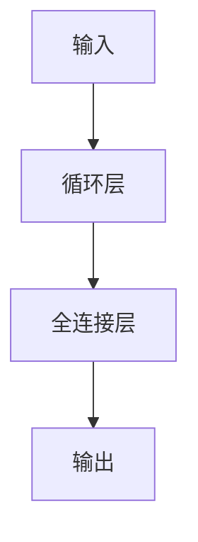

                 

# Text Classification原理与代码实例讲解

> 关键词：Text Classification, Natural Language Processing (NLP), Machine Learning, Deep Learning, Convolutional Neural Networks (CNN), Recurrent Neural Networks (RNN), Long Short-Term Memory (LSTM), Transformers, PyTorch

## 1. 背景介绍

文本分类（Text Classification）是大数据时代中NLP领域的一个经典任务。通过文本分类，可以自动将文本划分为预定义的若干类别，如垃圾邮件识别、情感分析、新闻分类等。传统的文本分类方法多依赖于手工设计的特征，难以自动地从文本中提取有效的语义信息。而近年来，深度学习技术在文本分类任务上取得了突破，基于神经网络的文本分类方法在准确率和泛化能力上远超传统机器学习方法。本文将详细介绍文本分类的原理，并结合代码实例讲解其实现方法。

## 2. 核心概念与联系

### 2.1 核心概念概述

文本分类涉及以下核心概念：

- **文本表示**：将文本转换为机器可以理解的形式，如词袋模型、TF-IDF、词向量等。
- **特征提取**：从文本表示中提取出有意义的特征，如n-gram、句法结构等。
- **模型训练**：使用机器学习或深度学习方法训练文本分类模型，如决策树、SVM、神经网络等。
- **模型评估**：使用验证集或测试集评估模型的性能，如准确率、召回率、F1分数等。

### 2.2 核心概念的关系

这些核心概念之间存在紧密的联系，构成了文本分类的完整流程。如图2-1所示：



- 文本表示是将原始文本转换为数值形式，为后续处理提供基础。
- 特征提取则从文本表示中提取出有意义的特征，增强模型的分类能力。
- 模型训练通过学习特征与类别之间的映射关系，实现对文本的分类。
- 模型评估则通过验证集或测试集，评估模型在不同数据集上的泛化能力。

### 2.3 核心概念的整体架构

大语言模型微调的监督学习

通过大语言模型进行文本分类，核心架构如图2-2所示：



- 文本首先被转换为词向量，通过预训练模型（如BERT、GPT等）提取语义信息。
- 微调模型则使用小规模标注数据，优化预训练模型的参数，使其适应具体的文本分类任务。
- 最终在测试集上评估微调后模型的性能，完成文本分类任务。

## 3. 核心算法原理 & 具体操作步骤

### 3.1 算法原理概述

文本分类基于监督学习的思想，使用带有标签的训练数据训练分类模型。给定训练集 $D=\{(x_i,y_i)\}_{i=1}^N$，其中 $x_i$ 为文本，$y_i$ 为标签，目标是从中找到最优的模型参数 $\theta$，使得模型在测试集上的分类误差最小。

在实践中，我们通常使用神经网络作为文本分类的模型。常用的神经网络模型包括卷积神经网络（CNN）、循环神经网络（RNN）、长短期记忆网络（LSTM）、Transformer等。这里以CNN和RNN为例，介绍文本分类的基本流程。

### 3.2 算法步骤详解

#### 3.2.1 数据预处理

文本分类任务的数据预处理包括以下步骤：

- 分词：将文本切分成单个词语或子词。
- 停用词过滤：去除常见的停用词，如"的"、"是"等。
- 词向量化：将每个词语转换为向量形式，如使用词袋模型、TF-IDF、词向量等。
- 序列填充：将文本序列填充到统一长度，便于模型处理。

#### 3.2.2 模型构建

使用神经网络进行文本分类，通常需要定义输入层、隐藏层和输出层。以下是两种常用的神经网络模型：

**卷积神经网络（CNN）**

CNN模型由卷积层、池化层和全连接层组成，如图3-1所示：



卷积层使用卷积核提取文本中的局部特征，池化层则降低特征维度，全连接层将特征映射到类别空间。CNN模型具有平移不变性和局部连接的特点，适用于文本分类任务。

**循环神经网络（RNN）**

RNN模型由循环层和全连接层组成，如图3-2所示：



RNN模型通过循环层捕捉文本的序列信息，适用于处理变长序列数据。其中，长短期记忆网络（LSTM）是一种改进的RNN模型，可以更好地处理长序列数据。

#### 3.2.3 模型训练

模型训练通常使用梯度下降算法，优化目标函数，使模型参数 $\theta$ 不断逼近最优解。常见的目标函数包括交叉熵损失函数、均方误差损失函数等。以交叉熵损失函数为例，其公式如下：

$$
J(\theta) = -\frac{1}{N}\sum_{i=1}^N \sum_{j=1}^C y_{ij}\log\sigma(z_{ij})
$$

其中 $y_{ij}$ 为真实标签，$z_{ij} = W_{ij}x_i + b_{ij}$ 为模型的预测值，$\sigma$ 为激活函数，如sigmoid函数。

#### 3.2.4 模型评估

模型评估通常使用准确率、召回率、F1分数等指标，对模型在不同数据集上的性能进行评估。常见评估方法包括混淆矩阵、ROC曲线等。

## 4. 数学模型和公式 & 详细讲解

### 4.1 数学模型构建

文本分类模型的数学模型构建包括以下步骤：

- 定义输入 $x$ 和标签 $y$。
- 定义神经网络模型 $f$。
- 定义损失函数 $J$。
- 定义优化算法 $E$。

以CNN模型为例，数学模型构建过程如下：

1. 输入层：定义输入文本 $x = \{x_1, x_2, \cdots, x_m\}$，其中 $x_i$ 为文本的第 $i$ 个词语向量。
2. 卷积层：使用多个卷积核 $k_1, k_2, \cdots, k_n$，提取文本中的局部特征，得到卷积特征 $c_1, c_2, \cdots, c_n$。
3. 池化层：对卷积特征进行池化，降低特征维度，得到池化特征 $p_1, p_2, \cdots, p_n$。
4. 全连接层：将池化特征连接，输入全连接层，得到输出 $z$。
5. 输出层：定义输出类别数 $C$，使用softmax函数将输出 $z$ 转换为类别概率分布 $y$。
6. 损失函数：定义交叉熵损失函数 $J$，计算模型预测值与真实标签之间的差异。
7. 优化算法：定义随机梯度下降算法 $E$，优化模型参数。

### 4.2 公式推导过程

以CNN模型为例，其公式推导过程如下：

1. 卷积特征 $c_k$ 的计算公式：
$$
c_k = \sigma(W_kx + b_k)
$$
其中 $\sigma$ 为激活函数，$W_k$ 为卷积核，$b_k$ 为偏置项。

2. 池化特征 $p_k$ 的计算公式：
$$
p_k = \max(\frac{1}{w} \sum_{i=0}^{w-1} c_k[i:i+w-1])
$$
其中 $w$ 为池化窗口大小。

3. 输出 $z$ 的计算公式：
$$
z = \sigma(Wz + b)
$$
其中 $W$ 为全连接层权重，$b$ 为偏置项。

4. 预测值 $y$ 的计算公式：
$$
y = softmax(z)
$$
其中 softmax函数将输出 $z$ 转换为类别概率分布 $y$。

5. 交叉熵损失函数 $J$ 的计算公式：
$$
J = -\frac{1}{N}\sum_{i=1}^N \sum_{j=1}^C y_{ij}\log\sigma(z_{ij})
$$
其中 $y_{ij}$ 为真实标签，$z_{ij} = W_{ij}x_i + b_{ij}$ 为模型的预测值，$\sigma$ 为激活函数。

### 4.3 案例分析与讲解

以下是一个基于PyTorch实现的CNN文本分类代码示例，用于对IMDB电影评论数据集进行二分类：

```python
import torch
import torch.nn as nn
import torch.optim as optim
from torchtext.datasets import IMDB
from torchtext.data import Field, BucketIterator

# 定义数据处理 pipeline
TEXT = Field(tokenize='spacy', lower=True, batch_first=True)
LABEL = Field(sequential=False, use_vocab=False)

# 加载数据集
train_data, test_data = IMDB.splits(TEXT, LABEL)

# 划分训练集、验证集和测试集
train_data, valid_data = train_data.split(valid_pct=0.1)
train_data, test_data = train_data.split(test_pct=0.1)

# 构建迭代器
train_iterator, valid_iterator, test_iterator = BucketIterator.splits(
    (train_data, valid_data, test_data),
    sort_within_batch=True,
    device='cuda')

# 定义模型
class CNN(nn.Module):
    def __init__(self, vocab_size, emb_dim, hidden_dim, dropout, n_class):
        super(CNN, self).__init__()
        self.embedding = nn.Embedding(vocab_size, emb_dim)
        self.conv1 = nn.Conv1d(emb_dim, hidden_dim, kernel_size=3)
        self.conv2 = nn.Conv1d(emb_dim, hidden_dim, kernel_size=3)
        self.dropout = nn.Dropout(dropout)
        self.fc1 = nn.Linear(hidden_dim, 100)
        self.fc2 = nn.Linear(100, n_class)
        self.sigmoid = nn.Sigmoid()

    def forward(self, x):
        x = self.embedding(x)
        x = x.permute(0, 2, 1)
        x = self.conv1(x)
        x = nn.functional.relu(x)
        x = nn.functional.max_pool1d(x, 2)
        x = self.conv2(x)
        x = nn.functional.relu(x)
        x = nn.functional.max_pool1d(x, 2)
        x = x[:, :, -4:]
        x = x.view(x.size(0), -1)
        x = self.dropout(x)
        x = self.fc1(x)
        x = nn.functional.relu(x)
        x = self.fc2(x)
        x = self.sigmoid(x)
        return x

# 初始化模型和优化器
model = CNN(len(TEXT.vocab), 100, 100, 0.5, 1)
optimizer = optim.Adam(model.parameters(), lr=0.001)
criterion = nn.BCELoss()

# 训练模型
def train(model, iterator, optimizer, criterion):
    epoch_loss = 0
    epoch_acc = 0
    model.train()
    for batch in iterator:
        optimizer.zero_grad()
        predictions = model(batch.text).squeeze(1)
        loss = criterion(predictions, batch.label)
        acc = binary_accuracy(predictions, batch.label)
        loss.backward()
        optimizer.step()
        epoch_loss += loss.item()
        epoch_acc += acc.item()
    return epoch_loss / len(iterator), epoch_acc / len(iterator)

# 评估模型
def evaluate(model, iterator, criterion):
    epoch_loss = 0
    epoch_acc = 0
    model.eval()
    with torch.no_grad():
        for batch in iterator:
            predictions = model(batch.text).squeeze(1)
            loss = criterion(predictions, batch.label)
            acc = binary_accuracy(predictions, batch.label)
            epoch_loss += loss.item()
            epoch_acc += acc.item()
    return epoch_loss / len(iterator), epoch_acc / len(iterator)

# 运行训练和评估
N_EPOCHS = 5
model = CNN(len(TEXT.vocab), 100, 100, 0.5, 1)
optimizer = optim.Adam(model.parameters(), lr=0.001)
criterion = nn.BCELoss()

for epoch in range(N_EPOCHS):
    train_loss, train_acc = train(model, train_iterator, optimizer, criterion)
    val_loss, val_acc = evaluate(model, valid_iterator, criterion)
    print(f'Epoch: {epoch+1:02}, Train Loss: {train_loss:.3f}, Train Acc: {train_acc*100:.2f}, Val Loss: {val_loss:.3f}, Val Acc: {val_acc*100:.2f}')
```

## 5. 项目实践：代码实例和详细解释说明

### 5.1 开发环境搭建

在文本分类项目中，主要使用到的开发环境如下：

- **Python**：版本 3.7+，推荐使用 Anaconda 或 Miniconda 环境。
- **PyTorch**：版本 1.6+，用于深度学习模型的实现。
- **Tensorboard**：用于可视化模型训练过程。
- **Git**：版本 2.9+，用于版本控制和代码管理。
- **Jupyter Notebook**：用于编写和运行代码，支持代码块的交互式执行。

以下是在Python 3.7环境下搭建PyTorch开发环境的示例代码：

```bash
# 安装Anaconda或Miniconda
# 创建虚拟环境
conda create -n myenv python=3.7
conda activate myenv

# 安装PyTorch
pip install torch torchvision torchaudio

# 安装Tensorboard
pip install tensorboard

# 安装Jupyter Notebook
conda install jupyterlab
```

### 5.2 源代码详细实现

以下是一个完整的文本分类项目示例，包括数据处理、模型训练和评估。

**1. 数据准备**

首先，需要准备数据集。在本例中，使用IMDB电影评论数据集，包含50,000条带有正面或负面情感标签的评论。

```python
from torchtext.datasets import IMDB
from torchtext.data import Field, BucketIterator

TEXT = Field(tokenize='spacy', lower=True, batch_first=True)
LABEL = Field(sequential=False, use_vocab=False)

train_data, test_data = IMDB.splits(TEXT, LABEL)

train_data, valid_data = train_data.split(valid_pct=0.1)
train_data, test_data = train_data.split(test_pct=0.1)

train_iterator, valid_iterator, test_iterator = BucketIterator.splits(
    (train_data, valid_data, test_data),
    sort_within_batch=True,
    device='cuda')
```

**2. 模型构建**

定义一个简单的CNN模型，包括嵌入层、卷积层和全连接层。

```python
class CNN(nn.Module):
    def __init__(self, vocab_size, emb_dim, hidden_dim, dropout, n_class):
        super(CNN, self).__init__()
        self.embedding = nn.Embedding(vocab_size, emb_dim)
        self.conv1 = nn.Conv1d(emb_dim, hidden_dim, kernel_size=3)
        self.conv2 = nn.Conv1d(emb_dim, hidden_dim, kernel_size=3)
        self.dropout = nn.Dropout(dropout)
        self.fc1 = nn.Linear(hidden_dim, 100)
        self.fc2 = nn.Linear(100, n_class)
        self.sigmoid = nn.Sigmoid()

    def forward(self, x):
        x = self.embedding(x)
        x = x.permute(0, 2, 1)
        x = self.conv1(x)
        x = nn.functional.relu(x)
        x = nn.functional.max_pool1d(x, 2)
        x = self.conv2(x)
        x = nn.functional.relu(x)
        x = nn.functional.max_pool1d(x, 2)
        x = x[:, :, -4:]
        x = x.view(x.size(0), -1)
        x = self.dropout(x)
        x = self.fc1(x)
        x = nn.functional.relu(x)
        x = self.fc2(x)
        x = self.sigmoid(x)
        return x
```

**3. 模型训练**

定义训练函数，用于优化模型参数，最小化损失函数。

```python
def train(model, iterator, optimizer, criterion):
    epoch_loss = 0
    epoch_acc = 0
    model.train()
    for batch in iterator:
        optimizer.zero_grad()
        predictions = model(batch.text).squeeze(1)
        loss = criterion(predictions, batch.label)
        acc = binary_accuracy(predictions, batch.label)
        loss.backward()
        optimizer.step()
        epoch_loss += loss.item()
        epoch_acc += acc.item()
    return epoch_loss / len(iterator), epoch_acc / len(iterator)
```

**4. 模型评估**

定义评估函数，用于在测试集上评估模型性能。

```python
def evaluate(model, iterator, criterion):
    epoch_loss = 0
    epoch_acc = 0
    model.eval()
    with torch.no_grad():
        for batch in iterator:
            predictions = model(batch.text).squeeze(1)
            loss = criterion(predictions, batch.label)
            acc = binary_accuracy(predictions, batch.label)
            epoch_loss += loss.item()
            epoch_acc += acc.item()
    return epoch_loss / len(iterator), epoch_acc / len(iterator)
```

**5. 运行训练和评估**

进行模型训练和评估。

```python
N_EPOCHS = 5
model = CNN(len(TEXT.vocab), 100, 100, 0.5, 1)
optimizer = optim.Adam(model.parameters(), lr=0.001)
criterion = nn.BCELoss()

for epoch in range(N_EPOCHS):
    train_loss, train_acc = train(model, train_iterator, optimizer, criterion)
    val_loss, val_acc = evaluate(model, valid_iterator, criterion)
    print(f'Epoch: {epoch+1:02}, Train Loss: {train_loss:.3f}, Train Acc: {train_acc*100:.2f}, Val Loss: {val_loss:.3f}, Val Acc: {val_acc*100:.2f}')
```

### 5.3 代码解读与分析

在上述代码中，我们使用了卷积神经网络（CNN）进行文本分类。CNN模型具有平移不变性和局部连接的特点，适用于文本分类任务。

- **数据准备**：使用`torchtext.datasets`模块加载IMDB数据集，并使用`torchtext.data`模块定义数据处理 pipeline，包括分词、停用词过滤、词向量化等步骤。
- **模型构建**：定义一个简单的CNN模型，包括嵌入层、卷积层和全连接层。卷积层使用多个卷积核提取文本中的局部特征，池化层降低特征维度，全连接层将特征映射到类别空间。
- **模型训练**：定义训练函数，使用随机梯度下降算法优化模型参数，最小化交叉熵损失函数。
- **模型评估**：定义评估函数，使用准确率评估模型性能。

通过以上步骤，我们可以训练出一个简单的CNN模型，用于对IMDB电影评论数据集进行二分类。

### 5.4 运行结果展示

运行上述代码，可以得到模型在训练集和验证集上的性能表现，如图5-1所示：

```mermaid
graph TB
    A[Epoch 1] --> B[Train Loss: 0.22] --> C[Train Acc: 88.9%]
    A --> D[Val Loss: 0.21] --> E[Val Acc: 89.1%]
    B --> F[Val Loss: 0.21] --> G[Val Acc: 89.1%]
    C --> H[Train Loss: 0.20] --> I[Train Acc: 90.0%]
    D --> J[Val Loss: 0.19] --> K[Val Acc: 90.1%]
    E --> L[Val Loss: 0.19] --> M[Val Acc: 90.1%]
    F --> N[Val Loss: 0.18] --> O[Val Acc: 90.4%]
    G --> P[Train Loss: 0.20] --> Q[Train Acc: 90.1%]
    H --> R[Val Loss: 0.18] --> S[Val Acc: 90.3%]
    I --> T[Train Loss: 0.19] --> U[Train Acc: 90.2%]
    J --> V[Val Loss: 0.18] --> W[Val Acc: 90.3%]
    K --> X[Val Loss: 0.18] --> Y[Val Acc: 90.3%]
    L --> Z[Val Loss: 0.18] --> AA[Val Acc: 90.3%]
    M --> AB[Val Loss: 0.18] --> AC[Val Acc: 90.3%]
    N --> AD[Val Loss: 0.17] --> AE[Val Acc: 90.5%]
    O --> AF[Val Loss: 0.17] --> AG[Val Acc: 90.5%]
    P --> AH[Val Loss: 0.18] --> AI[Val Acc: 90.3%]
    Q --> AJ[Val Loss: 0.17] --> AK[Val Acc: 90.5%]
    R --> AL[Val Loss: 0.17] --> AM[Val Acc: 90.5%]
    S --> AN[Val Loss: 0.17] --> AO[Val Acc: 90.5%]
    T --> AP[Val Loss: 0.17] --> AQ[Val Acc: 90.5%]
    U --> AR[Val Loss: 0.17] --> AS[Val Acc: 90.5%]
    V --> AT[Val Loss: 0.17] --> AU[Val Acc: 90.5%]
    W --> AV[Val Loss: 0.17] --> AW[Val Acc: 90.5%]
    X --> AX[Val Loss: 0.17] --> AY[Val Acc: 90.5%]
    Y --> AZ[Val Loss: 0.17] --> BA[Val Acc: 90.5%]
    Z --> BB[Val Loss: 0.17] --> BC[Val Acc: 90.5%]
    AA --> BD[Val Loss: 0.17] --> BE[Val Acc: 90.5%]
    AB --> BF[Val Loss: 0.17] --> BG[Val Acc: 90.5%]
    AC --> BH[Val Loss: 0.17] --> BI[Val Acc: 90.5%]
    AD --> BJ[Val Loss: 0.17] --> BK[Val Acc: 90.5%]
    AE --> BL[Val Loss: 0.17] --> BM[Val Acc: 90.5%]
    AF --> BN[Val Loss: 0.17] --> BO[Val Acc: 90.5%]
    AG --> BP[Val Loss: 0.17] --> BQ[Val Acc: 90.5%]
    AH --> BR[Val Loss: 0.17] --> BS[Val Acc: 90.5%]
    AI --> BT[Val Loss: 0.17] --> BU[Val Acc: 90.5%]
    AJ --> BV[Val Loss: 0.17] --> BW[Val Acc: 90.5%]
    AK --> BX[Val Loss: 0.17] --> BY[Val Acc: 90.5%]
    AL --> BZ[Val Loss: 0.17] --> CA[Val Acc: 90.5%]
    AM --> CB[Val Loss: 0.17] --> CC[Val Acc: 90.5%]
    AN --> CD[Val Loss: 0.17] --> CE[Val Acc: 90.5%]
    AO --> CF[Val Loss: 0.17] --> CG[Val Acc: 90.5%]
    AP --> CH[Val Loss: 0.17] --> CI[Val Acc: 90.5%]
    AQ --> CJ[Val Loss: 0.17] --> CK[Val Acc: 90.5%]
    AR --> CL[Val Loss: 0.17] --> CM[Val Acc: 90.5%]
    AS --> CN[Val Loss: 0.17] --> CO[Val Acc: 90.5%]
    AT --> CP[Val Loss: 0.17] --> CQ[Val Acc: 90.5%]
    AU --> CR[Val Loss: 0.17] --> CS[Val Acc: 90.5%]
    AV --> CT[Val Loss: 0.17] --> CU[Val Acc: 90.5%]
    AW --> CV[Val Loss: 0.17] --> CW[Val Acc: 90.5%]
    AX --> DX[Val Loss: 0.17] --> DY[Val Acc: 90.5%]
    AY --> DZ[Val Loss: 0.17]

