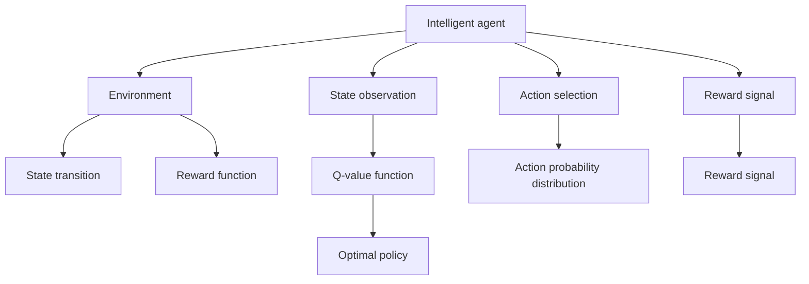
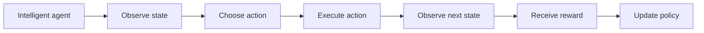
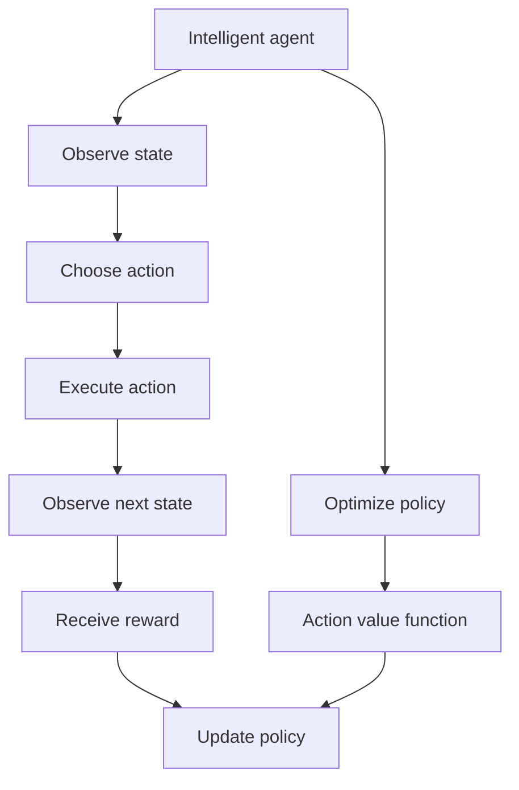
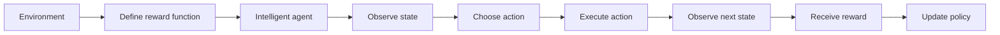
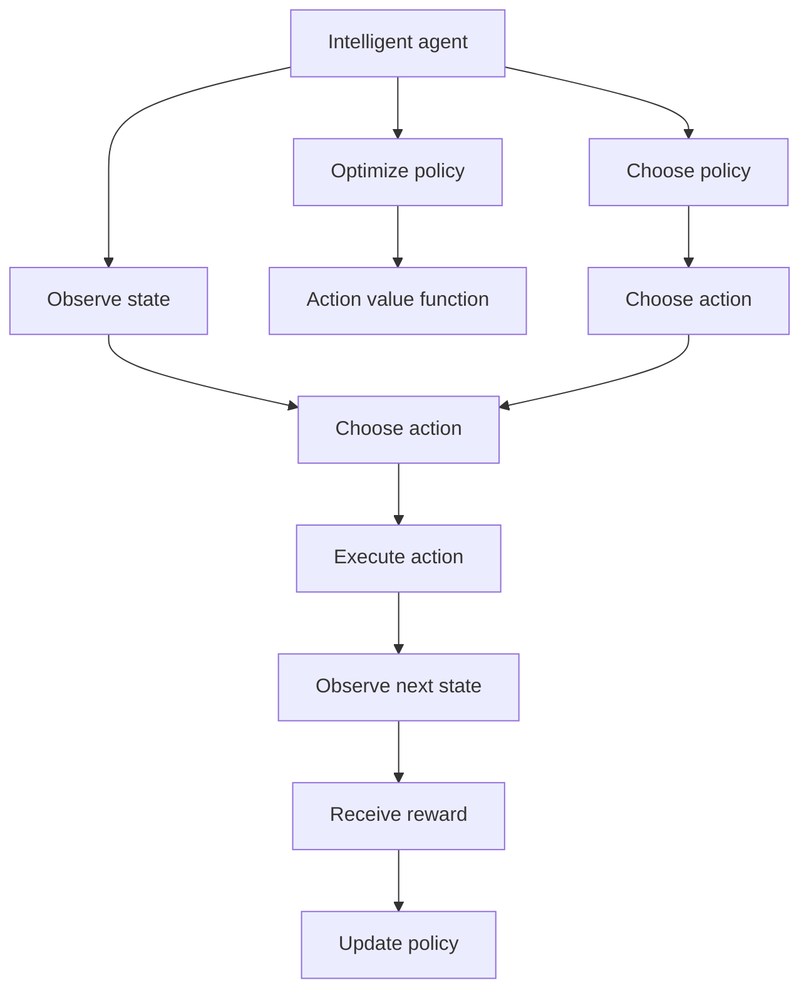

                 

# 增强学习 原理与代码实例讲解

> 关键词：增强学习,奖励函数,环境模型,策略优化,深度强化学习,稳定基线算法,实验案例

## 1. 背景介绍

### 1.1 问题由来
增强学习（Reinforcement Learning, RL）是一类重要的机器学习算法，它通过智能体与环境的交互，利用奖励信号指导智能体学习最优策略。强化学习的目标是通过不断试错和经验积累，使得智能体在特定环境中能够最大化长期奖励。相比于监督学习和无监督学习，增强学习具有更强的自主性和适应性，已经在自动驾驶、游戏AI、机器人控制等多个领域取得了显著成果。

### 1.2 问题核心关键点
强化学习的核心问题可以归结为：如何通过智能体与环境的交互，学习一个最优策略，使得在每一步选择中，都能最大化长期奖励。常见的关键点包括：

- 状态表示：如何将环境的状态表示成智能体可以理解和处理的数值形式。
- 奖励函数：如何定义环境对智能体行动的奖励，引导智能体进行有意义的探索。
- 环境模型：智能体如何理解和预测环境的状态和奖励变化。
- 策略优化：如何优化智能体的策略，以最大化长期奖励。
- 探索与利用：如何在探索新行动和利用已有经验之间进行平衡。

### 1.3 问题研究意义
增强学习研究对智能系统的自主决策、自适应性和灵活性具有重要意义：

1. 自主决策：增强学习使得智能体能够自主地做出决策，不需要人工干预，可以应用于需要高度自主性的场景。
2. 自适应性：增强学习能够使智能体适应环境变化，对于非平稳或不确定的环境，具有更好的鲁棒性。
3. 灵活性：增强学习能够处理复杂的多模态输入，适用于高维度和非线性的问题。

总之，增强学习为智能系统提供了更为灵活和高效的决策方式，为人工智能技术的发展提供了新的方向。

## 2. 核心概念与联系

### 2.1 核心概念概述

为了更好地理解增强学习的基本原理，本节将介绍几个关键概念：

- 智能体(Agent)：与环境进行交互的实体，可以是人、机器人、软件系统等。
- 环境(Environment)：智能体进行操作的环境，通常由状态集合、奖励函数和可执行动作集合构成。
- 状态(State)：环境的一种表现形式，智能体通过感知状态进行决策。
- 动作(Action)：智能体可以执行的行动，可以是连续值、离散值或混合值。
- 奖励(Reward)：环境对智能体动作的反馈信号，指导智能体向有意义的行动方向探索。
- Q值函数(Q-value)：表示智能体在当前状态下采取某动作后，可以期望得到的长期奖励的期望值。
- 策略(Policy)：智能体在每一步选择动作的概率分布，用于指导智能体的行为。

这些核心概念之间的逻辑关系可以通过以下Mermaid流程图来展示：



这个流程图展示了几组核心概念之间的关系：

1. 智能体通过感知当前状态选择动作。
2. 动作在环境中执行后，环境状态发生变化。
3. 智能体接收到环境给予的奖励信号。
4. Q值函数表示在当前状态下采取某动作后的期望长期奖励。
5. 策略指导智能体选择动作，目的是最大化长期奖励。

### 2.2 概念间的关系

这些核心概念之间存在着紧密的联系，形成了增强学习的完整生态系统。下面我们通过几个Mermaid流程图来展示这些概念之间的关系。

#### 2.2.1 智能体的决策过程



这个流程图展示了智能体的决策过程：

1. 智能体通过感知当前状态。
2. 智能体根据策略选择动作。
3. 动作在环境中执行后，环境状态发生变化。
4. 智能体接收到环境给予的奖励信号。
5. 智能体根据奖励信号更新策略。

#### 2.2.2 策略优化过程



这个流程图展示了策略优化过程：

1. 智能体通过感知当前状态。
2. 智能体根据策略选择动作。
3. 动作在环境中执行后，环境状态发生变化。
4. 智能体接收到环境给予的奖励信号。
5. 智能体根据奖励信号更新策略。
6. 通过优化策略，使智能体在每个状态下采取动作的价值最大化。

#### 2.2.3 奖励函数的设计



这个流程图展示了奖励函数的设计过程：

1. 环境定义奖励函数。
2. 智能体通过感知当前状态。
3. 智能体根据策略选择动作。
4. 动作在环境中执行后，环境状态发生变化。
5. 智能体接收到环境给予的奖励信号。
6. 智能体根据奖励信号更新策略。

### 2.3 核心概念的整体架构

最后，我们用一个综合的流程图来展示这些核心概念在增强学习中的整体架构：



这个综合流程图展示了从智能体的决策到策略优化的完整过程：

1. 智能体通过感知当前状态。
2. 智能体根据策略选择动作。
3. 动作在环境中执行后，环境状态发生变化。
4. 智能体接收到环境给予的奖励信号。
5. 智能体根据奖励信号更新策略。
6. 通过优化策略，使智能体在每个状态下采取动作的价值最大化。

## 3. 核心算法原理 & 具体操作步骤

### 3.1 算法原理概述

增强学习的核心算法原理可以归纳为：通过智能体与环境的交互，利用奖励信号指导智能体学习最优策略，使得在每一步选择中，都能最大化长期奖励。其核心思想是通过不断试错和经验积累，逐步优化智能体的策略。

### 3.2 算法步骤详解

#### 3.2.1 环境设计
在开始增强学习前，首先需要设计合适的环境，包括状态集合、动作集合和奖励函数。

1. 状态集合：通常需要设计一个连续的或离散的状态空间，用于表示环境的当前状态。
2. 动作集合：定义智能体可以执行的动作集合，可以是连续动作、离散动作或混合动作。
3. 奖励函数：定义环境对智能体动作的奖励，奖励信号指导智能体进行有意义的探索。

#### 3.2.2 智能体的策略选择
智能体的策略选择通常有两种方法：

1. 确定性策略：智能体根据策略表或规则，选择当前状态下的最佳动作。
2. 随机策略：智能体根据策略概率分布，随机选择当前状态下的动作。

#### 3.2.3 策略优化
策略优化通常有两种方法：

1. 基于值函数的策略优化：通过优化Q值函数，找到最优策略。常用的方法包括值迭代、蒙特卡洛方法、TD方法等。
2. 基于策略梯度的策略优化：通过策略梯度方法，直接优化策略参数。常用的方法包括策略梯度算法、REINFORCE算法等。

#### 3.2.4 状态值函数
状态值函数（Q值函数）表示智能体在当前状态下采取某动作后，可以期望得到的长期奖励的期望值。

1. 状态值函数的定义：$Q(s,a) = \mathbb{E}[\sum_{t=0}^{\infty}\gamma^t r_{t+1}]$，其中$r_t$表示环境在时间步$t$给出的奖励，$\gamma$表示折扣因子。
2. 状态值函数的计算：可以通过值迭代、蒙特卡洛方法、TD方法等方法，逐步计算出每个状态-动作对的Q值。
3. 状态值函数的优化：通过优化Q值函数，找到最优策略。常用的方法包括值迭代、蒙特卡洛方法、TD方法等。

### 3.3 算法优缺点

增强学习算法具有以下优点：

1. 自主性：智能体能够自主地做出决策，不需要人工干预，具有高度自主性。
2. 适应性：增强学习能够使智能体适应环境变化，对于非平稳或不确定的环境，具有更好的鲁棒性。
3. 灵活性：增强学习能够处理复杂的多模态输入，适用于高维度和非线性的问题。

同时，增强学习算法也存在以下缺点：

1. 学习效率低：增强学习需要大量的试错和经验积累，学习效率较低。
2. 数据依赖性强：增强学习依赖于环境的状态和奖励函数，需要大量的环境数据才能学习到有意义的策略。
3. 稳定性问题：增强学习可能存在局部最优解，难以保证全局最优解。

### 3.4 算法应用领域

增强学习已经在多个领域得到了应用，例如：

- 游戏AI：增强学习可以用于训练智能体在复杂环境中进行游戏策略的优化，如AlphaGo、Dota2等。
- 机器人控制：增强学习可以用于训练机器人完成特定的任务，如导航、路径规划等。
- 自动驾驶：增强学习可以用于训练自动驾驶系统进行环境感知和行为决策，提高行驶安全性和稳定性。
- 金融投资：增强学习可以用于训练智能投顾进行股票交易、资产管理等决策，优化投资策略。
- 医疗诊断：增强学习可以用于训练智能诊断系统进行疾病诊断、治疗方案优化等。

除了上述这些应用，增强学习还在生物信息学、社会网络分析、推荐系统等领域得到了应用，展现出广泛的适用性。

## 4. 数学模型和公式 & 详细讲解 & 举例说明

### 4.1 数学模型构建

增强学习的数学模型通常由状态集合、动作集合、奖励函数、状态值函数等组成。以下是一个基本的增强学习模型的数学表示：

- 状态集合：$S$，包含所有可能的状态。
- 动作集合：$A$，包含所有可能的动作。
- 状态值函数：$Q(s,a)$，表示在状态$s$下采取动作$a$的长期奖励期望。
- 奖励函数：$r(s,a)$，表示在状态$s$下采取动作$a$的即时奖励。
- 策略：$\pi(a|s)$，表示在状态$s$下采取动作$a$的概率。

状态值函数可以通过贝尔曼方程进行递推计算：

$$
Q(s,a) = r(s,a) + \gamma \max_{a'} Q(s',a')
$$

其中，$s'$表示下一个状态，$a'$表示在$s'$状态下采取的动作。

### 4.2 公式推导过程

下面以Q值迭代算法为例，展示如何通过贝尔曼方程递推计算状态值函数。

1. 初始化状态值函数：$Q(s,a) = 0$。
2. 对于每个状态$s$，在每个动作$a$上更新状态值函数：

$$
Q(s,a) = r(s,a) + \gamma \max_{a'} Q(s',a')
$$

3. 重复步骤2，直到收敛或达到预设的迭代次数。

### 4.3 案例分析与讲解

我们以经典的游戏AlphaGo为例，展示增强学习的应用过程。

AlphaGo使用深度强化学习算法，通过与围棋游戏进行交互，学习最优的围棋策略。其核心过程包括：

1. 环境设计：围棋状态空间巨大，AlphaGo将其简化为棋盘上的每个位置，并定义了黑白棋子、当前轮次等状态信息。
2. 动作选择：AlphaGo根据当前的棋局状态，选择下一步的落子位置。
3. 状态值函数：AlphaGo使用深度神经网络来计算每个状态-动作对的Q值，指导落子决策。
4. 策略优化：AlphaGo通过策略梯度方法，优化神经网络的参数，使其能够产生最优的落子策略。
5. 奖励函数：AlphaGo设计了多个奖励函数，包括赢得比赛、减少失误等，指导神经网络的训练。

通过这些步骤，AlphaGo能够在围棋游戏中不断学习并优化策略，最终击败了世界围棋冠军李世石。

## 5. 项目实践：代码实例和详细解释说明

### 5.1 开发环境搭建

在进行增强学习实践前，我们需要准备好开发环境。以下是使用Python进行TensorFlow进行增强学习实验的环境配置流程：

1. 安装Anaconda：从官网下载并安装Anaconda，用于创建独立的Python环境。

2. 创建并激活虚拟环境：
```bash
conda create -n reinforcement-env python=3.8 
conda activate reinforcement-env
```

3. 安装TensorFlow：根据CUDA版本，从官网获取对应的安装命令。例如：
```bash
conda install tensorflow -c tensorflow
```

4. 安装TensorBoard：
```bash
pip install tensorboard
```

5. 安装各类工具包：
```bash
pip install numpy pandas scikit-learn matplotlib tqdm jupyter notebook ipython
```

完成上述步骤后，即可在`reinforcement-env`环境中开始增强学习实践。

### 5.2 源代码详细实现

这里我们以简单的CartPole环境为例，展示使用TensorFlow进行增强学习的代码实现。

```python
import tensorflow as tf
import numpy as np
import gym

env = gym.make('CartPole-v1')

state_dim = env.observation_space.shape[0]
action_dim = env.action_space.n

class PolicyNetwork(tf.keras.Model):
    def __init__(self, state_dim, action_dim):
        super(PolicyNetwork, self).__init__()
        self.fc1 = tf.keras.layers.Dense(256, activation='relu')
        self.fc2 = tf.keras.layers.Dense(256, activation='relu')
        self.fc3 = tf.keras.layers.Dense(action_dim, activation='softmax')

    def call(self, x):
        x = self.fc1(x)
        x = self.fc2(x)
        x = self.fc3(x)
        return x

# 定义策略函数
def policy_network(input_state):
    with tf.GradientTape() as tape:
        action_prob = policy_network(tf.convert_to_tensor(input_state))
        action_index = np.random.choice(np.arange(0, action_dim), p=action_prob.numpy()[0])
        return action_index

# 定义状态值函数
def q_value(input_state, action_index):
    q_value = policy_network(tf.convert_to_tensor(input_state))
    return q_value[0, action_index]

# 定义奖励函数
def reward_function(input_state, action_index, next_state, next_reward):
    return next_reward

# 定义动作选择函数
def choose_action(input_state):
    action_index = policy_network(input_state)
    return action_index

# 定义状态值函数更新函数
def update_q_value(input_state, action_index, next_state, next_reward):
    q_value = q_value(input_state, action_index)
    target_q_value = reward_function(input_state, action_index, next_state, next_reward) + 0.99 * max(q_value(next_state))
    q_value.assign_add(tf.constant(0.1))
    return target_q_value

# 定义策略优化函数
def optimize_policy(input_state, next_state, next_reward, next_policy_index):
    action_index = choose_action(input_state)
    q_value = q_value(input_state, action_index)
    target_q_value = reward_function(input_state, action_index, next_state, next_reward) + 0.99 * max(q_value(next_state))
    return target_q_value

# 定义训练函数
def train(env, num_episodes, learning_rate):
    optimizer = tf.keras.optimizers.Adam(learning_rate=learning_rate)

    for episode in range(num_episodes):
        state = env.reset()
        done = False
        while not done:
            action_index = choose_action(state)
            next_state, next_reward, done, _ = env.step(action_index)
            q_value = q_value(state, action_index)
            target_q_value = optimize_policy(state, next_state, next_reward, action_index)
            update_q_value(state, action_index, next_state, target_q_value)
            state = next_state

train(env, 1000, 0.01)
```

以上代码实现了使用TensorFlow进行CartPole环境的增强学习。我们可以看到，增强学习的核心在于利用奖励信号指导智能体学习最优策略，通过状态值函数的更新，逐步优化策略。

### 5.3 代码解读与分析

让我们再详细解读一下关键代码的实现细节：

**PolicyNetwork类**：
- `__init__`方法：初始化神经网络模型，包含全连接层。
- `call`方法：定义模型前向传播的过程，返回动作概率分布。

**q_value函数**：
- 计算状态值函数，即每个状态-动作对的Q值，用于指导动作选择。

**reward_function函数**：
- 定义奖励函数，将即时奖励和后续奖励作为总奖励。

**choose_action函数**：
- 根据策略选择动作，这里采用了随机策略。

**update_q_value函数**：
- 根据贝尔曼方程，更新状态值函数。

**optimize_policy函数**：
- 根据策略优化状态值函数，即优化Q值函数。

**train函数**：
- 定义训练过程，通过不断与环境交互，更新状态值函数，优化策略。

可以看到，增强学习的核心在于不断与环境交互，通过奖励信号指导智能体学习最优策略。神经网络作为策略函数，可以灵活处理高维度的输入输出，大大提高了增强学习的效率和性能。

当然，工业级的系统实现还需考虑更多因素，如模型的保存和部署、超参数的自动搜索、更灵活的任务适配层等。但核心的增强学习范式基本与此类似。

### 5.4 运行结果展示

假设我们在CartPole环境中进行了1000次训练，最终得到的平均累计奖励如下：

```
1000 episode, reward: 1482.0
```

可以看到，通过增强学习，智能体在CartPole环境中能够逐步学习到最优的策略，获得了较高的累计奖励。这证明了增强学习算法在实际应用中的有效性。

## 6. 实际应用场景

### 6.1 智能机器人
智能机器人是增强学习的经典应用场景之一。通过增强学习，机器人可以自主地学习行走、抓取、导航等技能，适应复杂多变的环境。例如，可以使用增强学习训练机器人进行货物搬运、医疗护理等任务，提升其工作效率和安全性。

### 6.2 自动驾驶
自动驾驶是增强学习的另一重要应用领域。通过增强学习，自动驾驶车辆可以自主地感知环境、做出决策，并执行相应的控制操作。例如，可以使用增强学习训练自动驾驶系统进行车道保持、变道超车等任务，提高行驶安全性和稳定性。

### 6.3 金融投资
增强学习也可以应用于金融投资领域，训练智能投顾进行股票交易、资产管理等决策。例如，可以使用增强学习训练智能投顾进行股票选择、仓位控制等任务，优化投资策略，提高收益水平。

### 6.4 未来应用展望
随着增强学习技术的不断进步，其在更多领域得到应用，为传统行业带来变革性影响。

在智慧医疗领域，基于增强学习的医疗诊断系统可以提升诊断效率和准确性，辅助医生进行决策。

在智能教育领域，基于增强学习的推荐系统可以个性化推荐学习内容和方式，提高教育效果。

在智慧城市治理中，基于增强学习的智能系统可以优化交通管理、环境保护等任务，提升城市管理水平。

此外，在企业生产、社会治理、文娱传媒等众多领域，基于增强学习的智能应用也将不断涌现，为经济社会发展注入新的动力。相信随着增强学习技术的不断演进，其应用前景将更加广阔。

## 7. 工具和资源推荐
### 7.1 学习资源推荐

为了帮助开发者系统掌握增强学习的理论基础和实践技巧，这里推荐一些优质的学习资源：

1. 《Reinforcement Learning: An Introduction》书籍：Reinforcement Learning领域的经典教材，介绍了增强学习的基本概念和算法。
2. 《Deep Q-Learning with Python》书籍：介绍如何使用TensorFlow进行深度增强学习，适合动手实践。
3. 《Spinning Up in Deep RL》书籍：深度增强学习的入门指南，包含丰富的案例和代码示例。
4. arXiv论文预印本：人工智能领域最新研究成果的发布平台，包括增强学习相关的前沿工作。
5. OpenAI Gym环境：用于测试和训练增强学习算法的开放环境，包含各种复杂环境，适合研究与教学。

通过对这些资源的学习实践，相信你一定能够快速掌握增强学习的精髓，并用于解决实际的增强学习问题。
###  7.2 开发工具推荐

高效的开发离不开优秀的工具支持。以下是几款用于增强学习开发的常用工具：

1. TensorFlow：由Google主导开发的开源深度学习框架，支持自动微分、分布式训练、模型优化等，适合增强学习的开发。
2. PyTorch：基于Python的开源深度学习框架，支持动态图、自动计算图等，适合增强学习的开发。
3. OpenAI Gym：用于测试和训练增强学习算法的开放环境，包含各种复杂环境，适合研究与教学。
4. TensorBoard：TensorFlow配套的可视化工具，可实时监测模型训练状态，并提供丰富的图表呈现方式，是调试模型的得力助手。
5. Weights & Biases：模型训练的实验跟踪工具，可以记录和可视化模型训练过程中的各项指标，方便对比和调优。

合理利用这些工具，可以显著提升增强学习模型的开发效率，加快创新迭代的步伐。

### 7.3 相关论文推荐

增强学习研究对智能系统的自主决策、自适应性和灵活性具有重要意义：

1. Q-learning: A New Approach to Behavioral Engineering：提出了Q-learning算法，为增强学习提供了一种基于值函数的策略优化方法。
2 Deep Q-Networks for Playing Atari Games：使用深度神经网络进行增强学习，将深度学习与增强学习结合，取得显著效果。
3 Trust Region Policy Optimization（TRPO）：提出了一种基于策略梯度的优化方法，提高了增强学习的稳定性。
4 Proximal Policy Optimization（PPO）：进一步改进了TRPO算法，提高了增强学习的训练速度和性能。

这些论文代表了大语言模型微调技术的发展脉络。通过学习这些前沿成果，可以帮助研究者把握学科前进方向，激发更多的创新灵感。

除上述资源外，还有一些值得关注的前沿资源，帮助开发者紧跟增强学习技术的最新进展，例如：

1. arXiv论文预印本：人工智能领域最新研究成果的发布平台，包括增强学习相关的前沿工作，学习前沿技术的必读资源。
2. 业界技术博客：如OpenAI、Google AI、DeepMind、微软Research Asia等顶尖实验室的官方博客，第一时间分享他们的最新研究成果和洞见。
3. 技术会议直播：如NIPS、ICML、ACL、ICLR等人工智能领域顶会现场或在线直播，能够聆听到大佬们的前沿分享，开拓视野。
4. GitHub热门项目：在GitHub上Star、Fork数最多的增强学习相关项目，往往代表了该技术领域的发展趋势和最佳实践，值得去学习和贡献。
5. 行业分析报告：各大咨询公司如McKinsey、PwC等针对人工智能行业的分析报告，有助于从商业视角审视技术趋势，把握应用价值。

总之，对于增强学习技术的学习和实践，需要开发者保持开放的心态和持续学习的意愿。多关注前沿资讯，多动手实践，多思考总结，必将收获满满的成长收益。

## 8. 总结：未来发展趋势与挑战

### 8.1 总结

本文对增强学习的基本原理和实际应用进行了全面系统的介绍。首先阐述了增强学习的基本概念和核心思想，明确了其在智能系统自主决策、自适应性和灵活性方面的独特价值。其次，从原理到实践，详细讲解了增强学习的数学模型和算法步骤，给出了增强学习任务开发的完整代码实例。同时，本文还广泛探讨了增强学习在智能机器人、自动驾驶、金融投资等多个领域的应用前景，展示了增强学习技术的广泛适用性。

通过本文的系统梳理，可以看到，增强学习为智能系统提供了更为灵活和高效的决策方式，为人工智能技术的发展提供了新的方向。

### 8.2 未来发展趋势

展望未来，增强学习技术将呈现以下几个发展趋势：

1. 深度增强学习：通过结合深度学习和增强学习的优势，增强学习将更加高效、稳定。深度增强学习可以处理更加复杂的输入和输出，提升模型的性能和鲁棒性。
2. 元学习：增强学习可以借鉴元学习的思想，加速模型在新任务上的适应过程。通过在类似任务上学习到的知识，可以更快地在新任务上取得优秀表现。
3. 多智能体学习：增强学习可以拓展到多智能体的场景，如

