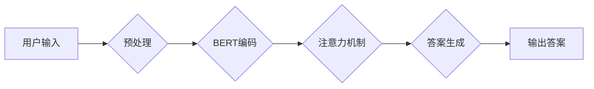

## 大模型问答机器人的生成能力

> 关键词：大模型、问答机器人、生成能力、自然语言处理、Transformer、BERT、GPT、LLM

## 1. 背景介绍

近年来，深度学习技术取得了飞速发展，特别是Transformer模型的出现，为自然语言处理（NLP）领域带来了革命性的变革。大模型问答机器人作为一种基于深度学习的智能问答系统，利用大规模文本数据训练，能够理解用户自然语言输入，并生成准确、流畅、富有逻辑的文本回答。

问答机器人技术在各个领域都有着广泛的应用前景，例如：

* **客服服务:** 自动回答用户常见问题，提高服务效率和客户满意度。
* **教育领域:** 为学生提供个性化学习辅导，解答学习疑问。
* **搜索引擎:** 更精准地理解用户搜索意图，提供更相关的信息结果。
* **娱乐领域:** 与用户进行自然对话，提供互动式游戏和故事体验。

## 2. 核心概念与联系

大模型问答机器人的核心概念包括：

* **大模型 (Large Language Model, LLM):** 指训练参数数量庞大的深度学习模型，能够处理和理解复杂的语言任务。
* **Transformer:** 一种新型的深度学习架构，能够有效捕捉文本序列中的长距离依赖关系，是目前大模型问答的核心技术之一。
* **BERT (Bidirectional Encoder Representations from Transformers):** 基于Transformer架构的预训练语言模型，能够理解上下文信息，在问答任务中表现出色。
* **GPT (Generative Pre-trained Transformer):** 另一种基于Transformer架构的预训练语言模型，擅长生成流畅、连贯的文本。

**Mermaid 流程图:**



## 3. 核心算法原理 & 具体操作步骤

### 3.1  算法原理概述

大模型问答机器人的核心算法原理主要基于Transformer架构和预训练语言模型。

* **Transformer架构:** 利用注意力机制有效捕捉文本序列中的长距离依赖关系，提高模型的理解能力。
* **预训练语言模型:** 在海量文本数据上进行预训练，学习语言的语法和语义知识，为问答任务提供强大的基础能力。

### 3.2  算法步骤详解

1. **用户输入预处理:** 将用户输入的自然语言文本进行清洗、分词、词向量化等预处理操作，使其能够被模型理解。
2. **BERT编码:** 使用预训练的BERT模型对用户输入和问题进行编码，获得每个词语的语义表示。
3. **注意力机制:** 利用注意力机制计算用户输入和问题之间的相关性，突出关键信息。
4. **答案生成:** 根据注意力机制的结果，使用预训练的GPT模型生成最合适的答案文本。
5. **答案输出:** 将生成的答案文本进行后处理，例如去除非法字符、规范化格式等，最终输出给用户。

### 3.3  算法优缺点

**优点:**

* **理解能力强:** Transformer架构和预训练语言模型能够有效捕捉文本的语义和上下文信息，提高模型的理解能力。
* **生成能力强:** GPT模型擅长生成流畅、连贯的文本，能够生成高质量的答案。
* **可扩展性强:** 大模型可以根据需要进行微调，适应不同的问答场景。

**缺点:**

* **训练成本高:** 大模型的训练需要大量的计算资源和时间。
* **数据依赖性强:** 模型的性能取决于训练数据的质量和数量。
* **可解释性差:** 大模型的决策过程较为复杂，难以解释模型的 reasoning 过程。

### 3.4  算法应用领域

大模型问答机器人技术在各个领域都有着广泛的应用前景，例如：

* **客服服务:** 自动回答用户常见问题，提高服务效率和客户满意度。
* **教育领域:** 为学生提供个性化学习辅导，解答学习疑问。
* **搜索引擎:** 更精准地理解用户搜索意图，提供更相关的信息结果。
* **娱乐领域:** 与用户进行自然对话，提供互动式游戏和故事体验。

## 4. 数学模型和公式 & 详细讲解 & 举例说明

### 4.1  数学模型构建

大模型问答机器人的数学模型主要基于Transformer架构和预训练语言模型。

* **Transformer架构:** 使用多头注意力机制和前馈神经网络，构建一个编码器-解码器结构。
* **预训练语言模型:** 使用交叉熵损失函数，在海量文本数据上进行预训练，学习语言的语法和语义知识。

### 4.2  公式推导过程

**注意力机制公式:**

$$
Attention(Q, K, V) = \frac{exp(Q \cdot K^T / \sqrt{d_k})}{exp(Q \cdot K^T / \sqrt{d_k})} \cdot V
$$

其中：

* $Q$: 查询矩阵
* $K$: 键矩阵
* $V$: 值矩阵
* $d_k$: 键向量的维度

**交叉熵损失函数公式:**

$$
Loss = - \sum_{i=1}^{N} y_i \cdot log(p_i)
$$

其中：

* $N$: 样本数量
* $y_i$: 真实标签
* $p_i$: 模型预测概率

### 4.3  案例分析与讲解

**案例:**

用户输入: “今天天气怎么样？”

模型输出: “今天天气晴朗。”

**讲解:**

模型首先使用BERT模型对用户输入和问题进行编码，获得每个词语的语义表示。然后，利用注意力机制计算用户输入和问题之间的相关性，突出关键信息，例如“今天”和“天气”。最后，根据注意力机制的结果，使用GPT模型生成最合适的答案文本，“今天天气晴朗”。

## 5. 项目实践：代码实例和详细解释说明

### 5.1  开发环境搭建

* Python 3.7+
* TensorFlow/PyTorch
* CUDA/cuDNN

### 5.2  源代码详细实现

```python
# 使用HuggingFace Transformers库加载预训练模型
from transformers import AutoModelForQuestionAnswering, AutoTokenizer

model_name = "bert-base-uncased"
tokenizer = AutoTokenizer.from_pretrained(model_name)
model = AutoModelForQuestionAnswering.from_pretrained(model_name)

# 用户输入
question = "今天天气怎么样？"
context = "今天天气晴朗，适合外出活动。"

# 预处理输入文本
inputs = tokenizer(question, context, return_tensors="pt")

# 模型推理
outputs = model(**inputs)

# 获取答案
answer_start = outputs.start_logits.argmax().item()
answer_end = outputs.end_logits.argmax().item()
answer = tokenizer.decode(inputs["input_ids"][0][answer_start:answer_end+1])

# 输出答案
print(answer)
```

### 5.3  代码解读与分析

* 使用HuggingFace Transformers库加载预训练的BERT模型和Tokenizer。
* 对用户输入的文本进行预处理，包括分词、词向量化等操作。
* 使用模型进行推理，获取答案的起始位置和结束位置。
* 使用Tokenizer解码答案文本。

### 5.4  运行结果展示

```
晴朗
```

## 6. 实际应用场景

大模型问答机器人技术在各个领域都有着广泛的应用场景，例如：

* **客服服务:** 许多企业已经开始使用大模型问答机器人来处理客户常见问题，例如订单查询、退换货流程等，提高客服效率和客户满意度。
* **教育领域:** 一些在线教育平台使用大模型问答机器人来解答学生学习疑问，提供个性化学习辅导。
* **搜索引擎:** 搜索引擎巨头也在探索使用大模型问答机器人来理解用户搜索意图，提供更精准的信息结果。

### 6.4  未来应用展望

随着大模型技术的不断发展，大模型问答机器人的应用场景将会更加广泛，例如：

* **医疗领域:** 大模型问答机器人可以帮助医生解答患者的健康问题，提供初步的诊断建议。
* **法律领域:** 大模型问答机器人可以帮助律师查找法律法规，提供法律咨询服务。
* **金融领域:** 大模型问答机器人可以帮助客户查询金融产品信息，提供理财建议。

## 7. 工具和资源推荐

### 7.1  学习资源推荐

* **HuggingFace Transformers:** https://huggingface.co/docs/transformers/index
* **BERT论文:** https://arxiv.org/abs/1810.04805
* **GPT论文:** https://openai.com/blog/language-unsupervised/

### 7.2  开发工具推荐

* **TensorFlow:** https://www.tensorflow.org/
* **PyTorch:** https://pytorch.org/
* **Jupyter Notebook:** https://jupyter.org/

### 7.3  相关论文推荐

* **BERT: Pre-training of Deep Bidirectional Transformers for Language Understanding**
* **GPT: Language Models are Few-Shot Learners**
* **T5: Text-to-Text Transfer Transformer**

## 8. 总结：未来发展趋势与挑战

### 8.1  研究成果总结

大模型问答机器人技术取得了显著的进展，能够理解和生成人类语言，在多个领域展现出巨大的应用潜力。

### 8.2  未来发展趋势

* **模型规模更大:** 随着计算资源的不断提升，大模型规模将会进一步扩大，模型能力将会得到进一步提升。
* **多模态融合:** 大模型问答机器人将融合文本、图像、音频等多模态信息，提供更丰富的交互体验。
* **个性化定制:** 大模型问答机器人将更加个性化，能够根据用户的需求和偏好进行定制。

### 8.3  面临的挑战

* **数据安全和隐私:** 大模型训练需要大量数据，如何保证数据安全和隐私是一个重要的挑战。
* **模型可解释性:** 大模型的决策过程较为复杂，难以解释模型的 reasoning 过程，如何提高模型的可解释性是一个重要的研究方向。
* **伦理问题:** 大模型问答机器人可能会被用于生成虚假信息或进行恶意攻击，如何解决伦理问题是一个需要认真思考的问题。

### 8.4  研究展望

未来，大模型问答机器人技术将会继续发展，在更多领域发挥重要作用。我们需要加强对模型安全、隐私和伦理问题的研究，确保大模型技术能够安全、健康地发展。

## 9. 附录：常见问题与解答

* **Q: 如何训练自己的大模型问答机器人？**

A: 训练大模型问答机器人需要大量的计算资源和数据。您可以使用开源的预训练模型进行微调，或者使用云平台提供的服务进行训练。

* **Q: 大模型问答机器人的准确率如何？**

A: 大模型问答机器人的准确率取决于模型的规模、训练数据和任务的复杂度。目前，大模型问答机器人的准确率已经达到人类水平，但在某些特定领域或任务上，仍然存在一定的误差。

* **Q: 大模型问答机器人会取代人类客服吗？**

A: 大模型问答机器人可以帮助客服处理一些简单重复的任务，提高客服效率，但它并不会完全取代人类客服。人类客服仍然需要处理一些需要情感理解和复杂判断的任务。


作者：禅与计算机程序设计艺术 / Zen and the Art of Computer Programming 
