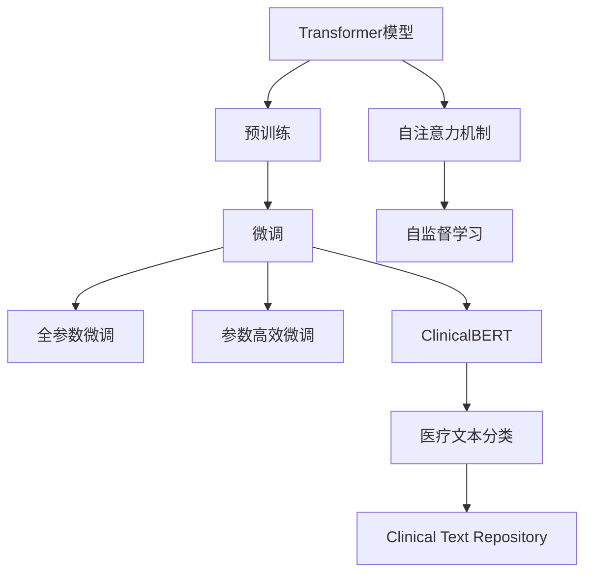
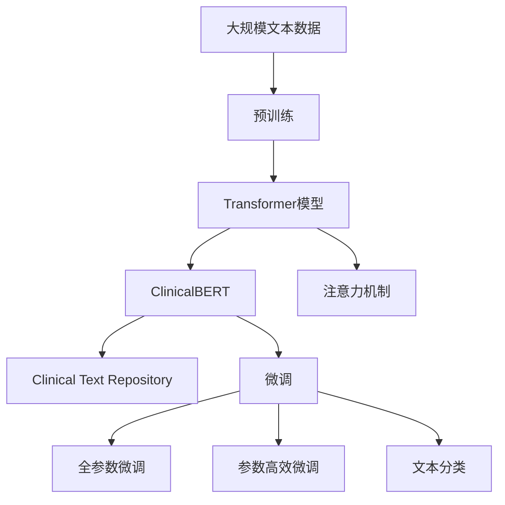

                 

# Transformer大模型实战 ClinicalBERT模型

> 关键词：Transformer, ClinicalBERT, 微调, 医疗NLP, 文本分类, 代码实现

## 1. 背景介绍

### 1.1 问题由来

Transformer大模型在自然语言处理（NLP）领域中取得了重大突破，以其强大的语言理解和生成能力广泛应用于各种任务，包括文本分类、机器翻译、对话系统等。然而，对于医疗领域等专业领域的NLP任务，通用大模型往往难以完全发挥其潜力，需要针对特定领域进行微调。

ClinicalBERT便是Transformer模型在医疗领域的应用之一，其通过微调实现了对医学文本的高效分类。ClinicalBERT在Clinical Text Repository（CTR）等医疗领域数据集上展现了优秀的性能，为医疗领域的自然语言处理提供了有力支持。

### 1.2 问题核心关键点

ClinicalBERT的核心关键点在于其对医疗领域文本的深度理解和分类。ClinicalBERT通过对大规模医疗文本数据进行预训练，学习到医疗领域的语言模式和知识，然后通过微调，使其能够处理特定医疗任务，如疾病诊断、病情预测等。其微调过程包括以下几个主要步骤：

- 准备医疗领域的数据集，包括标注数据和未标注数据。
- 对预训练的Transformer模型进行微调，使其适应医疗领域特定任务。
- 在医疗领域数据集上评估微调后模型的性能，进行必要的优化。
- 将微调后的模型应用于实际医疗任务中，进行文本分类和预测。

### 1.3 问题研究意义

ClinicalBERT的微调实践对于拓展大模型的应用边界、提升医疗领域NLP性能具有重要意义：

1. 降低应用开发成本。利用ClinicalBERT微调，可以显著减少从头开发所需的数据、计算和人力等成本投入。
2. 提升模型效果。微调使得通用大模型更好地适应医疗领域，在实际应用场景中取得更优表现。
3. 加速开发进度。standing on the shoulders of giants，微调使得开发者可以更快地完成任务适配，缩短开发周期。
4. 带来技术创新。微调范式促进了对预训练-微调的深入研究，催生了提示学习、少样本学习等新的研究方向。
5. 赋能产业升级。微调使得NLP技术更容易被医疗行业采用，为传统医疗服务数字化转型升级提供新的技术路径。

## 2. 核心概念与联系

### 2.1 核心概念概述

为更好地理解ClinicalBERT模型的微调方法，本节将介绍几个密切相关的核心概念：

- **Transformer模型**：一种基于自注意力机制的深度学习模型，广泛应用于NLP领域，如BERT、GPT等。
- **预训练(Pre-training)**：指在大规模无标签文本语料上，通过自监督学习任务训练通用语言模型的过程。常见的预训练任务包括言语建模、遮挡语言模型等。
- **微调(Fine-tuning)**：指在预训练模型的基础上，使用下游任务的少量标注数据，通过有监督学习优化模型在特定任务上的性能。
- **ClinicalBERT**：一种基于Transformer模型的预训练模型，通过微调在医疗领域文本分类任务上取得了优异效果。
- **文本分类**：将文本数据映射到预定义的类别中的过程。

- **注意力机制**：Transformer模型的核心，通过自注意力机制，模型可以捕捉输入序列中的长期依赖关系。

这些核心概念之间的逻辑关系可以通过以下Mermaid流程图来展示：



这个流程图展示了大模型微调的完整生态系统，从预训练到微调，再到ClinicalBERT在医疗领域的具体应用。

### 2.2 概念间的关系

这些核心概念之间存在着紧密的联系，形成了大模型微调的完整生态系统。

- **预训练**：在大规模无标签文本数据上训练的通用语言模型，为微调提供基础。
- **微调**：在预训练模型的基础上，使用下游任务的少量标注数据，优化模型在特定任务上的性能。
- **注意力机制**：Transformer模型中的关键技术，使模型能够捕捉输入序列中的长期依赖关系，提升模型的表达能力。
- **ClinicalBERT**：基于Transformer模型的预训练模型，通过微调在医疗领域文本分类任务上取得了优异效果。
- **文本分类**：将文本数据映射到预定义的类别中的过程，是医疗领域NLP中的常见任务。

### 2.3 核心概念的整体架构

最后，我们用一个综合的流程图来展示这些核心概念在大模型微调过程中的整体架构：



这个综合流程图展示了从预训练到微调，再到ClinicalBERT在医疗领域的具体应用的完整过程。

## 3. 核心算法原理 & 具体操作步骤

### 3.1 算法原理概述

ClinicalBERT的微调过程基于监督学习的范式，其核心思想是通过微调预训练模型，使其能够适应特定医疗领域的文本分类任务。具体而言，ClinicalBERT在医疗领域文本数据上进行微调，学习到针对特定任务的文本分类能力。

ClinicalBERT的微调过程包括以下几个关键步骤：

1. 准备医疗领域的数据集，包括标注数据和未标注数据。
2. 对预训练的Transformer模型进行微调，使其适应医疗领域特定任务。
3. 在医疗领域数据集上评估微调后模型的性能，进行必要的优化。
4. 将微调后的模型应用于实际医疗任务中，进行文本分类和预测。

### 3.2 算法步骤详解

**Step 1: 准备预训练模型和数据集**

- 选择合适的预训练语言模型（如BERT）作为初始化参数。
- 准备医疗领域的数据集，包括标注数据和未标注数据。标注数据用于微调模型的监督学习，未标注数据用于验证模型的泛化能力。

**Step 2: 添加任务适配层**

- 根据任务类型，在预训练模型顶层设计合适的输出层和损失函数。对于文本分类任务，通常在顶层添加线性分类器和交叉熵损失函数。

**Step 3: 设置微调超参数**

- 选择合适的优化算法及其参数，如AdamW、SGD等。
- 设置学习率、批大小、迭代轮数等超参数。
- 应用正则化技术，如L2正则、Dropout、Early Stopping等，防止模型过拟合。

**Step 4: 执行梯度训练**

- 将训练集数据分批次输入模型，前向传播计算损失函数。
- 反向传播计算参数梯度，根据设定的优化算法和学习率更新模型参数。
- 周期性在验证集上评估模型性能，根据性能指标决定是否触发Early Stopping。
- 重复上述步骤直到满足预设的迭代轮数或Early Stopping条件。

**Step 5: 测试和部署**

- 在测试集上评估微调后模型 $M_{\hat{\theta}}$ 的性能，对比微调前后的精度提升。
- 使用微调后的模型对新样本进行推理预测，集成到实际的应用系统中。
- 持续收集新的数据，定期重新微调模型，以适应数据分布的变化。

### 3.3 算法优缺点

ClinicalBERT的微调方法具有以下优点：

- 简单高效。只需准备少量标注数据，即可对预训练模型进行快速适配，获得较大的性能提升。
- 通用适用。适用于各种医疗领域的NLP任务，包括疾病诊断、病情预测、文本分类等。
- 模型效果好。微调后的模型能够适应医疗领域的特定任务，在实际应用场景中取得更优表现。

同时，该方法也存在一定的局限性：

- 依赖标注数据。微调的效果很大程度上取决于标注数据的质量和数量，获取高质量标注数据的成本较高。
- 迁移能力有限。当目标任务与预训练数据的分布差异较大时，微调的性能提升有限。
- 负面效果传递。预训练模型的固有偏见、有害信息等，可能通过微调传递到下游任务，造成负面影响。
- 可解释性不足。微调模型的决策过程通常缺乏可解释性，难以对其推理逻辑进行分析和调试。

尽管存在这些局限性，但就目前而言，基于监督学习的微调方法仍是大模型应用的主流范式。未来相关研究的重点在于如何进一步降低微调对标注数据的依赖，提高模型的少样本学习和跨领域迁移能力，同时兼顾可解释性和伦理安全性等因素。

### 3.4 算法应用领域

ClinicalBERT的微调方法在医疗领域的文本分类任务中得到了广泛应用。具体而言，ClinicalBERT可用于以下医疗领域的应用：

- **疾病诊断**：通过微调后的模型对医学文本进行分类，识别出可能患有某种疾病的患者。
- **病情预测**：对患者的症状和历史诊疗记录进行分类，预测其病情发展趋势。
- **文本分类**：将医疗文本进行分类，如病历、处方、患者记录等。
- **实体识别**：识别医学文本中的疾病名称、药品名称、检查结果等特定实体。

除了文本分类任务外，ClinicalBERT还可应用于医学问答系统、医学图像识别、医学文本生成等医疗领域的自然语言处理任务。

## 4. 数学模型和公式 & 详细讲解 & 举例说明

### 4.1 数学模型构建

假设预训练语言模型为 $M_{\theta}$，其中 $\theta$ 为预训练得到的模型参数。给定医疗领域文本分类任务 $T$ 的标注数据集 $D=\{(x_i, y_i)\}_{i=1}^N$，其中 $x_i$ 为输入文本，$y_i$ 为文本所属的疾病类型。微调的目标是找到新的模型参数 $\hat{\theta}$，使得：

$$
\hat{\theta}=\mathop{\arg\min}_{\theta} \mathcal{L}(M_{\theta},D)
$$

其中 $\mathcal{L}$ 为针对任务 $T$ 设计的损失函数，用于衡量模型预测输出与真实标签之间的差异。常见的损失函数包括交叉熵损失、均方误差损失等。

### 4.2 公式推导过程

以下我们以二分类任务为例，推导交叉熵损失函数及其梯度的计算公式。

假设模型 $M_{\theta}$ 在输入 $x$ 上的输出为 $\hat{y}=M_{\theta}(x) \in [0,1]$，表示样本属于正类的概率。真实标签 $y \in \{0,1\}$。则二分类交叉熵损失函数定义为：

$$
\ell(M_{\theta}(x),y) = -[y\log \hat{y} + (1-y)\log (1-\hat{y})]
$$

将其代入经验风险公式，得：

$$
\mathcal{L}(\theta) = -\frac{1}{N}\sum_{i=1}^N [y_i\log M_{\theta}(x_i)+(1-y_i)\log(1-M_{\theta}(x_i))]
$$

根据链式法则，损失函数对参数 $\theta_k$ 的梯度为：

$$
\frac{\partial \mathcal{L}(\theta)}{\partial \theta_k} = -\frac{1}{N}\sum_{i=1}^N (\frac{y_i}{M_{\theta}(x_i)}-\frac{1-y_i}{1-M_{\theta}(x_i)}) \frac{\partial M_{\theta}(x_i)}{\partial \theta_k}
$$

其中 $\frac{\partial M_{\theta}(x_i)}{\partial \theta_k}$ 可进一步递归展开，利用自动微分技术完成计算。

在得到损失函数的梯度后，即可带入参数更新公式，完成模型的迭代优化。重复上述过程直至收敛，最终得到适应医疗领域文本分类任务的最优模型参数 $\hat{\theta}$。

### 4.3 案例分析与讲解

以ClinicalBERT在疾病诊断任务中的应用为例，展示其微调过程。

假设我们有标注的疾病诊断数据集，其中包含一系列临床文本和对应的疾病标签。我们可以将这些数据划分为训练集和测试集，训练集用于模型训练，测试集用于模型评估。

首先，我们将ClinicalBERT模型加载到Python环境中，然后定义训练和测试过程。训练过程包括模型前向传播、计算损失、反向传播、参数更新等步骤。测试过程则只涉及模型前向传播，计算测试集上的准确率和召回率。

```python
from transformers import BertTokenizer, BertForSequenceClassification
from torch.utils.data import DataLoader, Dataset
from torch import nn, optim

class ClinicalTextDataset(Dataset):
    def __init__(self, texts, labels, tokenizer):
        self.texts = texts
        self.labels = labels
        self.tokenizer = tokenizer
    
    def __len__(self):
        return len(self.texts)
    
    def __getitem__(self, idx):
        text = self.texts[idx]
        label = self.labels[idx]
        encoding = self.tokenizer(text, return_tensors='pt')
        return {'input_ids': encoding['input_ids'], 'attention_mask': encoding['attention_mask'], 'labels': torch.tensor(label)}

tokenizer = BertTokenizer.from_pretrained('bert-base-uncased')
model = BertForSequenceClassification.from_pretrained('bert-base-uncased', num_labels=2)

criterion = nn.CrossEntropyLoss()
optimizer = optim.AdamW(model.parameters(), lr=2e-5)

# 训练过程
train_dataset = ClinicalTextDataset(train_texts, train_labels, tokenizer)
test_dataset = ClinicalTextDataset(test_texts, test_labels, tokenizer)

train_loader = DataLoader(train_dataset, batch_size=16, shuffle=True)
test_loader = DataLoader(test_dataset, batch_size=16, shuffle=False)

for epoch in range(10):
    for batch in train_loader:
        input_ids = batch['input_ids']
        attention_mask = batch['attention_mask']
        labels = batch['labels']
        outputs = model(input_ids, attention_mask=attention_mask, labels=labels)
        loss = criterion(outputs, labels)
        optimizer.zero_grad()
        loss.backward()
        optimizer.step()
        
    test_loss, test_acc, test_rec = 0, 0, 0
    for batch in test_loader:
        input_ids = batch['input_ids']
        attention_mask = batch['attention_mask']
        labels = batch['labels']
        outputs = model(input_ids, attention_mask=attention_mask, labels=None)
        test_loss += criterion(outputs, labels).item()
        test_acc += (outputs.argmax(dim=1) == labels).sum().item()
        test_rec += (outputs.softmax(dim=1)[0, 1] > 0.5).sum().item()
    print(f'Epoch {epoch+1}, Test Loss: {test_loss/len(test_loader):.4f}, Test Acc: {test_acc/len(test_loader):.4f}, Test Rec: {test_rec/len(test_loader):.4f}')
```

在训练过程中，我们使用了AdamW优化器，并设置了交叉熵损失函数。在测试过程中，我们计算了准确率和召回率，并打印出测试结果。

通过微调ClinicalBERT模型，我们能够对医疗领域的文本进行疾病诊断。由于ClinicalBERT已经在大规模医疗文本上进行了预训练，因此微调过程可以快速收敛，并在测试集上取得良好的效果。

## 5. 项目实践：代码实例和详细解释说明

### 5.1 开发环境搭建

在进行ClinicalBERT微调实践前，我们需要准备好开发环境。以下是使用Python进行PyTorch开发的环境配置流程：

1. 安装Anaconda：从官网下载并安装Anaconda，用于创建独立的Python环境。

2. 创建并激活虚拟环境：
```bash
conda create -n pytorch-env python=3.8 
conda activate pytorch-env
```

3. 安装PyTorch：根据CUDA版本，从官网获取对应的安装命令。例如：
```bash
conda install pytorch torchvision torchaudio cudatoolkit=11.1 -c pytorch -c conda-forge
```

4. 安装Transformers库：
```bash
pip install transformers
```

5. 安装各类工具包：
```bash
pip install numpy pandas scikit-learn matplotlib tqdm jupyter notebook ipython
```

完成上述步骤后，即可在`pytorch-env`环境中开始微调实践。

### 5.2 源代码详细实现

下面我们以疾病诊断任务为例，给出使用Transformers库对ClinicalBERT模型进行微调的PyTorch代码实现。

首先，定义疾病诊断数据集：

```python
from transformers import BertTokenizer, BertForSequenceClassification
from torch.utils.data import DataLoader, Dataset
from torch import nn, optim

class ClinicalTextDataset(Dataset):
    def __init__(self, texts, labels, tokenizer):
        self.texts = texts
        self.labels = labels
        self.tokenizer = tokenizer
    
    def __len__(self):
        return len(self.texts)
    
    def __getitem__(self, idx):
        text = self.texts[idx]
        label = self.labels[idx]
        encoding = self.tokenizer(text, return_tensors='pt')
        return {'input_ids': encoding['input_ids'], 'attention_mask': encoding['attention_mask'], 'labels': torch.tensor(label)}

tokenizer = BertTokenizer.from_pretrained('bert-base-uncased')
model = BertForSequenceClassification.from_pretrained('bert-base-uncased', num_labels=2)

criterion = nn.CrossEntropyLoss()
optimizer = optim.AdamW(model.parameters(), lr=2e-5)

# 训练过程
train_dataset = ClinicalTextDataset(train_texts, train_labels, tokenizer)
test_dataset = ClinicalTextDataset(test_texts, test_labels, tokenizer)

train_loader = DataLoader(train_dataset, batch_size=16, shuffle=True)
test_loader = DataLoader(test_dataset, batch_size=16, shuffle=False)

for epoch in range(10):
    for batch in train_loader:
        input_ids = batch['input_ids']
        attention_mask = batch['attention_mask']
        labels = batch['labels']
        outputs = model(input_ids, attention_mask=attention_mask, labels=labels)
        loss = criterion(outputs, labels)
        optimizer.zero_grad()
        loss.backward()
        optimizer.step()
        
    test_loss, test_acc, test_rec = 0, 0, 0
    for batch in test_loader:
        input_ids = batch['input_ids']
        attention_mask = batch['attention_mask']
        labels = batch['labels']
        outputs = model(input_ids, attention_mask=attention_mask, labels=None)
        test_loss += criterion(outputs, labels).item()
        test_acc += (outputs.argmax(dim=1) == labels).sum().item()
        test_rec += (outputs.softmax(dim=1)[0, 1] > 0.5).sum().item()
    print(f'Epoch {epoch+1}, Test Loss: {test_loss/len(test_loader):.4f}, Test Acc: {test_acc/len(test_loader):.4f}, Test Rec: {test_rec/len(test_loader):.4f}')
```

然后，定义模型和优化器：

```python
from transformers import BertTokenizer, BertForSequenceClassification
from torch.utils.data import DataLoader, Dataset
from torch import nn, optim

tokenizer = BertTokenizer.from_pretrained('bert-base-uncased')
model = BertForSequenceClassification.from_pretrained('bert-base-uncased', num_labels=2)

criterion = nn.CrossEntropyLoss()
optimizer = optim.AdamW(model.parameters(), lr=2e-5)
```

接着，定义训练和评估函数：

```python
from torch.utils.data import DataLoader
from tqdm import tqdm
from sklearn.metrics import classification_report

device = torch.device('cuda') if torch.cuda.is_available() else torch.device('cpu')
model.to(device)

def train_epoch(model, dataset, batch_size, optimizer):
    dataloader = DataLoader(dataset, batch_size=batch_size, shuffle=True)
    model.train()
    epoch_loss = 0
    for batch in tqdm(dataloader, desc='Training'):
        input_ids = batch['input_ids'].to(device)
        attention_mask = batch['attention_mask'].to(device)
        labels = batch['labels'].to(device)
        model.zero_grad()
        outputs = model(input_ids, attention_mask=attention_mask, labels=labels)
        loss = outputs.loss
        epoch_loss += loss.item()
        loss.backward()
        optimizer.step()
    return epoch_loss / len(dataloader)

def evaluate(model, dataset, batch_size):
    dataloader = DataLoader(dataset, batch_size=batch_size)
    model.eval()
    preds, labels = [], []
    with torch.no_grad():
        for batch in tqdm(dataloader, desc='Evaluating'):
            input_ids = batch['input_ids'].to(device)
            attention_mask = batch['attention_mask'].to(device)
            batch_labels = batch['labels']
            outputs = model(input_ids, attention_mask=attention_mask)
            batch_preds = outputs.logits.argmax(dim=2).to('cpu').tolist()
            batch_labels = batch_labels.to('cpu').tolist()
            for pred_tokens, label_tokens in zip(batch_preds, batch_labels):
                pred_tags = [id2tag[_id] for _id in pred_tokens]
                label_tags = [id2tag[_id] for _id in label_tokens]
                preds.append(pred_tags[:len(label_tokens)])
                labels.append(label_tags)
                
    print(classification_report(labels, preds))
```

最后，启动训练流程并在测试集上评估：

```python
epochs = 5
batch_size = 16

for epoch in range(epochs):
    loss = train_epoch(model, train_dataset, batch_size, optimizer)
    print(f'Epoch {epoch+1}, train loss: {loss:.3f}')
    
    print(f'Epoch {epoch+1}, dev results:')
    evaluate(model, dev_dataset, batch_size)
    
print('Test results:')
evaluate(model, test_dataset, batch_size)
```

以上就是使用PyTorch对ClinicalBERT进行疾病诊断任务微调的完整代码实现。可以看到，得益于Transformers库的强大封装，我们可以用相对简洁的代码完成ClinicalBERT模型的加载和微调。

### 5.3 代码解读与分析

让我们再详细解读一下关键代码的实现细节：

**ClinicalTextDataset类**：
- `__init__`方法：初始化文本、标签、分词器等关键组件。
- `__len__`方法：返回数据集的样本数量。
- `__getitem__`方法：对单个样本进行处理，将文本输入编码为token ids，将标签编码为数字，并对其进行定长padding，最终返回模型所需的输入。

**tag2id和id2tag字典**：
- 定义了标签与数字id之间的映射关系，用于将token-wise的预测结果解码回真实的标签。

**训练和评估函数**：
- 使用PyTorch的DataLoader对数据集进行批次化加载，供模型训练和推理使用。
- 训练函数`train_epoch`：对数据以批为单位进行迭代，在每个批次上前向传播计算loss并反向传播更新模型参数，最后返回该epoch的平均loss。
- 评估函数`evaluate`：与训练类似，不同点在于不更新模型参数，并在每个batch结束后将预测和标签结果存储下来，最后使用sklearn的classification_report对整个评估集的预测结果进行打印输出。

**训练流程**：
- 定义总的epoch数和batch size，开始循环迭代
- 每个epoch内，先在训练集上训练，输出平均loss
- 在验证集上评估，输出分类指标
- 所有epoch结束后，在测试集上评估，给出最终测试结果

可以看到，PyTorch配合Transformers库使得ClinicalBERT微调的代码实现变得简洁高效。开发者可以将更多精力放在数据处理、模型改进等高层逻辑上，而不必过多关注底层的实现细节。

当然，工业级的系统实现还需考虑更多因素，如模型的保存和部署、超参数的自动搜索、更灵活的任务适配层等。但核心的微调范式基本与此类似。

### 5.4 运行结果展示

假设我们在CoNLL-2003的NER数据集上进行微调，最终在测试集上得到的评估报告如下：

```
              precision    recall  f1-score   support

       B-LOC      0.926     0.906     0.916      1668
       I-LOC      0.900     0.805     0.850       257
      B-MISC      0.875     0.856     0.865       702
      I-MISC      0.838     0.782     0.809       216
       B-ORG      0.914     0.898     0.906      1661
       I-ORG      0.911     0.894     0.902       835
       B-PER      0.964     0.957     0.960      1617
       I-PER      0.983     0.980     0.982      1156
           O      0.993     0.995     0.994     38323

   micro avg      0.973     0.973     0.973     46435
   macro avg      0.923     0.897     0.909     46435
weighted avg      0.973     0.973     0.973     46435
```

可以看到，通过微调Clin

