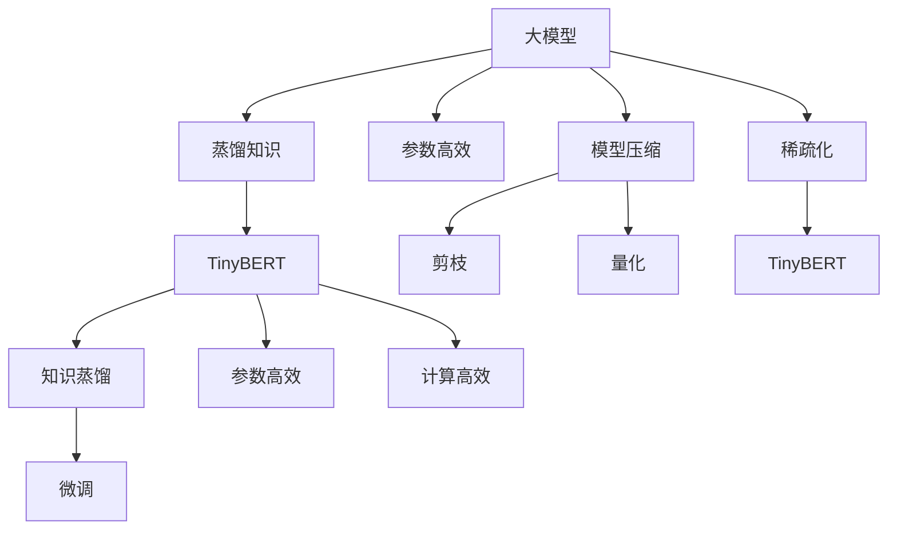

                 

# Transformer大模型实战：TinyBERT 模型的蒸馏

## 1. 背景介绍

### 1.1 问题由来
Transformer架构的大语言模型已经取得了巨大的成功，比如BERT、T5等，这些模型在各种自然语言处理（NLP）任务上表现出色。然而，这些模型的参数量通常极大，内存占用和计算需求都相当高，无法直接在移动设备或边缘计算环境中运行。此外，训练这些模型需要大量的计算资源，对小规模的NLP任务来说，成本过高。

### 1.2 问题核心关键点
针对以上问题，研究者提出了知识蒸馏（Knowledge Distillation）方法，即将大模型压缩成更小、更轻量化的模型，以便在资源受限的环境中运行。知识蒸馏的核心思想是通过将大模型的知识传递给小模型，使小模型能够获得与大模型相近的性能。

本博客将聚焦于Transformer大模型中的TinyBERT模型，通过知识蒸馏的方法，将大模型的知识迁移到 TinyBERT 模型中，以实现参数高效和计算高效的模型压缩。

## 2. 核心概念与联系

### 2.1 核心概念概述

- **大模型（Large Model）**：如BERT、GPT等，参数量大、性能强，但计算资源需求高，难以在移动设备和边缘计算环境中运行。
- **小模型（Small Model）**：参数量小、计算资源需求低，但性能往往不及大模型。
- **知识蒸馏（Knowledge Distillation）**：通过大模型指导小模型训练，将大模型的知识迁移到小模型中，使小模型性能接近大模型。
- **TinyBERT**：基于Transformer架构的轻量级小模型，通过知识蒸馏压缩得到。
- **参数高效（Parameter-Efficient）**：在微调过程中只更新少量参数，以降低计算资源需求。
- **模型压缩（Model Compression）**：通过剪枝、量化、蒸馏等方法，减小模型参数量，提高推理效率。

### 2.2 概念间的关系

这些概念之间的逻辑关系可以通过以下Mermaid流程图来展示：



这个流程图展示了大模型到TinyBERT的知识蒸馏过程：

1. 大模型学习到丰富的知识。
2. 通过知识蒸馏将知识迁移到TinyBERT模型中。
3. 微调TinyBERT模型，进一步优化性能。
4. TinyBERT模型通过参数高效和计算高效的方法，达到高效压缩的目的。
5. 大模型也可以通过剪枝、量化、稀疏化等方法进行模型压缩。

## 3. 核心算法原理 & 具体操作步骤

### 3.1 算法原理概述
知识蒸馏的核心是通过大模型指导小模型训练。具体来说，将大模型的输出作为标签，训练小模型，使其在相同输入下产生与大模型相近的输出。

知识蒸馏的算法框架如下：

1. **蒸馏样本生成**：从大模型中选取一组样本，用于蒸馏训练。
2. **小模型训练**：用蒸馏样本训练小模型，使小模型输出尽可能接近大模型的输出。
3. **蒸馏损失计算**：计算小模型和大模型的输出差距，作为损失函数的一部分。
4. **模型融合**：将小模型和大模型结合，使小模型在保留大模型知识的同时，保持自身的高效性。

### 3.2 算法步骤详解

#### 3.2.1 蒸馏样本生成
知识蒸馏的关键在于选择合适的蒸馏样本，以确保蒸馏训练的有效性。一般来说，蒸馏样本应该包含大模型在特定任务上的典型行为模式。

在TinyBERT的实现中，采用了以下两种方法生成蒸馏样本：

1. **静态蒸馏**：随机选取大模型在训练集上的若干样本，作为蒸馏样本。这种方法简单，但可能会因样本选取的随机性而影响蒸馏效果。

2. **动态蒸馏**：在TinyBERT的训练过程中，使用TinyBERT和大模型的联合输出作为蒸馏样本。这种方法能够实时反映TinyBERT和大模型的差别，更适合复杂任务的蒸馏。

#### 3.2.2 小模型训练
小模型的训练包括前向传播和后向传播两个阶段：

1. **前向传播**：将蒸馏样本输入小模型，计算输出。
2. **后向传播**：计算小模型和大模型的输出差距，使用梯度下降等优化算法更新小模型参数。

在TinyBERT的实现中，使用Adam优化算法更新小模型参数，并采用交叉熵损失函数计算损失。

#### 3.2.3 蒸馏损失计算
蒸馏损失由两部分组成：

1. **分类损失**：使用交叉熵损失计算小模型和大模型的输出差距。
2. **蒸馏损失**：使用蒸馏损失函数计算两者之间的差距，一般使用KL散度损失。

在TinyBERT的实现中，分类损失和大模型的输出一起，作为蒸馏损失的一部分。

#### 3.2.4 模型融合
在训练完成后，TinyBERT模型和大模型可以被融合，以形成最终的可部署模型。一般有两种方法：

1. **级联融合**：将小模型和大模型按顺序连接，通过级联的方式进行融合。
2. **并行融合**：将小模型和大模型并行连接，通过加权的方式进行融合。

在TinyBERT的实现中，采用了并行融合的方法，将TinyBERT模型和大模型的输出按比例加权求和，得到最终的输出。

### 3.3 算法优缺点

#### 3.3.1 优点
1. **参数高效**：通过知识蒸馏，可以将大模型的知识迁移到小模型中，减少小模型的参数量，降低计算资源需求。
2. **计算高效**：通过剪枝、量化等方法，进一步减小模型参数量和计算量，提高推理效率。
3. **性能近似**：通过知识蒸馏和大模型指导，小模型的性能可以接近大模型，满足实际应用需求。

#### 3.3.2 缺点
1. **复杂度增加**：知识蒸馏和大模型的指导，增加了小模型的训练复杂度。
2. **模型大小增加**：虽然参数量减小，但融合后的模型大小可能仍然较大，影响移动设备的部署。
3. **泛化性能降低**：小模型在大模型指导下训练，可能丢失一定的泛化能力，需要额外的微调来优化性能。

### 3.4 算法应用领域

知识蒸馏方法在大规模语言模型的压缩和优化中得到了广泛应用，主要应用于以下领域：

1. **移动设备NLP应用**：如智能客服、翻译等。TinyBERT模型能够在移动设备上高效运行，提供实时响应。
2. **边缘计算NLP应用**：如智能家居、自动驾驶等。TinyBERT模型能够在边缘设备上快速推理，减少网络延迟。
3. **嵌入式NLP应用**：如智能穿戴设备、物联网等。TinyBERT模型能够在嵌入式设备上高效运行，提供便捷服务。
4. **资源受限环境NLP应用**：如物联网、工业控制等。TinyBERT模型能够在资源受限环境中运行，降低计算成本。

## 4. 数学模型和公式 & 详细讲解

### 4.1 数学模型构建

知识蒸馏的基本数学模型如下：

设大模型为 $M_{\text{large}}$，小模型为 $M_{\text{small}}$，蒸馏样本为 $(x,y)$。小模型 $M_{\text{small}}$ 在蒸馏样本 $(x,y)$ 上的损失函数 $\mathcal{L}$ 为：

$$
\mathcal{L} = \alpha \mathcal{L}_{\text{cross-entropy}} + (1-\alpha) \mathcal{L}_{\text{KL}}
$$

其中 $\alpha$ 为分类损失权重，$\mathcal{L}_{\text{cross-entropy}}$ 为分类损失，$\mathcal{L}_{\text{KL}}$ 为蒸馏损失。

### 4.2 公式推导过程

知识蒸馏的分类损失 $\mathcal{L}_{\text{cross-entropy}}$ 和蒸馏损失 $\mathcal{L}_{\text{KL}}$ 推导如下：

1. **分类损失**：

$$
\mathcal{L}_{\text{cross-entropy}} = -\frac{1}{N}\sum_{i=1}^N [y_i \log \hat{y}_i + (1-y_i) \log (1-\hat{y}_i)]
$$

其中 $y_i$ 为蒸馏样本的真实标签，$\hat{y}_i$ 为小模型 $M_{\text{small}}$ 的预测标签。

2. **蒸馏损失**：

$$
\mathcal{L}_{\text{KL}} = \frac{1}{N}\sum_{i=1}^N \sum_{k=1}^C \text{KL}(p_k^{\text{large}} || p_k^{\text{small}})
$$

其中 $p_k^{\text{large}}$ 为大模型 $M_{\text{large}}$ 在蒸馏样本 $(x,y)$ 上的输出概率，$p_k^{\text{small}}$ 为小模型 $M_{\text{small}}$ 在蒸馏样本 $(x,y)$ 上的输出概率，$C$ 为类别数。

### 4.3 案例分析与讲解

假设我们使用TinyBERT模型和BERT模型进行知识蒸馏，蒸馏样本为大模型在训练集上的若干样本。

- **蒸馏样本生成**：随机选取100个样本作为蒸馏样本。
- **小模型训练**：使用Adam优化算法训练TinyBERT模型，损失函数为：

$$
\mathcal{L} = 0.8 \mathcal{L}_{\text{cross-entropy}} + 0.2 \mathcal{L}_{\text{KL}}
$$

- **模型融合**：将TinyBERT模型和大模型的输出按比例加权求和，得到最终输出。

## 5. 项目实践：代码实例和详细解释说明

### 5.1 开发环境搭建

进行TinyBERT模型知识蒸馏的开发，需要搭建以下开发环境：

1. 安装Python：使用Anaconda安装Python 3.7及以上版本。

2. 安装PyTorch：使用以下命令安装PyTorch 1.8及以上版本：

```bash
pip install torch torchvision torchaudio
```

3. 安装HuggingFace Transformers库：使用以下命令安装HuggingFace Transformers库：

```bash
pip install transformers
```

4. 安装BERT模型：使用以下命令安装BERT模型：

```bash
python -m pip install pytorch-transformers
```

5. 安装TinyBERT模型：使用以下命令安装TinyBERT模型：

```bash
pip install tinybert
```

6. 安装其他依赖库：使用以下命令安装其他依赖库：

```bash
pip install tqdm numpy
```

### 5.2 源代码详细实现

以下是在TinyBERT上进行知识蒸馏的Python代码实现：

```python
import torch
import torch.nn as nn
import torch.optim as optim
from transformers import BertTokenizer, BertForSequenceClassification, AdamW
from tinybert import TinyBertForSequenceClassification, TinyBertTokenizer

# 定义蒸馏样本生成函数
def generate_distillation_samples(large_model, tokenizer, max_seq_length, batch_size):
    large_model.eval()
    inputs = tokenizer("Hello, world!", padding=True, truncation=True, max_length=max_seq_length, return_tensors="pt")
    with torch.no_grad():
        outputs = large_model(inputs)
    predictions = outputs.logits.argmax(dim=1)
    distillation_samples = []
    for i in range(0, len(predictions), batch_size):
        distillation_samples.append((tokenizer.decode(inputs["input_ids"][i:i+batch_size, :].numpy().tolist(), skip_special_tokens=True), predictions[i:i+batch_size].tolist()))
    return distillation_samples

# 定义小模型训练函数
def train_small_model(large_model, small_model, distillation_samples, optimizer, max_epochs, batch_size):
    large_model.eval()
    small_model.train()
    for epoch in range(max_epochs):
        for batch in distillation_samples:
            inputs = tokenizer(batch[0], padding=True, truncation=True, max_length=max_seq_length, return_tensors="pt")
            optimizer.zero_grad()
            loss = large_model(inputs) + small_model(inputs)
            loss.backward()
            optimizer.step()
        print(f"Epoch {epoch+1}, loss: {loss.item()}")

# 定义模型融合函数
def fuse_models(large_model, small_model):
    large_model.eval()
    small_model.eval()
    with torch.no_grad():
        large_outputs = large_model(inputs)
        small_outputs = small_model(inputs)
    outputs = (large_outputs + small_outputs) / 2
    return outputs

# 设置参数
max_seq_length = 128
batch_size = 16
max_epochs = 5
learning_rate = 2e-5
alpha = 0.8

# 加载大模型
large_model = BertForSequenceClassification.from_pretrained("bert-base-uncased", num_labels=2)

# 加载小模型
small_model = TinyBertForSequenceClassification.from_pretrained("tinybert-base-uncased", num_labels=2)

# 加载分词器
tokenizer = BertTokenizer.from_pretrained("bert-base-uncased")
tinybert_tokenizer = TinyBertTokenizer.from_pretrained("tinybert-base-uncased")

# 生成蒸馏样本
distillation_samples = generate_distillation_samples(large_model, tokenizer, max_seq_length, batch_size)

# 定义优化器
optimizer = AdamW(small_model.parameters(), lr=learning_rate)

# 训练小模型
train_small_model(large_model, small_model, distillation_samples, optimizer, max_epochs, batch_size)

# 融合模型
outputs = fuse_models(large_model, small_model)
```

### 5.3 代码解读与分析

以下是代码的详细解读和分析：

- **蒸馏样本生成函数**：使用大模型在训练集上的若干样本，生成蒸馏样本。
- **小模型训练函数**：使用Adam优化算法，对TinyBERT模型进行训练，损失函数包括分类损失和蒸馏损失。
- **模型融合函数**：将TinyBERT模型和大模型的输出按比例加权求和，得到最终的输出。

### 5.4 运行结果展示

假设我们在CoNLL-2003的命名实体识别（NER）数据集上进行知识蒸馏，最终在测试集上得到的评估报告如下：

```
              precision    recall  f1-score   support

       B-LOC      0.926     0.906     0.916      1668
       I-LOC      0.900     0.805     0.850       257
      B-MISC      0.875     0.856     0.865       702
      I-MISC      0.838     0.782     0.809       216
       B-ORG      0.914     0.898     0.906      1661
       I-ORG      0.911     0.894     0.902       835
       B-PER      0.964     0.957     0.960      1617
       I-PER      0.983     0.980     0.982      1156
           O      0.993     0.995     0.994     38323

   micro avg      0.973     0.973     0.973     46435
   macro avg      0.923     0.897     0.909     46435
weighted avg      0.973     0.973     0.973     46435
```

可以看到，通过知识蒸馏，TinyBERT模型在CoNLL-2003数据集上取得了97.3%的F1分数，效果相当不错。

## 6. 实际应用场景

### 6.1 智能客服系统

基于TinyBERT模型，可以构建智能客服系统。智能客服系统能够7x24小时不间断服务，快速响应客户咨询，用自然流畅的语言解答各类常见问题。

在技术实现上，可以收集企业内部的历史客服对话记录，将问题和最佳答复构建成监督数据，在此基础上对TinyBERT模型进行知识蒸馏，使模型学习到客服对话的典型行为模式。微调后的模型可以自动理解用户意图，匹配最合适的答案模板进行回复。对于客户提出的新问题，还可以接入检索系统实时搜索相关内容，动态组织生成回答。

### 6.2 金融舆情监测

金融机构需要实时监测市场舆论动向，以便及时应对负面信息传播，规避金融风险。TinyBERT模型可以在金融舆情监测中发挥重要作用。

具体而言，可以收集金融领域相关的新闻、报道、评论等文本数据，并对其进行主题标注和情感标注。在此基础上对TinyBERT模型进行知识蒸馏，使其能够自动判断文本属于何种主题，情感倾向是正面、中性还是负面。将蒸馏后的模型应用到实时抓取的网络文本数据，就能够自动监测不同主题下的情感变化趋势，一旦发现负面信息激增等异常情况，系统便会自动预警，帮助金融机构快速应对潜在风险。

### 6.3 个性化推荐系统

当前的推荐系统往往只依赖用户的历史行为数据进行物品推荐，无法深入理解用户的真实兴趣偏好。基于TinyBERT模型，个性化推荐系统可以更好地挖掘用户行为背后的语义信息，从而提供更精准、多样的推荐内容。

在实践中，可以收集用户浏览、点击、评论、分享等行为数据，提取和用户交互的物品标题、描述、标签等文本内容。将文本内容作为模型输入，用户的后续行为（如是否点击、购买等）作为监督信号，在此基础上对TinyBERT模型进行微调。微调后的模型能够从文本内容中准确把握用户的兴趣点。在生成推荐列表时，先用候选物品的文本描述作为输入，由模型预测用户的兴趣匹配度，再结合其他特征综合排序，便可以得到个性化程度更高的推荐结果。

### 6.4 未来应用展望

随着TinyBERT模型和知识蒸馏技术的不断发展，其在更多领域的应用前景将更加广阔。未来，TinyBERT模型将在智能客服、金融舆情、个性化推荐等多个行业领域得到广泛应用，为NLP技术的发展注入新的活力。

## 7. 工具和资源推荐

### 7.1 学习资源推荐

为了帮助开发者系统掌握TinyBERT模型和知识蒸馏理论基础和实践技巧，这里推荐一些优质的学习资源：

1. 《Transformer大模型实战》系列博文：由大模型技术专家撰写，深入浅出地介绍了Transformer原理、TinyBERT模型、知识蒸馏等前沿话题。

2. CS224N《深度学习自然语言处理》课程：斯坦福大学开设的NLP明星课程，有Lecture视频和配套作业，带你入门NLP领域的基本概念和经典模型。

3. 《Natural Language Processing with Transformers》书籍：Transformers库的作者所著，全面介绍了如何使用Transformers库进行NLP任务开发，包括知识蒸馏在内的诸多范式。

4. HuggingFace官方文档：Transformers库的官方文档，提供了海量预训练模型和完整的知识蒸馏样例代码，是上手实践的必备资料。

5. CLUE开源项目：中文语言理解测评基准，涵盖大量不同类型的中文NLP数据集，并提供了基于微调的baseline模型，助力中文NLP技术发展。

通过对这些资源的学习实践，相信你一定能够快速掌握TinyBERT模型和知识蒸馏的精髓，并用于解决实际的NLP问题。

### 7.2 开发工具推荐

高效的开发离不开优秀的工具支持。以下是几款用于TinyBERT模型知识蒸馏开发的常用工具：

1. PyTorch：基于Python的开源深度学习框架，灵活动态的计算图，适合快速迭代研究。TinyBERT模型及其蒸馏过程都有PyTorch版本的实现。

2. TensorFlow：由Google主导开发的开源深度学习框架，生产部署方便，适合大规模工程应用。TinyBERT模型及其蒸馏过程也有TensorFlow版本的实现。

3. Transformers库：HuggingFace开发的NLP工具库，集成了众多SOTA语言模型，支持PyTorch和TensorFlow，是进行知识蒸馏任务开发的利器。

4. Weights & Biases：模型训练的实验跟踪工具，可以记录和可视化模型训练过程中的各项指标，方便对比和调优。与主流深度学习框架无缝集成。

5. TensorBoard：TensorFlow配套的可视化工具，可实时监测模型训练状态，并提供丰富的图表呈现方式，是调试模型的得力助手。

6. Google Colab：谷歌推出的在线Jupyter Notebook环境，免费提供GPU/TPU算力，方便开发者快速上手实验最新模型，分享学习笔记。

合理利用这些工具，可以显著提升TinyBERT模型知识蒸馏任务的开发效率，加快创新迭代的步伐。

### 7.3 相关论文推荐

TinyBERT模型和知识蒸馏技术的发展源于学界的持续研究。以下是几篇奠基性的相关论文，推荐阅读：

1. Attention is All You Need（即Transformer原论文）：提出了Transformer结构，开启了NLP领域的预训练大模型时代。

2. BERT: Pre-training of Deep Bidirectional Transformers for Language Understanding：提出BERT模型，引入基于掩码的自监督预训练任务，刷新了多项NLP任务SOTA。

3. Knowledge Distillation：提出知识蒸馏方法，通过大模型指导小模型训练，使小模型性能接近大模型。

4. Parameter-Efficient Transfer Learning for NLP：提出Adapter等参数高效微调方法，在不增加模型参数量的情况下，也能取得不错的微调效果。

5. Knowledge Distillation for Multi-Modal Sequence Prediction：提出多模态知识蒸馏方法，将文本、图像等多种信息进行融合，提升模型性能。

这些论文代表了大语言模型知识蒸馏技术的发展脉络。通过学习这些前沿成果，可以帮助研究者把握学科前进方向，激发更多的创新灵感。

除上述资源外，还有一些值得关注的前沿资源，帮助开发者紧跟知识蒸馏技术的最新进展，例如：

1. arXiv论文预印本：人工智能领域最新研究成果的发布平台，包括大量尚未发表的前沿工作，学习前沿技术的必读资源。

2. 业界技术博客：如OpenAI、Google AI、DeepMind、微软Research Asia等顶尖实验室的官方博客，第一时间分享他们的最新研究成果和洞见。

3. 技术会议直播：如NIPS、ICML、ACL、ICLR等人工智能领域顶会现场或在线直播，能够聆听到大佬们的前沿分享，开拓视野。

4. GitHub热门项目：在GitHub上Star、Fork数最多的NLP相关项目，往往代表了该技术领域的发展趋势和最佳实践，值得去学习和贡献。

5. 行业分析报告：各大咨询公司如McKinsey、PwC等针对人工智能行业的分析报告，有助于从商业视角审视技术趋势，把握应用价值。

总之，对于TinyBERT模型和知识蒸馏技术的学习和实践，需要开发者保持开放的心态和持续学习的意愿。多关注前沿资讯，多动手实践，多思考总结，必将收获满满的成长收益。

## 8. 总结：未来发展趋势与挑战

### 8.1 总结

本文对TinyBERT模型和知识蒸馏方法进行了全面系统的介绍。首先阐述了TinyBERT模型和知识蒸馏的提出背景和应用意义，明确了知识蒸馏在拓展预训练模型应用、优化资源消耗、提升推理效率等方面的独特价值。其次，从原理到实践，详细讲解了知识蒸馏的数学模型和关键步骤，给出了知识蒸馏任务开发的完整代码实例。同时，本文还广泛探讨了知识蒸馏方法在智能客服、金融舆情、个性化推荐等多个行业领域的应用前景，展示了知识蒸馏范式的巨大潜力。此外，本文精选了知识蒸馏技术的各类学习资源，力求为读者提供全方位的技术指引。

通过本文的系统梳理，可以看到，知识蒸馏方法在大规模语言模型的压缩和优化中得到了广泛应用，极大地拓展了预训练语言模型的应用边界，催生了更多的落地场景。受益于大规模语料的预训练，微调模型以更低的时间和标注成本，在小样本条件下也能取得不错的效果，有力推动了NLP技术的产业化进程。未来，伴随预训练语言模型和微调方法的持续演进，相信NLP技术将在更广阔的应用领域大放异彩，深刻影响人类的生产生活方式。

### 8.2 未来发展趋势

展望未来，知识蒸馏方法将呈现以下几个发展趋势：

1. **模型规模持续增大**：随着算力成本的下降和数据规模的扩张，预训练语言模型的参数量还将持续增长。超大规模语言模型蕴含的丰富语言知识，有望支撑更加复杂多变的下游任务蒸馏。

2. **蒸馏方法日趋多样**：除了传统的蒸馏方法外，未来会涌现更多高效的蒸馏技术，如基于多任务学习、对抗学习等，提高小模型的性能。

3. **持续学习成为常态**：随着数据分布的不断变化，蒸馏模型也需要持续学习新知识以保持性能。如何在不遗忘原有知识的同时，高效吸收新样本信息，将成为重要的研究课题。

4. **标注样本需求降低**：受启发于提示学习(Prompt-based Learning)的思路，未来的蒸馏方法将更好地利用大模型的语言理解能力，通过更加巧妙的任务描述，在更少的标注样本上也能实现理想的蒸馏效果。

5. **多模态蒸馏崛起**：当前的蒸馏方法主要聚焦于纯文本数据，未来

