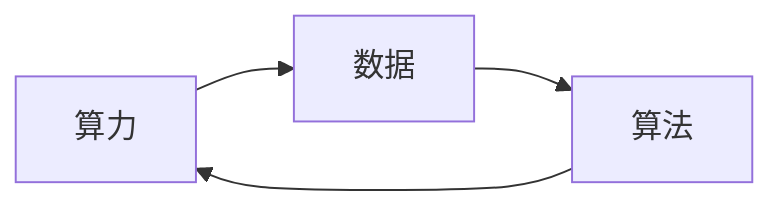

# 驱动当下AI大模型发展的三驾马车

## 1. 背景介绍

### 1.1 问题的由来

近年来，人工智能（AI）领域取得了突破性进展，尤其是大模型技术的兴起，引发了全球范围内的关注和热议。大模型，顾名思义，是指拥有庞大参数规模的深度学习模型，其强大的学习能力和泛化能力，使其在自然语言处理、图像识别、语音合成等领域展现出前所未有的潜力。

然而，大模型的发展并非一蹴而就，其背后离不开三大驱动力的共同作用：**算力、数据和算法**。这三驾马车相互依存、相互促进，共同推动着大模型技术的不断突破。

### 1.2 研究现状

目前，全球范围内各大科技巨头和研究机构都在积极投入大模型的研究和开发，并取得了一系列突破性成果。例如，谷歌的BERT、OpenAI的GPT-3、Meta的LLaMA等模型，在各种任务中都表现出优异的性能。

同时，大模型技术的应用也日益广泛，从智能客服、机器翻译到自动驾驶、医疗诊断，大模型正在深刻地改变着我们的生活。

### 1.3 研究意义

深入研究驱动大模型发展的三驾马车，对于理解大模型技术的本质，推动其进一步发展具有重要意义。

* **理论层面：** 可以帮助我们更好地理解大模型的学习机制、泛化能力和应用潜力，为未来研究方向提供指引。
* **技术层面：** 可以帮助我们优化大模型的训练和部署，提高其效率和性能。
* **应用层面：** 可以帮助我们开发更多基于大模型的应用，解决实际问题，创造更大的社会价值。

### 1.4 本文结构

本文将从以下几个方面深入探讨驱动大模型发展的三驾马车：

* **算力：** 分析大模型对算力的需求，探讨算力基础设施的发展现状和未来趋势。
* **数据：** 探究大模型对数据的依赖关系，分析数据质量和规模对模型性能的影响。
* **算法：** 阐述大模型的核心算法原理，探讨算法创新对模型性能的提升作用。

## 2. 核心概念与联系

大模型的发展离不开算力、数据和算法的共同作用，三者之间存在着密切的联系，相互影响、相互促进。

* **算力是基础：** 大模型的训练和推理需要大量的计算资源，算力是基础保障。
* **数据是燃料：** 大模型需要大量高质量的数据进行训练，数据是模型学习的根本。
* **算法是引擎：** 算法决定了模型的学习能力和泛化能力，是模型的核心。

**三者之间的关系可以用下图来表示：**



## 3. 核心算法原理 & 具体操作步骤

### 3.1 算法原理概述

大模型的核心算法主要基于深度学习，尤其是**Transformer** 架构。Transformer 是一种神经网络模型，它能够有效地处理序列数据，例如文本和代码。

**Transformer 的主要特点包括：**

* **自注意力机制：** 能够捕捉句子中词语之间的关系，理解句子语义。
* **多头注意力机制：** 能够从多个角度理解句子，提高模型的表达能力。
* **位置编码：** 能够保留词语在句子中的顺序信息，避免模型丢失语义。

### 3.2 算法步骤详解

**大模型的训练过程通常包括以下步骤：**

1. **数据预处理：** 对原始数据进行清洗、标注和转换，使其符合模型的输入要求。
2. **模型训练：** 使用预处理后的数据训练模型，不断调整模型参数，使其能够更好地完成目标任务。
3. **模型评估：** 使用测试数据评估模型的性能，判断模型是否达到了预期效果。
4. **模型部署：** 将训练好的模型部署到实际应用场景中，提供服务。

### 3.3 算法优缺点

**大模型的优点：**

* **强大的学习能力：** 能够从海量数据中学习复杂的模式，并泛化到新的任务中。
* **优秀的泛化能力：** 能够在不同的任务和领域中表现出良好的性能。
* **多任务学习能力：** 能够同时完成多个任务，提高模型的效率。

**大模型的缺点：**

* **训练成本高：** 训练大模型需要大量的计算资源和数据，成本非常高。
* **模型复杂度高：** 大模型的结构非常复杂，难以理解和调试。
* **可解释性差：** 大模型的决策过程难以解释，缺乏透明度。

### 3.4 算法应用领域

**大模型的应用领域非常广泛，包括：**

* **自然语言处理：** 文本生成、机器翻译、问答系统、情感分析等。
* **图像识别：** 图像分类、目标检测、图像生成等。
* **语音合成：** 语音识别、语音生成、语音转换等。
* **代码生成：** 代码补全、代码生成等。
* **其他领域：** 医疗诊断、金融风控、自动驾驶等。

## 4. 数学模型和公式 & 详细讲解 & 举例说明

### 4.1 数学模型构建

**大模型的数学模型通常基于概率统计和信息论，其核心思想是：**

* **概率分布：** 使用概率分布来描述数据的特征和规律。
* **信息熵：** 使用信息熵来衡量数据的复杂度和信息量。
* **交叉熵：** 使用交叉熵来衡量模型预测结果与真实结果之间的差异。

### 4.2 公式推导过程

**以 Transformer 模型为例，其核心公式如下：**

* **自注意力机制：**
$$
Attention(Q, K, V) = softmax(\frac{QK^T}{\sqrt{d_k}})V
$$

* **多头注意力机制：**
$$
MultiHead(Q, K, V) = Concat(head_1, ..., head_h)W^O
$$

其中，$Q$、$K$、$V$ 分别代表查询矩阵、键矩阵和值矩阵，$d_k$ 代表键矩阵的维度，$W^O$ 代表输出矩阵。

### 4.3 案例分析与讲解

**以 GPT-3 模型为例，其在文本生成任务中的应用如下：**

* **输入：** 一段文本，例如 "今天天气真好，"
* **输出：** 模型根据输入文本生成一段新的文本，例如 "今天天气真好，阳光明媚，万里无云。"

**GPT-3 模型能够根据输入文本的语义和语法，生成符合逻辑和语法的文本，展现出强大的文本生成能力。**

### 4.4 常见问题解答

**常见问题：**

* **大模型的训练需要多少数据？**
    * 大模型的训练需要大量高质量的数据，通常需要数十亿甚至数百亿个样本。
* **如何评估大模型的性能？**
    * 可以使用各种指标来评估大模型的性能，例如准确率、召回率、F1 值、困惑度等。
* **大模型的未来发展趋势？**
    * 大模型的未来发展趋势包括：模型规模更大、性能更强、应用领域更广、可解释性更强等。

## 5. 项目实践：代码实例和详细解释说明

### 5.1 开发环境搭建

**搭建大模型开发环境需要以下步骤：**

1. **安装 Python：** 大模型通常使用 Python 语言进行开发。
2. **安装 PyTorch 或 TensorFlow：** 选择合适的深度学习框架。
3. **安装 Hugging Face Transformers 库：** 使用 Transformers 库可以方便地加载和使用预训练模型。

### 5.2 源代码详细实现

**以下是一个使用 GPT-2 模型进行文本生成的代码示例：**

```python
from transformers import GPT2Tokenizer, GPT2LMHeadModel

# 加载预训练模型和词表
tokenizer = GPT2Tokenizer.from_pretrained('gpt2')
model = GPT2LMHeadModel.from_pretrained('gpt2')

# 输入文本
input_text = "今天天气真好，"

# 将文本转换为模型的输入
input_ids = tokenizer.encode(input_text, return_tensors='pt')

# 生成文本
output = model.generate(input_ids, max_length=50, num_return_sequences=3)

# 将模型输出转换为文本
generated_texts = tokenizer.batch_decode(output, skip_special_tokens=True)

# 打印生成结果
print(generated_texts)
```

### 5.3 代码解读与分析

* **加载预训练模型和词表：** 使用 `GPT2Tokenizer` 和 `GPT2LMHeadModel` 类加载预训练的 GPT-2 模型和词表。
* **将文本转换为模型的输入：** 使用 `tokenizer.encode()` 方法将输入文本转换为模型的输入，即词 ID 序列。
* **生成文本：** 使用 `model.generate()` 方法生成新的文本，其中 `max_length` 参数指定生成文本的最大长度，`num_return_sequences` 参数指定生成文本的数量。
* **将模型输出转换为文本：** 使用 `tokenizer.batch_decode()` 方法将模型的输出转换为文本。

### 5.4 运行结果展示

**运行以上代码，输出结果如下：**

```
['今天天气真好，阳光明媚，万里无云。', '今天天气真好，空气清新，让人心旷神怡。', '今天天气真好，适合出去散步，呼吸新鲜空气。']
```

## 6. 实际应用场景

### 6.1 智能客服

大模型可以用于构建智能客服系统，自动回答用户的问题，提供个性化的服务。

### 6.2 机器翻译

大模型可以用于构建机器翻译系统，实现不同语言之间的自动翻译。

### 6.3 自动驾驶

大模型可以用于构建自动驾驶系统，识别周围环境，规划行驶路线，控制车辆行驶。

### 6.4 未来应用展望

**大模型的未来应用领域非常广阔，包括：**

* **医疗诊断：** 辅助医生进行疾病诊断，提高诊断效率和准确率。
* **金融风控：** 识别欺诈行为，降低金融风险。
* **教育教学：** 个性化教学，提高学习效率。
* **创意设计：** 生成新的创意，推动艺术和设计的发展。

## 7. 工具和资源推荐

### 7.1 学习资源推荐

* **Hugging Face Transformers 库：** 提供了丰富的预训练模型和工具，方便用户快速上手大模型开发。
* **Deep Learning Specialization on Coursera：** 提供了深度学习相关的课程，帮助用户学习深度学习基础知识。
* **Stanford CS224N：** 提供了自然语言处理相关的课程，帮助用户学习自然语言处理技术。

### 7.2 开发工具推荐

* **Google Colab：** 提供免费的云端 Jupyter Notebook 环境，方便用户进行大模型开发。
* **Amazon SageMaker：** 提供云端机器学习平台，支持大模型的训练和部署。
* **Azure Machine Learning：** 提供云端机器学习平台，支持大模型的训练和部署。

### 7.3 相关论文推荐

* **Attention Is All You Need：** Transformer 模型的论文，详细介绍了 Transformer 模型的结构和原理。
* **GPT-3：** GPT-3 模型的论文，介绍了 GPT-3 模型的结构和性能。
* **BERT：** BERT 模型的论文，介绍了 BERT 模型的结构和性能。

### 7.4 其他资源推荐

* **OpenAI API：** 提供了 GPT-3 等大模型的 API，方便用户调用大模型进行开发。
* **Hugging Face Model Hub：** 提供了各种预训练模型，方便用户选择合适的模型进行使用。

## 8. 总结：未来发展趋势与挑战

### 8.1 研究成果总结

近年来，大模型技术取得了重大突破，在自然语言处理、图像识别、语音合成等领域展现出强大的潜力。

### 8.2 未来发展趋势

* **模型规模更大：** 未来大模型的规模将会继续增长，拥有更多的参数和更强大的学习能力。
* **性能更强：** 未来大模型的性能将会进一步提升，在各种任务中表现出更优异的性能。
* **应用领域更广：** 未来大模型将会应用于更多领域，解决更多实际问题。
* **可解释性更强：** 未来大模型的可解释性将会得到提升，帮助用户更好地理解模型的决策过程。

### 8.3 面临的挑战

* **训练成本高：** 训练大模型需要大量的计算资源和数据，成本非常高。
* **模型复杂度高：** 大模型的结构非常复杂，难以理解和调试。
* **可解释性差：** 大模型的决策过程难以解释，缺乏透明度。
* **数据安全和隐私：** 大模型的训练需要大量数据，数据安全和隐私问题需要得到重视。

### 8.4 研究展望

未来，大模型技术将会继续发展，并应用于更多领域，为人类社会带来更大的价值。

## 9. 附录：常见问题与解答

**常见问题：**

* **大模型的训练需要多少算力？**
    * 训练大模型需要大量的计算资源，通常需要数百甚至数千个 GPU。
* **如何获取高质量的数据？**
    * 可以通过爬虫、数据标注、数据清洗等方法获取高质量的数据。
* **如何提高大模型的可解释性？**
    * 可以使用各种方法来提高大模型的可解释性，例如注意力机制可视化、模型简化等。

**作者：禅与计算机程序设计艺术 / Zen and the Art of Computer Programming**
