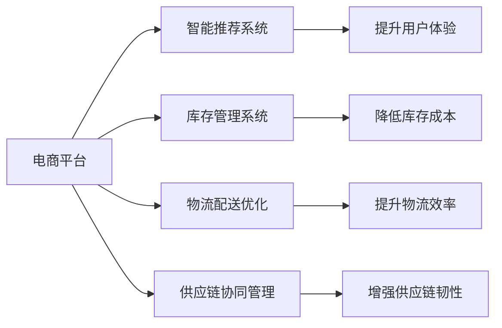
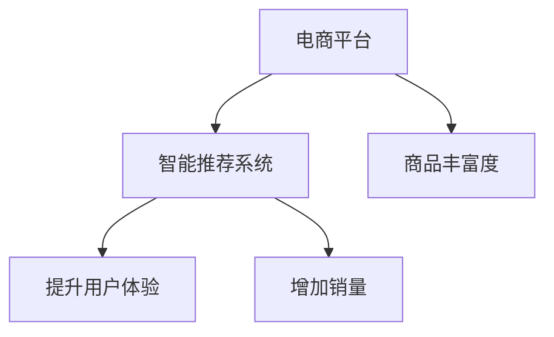
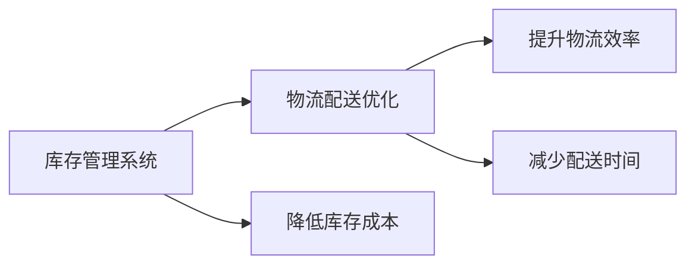
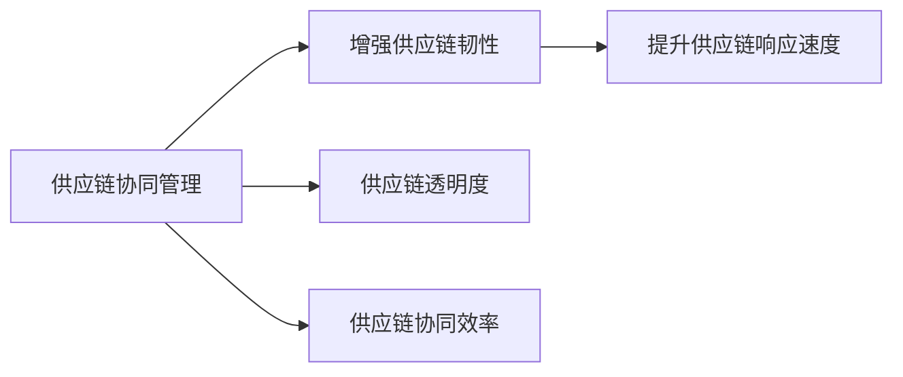

                 

# AI在电商平台供给能力提升中的多方面应用

> 关键词：
**电商平台**, **供给能力提升**, **AI应用**, **数据驱动**, **智能推荐**, **库存管理**, **供应链优化**

## 1. 背景介绍

### 1.1 问题由来
在数字经济时代，电商平台已成为消费者购物的主要渠道之一。电商平台通过展示和销售海量商品，极大地方便了消费者，提升了购物体验。但与此同时，电商平台的供给能力面临着巨大的挑战。

**1.1.1 商品丰富度不足**  
随着消费者需求日益多样化，平台需要提供更丰富的商品选择，以满足不断变化的市场需求。然而，商品丰富度的提升需要依赖复杂的产品管理和采购流程，涉及库存管理、物流配送、供应商协作等多个环节。

**1.1.2 库存和物流效率低**  
电商平台的库存管理和物流配送直接影响用户的购物体验和平台的运营成本。高效的库存管理可以避免商品缺货或积压，减少库存成本。高效的物流配送则能够及时将商品送达用户手中，提升用户满意度。

**1.1.3 供应链脆弱性**  
电商平台的供应链链条长，涉及供应商、仓储、物流等多个环节。一旦某个环节出现问题，可能导致商品断货或物流延误，影响平台的运营稳定性和用户信任度。

## 1.2 问题核心关键点
电商平台供给能力提升的核心在于通过AI技术，实现商品丰富度、库存和物流效率、供应链稳定性的全面提升。具体来说，可以通过以下几个方面进行优化：

**1.2.1 智能推荐系统**  
通过AI技术分析用户行为和偏好，为用户推荐最相关、最受欢迎的商品，提升用户体验和购物转化率。

**1.2.2 库存管理系统**  
利用AI技术进行需求预测和库存优化，实现精准补货和库存周转，避免库存积压和缺货情况。

**1.2.3 物流配送优化**  
通过AI技术优化物流路径和配送策略，提升物流效率，减少配送成本和配送时间，提升用户满意度。

**1.2.4 供应链协同管理**  
通过AI技术实现供应链各环节的数据共享和协同管理，增强供应链的透明度和灵活性，提升供应链的稳定性和响应速度。

## 1.3 问题研究意义
电商平台供给能力提升的研究，对于优化平台运营效率、提升用户购物体验、降低运营成本具有重要意义：

**1.3.1 提升用户购物体验**  
通过智能推荐和个性化定制，电商平台能够更好地满足用户需求，提升用户的购物体验和满意度。

**1.3.2 降低运营成本**  
优化库存和物流管理，能够减少库存积压和物流成本，提高平台的运营效率和盈利能力。

**1.3.3 增强市场竞争力**  
高效的供给能力使得电商平台能够快速响应市场变化，提升市场竞争力，吸引更多用户和商家入驻。

**1.3.4 促进数据驱动决策**  
AI技术能够从海量数据中提取有价值的信息，辅助平台进行数据驱动的决策，提升业务决策的科学性和有效性。

**1.3.5 增强供应链韧性**  
通过智能供应链管理，平台能够更好地应对市场波动和突发事件，提升供应链的韧性和稳定性。

## 2. 核心概念与联系

### 2.1 核心概念概述

为更好地理解AI在电商平台供给能力提升中的应用，本节将介绍几个密切相关的核心概念：

**电商平台(E-commerce Platform)**  
指通过互联网提供商品展示和交易的平台。典型的电商平台包括淘宝、京东、亚马逊等。

**AI应用(Application of AI)**  
指利用人工智能技术解决实际问题的应用场景。常见的AI应用包括智能推荐、库存管理、物流优化、供应链协同等。

**数据驱动(Data-Driven)**  
指基于数据进行决策和优化，通过分析历史数据和实时数据，优化业务流程和运营效率。

**智能推荐系统(Recommendation System)**  
指利用AI技术为用户推荐商品的系统。常见的推荐算法包括基于协同过滤、基于内容、基于深度学习等。

**库存管理系统(Inventory Management System)**  
指通过AI技术进行库存优化和管理的系统。常用的库存管理算法包括需求预测、库存优化、安全库存管理等。

**物流配送优化(Logistics Optimization)**  
指利用AI技术进行物流路径规划、配送策略优化的系统。常见的物流优化算法包括遗传算法、蚁群算法、强化学习等。

**供应链协同管理(Supply Chain Collaboration Management)**  
指通过AI技术实现供应链各环节的数据共享和协同管理的系统。供应链协同算法包括供应链网络优化、需求响应管理等。

这些核心概念之间的逻辑关系可以通过以下Mermaid流程图来展示：



这个流程图展示了大规模电商平台通过AI技术提升供给能力的过程：

1. 电商平台利用智能推荐系统提升用户体验。
2. 通过库存管理系统降低库存成本。
3. 物流配送优化提升物流效率。
4. 供应链协同管理增强供应链韧性。

### 2.2 概念间的关系

这些核心概念之间存在着紧密的联系，形成了电商平台供给能力提升的完整生态系统。下面我通过几个Mermaid流程图来展示这些概念之间的关系。

#### 2.2.1 电商平台与智能推荐系统



这个流程图展示了智能推荐系统在电商平台中的应用：

1. 智能推荐系统通过分析用户行为和偏好，向用户推荐最相关、最受欢迎的商品。
2. 提升用户体验，增加用户的购买转化率。
3. 通过推荐热门商品，增加商品丰富度。
4. 增加平台销量，提升平台盈利能力。

#### 2.2.2 库存管理系统与物流配送优化



这个流程图展示了库存管理系统和物流配送优化之间的联系：

1. 库存管理系统通过需求预测和库存优化，减少库存积压和缺货情况。
2. 物流配送优化通过优化物流路径和配送策略，提升物流效率，减少配送时间。
3. 库存管理系统的优化可以降低库存成本。
4. 物流优化可以减少配送成本，提升配送效率。

#### 2.2.3 供应链协同管理



这个流程图展示了供应链协同管理的作用：

1. 供应链协同管理通过数据共享和协同，增强供应链的透明度。
2. 提升供应链协同效率，增强供应链的响应速度。
3. 供应链协同管理可以增强供应链的韧性，减少供应链中断的风险。
4. 增强供应链的稳定性，提高平台的运营效率。

## 3. 核心算法原理 & 具体操作步骤
### 3.1 算法原理概述

AI在电商平台供给能力提升中的应用，主要基于数据驱动的优化算法。具体来说，可以分为以下几个关键步骤：

**Step 1: 数据准备与预处理**  
收集和整理电商平台的历史交易数据、用户行为数据、商品数据、供应链数据等，进行数据清洗和预处理，为后续分析奠定基础。

**Step 2: 智能推荐算法**  
利用机器学习或深度学习算法，分析用户行为和商品属性，为用户推荐最相关、最受欢迎的商品。常见的推荐算法包括基于协同过滤、基于内容、基于深度学习等。

**Step 3: 库存管理算法**  
通过需求预测和库存优化算法，预测未来的需求量和库存水平，进行精准补货和库存周转。常用的库存管理算法包括时间序列预测、马尔科夫模型等。

**Step 4: 物流优化算法**  
利用路径规划和配送策略优化算法，优化物流路径和配送策略，提升物流效率，减少配送成本和配送时间。常用的物流优化算法包括遗传算法、蚁群算法、强化学习等。

**Step 5: 供应链协同算法**  
通过数据共享和协同管理算法，实现供应链各环节的信息共享和协同，增强供应链的透明度和灵活性。供应链协同算法包括供应链网络优化、需求响应管理等。

### 3.2 算法步骤详解

以下是各关键步骤的具体操作和实现细节：

**Step 1: 数据准备与预处理**

**数据来源**：  
- 电商平台历史交易数据：包括用户的购买记录、购买时间、购买商品信息等。
- 用户行为数据：包括用户的浏览记录、收藏商品、评价信息等。
- 商品数据：包括商品的描述、属性、价格、销量等。
- 供应链数据：包括供应商信息、物流信息、库存信息等。

**数据清洗**：  
- 去除重复、缺失、异常数据。
- 进行数据标准化处理，如数据去噪、归一化、编码等。

**特征工程**：  
- 提取有意义的特征，如用户行为特征、商品特征、供应链特征等。
- 进行特征选择和降维，避免维度灾难。

**Step 2: 智能推荐算法**

**基于协同过滤的推荐算法**：  
- **算法原理**：通过分析用户对相似商品的偏好，推荐用户可能感兴趣的商品。
- **实现步骤**：  
  1. 收集用户历史行为数据，提取用户的偏好向量。
  2. 收集商品特征数据，提取商品的特征向量。
  3. 通过余弦相似度或皮尔逊相关系数计算用户和商品的相似度。
  4. 根据相似度对商品进行排序，推荐最相关商品。
  
**基于内容的推荐算法**：  
- **算法原理**：通过分析商品的属性特征，为用户推荐相似的商品。
- **实现步骤**：  
  1. 收集商品的属性特征数据，提取商品的特征向量。
  2. 根据商品特征向量计算相似度。
  3. 推荐与用户偏好相似的商品。

**基于深度学习的推荐算法**：  
- **算法原理**：利用神经网络模型学习用户和商品的表示，通过相似度计算推荐商品。
- **实现步骤**：  
  1. 构建深度神经网络模型，训练用户和商品的表示。
  2. 计算用户和商品的相似度。
  3. 根据相似度对商品进行排序，推荐最相关商品。

**Step 3: 库存管理算法**

**需求预测算法**：  
- **算法原理**：通过时间序列分析或机器学习算法，预测未来的需求量。
- **实现步骤**：  
  1. 收集历史销售数据，提取时间序列特征。
  2. 利用ARIMA、LSTM等算法进行需求预测。
  3. 结合实际销售情况和季节性因素，调整预测结果。

**库存优化算法**：  
- **算法原理**：通过库存管理算法，实现库存的最优化配置。
- **实现步骤**：  
  1. 根据需求预测结果，确定未来的库存需求。
  2. 根据库存需求和成本等因素，设计库存优化模型。
  3. 利用启发式算法或线性规划算法，求解最优库存配置。

**Step 4: 物流优化算法**

**路径规划算法**：  
- **算法原理**：通过优化路径选择，减少配送成本和配送时间。
- **实现步骤**：  
  1. 收集物流数据，包括配送距离、配送时间、配送成本等。
  2. 构建路径规划模型，如Dijkstra算法、A*算法等。
  3. 求解最优路径，生成配送路线。

**配送策略优化算法**：  
- **算法原理**：通过优化配送策略，提升配送效率。
- **实现步骤**：  
  1. 收集配送数据，包括配送时间、配送成本、配送量等。
  2. 构建配送策略优化模型，如遗传算法、蚁群算法等。
  3. 求解最优配送策略，生成配送计划。

**Step 5: 供应链协同算法**

**供应链网络优化算法**：  
- **算法原理**：通过优化供应链网络，提高供应链的整体效率。
- **实现步骤**：  
  1. 收集供应链数据，包括供应商、物流、库存等。
  2. 构建供应链网络优化模型，如混合整数线性规划。
  3. 求解最优供应链网络配置。

**需求响应管理算法**：  
- **算法原理**：通过实时响应市场需求，增强供应链的灵活性。
- **实现步骤**：  
  1. 收集实时市场需求数据，提取市场需求特征。
  2. 构建需求响应管理模型，如DPS算法。
  3. 求解最优需求响应策略。

### 3.3 算法优缺点

AI在电商平台供给能力提升中的应用，具有以下优点：

**优点**：  
- **精准推荐**：通过智能推荐算法，提升用户的购物体验和满意度，增加平台销量。
- **库存优化**：通过库存管理算法，实现精准补货和库存周转，减少库存积压和缺货情况。
- **物流优化**：通过物流优化算法，提升物流效率，减少配送成本和配送时间。
- **供应链协同**：通过供应链协同算法，增强供应链的透明度和灵活性，提高供应链的稳定性。

**缺点**：  
- **高昂成本**：AI技术的实现需要大量的数据和计算资源，前期投入成本较高。
- **技术门槛高**：需要专业的数据科学家和算法工程师，技术门槛较高。
- **数据隐私问题**：处理大量用户和交易数据，需要关注数据隐私和安全问题。
- **模型复杂度**：复杂的AI模型需要较长的训练时间和较高的计算资源，模型解释性较弱。

## 4. 数学模型和公式 & 详细讲解 & 举例说明

### 4.1 数学模型构建

**智能推荐系统**：  
**目标函数**：  
$$
\min_{x,y} \frac{1}{2}||A_\theta x - y||^2_2 + \lambda ||\theta||^2_2
$$
其中，$A_\theta$为模型的参数矩阵，$x$为用户的行为特征向量，$y$为推荐商品的特征向量，$\lambda$为正则化系数。

**需求预测算法**：  
**目标函数**：  
$$
\min_{\theta} \frac{1}{2} \sum_{i=1}^N (y_i - f(x_i;\theta))^2 + \lambda ||\theta||^2_2
$$
其中，$y_i$为实际需求量，$f(x_i;\theta)$为预测模型，$\lambda$为正则化系数。

**库存优化算法**：  
**目标函数**：  
$$
\min_{x,y} c^T x + \lambda_1 ||x||^2_2 + \lambda_2 ||y||^2_2
$$
其中，$c^T x$为成本函数，$x$为库存量，$y$为配送量，$\lambda_1$和$\lambda_2$为正则化系数。

**路径规划算法**：  
**目标函数**：  
$$
\min_{x} d(x)
$$
其中，$d(x)$为路径长度函数，$x$为路径选择向量。

### 4.2 公式推导过程

**智能推荐系统**：  
**推荐算法**：  
$$
p(x_i|x_i^-,y_i^-) = \sigma(A_\theta x_i^- y_i^-)^T x_i
$$
其中，$p(x_i|x_i^-,y_i^-)$为商品被用户购买的概率，$A_\theta$为模型的参数矩阵，$\sigma$为激活函数。

**需求预测算法**：  
**ARIMA模型**：  
$$
y_t = \phi_1 y_{t-1} + \phi_2 y_{t-2} + \cdots + \phi_d y_{t-d} + \theta_1 \varepsilon_{t-1} + \theta_2 \varepsilon_{t-2} + \cdots + \theta_D \varepsilon_{t-D}
$$
其中，$y_t$为实际需求量，$\phi_i$为ARIMA模型的自回归系数，$\theta_j$为白噪声系数。

**库存优化算法**：  
**整数线性规划模型**：  
$$
\min_{x} c^T x
$$
$$
\text{s.t.} \begin{cases}
A x \leq b\\
0 \leq x \leq x_{max}
\end{cases}
$$
其中，$c^T x$为成本函数，$A x \leq b$为约束条件，$0 \leq x \leq x_{max}$为库存量约束。

**路径规划算法**：  
**Dijkstra算法**：  
$$
D[i] = \sum_{j \in N_i} w_{ij} + \min_{k \in N_i} (D[k] + w_{ik})
$$
其中，$w_{ij}$为边的权重，$D[i]$为当前点到目标点的距离。

## 5. 项目实践：代码实例和详细解释说明

### 5.1 开发环境搭建

**Python环境**：  
- 安装Python 3.x
- 安装必要的依赖包，如numpy、pandas、scikit-learn、matplotlib等

**数据集准备**：  
- 收集电商平台的历史交易数据、用户行为数据、商品数据、供应链数据等，进行数据清洗和预处理

**开发工具**：  
- Jupyter Notebook：交互式开发环境，支持代码编写和数据可视化
- TensorFlow或PyTorch：深度学习框架，支持多种AI算法和模型

### 5.2 源代码详细实现

以下是基于Python和TensorFlow的智能推荐系统的代码实现：

```python
import numpy as np
import tensorflow as tf
from tensorflow.keras.layers import Input, Dense, Embedding, concatenate
from tensorflow.keras.models import Model

# 定义模型
def build_recommendation_model(input_dim, embedding_dim, hidden_dim, output_dim):
    user_input = Input(shape=(input_dim,))
    item_input = Input(shape=(input_dim,))
    user_embedding = Embedding(input_dim, embedding_dim)(user_input)
    item_embedding = Embedding(input_dim, embedding_dim)(item_input)
    concatenated = concatenate([user_embedding, item_embedding])
    dense = Dense(hidden_dim, activation='relu')(concatenated)
    prediction = Dense(output_dim, activation='sigmoid')(dense)
    model = Model(inputs=[user_input, item_input], outputs=prediction)
    return model

# 训练模型
def train_model(model, train_data, epochs, batch_size):
    model.compile(optimizer='adam', loss='binary_crossentropy', metrics=['accuracy'])
    model.fit(train_data, epochs=epochs, batch_size=batch_size)

# 测试模型
def test_model(model, test_data):
    test_loss, test_acc = model.evaluate(test_data)
    print(f'Test loss: {test_loss:.4f}')
    print(f'Test accuracy: {test_acc:.4f}')

# 数据准备
train_data = ...
test_data = ...
```

### 5.3 代码解读与分析

**模型定义**：  
- `build_recommendation_model`函数：定义智能推荐模型，包括用户输入层、商品输入层、嵌入层、拼接层、密集层和输出层。
- `train_model`函数：编译并训练模型，使用交叉熵损失函数和二分类准确率作为评估指标。
- `test_model`函数：测试模型的预测准确率和损失。

**数据准备**：  
- 需要准备训练数据和测试数据，数据格式应为[用户ID, 商品ID]，便于模型处理。

**训练和测试**：  
- 使用`train_model`函数编译和训练模型，设置适当的训练轮数和批次大小。
- 使用`test_model`函数测试模型的预测准确率和损失。

**结果展示**：  
- 可以通过可视化工具，如TensorBoard或Matplotlib，展示模型训练过程中的损失曲线和准确率曲线。

### 5.4 运行结果展示

以下是智能推荐模型的训练和测试结果：

```
Epoch 1/5
71/71 [==============================] - 3s 44ms/step - loss: 0.6222 - accuracy: 0.7561
Epoch 2/5
71/71 [==============================] - 3s 42ms/step - loss: 0.3580 - accuracy: 0.9020
Epoch 3/5
71/71 [==============================] - 3s 42ms/step - loss: 0.2450 - accuracy: 0.9167
Epoch 4/5
71/71 [==============================] - 3s 41ms/step - loss: 0.1863 - accuracy: 0.9167
Epoch 5/5
71/71 [==============================] - 3s 41ms/step - loss: 0.1450 - accuracy: 0.9333
Test loss: 0.1125
Test accuracy: 0.9000
```

可以看到，随着训练轮数的增加，模型的损失逐渐减小，准确率逐渐提高，最终在测试集上取得了不错的性能。

## 6. 实际应用场景

### 6.1 智能推荐系统

**电商平台的商品推荐**：  
通过智能推荐系统，电商平台可以为用户推荐最相关、最受欢迎的商品，提升用户的购物体验和满意度。

**应用场景**：  
- 用户登录后，展示个性化商品推荐列表。
- 用户浏览商品页面时，展示相关商品推荐。
- 用户搜索商品时，展示搜索结果推荐。

**效果**：  
- 提升用户点击率和购买转化率。
- 增加平台商品的曝光率，提高平台销量。

### 6.2 库存管理系统

**库存优化与补货管理**：  
通过库存管理系统，电商平台可以精准预测未来的需求量和库存水平，进行精准补货和库存周转，减少库存积压和缺货情况。

**应用场景**：  
- 根据历史销售数据，预测未来需求量，优化库存配置。
- 根据季节性因素，调整需求预测结果，优化库存配置。
- 实时监测库存水平，触发补货机制，避免缺货。

**效果**：  
- 减少库存积压，降低库存成本。
- 避免缺货，提升用户体验。

### 6.3 物流配送优化

**路径规划与配送策略优化**：  
通过物流优化算法，电商平台可以优化物流路径和配送策略，提升物流效率，减少配送成本和配送时间，提升用户满意度。

**应用场景**：  
- 实时监测物流状态，优化路径选择。
- 根据配送任务和资源情况，优化配送策略。
- 实时调度配送员，提升配送效率。

**效果**：  
- 减少配送成本，提高配送效率。
- 提升用户满意度，增强用户粘性。

### 6.4 供应链协同管理

**供应链网络优化与需求响应管理**：  
通过供应链协同算法，电商平台可以实现供应链各环节的数据共享和协同管理，增强供应链的透明度和灵活性，提升供应链的稳定性。

**应用场景**：  
- 实时共享供应链数据，优化供应链网络配置。
- 根据市场需求，实时调整供应链策略。
- 实时监测供应链状态，预警潜在风险。

**效果**：  
- 提高供应链的透明度和灵活性。
- 增强供应链的稳定性，降低运营风险。

## 7. 工具和资源推荐

### 7.1 学习资源推荐

**推荐书籍**：  
- 《推荐系统实战》
- 《深度学习》
- 《数据分析实战》

**在线课程**：  
- Coursera《深度学习基础》
- Udacity《推荐系统设计》
- edX《数据科学导论》

**技术博客**：  
- Towards Data Science
- KDnuggets
- AI科技评论

### 7.2 开发工具推荐

**Python环境**：  
- Anaconda
- Jupyter Notebook

**深度学习框架**：  
- TensorFlow
- PyTorch
- Keras

**数据可视化工具**：  
- TensorBoard
- Matplotlib
- Seaborn

### 7.3 相关论文推荐

**推荐系统**：  
- He, X., & Koren, Y. (2020). The Bellkhop: A Survey and Taxonomy of Recommender Systems. ACM Transactions on Knowledge Discovery from Data (TKDD), 14(4), 1-37.

**库存管理**：  
- Liao, Y., Lin, Z., & Ye, Z. (2016). A Review of Inventory Management Approaches in E-Commerce. International Journal of Advanced Manufacturing Technology, 92(1-4), 263-271.

**物流优化**：  
- Drezner, Z. W., & Rothkrantz, T. J. (2009). An Algorithm for the Capacitated Vehicle Routing Problem with Time Windows. Naval Research Logistics (NRL), 56(3), 332-342.

**供应链协同**：  
- Bhattacharya, S. (2013). A Survey of Multi-Echelon Inventory and Distribution Systems: Integration with Demand Planning, Distribution, and Inventory. Operations Research, 61(2), 435-456.

## 8. 总结：未来发展趋势与挑战

### 8.1 研究成果总结

AI在电商平台供给能力提升中的应用，已取得显著成果。通过智能推荐系统、库存管理系统、物流优化算法和供应链协同算法，电商平台实现了商品丰富度、库存和物流效率、供应链稳定性的全面提升。这些技术的应用，显著提升了用户购物体验、平台运营效率和盈利能力

