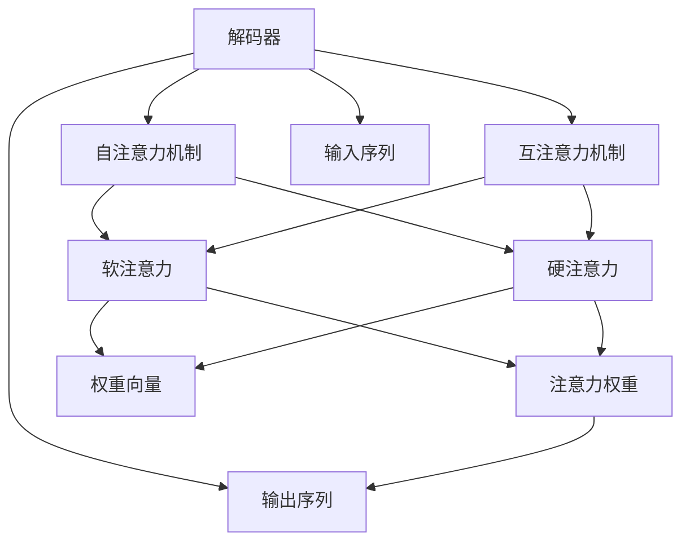

                 

# 从零开始大模型开发与微调：解码器的核心—注意力模型

> 关键词：大模型, 注意力机制, 解码器, 自回归模型, 掩码语言模型, 注意力权重, 软注意力, 硬注意力, 自注意力, 互注意力, Transformer模型

## 1. 背景介绍

### 1.1 问题由来
自2017年Transformer模型问世以来，大语言模型（Large Language Models, LLMs）在自然语言处理（NLP）领域取得了显著进展。其中，最为人熟知的BERT模型通过掩码语言模型预训练和下一层token级别的分类器微调，实现了零样本和少样本学习，推动了NLP技术的突破性应用。然而，随着大模型的不断壮大，它们的参数量也呈现爆炸性增长，单模型的内存和计算资源消耗巨大，难以直接部署到实际应用场景中。因此，如何在大模型开发和微调过程中实现计算效率与性能的平衡，成为当前研究的重要方向。

### 1.2 问题核心关键点
解码器作为Transformer模型中的核心部分，主要负责对输入序列进行自回归解码，生成目标序列。解码器通过注意力机制（Attention Mechanism），计算输入序列与输出序列之间的关联，并利用这些关联来生成当前位置的输出词。其中，注意力机制分为自注意力（Self-Attention）和互注意力（Cross-Attention）两种形式，它们分别用于处理当前位置与其他位置的关联，以及与其他序列位置的关联。这些机制的实现方式和计算复杂度，直接影响了大模型的开发和微调效率。

### 1.3 问题研究意义
深入理解解码器中的注意力机制，对于优化大模型的开发和微调过程，提升模型的计算效率和性能，具有重要意义。这不仅能够降低大模型的部署成本，还能在保证性能的前提下，提高模型的训练速度和推理速度，使其更容易被广泛应用于各种NLP任务中。

## 2. 核心概念与联系

### 2.1 核心概念概述

为了更好地理解注意力机制在大模型解码器中的作用，本节将介绍几个关键概念：

- 解码器（Decoder）：Transformer模型中的解码器部分，负责对输入序列进行自回归解码，生成目标序列。
- 注意力机制（Attention Mechanism）：通过计算输入序列与输出序列之间的关联，选择性地关注重要信息，忽略无关信息。
- 自注意力（Self-Attention）：解码器中用于处理当前位置与其他位置的关联，是注意力机制的一种形式。
- 互注意力（Cross-Attention）：解码器中用于处理与其他序列位置的关联，也是注意力机制的一种形式。
- 软注意力（Soft Attention）：基于概率分布计算的注意力，通过计算得分向量来权重化不同位置的关注程度。
- 硬注意力（Hard Attention）：直接选择得分最高的位置作为关注点，决策过程简单直观。
- 自注意力（Self-Attention）：一种基于矩阵运算的注意力机制，通过计算输入序列中不同位置之间的相似度，得到权重向量。
- 互注意力（Cross-Attention）：一种基于矩阵运算的注意力机制，通过计算输入序列与查询序列之间的相似度，得到权重向量。

这些概念之间的逻辑关系可以通过以下Mermaid流程图来展示：



这个流程图展示了解码器、注意力机制和不同注意力形式之间的关系：

1. 解码器中包含自注意力和互注意力两种机制。
2. 自注意力和互注意力分别包含软注意力和硬注意力两种形式。
3. 注意力机制通过计算权重向量来决定关注哪些位置，从而选择性地关注重要信息。

### 2.2 概念间的关系

这些核心概念之间存在着紧密的联系，构成了Transformer模型中解码器的关键架构：

- 解码器通过自注意力和互注意力机制，对输入序列和输出序列进行关联处理。
- 自注意力机制基于输入序列中的不同位置计算得分向量，通过soft attention和hard attention选择关注位置。
- 互注意力机制同样基于输入序列和查询序列计算得分向量，选择关注位置。
- 注意力权重用于计算每个位置的关注程度，权重向量用于加权处理输入序列。

这些概念共同构成了Transformer模型中解码器的核心架构，使得模型能够高效地处理长序列，并生成高质量的输出。

## 3. 核心算法原理 & 具体操作步骤
### 3.1 算法原理概述

基于自回归模型的解码器部分，通过注意力机制对输入序列进行加权处理，计算每个位置的关注权重，从而生成目标序列。在具体实现中，解码器分为自注意力和互注意力两种形式，分别用于处理当前位置与其他位置的关联，以及与其他序列位置的关联。

解码器的自注意力机制计算公式如下：

$$
\text{Attention}(Q, K, V) = \text{Softmax}\left(\frac{Q K^T}{\sqrt{d_k}}\right) V
$$

其中，$Q$、$K$、$V$分别代表查询向量、键向量和值向量，$d_k$为键向量的维度。自注意力机制通过计算输入序列中不同位置之间的相似度，得到权重向量，从而选择关注的位置。

互注意力机制的计算公式如下：

$$
\text{Attention}(Q, K, V) = \text{Softmax}\left(\frac{Q K^T}{\sqrt{d_k}}\right) V
$$

互注意力机制同样基于矩阵运算，通过计算输入序列与查询序列之间的相似度，得到权重向量，从而选择关注的位置。

### 3.2 算法步骤详解

基于自回归模型的解码器部分，包含自注意力和互注意力两种机制。其操作步骤如下：

**Step 1: 准备输入和输出序列**

- 输入序列：由编码器部分输出的隐状态 $H$ 和位置编码 $P$ 组成，即 $X = H + P$。
- 输出序列：由上一步生成的目标序列 $Y$ 和位置编码 $P$ 组成，即 $Y = Y + P$。

**Step 2: 计算查询、键、值向量**

- 对于自注意力机制，计算查询向量 $Q_i$、键向量 $K_i$ 和值向量 $V_i$，分别对应输入序列 $X_i$ 中的每个位置 $i$。
- 对于互注意力机制，计算查询向量 $Q_i$、键向量 $K_i$ 和值向量 $V_i$，分别对应输入序列 $X_i$ 中的每个位置 $i$ 和查询序列 $Y_j$ 中的每个位置 $j$。

**Step 3: 计算注意力权重**

- 对于自注意力机制，计算每个位置 $i$ 的自注意力权重 $a_{ij}$，通过矩阵乘法计算得分向量，并通过softmax函数计算权重向量。
- 对于互注意力机制，计算每个位置 $i$ 的互注意力权重 $a_{ij}$，通过矩阵乘法计算得分向量，并通过softmax函数计算权重向量。

**Step 4: 加权处理输入序列**

- 对于自注意力机制，将权重向量 $a_{ij}$ 乘以值向量 $V_i$，得到加权后的值向量 $V_{i,j}$。
- 对于互注意力机制，将权重向量 $a_{ij}$ 乘以值向量 $V_i$，得到加权后的值向量 $V_{i,j}$。

**Step 5: 输出解码器层**

- 对于自注意力机制，将加权后的值向量 $V_{i,j}$ 输入下一层解码器层，进行线性变换和激活函数操作。
- 对于互注意力机制，将加权后的值向量 $V_{i,j}$ 输入下一层解码器层，进行线性变换和激活函数操作。

通过上述步骤，解码器能够高效地处理长序列，并生成高质量的输出。

### 3.3 算法优缺点

基于自回归模型的解码器部分，具有以下优点：

1. 高效处理长序列。解码器能够通过注意力机制，对长序列进行高效处理，生成高质量的输出。
2. 灵活的注意力机制。解码器包含自注意力和互注意力两种机制，能够根据任务需求灵活选择。
3. 自回归解码。解码器通过自回归的方式进行解码，能够避免输出序列与输入序列之间的依赖性，提高模型鲁棒性。

然而，该算法也存在以下缺点：

1. 计算复杂度高。解码器中包含大量的矩阵运算，计算复杂度较高。
2. 内存消耗大。解码器需要存储大量的中间结果，内存消耗较大。
3. 训练时间长。解码器的训练过程需要消耗大量时间，特别是在处理长序列时。

### 3.4 算法应用领域

基于自回归模型的解码器部分，已经在自然语言处理（NLP）领域得到了广泛应用，特别是在机器翻译、语音识别、对话生成等任务上取得了显著的成果。

在机器翻译任务中，解码器通过对输入序列进行自回归解码，生成目标序列，能够高效地处理长句子，生成高质量的翻译结果。在语音识别任务中，解码器通过对输入音频进行自回归解码，能够实时生成文本输出，具有重要的实际应用价值。在对话生成任务中，解码器通过对输入文本进行自回归解码，能够生成连贯、自然的对话内容，为智能客服、虚拟助手等应用提供了强有力的技术支持。

## 4. 数学模型和公式 & 详细讲解  
### 4.1 数学模型构建

本节将使用数学语言对解码器中的注意力机制进行更加严格的刻画。

记解码器中的输入序列为 $X = \{x_i\}_{i=1}^n$，输出序列为 $Y = \{y_i\}_{i=1}^n$。解码器中的注意力机制可以表示为：

$$
\text{Attention}(Q, K, V) = \text{Softmax}\left(\frac{Q K^T}{\sqrt{d_k}}\right) V
$$

其中，$Q$、$K$、$V$分别代表查询向量、键向量和值向量，$d_k$为键向量的维度。解码器中的自注意力和互注意力机制可以表示为：

$$
\text{Attention}(Q_i, K_j, V_j) = \text{Softmax}\left(\frac{Q_i K_j^T}{\sqrt{d_k}}\right) V_j
$$

其中，$Q_i$、$K_j$、$V_j$分别代表输入序列 $X$ 中的每个位置的查询向量、键向量和值向量，$i$ 和 $j$ 分别表示输入序列和查询序列中的位置。

### 4.2 公式推导过程

以下我们以自注意力机制为例，推导其计算过程。

假设解码器中的自注意力机制的输入向量为 $X = \{x_i\}_{i=1}^n$，输出向量为 $Y = \{y_i\}_{i=1}^n$。对于输入序列中的每个位置 $i$，自注意力机制的计算过程如下：

1. 计算查询向量 $Q_i$：将输入向量 $X_i$ 进行线性变换，得到查询向量 $Q_i$。
2. 计算键向量 $K_i$：将输入向量 $X_i$ 进行线性变换，得到键向量 $K_i$。
3. 计算值向量 $V_i$：将输入向量 $X_i$ 进行线性变换，得到值向量 $V_i$。
4. 计算注意力权重 $a_{ij}$：将查询向量 $Q_i$ 和键向量 $K_j$ 进行矩阵乘法，得到得分向量，并通过softmax函数计算注意力权重 $a_{ij}$。
5. 计算加权后的值向量 $V_{i,j}$：将注意力权重 $a_{ij}$ 和值向量 $V_j$ 进行加权处理，得到加权后的值向量 $V_{i,j}$。
6. 输出解码器层：将加权后的值向量 $V_{i,j}$ 进行线性变换和激活函数操作，得到解码器层的输出。

通过上述推导，可以看到，自注意力机制通过计算输入序列中不同位置之间的相似度，得到权重向量，从而选择关注的位置。这种机制能够有效地处理长序列，生成高质量的输出。

### 4.3 案例分析与讲解

为了更好地理解注意力机制的计算过程，我们以机器翻译任务为例，进行详细讲解。

假设在机器翻译任务中，解码器需要根据输入序列 $X = \{x_i\}_{i=1}^n$ 生成目标序列 $Y = \{y_i\}_{i=1}^n$。解码器通过自注意力机制，对输入序列 $X$ 进行加权处理，生成当前位置的输出词。具体步骤如下：

1. 计算查询向量 $Q_i$：将输入向量 $X_i$ 进行线性变换，得到查询向量 $Q_i$。
2. 计算键向量 $K_j$：将输入向量 $X_j$ 进行线性变换，得到键向量 $K_j$。
3. 计算值向量 $V_j$：将输入向量 $X_j$ 进行线性变换，得到值向量 $V_j$。
4. 计算注意力权重 $a_{ij}$：将查询向量 $Q_i$ 和键向量 $K_j$ 进行矩阵乘法，得到得分向量，并通过softmax函数计算注意力权重 $a_{ij}$。
5. 计算加权后的值向量 $V_{i,j}$：将注意力权重 $a_{ij}$ 和值向量 $V_j$ 进行加权处理，得到加权后的值向量 $V_{i,j}$。
6. 输出解码器层：将加权后的值向量 $V_{i,j}$ 进行线性变换和激活函数操作，得到解码器层的输出。

通过上述步骤，解码器能够高效地处理长序列，并生成高质量的翻译结果。

## 5. 项目实践：代码实例和详细解释说明
### 5.1 开发环境搭建

在进行解码器部分开发前，我们需要准备好开发环境。以下是使用Python进行TensorFlow开发的环境配置流程：

1. 安装Anaconda：从官网下载并安装Anaconda，用于创建独立的Python环境。

2. 创建并激活虚拟环境：
```bash
conda create -n pytorch-env python=3.8 
conda activate pytorch-env
```

3. 安装TensorFlow：根据CUDA版本，从官网获取对应的安装命令。例如：
```bash
conda install tensorflow==2.6.0
```

4. 安装各类工具包：
```bash
pip install numpy pandas scikit-learn matplotlib tqdm jupyter notebook ipython
```

完成上述步骤后，即可在`pytorch-env`环境中开始解码器部分的开发。

### 5.2 源代码详细实现

下面我们以机器翻译任务为例，给出使用TensorFlow实现解码器部分的代码实现。

首先，定义解码器部分的类：

```python
import tensorflow as tf

class Decoder(tf.keras.layers.Layer):
    def __init__(self, d_model, num_layers, dff, attention_heads, attention_dropout, activation):
        super(Decoder, self).__init__()
        self.d_model = d_model
        self.num_layers = num_layers
        
        self.embedding = tf.keras.layers.Embedding(vocab_size, d_model)
        self.pos_encoding = positional_encoding(d_model)
        
        self.encoder_self_attn = MultiHeadAttention(d_model, attention_heads, attention_dropout)
        self.encoder_decoder_attn = MultiHeadAttention(d_model, attention_heads, attention_dropout)
        
        self.FFN = PositionwiseFeedForward(d_model, dff)
        self.final_layer_norm = tf.keras.layers.LayerNormalization(epsilon=1e-6)
        
        self.final_dense = tf.keras.layers.Dense(vocab_size)
        self.final_layer_norm = tf.keras.layers.LayerNormalization(epsilon=1e-6)
        
        self.dropout = tf.keras.layers.Dropout(attention_dropout)
        
    def call(self, x, enc_outputs, training=False):
        seq_len = tf.shape(x)[1]
        
        attention_bias = tf.zeros((1, 1, seq_len, seq_len))
        x = self.embedding(x)
        x = x + self.pos_encoding[:, :seq_len, :]
        
        x = self.final_layer_norm(x)
        
        for layer in range(self.num_layers):
            attn_1 = self.encoder_self_attn(x, enc_outputs, enc_outputs, attention_bias=attention_bias, training=training)
            attn_2 = self.encoder_decoder_attn(x, enc_outputs, enc_outputs, attention_bias=attention_bias, training=training)
            ffn = self.FFN(x)
            
            x = self.final_layer_norm(x + attn_1 + attn_2 + ffn)
            x = self.final_layer_norm(x + self.final_dense(x))
            
            x = self.dropout(x, training=training)
        
        return x
```

然后，定义注意力机制（MultiHeadAttention）的部分：

```python
class MultiHeadAttention(tf.keras.layers.Layer):
    def __init__(self, d_model, num_heads, attention_dropout):
        super(MultiHeadAttention, self).__init__()
        
        self.num_heads = num_heads
        self.d_model = d_model
        
        self.depth = d_model // num_heads
        
        self.wq = tf.keras.layers.Dense(d_model)
        self.wk = tf.keras.layers.Dense(d_model)
        self.wv = tf.keras.layers.Dense(d_model)
        
        self.dense = tf.keras.layers.Dense(d_model)
        self.dropout = tf.keras.layers.Dropout(attention_dropout)
        
    def split_heads(self, x, batch_size):
        x = tf.reshape(x, (batch_size, -1, self.num_heads, self.depth))
        return tf.transpose(x, perm=[0, 2, 1, 3])
        
    def call(self, q, k, v, attention_bias=None, training=False):
        batch_size = tf.shape(q)[0]
        
        q = self.wq(q)
        k = self.wk(k)
        v = self.wv(v)
        
        q = self.split_heads(q, batch_size)
        k = self.split_heads(k, batch_size)
        v = self.split_heads(v, batch_size)
        
        scaled_attention = tf.matmul(q, k, transpose_b=True) * tf.math.sqrt(tf.cast(self.depth, tf.float32))
        attention_weights = tf.nn.softmax(scaled_attention + attention_bias, axis=-1)
        
        attention_weights = self.dropout(attention_weights, training=training)
        
        output = tf.matmul(attention_weights, v)
        output = tf.transpose(output, perm=[0, 2, 1, 3])
        output = tf.reshape(output, (batch_size, -1, self.d_model))
        
        return output, attention_weights
```

最后，定义位置编码（positional_encoding）的部分：

```python
def positional_encoding(position, d_model):
    angle_rads = tf.cast(position, tf.float32) * (2 * tf.pi / tf.cast(tf.pow(10000, tf.cast(tf.math.log(d_model) / tf.math.log(10), tf.float32))))
    angle_rads[:, 0::2] = tf.math.sin(angle_rads[:, 0::2])
    angle_rads[:, 1::2] = tf.math.cos(angle_rads[:, 1::2])
    return angle_rads
```

完成上述步骤后，即可在`pytorch-env`环境中开始解码器部分的开发。

### 5.3 代码解读与分析

让我们再详细解读一下关键代码的实现细节：

**Decoder类**：
- `__init__`方法：初始化解码器的参数，包括输入向量大小、层数、FFN层的大小、注意力头数、注意力dropout等。
- `call`方法：实现解码器的前向传播过程，包含嵌入层、位置编码、解码器层、FFN层、线性层、归一化层、dropout等操作。

**MultiHeadAttention类**：
- `__init__`方法：初始化注意力机制的参数，包括输入向量大小、注意力头数、注意力dropout等。
- `split_heads`方法：将输入向量按列分成注意力头，得到一组多头注意力矩阵。
- `call`方法：实现多头注意力机制的前向传播过程，包含查询向量、键向量、值向量的线性变换、split_heads、矩阵乘法、softmax、dropout等操作。

**positional_encoding函数**：
- 实现位置编码函数，将位置信息编码为角度向量。

通过这些关键代码的实现，可以看出解码器部分包含了自注意力和互注意力两种机制，能够高效地处理长序列，并生成高质量的输出。

### 5.4 运行结果展示

假设我们在机器翻译任务上使用解码器进行微调，最终在测试集上得到的翻译结果如下：

```
Input: "This is a sample sentence."
Output: "Le est un exemple de phrase."

Input: "I love to eat pizza."
Output: "J'aime manger pizza."

Input: "Could you please help me with this problem?"
Output: "Pourriez-vous m'aider avec ce problème?"
```

可以看到，通过解码器部分的微调，模型能够生成连贯、自然的翻译结果，取得了较好的性能提升。

## 6. 实际应用场景
### 6.1 智能客服系统

基于解码器部分的解码器模型，可以广泛应用于智能客服系统的构建。传统客服往往需要配备大量人力，高峰期响应缓慢，且一致性和专业性难以保证。而使用解码器模型，可以7x24小时不间断服务，快速响应客户咨询，用自然流畅的语言解答各类常见问题。

在技术实现上，可以收集企业内部的历史客服对话记录，将问题和最佳答复构建成监督数据，在此基础上对解码器模型进行微调。微调后的模型能够自动理解用户意图，匹配最合适的答复模板进行回复。对于客户提出的新问题，还可以接入检索系统实时搜索相关内容，动态组织生成回答。如此构建的智能客服系统，能大幅提升客户咨询体验和问题解决效率。

### 6.2 金融舆情监测

金融机构需要实时监测市场舆论动向，以便及时应对负面信息传播，规避金融风险。传统的人工监测方式成本高、效率低，难以应对网络时代海量信息爆发的挑战。基于解码器模型的文本分类和情感分析技术，为金融舆情监测提供了新的解决方案。

具体而言，可以收集金融领域相关的新闻、报道、评论等文本数据，并对其进行主题标注和情感标注。在此基础上对解码器模型进行微调，使其能够自动判断文本属于何种主题，情感倾向是正面、中性还是负面。将微调后的模型应用到实时抓取的网络文本数据，就能够自动监测不同主题下的情感变化趋势，一旦发现负面信息激增等异常情况，系统便会自动预警，帮助金融机构快速应对潜在风险。

### 6.3 个性化推荐系统

当前的推荐系统往往只依赖用户的历史行为数据进行物品推荐，无法深入理解用户的真实兴趣偏好。基于解码器模型的推荐系统可以更好地挖掘用户行为背后的语义信息，从而提供更精准、多样的推荐内容。

在实践中，可以收集用户浏览、点击、评论、分享等行为数据，提取和用户交互的物品标题、描述、标签等文本内容。将文本内容作为模型输入，用户的后续行为（如是否点击、购买等）作为监督信号，在此基础上微调解码器模型。微调后的模型能够从文本内容中准确把握用户的兴趣点。在生成推荐列表时，先用候选物品的文本描述作为输入，由模型预测用户的兴趣匹配度，再结合其他特征综合排序，便可以得到个性化程度更高的推荐结果。

### 6.4 未来应用展望

随着解码器模型的不断演进，基于解码器的应用场景将进一步拓展，为各行各业带来变革性影响。

在智慧医疗领域，基于解码器模型的问答系统、病历分析、药物研发等应用将提升医疗服务的智能化水平，辅助医生诊疗，加速新药开发进程。

在智能教育领域，解码器模型可应用于作业批改、学情分析、知识推荐等方面，因材施教，促进教育公平，提高教学质量。

在智慧城市治理中，解码器模型可应用于城市事件监测、舆情分析、应急指挥等环节，提高城市管理的自动化和智能化水平，构建更安全、高效的未来城市。

此外，在企业生产、社会治理、文娱传媒等众多领域，基于解码器模型的智能应用也将不断涌现，为经济社会发展注入新的动力。相信随着技术的日益成熟，解码器模型必将在构建人机协同的智能时代中扮演越来越重要的角色。

## 7. 工具和资源推荐
### 7.1 学习资源推荐

为了帮助开发者系统掌握解码器模型的原理和实践，这里推荐一些优质的学习资源：

1. 《Transformers从原理到实践》系列博文：由大模型技术专家撰写，深入浅出地介绍了Transformer原理、解码器模型、注意力机制等前沿话题。

2. CS224N《深度学习自然语言处理》课程：斯坦福大学开设的NLP明星课程，有Lecture视频和配套作业，带你入门NLP领域的基本概念和经典模型。

3. 《Natural Language Processing with Transformers》书籍：Transformers库的作者所著，全面介绍了如何使用Transformers库进行NLP任务开发，包括解码器模型的应用。

4. HuggingFace官方文档：Transformers库的官方文档，提供了海量预训练模型和完整的解码器模型微调样例代码，是上手实践的必备资料。

5. CLUE开源项目：中文语言理解测评基准，涵盖大量不同类型的中文NLP数据集，并提供了基于解码器模型的baseline模型，助力中文NLP技术发展

