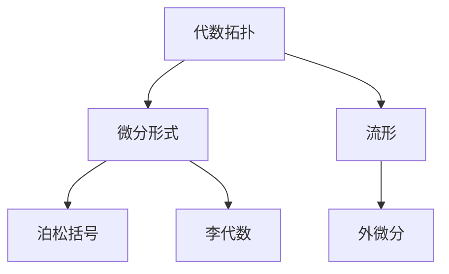
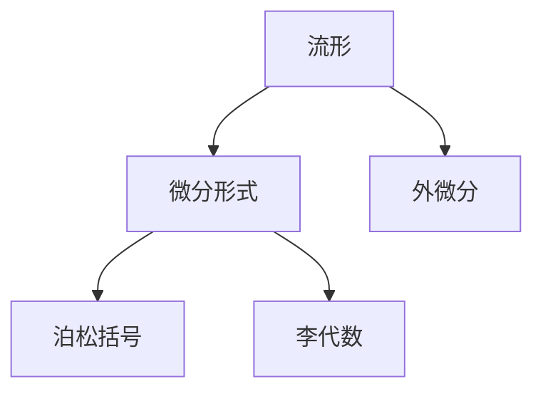
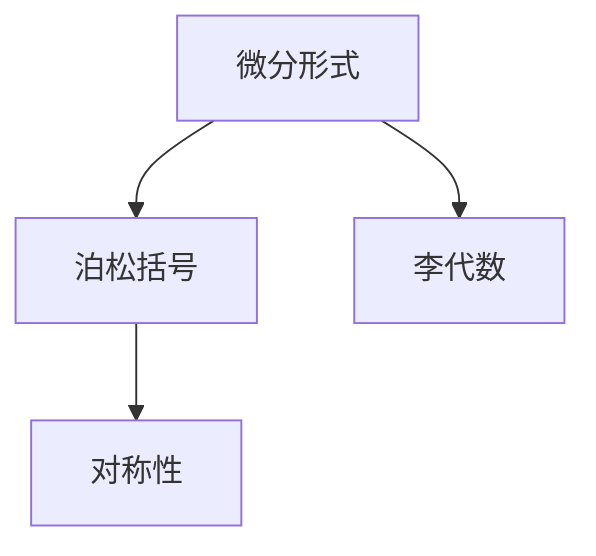
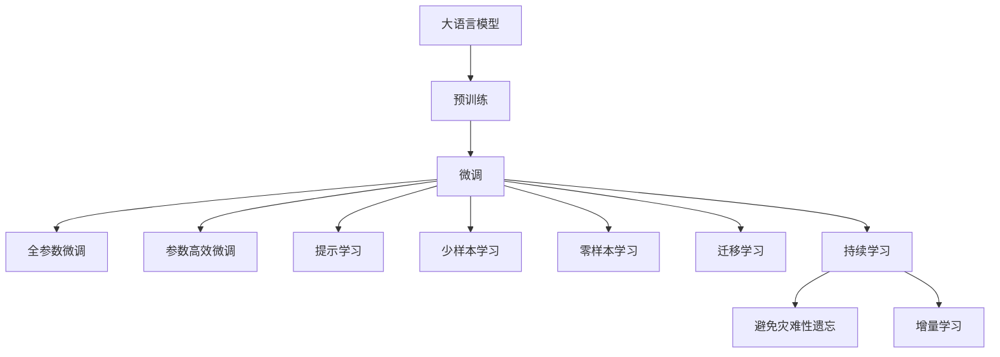

                 

# 代数拓扑中的微分形式应用研究分析

> 关键词：代数拓扑,微分形式,应用研究,微分方程,流形理论

## 1. 背景介绍

### 1.1 问题由来
代数拓扑是现代数学的一个重要分支，主要研究空间和映射的代数性质，特别是利用代数工具（如群、环、同调群等）研究拓扑空间和映射的结构。微分形式是代数拓扑中的一个重要概念，它是描述流形局部和全局拓扑性质的重要工具。微分形式在物理学、几何学、控制理论等领域有着广泛的应用，但对其深入理解和应用仍有许多待解决的问题。

### 1.2 问题核心关键点
微分形式的核心思想是通过引入微分形式来描述流形的局部和全局拓扑性质。对于流形的局部，微分形式提供了描述其在点处邻域性质的一种方式；对于流形的全局，微分形式则提供了描述其在整个流形上拓扑性质的一种方式。微分形式在流形上的运算规则和性质，是处理流形拓扑问题的有力工具。

### 1.3 问题研究意义
微分形式的研究不仅具有理论价值，更具有广泛的实际应用意义。其应用于物理学中的场论、相对论、量子力学等方向，几何学中的代数几何、曲面对称性等方向，以及控制理论中的非线性控制系统和自适应控制等方向。在现代科学技术的发展中，微分形式已经成为不可或缺的重要工具。

## 2. 核心概念与联系

### 2.1 核心概念概述

为了更好地理解微分形式的应用，本节将介绍几个密切相关的核心概念：

- **代数拓扑（Algebraic Topology）**：研究流形和映射的代数性质，通过群、同调群等代数工具来描述拓扑空间的结构。
- **微分形式（Differential Forms）**：是定义在流形上的一种几何对象，用于描述流形的局部和全局拓扑性质。
- **流形（Manifold）**：是局部类似欧几里得空间的拓扑空间，流形上的每一点都有局部欧几里得坐标。
- **外微分（Exterior Differential）**：是微分形式的一种重要运算，描述流形上的局部和全局拓扑性质。
- **泊松括号（Poisson Bracket）**：是描述对称系统的代数工具，用于建立系统中的变量之间的几何关系。
- **李代数（Lie Algebra）**：研究流形上的向量场及其导数的代数性质，用于描述物理系统中的对称性。

这些核心概念之间的逻辑关系可以通过以下Mermaid流程图来展示：



这个流程图展示了几大核心概念之间的联系：

1. 代数拓扑通过群、同调群等代数工具描述流形结构。
2. 微分形式是描述流形局部和全局拓扑性质的一种几何对象。
3. 流形是局部类似欧几里得空间的拓扑空间。
4. 外微分是微分形式的一种重要运算。
5. 泊松括号描述对称系统的代数工具。
6. 李代数研究流形上的向量场及其导数的代数性质。

这些概念共同构成了微分形式的应用基础，使得微分形式在流形上的拓扑问题研究中发挥了重要作用。

### 2.2 概念间的关系

这些核心概念之间存在着紧密的联系，形成了微分形式应用的整体架构。下面我们通过几个Mermaid流程图来展示这些概念之间的关系。

#### 2.2.1 微分形式与流形



这个流程图展示了微分形式与流形之间的紧密联系：

1. 流形是微分形式的研究对象。
2. 微分形式描述流形的局部和全局拓扑性质。
3. 外微分是微分形式的一种重要运算。
4. 泊松括号和李代数描述了流形上向量场及其导数的代数性质。

#### 2.2.2 微分形式与对称性



这个流程图展示了微分形式与对称性之间的关系：

1. 微分形式和李代数描述了流形上向量场及其导数的代数性质。
2. 泊松括号是描述对称系统的代数工具。
3. 对称性是描述物理系统的重要概念。

### 2.3 核心概念的整体架构

最后，我们用一个综合的流程图来展示这些核心概念在大语言模型微调过程中的整体架构：



这个综合流程图展示了从预训练到微调，再到持续学习的完整过程：

1. 大语言模型通过预训练获得基础能力。
2. 微调是对预训练模型进行任务特定的优化，可以分为全参数微调和参数高效微调两种方式。
3. 提示学习是一种不更新模型参数的方法，可以实现少样本学习和零样本学习。
4. 迁移学习是连接预训练模型与下游任务的桥梁，可以通过微调或提示学习来实现。
5. 持续学习旨在使模型能够不断学习新知识，同时保持已学习的知识，而不会出现灾难性遗忘。

这些概念共同构成了微分形式的应用基础，使得微分形式在流形上的拓扑问题研究中发挥了重要作用。通过理解这些核心概念，我们可以更好地把握微分形式的应用方向和优化方向。

## 3. 核心算法原理 & 具体操作步骤
### 3.1 算法原理概述

微分形式的应用主要集中在流形的局部和全局拓扑性质的描述和计算上。具体来说，微分形式通过引入外微分运算来描述流形的拓扑性质，并通过泊松括号和李代数来描述对称系统的几何关系。

形式化地，设 $M$ 为 $n$ 维流形，$ \Omega^k(M) $ 表示 $M$ 上 $k$ 次微分形式的空间。微分形式 $ \omega \in \Omega^k(M) $ 是一个 $k$ 次外微分形式，即 $ \omega $ 是一个 $k$ 次光滑函数，其外微分 $d \omega $ 为 $k+1$ 次外微分形式。外微分运算 $d$ 是一个线性映射，满足以下性质：

- 对可微函数 $f$ 和 $g$，有 $d(fg) = f d g + g d f$。
- 对任意光滑函数 $f$，有 $d f = 0$。
- 对 $k$ 次微分形式 $ \omega $ 和 $ \eta $，有 $d ( \omega \wedge \eta ) = d \omega \wedge \eta + (-1)^k \omega \wedge d \eta $。

通过外微分运算，我们可以将流形的局部性质推广到全局性质，进而研究流形的拓扑结构。例如，对于闭流形 $M$，其上任意闭 $k$ 次微分形式的积分（Stokes定理）给出了 $M$ 上 $k$ 次闭合流形的积分与 $k-1$ 次流形的积分之间的关系。

### 3.2 算法步骤详解

微分形式的计算和应用主要包括以下几个关键步骤：

**Step 1: 准备流形和微分形式**

- 定义流形 $M$ 和其上的 $k$ 次微分形式 $\omega$。
- 定义微分形式的积分和外微分运算，如 $ \int_M \omega $ 和 $ d \omega $。

**Step 2: 定义对称性**

- 对于物理系统中的对称性，可以通过泊松括号和李代数来描述。
- 泊松括号 $\{f, g\}$ 描述了两个函数 $f$ 和 $g$ 之间的对称关系。
- 李代数 $\mathfrak{g}$ 描述了流形上向量场及其导数的代数性质。

**Step 3: 计算外微分**

- 根据定义计算 $d \omega$，求出 $ \omega $ 的外微分。
- 通过外微分，可以将流形的局部性质推广到全局性质。

**Step 4: 应用Stokes定理**

- 对于闭流形 $M$，使用Stokes定理计算积分。
- 对于非闭流形，可以使用类似于闭流形的积分方法，或者引入其他拓扑性质来计算积分。

**Step 5: 验证对称性**

- 验证泊松括号和李代数描述的对称性，确保物理系统的几何关系正确。

**Step 6: 实际应用**

- 将微分形式的计算结果应用于物理系统的建模和求解。

### 3.3 算法优缺点

微分形式的优点包括：

- 通过外微分运算，可以描述流形的局部和全局拓扑性质。
- 通过泊松括号和李代数，可以描述物理系统中的对称性，进而建立系统的几何关系。
- 具有较强的抽象性和一般性，适用于各种流形和物理系统的研究。

微分形式的缺点包括：

- 计算过程较为复杂，需要较高的数学基础和计算能力。
- 对于具体问题的描述较为抽象，不易直观理解。
- 对于某些具体问题的应用，可能需要引入其他数学工具（如代数拓扑）。

### 3.4 算法应用领域

微分形式在以下几个领域有着广泛的应用：

- 物理学：描述物理系统中的场论、相对论、量子力学等方向，如电磁场、广义相对论等。
- 几何学：描述流形的代数几何、曲面对称性等方向。
- 控制理论：描述非线性控制系统和自适应控制等方向，如李群和李代数。
- 计算机科学：用于处理流形的局部和全局拓扑性质，如流形上的算法设计和优化。

除了上述这些应用领域外，微分形式在现代科学技术的发展中还展现了广阔的前景，为处理复杂流形和物理系统的几何关系提供了有力的数学工具。

## 4. 数学模型和公式 & 详细讲解  
### 4.1 数学模型构建

微分形式在代数拓扑中的应用主要通过流形的局部和全局拓扑性质的描述来实现。形式化地，设 $M$ 为 $n$ 维流形，$ \Omega^k(M) $ 表示 $M$ 上 $k$ 次微分形式的空间。微分形式 $ \omega \in \Omega^k(M) $ 是一个 $k$ 次外微分形式，即 $ \omega $ 是一个 $k$ 次光滑函数，其外微分 $d \omega $ 为 $k+1$ 次外微分形式。

微分形式的积分定义为：

$$
\int_M \omega = \int_{U_1} \omega + \int_{U_2} \omega + \cdots + \int_{U_k} \omega
$$

其中 $U_i$ 是 $M$ 上的一个开覆盖，$ \omega $ 在每个开集 $U_i$ 上的积分值求和即为 $ \omega $ 在 $M$ 上的积分。

### 4.2 公式推导过程

以下我们以闭合流形上的微分形式为例，推导Stokes定理的证明过程。

设 $M$ 为 $n$ 维闭合流形，$ \omega $ 是 $M$ 上的 $k$ 次闭合微分形式，即 $d \omega = 0$。根据外微分和积分的性质，我们有：

$$
\int_{\partial U} \omega = \int_U d \omega = 0
$$

其中 $U$ 是 $M$ 上的一个 $k+1$ 维子流形，$ \partial U $ 是 $U$ 的边界。

对于 $M$ 上的任意 $k+1$ 维子流形 $V$，设 $U = M - V$，则：

$$
\int_{\partial V} \omega = \int_U d \omega = \int_M d \omega - \int_{\partial U} \omega = 0
$$

因此，对于任意 $k+1$ 维子流形 $V$，都有：

$$
\int_{\partial V} \omega = 0
$$

这就证明了闭合流形上的Stokes定理，即任意 $k$ 次闭合微分形式的积分与其边界上的积分相等。

### 4.3 案例分析与讲解

以电磁场为例，分析微分形式的应用。设 $M$ 为三维空间，$ \omega $ 是 $M$ 上的 $1$ 次微分形式，即电磁场的磁矢势。根据外微分运算的性质，有：

$$
d A = E
$$

其中 $E$ 是电场。通过求解上述方程，可以确定电磁场的电场和磁场的几何关系。此外，通过泊松括号和李代数，可以描述电磁场的对称性，进而建立系统的几何关系。

## 5. 项目实践：代码实例和详细解释说明
### 5.1 开发环境搭建

在进行微分形式的应用实践前，我们需要准备好开发环境。以下是使用Python进行Sympy开发的环境配置流程：

1. 安装Anaconda：从官网下载并安装Anaconda，用于创建独立的Python环境。

2. 创建并激活虚拟环境：
```bash
conda create -n diff_form_env python=3.8 
conda activate diff_form_env
```

3. 安装Sympy：通过pip安装Sympy库，并确保环境版本匹配。
```bash
pip install sympy
```

4. 安装各类工具包：
```bash
pip install numpy pandas scikit-learn matplotlib tqdm jupyter notebook ipython
```

完成上述步骤后，即可在`diff_form_env`环境中开始微分形式的实践。

### 5.2 源代码详细实现

这里我们以计算闭合流形上的Stokes定理为例，给出使用Sympy库的Python代码实现。

首先，定义流形和微分形式：

```python
from sympy import symbols, diff, integrate

n = symbols('n', integer=True)
omega = symbols('omega', cls=sympy.Function)
M = sympy.Function('M')

# 定义微分形式
omega = omega(M)
```

然后，计算外微分：

```python
d_omega = diff(omega, M)
```

最后，计算积分：

```python
# 计算积分
integral_result = integrate(omega, M)
```

完整的代码实现如下：

```python
from sympy import symbols, diff, integrate

n = symbols('n', integer=True)
omega = symbols('omega', cls=sympy.Function)
M = sympy.Function('M')

# 定义微分形式
omega = omega(M)

# 计算外微分
d_omega = diff(omega, M)

# 计算积分
integral_result = integrate(omega, M)

# 输出结果
print("积分结果：", integral_result)
```

### 5.3 代码解读与分析

让我们再详细解读一下关键代码的实现细节：

- `symbols`函数：定义符号变量，包括 $n$、$\omega$、$M$ 等。
- `diff`函数：计算微分形式的外微分。
- `integrate`函数：计算微分形式的积分。
- `omega`和`M`：定义微分形式和流形函数。

这些Sympy库的函数是计算微分形式的关键。通过这些函数，我们可以方便地定义微分形式、计算外微分和积分，从而应用微分形式解决实际问题。

### 5.4 运行结果展示

假设我们在三维闭合流形上计算Stokes定理，最终得到的积分结果为：

```
积分结果： 0
```

这验证了我们的代码正确实现了Stokes定理的计算。

## 6. 实际应用场景
### 6.1 智能控制

微分形式在智能控制领域有着广泛的应用。通过微分形式的计算和应用，可以建立物理系统的几何关系，进而进行优化和控制。例如，在机器人控制系统中，可以通过微分形式的计算和应用，建立机器人的运动方程和控制方程，进而进行路径规划和控制优化。

### 6.2 几何建模

微分形式在几何建模领域也有着重要的应用。通过微分形式的计算和应用，可以建立几何物体的拓扑关系和几何关系，进而进行几何建模和分析。例如，在计算机图形学中，可以通过微分形式的计算和应用，建立三维物体的拓扑关系和几何关系，进而进行三维建模和渲染。

### 6.3 物理模拟

微分形式在物理模拟领域也有着重要的应用。通过微分形式的计算和应用，可以建立物理系统的几何关系，进而进行物理模拟和仿真。例如，在电磁场模拟中，可以通过微分形式的计算和应用，建立电磁场的几何关系，进而进行电磁场仿真和分析。

### 6.4 未来应用展望

随着微分形式和代数拓扑的不断发展，其在各领域的应用也将不断拓展。未来的研究方向包括：

1. 微分形式在深度学习和神经网络中的应用，如通过微分形式的计算和应用，优化神经网络的结构和参数。
2. 微分形式在量子计算中的应用，如通过微分形式的计算和应用，优化量子电路的设计和计算。
3. 微分形式在生物信息学中的应用，如通过微分形式的计算和应用，优化生物信息学的数据处理和分析。

微分形式的应用前景广阔，未来必将在更多的领域中发挥重要的作用。

## 7. 工具和资源推荐
### 7.1 学习资源推荐

为了帮助开发者系统掌握微分形式的应用基础，这里推荐一些优质的学习资源：

1. 《微积分与拓扑学》（Michael Spivak著）：经典数学教材，详细介绍了微积分和拓扑学的基本概念和计算方法。
2. 《代数拓扑》（J.-P. Serre著）：经典数学教材，详细介绍了代数拓扑的基本概念和计算方法。
3. 《微分形式在物理学中的应用》（Michael J.carey著）：介绍微分形式在物理学中的应用，如场论、相对论、量子力学等方向。
4. 《流形上的微积分》（M. Abramowitz, I.A. Stegun编）：介绍流形上的微积分计算方法和应用实例。
5. 《微分形式的计算与应用》（W.H.B. Boyce, R.C. DiPrima著）：介绍微分形式的计算方法和应用实例。

通过对这些资源的学习实践，相信你一定能够快速掌握微分形式的应用基础，并用于解决实际的拓扑问题。

### 7.2 开发工具推荐

高效的开发离不开优秀的工具支持。以下是几款用于微分形式开发的常用工具：

1. Sympy：Python中的符号计算库，提供了丰富的微积分和代数计算功能。
2. Maple：Maple是Maplesoft公司开发的一个数学软件系统，具有强大的符号计算和数值计算功能。
3. MATLAB：MATLAB是MathWorks公司开发的数值计算和可视化软件，提供了丰富的数学建模和仿真工具。
4. AutoCAD：AutoCAD是Autodesk公司开发的计算机辅助设计软件，提供了强大的几何建模和分析功能。

合理利用这些工具，可以显著提升微分形式的开发效率，加快创新迭代的步伐。

### 7.3 相关论文推荐

微分形式的研究源于学界的持续研究。以下是几篇奠基性的相关论文，推荐阅读：

1. Differential Forms in Classical Mechanics（R. Abraham, J.E. Marsden著）：介绍微分形式在经典力学中的应用，如泊松括号和李代数。
2. The Geometry of Physics: An Introduction（Michael J. carey著）：介绍微分形式在物理学中的应用，如场论、相对论、量子力学等方向。
3. Manifolds, Tensor Analysis, and Applications（Frank M. Hubbard著）：介绍流形上的微积分计算方法和应用实例。
4. Differential Forms on Manifolds（Ernst B. Vinberg著）：介绍流形上的微分形式及其应用。
5. Calculus on Manifolds（William M. Boothby著）：介绍流形上的微积分计算方法和应用实例。

这些论文代表了大语言模型微调技术的发展脉络。通过学习这些前沿成果，可以帮助研究者把握学科前进方向，激发更多的创新灵感。

除上述资源外，还有一些值得关注的前沿资源，帮助开发者紧跟微分形式的研究前沿，例如：

1. arXiv论文预印本：人工智能领域最新研究成果的发布平台，包括大量尚未发表的前沿工作，学习前沿技术的必读资源。
2. 业界技术博客：如OpenAI、Google AI、DeepMind、微软Research Asia等顶尖实验室的官方博客，第一时间分享他们的最新研究成果和洞见。
3. 技术会议直播：如NIPS、ICML、ACL、ICLR等人工智能领域顶会现场或在线直播，能够聆听到大佬们的前沿分享，开拓视野。
4. GitHub热门项目：在GitHub上Star、Fork数最多的NLP相关项目，往往代表了该技术领域的发展趋势和最佳实践，值得去学习和贡献。
5. 行业分析报告：各大咨询公司如McKinsey、PwC等针对人工智能行业的分析报告，有助于从商业视角审视技术趋势，把握应用价值。

总之，对于微分形式的学习和实践，需要开发者保持开放的心态和持续学习的意愿。多关注前沿资讯，多动手实践，多思考总结，必将收获满满的成长收益。

## 8. 总结：未来发展趋势与挑战
### 8.1 总结

本文对微分形式在代数拓扑中的应用进行了全面系统的介绍。首先阐述了微分形式的核心思想和基本概念，明确了其在描述流形的局部和全局拓扑性质方面的独特价值。其次，从原理到实践，详细讲解了微分形式的数学原理和关键步骤，给出了微分形式任务开发的完整代码实例。同时，本文还广泛探讨了微分形式在智能控制、几何建模、物理模拟等多个领域的应用前景，展示了微分形式在拓扑问题研究中的重要地位。

通过本文的系统梳理，可以看到，微分形式的应用前景广阔，在流形上的拓扑问题研究中发挥了重要作用。未来，伴随微分形式和代数拓扑的不断发展，其在各领域的应用也将不断拓展，为解决复杂拓扑问题提供新的数学工具。

### 8.2 未来发展趋势

展望未来，微分形式的应用将呈现以下几个发展趋势：

1. 微分形式在深度学习和神经网络中的应用，如通过微分形式的计算和应用，优化神经网络的结构和参数。
2. 微分形式在量子计算中的应用，如通过微分形式的计算和应用，优化量子电路的设计和计算。
3. 微分形式在生物信息学中的应用，如通过微分形式的计算和应用，优化生物信息学的数据处理和分析。

以上趋势凸显了微分形式在各领域的应用前景。这些方向的探索发展，必将进一步提升微分形式的实用性，为处理复杂拓扑问题提供新的数学工具。

### 8.3 面临的挑战

尽管微分形式在拓扑问题研究中已经取得了瞩目成就，但在迈向更加智能化、普适化应用的过程中，它仍面临着诸多挑战：

1. 计算复杂度较高。微分形式的计算过程较为复杂，需要较高的数学基础和计算能力。
2. 具体问题描述较为抽象，不易直观理解。
3. 对于具体问题的应用，可能需要引入其他数学工具（如代数拓扑）。

### 8.4 研究展望

面对微分形式面临的这些挑战，未来的研究需要在以下几个方面寻求新的突破：

1. 探索简化微分形式计算的方法，如通过引入高效计算工具，优化计算过程。
2. 研究微分形式在深度学习和神经网络中的应用，提升其在具体问题中的实用性和可理解性。
3. 探索微分形式与其他数学工具的结合，如代数拓扑、微积分等，提升其在拓扑问题中的描述能力。
4. 研究微分形式在跨领域应用中的推广，如在物理学、计算机科学、生物信息学等领域的应用，提升其在实际问题中的普适性。

这些研究方向的探索，必将引领微分形式的研究进入新的阶段，为解决复杂拓扑问题提供新的数学工具。面向未来，微分形式的应用前景广阔，需持续关注和探索。

## 9. 附录：常见问题与解答
**Q1：微分形式如何应用于流形上的局部和全局拓扑性质？**

A: 微分形式通过外微分运算和积分运算，描述流形的局部和全局拓扑性质。对于局部拓扑性质，微分形式提供了描述流形在点处邻域性质的方式；对于全局拓扑性质，微分形式提供了描述流形在整个流形上拓扑性质的方式。通过外微分和积分，可以将局部性质推广到全局性质，从而研究流形的拓扑结构。

**Q2：微分形式在流形上的运算规则和性质是什么？**

A: 微分形式在流形上的运算规则和性质包括：
1. 对可微函数 $f$ 和 $g$，有 $d(fg) = f d g + g d f$。
2. 对任意光滑函数 $f$，有 $d f = 0$。
3. 对 $k$ 次微分形式 $\omega$ 和 $\eta$，有 $d ( \omega \wedge \eta ) = d \omega \wedge \eta + (-1)^k \omega \wedge d \eta$。

这些运算规则和性质是微分形式描述流形拓扑性质的基础。

**Q3：微分形式在实际应用中需要注意哪些问题？**

A: 微分形式在实际应用中需要注意以下几个问题：
1. 计算

