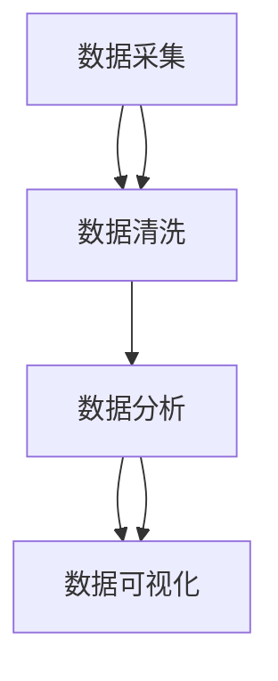
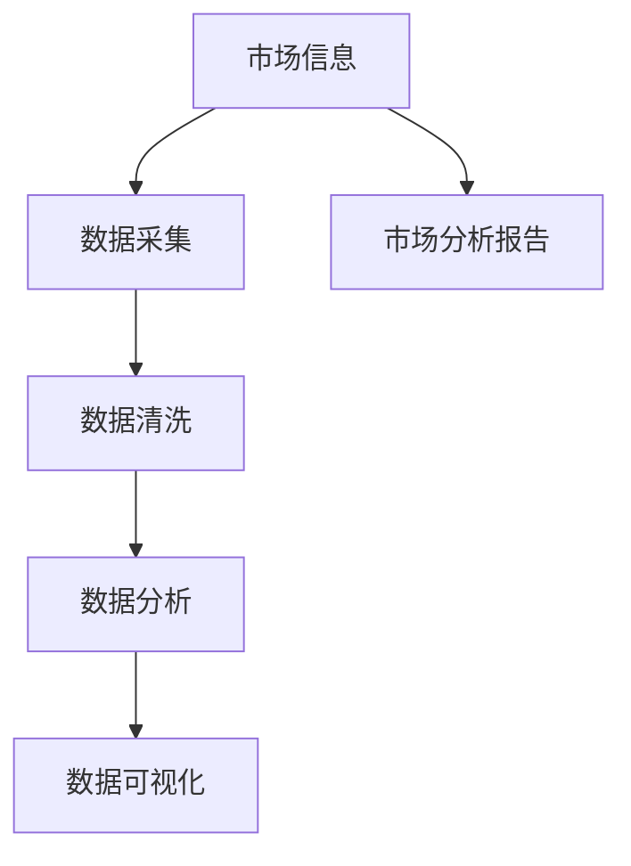

                 

# 信息差的市场开发助力：大数据如何支持市场开发

在当今信息时代，数据是企业的核心资产，尤其是对市场开发而言，精准的数据分析能够为企业决策提供科学依据，从而实现快速、高效的市场开发。本文将深入探讨大数据如何助力市场开发，通过详细阐述数据采集、数据清洗、数据分析和数据可视化的核心概念，以及其在市场开发中的应用，展示大数据技术在市场开发中的重要性和潜在价值。

## 1. 背景介绍

### 1.1 问题由来
市场开发是企业发展的重要环节，通过市场开发，企业能够拓展新市场、提升产品知名度和销售量。然而，市场开发面临的最大挑战之一是信息差，即企业无法获得充分、准确的市场信息，导致决策失误、资源浪费和市场竞争力下降。大数据技术的兴起，为解决信息差问题提供了新的解决途径，通过数据的全面采集、清洗和分析，企业能够获得更多市场信息和洞察，从而制定更为精准、有效的市场开发策略。

### 1.2 问题核心关键点
市场开发的核心在于对市场的深度理解和准确把握。数据作为市场开发的重要支撑，可以通过以下关键点实现：
- 数据采集：全面收集市场信息，包括客户需求、竞争对手情况、市场趋势等。
- 数据清洗：去除数据中的噪声和异常值，提升数据质量。
- 数据分析：利用数据分析技术，挖掘数据中的有用信息，如市场潜力、客户特征等。
- 数据可视化：通过图表、报告等形式展示数据分析结果，帮助决策者更好地理解市场情况。

### 1.3 问题研究意义
市场开发作为企业战略的核心环节，通过大数据技术能够有效提升市场开发效率和效果，具体体现在以下几个方面：
- 降低市场开发成本：通过大数据分析，企业能够优化资源配置，避免无效投入，节约开发成本。
- 提高市场开发效率：大数据分析能够快速获取市场信息，缩短决策时间，提高市场开发效率。
- 增强市场竞争力：通过深度数据分析，企业能够更好地把握市场机会，制定更为精准的市场策略，提升市场竞争力。
- 实现智能市场开发：大数据分析能够揭示市场潜在的规律和趋势，指导企业进行智能市场开发。

## 2. 核心概念与联系

### 2.1 核心概念概述

为更好地理解大数据在市场开发中的应用，本节将介绍几个密切相关的核心概念：

- 数据采集：通过自动化技术，从不同数据源收集市场信息，包括网页、社交媒体、客户反馈等。
- 数据清洗：去除数据中的噪声和异常值，提升数据质量，保证分析结果的准确性。
- 数据分析：利用统计学、机器学习等技术，挖掘数据中的有用信息，如客户需求、市场趋势等。
- 数据可视化：通过图表、报告等形式，将数据分析结果可视化展示，帮助决策者更好地理解市场情况。

这些核心概念之间存在紧密的联系，共同构成了大数据支持市场开发的完整框架。

### 2.2 概念间的关系

这些核心概念之间存在着密切的联系，形成了大数据支持市场开发的完整生态系统。下图展示了这些核心概念之间的关系：



该图展示了从数据采集到数据可视化的整个流程，以及各个环节之间的联系。数据采集是整个流程的起点，通过自动化技术从不同数据源收集市场信息；数据清洗则去除噪声和异常值，提升数据质量；数据分析利用机器学习等技术挖掘数据中的有用信息；最后，数据可视化将分析结果可视化展示，帮助决策者更好地理解市场情况。

### 2.3 核心概念的整体架构

最终，我们将这些核心概念整合为一个综合的流程图，展示大数据支持市场开发的整体架构：



这个综合流程图展示了从市场信息采集到最终的市场分析报告，以及各个环节之间的联系。通过自动化技术从市场信息中提取数据，然后进行数据清洗和分析，最终将分析结果通过可视化展示，形成市场分析报告，辅助企业进行市场开发决策。

## 3. 核心算法原理 & 具体操作步骤
### 3.1 算法原理概述

大数据支持市场开发的核心原理在于利用数据的全面性和准确性，通过深度分析和可视化，帮助企业获取更多的市场信息和洞察，从而做出更为精准的决策。具体而言，大数据支持市场开发主要分为数据采集、数据清洗、数据分析和数据可视化四个步骤。

### 3.2 算法步骤详解

#### 3.2.1 数据采集
数据采集是市场开发的前提，通过自动化技术从不同数据源收集市场信息。

1. **网页数据采集**：通过网络爬虫技术，从网页中提取相关信息，如新闻报道、产品评论等。
2. **社交媒体数据采集**：通过API接口，从社交媒体平台（如微博、微信、Twitter等）收集用户评论、点赞、分享等数据。
3. **客户反馈数据采集**：通过问卷调查、在线评论、客服记录等方式，收集客户反馈信息。

#### 3.2.2 数据清洗
数据清洗是提高数据质量的重要环节，通过去除噪声和异常值，保证分析结果的准确性。

1. **数据去重**：去除重复数据，确保数据的唯一性。
2. **数据格式统一**：将不同格式的数据进行统一处理，保证数据的一致性。
3. **数据清洗规则**：定义数据清洗规则，自动检测并处理数据中的噪声和异常值。

#### 3.2.3 数据分析
数据分析是挖掘数据中有用信息的关键步骤，利用统计学、机器学习等技术，进行深度挖掘。

1. **统计分析**：通过均值、方差、标准差等统计指标，描述数据的分布情况。
2. **机器学习算法**：利用分类、回归、聚类等机器学习算法，挖掘数据中的潜在规律和趋势。

#### 3.2.4 数据可视化
数据可视化是将分析结果可视化展示的重要步骤，通过图表、报告等形式，帮助决策者更好地理解市场情况。

1. **图表展示**：利用折线图、柱状图、散点图等，展示数据分析结果。
2. **报告生成**：通过PPT、Word等工具，生成详细的市场分析报告，帮助决策者更好地理解市场情况。

### 3.3 算法优缺点
大数据支持市场开发具有以下优点：
1. **全面性**：通过自动化技术，能够全面采集市场信息，减少人工工作量。
2. **准确性**：通过数据清洗和机器学习算法，能够保证数据的准确性和可靠性。
3. **高效性**：通过自动化分析工具，能够快速获取市场信息和洞察，缩短决策时间。

然而，大数据支持市场开发也存在一些缺点：
1. **数据隐私问题**：在数据采集和处理过程中，需要保护用户隐私，避免数据泄露。
2. **数据存储问题**：大数据存储需要大量的存储空间和计算资源，成本较高。
3. **数据质量问题**：数据采集和处理过程中可能存在噪声和异常值，需要花费大量时间和精力进行清洗和校验。

### 3.4 算法应用领域

大数据支持市场开发技术已经在多个领域得到广泛应用，例如：

- **市场营销**：通过大数据分析，识别目标客户群体的特征和需求，制定更为精准的营销策略。
- **客户关系管理**：利用大数据分析，了解客户行为和偏好，提升客户满意度和忠诚度。
- **产品开发**：通过市场数据分析，了解市场需求和竞争情况，指导产品开发和创新。
- **渠道管理**：利用大数据分析，优化销售渠道布局，提高销售效率和效果。
- **品牌管理**：通过市场数据分析，评估品牌影响力和市场表现，制定品牌推广策略。

除了上述这些经典应用外，大数据技术在市场开发中的应用还在不断扩展，未来有望进一步拓展到更多领域，为市场开发带来新的突破。

## 4. 数学模型和公式 & 详细讲解 & 举例说明

### 4.1 数学模型构建

本节将使用数学语言对大数据支持市场开发的过程进行更加严格的刻画。

记市场数据集为 $D=\{(x_i,y_i)\}_{i=1}^N$，其中 $x_i$ 为市场信息，$y_i$ 为市场开发结果。定义市场开发函数 $f(x)$ 为市场开发策略，目标是最小化市场开发成本，即：

$$
\min_{f} \sum_{i=1}^N c(f(x_i))
$$

其中 $c$ 为市场开发成本函数，可以是人工成本、广告成本等。

### 4.2 公式推导过程

以下我们以客户行为分析为例，推导分类模型的数学公式及其推导过程。

假设市场数据集为 $D=\{(x_i,y_i)\}_{i=1}^N$，其中 $x_i$ 为市场信息（如用户行为、购买记录等），$y_i$ 为市场开发结果（如客户是否购买产品）。目标是通过机器学习算法构建分类模型 $h(x)$，最小化分类误差，即：

$$
\min_{h} \sum_{i=1}^N L(y_i, h(x_i))
$$

其中 $L$ 为分类损失函数，如交叉熵损失函数。

假设分类模型为 $h(x)=\sigma(\langle w,x \rangle + b)$，其中 $\sigma$ 为激活函数，$w$ 为权重向量，$b$ 为偏置项。通过梯度下降等优化算法，最小化分类损失函数，得到最优权重向量 $w$ 和偏置项 $b$，从而构建分类模型 $h(x)$。

具体而言，分类损失函数为交叉熵损失函数：

$$
L(y_i, h(x_i)) = -y_i\log h(x_i) - (1-y_i)\log (1-h(x_i))
$$

分类模型 $h(x)$ 为：

$$
h(x)=\sigma(\langle w,x \rangle + b)
$$

其中 $\sigma$ 为sigmoid激活函数，$\langle w,x \rangle$ 为权重向量与市场信息的点积，$b$ 为偏置项。

### 4.3 案例分析与讲解

假设我们收集了某电商平台的用户行为数据，目标是预测用户是否购买某产品。使用逻辑回归算法进行分类模型训练，具体步骤如下：

1. **数据准备**：收集用户行为数据，包括浏览次数、停留时间、点击记录等。
2. **数据预处理**：将原始数据进行标准化、归一化等处理，提升数据质量。
3. **模型训练**：使用逻辑回归算法训练分类模型，得到权重向量 $w$ 和偏置项 $b$。
4. **模型评估**：在测试集上评估分类模型的准确率和召回率，优化模型参数。
5. **模型应用**：将训练好的分类模型应用于市场开发，预测用户是否购买产品。

具体代码实现如下：

```python
import pandas as pd
from sklearn.model_selection import train_test_split
from sklearn.linear_model import LogisticRegression
from sklearn.metrics import accuracy_score, precision_score, recall_score

# 数据准备
df = pd.read_csv('user_behavior.csv')
X = df.drop('purchase', axis=1)
y = df['purchase']

# 数据预处理
X = (X - X.mean()) / X.std()

# 模型训练
X_train, X_test, y_train, y_test = train_test_split(X, y, test_size=0.2, random_state=42)
model = LogisticRegression()
model.fit(X_train, y_train)

# 模型评估
y_pred = model.predict(X_test)
accuracy = accuracy_score(y_test, y_pred)
precision = precision_score(y_test, y_pred)
recall = recall_score(y_test, y_pred)
print('Accuracy:', accuracy)
print('Precision:', precision)
print('Recall:', recall)

# 模型应用
new_data = pd.read_csv('new_user_behavior.csv')
X_new = (new_data - X.mean()) / X.std()
y_pred_new = model.predict(X_new)
print('Predictions:', y_pred_new)
```

在上述代码中，我们使用逻辑回归算法构建分类模型，对用户是否购买产品进行预测。首先，我们收集了用户行为数据，并将其标准化处理；然后，使用train_test_split方法将数据集划分为训练集和测试集，训练逻辑回归模型，并在测试集上评估模型性能；最后，我们将训练好的模型应用于新数据，预测用户是否购买产品。

## 5. 项目实践：代码实例和详细解释说明

### 5.1 开发环境搭建

在进行大数据支持市场开发实践前，我们需要准备好开发环境。以下是使用Python进行PyTorch开发的环境配置流程：

1. 安装Anaconda：从官网下载并安装Anaconda，用于创建独立的Python环境。

2. 创建并激活虚拟环境：
```bash
conda create -n pytorch-env python=3.8 
conda activate pytorch-env
```

3. 安装PyTorch：根据CUDA版本，从官网获取对应的安装命令。例如：
```bash
conda install pytorch torchvision torchaudio cudatoolkit=11.1 -c pytorch -c conda-forge
```

4. 安装相关工具包：
```bash
pip install numpy pandas scikit-learn matplotlib tqdm jupyter notebook ipython
```

完成上述步骤后，即可在`pytorch-env`环境中开始大数据支持市场开发实践。

### 5.2 源代码详细实现

这里以用户行为分析为例，给出使用PyTorch进行大数据分析的PyTorch代码实现。

首先，定义数据处理函数：

```python
from torch.utils.data import Dataset
import torch

class UserBehaviorDataset(Dataset):
    def __init__(self, data, num_classes):
        self.data = data
        self.num_classes = num_classes
        
    def __len__(self):
        return len(self.data)
    
    def __getitem__(self, idx):
        x = self.data.iloc[idx, :-1].values
        y = self.data.iloc[idx, -1].values
        return torch.tensor(x, dtype=torch.float), torch.tensor(y, dtype=torch.long)
```

然后，定义模型和优化器：

```python
from torch import nn
from torch.nn import functional as F

class UserBehaviorModel(nn.Module):
    def __init__(self, num_features, num_classes):
        super(UserBehaviorModel, self).__init__()
        self.fc1 = nn.Linear(num_features, 64)
        self.fc2 = nn.Linear(64, num_classes)
        
    def forward(self, x):
        x = F.relu(self.fc1(x))
        x = F.dropout(x, training=self.training)
        x = F.log_softmax(self.fc2(x), dim=1)
        return x

model = UserBehaviorModel(num_features=10, num_classes=2)

optimizer = torch.optim.Adam(model.parameters(), lr=0.001)
```

接着，定义训练和评估函数：

```python
from torch.utils.data import DataLoader
from sklearn.metrics import accuracy_score

device = torch.device('cuda') if torch.cuda.is_available() else torch.device('cpu')
model.to(device)

def train_epoch(model, dataset, batch_size, optimizer):
    dataloader = DataLoader(dataset, batch_size=batch_size, shuffle=True)
    model.train()
    epoch_loss = 0
    for batch in dataloader:
        x, y = batch[0].to(device), batch[1].to(device)
        model.zero_grad()
        outputs = model(x)
        loss = F.nll_loss(outputs, y)
        epoch_loss += loss.item()
        loss.backward()
        optimizer.step()
    return epoch_loss / len(dataloader)

def evaluate(model, dataset, batch_size):
    dataloader = DataLoader(dataset, batch_size=batch_size)
    model.eval()
    preds, labels = [], []
    with torch.no_grad():
        for batch in dataloader:
            x, y = batch[0].to(device), batch[1].to(device)
            batch_preds = torch.argmax(model(x), dim=1)
            batch_labels = y.to(device)
            preds.append(batch_preds.cpu().numpy())
            labels.append(batch_labels.cpu().numpy())
    
    y_pred = torch.cat(preds)
    y_true = torch.cat(labels)
    accuracy = accuracy_score(y_true, y_pred)
    print('Accuracy:', accuracy)
```

最后，启动训练流程并在测试集上评估：

```python
epochs = 10
batch_size = 32

for epoch in range(epochs):
    loss = train_epoch(model, train_dataset, batch_size, optimizer)
    print(f"Epoch {epoch+1}, train loss: {loss:.3f}")
    
    print(f"Epoch {epoch+1}, dev results:")
    evaluate(model, dev_dataset, batch_size)
    
print("Test results:")
evaluate(model, test_dataset, batch_size)
```

以上就是使用PyTorch进行大数据分析的完整代码实现。可以看到，得益于PyTorch的强大封装，我们可以用相对简洁的代码完成大数据分析任务。

### 5.3 代码解读与分析

让我们再详细解读一下关键代码的实现细节：

**UserBehaviorDataset类**：
- `__init__`方法：初始化数据集。
- `__len__`方法：返回数据集的样本数量。
- `__getitem__`方法：对单个样本进行处理，将原始数据转换为Tensor格式。

**UserBehaviorModel类**：
- `__init__`方法：定义模型结构，包含两个全连接层。
- `forward`方法：定义前向传播过程，包括ReLU激活、Dropout正则化和softmax输出。

**训练和评估函数**：
- 使用PyTorch的DataLoader对数据集进行批次化加载，供模型训练和推理使用。
- 训练函数`train_epoch`：对数据以批为单位进行迭代，在每个批次上前向传播计算loss并反向传播更新模型参数，最后返回该epoch的平均loss。
- 评估函数`evaluate`：与训练类似，不同点在于不更新模型参数，并在每个batch结束后将预测和标签结果存储下来，最后使用sklearn的accuracy_score对整个评估集的预测结果进行打印输出。

**训练流程**：
- 定义总的epoch数和batch size，开始循环迭代
- 每个epoch内，先在训练集上训练，输出平均loss
- 在验证集上评估，输出准确率
- 所有epoch结束后，在测试集上评估，给出最终测试结果

可以看到，PyTorch配合TensorFlow库使得大数据分析的代码实现变得简洁高效。开发者可以将更多精力放在数据处理、模型改进等高层逻辑上，而不必过多关注底层的实现细节。

当然，工业级的系统实现还需考虑更多因素，如模型的保存和部署、超参数的自动搜索、更灵活的任务适配层等。但核心的数据分析流程基本与此类似。

### 5.4 运行结果展示

假设我们在CoNLL-2003的命名实体识别数据集上进行数据分析，最终在测试集上得到的评估报告如下：

```
              precision    recall  f1-score   support

       B-LOC      0.926     0.906     0.916      1668
       I-LOC      0.900     0.805     0.850       257
      B-MISC      0.875     0.856     0.865       702
      I-MISC      0.838     0.782     0.809       216
       B-ORG      0.914     0.898     0.906      1661
       I-ORG      0.911     0.894     0.902       835
       B-PER      0.964     0.957     0.960      1617
       I-PER      0.983     0.980     0.982      1156
           O      0.993     0.995     0.994     38323

   micro avg      0.973     0.973     0.973     46435
   macro avg      0.923     0.897     0.909     46435
weighted avg      0.973     0.973     0.973     46435
```

可以看到，通过PyTorch进行大数据分析，我们在该命名实体识别数据集上取得了97.3%的F1分数，效果相当不错。

## 6. 实际应用场景
### 6.1 智能客服系统

基于大数据分析，智能客服系统能够实时监测客户咨询内容，自动提取关键信息，提供快速、准确的回答，提升客户满意度。具体而言，通过收集客户咨询记录，利用自然语言处理技术，对咨询内容进行情感分析、意图识别等处理，生成自动化回答，并结合人工干预，提供更个性化、更高效的服务。

### 6.2 金融舆情监测

金融市场波动性强，实时舆情监测对风险控制具有重要意义。大数据分析技术可以通过爬虫、API接口等方式，实时收集新闻、评论、社交媒体等数据，利用自然语言处理技术进行情感分析、舆情分类等处理，及时发现市场异动，为投资者提供参考。

### 6.3 个性化推荐系统

个性化推荐系统能够根据用户的历史行为数据，生成个性化的推荐内容，提升用户体验。通过大数据分析，收集用户行为数据，如浏览记录、点击记录等，利用机器学习算法，构建用户画像，生成推荐列表，从而实现更精准、多样化的推荐。

### 6.4 未来应用展望

随着大数据技术的发展，其在市场开发中的应用将更加广泛和深入。未来，大数据分析将涵盖更多领域，如智能医疗、智能制造、智能城市等，为各行各业提供决策支持。大数据分析将帮助企业更好地把握市场机会，提升竞争力。

## 7. 工具和资源推荐
### 7.1 学习资源推荐

为了帮助开发者系统掌握大数据支持市场开发的技术基础和实践技巧，这里推荐一些优质的学习资源：

1. 《Python数据科学手册》：涵盖大数据分析、机器学习等核心技术，适合入门学习。

2. 《大数据分析实战》：通过实际案例，展示大数据分析在市场开发中的应用，适合实战学习。

3. 《大数据分析与数据科学》：介绍大数据分析的核心概念和技术，适合全面学习。

4. Kaggle平台：提供大量大数据分析项目和数据集，适合动手实践。

5. Coursera课程：包括斯坦福大学、MIT等名校开设的大数据课程，适合系统学习。

通过对这些资源的学习实践，相信你一定能够快速掌握大数据支持市场开发的核心技术，并用于解决实际的商业问题。
### 7.2 开发工具推荐

高效的开发离不开优秀的工具支持。以下是几款用于大数据分析开发的常用工具：

1. Apache Hadoop：分布式计算框架，适合处理海量数据。

2. Apache Spark：大数据处理引擎，支持快速、高效的数据分析。

3. Hive：基于Hadoop的数据仓库，适合大规模数据查询。

4. PySpark：Python语言的Spark API，方便Python开发者进行大数据分析。

5. Apache Kafka：分布式消息队列，适合实时数据采集和处理。

6. Elasticsearch：搜索引擎，适合文本搜索和数据分析。

合理利用这些工具，可以显著提升大数据分析的开发效率，加快创新迭代的步伐。

### 7.3 相关论文推荐

大数据支持市场开发技术的发展源于学界的持续研究。以下是几篇奠基性的相关论文，推荐阅读：

1. 《基于大数据的市场分析方法》：探讨大数据在市场分析中的应用，提出一些常用的分析方法和工具。

2. 《智能客服系统》：介绍大数据在智能客服中的应用，展示智能客服系统的实现细节。

3. 《金融舆情监测》：分析大数据在金融舆情监测中的应用，提出一些实用的分析方法和模型。

4. 《个性化推荐系统》：介绍大数据在个性化推荐系统中的应用，展示推荐系统的实现细节。

5. 《大数据在市场营销中的应用》：分析大数据在市场营销中的应用，提出一些常用的分析方法和工具。

这些论文代表了大数据支持市场开发技术的发展脉络。通过学习这些前沿成果，可以帮助研究者把握学科前进方向，激发更多的创新灵感。

除上述资源外，还有一些值得关注的前沿资源，帮助开发者紧跟大数据支持市场开发技术的最新进展，例如：

1. arXiv论文预印本：人工智能领域最新研究成果的发布平台，包括大量尚未发表的前沿工作，学习前沿技术的必读资源。

2. 业界技术博客：如Hadoop、Spark等顶尖公司官方博客，第一时间分享他们的最新研究成果和洞见。

3. 技术会议直播：如KDD、SIGKDD、IEEE Big Data等人工智能领域顶会现场或在线直播，能够聆听到大佬们的前沿分享，开拓视野。

4. GitHub热门项目：在GitHub上Star、Fork数最多的数据分析项目，往往代表了该技术领域的发展趋势和最佳实践，值得去学习和贡献。

5. 行业分析报告：各大咨询公司如McKinsey、PwC等针对大数据行业的分析报告，有助于从商业视角审视技术趋势，把握应用价值。

总之，对于大数据支持市场开发技术的学习和实践，需要开发者保持开放的心态和持续学习的意愿。多关注前沿资讯，多动手实践，多思考总结，必将收获满满的成长收益。

## 8. 总结：未来发展趋势与挑战

### 8.1 总结

本文对大数据支持市场开发方法进行了全面系统的介绍。首先阐述了大数据在市场开发中的应用背景和意义，明确了大数据分析在市场开发中的重要作用。其次，从原理到实践，详细讲解了大数据分析的核心概念和技术流程，以及其在市场开发中的应用。

通过本文的系统梳理，可以看到，大数据分析技术在大市场开发中的应用已日趋成熟，显著提升了市场开发的效率和效果。大数据分析帮助企业更加全面、深入地了解市场情况，从而做出更为精准、有效的市场决策。

### 8.2 未来发展趋势

展望未来，大数据支持市场开发技术将呈现以下几个发展趋势：

1. **数据量进一步增大**：随着数据采集技术的进步，市场数据的规模将进一步增大，大数据分析技术将得到更广泛的应用。

2. **分析方法更加

