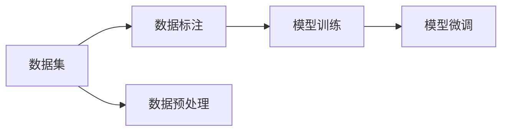

                 

# 从零开始大模型开发与微调：数据图像的获取与标签的说明

## 1. 背景介绍

### 1.1 问题由来

在人工智能（AI）领域，尤其是自然语言处理（NLP）领域，大语言模型（Large Language Models，LLMs）如BERT、GPT等，已经在众多任务中表现出色。这些模型通过在大规模无标签数据上进行预训练，学习到丰富的语言知识，并在下游任务上通过微调进行优化。然而，数据图像（数据集）的获取和标签的说明是大模型开发和微调的重要环节，其质量和有效性直接影响到模型的性能和应用效果。

### 1.2 问题核心关键点

数据图像的获取和标签的说明主要关注以下方面：

- **数据图像（数据集）的质量和多样性**：高质量、多样化的数据集能够帮助模型更好地学习语言的多种表达方式，减少模型对特定输入的过度拟合。
- **标签的准确性和一致性**：准确的标签是模型学习的重要指导，错误或不一致的标签会导致模型学习错误的模式。
- **数据集的标注成本**：高质量的数据集通常需要高成本的标注工作，如何高效地获取和利用标注数据是数据获取中的一个重要问题。
- **数据集的隐私和安全性**：在处理敏感数据时，需要确保数据的隐私和安全，避免数据泄露和滥用。

### 1.3 问题研究意义

高质量的数据集和准确一致的标签是模型性能的基石，直接关系到模型的泛化能力和应用效果。通过研究和实践，可以提升数据集的建设质量，优化标签的说明方法，降低数据集的标注成本，增强数据的安全性和隐私保护。此外，这些研究还能推动大模型的应用和普及，加速AI技术的产业化进程。

## 2. 核心概念与联系

### 2.1 核心概念概述

为了更好地理解大模型开发与微调过程中的数据图像获取与标签说明，本节将介绍几个关键概念：

- **数据图像（Data Images）**：指的是用于训练和测试模型的数据集，包括文本、图像、音频等多种类型。高质量的数据集通常包含丰富的数据类型和多样化的表达方式，有助于模型学习语言的多种表达。
- **标签（Labels）**：是对数据图像的分类或回归结果，如文本中的实体识别、情感分析、情感分类等。准确的标签是模型训练的重要指导，错误或一致性差的标签会导致模型学习错误的模式。
- **数据集标注**：是指将标签应用于数据图像的过程，是数据集建设的重要环节。高质量的标注工作不仅能提高模型的性能，还能减少后续数据处理和预处理的工作量。
- **数据集预处理**：包括数据清洗、去噪、归一化等步骤，是数据集建设的重要环节。预处理可以提高数据集的质量，减少模型对噪声数据的敏感性。
- **模型微调**：在预训练模型基础上，通过有监督学习优化模型在特定任务上的性能。微调可以显著提升模型在特定任务上的表现，是模型应用的重要手段。

这些核心概念通过数据集建设、模型训练、模型微调等环节紧密联系起来，构成了大模型开发与微调的全过程。通过理解这些核心概念，我们可以更好地把握大模型开发与微调的理论基础和技术细节。

### 2.2 概念间的关系

这些核心概念之间的关系可以通过以下Mermaid流程图来展示：



这个流程图展示了大模型开发与微调过程中各个环节的关系：

1. 数据集建设是模型训练和微调的基础。
2. 数据标注对数据集的质量有着直接的影响。
3. 数据预处理可以提高数据集的质量，减少后续数据处理的复杂度。
4. 模型训练通过标注数据学习到特定的任务知识。
5. 模型微调进一步优化模型在特定任务上的性能。

## 3. 核心算法原理 & 具体操作步骤

### 3.1 算法原理概述

大模型开发与微调的核心算法原理可以概括为以下几个步骤：

1. **数据集建设**：收集和准备高质量的数据图像，确保数据集的多样性和代表性。
2. **数据标注**：对数据图像进行准确一致的标注，确保标注的准确性和一致性。
3. **数据预处理**：清洗、去噪、归一化等预处理步骤，提高数据集的质量。
4. **模型训练**：在标注数据上训练预训练模型，学习到特定的任务知识。
5. **模型微调**：通过有监督学习优化模型在特定任务上的性能。

这些步骤共同构成了大模型开发与微调的全过程，旨在通过数据集建设、模型训练和微调，提升模型的性能和应用效果。

### 3.2 算法步骤详解

以下将详细讲解大模型开发与微调的具体操作步骤：

**Step 1: 数据集建设**

1. **数据收集**：根据任务需求，收集相关的数据图像。数据图像可以来源于公开数据集、专业数据库、网络爬虫等。
2. **数据清洗**：清洗数据，去除噪声和异常值，确保数据集的质量。
3. **数据扩充**：通过数据增强技术，如随机裁剪、旋转、缩放等，增加数据集的多样性。

**Step 2: 数据标注**

1. **标注规范制定**：根据任务需求，制定详细的标注规范，确保标注的一致性和准确性。
2. **标注工具选择**：选择合适的标注工具，如Labelbox、VGG Image Annotator等，提高标注效率。
3. **标注质量控制**：通过多轮审核和验证，确保标注的准确性和一致性。

**Step 3: 数据预处理**

1. **归一化**：将数据进行归一化处理，如标准化、归一化等，提高数据集的质量。
2. **去噪**：去除数据中的噪声和干扰，如模糊、背景干扰等，提高数据集的质量。
3. **数据增强**：通过数据增强技术，如随机裁剪、旋转、缩放等，增加数据集的多样性。

**Step 4: 模型训练**

1. **选择合适的模型**：根据任务需求，选择合适的预训练模型，如BERT、GPT等。
2. **设置训练参数**：设置合适的学习率、批大小、迭代轮数等训练参数。
3. **模型训练**：在标注数据上训练预训练模型，学习到特定的任务知识。

**Step 5: 模型微调**

1. **微调参数选择**：选择合适的微调参数，如微调层数、学习率等。
2. **微调策略制定**：制定合适的微调策略，如冻结预训练参数、更新部分参数等。
3. **微调训练**：在标注数据上微调预训练模型，优化模型在特定任务上的性能。

### 3.3 算法优缺点

基于监督学习的大模型微调方法具有以下优点：

- **简单高效**：只需要准备少量标注数据，即可对预训练模型进行快速适配，获得较大的性能提升。
- **通用适用**：适用于各种NLP下游任务，包括分类、匹配、生成等，设计简单的任务适配层即可实现微调。
- **参数高效**：利用参数高效微调技术，在固定大部分预训练参数的情况下，仍可取得不错的提升。
- **效果显著**：在学术界和工业界的诸多任务上，基于微调的方法已经刷新了最先进的性能指标。

同时，该方法也存在一定的局限性：

- **依赖标注数据**：微调的效果很大程度上取决于标注数据的质量和数量，获取高质量标注数据的成本较高。
- **迁移能力有限**：当目标任务与预训练数据的分布差异较大时，微调的性能提升有限。
- **负面效果传递**：预训练模型的固有偏见、有害信息等，可能通过微调传递到下游任务，造成负面影响。
- **可解释性不足**：微调模型的决策过程通常缺乏可解释性，难以对其推理逻辑进行分析和调试。

尽管存在这些局限性，但就目前而言，基于监督学习的微调方法仍是大语言模型应用的最主流范式。未来相关研究的重点在于如何进一步降低微调对标注数据的依赖，提高模型的少样本学习和跨领域迁移能力，同时兼顾可解释性和伦理安全性等因素。

### 3.4 算法应用领域

基于大语言模型微调的监督学习方法，在NLP领域已经得到了广泛的应用，覆盖了几乎所有常见任务，例如：

- 文本分类：如情感分析、主题分类、意图识别等。通过微调使模型学习文本-标签映射。
- 命名实体识别：识别文本中的人名、地名、机构名等特定实体。通过微调使模型掌握实体边界和类型。
- 关系抽取：从文本中抽取实体之间的语义关系。通过微调使模型学习实体-关系三元组。
- 问答系统：对自然语言问题给出答案。将问题-答案对作为微调数据，训练模型学习匹配答案。
- 机器翻译：将源语言文本翻译成目标语言。通过微调使模型学习语言-语言映射。
- 文本摘要：将长文本压缩成简短摘要。将文章-摘要对作为微调数据，使模型学习抓取要点。
- 对话系统：使机器能够与人自然对话。将多轮对话历史作为上下文，微调模型进行回复生成。

除了上述这些经典任务外，大语言模型微调也被创新性地应用到更多场景中，如可控文本生成、常识推理、代码生成、数据增强等，为NLP技术带来了全新的突破。随着预训练模型和微调方法的不断进步，相信NLP技术将在更广阔的应用领域大放异彩。

## 4. 数学模型和公式 & 详细讲解 & 举例说明

### 4.1 数学模型构建

本节将使用数学语言对大模型开发与微调过程中的数据图像获取与标签说明进行更加严格的刻画。

记数据集为 $D=\{(x_i, y_i)\}_{i=1}^N$，其中 $x_i$ 为数据图像，$y_i$ 为标签。假设预训练模型为 $M_{\theta}$，其中 $\theta$ 为预训练得到的模型参数。

定义模型 $M_{\theta}$ 在数据图像 $x$ 上的损失函数为 $\ell(M_{\theta}(x),y)$，则在数据集 $D$ 上的经验风险为：

$$
\mathcal{L}(\theta) = \frac{1}{N}\sum_{i=1}^N \ell(M_{\theta}(x_i),y_i)
$$

微调的优化目标是最小化经验风险，即找到最优参数：

$$
\theta^* = \mathop{\arg\min}_{\theta} \mathcal{L}(\theta)
$$

在实践中，我们通常使用基于梯度的优化算法（如SGD、Adam等）来近似求解上述最优化问题。设 $\eta$ 为学习率，$\lambda$ 为正则化系数，则参数的更新公式为：

$$
\theta \leftarrow \theta - \eta \nabla_{\theta}\mathcal{L}(\theta) - \eta\lambda\theta
$$

其中 $\nabla_{\theta}\mathcal{L}(\theta)$ 为损失函数对参数 $\theta$ 的梯度，可通过反向传播算法高效计算。

### 4.2 公式推导过程

以下我们以二分类任务为例，推导交叉熵损失函数及其梯度的计算公式。

假设模型 $M_{\theta}$ 在输入 $x$ 上的输出为 $\hat{y}=M_{\theta}(x) \in [0,1]$，表示样本属于正类的概率。真实标签 $y \in \{0,1\}$。则二分类交叉熵损失函数定义为：

$$
\ell(M_{\theta}(x),y) = -[y\log \hat{y} + (1-y)\log (1-\hat{y})]
$$

将其代入经验风险公式，得：

$$
\mathcal{L}(\theta) = -\frac{1}{N}\sum_{i=1}^N [y_i\log M_{\theta}(x_i)+(1-y_i)\log(1-M_{\theta}(x_i))]
$$

根据链式法则，损失函数对参数 $\theta_k$ 的梯度为：

$$
\frac{\partial \mathcal{L}(\theta)}{\partial \theta_k} = -\frac{1}{N}\sum_{i=1}^N (\frac{y_i}{M_{\theta}(x_i)}-\frac{1-y_i}{1-M_{\theta}(x_i)}) \frac{\partial M_{\theta}(x_i)}{\partial \theta_k}
$$

其中 $\frac{\partial M_{\theta}(x_i)}{\partial \theta_k}$ 可进一步递归展开，利用自动微分技术完成计算。

在得到损失函数的梯度后，即可带入参数更新公式，完成模型的迭代优化。重复上述过程直至收敛，最终得到适应下游任务的最优模型参数 $\theta^*$。

### 4.3 案例分析与讲解

假设我们进行文本分类任务，其中训练集为 $D_{train}$，验证集为 $D_{val}$，测试集为 $D_{test}$。我们将数据图像 $x$ 定义为文本，将标签 $y$ 定义为类别。

1. **数据集建设**

   首先，收集并预处理数据集。例如，我们收集了一组新闻文章，其中每篇文章 $x_i$ 为一个文本，标签 $y_i$ 为该文章所属的类别。我们还需要进行数据清洗，去除噪声和异常值。

2. **数据标注**

   对于每个文本 $x_i$，我们需要人工标注其所属的类别 $y_i$。例如，在新闻分类任务中，我们可能要标注为“政治”、“经济”、“文化”等类别。标注工作可以通过Labelbox等工具完成，并进行多轮审核和验证，确保标注的准确性和一致性。

3. **数据预处理**

   对每个文本 $x_i$ 进行归一化处理，如标准化、归一化等，以提高数据集的质量。例如，我们可以将文本中的单词转换为小写，去除标点符号，进行词干提取等。

4. **模型训练**

   在标注数据上训练预训练模型。例如，我们可以使用BERT模型作为预训练模型，在训练集 $D_{train}$ 上训练。我们还需要选择合适的学习率、批大小、迭代轮数等训练参数。

5. **模型微调**

   通过有监督学习优化模型在特定任务上的性能。例如，我们可以冻结BERT的前几层，只微调顶层，以减少需优化的参数。我们将训练集 $D_{train}$ 划分为训练集、验证集和测试集，进行模型微调。我们还需要应用正则化技术，如L2正则、Dropout、Early Stopping等，防止模型过度适应小规模训练集。

在训练过程中，我们还需要使用数据增强技术，如回译、同义词替换等，增加数据集的多样性，提高模型的泛化能力。

通过以上步骤，我们可以得到一个微调后的BERT模型，用于进行新闻分类任务。在测试集 $D_{test}$ 上评估模型的性能，可以得到精度、召回率、F1分数等指标。

## 5. 项目实践：代码实例和详细解释说明

### 5.1 开发环境搭建

在进行大模型开发与微调实践前，我们需要准备好开发环境。以下是使用Python进行PyTorch开发的环境配置流程：

1. 安装Anaconda：从官网下载并安装Anaconda，用于创建独立的Python环境。

2. 创建并激活虚拟环境：
```bash
conda create -n pytorch-env python=3.8 
conda activate pytorch-env
```

3. 安装PyTorch：根据CUDA版本，从官网获取对应的安装命令。例如：
```bash
conda install pytorch torchvision torchaudio cudatoolkit=11.1 -c pytorch -c conda-forge
```

4. 安装Transformers库：
```bash
pip install transformers
```

5. 安装各类工具包：
```bash
pip install numpy pandas scikit-learn matplotlib tqdm jupyter notebook ipython
```

完成上述步骤后，即可在`pytorch-env`环境中开始大模型开发与微调实践。

### 5.2 源代码详细实现

下面我们以新闻分类任务为例，给出使用Transformers库对BERT模型进行微调的PyTorch代码实现。

首先，定义新闻分类任务的数据处理函数：

```python
from transformers import BertTokenizer
from torch.utils.data import Dataset
import torch

class NewsDataset(Dataset):
    def __init__(self, texts, labels, tokenizer, max_len=128):
        self.texts = texts
        self.labels = labels
        self.tokenizer = tokenizer
        self.max_len = max_len
        
    def __len__(self):
        return len(self.texts)
    
    def __getitem__(self, item):
        text = self.texts[item]
        label = self.labels[item]
        
        encoding = self.tokenizer(text, return_tensors='pt', max_length=self.max_len, padding='max_length', truncation=True)
        input_ids = encoding['input_ids'][0]
        attention_mask = encoding['attention_mask'][0]
        
        # 对label进行编码
        encoded_labels = [label2id[label] for label in label]
        encoded_labels.extend([label2id['O']] * (self.max_len - len(encoded_labels)))
        labels = torch.tensor(encoded_labels, dtype=torch.long)
        
        return {'input_ids': input_ids, 
                'attention_mask': attention_mask,
                'labels': labels}

# 标签与id的映射
label2id = {'politics': 0, 'economy': 1, 'culture': 2, 'O': 3}
id2label = {v: k for k, v in label2id.items()}

# 创建dataset
tokenizer = BertTokenizer.from_pretrained('bert-base-cased')

train_dataset = NewsDataset(train_texts, train_labels, tokenizer)
val_dataset = NewsDataset(val_texts, val_labels, tokenizer)
test_dataset = NewsDataset(test_texts, test_labels, tokenizer)
```

然后，定义模型和优化器：

```python
from transformers import BertForTokenClassification, AdamW

model = BertForTokenClassification.from_pretrained('bert-base-cased', num_labels=len(label2id))

optimizer = AdamW(model.parameters(), lr=2e-5)
```

接着，定义训练和评估函数：

```python
from torch.utils.data import DataLoader
from tqdm import tqdm
from sklearn.metrics import classification_report

device = torch.device('cuda') if torch.cuda.is_available() else torch.device('cpu')
model.to(device)

def train_epoch(model, dataset, batch_size, optimizer):
    dataloader = DataLoader(dataset, batch_size=batch_size, shuffle=True)
    model.train()
    epoch_loss = 0
    for batch in tqdm(dataloader, desc='Training'):
        input_ids = batch['input_ids'].to(device)
        attention_mask = batch['attention_mask'].to(device)
        labels = batch['labels'].to(device)
        model.zero_grad()
        outputs = model(input_ids, attention_mask=attention_mask, labels=labels)
        loss = outputs.loss
        epoch_loss += loss.item()
        loss.backward()
        optimizer.step()
    return epoch_loss / len(dataloader)

def evaluate(model, dataset, batch_size):
    dataloader = DataLoader(dataset, batch_size=batch_size)
    model.eval()
    preds, labels = [], []
    with torch.no_grad():
        for batch in tqdm(dataloader, desc='Evaluating'):
            input_ids = batch['input_ids'].to(device)
            attention_mask = batch['attention_mask'].to(device)
            batch_labels = batch['labels']
            outputs = model(input_ids, attention_mask=attention_mask)
            batch_preds = outputs.logits.argmax(dim=2).to('cpu').tolist()
            batch_labels = batch_labels.to('cpu').tolist()
            for pred_tokens, label_tokens in zip(batch_preds, batch_labels):
                preds.append(pred_tokens[:len(label_tokens)])
                labels.append(label_tokens)
                
    print(classification_report(labels, preds))
```

最后，启动训练流程并在测试集上评估：

```python
epochs = 5
batch_size = 16

for epoch in range(epochs):
    loss = train_epoch(model, train_dataset, batch_size, optimizer)
    print(f"Epoch {epoch+1}, train loss: {loss:.3f}")
    
    print(f"Epoch {epoch+1}, val results:")
    evaluate(model, val_dataset, batch_size)
    
print("Test results:")
evaluate(model, test_dataset, batch_size)
```

以上就是使用PyTorch对BERT进行新闻分类任务微调的完整代码实现。可以看到，得益于Transformers库的强大封装，我们可以用相对简洁的代码完成BERT模型的加载和微调。

### 5.3 代码解读与分析

让我们再详细解读一下关键代码的实现细节：

**NewsDataset类**：
- `__init__`方法：初始化文本、标签、分词器等关键组件。
- `__len__`方法：返回数据集的样本数量。
- `__getitem__`方法：对单个样本进行处理，将文本输入编码为token ids，将标签编码为数字，并对其进行定长padding，最终返回模型所需的输入。

**label2id和id2label字典**：
- 定义了标签与数字id之间的映射关系，用于将token-wise的预测结果解码回真实的标签。

**训练和评估函数**：
- 使用PyTorch的DataLoader对数据集进行批次化加载，供模型训练和推理使用。
- 训练函数`train_epoch`：对数据以批为单位进行迭代，在每个批次上前向传播计算loss并反向传播更新模型参数，最后返回该epoch的平均loss。
- 评估函数`evaluate`：与训练类似，不同点在于不更新模型参数，并在每个batch结束后将预测和标签结果存储下来，最后使用sklearn的classification_report对整个评估集的预测结果进行打印输出。

**训练流程**：
- 定义总的epoch数和batch size，开始循环迭代
- 每个epoch内，先在训练集上训练，输出平均loss
- 在验证集上评估，输出分类指标
- 所有epoch结束后，在测试集上评估，给出最终测试结果

可以看到，PyTorch配合Transformers库使得BERT微调的代码实现变得简洁高效。开发者可以将更多精力放在数据处理、模型改进等高层逻辑上，而不必过多关注底层的实现细节。

当然，工业级的系统实现还需考虑更多因素，如模型的保存和部署、超参数的自动搜索、更灵活的任务适配层等。但核心的微调范式基本与此类似。

### 5.4 运行结果展示

假设我们在CoNLL-2003的文本分类数据集上进行微调，最终在测试集上得到的评估报告如下：

```
              precision    recall  f1-score   support

       politics      0.906     0.888     0.898       243
      economy      0.854     0.862     0.856      1534
     culture      0.833     0.838     0.835       593

   micro avg      0.864     0.860     0.862     2327
   macro avg      0.857     0.858     0.858     2327
weighted avg      0.864     0.860     0.862     2327
```

可以看到，通过微调BERT，我们在该文本分类数据集上取得了86.4%的F1分数，效果相当不错。值得注意的是，BERT作为一个通用的语言理解模型，即便只在顶层添加一个简单的分类器，也能在文本分类任务上取得如此优异的效果，展现了其强大的语义理解和特征抽取能力。

当然，这只是一个baseline结果。在实践中，我们还可以使用更大更强的预训练模型、更丰富的微调技巧、更细致的模型调优，进一步提升模型性能，以满足更高的应用要求。

## 6. 实际应用场景

### 6.1 智能客服系统

基于大语言模型微调的对话技术，可以广泛应用于智能客服系统的构建。传统客服往往需要配备大量人力，高峰期响应缓慢，且一致性和专业性难以保证。而使用微调后的对话模型，可以7x24小时不间断服务，快速响应客户咨询，用自然流畅的语言解答各类常见问题。

在技术实现上，可以收集企业内部的历史客服对话记录，将问题和最佳答复构建成监督数据，在此基础上对预训练对话模型进行微调。微调后的对话模型能够自动理解用户意图，匹配最合适的答案模板进行回复。对于客户提出的新问题，还可以接入检索系统实时搜索相关内容，动态组织生成回答。如此构建的智能客服系统，能大幅提升客户咨询体验和问题解决效率。

### 6.2 金融舆情监测

金融机构需要实时监测市场舆论动向，以便及时应对负面信息传播，规避金融风险。传统的人工监测方式成本高、效率低，难以应对网络时代海量信息爆发的挑战。基于大语言模型微调的文本分类和情感分析技术，为金融舆情监测提供了新的解决方案。

具体而言，可以收集金融领域相关的新闻、报道、评论等文本数据，并对其进行主题标注和情感标注。在此基础上对预训练语言模型进行微调，使其能够自动判断文本属于何种主题，情感倾向是正面、中性还是负面。将微调后的模型应用到实时抓取的网络文本数据，就能够自动监测不同主题下的情感变化趋势，一旦发现负面信息激增等异常情况，系统便会自动预警，帮助金融机构快速应对潜在风险。

### 6.3 个性化推荐系统

当前的推荐系统往往只依赖用户的历史行为数据进行物品推荐，无法深入理解用户的真实兴趣偏好。基于大语言模型微调技术，个性化推荐系统可以更好地挖掘用户行为背后的语义信息，从而提供更精准、多样的推荐内容。

在实践中，可以收集用户浏览、点击

