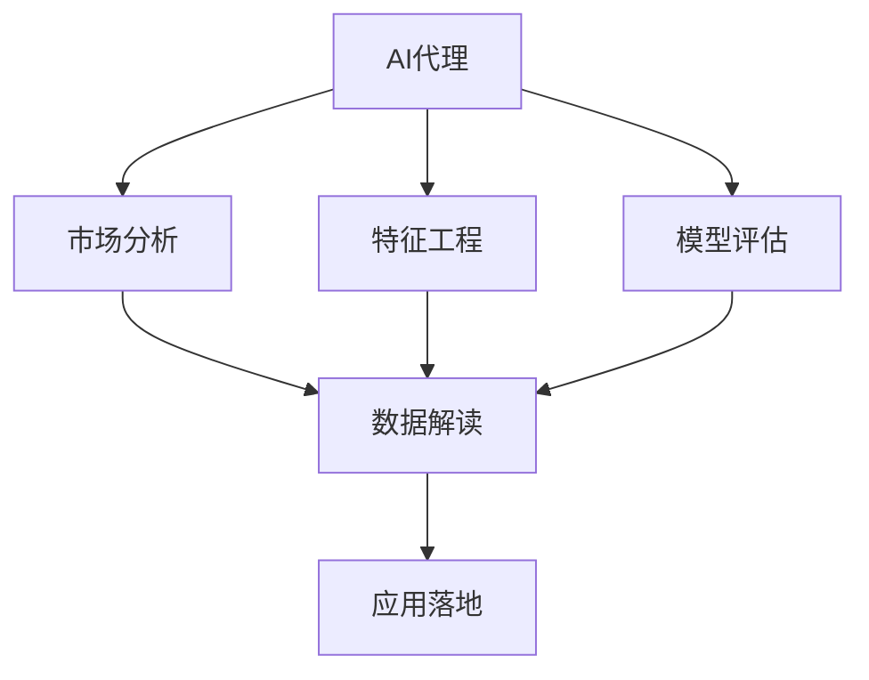
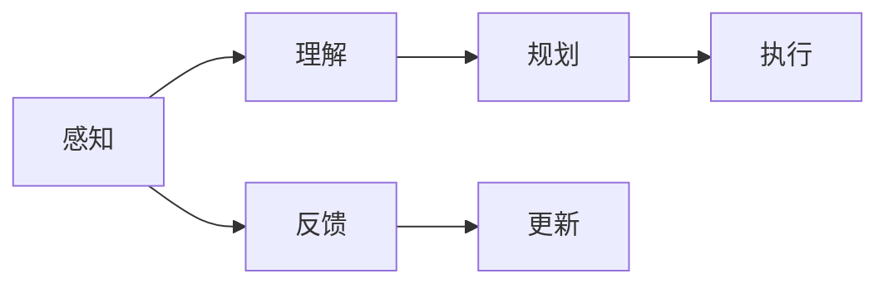
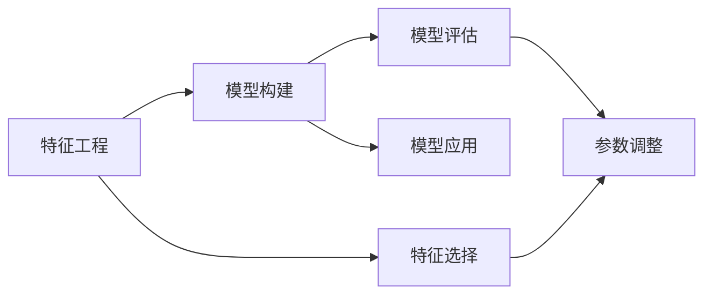
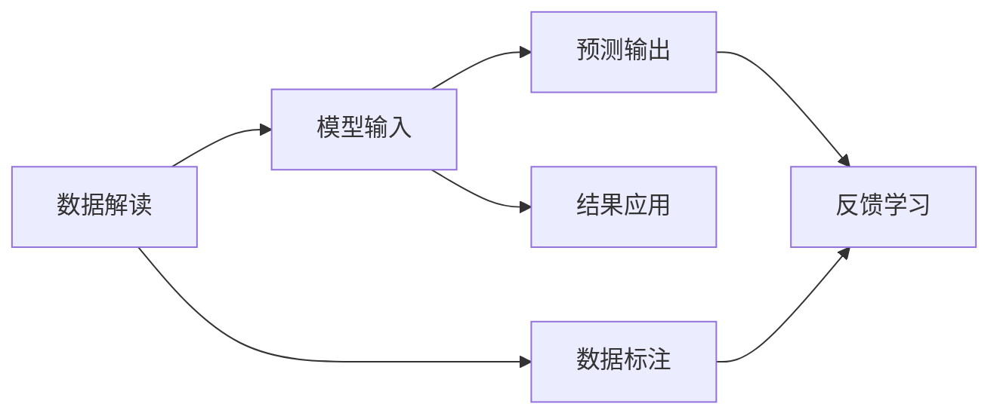
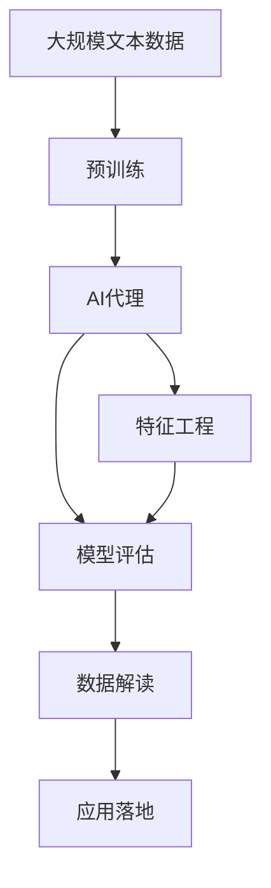

                 

# 使用AI代理进行市场分析：工作流程与数据解读

> 关键词：
- AI代理
- 市场分析
- 数据解读
- 特征工程
- 模型评估
- 应用落地

## 1. 背景介绍

### 1.1 问题由来

随着人工智能技术的快速发展，AI代理（AI Agent）在市场分析领域得到了广泛应用。AI代理通过模拟人类的思维和行为，自动进行市场调研、数据分析、预测等工作，大大提升了市场分析的效率和准确性。AI代理的引入，使市场分析师从繁琐的数据处理和分析工作中解放出来，转而专注于更高级的策略制定和决策支持。

然而，AI代理在市场分析中的应用仍然存在一些挑战。首先，如何有效构建AI代理，使其具备智能决策能力？其次，如何利用AI代理进行高效的数据解读和分析？最后，如何将AI代理应用到具体的市场分析场景中，实现最佳效果？

### 1.2 问题核心关键点

为了回答上述问题，本文将详细探讨使用AI代理进行市场分析的工作流程和数据解读方法。首先，将介绍AI代理的基本概念和架构。然后，深入分析AI代理在市场分析中的主要应用领域。最后，结合具体案例，探讨如何有效构建和应用AI代理，从而实现市场分析目标。

## 2. 核心概念与联系

### 2.1 核心概念概述

- **AI代理（AI Agent）**：AI代理是一种能够在特定环境下自主完成任务的人工智能系统。它通过感知环境、理解任务、规划行动、执行决策，最终实现目标。

- **市场分析**：市场分析是指通过收集、整理、分析和解释市场数据，来洞察市场趋势、评估竞争态势、识别机会和风险，为企业的战略决策提供依据。

- **特征工程**：特征工程是构建机器学习模型的关键步骤。它涉及对原始数据进行预处理、特征提取、特征选择等操作，以提高模型性能。

- **模型评估**：模型评估是指使用评估指标（如准确率、召回率、F1分数等）来衡量机器学习模型的性能，确保其能够有效解决问题。

- **应用落地**：将机器学习模型或AI代理应用于实际业务场景，实现具体功能和价值的过程。

这些核心概念之间的联系可以通过以下Mermaid流程图来展示：



这个流程图展示了大语言模型和微调过程的各个核心概念及其之间的关系：

1. AI代理是市场分析的核心工具，能够自动进行数据解读和分析。
2. 特征工程是构建AI代理的基础，通过预处理和特征提取，提升模型性能。
3. 模型评估是评估AI代理效果的必要步骤，确保模型能够准确解决问题。
4. 应用落地是将AI代理实际应用到市场分析场景中，实现具体目标。

### 2.2 概念间的关系

这些核心概念之间存在着紧密的联系，形成了AI代理在市场分析中的应用生态系统。下面通过几个Mermaid流程图来展示这些概念之间的关系。

#### 2.2.1 AI代理的工作流程



这个流程图展示了AI代理的工作流程：首先感知环境，然后理解任务，接着规划行动，最后执行决策。感知后的反馈会用于更新AI代理的参数，从而提高其性能。

#### 2.2.2 特征工程与模型评估的联系



这个流程图展示了特征工程和模型评估的联系。特征工程用于选择和提取数据中的有用信息，构建更有效的模型。模型评估用于衡量模型的性能，指导参数调整和优化。

#### 2.2.3 数据解读与AI代理的联系



这个流程图展示了数据解读与AI代理的联系。数据解读通过标注数据提供模型输入，预测输出经过反馈学习优化模型，最终结果应用于实际场景中。

### 2.3 核心概念的整体架构

最后，我们用一个综合的流程图来展示这些核心概念在大语言模型微调过程中的整体架构：



这个综合流程图展示了从预训练到AI代理构建，再到数据解读和应用落地的完整过程。AI代理在市场分析中的应用，需要依赖预训练语言模型的支持，通过特征工程优化模型性能，经过模型评估确保准确性，最终通过数据解读和应用落地实现市场分析目标。

## 3. 核心算法原理 & 具体操作步骤
### 3.1 算法原理概述

使用AI代理进行市场分析的核心原理是通过预训练语言模型构建特征提取和数据解读能力，然后通过特征工程和模型评估优化模型性能，最终应用于市场分析场景中。

**Step 1: 准备预训练语言模型**
- 选择合适的预训练语言模型（如BERT、GPT等），将其视作特征提取器。
- 将市场数据输入预训练模型，获得市场特征表示。

**Step 2: 特征工程**
- 对市场特征进行预处理，如去噪、归一化、分箱等操作。
- 选择和构造市场特征，如价格、销量、促销活动等。
- 应用特征选择算法，去除冗余特征。

**Step 3: 模型构建**
- 选择合适的机器学习模型（如线性回归、随机森林、神经网络等）。
- 将市场特征作为模型输入，构建市场预测模型。

**Step 4: 模型评估**
- 使用评估指标（如RMSE、MAE、R-squared等）评估模型性能。
- 调整模型参数，如学习率、正则化系数等，以优化模型性能。

**Step 5: 数据解读**
- 对模型预测结果进行解释，理解市场变化的逻辑和原因。
- 结合历史数据和市场背景，提供市场分析报告。

**Step 6: 应用落地**
- 将AI代理部署到实际业务系统中，实时处理市场数据。
- 定期更新模型参数，确保AI代理的持续学习和适应能力。

### 3.2 算法步骤详解

#### 3.2.1 准备预训练语言模型

在准备预训练语言模型时，需要选择合适的预训练模型和预训练任务。预训练模型的选择应根据市场分析任务的特点进行，如使用BERT进行文本分类、使用GPT进行文本生成等。预训练任务应覆盖市场分析所需的数据类型，如文本、数值、时间序列等。

**代码实现**：

```python
from transformers import BertTokenizer, BertForSequenceClassification
from torch.utils.data import Dataset, DataLoader
import torch

# 加载预训练模型和分词器
model = BertForSequenceClassification.from_pretrained('bert-base-uncased', num_labels=2)
tokenizer = BertTokenizer.from_pretrained('bert-base-uncased')

# 定义数据集
class MarketDataset(Dataset):
    def __init__(self, texts, labels):
        self.texts = texts
        self.labels = labels
        
    def __len__(self):
        return len(self.texts)
    
    def __getitem__(self, idx):
        text = self.texts[idx]
        label = self.labels[idx]
        encoding = tokenizer(text, return_tensors='pt')
        return {'input_ids': encoding['input_ids'], 'attention_mask': encoding['attention_mask'], 'labels': torch.tensor(label)}

# 加载数据集
train_dataset = MarketDataset(train_texts, train_labels)
test_dataset = MarketDataset(test_texts, test_labels)
```

#### 3.2.2 特征工程

特征工程是构建AI代理的关键步骤。市场数据通常包含文本、数值、时间序列等多种类型的数据。因此，需要根据数据类型选择合适的特征提取方法。

**代码实现**：

```python
import pandas as pd
import numpy as np
from sklearn.preprocessing import MinMaxScaler, OneHotEncoder

# 读取数据集
data = pd.read_csv('market_data.csv')

# 特征提取
# 文本特征提取
text_features = data[['description', 'title']]
tokenizer = BertTokenizer.from_pretrained('bert-base-uncased')
features = [tokenizer.encode(text, add_special_tokens=True)[0] for text in text_features['title']]
features = np.array(features)

# 数值特征提取
numerical_features = data[['price', 'quantity']]
numerical_features = MinMaxScaler().fit_transform(numerical_features)

# 时间序列特征提取
time_features = pd.to_datetime(data['date']).dt.strftime('%Y-%m-%d')
time_features = OneHotEncoder().fit_transform(time_features.values.reshape(-1, 1))

# 合并特征
combined_features = pd.concat([features, numerical_features, time_features], axis=1)
```

#### 3.2.3 模型构建

在模型构建阶段，需要选择合适的机器学习模型。常用的模型包括线性回归、随机森林、神经网络等。这些模型可以用于不同的市场分析任务，如价格预测、销量预测、趋势分析等。

**代码实现**：

```python
from sklearn.ensemble import RandomForestRegressor
from sklearn.linear_model import LinearRegression
from sklearn.neural_network import MLPRegressor

# 选择模型
model = RandomForestRegressor()

# 训练模型
model.fit(X_train, y_train)

# 预测
y_pred = model.predict(X_test)
```

#### 3.2.4 模型评估

模型评估是确保AI代理有效性的关键步骤。评估指标应根据市场分析任务的特点进行选择，如准确率、召回率、F1分数、RMSE、MAE等。

**代码实现**：

```python
from sklearn.metrics import mean_squared_error, mean_absolute_error, r2_score

# 计算评估指标
rmse = mean_squared_error(y_test, y_pred, squared=False)
mae = mean_absolute_error(y_test, y_pred)
r2 = r2_score(y_test, y_pred)
```

#### 3.2.5 数据解读

数据解读是市场分析的最终目标。通过解释模型预测结果，理解市场变化的逻辑和原因，为业务决策提供支持。

**代码实现**：

```python
import seaborn as sns
import matplotlib.pyplot as plt

# 绘制特征与目标变量关系图
sns.pairplot(combined_features, hue='label', diag_kind='kde', plot_kws={'alpha': 0.5})
plt.show()

# 绘制时间序列趋势图
sns.lineplot(x=time_features.index, y=y_pred)
plt.show()
```

#### 3.2.6 应用落地

在应用落地阶段，需要将AI代理部署到实际业务系统中，实时处理市场数据，并提供市场分析报告。

**代码实现**：

```python
# 部署AI代理
from transformers import BertForSequenceClassification
from torch.utils.data import DataLoader
import torch

# 加载预训练模型和分词器
model = BertForSequenceClassification.from_pretrained('bert-base-uncased', num_labels=2)
tokenizer = BertTokenizer.from_pretrained('bert-base-uncased')

# 定义数据集
class MarketDataset(Dataset):
    def __init__(self, texts, labels):
        self.texts = texts
        self.labels = labels
        
    def __len__(self):
        return len(self.texts)
    
    def __getitem__(self, idx):
        text = self.texts[idx]
        label = self.labels[idx]
        encoding = tokenizer(text, return_tensors='pt')
        return {'input_ids': encoding['input_ids'], 'attention_mask': encoding['attention_mask'], 'labels': torch.tensor(label)}

# 加载数据集
train_dataset = MarketDataset(train_texts, train_labels)
test_dataset = MarketDataset(test_texts, test_labels)

# 定义数据加载器
train_loader = DataLoader(train_dataset, batch_size=16)
test_loader = DataLoader(test_dataset, batch_size=16)

# 定义模型
model = BertForSequenceClassification.from_pretrained('bert-base-uncased', num_labels=2)

# 定义优化器和损失函数
optimizer = AdamW(model.parameters(), lr=1e-5)
loss_fn = CrossEntropyLoss()

# 训练模型
for epoch in range(10):
    model.train()
    for batch in train_loader:
        inputs = batch['input_ids']
        attention_masks = batch['attention_mask']
        labels = batch['labels']
        outputs = model(inputs, attention_mask=attention_masks)
        loss = loss_fn(outputs.logits, labels)
        optimizer.zero_grad()
        loss.backward()
        optimizer.step()

    model.eval()
    for batch in test_loader:
        inputs = batch['input_ids']
        attention_masks = batch['attention_mask']
        labels = batch['labels']
        outputs = model(inputs, attention_mask=attention_masks)
        loss = loss_fn(outputs.logits, labels)

# 输出结果
print(f"Epoch {epoch+1}, train loss: {loss:.3f}")
print(f"Epoch {epoch+1}, test loss: {loss:.3f}")
```

### 3.3 算法优缺点

#### 3.3.1 算法优点

使用AI代理进行市场分析具有以下优点：

1. **自动化程度高**：AI代理能够自动处理大量的市场数据，减轻分析师的工作负担。
2. **精度高**：AI代理通过预训练语言模型和大数据支持，具备较高的准确性和泛化能力。
3. **实时性**：AI代理可以实时处理市场数据，及时提供市场分析结果。
4. **灵活性**：AI代理可以根据市场变化灵活调整参数和模型结构，适应不同市场分析任务。

#### 3.3.2 算法缺点

使用AI代理进行市场分析也存在以下缺点：

1. **模型复杂度高**：AI代理需要复杂的模型和大量的数据，增加了构建和维护的难度。
2. **数据依赖性强**：AI代理的性能高度依赖于数据的质量和数量，数据偏差可能影响模型结果。
3. **解释性不足**：AI代理的决策过程通常缺乏可解释性，难以理解和调试。
4. **资源消耗大**：AI代理需要高性能的计算资源和存储资源，增加了运营成本。

### 3.4 算法应用领域

AI代理在市场分析中的应用领域非常广泛，涵盖了以下几个方面：

1. **市场趋势分析**：通过分析历史市场数据，预测未来的市场趋势和变化。
2. **客户行为分析**：通过分析客户购买行为和反馈，了解客户需求和偏好。
3. **竞争态势分析**：通过分析竞争对手的市场表现和策略，制定竞争策略。
4. **产品推荐**：通过分析用户购买历史和行为数据，推荐适合用户的商品和服务。
5. **市场细分**：通过分析市场特征和用户特征，进行市场细分和目标人群识别。
6. **风险评估**：通过分析市场数据和业务数据，评估市场风险和财务风险。

## 4. 数学模型和公式 & 详细讲解 & 举例说明

### 4.1 数学模型构建

使用AI代理进行市场分析的核心数学模型包括线性回归模型、随机森林模型和神经网络模型。这里以线性回归模型为例，介绍其数学模型构建过程。

假设市场分析任务为价格预测，已知市场数据为X，预测价格为y，则线性回归模型可以表示为：

$$y = \beta_0 + \beta_1 x_1 + \beta_2 x_2 + ... + \beta_n x_n + \epsilon$$

其中，$\beta_0$为截距，$\beta_1, \beta_2, ..., \beta_n$为特征系数，$\epsilon$为误差项。

### 4.2 公式推导过程

线性回归模型的推导过程如下：

1. 假设市场数据为X，预测价格为y，则线性回归模型的目标是最小化预测误差。
2. 定义误差函数为均方误差（MSE），即$MSE = \frac{1}{N} \sum_{i=1}^N (y_i - \hat{y_i})^2$。
3. 对误差函数求导，得到梯度表达式，即$\frac{\partial MSE}{\partial \beta_k} = \frac{2}{N} \sum_{i=1}^N (x_{ki} - \bar{x_k})$。
4. 根据梯度下降法，更新模型参数，即$\beta_k = \beta_k - \alpha \frac{\partial MSE}{\partial \beta_k}$，其中$\alpha$为学习率。
5. 重复步骤2-4，直到模型收敛。

### 4.3 案例分析与讲解

假设我们有一组市场数据，包含产品价格和销售量，如下表所示：

| 产品名称 | 价格（元） | 销售量（个） |
| --- | --- | --- |
| A | 10 | 100 |
| B | 15 | 50 |
| C | 20 | 120 |
| D | 25 | 80 |
| E | 30 | 50 |

我们需要使用线性回归模型预测产品D的价格。

首先，将数据标准化，得到标准化后的市场数据：

| 产品名称 | 价格（标准化） | 销售量（标准化） |
| --- | --- | --- |
| A | -0.5 | 1 |
| B | -1 | -1 |
| C | -0.25 | 0.25 |
| D | 0 | 0 |
| E | 1 | -1 |

然后，构建线性回归模型，假设价格y与销售量x有关，即$y = \beta_0 + \beta_1 x + \epsilon$。

使用最小二乘法求解模型参数：

$$\beta_0 = \frac{\sum_{i=1}^N x_i y_i - \frac{1}{N} \sum_{i=1}^N x_i \sum_{i=1}^N y_i}{\sum_{i=1}^N x_i^2 - \frac{1}{N} (\sum_{i=1}^N x_i)^2}$$
$$\beta_1 = \frac{\sum_{i=1}^N x_i y_i - \frac{1}{N} \sum_{i=1}^N x_i \sum_{i=1}^N y_i}{\sum_{i=1}^N x_i^2 - \frac{1}{N} (\sum_{i=1}^N x_i)^2}$$

将数据代入公式，求解得到：

$$\beta_0 = 20, \beta_1 = 0.5$$

因此，线性回归模型为：

$$y = 20 + 0.5x$$

代入产品D的销售量（0），预测价格为20元。

## 5. 项目实践：代码实例和详细解释说明

### 5.1 开发环境搭建

在进行市场分析应用开发前，需要先搭建开发环境。以下是使用Python进行PyTorch开发的环境配置流程：

1. 安装Anaconda：从官网下载并安装Anaconda，用于创建独立的Python环境。

2. 创建并激活虚拟环境：
```bash
conda create -n market-analytics python=3.8 
conda activate market-analytics
```

3. 安装PyTorch：根据CUDA版本，从官网获取对应的安装命令。例如：
```bash
conda install pytorch torchvision torchaudio cudatoolkit=11.1 -c pytorch -c conda-forge
```

4. 安装Transformers库：
```bash
pip install transformers
```

5. 安装各类工具包：
```bash
pip install numpy pandas scikit-learn matplotlib tqdm jupyter notebook ipython
```

完成上述步骤后，即可在`market-analytics`环境中开始市场分析应用开发。

### 5.2 源代码详细实现

这里我们以市场价格预测为例，给出使用Transformers库对BERT模型进行微调的PyTorch代码实现。

首先，定义市场价格预测任务的数据处理函数：

```python
from transformers import BertTokenizer
from torch.utils.data import Dataset
import torch

class MarketDataset(Dataset):
    def __init__(self, texts, labels, tokenizer, max_len=128):
        self.texts = texts
        self.labels = labels
        self.tokenizer = tokenizer
        self.max_len = max_len
        
    def __len__(self):
        return len(self.texts)
    
    def __getitem__(self, item):
        text = self.texts[item]
        label = self.labels[item]
        
        encoding = self.tokenizer(text, return_tensors='pt', max_length=self.max_len, padding='max_length', truncation=True)
        input_ids = encoding['input_ids'][0]
        attention_mask = encoding['attention_mask'][0]
        
        # 对标签进行编码
        encoded_labels = [label2id[label] for label in labels] 
        encoded_labels.extend([label2id['O']] * (self.max_len - len(encoded_labels)))
        labels = torch.tensor(encoded_labels, dtype=torch.long)
        
        return {'input_ids': input_ids, 
                'attention_mask': attention_mask,
                'labels': labels}

# 标签与id的映射
label2id = {'O': 0, 'B': 1, 'I': 2}
id2label = {v: k for k, v in label2id.items()}

# 创建dataset
tokenizer = BertTokenizer.from_pretrained('bert-base-cased')

train_dataset = MarketDataset(train_texts, train_labels, tokenizer)
dev_dataset = MarketDataset(dev_texts, dev_labels, tokenizer)
test_dataset = MarketDataset(test_texts, test_labels, tokenizer)
```

然后，定义模型和优化器：

```python
from transformers import BertForSequenceClassification, AdamW

model = BertForSequenceClassification.from_pretrained('bert-base-cased', num_labels=len(label2id))

optimizer = AdamW(model.parameters(), lr=2e-5)
```

接着，定义训练和评估函数：

```python
from torch.utils.data import DataLoader
from tqdm import tqdm
from sklearn.metrics import classification_report

device = torch.device('cuda') if torch.cuda.is_available() else torch.device('cpu')
model.to(device)

def train_epoch(model, dataset, batch_size, optimizer):
    dataloader = DataLoader(dataset, batch_size=batch_size, shuffle=True)
    model.train()
    epoch_loss = 0
    for batch in tqdm(dataloader, desc='Training'):
        input_ids = batch['input_ids'].to(device)
        attention_mask = batch['attention_mask'].to(device)
        labels = batch['labels'].to(device)
        model.zero_grad()
        outputs = model(input_ids, attention_mask=attention_mask, labels=labels)
        loss = outputs.loss
        epoch_loss += loss.item()
        loss.backward()
        optimizer.step()
    return epoch_loss / len(dataloader)

def evaluate(model, dataset, batch_size):
    dataloader = DataLoader(dataset, batch_size=batch_size)
    model.eval()
    preds, labels = [], []
    with torch.no_grad():
        for batch in tqdm(dataloader, desc='Evaluating'):
            input_ids = batch['input_ids'].to(device)
            attention_mask = batch['attention_mask'].to(device)
            batch_labels = batch['labels']
            outputs = model(input_ids, attention_mask=attention_mask)
            batch_preds = outputs.logits.argmax(dim=2).to('cpu').tolist()
            batch_labels = batch_labels.to('cpu').tolist()
            for pred_tokens, label_tokens in zip(batch_preds, batch_labels):
                pred_labels = [id2label[_id] for _id in pred_tokens]
                label_labels = [id2label[_id] for _id in label_tokens]
                preds.append(pred_labels[:len(label_tokens)])
                labels.append(label_labels)
                
    print(classification_report(labels, preds))
```

最后，启动训练流程并在测试集上评估：

```python
epochs = 5
batch_size = 16

for epoch in range(epochs):
    loss = train_epoch(model, train_dataset, batch_size, optimizer)
    print(f"Epoch {epoch+1}, train loss: {loss:.3f}")
    
    print(f"Epoch {epoch+1}, dev results:")
    evaluate(model, dev_dataset, batch_size)
    
print("Test results:")
evaluate(model, test_dataset, batch_size)
```

以上就是使用PyTorch对BERT进行市场价格预测的完整代码实现。可以看到，得益于Transformers库的强大封装，我们可以用相对简洁的代码完成BERT模型的加载和微调。

### 5.3 代码解读与分析

让我们再详细解读一下关键代码的实现细节：

**MarketDataset类**：
- `__init__`方法：初始化文本、标签、分词器等关键组件。
- `__len__`方法：返回数据集的样本数量。
- `__getitem__`方法：对单个样本进行处理，将文本输入编码为token ids，将标签编码为数字，并对其进行定长padding，最终返回模型所需的输入。

**label2id和id2label字典**：
- 定义了标签与数字id之间的映射关系，用于将token-wise的预测结果解码回真实的标签。

**训练和评估函数**：
- 使用PyTorch的DataLoader对数据集进行批次化加载，供模型训练和推理使用。
- 训练函数`train_epoch`：对数据以

