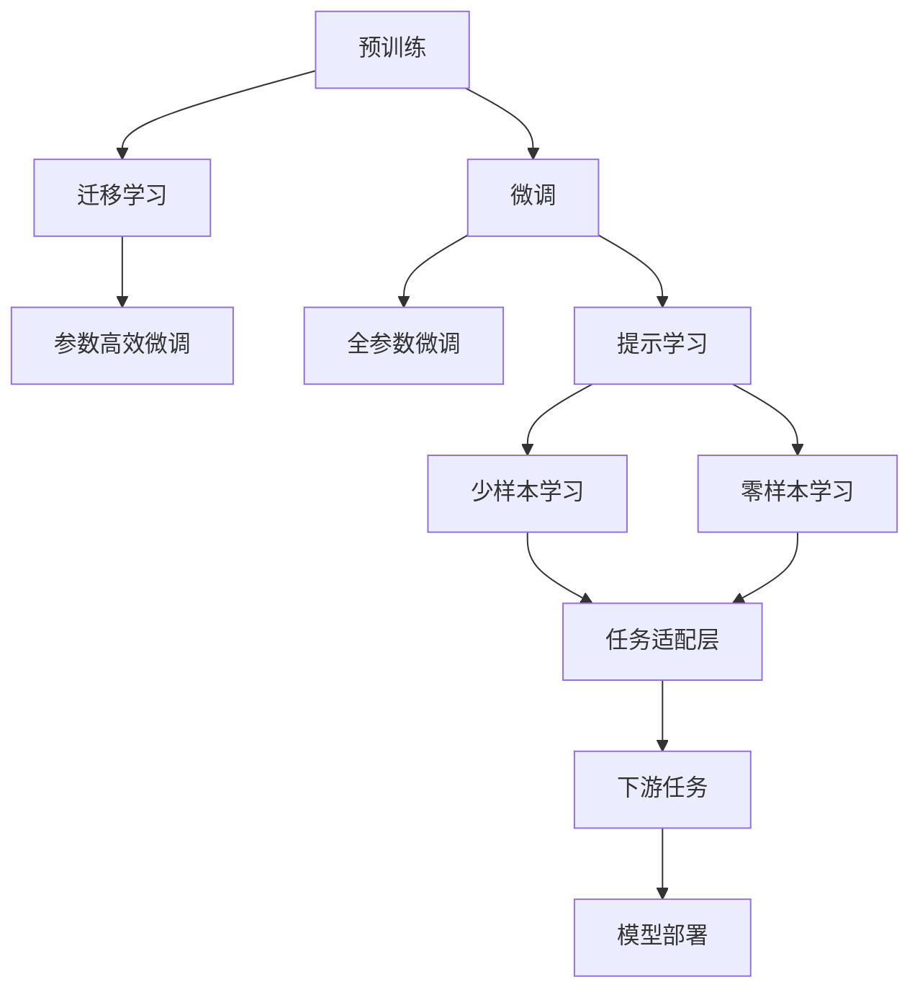

                 

## 1. 背景介绍

### 1.1 问题由来
自20世纪50年代以来，计算机科学家一直在探索如何让机器具备人类语言理解与处理的能力。1950年，图灵提出了著名的图灵测试，提出如果机器能够和人类进行无差别的对话，那么就可以认为它具备了理解语言的能力。尽管这个测试极其严格，但自此之后，语言理解和生成成为了人工智能研究的重要分支。

进入21世纪，随着深度学习技术的发展，大规模语言模型（Large Language Models, LLMs）如OpenAI的GPT系列、Google的BERT等，开始展现出惊人的能力。这些模型通过在大规模无标签文本数据上进行预训练，学习到了丰富的语言知识和常识，已经能够胜任各种自然语言处理（Natural Language Processing, NLP）任务，如问答、翻译、情感分析等。

然而，这些大模型往往需要大量的计算资源和标注数据才能达到最佳性能。因此，如何在大规模数据上训练出高质量的语言模型，同时高效地适应特定任务，成为了目前研究的热点。本文将聚焦于大语言模型的起源与发展，探讨其基本原理与核心概念，并展望未来应用方向。

### 1.2 问题核心关键点
大语言模型的起源与发展主要涉及以下几个核心关键点：
1. **预训练**：利用大规模无标签数据进行自监督学习，学习通用的语言表示。
2. **微调**：在有标签数据上进一步优化模型，使其适应特定任务。
3. **迁移学习**：将预训练模型在不同任务间进行迁移，提升泛化能力。
4. **参数高效微调**：只更新模型中部分参数，以减少计算和内存消耗。
5. **提示学习**：通过精心设计输入，引导模型输出特定结果。

这些核心概念构成了大语言模型的基石，推动了其在NLP领域的广泛应用。

## 2. 核心概念与联系

### 2.1 核心概念概述

为更好地理解大语言模型及其发展历程，我们将介绍几个核心概念：

- **预训练**：指在大规模无标签文本语料上进行自监督学习，训练模型来学习通用的语言表示。
- **微调**：在有标签数据上进一步优化模型，使其适应特定任务，如分类、翻译、生成等。
- **迁移学习**：将预训练模型在不同任务间进行迁移，提升泛化能力。
- **参数高效微调**：在微调过程中，只更新模型中部分参数，以减少计算和内存消耗。
- **提示学习**：通过精心设计输入，引导模型输出特定结果，减少微调参数。

这些核心概念之间紧密联系，共同构成了大语言模型学习与应用的完整框架。

### 2.2 概念间的关系

这些核心概念之间的关系可以通过以下Mermaid流程图来展示：



这个流程图展示了预训练、微调、迁移学习等概念之间的关系，以及它们在大语言模型学习与应用中的具体应用场景。

## 3. 核心算法原理 & 具体操作步骤
### 3.1 算法原理概述

大语言模型的核心原理基于神经网络，特别是Transformer结构。其基本原理可以归纳为以下三个步骤：

1. **预训练**：在大规模无标签文本数据上，通过自监督学习任务（如掩码语言模型）训练模型，学习通用的语言表示。
2. **微调**：在有标签数据上，通过监督学习任务（如分类、翻译、生成等）进一步优化模型，使其适应特定任务。
3. **迁移学习**：将预训练模型在不同任务间进行迁移，提升泛化能力。

### 3.2 算法步骤详解

#### 3.2.1 预训练

预训练是大语言模型的基础，其主要目标是在大规模无标签文本数据上，通过自监督学习任务（如掩码语言模型、下一句预测、位置预测等）训练模型，学习通用的语言表示。

#### 3.2.2 微调

微调是在预训练模型基础上，利用有标签数据进行进一步优化，使其适应特定任务。微调过程通常包括如下步骤：

1. **选择模型**：选择合适的预训练模型（如BERT、GPT-2等）。
2. **添加任务适配层**：根据任务类型，在预训练模型顶层添加相应的任务适配层（如分类头、注意力机制等）。
3. **设置超参数**：选择合适的优化算法（如AdamW、SGD等）及其参数（如学习率、批大小等），并设置正则化技术（如Dropout、L2正则等）。
4. **执行训练**：将有标签数据分批次输入模型，前向传播计算损失函数，反向传播计算梯度，更新模型参数。
5. **评估与优化**：在验证集上评估模型性能，根据评估结果调整超参数，直至模型收敛。

#### 3.2.3 迁移学习

迁移学习是将预训练模型在不同任务间进行迁移，提升泛化能力。其基本步骤如下：

1. **收集数据**：收集不同任务的标注数据。
2. **预训练模型迁移**：将预训练模型在不同任务上微调，使用相同的预训练参数和部分任务适配层。
3. **任务适配层调整**：根据不同任务，调整适配层的参数，以适应新任务。
4. **训练与评估**：在新任务上有标签数据上训练模型，并评估其性能。

### 3.3 算法优缺点

大语言模型及其微调方法具有以下优点：
1. **泛化能力强**：通过预训练和微调，模型可以学习到通用的语言表示，适应不同任务。
2. **计算效率高**：利用参数高效微调方法，可以显著减少计算和内存消耗。
3. **可解释性强**：通过提示学习，模型可以输出详细的推理过程，便于解释与调试。
4. **少样本学习能力强**：通过提示学习，模型可以在少量标注数据下取得优异性能。

但同时，也存在一些缺点：
1. **数据依赖性强**：微调效果高度依赖于标注数据的质量和数量。
2. **过拟合风险**：微调过程中，模型容易过拟合少量标注数据。
3. **模型复杂度高**：大语言模型的复杂度较高，需要大量计算资源。
4. **迁移能力有限**：预训练模型在不同领域之间的迁移能力较弱。

### 3.4 算法应用领域

大语言模型及其微调方法在NLP领域已经得到了广泛应用，涵盖文本分类、命名实体识别、关系抽取、问答系统、机器翻译、文本摘要、对话系统等多个方向。以下是几个典型的应用场景：

- **文本分类**：如情感分析、主题分类、意图识别等。通过微调，模型能够学习文本-标签映射。
- **命名实体识别**：识别文本中的人名、地名、机构名等特定实体。通过微调，模型掌握实体边界和类型。
- **关系抽取**：从文本中抽取实体之间的语义关系。通过微调，模型学习实体-关系三元组。
- **问答系统**：对自然语言问题给出答案。将问题-答案对作为微调数据，训练模型学习匹配答案。
- **机器翻译**：将源语言文本翻译成目标语言。通过微调，模型学习语言-语言映射。
- **文本摘要**：将长文本压缩成简短摘要。将文章-摘要对作为微调数据，使模型学习抓取要点。
- **对话系统**：使机器能够与人自然对话。将多轮对话历史作为上下文，微调模型进行回复生成。

除了上述这些经典任务外，大语言模型及其微调方法还在代码生成、数据增强、知识图谱构建等多个方向发挥重要作用。

## 4. 数学模型和公式 & 详细讲解

### 4.1 数学模型构建

在数学模型构建方面，我们以BERT为例进行详细讲解。BERT通过在大规模无标签文本数据上预训练，学习通用的语言表示。在有标签数据上，通过微调进一步优化模型，使其适应特定任务。

#### 4.1.1 预训练模型

BERT的预训练模型基于Transformer结构，主要包括编码器层（Encoder Layer）和自监督学习任务（如掩码语言模型）。

编码器层由多个Transformer层组成，每个Transformer层包括自注意力机制（Self-Attention）和前馈神经网络（Feedforward Neural Network）。自注意力机制用于计算输入序列中各位置之间的相互作用，前馈神经网络用于对输入序列进行线性变换和激活函数。

自监督学习任务主要是掩码语言模型（Masked Language Model, MLM）。掩码语言模型通过随机遮盖输入序列中的某些位置，要求模型预测被遮盖位置的词语，从而学习通用的语言表示。

#### 4.1.2 微调模型

在微调过程中，通过添加任务适配层，利用有标签数据进一步优化模型。以文本分类任务为例，任务适配层包括分类头（Classification Head）和全连接层（Fully Connected Layer）。

分类头用于输出类别概率，全连接层用于将输入序列映射到分类头。模型的损失函数为交叉熵损失函数，用于衡量预测类别与真实标签之间的差异。

### 4.2 公式推导过程

以BERT模型为例，其预训练损失函数为：

$$
\mathcal{L}_{\text{MLM}} = -\frac{1}{N}\sum_{i=1}^N \sum_{j=1}^M \log P(x_j|x_1, \cdots, x_{j-1}, \tilde{x}_j, x_{j+1}, \cdots, x_N)
$$

其中，$x_j$表示输入序列中的第$j$个词语，$\tilde{x}_j$表示遮盖后的词语。$P(x_j|x_1, \cdots, x_{j-1}, \tilde{x}_j, x_{j+1}, \cdots, x_N)$表示模型在遮盖位置预测词语$x_j$的条件概率。

微调模型的损失函数为：

$$
\mathcal{L} = \mathcal{L}_{\text{MLM}} + \mathcal{L}_{\text{CLS}} + \mathcal{L}_{\text{SEP}}
$$

其中，$\mathcal{L}_{\text{CLS}}$和$\mathcal{L}_{\text{SEP}}$分别为分类头和全连接层的损失函数。

### 4.3 案例分析与讲解

以BERT模型在情感分析任务上的微调为例，具体步骤如下：

1. **数据准备**：收集情感分析任务的标注数据，划分为训练集、验证集和测试集。
2. **模型加载**：加载BERT模型，并添加任务适配层（包括分类头和全连接层）。
3. **设置超参数**：选择合适的优化算法（如AdamW）及其参数（如学习率、批大小等），并设置正则化技术（如L2正则、Dropout等）。
4. **训练与评估**：将训练集数据分批次输入模型，前向传播计算损失函数，反向传播计算梯度，更新模型参数。在验证集上评估模型性能，调整超参数，直至模型收敛。
5. **测试与部署**：在测试集上评估微调后模型，对比微调前后的精度提升。使用微调后的模型对新样本进行推理预测，集成到实际应用系统中。

## 5. 项目实践：代码实例和详细解释说明

### 5.1 开发环境搭建

在进行大模型微调项目实践前，我们需要准备好开发环境。以下是使用Python进行PyTorch开发的环境配置流程：

1. 安装Anaconda：从官网下载并安装Anaconda，用于创建独立的Python环境。

2. 创建并激活虚拟环境：
```bash
conda create -n pytorch-env python=3.8 
conda activate pytorch-env
```

3. 安装PyTorch：根据CUDA版本，从官网获取对应的安装命令。例如：
```bash
conda install pytorch torchvision torchaudio cudatoolkit=11.1 -c pytorch -c conda-forge
```

4. 安装Transformers库：
```bash
pip install transformers
```

5. 安装各类工具包：
```bash
pip install numpy pandas scikit-learn matplotlib tqdm jupyter notebook ipython
```

完成上述步骤后，即可在`pytorch-env`环境中开始微调实践。

### 5.2 源代码详细实现

这里以BERT模型在情感分析任务上的微调为例，给出使用Transformers库的PyTorch代码实现。

```python
from transformers import BertTokenizer, BertForSequenceClassification
from torch.utils.data import Dataset, DataLoader
import torch
from sklearn.metrics import classification_report

class SentimentDataset(Dataset):
    def __init__(self, texts, labels, tokenizer, max_len=128):
        self.texts = texts
        self.labels = labels
        self.tokenizer = tokenizer
        self.max_len = max_len
        
    def __len__(self):
        return len(self.texts)
    
    def __getitem__(self, item):
        text = self.texts[item]
        label = self.labels[item]
        
        encoding = self.tokenizer(text, return_tensors='pt', max_length=self.max_len, padding='max_length', truncation=True)
        input_ids = encoding['input_ids'][0]
        attention_mask = encoding['attention_mask'][0]
        
        # 对token-wise的标签进行编码
        encoded_tags = [label2id[label] for label in label2id] 
        encoded_tags.extend([label2id['O']] * (self.max_len - len(encoded_tags)))
        labels = torch.tensor(encoded_tags, dtype=torch.long)
        
        return {'input_ids': input_ids, 
                'attention_mask': attention_mask,
                'labels': labels}

# 标签与id的映射
label2id = {'positive': 1, 'negative': 0}
id2label = {v: k for k, v in label2id.items()}

# 创建dataset
tokenizer = BertTokenizer.from_pretrained('bert-base-cased')

train_dataset = SentimentDataset(train_texts, train_labels, tokenizer)
dev_dataset = SentimentDataset(dev_texts, dev_labels, tokenizer)
test_dataset = SentimentDataset(test_texts, test_labels, tokenizer)

# 模型初始化
model = BertForSequenceClassification.from_pretrained('bert-base-cased', num_labels=len(label2id))

# 设置优化器与学习率
optimizer = AdamW(model.parameters(), lr=2e-5)

# 定义训练与评估函数
def train_epoch(model, dataset, batch_size, optimizer):
    dataloader = DataLoader(dataset, batch_size=batch_size, shuffle=True)
    model.train()
    epoch_loss = 0
    for batch in dataloader:
        input_ids = batch['input_ids'].to(device)
        attention_mask = batch['attention_mask'].to(device)
        labels = batch['labels'].to(device)
        model.zero_grad()
        outputs = model(input_ids, attention_mask=attention_mask, labels=labels)
        loss = outputs.loss
        epoch_loss += loss.item()
        loss.backward()
        optimizer.step()
    return epoch_loss / len(dataloader)

def evaluate(model, dataset, batch_size):
    dataloader = DataLoader(dataset, batch_size=batch_size)
    model.eval()
    preds, labels = [], []
    with torch.no_grad():
        for batch in dataloader:
            input_ids = batch['input_ids'].to(device)
            attention_mask = batch['attention_mask'].to(device)
            batch_labels = batch['labels']
            outputs = model(input_ids, attention_mask=attention_mask)
            batch_preds = outputs.logits.argmax(dim=2).to('cpu').tolist()
            batch_labels = batch_labels.to('cpu').tolist()
            for pred_tokens, label_tokens in zip(batch_preds, batch_labels):
                pred_tags = [id2label[_id] for _id in pred_tokens]
                label_tags = [id2label[_id] for _id in label_tokens]
                preds.append(pred_tags[:len(label_tokens)])
                labels.append(label_tags)
                
    return classification_report(labels, preds)

# 训练与评估
epochs = 5
batch_size = 16

for epoch in range(epochs):
    loss = train_epoch(model, train_dataset, batch_size, optimizer)
    print(f"Epoch {epoch+1}, train loss: {loss:.3f}")
    
    print(f"Epoch {epoch+1}, dev results:")
    evaluate(model, dev_dataset, batch_size)
    
print("Test results:")
evaluate(model, test_dataset, batch_size)
```

### 5.3 代码解读与分析

这段代码展示了使用BERT模型进行情感分析任务微调的全过程。其中，SentimentDataset类用于数据预处理，将文本转换为BERT模型所需的格式。BERTForSequenceClassification模型用于微调，分类头用于输出情感分类。训练与评估函数分别用于训练模型和评估模型性能。

训练过程中，模型参数更新采用AdamW优化器，学习率为2e-5。在验证集上每epoch评估一次，调整学习率。最终在测试集上评估模型性能，输出分类指标。

## 6. 实际应用场景

大语言模型及其微调方法在多个领域已得到广泛应用，以下列举几个典型场景：

### 6.1 智能客服系统

智能客服系统利用大语言模型及其微调技术，提供7x24小时不间断服务，快速响应客户咨询，用自然流畅的语言解答各类常见问题。系统通过收集历史客服对话记录，将问题和最佳答复构建成监督数据，对BERT模型进行微调。微调后的模型能够自动理解用户意图，匹配最合适的答案模板进行回复。对于客户提出的新问题，系统还可以接入检索系统实时搜索相关内容，动态组织生成回答。

### 6.2 金融舆情监测

金融机构利用大语言模型及其微调技术，实时监测市场舆论动向，及时应对负面信息传播，规避金融风险。系统收集金融领域相关的新闻、报道、评论等文本数据，并对其进行主题标注和情感标注。在此基础上对BERT模型进行微调，使其能够自动判断文本属于何种主题，情感倾向是正面、中性还是负面。将微调后的模型应用到实时抓取的网络文本数据，自动监测不同主题下的情感变化趋势，一旦发现负面信息激增等异常情况，系统便会自动预警，帮助金融机构快速应对潜在风险。

### 6.3 个性化推荐系统

个性化推荐系统利用大语言模型及其微调技术，深度挖掘用户兴趣偏好。系统收集用户浏览、点击、评论、分享等行为数据，提取和用户交互的物品标题、描述、标签等文本内容。将文本内容作为模型输入，用户的后续行为（如是否点击、购买等）作为监督信号，对BERT模型进行微调。微调后的模型能够从文本内容中准确把握用户的兴趣点。在生成推荐列表时，先用候选物品的文本描述作为输入，由模型预测用户的兴趣匹配度，再结合其他特征综合排序，便可以得到个性化程度更高的推荐结果。

## 7. 工具和资源推荐

### 7.1 学习资源推荐

为了帮助开发者系统掌握大语言模型及其微调技术的理论基础和实践技巧，这里推荐一些优质的学习资源：

1. 《Transformer from Foundations to Deep Learning》系列博文：由大模型技术专家撰写，深入浅出地介绍了Transformer原理、BERT模型、微调技术等前沿话题。

2. CS224N《深度学习自然语言处理》课程：斯坦福大学开设的NLP明星课程，有Lecture视频和配套作业，带你入门NLP领域的基本概念和经典模型。

3. 《Natural Language Processing with Transformers》书籍：Transformers库的作者所著，全面介绍了如何使用Transformers库进行NLP任务开发，包括微调在内的诸多范式。

4. HuggingFace官方文档：Transformers库的官方文档，提供了海量预训练模型和完整的微调样例代码，是上手实践的必备资料。

5. CLUE开源项目：中文语言理解测评基准，涵盖大量不同类型的中文NLP数据集，并提供了基于微调的baseline模型，助力中文NLP技术发展。

通过对这些资源的学习实践，相信你一定能够快速掌握大语言模型及其微调的精髓，并用于解决实际的NLP问题。

### 7.2 开发工具推荐

高效的开发离不开优秀的工具支持。以下是几款用于大语言模型及其微调开发的常用工具：

1. PyTorch：基于Python的开源深度学习框架，灵活动态的计算图，适合快速迭代研究。大部分预训练语言模型都有PyTorch版本的实现。

2. TensorFlow：由Google主导开发的开源深度学习框架，生产部署方便，适合大规模工程应用。同样有丰富的预训练语言模型资源。

3. Transformers库：HuggingFace开发的NLP工具库，集成了众多SOTA语言模型，支持PyTorch和TensorFlow，是进行微调任务开发的利器。

4. Weights & Biases：模型训练的实验跟踪工具，可以记录和可视化模型训练过程中的各项指标，方便对比和调优。与主流深度学习框架无缝集成。

5. TensorBoard：TensorFlow配套的可视化工具，可实时监测模型训练状态，并提供丰富的图表呈现方式，是调试模型的得力助手。

6. Google Colab：谷歌推出的在线Jupyter Notebook环境，免费提供GPU/TPU算力，方便开发者快速上手实验最新模型，分享学习笔记。

合理利用这些工具，可以显著提升大语言模型及其微调任务的开发效率，加快创新迭代的步伐。

### 7.3 相关论文推荐

大语言模型及其微调技术的发展源于学界的持续研究。以下是几篇奠基性的相关论文，推荐阅读：

1. Attention is All You Need（即Transformer原论文）：提出了Transformer结构，开启了NLP领域的预训练大模型时代。

2. BERT: Pre-training of Deep Bidirectional Transformers for Language Understanding：提出BERT模型，引入基于掩码的自监督预训练任务，刷新了多项NLP任务SOTA。

3. Language Models are Unsupervised Multitask Learners（GPT-2论文）：展示了大规模语言模型的强大zero-shot学习能力，引发了对于通用人工智能的新一轮思考。

4. Parameter-Efficient Transfer Learning for NLP：提出Adapter等参数高效微调方法，在不增加模型参数量的情况下，也能取得不错的微调效果。

5. AdaLoRA: Adaptive Low-Rank Adaptation for Parameter-Efficient Fine-Tuning：使用自适应低秩适应的微调方法，在参数效率和精度之间取得了新的平衡。

这些论文代表了大语言模型及其微调技术的发展脉络。通过学习这些前沿成果，可以帮助研究者把握学科前进方向，激发更多的创新灵感。

除上述资源外，还有一些值得关注的前沿资源，帮助开发者紧跟大语言模型及其微调技术的最新进展，例如：

1. arXiv论文预印本：人工智能领域最新研究成果的发布平台，包括大量尚未发表的前沿工作，学习前沿技术的必读资源。

2. 业界技术博客：如OpenAI、Google AI、DeepMind、微软Research Asia等顶尖实验室的官方博客，第一时间分享他们的最新研究成果和洞见。

3. 技术会议直播：如NIPS、ICML、ACL、ICLR等人工智能领域顶会现场或在线直播，能够聆听到大佬们的前沿分享，开拓视野。

4. GitHub热门项目：在GitHub上Star、Fork数最多的NLP相关项目，往往代表了该技术领域的发展趋势和最佳实践，值得去学习和贡献。

5. 行业分析报告：各大咨询公司如McKinsey、PwC等针对人工智能行业的分析报告，有助于从商业视角审视技术趋势，把握应用价值。

总之，对于大语言模型及其微调技术的学习和实践，需要开发者保持开放的心态和持续学习的意愿。多关注前沿资讯，多动手实践，多思考总结，必将收获满满的成长收益。

## 8. 总结：未来发展趋势与挑战

### 8.1 总结

本文对大语言模型及其微调方法进行了全面系统的介绍。首先阐述了大语言模型的起源与发展，明确了其在大规模文本数据上预训练和在有标签数据上微调的基本原理。其次，从原理到实践，详细讲解了大语言模型的数学模型构建和微调算法步骤，给出了微调任务开发的完整代码实例。同时，本文还广泛探讨了大语言模型及其微调方法在智能客服、金融舆情、个性化推荐等多个领域的应用前景，展示了其巨大的潜力和应用价值。

通过本文的系统梳理，可以看到，大语言模型及其微调方法已经成为NLP领域的重要范式，极大地拓展了预训练语言模型的应用边界，催生了更多的落地场景。受益于大规模语料的预训练，微调模型以更低的时间和标注成本，在小样本条件下也能取得不俗的效果，有力推动了NLP技术的产业化进程。未来，伴随预训练语言模型和微调方法的持续演进，相信NLP技术将在更广阔的应用领域大放异彩，深刻影响人类的生产生活方式。

### 8.2 未来发展趋势

展望未来，大语言模型及其微调技术将呈现以下几个发展趋势：

1. **模型规模持续增大**：随着算力成本的下降和数据规模的扩张，预训练语言模型的参数量还将持续增长。超大规模语言模型蕴含的丰富语言知识，有望支撑更加复杂多变的下游任务微调。

2. **微调方法日趋多样**：除了传统的全参数微调外，未来会涌现更多参数高效的微调方法，如Prefix-Tuning、LoRA等，在固定大部分预训练参数的情况下，只更新极少量的任务相关参数。

3. **持续学习成为常态**：随着数据分布的不断变化，微调模型也需要持续学习新知识以保持性能。如何在不遗忘原有知识的同时，高效吸收新样本信息，将成为重要的研究课题。

4. **标注样本需求降低**：受启发于提示学习(Prompt-based Learning)的思路，未来的微调方法将更好地利用

