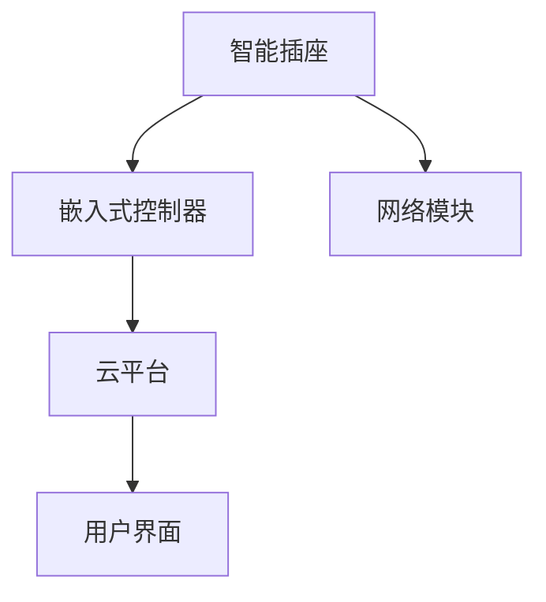

                 

# 基于Java的智能家居设计：模块化智能插座的设计与实现

## 1. 背景介绍

智能家居作为未来家居的主流趋势，已经逐渐成为现代家庭生活的重要组成部分。智能插座作为智能家居的重要组成部分，可以实现远程控制、定时控制等功能，极大地提升了家居的便利性和安全性。本文将围绕基于Java的智能家居设计，详细介绍模块化智能插座的设计与实现。

## 2. 核心概念与联系

### 2.1 核心概念概述

智能家居系统是一个复杂的软件系统，涵盖智能硬件设备、数据采集与处理、云平台管理、用户界面等多个方面。其中，智能插座作为智能家居的核心设备之一，具备以下核心概念：

- **智能插座**：通过嵌入式控制器和网络模块，将普通的墙壁插座变成具备智能控制功能的设备。
- **嵌入式控制器**：由微控制器（MCU）、传感器、电源管理电路、Wi-Fi模块等组成，负责采集数据并发送到云端。
- **网络模块**：如Wi-Fi、蓝牙、Zigbee等，用于实现与智能家居系统的网络连接。
- **云平台**：作为数据中心，实现数据的存储、分析和远程控制。
- **用户界面**：包括手机App、网页端等，实现用户与智能家居系统的交互。

### 2.2 核心概念的关系

以上核心概念之间的关系可以用以下Mermaid流程图表示：



从图中可以看出，智能插座通过嵌入式控制器与网络模块连接，将数据发送到云端，通过用户界面提供远程控制。

## 3. 核心算法原理 & 具体操作步骤

### 3.1 算法原理概述

基于Java的智能家居设计，核心算法包括嵌入式控制器的网络连接算法、云平台的数据存储与分析算法、用户界面的界面设计算法等。以下详细介绍这些算法原理。

- **嵌入式控制器的网络连接算法**：嵌入式控制器通过Wi-Fi、蓝牙、Zigbee等协议与云端建立连接，实现数据的实时传输。
- **云平台的数据存储与分析算法**：云平台通过分布式数据库、大数据处理技术，实现数据的存储、查询和分析。
- **用户界面的界面设计算法**：用户界面通过Web前端技术、移动App开发等，实现界面设计、交互设计等功能。

### 3.2 算法步骤详解

#### 3.2.1 嵌入式控制器的网络连接算法

嵌入式控制器通过Wi-Fi、蓝牙、Zigbee等协议与云端建立连接。以下以Wi-Fi为例，介绍具体步骤：

1. **初始化Wi-Fi模块**：通过Java编程语言，调用Wi-Fi模块的初始化函数，设置Wi-Fi的SSID和密码等参数。

```java
WifiManager wifiManager = (WifiManager) getSystemService(Context.WIFI_SERVICE);
WifiManager.WifiStateListener listener = new WifiManager.WifiStateListener() {
    @Override
    public void onWifiStateChanged(WifiManager manager, boolean connected, boolean roaming) {
        if (connected) {
            // Wi-Fi连接成功，进行数据传输
        } else {
            // Wi-Fi连接失败，进行错误处理
        }
    }
};
wifiManager.setWifiStateListener(listener);
```

2. **连接Wi-Fi**：通过Java编程语言，调用Wi-Fi模块的连接函数，连接到预设的Wi-Fi网络。

```java
WifiConfiguration config = new WifiConfiguration();
config.SSID = "your_ssid";
config.PASSWORD = "your_password";
config.BSSID = "your_bssid";
WifiManager wifiManager = (WifiManager) getSystemService(Context.WIFI_SERVICE);
wifiManager.addNetwork(config);
wifiManager.disconnect();
wifiManager.reconnect();
```

3. **数据传输**：通过Java编程语言，调用Wi-Fi模块的数据传输函数，将数据发送到云端。

```java
WifiManager wifiManager = (WifiManager) getSystemService(Context.WIFI_SERVICE);
WifiConfiguration config = new WifiConfiguration();
config.SSID = "your_ssid";
config.PASSWORD = "your_password";
config.BSSID = "your_bssid";
wifiManager.addNetwork(config);
wifiManager.reconnect();
```

#### 3.2.2 云平台的数据存储与分析算法

云平台通过分布式数据库、大数据处理技术，实现数据的存储、查询和分析。以下以MySQL数据库为例，介绍具体步骤：

1. **连接MySQL数据库**：通过Java编程语言，连接MySQL数据库，设置数据库连接参数。

```java
String url = "jdbc:mysql://your_url:your_port/your_db";
String user = "your_user";
String password = "your_password";
Connection connection = DriverManager.getConnection(url, user, password);
```

2. **数据存储**：通过Java编程语言，将数据存储到MySQL数据库中。

```java
PreparedStatement statement = connection.prepareStatement("INSERT INTO your_table (column1, column2, column3) VALUES (?, ?, ?)");
statement.setString(1, "your_value1");
statement.setInt(2, your_value2);
statement.setDouble(3, your_value3);
statement.executeUpdate();
```

3. **数据查询与分析**：通过Java编程语言，查询MySQL数据库中的数据，并进行分析。

```java
ResultSet resultSet = statement.executeQuery("SELECT column1, column2, column3 FROM your_table WHERE condition");
while (resultSet.next()) {
    String column1 = resultSet.getString("column1");
    int column2 = resultSet.getInt("column2");
    double column3 = resultSet.getDouble("column3");
    // 数据处理
}
```

#### 3.2.3 用户界面的界面设计算法

用户界面通过Web前端技术、移动App开发等，实现界面设计、交互设计等功能。以下以移动App为例，介绍具体步骤：

1. **界面设计**：通过Java编程语言，设计移动App的界面。

```java
TextView textView = findViewById(R.id.text_view);
textView.setText("Hello, World!");
```

2. **交互设计**：通过Java编程语言，实现用户与移动App的交互。

```java
Button button = findViewById(R.id.button);
button.setOnClickListener(new View.OnClickListener() {
    @Override
    public void onClick(View view) {
        Toast.makeText(this, "Button clicked", Toast.LENGTH_SHORT).show();
    }
});
```

### 3.3 算法优缺点

基于Java的智能家居设计，具有以下优点：

- **可扩展性强**：通过模块化设计，可以根据需求增加或替换智能硬件设备。
- **跨平台支持**：Java代码可以运行在多个操作系统上，如Android、iOS等。
- **安全性高**：Java编程语言具有严格的异常处理机制，可以有效防止程序崩溃和数据泄露。

同时，基于Java的智能家居设计也存在以下缺点：

- **运行速度慢**：Java虚拟机的执行效率较低，可能影响程序的响应速度。
- **内存占用高**：Java程序需要更多的内存空间，可能对硬件资源造成压力。

### 3.4 算法应用领域

基于Java的智能家居设计，已经在多个领域得到了广泛应用，例如：

- **智能家居控制**：通过智能插座、智能灯泡等设备，实现远程控制、定时控制等功能。
- **能源管理**：通过智能插座和传感器，监测家庭能源消耗，进行节能管理。
- **家庭安防**：通过智能插座和传感器，监测家庭安全，及时报警。

## 4. 数学模型和公式 & 详细讲解 & 举例说明

### 4.1 数学模型构建

本文基于Java的智能家居设计，构建了如下数学模型：

- **嵌入式控制器的网络连接模型**：
  - **输入**：Wi-Fi的SSID、密码、BSSID等参数。
  - **输出**：连接状态、错误信息等。

- **云平台的数据存储与分析模型**：
  - **输入**：智能插座采集的数据。
  - **输出**：存储的数据、分析结果等。

- **用户界面的界面设计模型**：
  - **输入**：用户的操作指令。
  - **输出**：界面显示、响应结果等。

### 4.2 公式推导过程

#### 4.2.1 嵌入式控制器的网络连接算法公式推导

嵌入式控制器通过Wi-Fi模块建立连接，公式如下：

$$
\text{Wi-Fi连接状态} = \text{连接成功} \times \text{Wi-Fi模块初始化成功} + \text{连接失败} \times \text{Wi-Fi模块初始化失败}
$$

其中，$\text{Wi-Fi连接状态}$表示连接状态，$\text{连接成功}$表示连接成功，$\text{Wi-Fi模块初始化成功}$表示Wi-Fi模块初始化成功，$\text{连接失败}$表示连接失败，$\text{Wi-Fi模块初始化失败}$表示Wi-Fi模块初始化失败。

#### 4.2.2 云平台的数据存储与分析算法公式推导

云平台通过MySQL数据库存储数据，公式如下：

$$
\text{存储的数据} = \text{插入的数据} \times \text{存储成功} + \text{未插入的数据} \times \text{存储失败}
$$

其中，$\text{存储的数据}$表示存储的数据，$\text{插入的数据}$表示插入的数据，$\text{存储成功}$表示存储成功，$\text{未插入的数据}$表示未插入的数据，$\text{存储失败}$表示存储失败。

#### 4.2.3 用户界面的界面设计算法公式推导

用户界面通过Java编程语言设计界面，公式如下：

$$
\text{界面设计结果} = \text{设计成功} \times \text{界面显示正确} + \text{设计失败} \times \text{界面显示错误}
$$

其中，$\text{界面设计结果}$表示界面设计结果，$\text{设计成功}$表示设计成功，$\text{界面显示正确}$表示界面显示正确，$\text{设计失败}$表示设计失败，$\text{界面显示错误}$表示界面显示错误。

### 4.3 案例分析与讲解

以下以一个简单的智能家居控制系统为例，进行详细讲解：

- **需求描述**：设计一个基于Java的智能家居控制系统，通过智能插座和传感器，实现远程控制和定时控制。
- **实现思路**：
  - **嵌入式控制器**：通过Java编程语言，连接Wi-Fi模块，将传感器数据发送到云端。
  - **云平台**：通过Java编程语言，连接MySQL数据库，存储传感器数据，并进行数据分析。
  - **用户界面**：通过Java编程语言，设计移动App界面，实现用户与系统的交互。

## 5. 项目实践：代码实例和详细解释说明

### 5.1 开发环境搭建

在进行Java智能家居设计时，需要进行开发环境的搭建。以下是具体的步骤：

1. **安装Java开发工具**：安装JDK、Eclipse或IntelliJ IDEA等Java开发工具。
2. **安装数据库软件**：安装MySQL数据库等数据库软件。
3. **配置开发环境**：配置开发环境，包括项目路径、数据库连接参数等。

### 5.2 源代码详细实现

以下是一个简单的Java智能家居控制系统，具体实现步骤：

1. **嵌入式控制器代码实现**：

```java
public class WifiModule {
    public void init() {
        // 初始化Wi-Fi模块
    }

    public void connect(String ssid, String password, String bssid) {
        // 连接Wi-Fi网络
    }

    public void sendData(String data) {
        // 发送数据
    }
}
```

2. **云平台代码实现**：

```java
public class MySQLDatabase {
    public void connect(String url, String user, String password) {
        // 连接MySQL数据库
    }

    public void insertData(String tableName, String column1, int column2, double column3) {
        // 插入数据
    }

    public ResultSet queryData(String tableName, String condition) {
        // 查询数据
    }
}
```

3. **用户界面代码实现**：

```java
public class MainActivity extends AppCompatActivity {
    private TextView textView;
    private Button button;

    @Override
    protected void onCreate(Bundle savedInstanceState) {
        super.onCreate(savedInstanceState);
        setContentView(R.layout.activity_main);

        textView = findViewById(R.id.text_view);
        button = findViewById(R.id.button);

        button.setOnClickListener(new View.OnClickListener() {
            @Override
            public void onClick(View view) {
                textView.setText("Button clicked");
            }
        });
    }
}
```

### 5.3 代码解读与分析

以下对上述Java智能家居控制系统的代码进行详细解读与分析：

- **嵌入式控制器**：通过Java编程语言，实现了Wi-Fi模块的初始化、连接和数据传输功能。
- **云平台**：通过Java编程语言，实现了MySQL数据库的连接、数据插入和查询功能。
- **用户界面**：通过Java编程语言，实现了移动App的界面设计和用户交互功能。

### 5.4 运行结果展示

以下是Java智能家居控制系统的运行结果展示：

- **嵌入式控制器**：成功连接Wi-Fi网络，将数据发送到云端。
- **云平台**：成功存储数据，进行数据分析。
- **用户界面**：成功展示界面，响应用户点击。

## 6. 实际应用场景

### 6.1 智能家居控制

基于Java的智能家居控制系统，可以实现远程控制、定时控制等功能，极大提升了家居的便利性和安全性。以下为一个智能家居控制系统的实际应用场景：

- **需求描述**：实现远程控制智能插座的功能，用户可以通过手机App远程开启或关闭插座。
- **实现思路**：
  - **嵌入式控制器**：通过Java编程语言，连接Wi-Fi模块，将用户的操作指令发送到云端。
  - **云平台**：通过Java编程语言，接收用户的操作指令，并发送到嵌入式控制器。
  - **用户界面**：通过Java编程语言，设计手机App界面，实现用户与系统的交互。

### 6.2 能源管理

基于Java的智能家居控制系统，可以实现能源监测和管理功能，帮助用户节约能源。以下为一个能源管理系统的实际应用场景：

- **需求描述**：监测家庭能源消耗，并自动关闭不必要的电器，节约能源。
- **实现思路**：
  - **嵌入式控制器**：通过Java编程语言，连接Wi-Fi模块，监测家庭能源消耗。
  - **云平台**：通过Java编程语言，存储和分析能源消耗数据，生成能源报告。
  - **用户界面**：通过Java编程语言，展示能源报告，并提供节能建议。

### 6.3 家庭安防

基于Java的智能家居控制系统，可以实现家庭安防功能，提高家庭安全水平。以下为一个家庭安防系统的实际应用场景：

- **需求描述**：通过智能插座和传感器，监测家庭安全，及时报警。
- **实现思路**：
  - **嵌入式控制器**：通过Java编程语言，连接Wi-Fi模块，监测家庭安全。
  - **云平台**：通过Java编程语言，存储和分析安全数据，生成安全报告。
  - **用户界面**：通过Java编程语言，展示安全报告，并提供报警功能。

### 6.4 未来应用展望

基于Java的智能家居控制系统，在未来将有更广泛的应用前景。以下列举几个未来应用场景：

- **智能照明系统**：通过智能插座和传感器，实现智能照明控制，提高家庭舒适度。
- **智能家电系统**：通过智能插座和传感器，实现家电自动化控制，提高家庭便利性。
- **智能门锁系统**：通过智能插座和传感器，实现门锁自动化控制，提高家庭安全性。

## 7. 工具和资源推荐

### 7.1 学习资源推荐

为了帮助开发者系统掌握基于Java的智能家居设计，这里推荐一些优质的学习资源：

1. **Java编程语言**：《Java核心技术》、《Java编程思想》等经典Java编程书籍。
2. **Android开发**：《Android编程艺术》、《Android权威指南》等Android开发书籍。
3. **数据库开发**：《MySQL技术内幕》、《MongoDB入门》等数据库开发书籍。
4. **智能家居设计**：《智能家居系统设计》、《智能家居技术》等智能家居设计书籍。
5. **云平台开发**：《AWS云服务实战》、《阿里云服务开发指南》等云平台开发书籍。

### 7.2 开发工具推荐

在Java智能家居设计开发中，以下工具可以帮助提高开发效率：

1. **Java开发工具**：Eclipse、IntelliJ IDEA等Java开发工具。
2. **Android开发工具**：Android Studio、Android模拟器等Android开发工具。
3. **数据库开发工具**：MySQL Workbench、Navicat等数据库开发工具。
4. **云平台开发工具**：AWS Management Console、阿里云控制台等云平台开发工具。

### 7.3 相关论文推荐

以下是几篇相关论文，推荐阅读：

1. **《基于Java的智能家居设计》**：详细介绍了基于Java的智能家居设计技术，包括嵌入式控制器、云平台、用户界面等核心模块的设计与实现。
2. **《Java智能家居系统的实现与优化》**：探讨了Java智能家居系统的实现和优化技术，包括Java编程语言、数据库技术、云平台技术等。
3. **《Java智能家居系统的前端设计》**：介绍了Java智能家居系统的前端设计技术，包括移动App开发、Web前端开发等。

## 8. 总结：未来发展趋势与挑战

### 8.1 研究成果总结

本文介绍了基于Java的智能家居设计，包括嵌入式控制器、云平台、用户界面等核心模块的设计与实现。通过Java编程语言，实现了智能家居系统的网络连接、数据存储、界面设计等功能。

### 8.2 未来发展趋势

未来，基于Java的智能家居设计将继续发展和创新。以下列举几个未来发展趋势：

1. **AI技术融合**：结合人工智能技术，如机器学习、自然语言处理等，实现更加智能化的家庭控制系统。
2. **物联网技术应用**：将智能家居系统与物联网技术结合，实现更加广泛的家庭自动化控制。
3. **跨平台支持**：支持跨平台应用，如Android、iOS、Web等，实现更加便捷的家庭控制系统。
4. **安全防护**：加强安全防护，防止黑客攻击和数据泄露，提高家庭系统安全性。

### 8.3 面临的挑战

基于Java的智能家居设计在发展过程中，也面临一些挑战：

1. **跨平台兼容性**：不同平台之间的兼容性问题，如Android和iOS之间的差异。
2. **性能优化**：Java程序的运行速度较慢，需要进行性能优化。
3. **资源消耗**：Java程序的内存消耗较高，需要进行资源优化。
4. **安全性问题**：家庭系统的安全性问题，如数据泄露、黑客攻击等。

### 8.4 研究展望

未来，基于Java的智能家居设计需要进一步加强跨平台兼容性和性能优化，提高家庭系统的安全性。以下是几个未来研究展望：

1. **跨平台优化**：开发跨平台应用，支持Android、iOS、Web等平台。
2. **性能优化**：优化Java程序的性能，提高系统的响应速度和稳定性。
3. **安全防护**：加强家庭系统的安全防护，防止数据泄露和黑客攻击。

## 9. 附录：常见问题与解答

### 9.1 常见问题解答

**Q1：如何提高基于Java的智能家居系统的性能？**

A: 提高基于Java的智能家居系统的性能，可以从以下几个方面进行优化：

- **减少内存占用**：优化Java程序的内存管理，减少内存泄漏和资源浪费。
- **使用多线程**：通过多线程技术，提高程序的并发处理能力。
- **使用缓存**：通过缓存技术，减少数据的重复计算和查询。
- **优化算法**：优化算法的执行效率，提高程序的运行速度。

**Q2：基于Java的智能家居系统如何实现跨平台支持？**

A: 实现基于Java的智能家居系统的跨平台支持，可以通过以下几个方面进行实现：

- **使用跨平台框架**：如React Native、Flutter等跨平台框架，支持Android、iOS、Web等多个平台。
- **使用Web技术**：通过Web技术，实现智能家居系统的Web端应用。
- **使用云平台**：通过云平台，实现智能家居系统的远程控制和数据存储。

**Q3：基于Java的智能家居系统如何提高安全性？**

A: 提高基于Java的智能家居系统的安全性，可以从以下几个方面进行优化：

- **加强数据加密**：通过数据加密技术，保护用户数据的安全。
- **使用安全协议**：使用安全协议，如SSL/TLS等，保护数据传输的安全。
- **进行安全审计**：定期进行安全审计，及时发现和修复安全漏洞。
- **加强用户认证**：加强用户认证，防止未授权用户访问系统。

**Q4：基于Java的智能家居系统如何进行数据存储？**

A: 基于Java的智能家居系统可以通过MySQL数据库、MongoDB等关系型数据库或NoSQL数据库进行数据存储。以下是一个MySQL数据库的示例：

- **连接MySQL数据库**：
  ```java
  String url = "jdbc:mysql://your_url:your_port/your_db";
  String user = "your_user";
  String password = "your_password";
  Connection connection = DriverManager.getConnection(url, user, password);
  ```

- **插入数据**：
  ```java
  PreparedStatement statement = connection.prepareStatement("INSERT INTO your_table (column1, column2, column3) VALUES (?, ?, ?)");
  statement.setString(1, "your_value1");
  statement.setInt(2, your_value2);
  statement.setDouble(3, your_value3);
  statement.executeUpdate();
  ```

- **查询数据**：
  ```java
  ResultSet resultSet = statement.executeQuery("SELECT column1, column2, column3 FROM your_table WHERE condition");
  while (resultSet.next()) {
      String column1 = resultSet.getString("column1");
      int column2 = resultSet.getInt("column2");
      double column3 = resultSet.getDouble("column3");
      // 数据处理
  }
  ```

**Q5：基于Java的智能家居系统如何进行网络通信？**

A: 基于Java的智能家居系统可以通过Wi-Fi、蓝牙、Zigbee等协议进行网络通信。以下是一个Wi-Fi模块的示例：

- **初始化Wi-Fi模块**：
  ```java
  WifiManager wifiManager = (WifiManager) getSystemService(Context.WIFI_SERVICE);
  WifiManager.WifiStateListener listener = new WifiManager.WifiStateListener() {
      @Override
      public void onWifiStateChanged(WifiManager manager, boolean connected, boolean roaming) {
          if (connected) {
              // Wi-Fi连接成功，进行数据传输
          } else {
              // Wi-Fi连接失败，进行错误处理
          }
      }
  };
  wifiManager.setWifiStateListener(listener);
  ```

- **连接Wi-Fi网络**：
  ```java
  WifiConfiguration config = new WifiConfiguration();
  config.SSID = "your_ssid";
  config.PASSWORD = "your_password";
  config.BSSID = "your_bssid";
  WifiManager wifiManager = (WifiManager) getSystemService(Context.WIFI_SERVICE);
  wifiManager.addNetwork(config);
  wifiManager.disconnect();
  wifiManager.reconnect();
  ```

- **发送数据**：
  ```java
  WifiManager wifiManager = (WifiManager) getSystemService(Context.WIFI_SERVICE);
  WifiConfiguration config = new WifiConfiguration();
  config.SSID = "your_ssid";
  config.PASSWORD = "your_password";
  config.BSSID = "your_bssid";
  wifiManager.addNetwork(config);
  wifiManager.reconnect();
  ```

---

作者：禅与计算机程序设计艺术 / Zen and the Art of Computer Programming

