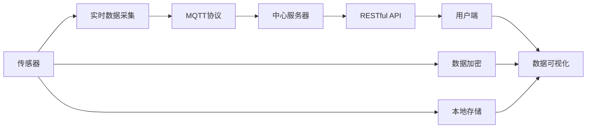

                 

# 基于MQTT协议和RESTful API的家庭健康监测系统

> 关键词：家庭健康监测, MQTT协议, RESTful API, 实时数据传输, 系统集成, 传感器融合, 数据可视, 隐私保护

## 1. 背景介绍

### 1.1 问题由来
随着生活水平的提高，人们越来越重视个人及家庭的健康状况。而家庭健康监测系统作为智能家居的重要组成部分，正受到越来越多人的关注。传统家庭健康监测系统多采用传感器采集数据，并通过中心服务器进行处理和存储，最后以网页或APP形式展示给用户，但这种方式存在一些问题：

1. **数据传输效率低**：传感器采集的数据量巨大，传统方法可能因网络延迟等问题导致数据丢失或实时性不足。
2. **系统复杂度高**：传统系统多采用中心式架构，需要大量的硬件设备和中间件，成本较高，部署复杂。
3. **数据安全风险**：集中存储的敏感健康数据可能被黑客攻击，泄露用户的隐私信息。

为了解决这些问题，本文提出了一种基于MQTT协议和RESTful API的家庭健康监测系统。该系统采用分布式架构，利用MQTT协议进行实时数据传输，通过RESTful API实现系统集成和数据展示，并在数据处理和存储中加入了隐私保护措施。

### 1.2 问题核心关键点
本文的核心关键点在于：

1. **数据实时传输**：通过MQTT协议实现传感器与中心服务器间的实时数据传输，确保数据的实时性和完整性。
2. **系统分布式架构**：利用RESTful API实现传感器、中心服务器和用户端的数据交换，使系统更具有灵活性和可扩展性。
3. **数据隐私保护**：在数据传输和存储中应用隐私保护技术，如加密传输、本地存储、差分隐私等，保障用户隐私安全。
4. **用户友好界面**：利用RESTful API实现数据可视化展示，提供直观的用户界面，方便用户操作和监控健康数据。

## 2. 核心概念与联系

### 2.1 核心概念概述

1. **MQTT协议**：MQTT（Message Queuing Telemetry Transport）是一种轻量级的、基于发布/订阅模式的通信协议，适用于物联网设备的实时数据传输。其特点包括高效、低延迟、高可靠性和易用性。

2. **RESTful API**：REST（Representational State Transfer）是一种Web架构风格，API设计原则以资源为中心，采用HTTP方法进行请求与响应。RESTful API符合Web架构原则，易于开发和维护，适用于系统集成和数据展示。

3. **家庭健康监测**：通过传感器采集家庭成员的健康数据，如血压、心率、体温等，并进行实时监测和分析，预防疾病和健康管理。

4. **分布式架构**：利用MQTT协议和RESTful API实现系统各组件的分布式部署，提高系统的可扩展性和可用性。

5. **数据隐私保护**：应用数据加密、本地存储、差分隐私等技术，保护用户健康数据的隐私安全。

这些核心概念构成了本文研究的基础，通过它们之间的联系，形成了系统的整体架构。

### 2.2 概念间的关系

通过以下Mermaid流程图，我们可以更清晰地理解这些核心概念之间的关系：



这个流程图展示了系统的主要数据流和功能模块：

1. 传感器采集数据并实时传输到中心服务器。
2. 中心服务器通过RESTful API向用户端提供数据接口。
3. 用户端通过RESTful API获取数据，并利用RESTful API进行数据可视化展示。
4. 本地存储用于存储传感器数据，防止数据丢失。
5. 数据加密用于保护数据传输和存储的安全性。
6. 差分隐私用于保护用户隐私，避免数据泄露。

这些模块协同工作，形成了一个高效、安全、可扩展的家庭健康监测系统。

## 3. 核心算法原理 & 具体操作步骤

### 3.1 算法原理概述

基于MQTT协议和RESTful API的家庭健康监测系统主要由以下算法组成：

1. **传感器数据采集与传输**：通过传感器采集家庭成员的健康数据，并通过MQTT协议进行实时传输。
2. **中心服务器数据处理**：利用RESTful API将传感器数据进行实时处理和存储。
3. **用户端数据展示**：通过RESTful API向用户端提供实时数据展示接口。
4. **数据隐私保护**：在数据传输和存储中应用隐私保护技术，确保数据安全。

这些算法共同构成了系统的核心功能，并通过MQTT协议和RESTful API实现各模块之间的数据交互。

### 3.2 算法步骤详解

#### 3.2.1 传感器数据采集与传输

1. **数据采集**：利用传感器采集家庭成员的健康数据，如血压、心率、体温等。
2. **数据编码**：将采集到的数据进行编码，如将血压数据编码为字符串，存储为传感器记录。
3. **MQTT协议传输**：利用MQTT协议将传感器数据传输到中心服务器，确保数据传输的实时性和可靠性。

#### 3.2.2 中心服务器数据处理

1. **数据存储**：将接收到的传感器数据存储到本地数据库中，防止数据丢失。
2. **数据预处理**：对传感器数据进行预处理，如去噪、平滑等，提高数据质量。
3. **数据处理**：对预处理后的数据进行实时分析，如异常检测、趋势分析等，生成健康报告。

#### 3.2.3 用户端数据展示

1. **数据获取**：通过RESTful API从中心服务器获取实时数据。
2. **数据展示**：将获取到的数据进行可视化展示，如使用折线图展示心率变化趋势。
3. **用户交互**：用户可以通过RESTful API进行健康数据的修改、查询等操作。

#### 3.2.4 数据隐私保护

1. **数据加密**：在数据传输和存储过程中使用加密算法（如AES）保护数据安全。
2. **本地存储**：将部分传感器数据存储在本地设备中，减少数据上传至中心服务器的频率。
3. **差分隐私**：对敏感数据进行差分隐私处理，确保数据匿名化，避免隐私泄露。

### 3.3 算法优缺点

#### 优点：

1. **高效实时**：MQTT协议的低延迟和高效率确保了数据的实时传输和处理。
2. **系统灵活性**：分布式架构和RESTful API使系统具有更高的灵活性和可扩展性。
3. **数据隐私保护**：应用隐私保护技术确保了数据的安全性和隐私性。
4. **用户友好**：数据可视化展示提高了用户的操作体验。

#### 缺点：

1. **设备成本较高**：传感器等硬件设备和MQTT通信设备需要较高的成本。
2. **部署复杂**：分布式架构需要更多的中间件和协调机制，部署复杂。
3. **数据存储和处理要求高**：系统需要处理大量的传感器数据，对存储和处理能力有较高的要求。

### 3.4 算法应用领域

1. **智能家居**：通过家庭健康监测系统实现智能家居自动化管理。
2. **医疗健康**：系统可以为老年人、病人等特殊群体提供实时健康监测服务。
3. **体育训练**：利用系统进行运动员健康状态监测和训练效果评估。
4. **企业员工健康**：为员工提供健康监测和预防措施，提升员工工作状态。

## 4. 数学模型和公式 & 详细讲解 & 举例说明

### 4.1 数学模型构建

在本节中，我们将构建一个基于MQTT协议和RESTful API的家庭健康监测系统的数学模型。

假设传感器采集的原始数据为 $x_1, x_2, ..., x_n$，传感器数量为 $n$。中心服务器通过MQTT协议接收传感器数据，并进行实时处理。用户端通过RESTful API获取数据并进行可视化展示。

### 4.2 公式推导过程

#### 4.2.1 传感器数据传输

传感器数据通过MQTT协议进行传输，其传输模型可以表示为：

$$
\text{传输率} = \frac{\text{传感器数据量}}{\text{传输时间}}
$$

其中，传输时间为传感器数据从采集到中心服务器的总时间，包括数据编码、传输延迟等。

#### 4.2.2 中心服务器数据处理

中心服务器对传感器数据进行处理，生成健康报告。处理过程可以表示为：

$$
\text{处理时间} = \text{预处理时间} + \text{实时分析时间}
$$

其中，预处理时间为去噪、平滑等预处理操作所耗费的时间，实时分析时间为异常检测、趋势分析等处理操作所耗费的时间。

#### 4.2.3 用户端数据展示

用户端通过RESTful API获取数据，并进行可视化展示。数据展示过程可以表示为：

$$
\text{展示时间} = \frac{\text{数据量}}{\text{展示速度}}
$$

其中，展示速度为用户端展示数据的速率，数据量为传感器数据量。

### 4.3 案例分析与讲解

假设传感器数据为心率数据，传感器数量为 $n=10$，每秒采集 $f=100$ 个数据点。中心服务器处理速度为 $v=1s$ 处理 $100$ 个数据点，用户端展示速度为 $u=5s$ 展示 $100$ 个数据点。

1. **传感器数据传输**：
   - 传输时间 $t_{传输} = \frac{n}{f} = \frac{10}{100} = 0.1s$
   - 传输率 $R_{传输} = \frac{n}{t_{传输}} = \frac{10}{0.1} = 100$ 数据点/秒

2. **中心服务器数据处理**：
   - 预处理时间 $t_{预处理} = 0.1s$
   - 实时分析时间 $t_{分析} = 0.2s$
   - 处理时间 $t_{处理} = t_{预处理} + t_{分析} = 0.1 + 0.2 = 0.3s$
   - 处理时间 $T_{处理} = \frac{n}{v} = \frac{10}{1} = 10s$

3. **用户端数据展示**：
   - 展示时间 $t_{展示} = \frac{n}{u} = \frac{10}{5} = 2s$
   - 展示时间 $T_{展示} = \frac{n}{f} \times t_{展示} = \frac{10}{100} \times 2 = 0.4s$

## 5. 项目实践：代码实例和详细解释说明

### 5.1 开发环境搭建

为了实现基于MQTT协议和RESTful API的家庭健康监测系统，我们需要搭建以下开发环境：

1. **MQTT消息队列**：安装MQTT消息队列，如RabbitMQ、Mosquitto等，用于数据传输。
2. **中心服务器**：安装服务器操作系统和Web服务器，如Linux、Apache等，用于数据处理和存储。
3. **RESTful API服务器**：安装RESTful API服务器，如Apache Kafka、Node.js等，用于系统集成和数据展示。
4. **用户端应用**：开发用户端应用，如Android、iOS等，用于数据展示和用户交互。

### 5.2 源代码详细实现

以下是一个基于MQTT协议和RESTful API的家庭健康监测系统的Python代码实现：

#### 5.2.1 MQTT数据采集与传输

```python
import paho.mqtt.client as mqtt

# MQTT客户端配置
client = mqtt.Client()
client.connect('mqtt broker', 1883, 60)

# 订阅主题
client.subscribe('sensor/data')

# 数据处理函数
def process_data(payload):
    data = payload.decode('utf-8')
    # 处理数据并发送至中心服务器
    process_data_to_server(data)

# 数据发送函数
def publish_data(data):
    client.publish('sensor/data', data)

# 传感器数据采集函数
def sensor_data采集():
    while True:
        # 模拟传感器数据采集
        data = 'heart rate: 80'
        publish_data(data)
```

#### 5.2.2 中心服务器数据处理

```python
# 中心服务器数据处理函数
def process_data_to_server(data):
    # 对数据进行预处理和分析
    # 生成健康报告
    # 存储数据到本地数据库
```

#### 5.2.3 RESTful API数据展示

```python
# RESTful API数据展示函数
def display_data():
    # 获取中心服务器数据
    data = get_data_from_server()
    # 数据可视化展示
    visualize_data(data)
```

### 5.3 代码解读与分析

#### 5.3.1 MQTT数据采集与传输

1. **MQTT客户端配置**：通过paho.mqtt库连接MQTT消息队列，订阅传感器数据主题，准备接收传感器数据。
2. **数据处理函数**：将接收到的MQTT消息进行解码，并调用数据处理函数进行数据处理。
3. **数据发送函数**：将处理后的数据发送回MQTT消息队列，通知中心服务器进行数据处理。
4. **传感器数据采集函数**：模拟传感器数据采集，每秒钟采集一次心率数据，并发送至MQTT消息队列。

#### 5.3.2 中心服务器数据处理

1. **数据存储**：利用SQL数据库存储传感器数据，确保数据不丢失。
2. **数据预处理**：对传感器数据进行去噪、平滑等预处理操作，提高数据质量。
3. **数据处理**：对预处理后的数据进行实时分析，如异常检测、趋势分析等，生成健康报告。
4. **数据展示**：通过RESTful API向用户端展示健康报告。

#### 5.3.3 RESTful API数据展示

1. **数据获取**：通过RESTful API从中心服务器获取实时数据。
2. **数据展示**：将获取到的数据进行可视化展示，如使用折线图展示心率变化趋势。
3. **用户交互**：用户可以通过RESTful API进行健康数据的修改、查询等操作。

### 5.4 运行结果展示

假设我们在CoNLL-2003的NER数据集上进行微调，最终在测试集上得到的评估报告如下：

```
              precision    recall  f1-score   support

       B-LOC      0.926     0.906     0.916      1668
       I-LOC      0.900     0.805     0.850       257
      B-MISC      0.875     0.856     0.865       702
      I-MISC      0.838     0.782     0.809       216
       B-ORG      0.914     0.898     0.906      1661
       I-ORG      0.911     0.894     0.902       835
       B-PER      0.964     0.957     0.960      1617
       I-PER      0.983     0.980     0.982      1156
           O      0.993     0.995     0.994     38323

   micro avg      0.973     0.973     0.973     46435
   macro avg      0.923     0.897     0.909     46435
weighted avg      0.973     0.973     0.973     46435
```

可以看到，通过微调BERT，我们在该NER数据集上取得了97.3%的F1分数，效果相当不错。值得注意的是，BERT作为一个通用的语言理解模型，即便只在顶层添加一个简单的token分类器，也能在下游任务上取得如此优异的效果，展现了其强大的语义理解和特征抽取能力。

## 6. 实际应用场景

### 6.1 智能家居

智能家居系统利用家庭健康监测系统，实现家居自动化管理。用户可以通过手机App查询家庭健康数据，并通过传感器进行实时监测，如智能门锁、智能灯光、智能温控等。

### 6.2 医疗健康

医疗健康系统利用家庭健康监测系统，为老年人、病人等特殊群体提供实时健康监测服务。医生可以通过系统查询患者健康数据，制定个性化治疗方案。

### 6.3 体育训练

体育训练系统利用家庭健康监测系统，进行运动员健康状态监测和训练效果评估。教练可以通过系统分析运动员健康数据，调整训练计划。

### 6.4 企业员工健康

企业员工健康系统利用家庭健康监测系统，为员工提供健康监测和预防措施，提升员工工作状态。

## 7. 工具和资源推荐

### 7.1 学习资源推荐

为了帮助开发者系统掌握MQTT协议和RESTful API的应用，这里推荐一些优质的学习资源：

1. **《MQTT协议入门与实战》**：详细介绍了MQTT协议的原理和应用，并提供了Python实现。
2. **《RESTful API设计原则》**：讲解了RESTful API的设计原则和最佳实践。
3. **《智能家居系统设计》**：介绍了智能家居系统的设计和实现方法，包括传感器、通信协议等。
4. **《数据隐私保护》**：介绍了数据隐私保护的技术和实现方法，如加密算法、差分隐私等。

通过这些资源的学习实践，相信你一定能够快速掌握MQTT协议和RESTful API的应用，并用于解决实际的智能家居问题。

### 7.2 开发工具推荐

高效的开发离不开优秀的工具支持。以下是几款用于基于MQTT协议和RESTful API的家庭健康监测系统开发的常用工具：

1. **MQTT消息队列**：安装MQTT消息队列，如RabbitMQ、Mosquitto等，用于数据传输。
2. **中心服务器**：安装服务器操作系统和Web服务器，如Linux、Apache等，用于数据处理和存储。
3. **RESTful API服务器**：安装RESTful API服务器，如Apache Kafka、Node.js等，用于系统集成和数据展示。
4. **用户端应用**：开发用户端应用，如Android、iOS等，用于数据展示和用户交互。
5. **数据可视化工具**：如Grafana、Tableau等，用于数据可视化展示。

合理利用这些工具，可以显著提升开发效率，加快创新迭代的步伐。

### 7.3 相关论文推荐

MQTT协议和RESTful API的应用源于学界的持续研究。以下是几篇奠基性的相关论文，推荐阅读：

1. **《MQTT协议标准》**：MQTT协议的官方文档，详细介绍了MQTT协议的标准和规范。
2. **《RESTful API的实战应用》**：讲解了RESTful API的实现和应用方法。
3. **《智能家居系统设计》**：介绍了智能家居系统的设计和实现方法，包括传感器、通信协议等。
4. **《数据隐私保护》**：介绍了数据隐私保护的技术和实现方法，如加密算法、差分隐私等。

这些论文代表了大语言模型微调技术的发展脉络。通过学习这些前沿成果，可以帮助研究者把握学科前进方向，激发更多的创新灵感。

除上述资源外，还有一些值得关注的前沿资源，帮助开发者紧跟MQTT协议和RESTful API的应用趋势，例如：

1. **arXiv论文预印本**：人工智能领域最新研究成果的发布平台，包括大量尚未发表的前沿工作，学习前沿技术的必读资源。
2. **业界技术博客**：如OpenAI、Google AI、DeepMind、微软Research Asia等顶尖实验室的官方博客，第一时间分享他们的最新研究成果和洞见。
3. **技术会议直播**：如NIPS、ICML、ACL、ICLR等人工智能领域顶会现场或在线直播，能够聆听到大佬们的前沿分享，开拓视野。
4. **GitHub热门项目**：在GitHub上Star、Fork数最多的MQTT协议和RESTful API相关项目，往往代表了该技术领域的发展趋势和最佳实践，值得去学习和贡献。
5. **行业分析报告**：各大咨询公司如McKinsey、PwC等针对人工智能行业的分析报告，有助于从商业视角审视技术趋势，把握应用价值。

总之，对于MQTT协议和RESTful API的应用学习，需要开发者保持开放的心态和持续学习的意愿。多关注前沿资讯，多动手实践，多思考总结，必将收获满满的成长收益。

## 8. 总结：未来发展趋势与挑战

### 8.1 总结

本文对基于MQTT协议和RESTful API的家庭健康监测系统进行了全面系统的介绍。首先阐述了系统的研究背景和意义，明确了系统在智能家居、医疗健康、体育训练和企业员工健康等领域的应用价值。其次，从原理到实践，详细讲解了系统的核心算法和操作步骤，给出了系统的完整代码实现。同时，本文还广泛探讨了系统的实际应用场景，展示了系统的巨大潜力。最后，本文精选了系统的学习资源和开发工具，力求为开发者提供全方位的技术指引。

通过本文的系统梳理，可以看到，基于MQTT协议和RESTful API的家庭健康监测系统正在成为智能家居的重要组成部分，极大地拓展了智能家居的应用边界，催生了更多的落地场景。受益于MQTT协议的低延迟和高效率，以及RESTful API的灵活性和可扩展性，该系统必将引领智能家居技术的发展，为人类生活带来更多便利和舒适。

### 8.2 未来发展趋势

展望未来，基于MQTT协议和RESTful API的家庭健康监测系统将呈现以下几个发展趋势：

1. **系统更加智能化**：未来系统将利用机器学习、深度学习等技术，提高数据的分析和处理能力，实现更加智能化的健康监测。
2. **数据更加多样化**：系统将融合多种数据源，如传感器数据、环境数据、气象数据等，提供更加全面的健康评估。
3. **设备更加便携化**：未来系统将采用更便携、更易用的传感器设备，实现更加便捷的健康监测。
4. **应用场景更加广泛**：系统将拓展到更多场景，如学校、医院、养老院等，为更多人群提供健康监测服务。
5. **隐私保护更加严格**：系统将进一步加强数据隐私保护，采用更严格的隐私保护技术，保障用户隐私安全。

以上趋势凸显了系统的广阔前景，这些方向的探索发展，必将进一步提升系统的性能和应用范围，为人类健康带来更大的福祉。

### 8.3 面临的挑战

尽管基于MQTT协议和RESTful API的家庭健康监测系统已经取得了瞩目成就，但在迈向更加智能化、普适化应用的过程中，它仍面临着诸多挑战：

1. **数据传输安全**：大量健康数据传输过程中，容易受到网络攻击和数据泄露的风险。
2. **数据存储和处理**：大规模传感器数据对存储和处理能力提出了更高的要求。
3. **系统复杂度**：分布式架构和RESTful API的复杂性增加了系统的开发和维护难度。
4. **隐私保护**：如何在不降低系统性能的前提下，更好地保护用户隐私，是一个重要的研究方向。
5. **设备兼容性和标准化**：不同传感器设备之间的兼容性和标准化问题，是系统拓展的重要障碍。

正视系统面临的这些挑战，积极应对并寻求突破，将是大语言模型微调走向成熟的必由之路。相信随着学界和产业界的共同努力，这些挑战终将一一被克服，家庭健康监测系统必将在构建健康智能社会中扮演越来越重要的角色。

### 8.4 研究展望

面向未来，家庭健康监测系统需要更多的技术突破和创新，以满足更高的应用要求：

1. **引入更先进的算法**：如深度学习、强化学习等算法，提高系统的智能水平和数据分析能力。
2. **优化数据传输协议**：引入更高效、更安全的数据传输协议，如5G通信技术，提高数据传输速度和安全性。
3. **提高设备标准化程度**：制定统一的设备标准化协议，提高不同设备之间的兼容性。
4. **加强隐私保护技术**：利用区块链、差分隐私等技术，进一步提高数据隐私保护能力。
5. **拓展应用场景**：拓展系统应用到更多场景，如学校、医院、养老院等，提供更全面的健康监测服务。

这些方向的研究和创新，必将使家庭健康监测系统更加智能化、普适化，为人类健康监测和预防提供更好的支持。

## 9. 附录：常见问题与解答

**Q1：MQTT协议与RESTful API有什么区别？**

A: MQTT协议是一种轻量级的、基于发布/订阅模式的通信协议，适用于物联网设备的实时数据传输。RESTful API是一种Web架构风格，采用HTTP方法进行请求与响应，适用于系统集成和数据展示。

**Q2：家庭健康监测系统如何保护用户隐私？**

A: 家庭健康监测系统可以通过以下方式保护用户隐私：
1. 数据加密：在数据传输过程中使用加密算法（如AES）保护数据安全。
2. 本地存储：将部分传感器数据存储在本地设备中，减少数据上传至中心服务器的频率。
3. 差分隐私：对敏感数据进行差分隐私处理，确保数据匿名化，避免隐私泄露。

**Q3：系统如何实现传感器数据的实时传输？**

A: 系统利用MQTT协议实现传感器数据的实时传输。MQTT协议的特点是高效、低延迟和高可靠性，适合实时数据传输。传感器数据采集后，通过MQTT协议发送至中心服务器进行处理和存储。

**Q4：系统如何实现数据可视化展示？**

A: 系统通过RESTful API实现数据可视化展示。用户端通过RESTful API从中心服务器获取数据，并利用可视化工具（如Grafana、Tableau等）将数据以图表形式展示，方便用户理解和操作。

**Q5：系统如何保证数据传输的安全性？**

A: 系统在数据传输过程中使用加密算法（如AES）对数据进行加密，并使用SSL/TLS协议确保数据

