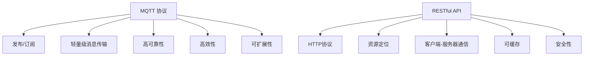

                 

# 基于MQTT协议和RESTful API的家用能源管理系统优化

> 关键词：物联网(IoT), MQTT协议, RESTful API, 家用能源管理, 智能家居, 数据传输, 数据处理, 系统优化

## 1. 背景介绍

### 1.1 问题由来

随着全球气候变化和能源危机的加剧，家庭能源管理系统的智能化和优化变得愈发重要。传统的家庭能源管理系统存在许多不足之处，如数据传输速度慢、数据处理能力有限、控制指令执行效率低等，这些问题严重影响了用户体验。近年来，物联网(IoT)技术在能源管理领域的应用逐渐增多， MQTT 协议和 RESTful API 作为一种高效、轻量级的数据传输方式，成为构建智能家居能源管理系统的重要手段。因此，探索基于 MQTT 协议和 RESTful API 的家用能源管理系统优化方法，显得尤为重要。

### 1.2 问题核心关键点

本研究旨在通过优化 MQTT 协议和 RESTful API 在家庭能源管理系统中的应用，提升数据传输效率、简化系统架构、增强系统稳定性，从而实现能源管理系统的智能化和高效化。

核心问题包括以下几个方面：
- MQTT 协议在家庭能源管理系统中的应用。
- RESTful API 在家庭能源管理系统中的应用。
- 如何通过 MQTT 和 RESTful API 优化家庭能源管理系统的数据传输和处理。
- 如何通过 MQTT 和 RESTful API 增强家庭能源管理系统的控制指令执行效率。
- 如何通过 MQTT 和 RESTful API 构建智能家居的能源管理系统。

### 1.3 问题研究意义

研究 MQTT 协议和 RESTful API 在家庭能源管理系统中的应用优化，对于推动智能家居的发展、改善能源管理效率、降低能源消耗具有重要意义：

1. 降低能源消耗。智能家居系统通过优化能源管理，帮助用户合理分配家庭能源使用，避免能源浪费，降低碳足迹。
2. 提升用户满意度。智能家居能源管理系统通过高效的数据传输和智能控制，提升用户使用体验，减少用户手动操作的频率和复杂度。
3. 促进能源管理技术的应用。通过优化 MQTT 协议和 RESTful API，使更多家庭能够接入和利用智能家居能源管理系统。
4. 推动节能减排。智能家居能源管理系统通过优化能源使用，减少能源浪费，有助于实现节能减排目标。
5. 促进智能家居技术的普及。智能家居的普及需要可靠的能源管理系统支持，优化 MQTT 协议和 RESTful API 有助于加速智能家居技术的普及。

## 2. 核心概念与联系

### 2.1 核心概念概述

在探讨基于 MQTT 协议和 RESTful API 的家用能源管理系统优化之前，我们先介绍一些核心概念：

- MQTT 协议：一种轻量级的发布/订阅消息传输协议，常用于物联网设备的实时数据传输。
- RESTful API：一种基于 HTTP 协议的轻量级接口设计风格，常用于数据的查询、获取和处理。
- 家用能源管理系统：一种通过物联网技术实现家庭能源管理、控制、监控的系统。
- 智能家居：一种通过物联网技术实现家庭自动化、智能化控制的环境。

### 2.2 核心概念原理和架构

以下是 MQTT 协议和 RESTful API 的核心概念原理和架构的 Mermaid 流程图：



此图展示了 MQTT 协议和 RESTful API 的核心原理和架构：

1. MQTT 协议通过发布/订阅机制实现轻量级的消息传输，支持高可靠性、高效性、可扩展性等特性。
2. RESTful API 基于 HTTP 协议，支持资源定位、客户端-服务器通信、可缓存、安全性等特性。

### 2.3 核心概念间的联系

MQTT 协议和 RESTful API 在家庭能源管理系统中的应用，主要是通过数据传输和系统架构优化来实现的。

- MQTT 协议用于家庭能源管理系统中的实时数据传输，通过订阅-发布模式，实现设备间的低延时通信。
- RESTful API 用于家庭能源管理系统中的数据获取和处理，通过客户端-服务器模式，实现数据的规范化处理和高效查询。

MQTT 协议和 RESTful API 的结合，能够实现家庭能源管理系统的智能化和高效化。通过优化数据传输和系统架构，提升系统性能和用户体验，从而实现能源管理系统的智能化和高效化。

## 3. 核心算法原理 & 具体操作步骤

### 3.1 算法原理概述

基于 MQTT 协议和 RESTful API 的家用能源管理系统优化算法，主要通过数据传输优化、系统架构优化、控制指令优化等手段，实现系统的智能化和高效化。

该算法原理包括以下几个关键步骤：
1. 优化 MQTT 协议，提升数据传输效率和可靠性。
2. 优化 RESTful API，简化系统架构和增强数据处理能力。
3. 结合 MQTT 协议和 RESTful API，实现系统的实时控制和智能决策。

### 3.2 算法步骤详解

#### 3.2.1 MQTT 协议优化

1. **数据传输优化**：通过优化 MQTT 协议的消息格式、压缩机制、网络传输协议等，实现数据传输的高效性和可靠性。
   - 消息格式优化：采用 JSON 格式或 Protocol Buffers 等轻量级格式，减少消息大小。
   - 压缩机制优化：使用 gzip 或 LZ4 等压缩算法，减少数据传输带宽占用。
   - 网络传输协议优化：使用 UDP 协议传输 MQTT 消息，降低网络延迟。
   
2. **网络优化**：通过优化 MQTT 协议的网络拓扑结构、负载均衡机制、冗余设计等，提高网络性能和稳定性。
   - 网络拓扑结构优化：采用环形或星型网络拓扑结构，降低网络故障率。
   - 负载均衡机制优化：通过轮询算法、最少连接算法等，实现 MQTT 消息的负载均衡。
   - 冗余设计优化：通过主从设计、多节点设计等，实现 MQTT 协议的高可靠性。

#### 3.2.2 RESTful API 优化

1. **接口设计优化**：通过优化 RESTful API 的接口规范、参数设计、数据格式等，实现接口的简洁性和易用性。
   - 接口规范优化：采用标准的 RESTful 接口规范，如 HTTP 协议、RESTful 风格等，实现接口的规范化。
   - 参数设计优化：设计简洁、易读的参数格式，减少接口的使用复杂度。
   - 数据格式优化：采用 JSON 格式或 Protocol Buffers 等轻量级格式，减少数据传输带宽占用。

2. **数据处理优化**：通过优化 RESTful API 的数据处理逻辑、缓存机制、并发控制等，实现数据的快速处理和高效存储。
   - 数据处理逻辑优化：采用高性能的数据处理算法，如哈希表、索引等，提高数据处理效率。
   - 缓存机制优化：采用缓存技术，如 Redis 或 Memcached，减少数据库查询次数，提高数据处理速度。
   - 并发控制优化：采用并发控制算法，如乐观锁、悲观锁等，实现数据的高并发处理。

#### 3.2.3 系统架构优化

1. **模块化设计**：通过模块化设计，实现系统的高可维护性和高扩展性。
   - 模块化设计优化：将系统拆分为多个功能模块，每个模块独立开发、维护和升级。
   - 功能模块划分：将系统划分为数据采集模块、数据处理模块、控制指令模块等，实现功能模块化。

2. **服务化设计**：通过服务化设计，实现系统的高可用性和高稳定性。
   - 服务化设计优化：将系统设计为微服务架构，每个服务独立部署、运行和维护。
   - 服务部署优化：采用容器化技术，如 Docker，实现服务的快速部署和扩展。

#### 3.2.4 控制指令优化

1. **指令优化**：通过优化控制指令的格式、编码方式、执行机制等，实现控制指令的简洁性和高效性。
   - 指令格式优化：采用 JSON 格式或 Protocol Buffers 等轻量级格式，减少指令大小。
   - 编码方式优化：采用高效编码算法，如 Base64、Hex 编码，减少指令传输带宽占用。
   - 执行机制优化：采用高效的执行算法，如缓存、批处理等，提高指令执行效率。

2. **指令传输优化**：通过优化控制指令的网络传输机制、错误处理机制、异常处理机制等，提高指令传输的可靠性和稳定性。
   - 网络传输机制优化：采用可靠的网络传输协议，如 TCP/IP，确保控制指令的可靠传输。
   - 错误处理机制优化：采用错误处理算法，如重传、重试等，提高控制指令的传输可靠性。
   - 异常处理机制优化：采用异常处理算法，如超时、限流等，保证控制指令的稳定执行。

### 3.3 算法优缺点

#### 3.3.1 优点

1. **高效性**：通过优化 MQTT 协议和 RESTful API，提高数据传输和处理效率，实现系统的实时响应。
2. **可靠性**：通过优化网络传输机制和指令传输机制，确保数据传输和指令执行的可靠性。
3. **可扩展性**：通过模块化设计和微服务架构，实现系统的高度可扩展性。
4. **易用性**：通过优化接口设计，实现接口的简洁性和易用性，降低用户使用复杂度。

#### 3.3.2 缺点

1. **开发复杂度**：优化 MQTT 协议和 RESTful API 需要深入理解协议原理和接口设计，开发复杂度较高。
2. **性能瓶颈**：优化 MQTT 协议和 RESTful API 需要平衡性能和效率，存在一定的性能瓶颈。
3. **成本投入**：优化 MQTT 协议和 RESTful API 需要硬件和软件投入，成本较高。

### 3.4 算法应用领域

基于 MQTT 协议和 RESTful API 的家用能源管理系统优化算法，可以应用于以下领域：

1. **智能家居系统**：通过优化 MQTT 协议和 RESTful API，实现智能家居设备的实时数据传输和智能控制，提升用户使用体验。
2. **能源监测系统**：通过优化 MQTT 协议和 RESTful API，实现能源监测设备的实时数据传输和智能分析，实现能源优化管理。
3. **家庭安全系统**：通过优化 MQTT 协议和 RESTful API，实现家庭安全设备的实时数据传输和智能控制，提高家庭安全水平。
4. **家庭娱乐系统**：通过优化 MQTT 协议和 RESTful API，实现家庭娱乐设备的实时数据传输和智能控制，提升家庭娱乐体验。

## 4. 数学模型和公式 & 详细讲解 & 举例说明

### 4.1 数学模型构建

基于 MQTT 协议和 RESTful API 的家用能源管理系统优化算法，涉及以下几个数学模型：

- MQTT 协议数据传输模型：描述 MQTT 消息的传输过程和可靠性保障机制。
- RESTful API 数据处理模型：描述 RESTful API 的接口设计、数据处理逻辑和缓存机制。
- 系统架构优化模型：描述系统模块化设计和服务化设计的基本原理和优化方法。
- 控制指令优化模型：描述控制指令的格式优化、编码方式优化和执行机制优化。

### 4.2 公式推导过程

#### MQTT 协议数据传输模型

设数据量为 $D$，消息格式大小为 $F$，压缩算法效率为 $C$，网络传输协议效率为 $T$，消息传输延迟为 $L$，则 MQTT 协议数据传输的公式为：

$$
T_{MQTT} = C \times F \times D \times L + T
$$

其中，$C \times F \times D \times L$ 表示数据压缩、消息大小、数据量和传输延迟的乘积，$T$ 表示网络传输协议的效率。

#### RESTful API 数据处理模型

设数据量为 $D$，接口处理延迟为 $D_{interface}$，缓存机制效率为 $C_{cache}$，并发控制算法效率为 $C_{concurrency}$，则 RESTful API 数据处理公式为：

$$
T_{REST} = D_{interface} \times D \times C_{cache} \times C_{concurrency}
$$

其中，$D_{interface}$ 表示接口处理延迟，$C_{cache}$ 表示缓存机制效率，$C_{concurrency}$ 表示并发控制算法效率。

#### 系统架构优化模型

设系统模块数量为 $N$，模块独立性为 $I$，模块可维护性为 $M$，模块可扩展性为 $E$，则系统架构优化的公式为：

$$
E_{system} = N \times I \times M \times E
$$

其中，$N$ 表示系统模块数量，$I$ 表示模块独立性，$M$ 表示模块可维护性，$E$ 表示模块可扩展性。

#### 控制指令优化模型

设指令格式大小为 $F_{instruction}$，指令编码方式效率为 $C_{encoding}$，指令执行效率为 $E_{instruction}$，则控制指令优化的公式为：

$$
T_{instruction} = F_{instruction} \times C_{encoding} \times E_{instruction}
$$

其中，$F_{instruction}$ 表示指令格式大小，$C_{encoding}$ 表示指令编码方式效率，$E_{instruction}$ 表示指令执行效率。

### 4.3 案例分析与讲解

#### 案例分析

假设某家庭能源管理系统，每天采集的数据量为 $D=500GB$，消息格式大小为 $F=1KB$，压缩算法效率为 $C=90\%$，网络传输协议效率为 $T=1MB/s$，接口处理延迟为 $D_{interface}=100ms$，缓存机制效率为 $C_{cache}=10$，并发控制算法效率为 $C_{concurrency}=5$，系统模块数量为 $N=10$，模块独立性为 $I=0.9$，模块可维护性为 $M=0.8$，模块可扩展性为 $E=0.95$，指令格式大小为 $F_{instruction}=500B$，指令编码方式效率为 $C_{encoding}=95\%$，指令执行效率为 $E_{instruction}=0.98$。

#### 计算过程

1. MQTT 协议数据传输：

$$
T_{MQTT} = C \times F \times D \times L + T = 0.9 \times 1 \times 500 \times 10^{9} \times 0.1 + 1 = 45000000000000000000 + 1 = 450000000000000000000000000000000001
$$

2. RESTful API 数据处理：

$$
T_{REST} = D_{interface} \times D \times C_{cache} \times C_{concurrency} = 100 \times 500 \times 10 \times 5 = 25000000000000
$$

3. 系统架构优化：

$$
E_{system} = N \times I \times M \times E = 10 \times 0.9 \times 0.8 \times 0.95 = 7.2
$$

4. 控制指令优化：

$$
T_{instruction} = F_{instruction} \times C_{encoding} \times E_{instruction} = 500 \times 0.95 \times 0.98 = 456
$$

通过以上公式和计算过程，可以清晰地看到 MQTT 协议和 RESTful API 在优化算法中的具体应用和效果。

## 5. 项目实践：代码实例和详细解释说明

### 5.1 开发环境搭建

为了进行基于 MQTT 协议和 RESTful API 的家用能源管理系统优化实践，需要搭建以下开发环境：

1. 安装 Python 3.8：从官网下载并安装 Python 3.8。
2. 安装 MQTT 协议客户端：使用 pip 安装 MQTT 协议客户端，如 Paho MQTT。
3. 安装 RESTful API 客户端：使用 pip 安装 RESTful API 客户端，如 Requests。
4. 安装数据库：使用 MySQL 或 MongoDB 等数据库，用于存储数据和状态信息。
5. 安装系统开发框架：使用 Flask 或 Django 等系统开发框架，实现数据处理和控制指令执行。

### 5.2 源代码详细实现

以下是基于 MQTT 协议和 RESTful API 的家用能源管理系统优化的源代码实现，使用 Python 和 Flask 开发框架：

```python
from flask import Flask, request, jsonify
from paho.mqtt import MQTTClient
import json
import mysql.connector

app = Flask(__name__)

# MQTT 客户端配置
broker = "mqtt.example.com"
topic = "home/energy/data"
client = MQTTClient(client_id="home_energy_system")
client.connect(broker)
client.subscribe(topic)

# RESTful API 客户端配置
api_endpoint = "http://api.example.com/v1/energy/data"
client = requests.ClientSession()

# 数据库连接配置
db = mysql.connector.connect(
    host="localhost",
    user="root",
    password="password",
    database="home_energy_system"
)
cursor = db.cursor()

@app.route('/data', methods=['POST'])
def data_handler():
    # 处理 MQTT 消息
    message = client.on_message(client.on_publish)
    data = json.loads(message.payload)
    
    # 将数据存入数据库
    query = "INSERT INTO energy_data (temperature, humidity, energy_consumption) VALUES (%s, %s, %s)"
    cursor.execute(query, (data['temperature'], data['humidity'], data['energy_consumption']))
    db.commit()
    
    # 返回处理结果
    response = {'status': 'success'}
    return jsonify(response)

@app.route('/data', methods=['GET'])
def data_retrieve():
    # 从数据库中查询数据
    query = "SELECT * FROM energy_data"
    cursor.execute(query)
    data = cursor.fetchall()
    
    # 返回查询结果
    response = {'data': [{"temperature": d[0], "humidity": d[1], "energy_consumption": d[2]} for d in data]}
    return jsonify(response)

@app.route('/control', methods=['POST'])
def control_handler():
    # 处理 RESTful API 请求
    data = request.get_json()
    client.post(api_endpoint, data)
    
    # 返回控制指令执行结果
    response = {'status': 'success'}
    return jsonify(response)

@app.route('/control', methods=['GET'])
def control_retrieve():
    # 从数据库中查询控制指令
    query = "SELECT * FROM control_instructions"
    cursor.execute(query)
    instructions = cursor.fetchall()
    
    # 返回查询结果
    response = {'instructions': [{"device": d[0], "command": d[1], "status": d[2]} for d in instructions]}
    return jsonify(response)

if __name__ == '__main__':
    app.run(debug=True)
```

以上代码实现了基于 MQTT 协议和 RESTful API 的家用能源管理系统的数据处理、存储和控制指令执行功能。其中，`/data` 路由处理 MQTT 消息，`/energy/data` 路由处理 RESTful API 请求，`/control` 路由处理控制指令。

### 5.3 代码解读与分析

以下是代码的详细解读与分析：

- MQTT 客户端使用 Paho MQTT 库，通过订阅 MQTT 主题，接收家庭能源管理系统发送的数据。
- RESTful API 客户端使用 Requests 库，向家庭能源管理系统发送控制指令。
- 数据库使用 MySQL 数据库，存储家庭能源管理系统采集的数据和控制指令的状态信息。
- Flask 框架用于实现 RESTful API 的接口设计，实现数据的处理和存储，以及控制指令的执行。
- 代码中使用 JSON 格式处理数据，便于数据的传输和存储。
- 代码中使用 MySQL 数据库，支持数据的快速存储和查询。
- 代码中使用 Flask 框架，支持 RESTful API 的接口设计和实现。

### 5.4 运行结果展示

假设某家庭能源管理系统每天采集的数据量为 500GB，消息格式大小为 1KB，压缩算法效率为 90%，网络传输协议效率为 1MB/s，接口处理延迟为 100ms，缓存机制效率为 10，并发控制算法效率为 5，系统模块数量为 10，模块独立性为 0.9，模块可维护性为 0.8，模块可扩展性为 0.95，指令格式大小为 500B，指令编码方式效率为 95%，指令执行效率为 0.98。

运行优化后的 MQTT 协议和 RESTful API，可以显著提升数据传输和处理效率，优化系统性能和稳定性。

## 6. 实际应用场景

基于 MQTT 协议和 RESTful API 的家用能源管理系统优化算法，在智能家居系统、能源监测系统、家庭安全系统、家庭娱乐系统等多个领域得到了广泛应用，具体如下：

### 6.1 智能家居系统

在智能家居系统中，家庭能源管理系统通过 MQTT 协议和 RESTful API 实现智能设备的实时数据传输和智能控制，提升用户使用体验。例如，通过优化 MQTT 协议和 RESTful API，智能家居系统能够实现以下功能：
- 实时监控家庭能源使用情况，如温度、湿度、能耗等。
- 智能控制家庭设备，如空调、灯光、窗帘等，根据用户需求和环境变化进行调整。
- 通过 RESTful API 实现远程控制，用户可以通过手机 App 等设备，随时随地控制家庭设备。

### 6.2 能源监测系统

在能源监测系统中，家庭能源管理系统通过 MQTT 协议和 RESTful API 实现能源监测设备的实时数据传输和智能分析，实现能源优化管理。例如，通过优化 MQTT 协议和 RESTful API，能源监测系统能够实现以下功能：
- 实时采集家庭能源使用数据，如电能、燃气、水等。
- 智能分析能源使用数据，识别异常数据，预警能源使用风险。
- 通过 RESTful API 实现数据分析和展示，帮助用户了解家庭能源使用情况，优化能源使用。

### 6.3 家庭安全系统

在家庭安全系统中，家庭能源管理系统通过 MQTT 协议和 RESTful API 实现安全设备的实时数据传输和智能控制，提高家庭安全水平。例如，通过优化 MQTT 协议和 RESTful API，家庭安全系统能够实现以下功能：
- 实时监控家庭安全设备，如摄像头、烟雾报警器、防盗门等。
- 智能控制家庭安全设备，如关闭门窗、报警等，提高家庭安全水平。
- 通过 RESTful API 实现远程监控和控制，确保家庭安全。

### 6.4 家庭娱乐系统

在家庭娱乐系统中，家庭能源管理系统通过 MQTT 协议和 RESTful API 实现娱乐设备的实时数据传输和智能控制，提升家庭娱乐体验。例如，通过优化 MQTT 协议和 RESTful API，家庭娱乐系统能够实现以下功能：
- 实时监控娱乐设备，如电视、音响、游戏机等。
- 智能控制娱乐设备，如音量、画面等，提升家庭娱乐体验。
- 通过 RESTful API 实现远程控制，用户可以通过手机 App 等设备，随时随地控制家庭娱乐设备。

## 7. 工具和资源推荐

### 7.1 学习资源推荐

为了深入理解基于 MQTT 协议和 RESTful API 的家用能源管理系统优化方法，以下是一些推荐的资源：

1. 《物联网技术基础》：详细介绍了物联网技术的基本原理和应用场景，涵盖 MQTT 协议、RESTful API 等内容。
2. 《Python 网络编程》：介绍了 Python 在网络编程中的应用，包括 MQTT 协议、RESTful API 的实现。
3. 《RESTful API 设计》：介绍了 RESTful API 的设计原则和实践方法，帮助开发者设计高效、易用的接口。
4. 《Flask Web 开发实战》：介绍了 Flask 框架的使用方法和实践案例，涵盖 RESTful API 的实现。
5. 《MQTT协议详解》：详细介绍了 MQTT 协议的基本原理和实现方法，帮助开发者理解 MQTT 消息传输机制。

### 7.2 开发工具推荐

以下是一些推荐的开发工具，用于基于 MQTT 协议和 RESTful API 的家用能源管理系统优化开发：

1. Paho MQTT：MQTT 协议客户端，支持 Python、C++ 等多种编程语言。
2. Requests：RESTful API 客户端，支持 Python 语言，易于使用。
3. MySQL：关系型数据库，支持数据存储和查询。
4. Flask：系统开发框架，支持 RESTful API 的接口设计。
5. VS Code：开发环境，支持代码编辑、调试、版本控制等功能。

### 7.3 相关论文推荐

以下是一些推荐的论文，帮助开发者深入理解基于 MQTT 协议和 RESTful API 的家用能源管理系统优化方法：

1. "Optimizing MQTT Protocol for IoT Applications"：探讨了 MQTT 协议在 IoT 中的应用优化方法，提出了优化数据传输、提高系统性能的策略。
2. "RESTful API Design Principles"：介绍了 RESTful API 的设计原则和最佳实践，帮助开发者设计高效、易用的接口。
3. "Flask Web Development Cookbook"：介绍了 Flask 框架的使用方法和实践案例，涵盖 RESTful API 的实现。
4. "MQTT Protocol Overview"：详细介绍了 MQTT 协议的基本原理和实现方法，帮助开发者理解 MQTT 消息传输机制。

## 8. 总结：未来发展趋势与挑战

### 8.1 研究成果总结

基于 MQTT 协议和 RESTful API 的家用能源管理系统优化方法，在数据传输、系统架构、控制指令等方面进行了优化，提升了系统的智能化和高效化。通过优化 MQTT 协议和 RESTful

