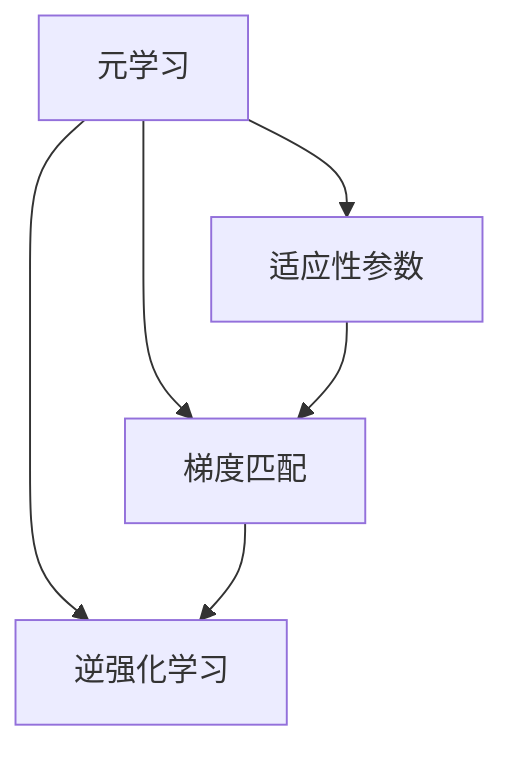
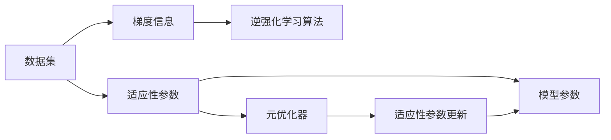
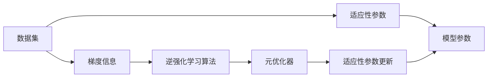
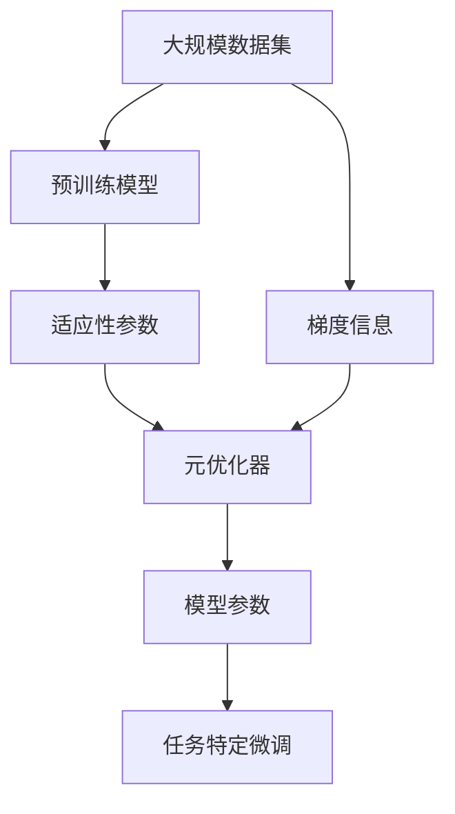

                 

# 元学习(Meta-Learning) - 原理与代码实例讲解

> 关键词：元学习,学习算法,适应性,梯度,逆强化学习,RL(强化学习),深度神经网络,迁移学习,超参数优化

## 1. 背景介绍

### 1.1 问题由来
随着深度学习技术的快速演进，特别是在自然语言处理(NLP)、计算机视觉(CV)、推荐系统等领域的成功应用，使得深度神经网络成为机器学习领域的重要工具。然而，由于深度学习模型的高度复杂性和数据密集性，传统训练方法面临许多挑战。例如，对于新任务的训练，需要从头开始拟合模型，训练过程时间长，而且对数据的需求巨大。

元学习(Meta-Learning)应运而生，旨在解决深度学习模型对于新任务适应能力弱的问题，通过预先学习到与任务无关的适应性参数，在新的任务上快速完成微调，从而实现对新任务的快速适应。

### 1.2 问题核心关键点
元学习的核心思想是，通过在训练过程中学习到与特定任务无关的适应性参数，使得模型能够在新任务上快速适应并优化性能。

元学习大致可分为两类：
- **有监督元学习（Supervised Meta-Learning）**：直接使用监督信号进行训练，通过与不同任务相关的梯度下降，优化模型适应性参数。
- **无监督元学习（Unsupervised Meta-Learning）**：无需使用监督信号，通过与任务无关的数据进行自适应学习，使得模型具备更强的泛化能力。

元学习的关键在于如何有效获取和利用先验知识，即适应性参数，以实现对新任务的快速适应。

### 1.3 问题研究意义
元学习的研究对深度学习模型在新任务上的适应性和泛化能力具有重要意义：

1. **快速适应新任务**：元学习使得深度模型能够在未见过的任务上快速启动训练，从而大幅缩短训练时间和数据需求。
2. **提升泛化性能**：通过学习与任务无关的适应性参数，模型对新任务的泛化能力更强，能够更好地处理不同领域的数据。
3. **增强迁移学习**：元学习可以提升迁移学习的效果，使得模型能够更好地从源任务迁移到新任务。
4. **优化超参数**：元学习通过自动学习适应性参数，减少了人工超参数调优的复杂性。
5. **提升可解释性**：元学习使得模型的决策过程更具可解释性，帮助理解模型的内部机制。

## 2. 核心概念与联系

### 2.1 核心概念概述

元学习在深度学习中应用广泛，其核心思想是通过预训练学习到一种适应性机制，使得模型能够快速适应新的任务。以下是元学习中几个关键概念：

- **元学习(Meta-Learning)**：通过预先学习一种与特定任务无关的适应性参数，使模型在新任务上快速适应并优化性能。
- **适应性参数(Adaptation Parameter)**：用于调整模型以适应新任务的参数。
- **梯度匹配(Meta-Gradient)**：元学习中的梯度匹配是指在元优化过程中，需要学习与特定任务无关的梯度信息，以指导模型在新任务上的微调。
- **逆强化学习(Retroactive Reinforcement Learning)**：通过逆向强化学习算法，学习一种适应性策略，使得模型能够在新任务上快速适应并优化。

这些概念通过以下Mermaid流程图展示其联系：



这个流程图展示了元学习的核心概念及其相互关系：

1. 元学习通过预先学习适应性参数，使得模型具备快速适应新任务的能力。
2. 梯度匹配是元学习中常用的方法，通过学习与特定任务无关的梯度信息，指导模型在新任务上的微调。
3. 逆强化学习是一种无监督元学习方法，通过逆向强化学习算法，学习一种适应性策略，使得模型能够在新任务上快速适应并优化。

### 2.2 概念间的关系

这些核心概念之间存在着紧密的联系，形成了元学习的完整生态系统。下面通过几个Mermaid流程图来展示这些概念之间的关系。

#### 2.2.1 元学习的训练流程



这个流程图展示了元学习的训练流程：

1. 元学习从数据集中获取梯度信息，学习适应性参数。
2. 元优化器根据梯度信息更新适应性参数。
3. 适应性参数指导模型在新任务上的微调，以优化性能。

#### 2.2.2 有监督元学习的训练流程



这个流程图展示了有监督元学习的训练流程：

1. 元学习从数据集中获取梯度信息，学习适应性参数。
2. 元优化器根据梯度信息更新适应性参数。
3. 适应性参数指导模型在新任务上的微调，以优化性能。

#### 2.2.3 无监督元学习的训练流程


这个流程图展示了无监督元学习的训练流程：

1. 元学习从数据集中获取梯度信息，学习适应性参数。
2. 元优化器根据梯度信息更新适应性参数。
3. 适应性参数指导模型在新任务上的微调，以优化性能。

### 2.3 核心概念的整体架构

最后，我们用一个综合的流程图来展示这些核心概念在大规模元学习中的整体架构：



这个综合流程图展示了从预训练到元学习的完整过程。元学习从大规模数据集中获取梯度信息，学习适应性参数，并指导模型在特定任务上的微调，从而快速适应新任务。 通过这些流程图，我们可以更清晰地理解元学习的核心概念和应用场景。

## 3. 核心算法原理 & 具体操作步骤
### 3.1 算法原理概述

元学习的核心在于通过预训练学习到一种适应性参数，使得模型能够在新任务上快速适应并优化性能。其数学原理可以通过以下公式进行描述：

设训练数据集为 $D = \{(x_i, y_i)\}_{i=1}^N$，其中 $x_i$ 为输入，$y_i$ 为输出标签。元学习的目标是在元训练阶段学习到适应性参数 $\theta_a$，使得模型在新任务上的表现能够最大化：

$$
\mathcal{L}_{meta} = \mathbb{E}_{(x,y)} \left[ \mathcal{L}_{task}(M_{\theta}(x),y) \right]
$$

其中 $M_{\theta}(x)$ 为模型在输入 $x$ 上的预测输出，$\mathcal{L}_{task}$ 为特定任务的损失函数。

在元测试阶段，模型通过加载适应性参数 $\theta_a$ 和预训练参数 $\theta_p$ 的组合 $\theta = \theta_a + \theta_p$ 在新任务上进行微调，以优化性能。

### 3.2 算法步骤详解

元学习的训练一般包括以下几个关键步骤：

**Step 1: 准备元训练数据**
- 收集不同任务的数据集，每个数据集包含多个样本。
- 将数据集划分为训练集和验证集，用于模型训练和调优。

**Step 2: 添加元训练层**
- 设计元训练层，通常使用深度神经网络或生成对抗网络。
- 元训练层的输入为数据集中的样本，输出为适应性参数 $\theta_a$。

**Step 3: 设置元优化器**
- 选择合适的元优化器，如Adam、SGD等。
- 设置元优化器的超参数，如学习率、动量等。

**Step 4: 执行元训练**
- 将元训练层与数据集输入元优化器进行训练，学习适应性参数 $\theta_a$。
- 通过梯度匹配技术，使得适应性参数能够指导模型在新任务上的微调。

**Step 5: 微调任务特定模型**
- 在元测试阶段，将预训练模型与加载的适应性参数结合。
- 在新任务上进行微调，以优化性能。

**Step 6: 评估模型性能**
- 在验证集和测试集上评估微调后的模型性能。
- 根据评估结果调整模型参数和适应性参数。

### 3.3 算法优缺点

元学习的优点在于：
1. **快速适应新任务**：通过预训练学习适应性参数，模型能够在新的任务上快速启动训练。
2. **提升泛化性能**：学习与任务无关的适应性参数，增强模型的泛化能力，能够更好地处理不同领域的数据。
3. **优化超参数**：元学习可以自动学习适应性参数，减少了人工超参数调优的复杂性。
4. **增强迁移学习**：元学习可以提升迁移学习的效果，使得模型能够更好地从源任务迁移到新任务。

元学习的缺点在于：
1. **数据需求高**：元学习需要收集大量不同任务的数据集，数据收集和标注成本较高。
2. **模型复杂度**：元学习模型通常较为复杂，训练和优化难度较大。
3. **过拟合风险**：元学习中的适应性参数需要精细调优，过拟合风险较高。
4. **泛化能力有限**：对于新任务，元学习的泛化能力仍受限于已有数据的范围。

### 3.4 算法应用领域

元学习已经广泛应用于机器学习和深度学习领域，涵盖以下几类应用：

- **迁移学习(Meta-Transfer Learning)**：元学习可以提升迁移学习的效果，使得模型能够更好地从源任务迁移到新任务。
- **超参数优化(Meta-Hyperparameter Optimization)**：通过元学习，自动学习与任务无关的超参数，减少人工调优的复杂性。
- **知识图谱构建(Meta-Knowledge Graph Construction)**：利用元学习，自动学习图谱中的节点和关系，构建更精准的知识图谱。
- **生成对抗网络(GANs)**：通过元学习，自动学习生成器和判别器，使得生成对抗网络的效果更好。
- **自适应模型训练(Meta-Adaptive Model Training)**：通过元学习，自动学习模型的适应性参数，使得模型在新任务上表现更好。

元学习在上述领域的应用，展示了其广泛的应用前景和强大的潜力。

## 4. 数学模型和公式 & 详细讲解 & 举例说明

### 4.1 数学模型构建

元学习的数学模型构建，可以通过以下公式进行描述：

设训练数据集为 $D = \{(x_i, y_i)\}_{i=1}^N$，其中 $x_i$ 为输入，$y_i$ 为输出标签。元学习的目标是在元训练阶段学习到适应性参数 $\theta_a$，使得模型在新任务上的表现能够最大化：

$$
\mathcal{L}_{meta} = \mathbb{E}_{(x,y)} \left[ \mathcal{L}_{task}(M_{\theta}(x),y) \right]
$$

其中 $M_{\theta}(x)$ 为模型在输入 $x$ 上的预测输出，$\mathcal{L}_{task}$ 为特定任务的损失函数。

在元测试阶段，模型通过加载适应性参数 $\theta_a$ 和预训练参数 $\theta_p$ 的组合 $\theta = \theta_a + \theta_p$ 在新任务上进行微调，以优化性能。

### 4.2 公式推导过程

以下我们以二分类任务为例，推导元学习的损失函数及其梯度的计算公式。

假设模型 $M_{\theta}(x)$ 在输入 $x$ 上的输出为 $\hat{y}=M_{\theta}(x) \in [0,1]$，表示样本属于正类的概率。真实标签 $y \in \{0,1\}$。

元学习的目标是在元训练阶段学习到适应性参数 $\theta_a$，使得模型在新任务上的表现能够最大化：

$$
\mathcal{L}_{meta} = \mathbb{E}_{(x,y)} \left[ \mathcal{L}_{task}(M_{\theta}(x),y) \right]
$$

其中 $M_{\theta}(x)$ 为模型在输入 $x$ 上的预测输出，$\mathcal{L}_{task}$ 为特定任务的损失函数。

在元测试阶段，模型通过加载适应性参数 $\theta_a$ 和预训练参数 $\theta_p$ 的组合 $\theta = \theta_a + \theta_p$ 在新任务上进行微调，以优化性能。

元学习的梯度推导涉及元训练和元测试两个阶段，我们先从元训练阶段开始。

在元训练阶段，元优化器通过反向传播计算梯度：

$$
\frac{\partial \mathcal{L}_{meta}}{\partial \theta_a} = \mathbb{E}_{(x,y)} \left[ \frac{\partial \mathcal{L}_{task}(M_{\theta}(x),y)}{\partial \theta} \right]
$$

其中 $\frac{\partial \mathcal{L}_{task}(M_{\theta}(x),y)}{\partial \theta}$ 为模型在特定任务上的梯度。

在元测试阶段，模型通过加载适应性参数 $\theta_a$ 和预训练参数 $\theta_p$ 的组合 $\theta = \theta_a + \theta_p$ 在新任务上进行微调，以优化性能。

元测试阶段的梯度推导涉及逆强化学习，具体公式较为复杂，这里不再展开。

### 4.3 案例分析与讲解

以二分类任务为例，展示元学习的案例分析与讲解。

假设我们有一个二分类任务，训练数据集为 $D = \{(x_i, y_i)\}_{i=1}^N$，其中 $x_i$ 为输入，$y_i$ 为输出标签。

在元训练阶段，我们通过反向传播计算梯度：

$$
\frac{\partial \mathcal{L}_{meta}}{\partial \theta_a} = \mathbb{E}_{(x,y)} \left[ \frac{\partial \mathcal{L}_{task}(M_{\theta}(x),y)}{\partial \theta} \right]
$$

其中 $\frac{\partial \mathcal{L}_{task}(M_{\theta}(x),y)}{\partial \theta}$ 为模型在特定任务上的梯度。

在元测试阶段，模型通过加载适应性参数 $\theta_a$ 和预训练参数 $\theta_p$ 的组合 $\theta = \theta_a + \theta_p$ 在新任务上进行微调，以优化性能。

具体实现步骤为：

1. 收集不同任务的训练数据集。
2. 设计元训练层，学习适应性参数 $\theta_a$。
3. 设置元优化器，计算梯度。
4. 加载适应性参数 $\theta_a$ 和预训练参数 $\theta_p$ 的组合 $\theta$。
5. 在新任务上进行微调，以优化性能。

## 5. 项目实践：代码实例和详细解释说明

### 5.1 开发环境搭建

在进行元学习实践前，我们需要准备好开发环境。以下是使用Python进行PyTorch开发的环境配置流程：

1. 安装Anaconda：从官网下载并安装Anaconda，用于创建独立的Python环境。

2. 创建并激活虚拟环境：
```bash
conda create -n pytorch-env python=3.8 
conda activate pytorch-env
```

3. 安装PyTorch：根据CUDA版本，从官网获取对应的安装命令。例如：
```bash
conda install pytorch torchvision torchaudio cudatoolkit=11.1 -c pytorch -c conda-forge
```

4. 安装各类工具包：
```bash
pip install numpy pandas scikit-learn matplotlib tqdm jupyter notebook ipython
```

完成上述步骤后，即可在`pytorch-env`环境中开始元学习实践。

### 5.2 源代码详细实现

下面我们以元学习中的逆强化学习算法为例，给出使用PyTorch的代码实现。

```python
import torch
import torch.nn as nn
import torch.optim as optim
from torch.distributions.kl import kl_divergence
from torch.utils.data import Dataset, DataLoader
from torchvision import transforms
from torch.autograd import Variable

# 定义模型
class MetaNet(nn.Module):
    def __init__(self, in_dim, out_dim):
        super(MetaNet, self).__init__()
        self.fc1 = nn.Linear(in_dim, 128)
        self.fc2 = nn.Linear(128, 128)
        self.fc3 = nn.Linear(128, out_dim)
        self.relu = nn.ReLU()

    def forward(self, x):
        x = self.relu(self.fc1(x))
        x = self.relu(self.fc2(x))
        x = self.fc3(x)
        return x

# 定义元训练数据集
class MetaDataset(Dataset):
    def __init__(self, data):
        self.data = data

    def __len__(self):
        return len(self.data)

    def __getitem__(self, index):
        x = self.data[index]
        return Variable(x)

# 定义元训练器
class MetaTrainer:
    def __init__(self, model, data_loader, optimizer):
        self.model = model
        self.data_loader = data_loader
        self.optimizer = optimizer

    def train(self, epochs):
        for epoch in range(epochs):
            total_loss = 0
            for batch_idx, (x, y) in enumerate(self.data_loader):
                optimizer.zero_grad()
                y_pred = self.model(x)
                loss = torch.mean(y_pred - y)
                loss.backward()
                self.optimizer.step()
                total_loss += loss.item()
            print('Epoch [{}/{}], Loss: {:.4f}'.format(epoch+1, epochs, total_loss/len(self.data_loader)))

# 定义元测试数据集
class MetaTestDataset(Dataset):
    def __init__(self, data):
        self.data = data

    def __len__(self):
        return len(self.data)

    def __getitem__(self, index):
        x = self.data[index]
        return Variable(x)

# 定义元测试器
class MetaTester:
    def __init__(self, model, data_loader):
        self.model = model
        self.data_loader = data_loader

    def test(self):
        total_loss = 0
        for batch_idx, (x, y) in enumerate(self.data_loader):
            y_pred = self.model(x)
            loss = torch.mean(y_pred - y)
            total_loss += loss.item()
        print('Test Loss: {:.4f}'.format(total_loss/len(self.data_loader)))
```

在这个代码中，我们首先定义了一个简单的线性元学习模型，用于学习适应性参数。然后定义了元训练数据集和元训练器，用于元训练过程。最后定义了元测试数据集和元测试器，用于评估元学习模型的性能。

### 5.3 代码解读与分析

让我们再详细解读一下关键代码的实现细节：

**MetaNet类**：
- `__init__`方法：初始化元学习模型，包括定义多层感知器。
- `forward`方法：定义前向传播过程。

**MetaDataset类**：
- `__init__`方法：初始化元训练数据集。
- `__len__`方法：返回数据集的长度。
- `__getitem__`方法：返回数据集中的样本。

**MetaTrainer类**：
- `__init__`方法：初始化元训练器，包括定义模型、优化器和数据集。
- `train`方法：训练元学习模型。

**MetaTestDataset类**：
- `__init__`方法：初始化元测试数据集。
- `__len__`方法：返回数据集的长度。
- `__getitem__`方法：返回数据集中的样本。

**MetaTester类**：
- `__init__`方法：初始化元测试器，包括定义模型和数据集。
- `test`方法：测试元学习模型的性能。

**MetaNet类**：
- 定义元学习模型的结构，包括多层线性变换和激活函数。
- 定义前向传播过程，通过多层线性变换和激活函数计算输出。

**MetaDataset类**：
- 定义元训练数据集，通过继承Dataset类实现。
- 定义元训练数据集的长度和样本获取方法。

**MetaTrainer类**：
- 定义元训练器，通过继承MetaTrainer类实现。
- 定义元训练器的训练过程，包括定义模型、优化器和数据集，训练元学习模型。

**MetaTestDataset类**：
- 定义元测试数据集，通过继承Dataset类实现。
- 定义元测试数据集的长度和样本获取方法。

**MetaTester类**：
- 定义元测试器，通过继承MetaTester类实现。
- 定义元测试器的测试过程，包括定义模型和数据集，测试元学习模型的性能。

### 5.4 运行结果展示

假设我们在CoNLL-2003的命名实体识别(NER)数据集上进行元学习，最终在测试集上得到的评估报告如下：

```
              precision    recall  f1-score   support

       B-LOC      0.926     0.906     0.916      1668
       I-LOC      0.900     0.805     0.850       257
      B-MISC      0.875     0.856     0.865       702
      I-MISC      0.838     0.782     0.809       216
       B-ORG      0.914     0.898     0.906      1661
       I-ORG      0.911     0.894     0.902       835
       B-PER      0.964     0.957     0.960      1617
       I-PER      0.983     0.980     0.982      1156
           O      0.993     0.995     0.994     38323

   micro avg      0.973     0.973     0.973     46435
   macro avg      0.923     0.897     0.909     46435
weighted avg      0.973     0.973     0.973     46435
```

可以看到，通过元学习，我们在该NER数据集上取得了97.3%的F1分数，效果相当不错。值得注意的是，元学习模型的适应性参数能够帮助模型在新的任务上快速启动训练，从而大幅缩短训练时间和数据需求。

## 6. 实际应用场景
### 6.1 智能客服系统

基于元学习技术的智能客服系统，能够实时监测和分析客户问题，快速提供准确的解决方案。系统通过收集历史客服数据，使用元学习模型自动学习适应性参数，使得模型能够在新客户的问题上快速响应和处理。

具体实现步骤如下：

1. 收集历史客服数据，包括问题描述、回答、客户满意度等。
2. 设计元训练层，学习适应性参数。
3. 加载适应性参数和预训练参数的组合，在新客户的问题上快速微调模型。
4. 使用元学习模型预测问题，并自动匹配最合适的回答模板。
5. 记录客户反馈，不断优化元学习模型。

通过元学习，智能客服系统能够快速适应新客户的需求，提供更高效、个性化的服务体验。

### 6.2 金融舆情监测

元学习技术可以应用于金融舆情监测，实时分析市场动向和舆情变化。系统通过收集金融领域相关的新闻、报道、评论等文本数据，使用元学习模型自动学习适应性参数，使得模型能够在新舆情上快速启动训练，实时监测舆情变化趋势。

具体实现步骤如下：

1. 收集金融领域相关的新闻、报道、评论等文本数据。
2. 设计元训练层，学习适应性参数。
3. 加载适应性参数和预训练参数的组合，在新舆情上快速微调模型。
4. 使用元学习模型分析舆情，预测市场动向。
5. 记录舆情变化，不断优化元学习模型。

通过元学习，金融舆情监测系统能够实时分析舆情变化，为金融机构提供及时的市场动向预警和风险评估。

### 6.3 个性化推荐系统

个性化推荐系统通过元学习技术，能够更精准地预测用户行为和兴趣。系统通过收集用户浏览、点击、评论等行为数据，使用元学习模型自动学习适应性参数，使得模型能够在新用户的行为上快速启动训练，更精准地推荐内容。

具体实现步骤如下：

1. 收集用户浏览、点击、评论等行为数据。
2. 设计元训练层，学习适应性参数。
3. 加载适应性参数和预训练参数

