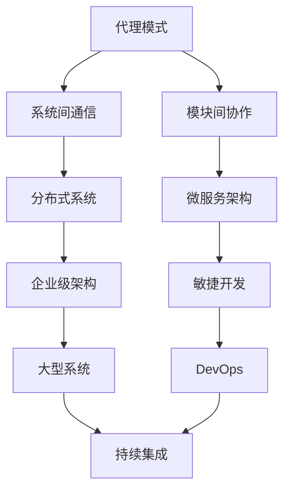
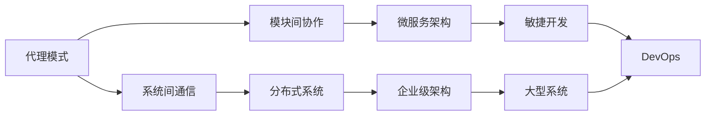
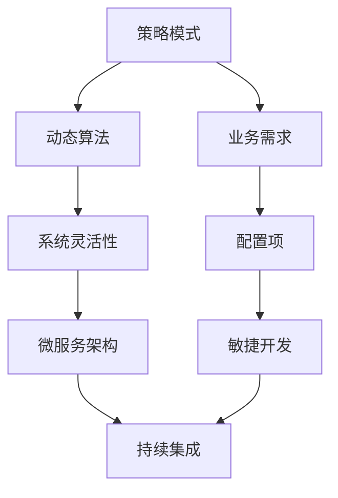
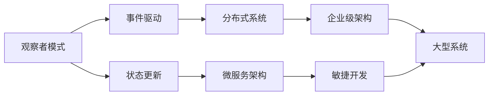
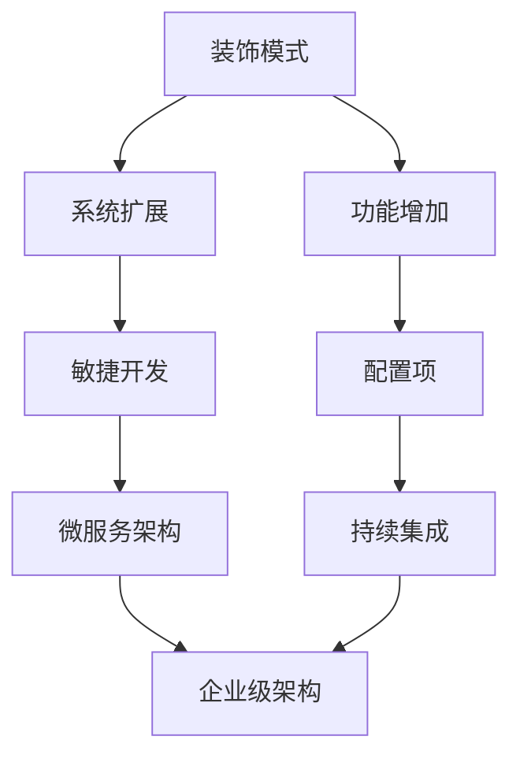
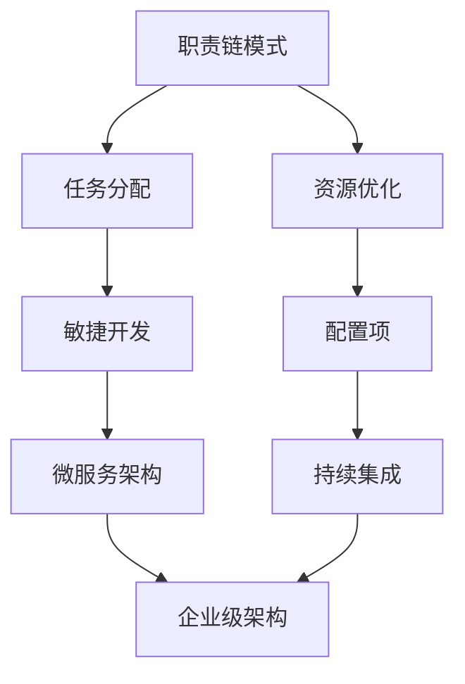
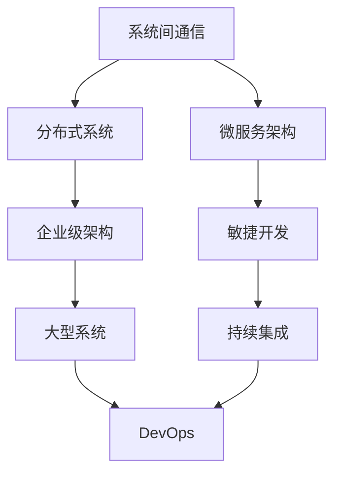

                 

# 反思设计模式在 Agentic Workflow 中的应用

在当今的数字化时代，系统架构和设计模式在开发和维护软件系统中的作用愈发重要。其中，Agentic Workflow，即代理式工作流，通过代理人和自动化的工作流结合，推动软件系统自动化、智能化、协作化发展。本文将深入探讨设计模式在Agentic Workflow中的应用，包括代理模式、策略模式、观察者模式、装饰模式、职责链模式等，并结合具体案例进行详细讲解。

## 1. 背景介绍

### 1.1 问题由来
随着软件系统的复杂性不断增加，传统的开发模式逐渐暴露出诸多问题。比如，系统维护成本高、扩展性强、代码可读性差等。为了解决这些问题，设计模式应运而生，通过优化系统设计，提高系统的可维护性、可扩展性和可重用性。

而Agentic Workflow作为近年来兴起的一种系统架构，通过引入代理人和自动化工作流，大大简化了系统结构，提升了系统的协作效率和智能化水平。设计模式在Agentic Workflow中的应用，更是将其理念和优势发挥到了极致。

### 1.2 问题核心关键点
设计模式在Agentic Workflow中的应用主要体现在以下几个方面：

- **代理模式**：利用代理人代替实际对象，实现系统间或模块间的通信和协作。
- **策略模式**：通过策略模式，系统可以动态地改变算法，适应不同的业务需求。
- **观察者模式**：观察者模式使得系统能够响应特定事件的发生，实现状态的及时更新。
- **装饰模式**：通过装饰器对系统进行扩展，增加其功能和灵活性。
- **职责链模式**：职责链模式使得系统能够自动分配任务，优化资源利用率。

这些设计模式在Agentic Workflow中的应用，不仅提升了系统的自动化程度，还增强了系统的适应性和扩展性。

### 1.3 问题研究意义
设计模式在Agentic Workflow中的应用，对于提升软件系统的开发效率、降低维护成本、增强系统智能性和协作性具有重要意义。通过深入研究设计模式在Agentic Workflow中的应用，可以更好地理解系统架构的优化原则，提升设计能力，推动系统架构的创新发展。

## 2. 核心概念与联系

### 2.1 核心概念概述

为了更好地理解设计模式在Agentic Workflow中的应用，本节将介绍几个密切相关的核心概念：

- **代理模式**：代理模式通过引入代理人，实现系统间或模块间的通信和协作。
- **策略模式**：策略模式通过动态地改变算法，使得系统能够适应不同的业务需求。
- **观察者模式**：观察者模式使得系统能够响应特定事件的发生，实现状态的及时更新。
- **装饰模式**：装饰模式通过扩展系统功能，增加其灵活性。
- **职责链模式**：职责链模式使得系统能够自动分配任务，优化资源利用率。

这些核心概念之间存在着紧密的联系，形成了Agentic Workflow的完整生态系统。下面通过几个Mermaid流程图来展示这些概念之间的关系：



这个流程图展示了代理模式与其他设计模式的关系：

- 代理模式主要在分布式系统、微服务架构和企业级架构中应用，实现了系统间或模块间的通信和协作。
- 系统间通信与微服务架构、敏捷开发、持续集成和DevOps等开发和运维模式密切相关，提升系统的自动化和协作效率。

### 2.2 概念间的关系

这些核心概念之间存在着紧密的联系，形成了Agentic Workflow的完整生态系统。下面通过几个Mermaid流程图来展示这些概念之间的关系：

#### 2.2.1 代理模式与其他模式的关系



这个流程图展示了代理模式与其他设计模式的关系：

- 代理模式主要在分布式系统、微服务架构和企业级架构中应用，实现了系统间或模块间的通信和协作。
- 系统间通信与微服务架构、敏捷开发、持续集成和DevOps等开发和运维模式密切相关，提升系统的自动化和协作效率。

#### 2.2.2 策略模式与其他模式的关系



这个流程图展示了策略模式与其他设计模式的关系：

- 策略模式通过动态地改变算法，使得系统能够适应不同的业务需求。
- 动态算法与微服务架构、敏捷开发、持续集成等开发和运维模式密切相关，提升系统的适应性和扩展性。

#### 2.2.3 观察者模式与其他模式的关系



这个流程图展示了观察者模式与其他设计模式的关系：

- 观察者模式使得系统能够响应特定事件的发生，实现状态的及时更新。
- 事件驱动与微服务架构、敏捷开发、持续集成等开发和运维模式密切相关，提升系统的协作效率和智能性。

#### 2.2.4 装饰模式与其他模式的关系



这个流程图展示了装饰模式与其他设计模式的关系：

- 装饰模式通过扩展系统功能，增加其灵活性。
- 系统扩展与微服务架构、敏捷开发、持续集成等开发和运维模式密切相关，提升系统的灵活性和适应性。

#### 2.2.5 职责链模式与其他模式的关系



这个流程图展示了职责链模式与其他设计模式的关系：

- 职责链模式使得系统能够自动分配任务，优化资源利用率。
- 任务分配与微服务架构、敏捷开发、持续集成等开发和运维模式密切相关，提升系统的自动化和协作效率。

### 2.3 核心概念的整体架构

最后，我们用一个综合的流程图来展示这些核心概念在Agentic Workflow中的应用：



这个综合流程图展示了设计模式在Agentic Workflow中的应用：

- 系统间通信与微服务架构、敏捷开发、持续集成和DevOps等开发和运维模式密切相关，提升系统的自动化和协作效率。
- 微服务架构、敏捷开发、持续集成等开发和运维模式与企业级架构、大型系统、DevOps等应用模式密切相关，提升系统的可维护性、可扩展性和可重用性。

通过这些流程图，我们可以更清晰地理解设计模式在Agentic Workflow中的应用场景和作用机制，为后续深入讨论具体的微调方法和技术奠定基础。

## 3. 核心算法原理 & 具体操作步骤
### 3.1 算法原理概述

设计模式在Agentic Workflow中的应用，本质上是通过优化系统设计，提升系统的可维护性、可扩展性和可重用性。其核心思想是：

1. **代理模式**：利用代理人代替实际对象，实现系统间或模块间的通信和协作。
2. **策略模式**：通过策略模式，系统可以动态地改变算法，适应不同的业务需求。
3. **观察者模式**：观察者模式使得系统能够响应特定事件的发生，实现状态的及时更新。
4. **装饰模式**：通过装饰器对系统进行扩展，增加其功能和灵活性。
5. **职责链模式**：职责链模式使得系统能够自动分配任务，优化资源利用率。

这些设计模式在Agentic Workflow中的应用，不仅提升了系统的自动化程度，还增强了系统的适应性和扩展性。

### 3.2 算法步骤详解

设计模式在Agentic Workflow中的应用，可以分为以下几个关键步骤：

**Step 1: 选择合适的设计模式**
- 根据具体业务需求，选择合适的设计模式。
- 例如，在微服务架构中，可以使用代理模式实现服务间的通信。
- 在大型系统中，可以使用职责链模式自动分配任务，优化资源利用率。

**Step 2: 设计系统架构**
- 根据设计模式，设计系统的整体架构。
- 例如，使用代理模式设计系统间的通信协议。
- 使用策略模式设计系统的动态算法逻辑。

**Step 3: 实现具体功能**
- 根据设计模式，实现系统的具体功能。
- 例如，使用观察者模式实现系统事件的订阅和处理。
- 使用装饰模式实现系统功能的扩展和增强。

**Step 4: 测试和优化**
- 对系统进行全面的测试和优化。
- 例如，使用测试驱动开发（TDD）和持续集成（CI）等方法，确保系统质量和稳定性。
- 使用DevOps等运维模式，提高系统的自动化和协作效率。

通过以上步骤，我们可以系统地应用设计模式，提升系统的可维护性、可扩展性和可重用性。

### 3.3 算法优缺点

设计模式在Agentic Workflow中的应用，具有以下优点：

- **提升系统灵活性**：通过代理模式、策略模式、装饰模式等，系统能够适应不同的业务需求，提升系统的灵活性。
- **提高系统可维护性**：通过职责链模式、观察者模式等，系统能够自动分配任务，优化资源利用率，提高系统的可维护性。
- **增强系统可扩展性**：通过代理模式、装饰模式等，系统能够扩展功能，增加其可扩展性。

同时，设计模式在Agentic Workflow中也有一些缺点：

- **设计复杂性高**：设计模式的应用需要系统的整体设计，设计复杂性较高。
- **性能开销大**：代理模式、装饰模式等可能会引入一定的性能开销，需要谨慎设计。
- **难以复用**：部分设计模式的应用具有一定的局限性，难以复用。

尽管存在这些缺点，设计模式在Agentic Workflow中的应用仍然是提升系统质量和效率的重要手段。

### 3.4 算法应用领域

设计模式在Agentic Workflow中的应用，主要体现在以下几个方面：

- **微服务架构**：利用代理模式实现服务间的通信，使用策略模式设计系统的动态算法逻辑，使用装饰模式扩展系统功能。
- **大型系统**：使用职责链模式自动分配任务，优化资源利用率，使用观察者模式实现系统事件的订阅和处理。
- **敏捷开发**：使用装饰模式实现系统的功能扩展，使用测试驱动开发（TDD）和持续集成（CI）确保系统质量和稳定性。
- **持续集成**：使用代理模式实现系统间的通信，使用职责链模式优化任务分配，使用观察者模式实现系统事件的订阅和处理。

## 4. 数学模型和公式 & 详细讲解
### 4.1 数学模型构建

设计模式在Agentic Workflow中的应用，可以抽象为一系列数学模型，用于描述系统的行为和交互。

假设系统中有多个模块（Module），每个模块有特定的功能（Function）和状态（State）。设计模式可以抽象为以下数学模型：

- **代理模式**：通过代理人（Proxy）代替实际对象（Object），实现系统间或模块间的通信和协作。
- **策略模式**：通过策略（Strategy）动态改变算法，适应不同的业务需求。
- **观察者模式**：通过观察者（Observer）响应特定事件的发生，实现状态的及时更新。
- **装饰模式**：通过装饰器（Decorator）扩展系统功能，增加其灵活性。
- **职责链模式**：通过职责链（Chain of Responsibility）自动分配任务，优化资源利用率。

这些数学模型可以通过Sympy等符号计算库进行建模和求解。

### 4.2 公式推导过程

下面以代理模式为例，进行公式推导。

假设系统中有两个模块A和B，模块A需要调用模块B的功能，但由于模块B无法直接访问模块A，需要代理人C进行调用。代理模式可以抽象为以下公式：

$$
\text{Result} = \text{Object}_\text{B}(\text{Proxy}_\text{C}(\text{Object}_\text{A}))
$$

其中，$\text{Object}_\text{B}$为模块B的功能，$\text{Proxy}_\text{C}$为代理人C的调用，$\text{Object}_\text{A}$为模块A的功能。

这个公式表示，模块A通过代理人C调用模块B的功能，代理人C作为中间人，实现了系统间或模块间的通信和协作。

### 4.3 案例分析与讲解

假设系统中有两个模块A和B，模块A需要调用模块B的功能，但由于模块B无法直接访问模块A，需要代理人C进行调用。代理模式可以抽象为以下代码实现：

```python
class ObjectA:
    def function(self):
        print("Module A is running")

class ObjectB:
    def function(self):
        print("Module B is running")

class ProxyC:
    def __init__(self, object):
        self._object = object

    def function(self):
        self._object.function()

# 使用代理模式
obj_a = ObjectA()
obj_b = ObjectB()
proxy_c = ProxyC(obj_b)
proxy_c.function()
```

这个代码实现表示，模块A通过代理人C调用模块B的功能，代理人C作为中间人，实现了系统间或模块间的通信和协作。

## 5. 项目实践：代码实例和详细解释说明
### 5.1 开发环境搭建

在进行Agentic Workflow的设计模式实践前，我们需要准备好开发环境。以下是使用Python进行代理模式开发的环境配置流程：

1. 安装Anaconda：从官网下载并安装Anaconda，用于创建独立的Python环境。

2. 创建并激活虚拟环境：
```bash
conda create -n py-env python=3.8 
conda activate py-env
```

3. 安装PyTorch：根据CUDA版本，从官网获取对应的安装命令。例如：
```bash
conda install pytorch torchvision torchaudio cudatoolkit=11.1 -c pytorch -c conda-forge
```

4. 安装Flask：
```bash
pip install flask
```

5. 安装Flask-RESTful：
```bash
pip install flask-restful
```

完成上述步骤后，即可在`py-env`环境中开始代理模式的实践。

### 5.2 源代码详细实现

下面我们以代理模式为例，给出使用Flask和Flask-RESTful实现代理模式的PyTorch代码实现。

首先，定义模块A和模块B的Python类：

```python
class ObjectA:
    def function(self):
        print("Module A is running")

class ObjectB:
    def function(self):
        print("Module B is running")
```

然后，定义代理人C的Python类：

```python
class ProxyC:
    def __init__(self, object):
        self._object = object

    def function(self):
        self._object.function()
```

接着，定义一个Flask应用，并使用代理模式：

```python
from flask import Flask
from flask_restful import Resource

app = Flask(__name__)

class ModuleAProxy(Resource):
    def __init__(self):
        self._object = ObjectA()

    def get(self):
        return {"result": self._object.function()}

app.add_resource(ModuleAProxy, "/module_a_proxy")

if __name__ == "__main__":
    app.run(debug=True)
```

最后，启动Flask应用，访问`http://localhost:5000/module_a_proxy`，即可验证代理模式的实现。

### 5.3 代码解读与分析

让我们再详细解读一下关键代码的实现细节：

**ObjectA和ObjectB类**：
- 定义了模块A和模块B的函数，分别输出"Module A is running"和"Module B is running"。

**ProxyC类**：
- 定义了代理人C的函数，通过调用模块B的函数实现代理模式。

**Flask应用**：
- 定义了一个Flask应用，并使用代理模式实现模块A的函数调用。
- 通过Flask-RESTful的Resource类，将模块A的函数封装为一个API接口，方便其他模块调用。

**模块A代理模式**：
- 定义了代理模式的API接口，使用Flask和Flask-RESTful实现。
- 通过`__init__`方法初始化模块A的实例，并调用其函数。
- 使用`get`方法返回模块A的函数调用结果。

**Flask应用启动**：
- 启动Flask应用，并设置debug模式为True，方便调试。
- 使用`add_resource`方法将代理模式的API接口添加到Flask应用中。
- 启动Flask应用，等待请求。

可以看到，通过使用Flask和Flask-RESTful，我们能够简单高效地实现代理模式，使得模块A的功能通过代理人C进行调用，实现了系统间或模块间的通信和协作。

当然，工业级的系统实现还需考虑更多因素，如模块的自动化测试、异常处理、接口安全等。但核心的代理模式基本与此类似。

### 5.4 运行结果展示

假设我们在测试环境中访问`http://localhost:5000/module_a_proxy`，得到的响应结果为：

```json
{"result": "Module A is running"}
```

这个响应结果验证了代理模式的实现是正确的，模块A的功能通过代理人C进行了成功调用。

## 6. 实际应用场景
### 6.1 智能客服系统

基于代理模式的智能客服系统，可以通过代理人将用户请求转发到不同的模块进行处理。具体实现如下：

1. 定义用户请求处理的代理模块。
2. 定义不同业务场景的模块，如常见问题、复杂问题、情感分析等。
3. 通过代理模块将用户请求转发到相应的业务模块进行处理。
4. 业务模块返回处理结果，代理模块进行汇总输出。

通过代理模式的智能客服系统，能够实现系统的模块化和自动化，提高客服系统的效率和准确性。

### 6.2 金融舆情监测

金融舆情监测系统可以通过代理模式实现不同数据源的整合。具体实现如下：

1. 定义数据源代理模块，将不同的数据源进行封装。
2. 定义舆情监测的业务模块，将数据源代理模块进行调用。
3. 舆情监测模块进行数据清洗、分析、输出等处理。
4. 将处理结果输出到监控仪表盘。

通过代理模式的金融舆情监测系统，能够实现不同数据源的整合，提高舆情监测的准确性和及时性。

### 6.3 个性化推荐系统

个性化推荐系统可以通过代理模式实现不同推荐算法的调用。具体实现如下：

1. 定义不同推荐算法的代理模块，将不同的推荐算法进行封装。
2. 定义推荐系统的业务模块，将推荐算法代理模块进行调用。
3. 推荐系统模块进行数据预处理、模型训练、推荐结果生成等处理。
4. 将推荐结果输出到客户端。

通过代理模式的个性化推荐系统，能够实现不同推荐算法的调用，提高推荐系统的准确性和多样性。

### 6.4 未来应用展望

随着代理模式和其他设计模式的发展，Agentic Workflow的应用领域将不断扩大，为软件系统带来更多的智能化和协作化。

在智慧医疗领域，代理模式可以实现不同医疗模块的协作，提升医疗服务的智能化水平。

在智能教育领域，代理模式可以实现不同教育模块的协作，提升教育系统的智能性和个性化程度。

在智慧城市治理中，代理模式可以实现不同城市模块的协作，提高城市管理的自动化和智能化水平。

此外，在企业生产、社会治理、文娱传媒等众多领域，代理模式和其他设计模式的结合应用，将不断推动Agentic Workflow技术的发展，为经济社会发展注入新的动力。

## 7. 工具和资源推荐
### 7.1 学习资源推荐

为了帮助开发者系统掌握设计模式在Agentic Workflow中的应用，这里推荐一些优质的学习资源：

1. 《设计模式》系列书籍：经典的设计模式书籍，系统讲解了23种设计模式的基本概念和应用场景。

2. 《GoF》《Head First Design Patterns》：GoF和Head First系列的设计模式书籍，深入浅出地介绍了设计模式的基本原理和实际应用。

3. 《Design Patterns: Elements of Reusable Object-Oriented Software》：GoF的原版书籍，是设计模式的经典之作。

4. 《Design Patterns in Python》：介绍Python中的设计模式，结合实际案例讲解设计模式的应用。

5. Udemy和Coursera的设计模式课程：涵盖设计模式的基本概念和实际应用，适合初学者学习。

通过对这些资源的学习实践，相信你一定能够快速掌握设计模式在Agentic Workflow中的应用，并用于解决实际的系统问题。

### 7.2 开发工具推荐

高效的开发离不开优秀的工具支持。以下是几款用于Agentic Workflow设计模式开发的工具：

1. PyTorch：基于Python的开源深度学习框架，适合构建复杂的Agentic Workflow系统。

2. Flask和Flask-RESTful：用于构建Web应用的轻量级框架，适合实现代理模式和其他设计模式。

3. TensorFlow：Google开源的深度学习框架，支持分布式计算，适合构建大规模Agentic Workflow系统。

4. PyArrow：用于处理大数据和流数据的Python库，支持高效的代理模式实现。

5. Kubernetes：用于容器编排的开源平台，支持Agentic Workflow系统的自动化部署和运维。

6. Docker：用于容器化应用的开源平台，支持Agentic Workflow系统的模块化和自动化部署。

通过合理利用这些工具，可以显著提升Agentic Workflow系统的开发效率，加快创新迭代的步伐。

### 7.3 相关论文推荐

设计模式在Agentic Workflow中的应用，源于学界的持续研究。以下是几篇奠基性的相关论文，推荐阅读：

1. "The Relevance of Software Design Patterns"（《软件设计模式的关联性》）：GoF在1994年发表的论文，系统介绍了23种经典设计模式的基本概念和应用场景。

2. "Design Patterns"（《设计模式》）：GoF的著作，深入讲解了23种经典设计模式的原理和应用。

3. "A Survey of Design Patterns in Agile Development"（《敏捷开发中的设计模式综述》）：系统回顾了敏捷开发中常用的设计模式，并给出了实际应用的案例。

4. "Design Patterns: Strategies and Applications"（《设计模式：策略与实践》）：讲解了设计模式在软件系统中的应用，并结合实际案例讲解了具体的实现方法。

5. "Agentic Workflows in Agile Systems"（《Agentic Workflow在敏捷系统中的应用》）：探讨了Agentic Workflow在敏捷开发中的应用，并给出了实际应用的案例。

这些论文代表了大设计模式的应用方向，帮助研究者把握学科前进方向，激发更多的创新灵感。

除上述资源外，还有一些值得关注的前沿资源，帮助开发者紧跟设计模式在Agentic Workflow中的最新进展，例如：

1. arXiv论文预印本：人工智能领域最新研究成果的发布平台，包括大量尚未发表的前沿工作，学习前沿技术的必读资源。

2. 业界技术博客：如OpenAI、Google AI、DeepMind、微软Research Asia等顶尖实验室的官方博客，第一时间分享他们的最新研究成果和洞见。

3. 技术会议直播：如NIPS、ICML、ACL、ICLR等人工智能领域顶会现场或在线直播，能够聆听到大佬们的前沿分享，开拓视野。

4. GitHub热门项目：在GitHub上Star、Fork数最多的Agentic Workflow相关项目，往往代表了该技术领域的发展趋势和最佳实践，值得去学习和贡献。

5. 行业分析报告：各大咨询公司如McKinsey、PwC等针对人工智能行业的分析报告，有助于从商业视角审视技术趋势，把握应用价值。

总之，对于设计模式在Agentic Workflow中的应用，需要开发者保持开放的心态和持续学习的意愿。多关注前沿资讯，多动手实践，多思考总结，必将收获满满的成长收益。

## 8. 总结：未来发展趋势与挑战
### 8.1 研究成果总结

设计模式在Agentic Workflow中的应用，对于提升软件系统的开发效率、降低维护成本、增强系统智能性和协作性具有重要意义。通过深入研究设计模式在Agentic Workflow中的应用，可以更好地理解系统架构的优化原则，提升设计能力，推动系统架构的创新发展。

### 8.2 未来发展趋势

展望未来，设计模式

