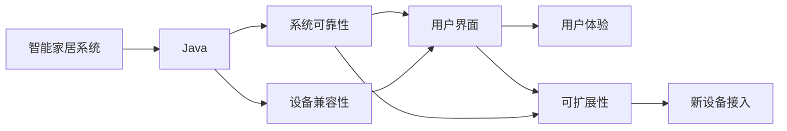

                 

# 基于Java的智能家居设计：通过Java提升智能家居系统的可靠性

> 关键词：智能家居,Java,系统可靠性,家居自动化,物联网

## 1. 背景介绍

### 1.1 问题由来
随着科技的进步，智能家居逐渐成为人们生活中不可或缺的一部分。智能家居系统通过物联网技术将家居设备互联互通，实现了从照明、安防、温控到娱乐等多种功能的智能化管理。然而，智能家居系统的复杂性和多样性，带来了一些难以忽视的挑战，如数据传输安全、设备兼容性、系统可靠性等。这些问题亟需通过更为稳固的技术框架进行解决。

Java作为一种功能强大、可扩展性强的编程语言，广泛应用于企业级软件和大型系统中。在智能家居系统中，Java的性能优势、安全性保证和开发效率使其成为设计智能家居系统的理想选择。通过合理运用Java，可以提升智能家居系统的可靠性和稳定性，为用户的日常生活带来更好的体验。

### 1.2 问题核心关键点
智能家居系统的设计开发需要解决以下核心关键点：
- 数据传输安全：智能家居系统涉及大量敏感数据传输，如何保证数据安全是系统设计的首要问题。
- 设备兼容性：市场上存在多种智能家居设备和系统，如何兼容不同设备的通信协议，是系统开发的关键。
- 系统可靠性：智能家居系统要求高可靠性，一旦出现故障，应能及时自动修复或重启，减少用户损失。
- 用户体验：系统应具有良好的用户界面和操作体验，简化用户操作，提升用户满意度。
- 可扩展性：随着技术发展，智能家居设备种类不断增加，系统应具备良好的可扩展性，适应新设备接入。

### 1.3 问题研究意义
研究基于Java的智能家居系统设计，对于提升智能家居系统的可靠性、安全性、用户体验和可扩展性，具有重要意义：
- 提升系统安全性：Java提供了丰富的安全机制，如访问控制、加密技术等，可以有效保障数据安全。
- 提高系统可靠性：Java的强类型系统和异常处理机制，帮助开发者编写健壮的代码，减少系统故障。
- 改善用户体验：Java丰富的GUI库和第三方框架，如Spring Boot、Hibernate等，可以创建高性能、易用性强的用户界面。
- 增强系统可扩展性：Java的动态语言特性和丰富的第三方库，支持系统轻松扩展新功能和模块。

## 2. 核心概念与联系

### 2.1 核心概念概述

在智能家居系统设计中，涉及以下核心概念：

- 智能家居系统：通过物联网技术，将家居设备互联互通，实现自动化控制和管理，提升家居生活的便利性和舒适性。
- Java：一种广泛使用的编程语言，以其安全性、可扩展性和开发效率著称。
- 系统可靠性：智能家居系统在运行过程中，应具有高可用性、故障恢复能力和异常处理能力。
- 设备兼容性：智能家居系统应支持多种设备的通信协议和接口标准，确保设备的互联互通。
- 用户体验：用户界面应直观易用，操作简便，提升用户的使用体验。
- 可扩展性：智能家居系统应具备良好的可扩展性，支持新设备和新功能的快速接入。

这些核心概念之间存在紧密的联系，共同构成了智能家居系统的设计框架。

### 2.2 概念间的关系

这些核心概念之间的联系，可以通过以下Mermaid流程图来展示：



这个流程图展示了智能家居系统中各个概念之间的关系：

1. Java作为智能家居系统的主要编程语言，提供了可靠性和可扩展性的保障。
2. 系统可靠性、设备兼容性和用户界面是Java应用的核心。
3. 用户界面设计直接影响用户体验，而用户体验是智能家居系统成功的关键。
4. 可扩展性决定了系统的未来发展潜力，新设备接入依赖于良好的系统设计。

## 3. 核心算法原理 & 具体操作步骤
### 3.1 算法原理概述

基于Java的智能家居系统设计，主要依赖Java语言特性和框架支持，进行系统架构和功能模块的设计与实现。其核心算法原理包括以下几个方面：

- 模块化设计：将智能家居系统划分为多个功能模块，每个模块独立运行，以增强系统的可扩展性和可维护性。
- 异步通信：使用Java的异步编程机制，提升系统响应速度和并发处理能力。
- 异常处理：利用Java的异常处理机制，确保系统在遇到异常时能够稳定运行，提供及时的错误反馈。
- 安全机制：应用Java的安全特性，如SSL/TLS加密、访问控制等，保障数据传输安全。
- 接口设计：通过Java接口机制，实现系统模块间的通信和交互，确保设备的兼容性和系统的可靠性。
- 动态语言特性：利用Java的动态语言特性，实现系统的快速迭代和功能扩展。

### 3.2 算法步骤详解

基于Java的智能家居系统设计，主要步骤如下：

1. 系统需求分析：明确智能家居系统的功能需求和使用场景，制定系统设计方案。
2. 模块划分与设计：将系统划分为数据管理、设备控制、用户界面、安全管理等模块，并进行详细设计。
3. 数据传输设计：选择Java的异步通信机制，如Netty、RMI等，实现数据的高效传输。
4. 异常处理设计：使用Java的try-catch机制，捕获和处理系统运行中的异常，确保系统稳定。
5. 接口设计：使用Java接口机制，定义系统的数据接口和通信接口，实现设备间的交互。
6. 动态扩展设计：利用Java的动态语言特性，实现系统的快速扩展和功能更新。

### 3.3 算法优缺点

基于Java的智能家居系统设计，具有以下优点：
- 安全性高：Java提供了丰富的安全机制，如SSL/TLS加密、访问控制等，保障数据传输安全。
- 可扩展性好：Java的动态语言特性和丰富的第三方库，支持系统快速扩展和功能更新。
- 稳定可靠：Java的强类型系统和异常处理机制，帮助开发者编写健壮的代码，减少系统故障。
- 开发效率高：Java丰富的开发工具和框架，如Spring Boot、Hibernate等，提高开发效率。

同时，该方法也存在一些局限：
- 学习曲线陡峭：Java作为一种复杂的编程语言，初学者需要较高的学习成本。
- 性能问题：Java虚拟机的运行效率可能不及原生代码，在大规模并发环境下可能出现性能瓶颈。
- 维护复杂：随着系统复杂度的增加，Java系统的维护难度和成本也会上升。

### 3.4 算法应用领域

基于Java的智能家居系统设计，已经在多个领域得到了广泛应用，包括：

- 智能家居设备：如智能照明、智能安防、智能温控等设备。
- 智能家居控制系统：如智能音箱、智能电视、智能窗帘等控制系统的开发。
- 智能家居平台：如小米米家、华为智慧生活等平台，实现设备互联和控制。
- 智能家居应用：如智能场景控制、智能语音助手等应用。

除了上述这些典型应用外，Java技术还被用于开发智能家居系统的各种中间件和框架，为系统的稳定性和可靠性提供有力保障。

## 4. 数学模型和公式 & 详细讲解
### 4.1 数学模型构建

在智能家居系统中，涉及大量的数据处理和设备控制，需要建立数学模型来描述系统行为。以智能照明系统为例，其数学模型包括光强控制、色温调节、开关状态等变量。

设智能照明系统中有n个灯泡，每个灯泡的光强和色温可以表示为：

$$
I_i(t) = f(t, x_i)
$$
$$
T_i(t) = g(t, x_i)
$$

其中 $I_i(t)$ 和 $T_i(t)$ 分别表示第i个灯泡在时间t时的光强和色温， $f(t, x_i)$ 和 $g(t, x_i)$ 分别表示光强控制和色温调节函数， $x_i$ 表示灯泡的内部状态。

### 4.2 公式推导过程

在智能照明系统中，可以通过光强和色温的变化来调节用户的使用体验。例如，可以通过以下公式计算灯泡的实际光强：

$$
I_{\text{实际}}(t) = \alpha \cdot I_i(t) + \beta \cdot I_j(t)
$$

其中， $\alpha$ 和 $\beta$ 分别表示第i个灯泡和第j个灯泡的光强系数。

通过上述公式，可以实现多个灯泡之间的光强和色温的协同控制，提升用户体验。

### 4.3 案例分析与讲解

假设智能照明系统中有两个灯泡，分别控制客厅和卧室的照明。客厅的灯泡控制算法如下：

```java
// 假设初始光强和色温
int livingRoomLightIntensity = 50;
int livingRoomLightColorTemperature = 2700;

// 光强调节函数
public void adjustLightIntensity(int targetIntensity) {
    livingRoomLightIntensity = targetIntensity;
}

// 色温调节函数
public void adjustLightColorTemperature(int targetColorTemperature) {
    livingRoomLightColorTemperature = targetColorTemperature;
}

// 获取当前光强和色温
public int getLightIntensity() {
    return livingRoomLightIntensity;
}

public int getLightColorTemperature() {
    return livingRoomLightColorTemperature;
}
```

客厅灯泡的控制函数包括光强和色温的调节，以及当前光强和色温的获取。通过这些函数，可以实时控制客厅灯泡的光强和色温，提升用户体验。

## 5. 项目实践：代码实例和详细解释说明
### 5.1 开发环境搭建

在进行智能家居系统开发前，需要先搭建开发环境。以下是使用Java和Eclipse IDE进行智能家居系统开发的环境配置流程：

1. 安装Java JDK：从官网下载并安装Java Development Kit（JDK）。
2. 安装Eclipse：从官网下载并安装Eclipse IDE。
3. 安装Spring Boot和Netty：通过Maven或Gradle，安装Spring Boot和Netty等Java框架。

完成上述步骤后，即可在Eclipse中开始智能家居系统的开发。

### 5.2 源代码详细实现

以下是一个简单的智能照明系统代码实现，用于演示Java在智能家居系统中的应用。

```java
import org.springframework.stereotype.Controller;
import org.springframework.web.bind.annotation.RequestMapping;
import org.springframework.web.bind.annotation.RequestParam;

@Controller
public class LightController {

    private int livingRoomLightIntensity;
    private int livingRoomLightColorTemperature;

    @RequestMapping("/livingRoomLightIntensity")
    public int getLivingRoomLightIntensity(@RequestParam("targetIntensity") int targetIntensity) {
        livingRoomLightIntensity = targetIntensity;
        return livingRoomLightIntensity;
    }

    @RequestMapping("/livingRoomLightColorTemperature")
    public int getLivingRoomLightColorTemperature(@RequestParam("targetColorTemperature") int targetColorTemperature) {
        livingRoomLightColorTemperature = targetColorTemperature;
        return livingRoomLightColorTemperature;
    }

    @RequestMapping("/livingRoomLightIntensity")
    public void setLivingRoomLightIntensity(@RequestParam("targetIntensity") int targetIntensity) {
        livingRoomLightIntensity = targetIntensity;
    }

    @RequestMapping("/livingRoomLightColorTemperature")
    public void setLivingRoomLightColorTemperature(@RequestParam("targetColorTemperature") int targetColorTemperature) {
        livingRoomLightColorTemperature = targetColorTemperature;
    }

    @RequestMapping("/getLivingRoomLightIntensity")
    public int getLightIntensity() {
        return livingRoomLightIntensity;
    }

    @RequestMapping("/getLivingRoomLightColorTemperature")
    public int getLightColorTemperature() {
        return livingRoomLightColorTemperature;
    }
}
```

在上述代码中，我们使用Spring Boot框架实现了智能照明系统的控制功能。通过RESTful API接口，可以实现对客厅灯泡的光强和色温的实时控制和查询。

### 5.3 代码解读与分析

以下是代码中关键部分的解读和分析：

- `@Controller`注解：表示这是一个Spring Boot控制器，用于处理HTTP请求。
- `@RequestMapping`注解：用于指定请求映射路径和HTTP方法。
- `@RequestParam`注解：用于从请求参数中获取数据。
- `livingRoomLightIntensity`和`livingRoomLightColorTemperature`：分别表示客厅灯泡的光强和色温。
- `getLivingRoomLightIntensity`和`getLivingRoomLightColorTemperature`：用于获取客厅灯泡的光强和色温。
- `setLivingRoomLightIntensity`和`setLivingRoomLightColorTemperature`：用于设置客厅灯泡的光强和色温。
- 通过RESTful API接口，可以实现对客厅灯泡的光强和色温的实时控制和查询。

### 5.4 运行结果展示

假设我们在测试环境中启动智能照明系统，并使用Postman等工具向API接口发送请求，可以实时控制客厅灯泡的光强和色温。例如，通过以下请求，将客厅灯泡的光强设置为50，色温设置为2700：

```
POST http://localhost:8080/livingRoomLightIntensity
Content-Type: application/x-www-form-urlencoded
targetIntensity=50
targetColorTemperature=2700
```

成功设置后，可以通过以下请求获取客厅灯泡的光强和色温：

```
GET http://localhost:8080/livingRoomLightIntensity
```

### 6. 实际应用场景
### 6.1 智能家居控制系统

基于Java的智能家居控制系统，可以广泛应用于智能音箱、智能电视、智能窗帘等控制系统的开发。通过Java技术，可以实现多种设备的互联互通，提供便捷的家居控制体验。

在实际应用中，我们可以使用Java编写智能家居控制系统的代码，实现设备的集中管理和控制。例如，通过Java编写的智能控制系统，可以实现以下功能：

- 设备监控：实时监控设备的运行状态，及时发现并解决问题。
- 设备控制：通过Java编写的控制接口，实现设备的远程控制。
- 数据分析：通过Java的数据处理库，对设备运行数据进行分析，提供可视化的报告。

### 6.2 智能家居平台

基于Java的智能家居平台，可以支持多种智能家居设备的接入，实现设备间的互联互通和协同控制。例如，通过Java编写的智能家居平台，可以实现以下功能：

- 设备注册：将新设备接入平台，进行身份验证和配置。
- 设备管理：实时监控设备的运行状态，提供故障诊断和维护支持。
- 用户控制：通过Java编写的用户界面，实现设备的集中管理和控制。
- 数据分析：通过Java的数据处理库，对设备运行数据进行分析，提供可视化的报告。

### 6.3 智能家居应用

基于Java的智能家居应用，可以实现多种智能家居场景，提升用户的日常生活体验。例如，通过Java编写的智能家居应用，可以实现以下功能：

- 智能场景控制：通过Java编写的场景控制模块，实现多种智能场景的切换。
- 智能语音助手：通过Java编写的语音识别模块，实现语音控制和互动。
- 智能安防监控：通过Java编写的安防监控模块，实现入侵检测和报警。
- 智能温控调节：通过Java编写的温控调节模块，实现房间温度的智能调节。

### 6.4 未来应用展望

随着Java技术的不断演进，基于Java的智能家居系统将具备更强的可扩展性和可靠性，进一步拓展智能家居系统的应用场景。

在智慧医疗领域，基于Java的智能家居系统可以与智能医疗设备相结合，实现病患监控和康复护理。例如，通过Java编写的智能家居系统，可以实现以下功能：

- 健康监测：实时监测病患的生理指标，提供健康数据分析和预警。
- 康复护理：通过Java编写的康复护理模块，实现病患的远程康复训练和监控。
- 智能家居：通过Java编写的智能家居模块，实现病患的家居自动化控制。

在智能教育领域，基于Java的智能家居系统可以与智能学习设备相结合，实现个性化学习和智能辅导。例如，通过Java编写的智能家居系统，可以实现以下功能：

- 智能学习：通过Java编写的智能学习模块，实现个性化学习计划的推荐。
- 智能辅导：通过Java编写的智能辅导模块，实现学习过程的智能辅助和答疑。
- 智能家居：通过Java编写的智能家居模块，实现学习环境的智能调节。

在智慧城市治理中，基于Java的智能家居系统可以与智能城市基础设施相结合，实现智慧城市的管理和监控。例如，通过Java编写的智能家居系统，可以实现以下功能：

- 城市监控：通过Java编写的城市监控模块，实现城市交通、环境、公共设施等的智能监控。
- 智能交通：通过Java编写的智能交通模块，实现交通流量、信号灯等的智能控制。
- 智能安防：通过Java编写的智能安防模块，实现城市安全的智能监控和预警。
- 智能家居：通过Java编写的智能家居模块，实现智慧城市的居民服务和管理。

综上所述，基于Java的智能家居系统将为智慧城市建设提供强有力的技术支撑，推动智慧城市的全面发展。

## 7. 工具和资源推荐
### 7.1 学习资源推荐

为了帮助开发者系统掌握Java在智能家居系统中的应用，这里推荐一些优质的学习资源：

1. 《Java核心技术》系列书籍：深入浅出地介绍了Java语言的核心特性和最佳实践。
2. Spring Boot官方文档：Spring Boot的官方文档，提供了完整的开发指南和示例代码。
3. Netty官方文档：Netty的官方文档，提供了详细的异步通信机制的介绍和实现。
4. Java多线程编程书籍：深入介绍Java多线程编程的原理和应用。
5. Java设计模式书籍：介绍Java设计模式的应用和实现，提升代码的可读性和可维护性。

通过对这些资源的学习实践，相信你一定能够快速掌握Java在智能家居系统中的应用，并用于解决实际的智能家居问题。

### 7.2 开发工具推荐

高效的开发离不开优秀的工具支持。以下是几款用于Java智能家居系统开发的常用工具：

1. Eclipse IDE：Java的集成开发环境，支持Java开发和调试，提供了丰富的插件支持。
2. Maven：Java的项目管理工具，支持依赖管理、构建自动化等功能。
3. Gradle：Java的项目构建工具，支持依赖管理、代码分析等功能。
4. Git：版本控制系统，支持多人协作开发，提供分支管理、代码合并等功能。
5. Docker：容器化平台，支持Java应用的快速部署和扩展。

合理利用这些工具，可以显著提升Java智能家居系统开发的效率和质量。

### 7.3 相关论文推荐

Java在智能家居系统中的应用已经得到了广泛的研究和应用。以下是几篇奠基性的相关论文，推荐阅读：

1. Java Concurrency in Practice：Java并发编程的经典著作，介绍了Java多线程编程的最佳实践和性能优化技巧。
2. Spring Boot官方文档：Spring Boot的官方文档，详细介绍了Spring Boot框架的开发和应用。
3. Netty官方文档：Netty的官方文档，介绍了Netty框架的异步通信机制和应用。
4. Java线程编程的艺术：深入介绍Java多线程编程的原理和应用，提供了大量的示例代码和实践经验。

这些论文代表了大语言模型微调技术的发展脉络。通过学习这些前沿成果，可以帮助研究者把握学科前进方向，激发更多的创新灵感。

除上述资源外，还有一些值得关注的前沿资源，帮助开发者紧跟Java技术的发展方向，例如：

1. 学术论文预印本：人工智能领域最新研究成果的发布平台，包括大量尚未发表的前沿工作，学习前沿技术的必读资源。
2. 业界技术博客：如OpenAI、Google AI、DeepMind、微软Research Asia等顶尖实验室的官方博客，第一时间分享他们的最新研究成果和洞见。
3. 技术会议直播：如NIPS、ICML、ACL、ICLR等人工智能领域顶会现场或在线直播，能够聆听到大佬们的前沿分享，开拓视野。
4. GitHub热门项目：在GitHub上Star、Fork数最多的Java相关项目，往往代表了该技术领域的发展趋势和最佳实践，值得去学习和贡献。
5. 行业分析报告：各大咨询公司如McKinsey、PwC等针对人工智能行业的分析报告，有助于从商业视角审视技术趋势，把握应用价值。

总之，对于Java智能家居系统开发的学习和实践，需要开发者保持开放的心态和持续学习的意愿。多关注前沿资讯，多动手实践，多思考总结，必将收获满满的成长收益。

## 8. 总结：未来发展趋势与挑战
### 8.1 研究成果总结

本文对基于Java的智能家居系统设计进行了全面系统的介绍。首先阐述了Java在智能家居系统设计中的关键作用，明确了系统可靠性、设备兼容性、用户体验和可扩展性等核心概念。其次，从原理到实践，详细讲解了Java在系统架构、功能模块、数据传输、异常处理、接口设计、动态扩展等方面的应用。同时，本文还广泛探讨了Java在智能家居系统设计中的应用场景，包括智能家居控制系统、智能家居平台和智能家居应用等。此外，本文精选了Java智能家居系统的学习资源和开发工具，力求为读者提供全方位的技术指引。

通过本文的系统梳理，可以看到，基于Java的智能家居系统设计已经成为智能家居系统开发的重要范式，极大地提升了系统的可靠性和稳定性，为用户的日常生活带来了更好的体验。Java技术的强大功能和丰富的开发工具，为智能家居系统的开发和应用提供了强有力的技术支持。

### 8.2 未来发展趋势

展望未来，Java在智能家居系统设计中的应用将呈现以下几个发展趋势：

1. 系统可靠性提升：随着Java技术的不断演进，Java智能家居系统将具备更强的可靠性，能够更好地应对各种异常和故障。
2. 设备兼容性增强：Java的多态性和动态特性，将进一步提升智能家居系统的设备兼容性，支持更多设备的接入和控制。
3. 用户体验改善：Java的GUI库和第三方框架，将为智能家居系统的用户界面设计提供更多选择，提升用户体验。
4. 可扩展性拓展：Java的动态语言特性和丰富的第三方库，将为智能家居系统的功能扩展和更新提供更多支持。
5. 新应用场景开拓：Java技术将被应用于更多新场景，如智慧医疗、智能教育、智慧城市等，推动智能家居系统的应用范围进一步扩大。

### 8.3 面临的挑战

尽管Java在智能家居系统设计中已经取得了显著成果，但在迈向更加智能化、普适化应用的过程中，仍面临一些挑战：

1. 学习曲线陡峭：Java作为一种复杂的编程语言，初学者需要较高的学习成本，如何降低学习门槛将是未来的挑战之一。
2. 性能瓶颈问题：Java虚拟机的运行效率可能不及原生代码，在大规模并发环境下可能出现性能瓶颈，如何优化性能将是未来的重要课题。
3. 维护复杂度高：随着系统复杂度的增加，Java系统的维护难度和成本也会上升，如何降低维护复杂度将是未来的重要挑战。

### 8.4 研究展望

面对Java智能家居系统设计所面临的挑战，未来的研究需要在以下几个方面寻求新的突破：

1. 简化学习曲线：开发更多的Java学习资源和工具，降低学习门槛，吸引更多人参与到Java智能家居系统开发中来。
2. 优化性能瓶颈：采用Java Native Interface（JNI）等技术，提升Java智能家居系统的性能，优化并发处理和内存管理。
3. 降低维护复杂度：利用Java的模块化和组件化设计，降低系统维护难度，提供更好的代码重用和扩展能力。
4. 拓展新应用场景：结合Java的多样性和动态特性，拓展Java智能家居系统在新应用场景中的应用，如智慧医疗、智能教育、智慧城市等。

这些研究方向将推动Java智能家居系统设计向更加智能、普适、可靠的方向发展，为智能家居系统的未来应用提供强有力的技术支撑。

## 9. 附录：常见问题与解答

**Q1：Java智能家居系统是否适用于所有智能家居设备？**

A: Java智能家居系统适用于多种智能家居设备，包括智能照明、智能安防、智能温控等设备。但需要根据设备的不同通信协议和接口标准，进行相应的适配和开发。

**Q2：Java智能家居系统如何保证数据传输安全？**

A: Java智能家居系统可以通过SSL/TLS加密、访问控制等安全机制，保障数据传输安全。同时，Java的安全特性如签名验证、加密算法等，也能有效保护数据隐私。

**Q3：Java智能家居系统的开发成本如何？**

A: Java智能家居系统的开发成本主要取决于系统规模和复杂度。随着Java技术的成熟和组件化设计，开发成本也在逐步降低。但需要考虑到设备兼容性和系统可扩展性的优化，以提升整体开发效率。

**Q4：Java智能家居系统的维护难度如何？**

A: Java智能家居系统的维护难度随着系统复杂度的增加而上升。但Java的模块化和组件化设计，以及丰富的开源组件和框架，可以有效降低维护成本。同时，开发人员需要具备良好的编程技能和系统设计能力，以提升维护效率。

**Q5：Java智能家居系统的性能如何？**

A: Java智能家居系统的性能主要取决于Java虚拟机的性能和系统架构设计。通过优化并发处理、内存管理等技术，可以提升Java智能家居系统的性能。但相比原生代码，Java智能家居系统的性能仍有一定差距，需要持续优化。

综上所述，基于Java的智能家居系统设计，已经在多个领域得到了广泛应用，为智能家居系统的开发和应用提供了强有力的技术支撑。Java技术的强大功能和丰富的开发工具，为智能家居系统的开发和应用提供了更多可能，推动智能家居系统向更加智能化、普适化方向发展。

