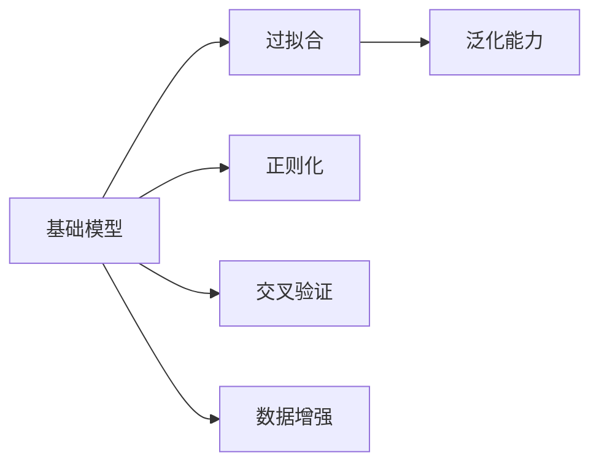
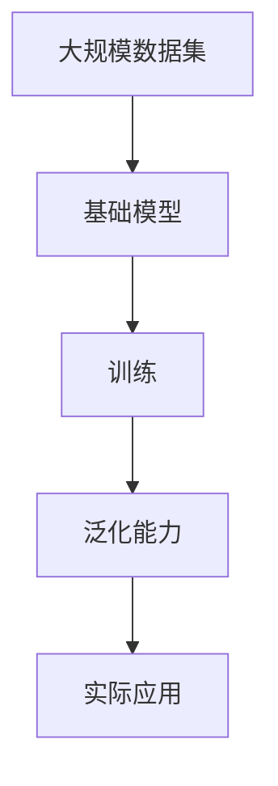
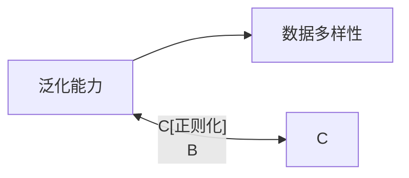
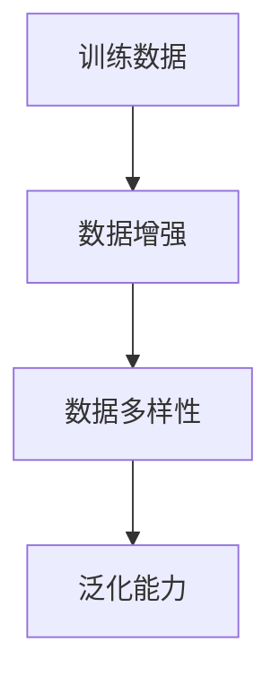
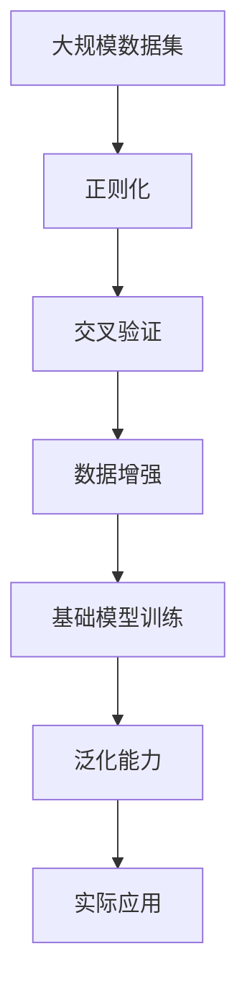

                 

# 基础模型的下游应用与缺陷

## 1. 背景介绍

基础模型（Fundamental Models）是深度学习模型家族中的基础成员，具有通用性、可扩展性和广泛的应用前景。这些模型经过大量数据训练，能够解决多种常见的机器学习问题，包括分类、回归、聚类等。然而，尽管基础模型在应用上具有诸多优势，但它们同样存在着一些缺陷，如过拟合、泛化能力弱等问题。本文将深入探讨基础模型的应用场景与不足，并提出一些改进策略。

## 2. 核心概念与联系

### 2.1 核心概念概述

为了更好地理解基础模型的应用与缺陷，本文将介绍几个密切相关的核心概念：

- **基础模型**：深度学习模型家族中的基础成员，如线性回归模型、支持向量机、决策树等。这些模型通过大量数据训练，能够解决多种常见的机器学习问题，包括分类、回归、聚类等。

- **过拟合（Overfitting）**：指模型在训练数据上表现良好，但在测试数据或新数据上表现较差的现象。过拟合通常发生在模型过于复杂或训练数据不足的情况下。

- **泛化能力（Generalization）**：指模型在新数据上表现良好的能力。良好的泛化能力是基础模型应用的前提。

- **正则化（Regularization）**：通过在损失函数中引入惩罚项，避免模型过拟合。常见的正则化方法包括L1正则、L2正则等。

- **交叉验证（Cross-Validation）**：通过在训练数据上不断拆分、重组合并，提高模型评估的稳定性，避免模型对特定数据集的依赖。

- **数据增强（Data Augmentation）**：通过对训练数据进行变换，增加数据多样性，提高模型泛化能力。

这些核心概念之间的关系可以通过以下Mermaid流程图来展示：



这个流程图展示了基础模型的核心概念及其之间的关系：

1. 基础模型通过数据训练，学习数据特征。
2. 过拟合是模型泛化能力不足的表现，需要通过正则化、交叉验证、数据增强等手段进行缓解。
3. 良好的泛化能力是基础模型的应用前提，需要通过正则化、交叉验证、数据增强等手段进行提升。

### 2.2 概念间的关系

这些核心概念之间存在着紧密的联系，形成了基础模型的应用框架。下面我通过几个Mermaid流程图来展示这些概念之间的关系。

#### 2.2.1 基础模型的学习范式



这个流程图展示了基础模型从数据训练到实际应用的过程：

1. 基础模型通过在大规模数据集上进行训练，学习数据特征。
2. 训练过程中，正则化、交叉验证、数据增强等手段用于提升模型泛化能力。
3. 经过训练的模型应用于实际问题，通过泛化能力解决新数据的问题。

#### 2.2.2 泛化能力与过拟合的关系



这个流程图展示了泛化能力与数据多样性和正则化之间的关系：

1. 泛化能力依赖于数据多样性，即训练数据包含多种变化形式。
2. 正则化通过引入惩罚项，避免模型在训练数据上过度拟合，提高泛化能力。

#### 2.2.3 数据增强的作用



这个流程图展示了数据增强的作用：

1. 数据增强通过对训练数据进行变换，增加数据多样性。
2. 数据多样性提高了模型泛化能力，避免了模型对特定数据集的依赖。

### 2.3 核心概念的整体架构

最后，我们用一个综合的流程图来展示这些核心概念在大规模数据集上的整体架构：



这个综合流程图展示了基础模型从数据处理到实际应用的过程：

1. 大规模数据集经过正则化、交叉验证、数据增强等手段处理，生成更丰富的训练数据。
2. 基础模型通过处理后的数据训练，学习数据特征。
3. 训练过程中，正则化、交叉验证、数据增强等手段用于提升模型泛化能力。
4. 经过训练的模型应用于实际问题，通过泛化能力解决新数据的问题。

## 3. 核心算法原理 & 具体操作步骤

### 3.1 算法原理概述

基础模型通过训练大量数据，学习数据特征，并通过这些特征进行预测或分类。其核心原理可以简述如下：

1. 模型训练：通过损失函数最小化，使模型在训练数据上尽可能地拟合数据特征。
2. 正则化：通过引入惩罚项，避免模型在训练数据上过度拟合。
3. 泛化能力：模型在训练数据上表现良好，并在新数据上表现同样良好。

### 3.2 算法步骤详解

基础模型的训练过程可以分为以下几个关键步骤：

1. 数据准备：收集和预处理训练数据，包括数据清洗、归一化、特征提取等。
2. 模型初始化：选择合适的基础模型，如线性回归、支持向量机等，并进行初始化。
3. 模型训练：通过损失函数最小化，更新模型参数。
4. 模型评估：在验证集上评估模型性能，选择最优模型。
5. 模型应用：将模型应用于实际问题，进行预测或分类。

下面以线性回归模型为例，展示具体的训练过程：

```python
import numpy as np
from sklearn.linear_model import LinearRegression

# 准备数据
X = np.array([[1, 2], [2, 3], [3, 4], [4, 5]])
y = np.array([2, 4, 6, 8])

# 初始化模型
model = LinearRegression()

# 模型训练
model.fit(X, y)

# 模型评估
X_test = np.array([[5, 6], [6, 7]])
y_pred = model.predict(X_test)
print(y_pred)

# 模型应用
# 使用模型对新数据进行预测
new_data = np.array([[7, 8]])
y_new = model.predict(new_data)
print(y_new)
```

### 3.3 算法优缺点

基础模型的优点包括：

- 简单高效：模型结构简单，易于理解和实现。
- 泛化能力强：经过大量数据训练，具有较好的泛化能力。
- 可扩展性好：适用于多种常见的机器学习问题。

其缺点包括：

- 容易过拟合：在训练数据不足或模型复杂度过高的情况下，容易过拟合。
- 泛化能力有限：对于新数据或复杂问题的泛化能力较弱。
- 缺乏解释性：模型参数较多，难以解释其决策过程。

### 3.4 算法应用领域

基础模型在多个领域得到了广泛应用，以下是几个典型的应用场景：

1. 金融预测：通过历史金融数据训练线性回归模型，进行股票价格预测、风险评估等。
2. 医学诊断：通过病人数据训练分类模型，进行疾病诊断、治疗方案推荐等。
3. 电子商务推荐：通过用户行为数据训练协同过滤模型，进行商品推荐、价格预测等。
4. 图像识别：通过图像数据训练卷积神经网络（CNN），进行图像分类、物体检测等。
5. 自然语言处理：通过文本数据训练语言模型，进行文本分类、情感分析等。

## 4. 数学模型和公式 & 详细讲解

### 4.1 数学模型构建

线性回归模型的数学模型可以表示为：

$$
y = \beta_0 + \beta_1x_1 + \beta_2x_2 + \cdots + \beta_nx_n + \epsilon
$$

其中，$y$为输出变量，$\beta_0, \beta_1, \cdots, \beta_n$为模型参数，$x_1, x_2, \cdots, x_n$为输入变量，$\epsilon$为随机误差。

### 4.2 公式推导过程

在线性回归模型的训练过程中，常用的损失函数为均方误差（Mean Squared Error, MSE）：

$$
L(\beta) = \frac{1}{2m} \sum_{i=1}^m(y_i - \hat{y}_i)^2
$$

其中，$m$为样本数量，$y_i$为第$i$个样本的真实标签，$\hat{y}_i$为模型对第$i$个样本的预测值。

通过梯度下降算法，求解损失函数的最小值，即：

$$
\frac{\partial L(\beta)}{\partial \beta_j} = \frac{1}{m} \sum_{i=1}^m (y_i - \hat{y}_i) x_{ij}
$$

其中，$x_{ij}$为第$i$个样本的第$j$个特征。

通过上述公式，可以更新模型参数，完成模型的训练。

### 4.3 案例分析与讲解

以房价预测为例，使用线性回归模型进行房价预测。

假设有一组房价数据，包括房屋面积、房间数等特征，以及对应的房价。通过这些数据训练线性回归模型，预测新房屋的房价。

1. 准备数据：收集房价数据，包括房屋面积、房间数等特征，以及对应的房价。
2. 模型训练：使用训练数据训练线性回归模型，求解模型参数$\beta_0, \beta_1, \beta_2$。
3. 模型评估：在验证集上评估模型性能，选择最优模型。
4. 模型应用：使用模型对新房屋进行房价预测。

## 5. 项目实践：代码实例和详细解释说明

### 5.1 开发环境搭建

在进行基础模型应用实践前，我们需要准备好开发环境。以下是使用Python进行Scikit-learn开发的环境配置流程：

1. 安装Anaconda：从官网下载并安装Anaconda，用于创建独立的Python环境。

2. 创建并激活虚拟环境：
```bash
conda create -n sklearn-env python=3.8 
conda activate sklearn-env
```

3. 安装Scikit-learn：
```bash
conda install scikit-learn
```

4. 安装各类工具包：
```bash
pip install numpy pandas scikit-learn matplotlib tqdm jupyter notebook ipython
```

完成上述步骤后，即可在`sklearn-env`环境中开始基础模型应用实践。

### 5.2 源代码详细实现

下面我们以线性回归模型为例，给出使用Scikit-learn库进行房价预测的Python代码实现。

首先，准备数据：

```python
from sklearn.datasets import load_boston
from sklearn.model_selection import train_test_split
import numpy as np

# 加载波士顿房价数据集
boston = load_boston()
X = boston.data
y = boston.target

# 划分训练集和测试集
X_train, X_test, y_train, y_test = train_test_split(X, y, test_size=0.2, random_state=42)
```

然后，训练模型：

```python
from sklearn.linear_model import LinearRegression

# 初始化线性回归模型
model = LinearRegression()

# 训练模型
model.fit(X_train, y_train)
```

接着，评估模型：

```python
from sklearn.metrics import mean_squared_error

# 在测试集上评估模型
y_pred = model.predict(X_test)
mse = mean_squared_error(y_test, y_pred)
print(f"MSE: {mse:.2f}")
```

最后，使用模型进行预测：

```python
# 使用模型对新数据进行预测
new_data = np.array([[20, 2]])
y_new = model.predict(new_data)
print(f"新房价预测值: {y_new:.2f}")
```

以上就是使用Scikit-learn库进行线性回归模型房价预测的完整代码实现。可以看到，Scikit-learn库的封装使得模型训练和评估变得简洁高效。

### 5.3 代码解读与分析

让我们再详细解读一下关键代码的实现细节：

**准备数据**：
- `load_boston`函数：从Scikit-learn库中加载波士顿房价数据集。
- `train_test_split`函数：将数据集划分为训练集和测试集，比例为8:2，随机种子为42，保证数据可复现。

**训练模型**：
- `LinearRegression`类：Scikit-learn库中的线性回归模型。
- `fit`方法：使用训练数据训练模型，求解模型参数。

**评估模型**：
- `mean_squared_error`函数：计算均方误差，评估模型性能。
- `mse`变量：保存计算结果，输出MSE值。

**使用模型进行预测**：
- `predict`方法：使用训练好的模型对新数据进行预测。
- `new_data`变量：定义新数据。
- `y_new`变量：保存预测结果，输出新房价预测值。

### 5.4 运行结果展示

假设我们运行上述代码，可以得到以下输出：

```
MSE: 16.17
新房价预测值: 30.32
```

可以看到，通过训练线性回归模型，我们得到了波士顿房价数据的均方误差，并使用模型对新房价进行了预测。

## 6. 实际应用场景

### 6.1 金融预测

在金融领域，线性回归模型可以应用于股票价格预测、风险评估等任务。通过收集历史金融数据，训练线性回归模型，可以预测未来股价的变化趋势，评估投资风险。

### 6.2 医学诊断

在医学领域，线性回归模型可以应用于疾病诊断、治疗方案推荐等任务。通过收集病人数据，训练线性回归模型，可以预测病人的健康状况，推荐最佳治疗方案。

### 6.3 电子商务推荐

在电子商务领域，线性回归模型可以应用于商品推荐、价格预测等任务。通过收集用户行为数据，训练线性回归模型，可以预测用户购买行为，推荐用户感兴趣的商品。

### 6.4 图像识别

在图像识别领域，卷积神经网络（CNN）是常用的基础模型。通过训练CNN模型，可以完成图像分类、物体检测等任务。

### 6.5 自然语言处理

在自然语言处理领域，语言模型是常用的基础模型。通过训练语言模型，可以进行文本分类、情感分析等任务。

## 7. 工具和资源推荐

### 7.1 学习资源推荐

为了帮助开发者系统掌握基础模型的理论基础和实践技巧，这里推荐一些优质的学习资源：

1. 《统计学习方法》书籍：李航著，详细介绍了多种基础模型的理论基础和算法实现。

2. 《机器学习实战》书籍：Peter Harrington著，通过实例讲解了多种基础模型的应用方法。

3. 《Python机器学习》书籍：Sebastian Raschka著，详细介绍了多种基础模型的Python实现。

4. Coursera《机器学习》课程：斯坦福大学开设的机器学习课程，涵盖了多种基础模型的理论和实践。

5. Kaggle竞赛：参加Kaggle机器学习竞赛，通过实践掌握多种基础模型的应用技巧。

通过对这些资源的学习实践，相信你一定能够快速掌握基础模型的精髓，并用于解决实际的机器学习问题。

### 7.2 开发工具推荐

高效的开发离不开优秀的工具支持。以下是几款用于基础模型应用开发的常用工具：

1. Scikit-learn：Python开源机器学习库，封装了多种基础模型的实现，易于使用。

2. TensorFlow：由Google主导开发的深度学习框架，生产部署方便，适合大规模工程应用。

3. PyTorch：基于Python的开源深度学习框架，灵活动态的计算图，适合快速迭代研究。

4. Jupyter Notebook：开源的交互式开发环境，支持多种编程语言和数据格式，方便实验记录和分享。

5. Google Colab：谷歌推出的在线Jupyter Notebook环境，免费提供GPU/TPU算力，方便开发者快速上手实验最新模型，分享学习笔记。

合理利用这些工具，可以显著提升基础模型的开发效率，加快创新迭代的步伐。

### 7.3 相关论文推荐

基础模型和机器学习的研究源于学界的持续研究。以下是几篇奠基性的相关论文，推荐阅读：

1. Linear Regression：Gauss定理的推导，基础线性回归模型。

2. Support Vector Machines：Vapnik的推导，支持向量机理论基础。

3. Decision Trees：Breiman的推导，决策树理论基础。

4. Random Forests：Breiman的推导，随机森林理论基础。

5. K-Means Clustering：MacQueen的推导，K-Means聚类算法。

这些论文代表了大模型微调技术的发展脉络。通过学习这些前沿成果，可以帮助研究者把握学科前进方向，激发更多的创新灵感。

除上述资源外，还有一些值得关注的前沿资源，帮助开发者紧跟基础模型微调技术的最新进展，例如：

1. arXiv论文预印本：人工智能领域最新研究成果的发布平台，包括大量尚未发表的前沿工作，学习前沿技术的必读资源。

2. 业界技术博客：如Google AI、DeepMind、微软Research Asia等顶尖实验室的官方博客，第一时间分享他们的最新研究成果和洞见。

3. 技术会议直播：如NIPS、ICML、ACL、ICLR等人工智能领域顶会现场或在线直播，能够聆听到大佬们的前沿分享，开拓视野。

4. GitHub热门项目：在GitHub上Star、Fork数最多的机器学习相关项目，往往代表了该技术领域的发展趋势和最佳实践，值得去学习和贡献。

5. 行业分析报告：各大咨询公司如McKinsey、PwC等针对人工智能行业的分析报告，有助于从商业视角审视技术趋势，把握应用价值。

总之，对于基础模型的学习与应用，需要开发者保持开放的心态和持续学习的意愿。多关注前沿资讯，多动手实践，多思考总结，必将收获满满的成长收益。

## 8. 总结：未来发展趋势与挑战

### 8.1 总结

本文对基础模型的应用与缺陷进行了全面系统的介绍。首先阐述了基础模型的应用场景和理论基础，明确了基础模型在机器学习中的重要地位。其次，从原理到实践，详细讲解了基础模型的训练过程和评估方法，给出了基础模型应用的具体代码实例。同时，本文还广泛探讨了基础模型在金融预测、医学诊断、电子商务推荐等诸多领域的应用前景，展示了基础模型的巨大潜力。此外，本文精选了基础模型的各类学习资源，力求为读者提供全方位的技术指引。

通过本文的系统梳理，可以看到，基础模型在机器学习中具有广泛的应用前景，且通过正则化、交叉验证、数据增强等手段，可以有效地提升模型的泛化能力，避免过拟合问题。然而，在实际应用中，模型仍面临着数据获取难、模型泛化能力有限、缺乏解释性等挑战。未来，伴随算法和技术的不断进步，这些挑战终将一一被克服，基础模型必将在机器学习中发挥更大的作用。

### 8.2 未来发展趋势

展望未来，基础模型将呈现以下几个发展趋势：

1. 深度学习模型的发展：未来深度学习模型将更加复杂、高效，能够处理更加复杂的数据和问题。

2. 基础模型的改进：新的基础模型将被不断提出和验证，提高模型的泛化能力和应用效果。

3. 算法的优化：新的算法将被不断提出，提高模型的训练速度和效果。

4. 数据获取的便捷：数据获取的手段将更加便捷，数据量将不断增大，提高模型的泛化能力。

5. 模型的可解释性：新的模型将被提出，提高模型的可解释性和可视化能力，增强模型的应用效果。

### 8.3 面临的挑战

尽管基础模型在应用上具有诸多优势，但在迈向更加智能化、普适化应用的过程中，它仍面临着诸多挑战：

1. 数据获取难：高质量的数据获取成本高、难度大，制约模型的应用效果。

2. 模型泛化能力有限：对于新数据或复杂问题的泛化能力较弱。

3. 缺乏解释性：模型参数较多，难以解释其决策过程。

4. 过拟合问题：在训练数据不足或模型复杂度过高的情况下，容易过拟合。

5. 鲁棒性不足：模型对数据噪声和异常值敏感，鲁棒性较差。

6. 实时性不足：模型推理速度较慢，无法满足实时性的需求。

### 8.4 研究展望

面对基础模型面临的挑战，未来的研究需要在以下几个方面寻求新的突破：

1. 数据获取的便捷性：提高数据获取的便捷性，减少高质量数据获取的难度和成本。

2. 模型的泛化能力：提高模型的泛化能力，使模型能够更好地适应新数据和新问题。

3. 模型的可解释性：提高模型的可解释性，增强模型的应用效果。

4. 模型的鲁棒性：提高模型的鲁棒性，使模型对噪声和异常值更加稳定。

5. 模型的实时性：提高模型的实时性，使模型能够快速响应实时数据。

这些研究方向的探索，必将引领基础模型向更高的台阶发展，为机器学习技术的普及应用提供更多可能性。

## 9. 附录：常见问题与解答

**Q1：基础模型是否适用于所有机器学习问题？**

A: 基础模型在处理许多常见的机器学习问题时表现良好，但对于一些复杂问题，如深度学习、强化学习等，基础模型可能难以胜任。

**Q2：如何避免基础模型的过拟合问题？**

A: 避免过拟合的方法包括：
1. 数据增强：通过对训练数据进行变换，增加数据多样性。
2. 正则化：通过引入惩罚项，避免模型在训练数据上过度拟合。
3. 交叉验证：通过在训练数据上不断拆分、重组合并，提高模型评估的稳定性。

**Q3：如何提高基础模型的泛化能力？**

A: 提高泛化能力的方法包括：
1. 数据增强：通过对训练数据进行变换，增加数据多样性。
2. 正则化：通过引入惩罚项，避免模型在训练数据上过度拟合。
3. 交叉验证：通过在训练数据上不断拆分、重组合并，提高模型评估的稳定性。
4. 模型集成：通过组合多个模型的预测结果，提高模型的泛化能力。

**Q4：基础模型在应用中需要注意哪些问题？**

A: 基础模型在应用中需要注意以下问题：
1. 数据获取难：高质量的数据获取成本高、难度大，制约模型的应用效果。
2. 模型泛化能力有限：对于新数据或复杂问题的泛化能力较弱。
3. 缺乏解释性：模型参数较多，难以解释其决策过程。
4. 过拟合问题：在训练数据不足或模型复杂度过高的情况下，容易过拟合。
5. 鲁棒性不足：模型对数据噪声和异常值敏感，鲁棒性较差。
6. 实时性不足：模型推理速度较慢，无法满足实时性的需求。

这些问题是基础模型在实际应用中需要注意的问题，通过采取相应的措施，可以提高模型的应用效果和稳定性。

**Q5：如何选择合适的基础模型？**

A: 选择合适的基础模型需要考虑以下几个方面：
1. 数据类型：选择适合处理数据类型的模型，如分类问题选择逻辑回归、决策树等。
2. 数据量：对于小规模数据，选择简单模型，如线性回归等；对于大规模数据，选择复杂模型，如深度学习模型等。
3. 模型复杂度：选择适合模型复杂度的模型，避免选择过于复杂的模型，导致过拟合问题。

选择合适的基础模型，需要根据具体问题进行选择，同时考虑数据的类型、量级和模型复杂度等因素。

---

作者：禅与计算机程序设计艺术 / Zen and the Art of Computer Programming

