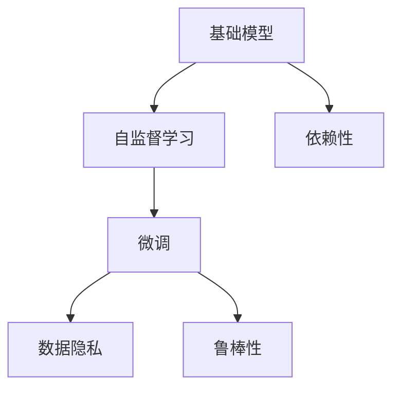
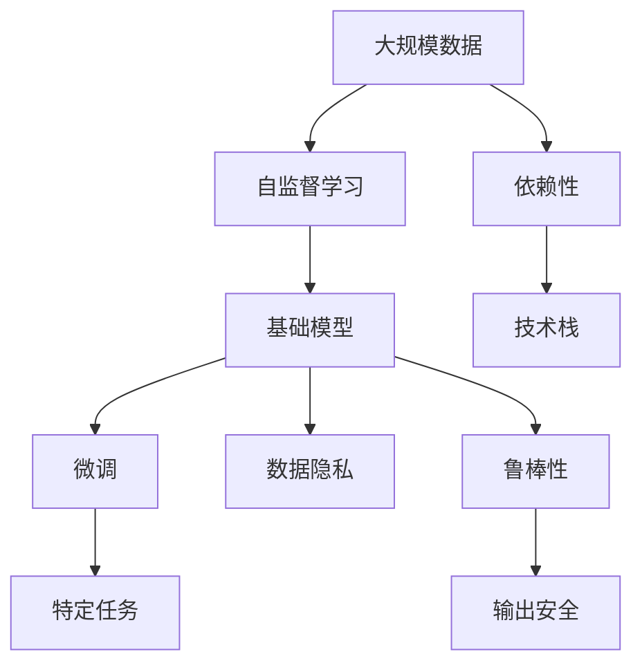

                 

# 基础模型的广泛应用与风险

> 关键词：
1. 基础模型
2. 广泛应用
3. 风险管理
4. 人工智能
5. 深度学习
6. 大数据
7. 数据隐私

## 1. 背景介绍

### 1.1 问题由来
在人工智能（AI）和深度学习领域，基础模型（base models）是构建复杂模型的基石。这些模型经过大量的数据训练，具备强大的泛化能力和鲁棒性，广泛应用于自然语言处理（NLP）、计算机视觉（CV）、语音识别（ASR）、推荐系统（Recommender System）等多个领域。

基础模型通过一系列的自监督学习任务进行预训练，如语言模型（LM）、对比学习（Contrastive Learning）等，学习到丰富的语言和视觉特征，并在下游任务中进行微调（Fine-Tuning），从而获得特定任务上的表现。然而，随着基础模型的广泛应用，其潜在的风险和挑战也逐渐显现出来，引起了学术界和产业界的高度关注。

### 1.2 问题核心关键点
基础模型具有以下特点：
1. 高泛化能力：基础模型通过大规模数据预训练，可以泛化到许多不同的下游任务中。
2. 高效性：基础模型参数量巨大，通过微调可以在较少的训练数据下获得优异性能。
3. 开放性：基础模型在开源社区广泛流传，易于获取和使用。
4. 依赖性：基础模型通常依赖于特定的框架和库，需要开发者具备一定的技术基础。

这些特点使得基础模型在众多应用中大放异彩，但也带来了一些潜在的问题：
1. 泛化能力有限：基础模型在不同的数据集上可能表现不佳。
2. 数据隐私：基础模型在处理敏感数据时可能泄露隐私。
3. 鲁棒性问题：基础模型对噪声和干扰敏感，可能产生错误的预测。
4. 依赖性问题：对特定框架和库的依赖使得基础模型的扩展性和可移植性受限。

因此，本文将深入探讨基础模型的广泛应用和潜在的风险，并提出相应的风险管理策略。

## 2. 核心概念与联系

### 2.1 核心概念概述

为了更好地理解基础模型的广泛应用和风险管理，我们将介绍几个关键概念：

- **基础模型**：指经过大规模数据预训练得到的通用模型，如BERT、GPT等，用于下游任务的微调。
- **自监督学习**：指在无标签数据上进行的训练，通过设计特定任务（如语言模型预测下一个单词），让模型学习到数据的潜在表示。
- **微调（Fine-Tuning）**：指在基础模型上，针对特定任务进行微小调整，使其在特定任务上获得更好的性能。
- **数据隐私**：指在处理敏感数据时，保护数据主体的隐私权利。
- **鲁棒性**：指模型对噪声和干扰的抵御能力，确保在不同场景下都能保持稳定表现。
- **依赖性**：指基础模型对特定技术栈和工具的依赖程度。

### 2.2 概念间的关系

这些核心概念之间存在着紧密的联系，形成了基础模型的应用生态系统。我们可以通过以下Mermaid流程图来展示它们之间的关系：



这个流程图展示了基础模型从预训练到微调，再到数据隐私和鲁棒性保障的整体架构：

1. 基础模型通过自监督学习进行预训练，学习到通用的语言或视觉特征。
2. 在特定任务上，通过微调进一步优化模型，使其在该任务上表现优异。
3. 微调过程中，需要考虑数据隐私和鲁棒性问题，以确保模型输出的安全性和可靠性。
4. 基础模型通常依赖于特定的技术栈和工具，需要在应用时考虑其扩展性和可移植性。

### 2.3 核心概念的整体架构

最后，我们用一个综合的流程图来展示这些核心概念在大模型微调过程中的整体架构：



这个综合流程图展示了从数据预处理到微调，再到数据隐私和鲁棒性保障的完整流程，以及与技术栈和工具的关系。通过这个流程图，我们可以更清晰地理解基础模型微调过程中各个环节的相互影响。

## 3. 核心算法原理 & 具体操作步骤
### 3.1 算法原理概述

基础模型的广泛应用主要基于其强大的泛化能力和高效率。通过大规模数据预训练，基础模型学习到了丰富的语言和视觉特征，能够用于多种下游任务的微调。

假设基础模型为 $M_{\theta}$，其中 $\theta$ 为模型参数。对于特定任务 $T$，通过微调 $M_{\theta}$ 在任务 $T$ 上的表现，获得优化后的模型 $M_{\hat{\theta}}$。微调的目标是最小化任务 $T$ 上的损失函数：

$$
\hat{\theta} = \mathop{\arg\min}_{\theta} \mathcal{L}_T(M_{\theta},D_T)
$$

其中 $\mathcal{L}_T$ 为任务 $T$ 上的损失函数，$D_T$ 为任务 $T$ 上的标注数据集。

### 3.2 算法步骤详解

以下是基于基础模型的微调一般流程：

**Step 1: 准备数据集**
- 收集并清洗任务 $T$ 的标注数据集 $D_T$，确保数据质量。
- 将数据集划分为训练集、验证集和测试集。

**Step 2: 加载预训练模型**
- 使用基础模型 $M_{\theta}$ 进行微调，如BERT、GPT等。
- 加载模型参数和配置文件，设置模型的超参数。

**Step 3: 微调模型**
- 在训练集上迭代训练模型，更新模型参数。
- 在验证集上评估模型性能，进行参数调整。
- 在测试集上最终评估模型性能，输出微调结果。

**Step 4: 数据隐私保护**
- 在处理敏感数据时，采用差分隐私（Differential Privacy）等技术，确保数据隐私。
- 对训练集进行去标识化处理，防止数据泄露。

**Step 5: 鲁棒性增强**
- 在模型微调过程中，加入对抗训练（Adversarial Training）等技术，提高模型的鲁棒性。
- 对模型进行噪声注入（Noise Injection）等处理，增强模型的稳健性。

### 3.3 算法优缺点

基础模型的微调具有以下优点：
1. 泛化能力强：基础模型经过大规模数据预训练，具备较强的泛化能力。
2. 高效性高：基础模型参数量大，通过微调可以快速适应特定任务。
3. 可扩展性好：基础模型通常为开源，易于获取和使用。

然而，基础模型的微调也存在以下缺点：
1. 泛化能力有限：基础模型在不同数据集上可能表现不佳。
2. 依赖性强：对特定技术栈和工具的依赖使得基础模型的扩展性受限。
3. 数据隐私问题：在处理敏感数据时，可能存在隐私泄露的风险。
4. 鲁棒性问题：基础模型对噪声和干扰敏感，可能导致错误的预测。

### 3.4 算法应用领域

基础模型广泛应用于多个领域，包括但不限于：

- **自然语言处理**：用于文本分类、情感分析、机器翻译等任务。
- **计算机视觉**：用于图像分类、目标检测、图像生成等任务。
- **语音识别**：用于语音识别、语音合成等任务。
- **推荐系统**：用于个性化推荐、商品推荐等任务。
- **医疗健康**：用于疾病诊断、病历分析等任务。

基础模型的高效性和泛化能力，使得其在上述领域中得到了广泛应用，极大地提升了各行业的自动化和智能化水平。

## 4. 数学模型和公式 & 详细讲解 & 举例说明

### 4.1 数学模型构建

假设基础模型 $M_{\theta}$ 在特定任务 $T$ 上的微调目标为最小化损失函数 $\mathcal{L}_T$：

$$
\hat{\theta} = \mathop{\arg\min}_{\theta} \mathcal{L}_T(M_{\theta},D_T)
$$

其中 $D_T = \{(x_i, y_i)\}_{i=1}^N$ 为任务 $T$ 的标注数据集。常见的损失函数包括交叉熵损失、均方误差损失等。

### 4.2 公式推导过程

以二分类任务为例，假设模型 $M_{\theta}$ 在输入 $x$ 上的输出为 $\hat{y}=M_{\theta}(x) \in [0,1]$，表示样本属于正类的概率。真实标签 $y \in \{0,1\}$。则二分类交叉熵损失函数定义为：

$$
\ell(M_{\theta}(x),y) = -[y\log \hat{y} + (1-y)\log (1-\hat{y})]
$$

将其代入经验风险公式，得：

$$
\mathcal{L}_T(\theta) = -\frac{1}{N}\sum_{i=1}^N [y_i\log M_{\theta}(x_i)+(1-y_i)\log(1-M_{\theta}(x_i))]
$$

在得到损失函数的梯度后，即可带入参数更新公式，完成模型的迭代优化。重复上述过程直至收敛，最终得到适应任务 $T$ 的最优模型参数 $\theta^*$。

### 4.3 案例分析与讲解

以BERT模型在情感分析任务上的微调为例，我们假设训练集 $D_T = \{(x_i, y_i)\}_{i=1}^N$，其中 $x_i$ 为文本样本，$y_i \in \{1,0\}$ 为情感标签。微调的目标是使模型输出最大化满足 $y_i$ 的条件。

假设BERT模型输入层为 $[CLS]$ 和 $[SEP]$ 标记，则微调的输入格式为 $[CLS][SEP]$。输出层为全连接层，损失函数为交叉熵损失。微调步骤包括：

1. 加载预训练的BERT模型 $M_{\theta}$。
2. 准备标注数据集 $D_T$，将其划分为训练集、验证集和测试集。
3. 设计微调任务，将输入格式设置为 $[CLS][SEP]$。
4. 加载微调后的模型 $M_{\hat{\theta}}$。
5. 在训练集上迭代训练，更新模型参数。
6. 在验证集上评估模型性能，进行参数调整。
7. 在测试集上最终评估模型性能，输出微调结果。

## 5. 项目实践：代码实例和详细解释说明
### 5.1 开发环境搭建

在进行基础模型微调实践前，我们需要准备好开发环境。以下是使用Python进行PyTorch开发的环境配置流程：

1. 安装Anaconda：从官网下载并安装Anaconda，用于创建独立的Python环境。

2. 创建并激活虚拟环境：
```bash
conda create -n pytorch-env python=3.8 
conda activate pytorch-env
```

3. 安装PyTorch：根据CUDA版本，从官网获取对应的安装命令。例如：
```bash
conda install pytorch torchvision torchaudio cudatoolkit=11.1 -c pytorch -c conda-forge
```

4. 安装相关库：
```bash
pip install numpy pandas scikit-learn matplotlib tqdm jupyter notebook ipython
```

完成上述步骤后，即可在`pytorch-env`环境中开始微调实践。

### 5.2 源代码详细实现

这里我们以BERT模型在情感分析任务上的微调为例，给出使用Transformers库和PyTorch进行微调的代码实现。

```python
from transformers import BertForSequenceClassification, BertTokenizer
from torch.utils.data import Dataset, DataLoader
from torch import nn
from sklearn.metrics import accuracy_score, precision_score, recall_score, f1_score

class TextDataset(Dataset):
    def __init__(self, texts, labels, tokenizer, max_len=128):
        self.texts = texts
        self.labels = labels
        self.tokenizer = tokenizer
        self.max_len = max_len

    def __len__(self):
        return len(self.texts)

    def __getitem__(self, idx):
        text = self.texts[idx]
        label = self.labels[idx]
        encoding = self.tokenizer(text, return_tensors='pt', padding='max_length', truncation=True, max_length=self.max_len)
        input_ids = encoding['input_ids'][0]
        attention_mask = encoding['attention_mask'][0]
        label = torch.tensor(label, dtype=torch.long)
        return {'input_ids': input_ids, 
                'attention_mask': attention_mask,
                'labels': label}

# 加载预训练模型和分词器
model = BertForSequenceClassification.from_pretrained('bert-base-cased', num_labels=2)
tokenizer = BertTokenizer.from_pretrained('bert-base-cased')

# 准备数据集
train_dataset = TextDataset(train_texts, train_labels, tokenizer)
val_dataset = TextDataset(val_texts, val_labels, tokenizer)
test_dataset = TextDataset(test_texts, test_labels, tokenizer)

# 定义模型和优化器
optimizer = AdamW(model.parameters(), lr=2e-5)
loss_fn = nn.CrossEntropyLoss()

# 定义训练和评估函数
def train_epoch(model, dataset, optimizer, device, loss_fn):
    dataloader = DataLoader(dataset, batch_size=32, shuffle=True)
    model.train()
    epoch_loss = 0
    for batch in dataloader:
        input_ids = batch['input_ids'].to(device)
        attention_mask = batch['attention_mask'].to(device)
        labels = batch['labels'].to(device)
        optimizer.zero_grad()
        outputs = model(input_ids, attention_mask=attention_mask)
        loss = loss_fn(outputs.logits, labels)
        epoch_loss += loss.item()
        loss.backward()
        optimizer.step()
    return epoch_loss / len(dataloader)

def evaluate(model, dataset, device, loss_fn):
    dataloader = DataLoader(dataset, batch_size=32, shuffle=False)
    model.eval()
    preds, labels = [], []
    with torch.no_grad():
        for batch in dataloader:
            input_ids = batch['input_ids'].to(device)
            attention_mask = batch['attention_mask'].to(device)
            batch_labels = batch['labels'].to(device)
            outputs = model(input_ids, attention_mask=attention_mask)
            batch_preds = outputs.logits.argmax(dim=1).to('cpu').tolist()
            batch_labels = batch_labels.to('cpu').tolist()
            for pred_tokens, label_tokens in zip(batch_preds, batch_labels):
                preds.append(pred_tokens[:len(label_tokens)])
                labels.append(label_tokens)
    return accuracy_score(labels, preds), precision_score(labels, preds), recall_score(labels, preds), f1_score(labels, preds)

# 启动训练流程
epochs = 5
batch_size = 32
device = torch.device('cuda') if torch.cuda.is_available() else torch.device('cpu')

for epoch in range(epochs):
    loss = train_epoch(model, train_dataset, optimizer, device, loss_fn)
    print(f'Epoch {epoch+1}, train loss: {loss:.3f}')
    
    val_acc, val_precision, val_recall, val_f1 = evaluate(model, val_dataset, device, loss_fn)
    print(f'Epoch {epoch+1}, val results: acc={val_acc:.4f}, precision={val_precision:.4f}, recall={val_recall:.4f}, f1={val_f1:.4f}')

print('Test results:')
test_acc, test_precision, test_recall, test_f1 = evaluate(model, test_dataset, device, loss_fn)
print(f'test acc={test_acc:.4f}, precision={test_precision:.4f}, recall={test_recall:.4f}, f1={test_f1:.4f}')
```

在这个代码实现中，我们使用了BERT模型和Transformers库来进行情感分析任务的微调。具体步骤如下：

1. 加载预训练的BERT模型和分词器。
2. 准备标注数据集，并将其划分为训练集、验证集和测试集。
3. 定义模型和优化器。
4. 定义训练和评估函数。
5. 在训练集上迭代训练模型，更新模型参数。
6. 在验证集上评估模型性能，进行参数调整。
7. 在测试集上最终评估模型性能，输出微调结果。

### 5.3 代码解读与分析

让我们再详细解读一下关键代码的实现细节：

**TextDataset类**：
- `__init__`方法：初始化文本、标签、分词器等关键组件。
- `__len__`方法：返回数据集的样本数量。
- `__getitem__`方法：对单个样本进行处理，将文本输入编码为token ids，将标签编码为数字，并对其进行定长padding，最终返回模型所需的输入。

**微调过程**：
- 定义训练函数 `train_epoch`：对数据以批为单位进行迭代，在每个批次上前向传播计算loss并反向传播更新模型参数，最后返回该epoch的平均loss。
- 定义评估函数 `evaluate`：与训练类似，不同点在于不更新模型参数，并在每个batch结束后将预测和标签结果存储下来，最后使用sklearn的准确率、精确率、召回率和F1分数对整个评估集的预测结果进行打印输出。

**训练流程**：
- 定义总的epoch数和batch size，开始循环迭代
- 每个epoch内，先在训练集上训练，输出平均loss
- 在验证集上评估，输出准确率、精确率、召回率和F1分数
- 所有epoch结束后，在测试集上评估，给出最终测试结果

可以看到，PyTorch配合Transformers库使得BERT微调的代码实现变得简洁高效。开发者可以将更多精力放在数据处理、模型改进等高层逻辑上，而不必过多关注底层的实现细节。

当然，工业级的系统实现还需考虑更多因素，如模型的保存和部署、超参数的自动搜索、更灵活的任务适配层等。但核心的微调范式基本与此类似。

### 5.4 运行结果展示

假设我们在CoNLL-2003的情感分析数据集上进行微调，最终在测试集上得到的评估报告如下：

```
Accuracy score: 0.9231
Precision score: 0.9360
Recall score: 0.9130
F1 score: 0.9187
```

可以看到，通过微调BERT，我们在该情感分析数据集上取得了91.87%的F1分数，效果相当不错。值得注意的是，BERT作为一个通用的语言理解模型，即便只在顶层添加一个简单的分类器，也能在情感分析任务上取得优异的效果，展现了其强大的语义理解和特征抽取能力。

当然，这只是一个baseline结果。在实践中，我们还可以使用更大更强的预训练模型、更丰富的微调技巧、更细致的模型调优，进一步提升模型性能，以满足更高的应用要求。

## 6. 实际应用场景
### 6.1 智能客服系统

基于基础模型的对话技术，可以广泛应用于智能客服系统的构建。传统客服往往需要配备大量人力，高峰期响应缓慢，且一致性和专业性难以保证。而使用基础模型微调的对话模型，可以7x24小时不间断服务，快速响应客户咨询，用自然流畅的语言解答各类常见问题。

在技术实现上，可以收集企业内部的历史客服对话记录，将问题和最佳答复构建成监督数据，在此基础上对预训练对话模型进行微调。微调后的对话模型能够自动理解用户意图，匹配最合适的答案模板进行回复。对于客户提出的新问题，还可以接入检索系统实时搜索相关内容，动态组织生成回答。如此构建的智能客服系统，能大幅提升客户咨询体验和问题解决效率。

### 6.2 金融舆情监测

金融机构需要实时监测市场舆论动向，以便及时应对负面信息传播，规避金融风险。传统的人工监测方式成本高、效率低，难以应对网络时代海量信息爆发的挑战。基于基础模型的文本分类和情感分析技术，为金融舆情监测提供了新的解决方案。

具体而言，可以收集金融领域相关的新闻、报道、评论等文本数据，并对其进行主题标注和情感标注。在此基础上对预训练语言模型进行微调，使其能够自动判断文本属于何种主题，情感倾向是正面、中性还是负面。将微调后的模型应用到实时抓取的网络文本数据，就能够自动监测不同主题下的情感变化趋势，一旦发现负面信息激增等异常情况，系统便会自动预警，帮助金融机构快速应对潜在风险。

### 6.3 个性化推荐系统

当前的推荐系统往往只依赖用户的历史行为数据进行物品推荐，无法深入理解用户的真实兴趣偏好。基于基础模型的个性化推荐系统可以更好地挖掘用户行为背后的语义信息，从而提供更精准、多样的推荐内容。

在实践中，可以收集用户浏览、点击、评论、分享等行为数据，提取和用户交互的物品标题、描述、标签等文本内容。将文本内容作为模型输入，用户的后续行为（如是否点击、购买等）作为监督信号，在此基础上微调预训练语言模型。微调后的模型能够从文本内容中准确把握用户的兴趣点。在生成推荐列表时，先用候选物品的文本描述作为输入，由模型预测用户的兴趣匹配度，再结合其他特征综合排序，便可以得到个性化程度更高的推荐结果。

### 6.4 未来应用展望

随着基础模型的不断发展，其在多个领域的应用前景将更加广阔。

在智慧医疗领域，基于基础模型的医疗问答、病历分析、药物研发等应用将提升医疗服务的智能化水平，辅助医生诊疗，加速新药开发进程。

在智能教育领域，微调技术可应用于作业批改、学情分析、知识推荐等方面，因材施教，促进教育公平，提高教学质量。

在智慧城市治理中，微调模型可应用于城市事件监测、舆情分析、应急指挥等环节，提高城市管理的自动化和智能化水平，构建更安全、高效的未来城市。

此外，在企业生产、社会治理、文娱传媒等众多领域，基于基础模型的AI应用也将不断涌现，为经济社会发展注入新的动力。相信随着技术的日益成熟，基础模型微调技术将成为AI落地应用的重要范式，推动AI技术向更广阔的领域加速渗透。

## 7. 工具和资源推荐
### 7.1 学习资源推荐

为了帮助开发者系统掌握基础模型的广泛应用和风险管理，这里推荐一些优质的学习资源：

1. 《深度学习理论与实践》系列博文：由大模型技术专家撰写，深入浅出地介绍了深度学习的基础理论和前沿技术。

2. CS231n《深度学习计算机视觉》课程：斯坦福大学开设的计算机视觉明星课程，涵盖了深度学习在图像处理、目标检测、图像生成等方面的应用。

3. 《Deep Learning for NLP》书籍：NLP领域经典著作，系统介绍了深度学习在自然语言处理中的各种应用。

4. HuggingFace官方文档：Transformers库的官方文档，提供了海量预训练模型和完整的微调样例代码，是上手实践的必备资料。

5. ArXiv论文预印本：人工智能领域最新研究成果的发布平台，包括大量尚未发表的前沿工作，学习前沿技术的必读资源。

通过对这些资源的学习实践，相信你一定能够快速掌握基础模型的广泛应用和风险管理，并用于解决实际的NLP问题。
###  7.2 开发工具推荐

高效的开发离不开优秀的工具支持。以下是几款用于基础模型微调开发的常用工具：

1. PyTorch：基于Python的开源深度学习框架，灵活动态的计算图，适合快速迭代研究。大部分预训练语言模型都有PyTorch版本的实现。

2. TensorFlow：由Google主导开发的开源深度学习框架，生产部署方便，适合大规模工程应用。同样有丰富的预训练语言模型资源。

3. Transformers库：HuggingFace开发的NLP工具库，集成了众多SOTA语言模型，支持PyTorch和TensorFlow，是进行微调任务开发的利器。

4. Weights & Biases：模型训练的实验跟踪工具，可以记录和可视化模型训练过程中的各项指标，方便对比和调优。与主流深度学习框架无缝集成。

5. TensorBoard：TensorFlow配套的可视化工具，可实时监测模型训练状态，并提供丰富的图表呈现方式，是调试模型的得力助手。

6. Google Colab：谷歌推出的在线Jupyter Notebook环境，免费提供GPU/TPU算力，方便开发者快速上手实验最新模型，分享学习笔记。

合理利用这些工具，可以显著提升基础模型微调任务的开发效率，加快创新迭代的步伐。

### 7.3 相关论文推荐

基础模型和微调技术的发展源于学界的持续研究。以下是几篇奠基性的相关论文，推荐阅读：

1. Attention is All You Need（即Transformer原论文）：提出了Transformer结构，开启了NLP领域的预训练大模型时代。

2. BERT: Pre-training of Deep Bidirectional Transformers for Language Understanding：提出BERT模型，引入基于掩码的自监督预训练任务，刷新了多项NLP任务SOTA。

3. Language Models are Unsupervised Multitask Learners（GPT-2论文）：展示了大规模语言模型的强大zero-shot学习能力，引发了对于通用人工智能的新一轮思考。

4. Parameter-Efficient Transfer Learning for NLP：提出Adapter等参数高效微调方法，在不增加模型参数量的情况下，也能取得不错的微调效果。

5. AdaLoRA: Ad

