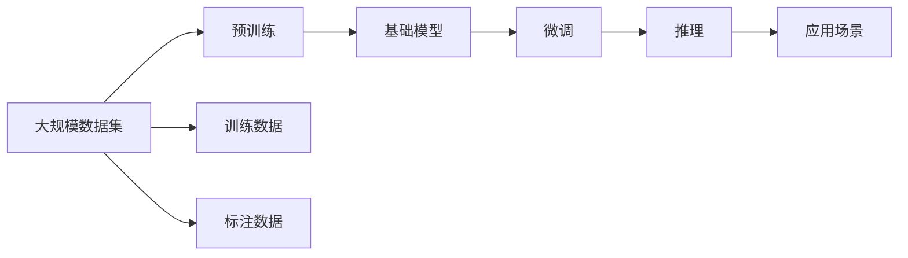

                 

# 基础模型的技术能力与应用

## 1. 背景介绍

### 1.1 问题由来

随着人工智能技术的快速发展，基础模型在各领域的广泛应用已经成为一个不可忽视的趋势。无论是自然语言处理（NLP）、计算机视觉（CV）还是语音识别等领域，基础模型都以其强大的技术能力，为应用场景提供了显著的性能提升。本文将详细探讨基础模型的核心概念、算法原理、具体实现及应用实践，旨在为读者提供全面而深入的技术理解和应用指南。

### 1.2 问题核心关键点

基础模型的核心在于其技术能力，主要包括但不限于深度学习架构、模型训练、推理效率、应用领域等方面的技术和能力。本文将从这些关键点出发，深入分析基础模型在实际应用中的表现和优势，并探讨其未来发展方向和面临的挑战。

### 1.3 问题研究意义

研究基础模型的技术能力，对于理解其工作原理、优化其性能、提升应用效果，以及推动人工智能技术的进一步发展，具有重要意义：

1. 提升应用性能：基础模型通常具备强大的学习能力，通过合理的微调和训练，可以显著提升应用场景的性能，如处理速度、准确度等。
2. 减少开发成本：使用基础模型可以大大降低开发难度和成本，缩短应用开发周期。
3. 促进技术创新：基础模型技术的演进，往往伴随着新技术和新算法的出现，为人工智能领域带来新的突破。
4. 扩展应用范围：基础模型可以应用于多个领域，推动各行业的技术升级和转型。
5. 推动产业化进程：基础模型的应用，有助于加速人工智能技术的落地和商业化，形成更加成熟的应用生态。

## 2. 核心概念与联系

### 2.1 核心概念概述

在深入分析基础模型技术能力之前，我们先简要概述其核心概念：

- **基础模型（Foundation Models）**：指的是在特定领域或任务中，基于大规模数据集进行预训练，并在特定任务上进行微调，以获得最优性能的模型。
- **预训练（Pre-training）**：指在大规模数据集上训练模型，使其学习到广泛的语义或视觉表示，为后续微调提供良好的初始化参数。
- **微调（Fine-tuning）**：指在预训练基础上，针对特定任务进行有监督训练，调整模型的部分参数，以适应特定领域的应用需求。
- **推理（Inference）**：指模型在给定输入下进行预测或生成输出的过程，是基础模型应用的核心环节。
- **优化器（Optimizer）**：指用于模型训练的算法，如Adam、SGD等，用于更新模型参数，最小化损失函数。

### 2.2 核心概念间的关系

基础模型的核心概念间存在着密切的联系，形成了其应用和技术能力的基本框架。以下通过Mermaid流程图展示这些概念之间的关系：



这个流程图展示了基础模型从数据预处理、预训练、微调到推理的完整流程，以及其在实际应用场景中的作用。

## 3. 核心算法原理 & 具体操作步骤

### 3.1 算法原理概述

基础模型的核心算法原理主要基于深度学习和迁移学习。其工作流程通常包括预训练和微调两个阶段：

1. **预训练**：使用大规模无标签数据集对模型进行训练，使其学习到通用的语义或视觉表示。
2. **微调**：在预训练基础上，使用特定任务的数据集对模型进行有监督训练，使其适应特定应用需求。

### 3.2 算法步骤详解

以下是基础模型预训练和微调的基本步骤：

#### 3.2.1 预训练步骤
1. **数据准备**：收集大规模无标签数据集，如文本语料库、图像数据集等。
2. **模型初始化**：选择合适的深度学习模型架构，如CNN、RNN、Transformer等，进行模型初始化。
3. **损失函数设计**：选择合适的损失函数，如交叉熵、均方误差等，用于衡量模型预测与真实标签之间的差异。
4. **训练过程**：使用优化器（如Adam、SGD）对模型进行训练，最小化损失函数，更新模型参数。
5. **模型保存**：将训练好的模型保存，供后续微调使用。

#### 3.2.2 微调步骤
1. **数据准备**：收集特定任务的数据集，如标注文本、图像等。
2. **模型加载**：加载预训练模型，作为微调的起点。
3. **任务适配**：设计适合特定任务的任务适配层，如分类头、回归头等。
4. **损失函数设计**：根据任务需求，选择相应的损失函数，如分类损失、回归损失等。
5. **训练过程**：使用优化器对模型进行训练，最小化损失函数，更新模型参数。
6. **模型评估**：在验证集或测试集上评估微调后的模型性能，确保其满足任务需求。

### 3.3 算法优缺点

基础模型的优点包括：

- **广泛适用性**：适用于多种应用场景，如NLP、CV等。
- **高效学习**：通过预训练学习到广泛的语义或视觉表示，微调时只需要调整部分参数，学习效率高。
- **性能提升显著**：在微调后，模型性能往往有显著提升。

然而，基础模型也存在一些缺点：

- **对标注数据依赖高**：微调需要依赖标注数据，标注成本较高。
- **模型复杂度高**：大规模模型参数量巨大，训练和推理资源需求高。
- **可解释性不足**：基础模型往往是一个黑盒模型，缺乏可解释性。
- **泛化能力有限**：当数据分布差异较大时，模型的泛化能力可能受限。

### 3.4 算法应用领域

基础模型在多个领域都有广泛应用：

- **自然语言处理（NLP）**：如文本分类、命名实体识别、机器翻译等。
- **计算机视觉（CV）**：如图像分类、目标检测、图像生成等。
- **语音识别**：如自动语音识别、语音情感分析等。
- **推荐系统**：如基于用户行为推荐、基于物品属性推荐等。
- **医疗健康**：如疾病预测、医学影像分析等。
- **金融领域**：如信用评分、风险评估等。

## 4. 数学模型和公式 & 详细讲解 & 举例说明

### 4.1 数学模型构建

基础模型通常使用神经网络进行建模，以下以NLP中的Transformer模型为例，简要介绍其数学模型构建过程。

假设输入序列为$x=(x_1, x_2, ..., x_n)$，输出序列为$y=(y_1, y_2, ..., y_n)$，则基础模型的目标是最小化预测输出$y$与真实标签$y^*$之间的交叉熵损失：

$$
\mathcal{L} = -\frac{1}{N} \sum_{i=1}^N \sum_{j=1}^N y_j \log \hat{y}_j
$$

其中，$y_j$表示第$j$个输出序列的标签，$\hat{y}_j$表示模型对第$j$个输出序列的预测。

### 4.2 公式推导过程

以下以一个简单的分类任务为例，推导基础模型的梯度更新公式。

设输入序列为$x=(x_1, x_2, ..., x_n)$，输出序列为$y=(y_1, y_2, ..., y_n)$，模型参数为$\theta$，损失函数为$\mathcal{L}$，则基础模型的目标是最小化预测输出$y$与真实标签$y^*$之间的交叉熵损失：

$$
\mathcal{L} = -\frac{1}{N} \sum_{i=1}^N \sum_{j=1}^N y_j \log \hat{y}_j
$$

使用梯度下降法对模型进行训练，更新参数$\theta$的公式为：

$$
\theta \leftarrow \theta - \eta \nabla_{\theta} \mathcal{L}
$$

其中，$\eta$为学习率，$\nabla_{\theta} \mathcal{L}$为损失函数对模型参数$\theta$的梯度，可以通过反向传播算法高效计算。

### 4.3 案例分析与讲解

以Transformer模型为例，其核心结构包括编码器和解码器，各层之间通过注意力机制（Attention）进行信息交互。以下简要介绍Transformer的架构和注意力机制。

Transformer模型由多个自注意力层和前馈神经网络层组成，每个层包含多头注意力机制。设输入序列为$x=(x_1, x_2, ..., x_n)$，模型参数为$\theta$，则其注意力机制可以表示为：

$$
Q = xW_Q, K = xW_K, V = xW_V
$$

其中，$W_Q, W_K, W_V$为可学习的线性变换矩阵，$Q, K, V$分别为查询向量、键向量和值向量。

注意力权重计算公式为：

$$
A = \frac{e^{QK^T}}{\sum_{i=1}^n e^{QK^T}}
$$

其中，$e^{QK^T}$表示查询向量和键向量之间的点积，经过softmax归一化后得到注意力权重$A$。

最终输出向量为：

$$
y = V \cdot A
$$

其中，$y$表示输出序列，$V$为值向量矩阵。

## 5. 项目实践：代码实例和详细解释说明

### 5.1 开发环境搭建

为了进行基础模型的开发，首先需要配置好开发环境。以下以PyTorch为例，简要介绍开发环境的搭建步骤：

1. **安装Python**：确保系统中已安装Python 3.6以上版本。
2. **安装Anaconda**：下载并安装Anaconda，创建虚拟环境。
3. **安装PyTorch**：使用以下命令安装PyTorch：
   ```bash
   conda install pytorch torchvision torchaudio cudatoolkit=11.1 -c pytorch -c conda-forge
   ```
4. **安装相关库**：安装必要的库，如NumPy、Pandas、Scikit-Learn等。

### 5.2 源代码详细实现

以下以使用PyTorch实现NLP中的文本分类为例，展示基础模型的实现过程。

首先，定义数据集：

```python
import torch
import torch.nn as nn
import torch.optim as optim
from torch.utils.data import DataLoader
from sklearn.datasets import fetch_20newsgroups

# 加载数据集
train_data = fetch_20newsgroups(subset='train', shuffle=True, random_state=42)
test_data = fetch_20newsgroups(subset='test', shuffle=False, random_state=42)

# 定义文本预处理函数
def preprocess(text):
    return text.lower().split()

# 定义模型类
class TransformerModel(nn.Module):
    def __init__(self, d_model, d_ff, N_head, d_out):
        super(TransformerModel, self).__init__()
        self.encoder = nn.TransformerEncoderLayer(d_model, N_head, d_ff)
        self.decoder = nn.Linear(d_model, d_out)
        
    def forward(self, x):
        x = self.encoder(x)
        x = self.decoder(x)
        return x
```

然后，定义模型训练过程：

```python
# 定义训练函数
def train(model, train_loader, optimizer, criterion, num_epochs):
    model.train()
    total_loss = 0
    for epoch in range(num_epochs):
        for batch in train_loader:
            inputs, labels = batch
            optimizer.zero_grad()
            outputs = model(inputs)
            loss = criterion(outputs, labels)
            loss.backward()
            optimizer.step()
            total_loss += loss.item()
    return total_loss / len(train_loader)

# 加载模型和数据
model = TransformerModel(256, 512, 8, 10)
criterion = nn.CrossEntropyLoss()
optimizer = optim.Adam(model.parameters(), lr=1e-4)

train_loader = DataLoader(train_data.data, batch_size=64, shuffle=True)
test_loader = DataLoader(test_data.data, batch_size=64, shuffle=False)

# 训练模型
num_epochs = 10
train_loss = train(model, train_loader, optimizer, criterion, num_epochs)
```

最后，评估模型性能：

```python
# 加载测试数据
test_loader = DataLoader(test_data.data, batch_size=64, shuffle=False)

# 评估模型
model.eval()
total_correct = 0
total_samples = 0
with torch.no_grad():
    for batch in test_loader:
        inputs, labels = batch
        outputs = model(inputs)
        _, predicted = torch.max(outputs.data, 1)
        total_correct += (predicted == labels).sum().item()
        total_samples += labels.size(0)
accuracy = total_correct / total_samples
print("Accuracy: {:.2f}%".format(accuracy * 100))
```

以上代码展示了从数据准备、模型定义、模型训练到模型评估的全过程。

### 5.3 代码解读与分析

在实际应用中，需要对模型进行更加细致的调优和优化。以下是一些关键点和优化策略：

- **学习率**：选择合适的学习率，一般使用学习率衰减策略，逐步减小学习率，避免过拟合。
- **数据增强**：使用数据增强技术，如文本回译、数据扩充等，丰富训练数据。
- **正则化**：使用L2正则、Dropout等技术，防止过拟合。
- **模型压缩**：使用模型压缩技术，如剪枝、量化等，减少模型参数量，提高推理效率。
- **超参数调优**：使用网格搜索、贝叶斯优化等方法，寻找最优超参数组合。

## 6. 实际应用场景

### 6.1 智能客服系统

智能客服系统通过基础模型，可以实现24小时不间断服务，快速响应客户咨询，提供高质量的自动化客服体验。具体应用场景包括：

- **对话生成**：利用基础模型，生成自然流畅的对话内容，解决客户问题。
- **情感分析**：通过分析客户对话内容，识别客户情绪，提供个性化的服务。
- **意图识别**：识别客户咨询意图，引导客户自助解决问题。

### 6.2 金融舆情监测

金融舆情监测系统通过基础模型，可以实时监测市场舆情，预测市场趋势，帮助金融机构及时应对风险。具体应用场景包括：

- **情感分析**：分析新闻、评论等文本内容，识别市场情绪，预测市场走势。
- **实体识别**：识别市场中的关键实体，如公司、产品等，进行风险预警。
- **舆情预测**：预测市场舆情变化，提前采取应对措施。

### 6.3 个性化推荐系统

个性化推荐系统通过基础模型，可以根据用户的历史行为数据，推荐个性化的物品，提高用户满意度。具体应用场景包括：

- **用户画像**：通过基础模型，生成用户画像，了解用户兴趣偏好。
- **物品推荐**：根据用户画像，推荐个性化物品，提高点击率和转化率。
- **实时调整**：根据用户反馈，实时调整推荐策略，优化推荐效果。

### 6.4 未来应用展望

未来，基础模型在各领域的应用将更加广泛和深入。以下是一些未来应用展望：

- **医疗领域**：基础模型将应用于疾病预测、医学影像分析等，提升医疗服务的智能化水平。
- **教育领域**：基础模型将应用于智能辅导、自动评卷等，提升教育质量和效率。
- **智慧城市**：基础模型将应用于城市事件监测、交通管理等，提升城市管理水平。
- **智能家居**：基础模型将应用于智能语音助手、智能安防等，提升家庭智能化水平。

## 7. 工具和资源推荐

### 7.1 学习资源推荐

为了全面掌握基础模型的技术能力，以下是一些推荐的学习资源：

- **《深度学习》课程**：斯坦福大学提供的深度学习课程，涵盖基础知识和最新进展。
- **《自然语言处理综述》论文**：综述自然语言处理领域的技术和应用，提供全面的知识体系。
- **《Transformer详解》书籍**：详细讲解Transformer模型的原理和应用，是理解基础模型的必读书籍。
- **arXiv预印本**：关注最新研究成果，了解前沿技术和应用方向。

### 7.2 开发工具推荐

为了提高开发效率，以下是一些推荐的开发工具：

- **PyTorch**：深度学习框架，支持动态计算图，灵活便捷。
- **TensorFlow**：深度学习框架，适合大规模工程应用。
- **HuggingFace Transformers库**：提供多种预训练模型和微调样例，方便开发者快速上手。
- **TensorBoard**：可视化工具，实时监控模型训练状态，帮助调试模型。

### 7.3 相关论文推荐

为了深入理解基础模型的技术能力，以下是一些推荐的论文：

- **《Attention is All You Need》**：介绍Transformer模型，奠定预训练基础模型的基础。
- **《BERT: Pre-training of Deep Bidirectional Transformers for Language Understanding》**：提出BERT模型，开创大规模预训练范式。
- **《Large-Scale Image Recognition from Scratch》**：介绍基于大规模无标签数据集进行预训练的方法，推动视觉基础模型的发展。
- **《Parameter-Efficient Transfer Learning for NLP》**：提出参数高效微调方法，优化模型性能和推理效率。

## 8. 总结：未来发展趋势与挑战

### 8.1 研究成果总结

本文详细介绍了基础模型的技术能力和应用实践，涵盖预训练、微调、推理等关键环节，并分析了其优缺点和应用领域。通过对基础模型的深入探讨，读者可以全面了解其核心技术和应用场景，为实际开发和应用奠定坚实基础。

### 8.2 未来发展趋势

未来，基础模型将朝着以下方向发展：

- **模型规模增大**：预训练模型参数量将继续增加，推动更大规模模型的出现。
- **模型多样性增加**：多种模型架构和技术将不断涌现，丰富基础模型的应用场景。
- **模型效率提升**：模型压缩、量化等技术将不断提高基础模型的推理效率。
- **模型可解释性增强**：基于可解释性模型的研究将不断深入，提升基础模型的透明度和可理解性。
- **模型应用广泛**：基础模型将应用于更多领域，推动各行业的数字化转型。

### 8.3 面临的挑战

尽管基础模型在多个领域展现了强大的技术能力，但仍面临以下挑战：

- **标注成本高**：标注数据成本较高，限制了基础模型的广泛应用。
- **模型复杂度高**：大规模模型的复杂度较高，训练和推理资源需求大。
- **模型泛化能力有限**：当数据分布差异较大时，模型的泛化能力可能受限。
- **可解释性不足**：基础模型往往是一个黑盒模型，缺乏可解释性。
- **安全性问题**：基础模型可能引入有害信息和偏见，带来安全隐患。

### 8.4 研究展望

为了克服上述挑战，未来需要在以下方面进行进一步研究：

- **无监督和半监督学习**：探索无标注数据的利用方式，降低标注成本。
- **模型压缩和量化**：优化模型结构，提高推理效率和资源利用率。
- **可解释性增强**：提高模型的透明度和可理解性，增强用户的信任感。
- **模型安全性保障**：引入伦理导向的评估指标，确保模型的安全性。

本文从基础模型的核心概念、算法原理、实际应用到未来展望，全面探讨了其技术能力和应用实践，希望能为读者提供有价值的参考和指导。面对未来，基础模型必将在更多领域展现其强大的技术能力，推动人工智能技术的进一步发展和应用。

