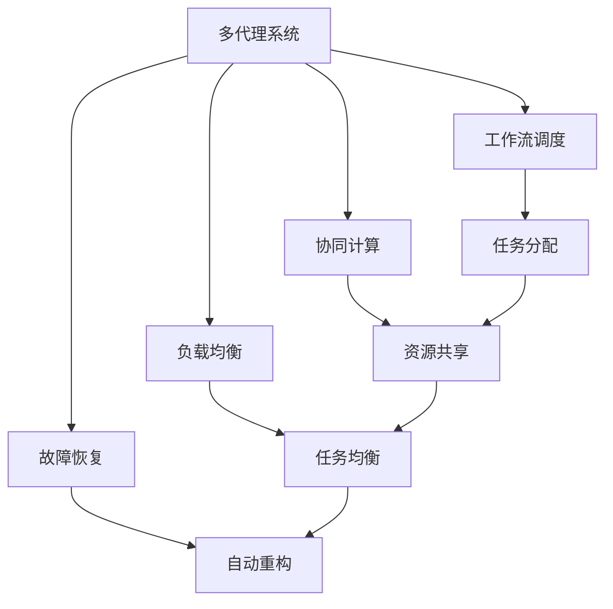
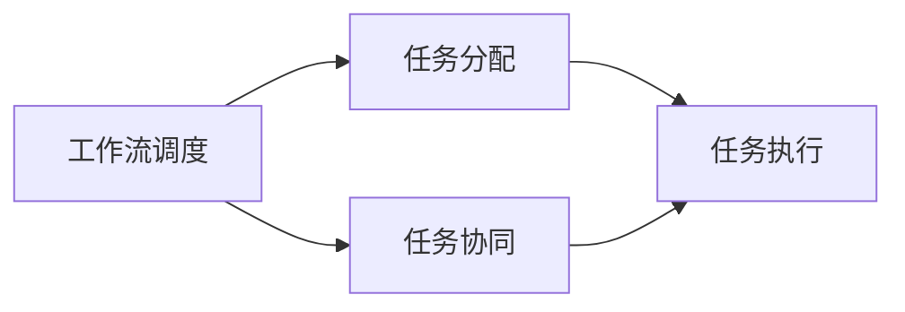
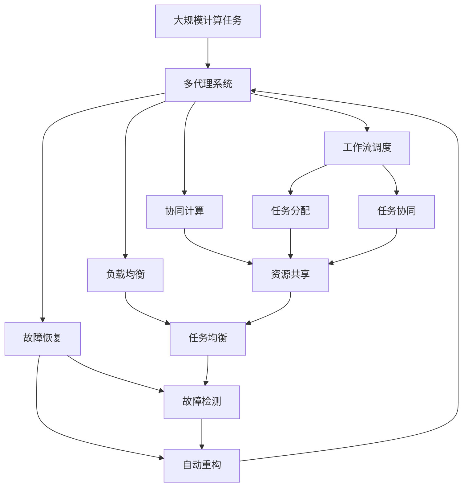

                 

# 多代理系统中的工作流协调与效能优化

> 关键词：多代理系统,工作流协调,效能优化,分布式系统,协同计算

## 1. 背景介绍

### 1.1 问题由来
随着信息技术的高速发展，分布式系统在各行各业得到了广泛的应用。从云计算到边缘计算，从大数据处理到物联网，分布式系统已经成为了现代信息技术的重要支柱。然而，分布式系统在带来高可用性、高扩展性的同时，也面临着复杂的工作流协调与效能优化问题。

传统的分布式系统通常采用集中式的任务调度和资源管理方式，存在单点故障风险高、扩展性差、资源利用率低等缺点。为了解决这些问题，研究人员开始探索基于多代理系统的分布式协同计算方法，即通过多个自治智能体（Agent）之间的相互协作，实现复杂工作流的自动调度和资源管理。

多代理系统具有自组织性、自治性、鲁棒性等优点，能够较好地适应分布式计算环境，成为未来分布式计算的重要方向。然而，多代理系统的工作流协调与效能优化问题仍是一个未完全解决的热点问题，亟需深入研究。

### 1.2 问题核心关键点
多代理系统中的工作流协调与效能优化问题主要涉及以下几个关键点：

1. **工作流调度与协同**：如何在多代理系统中设计高效的工作流调度算法，使得各个代理之间能够协同工作，实现任务分配与资源调度的最优配置。

2. **协同计算与负载均衡**：如何在多代理系统中实现负载均衡，使得系统能够高效利用计算资源，同时避免资源过载和浪费。

3. **故障恢复与容错性**：如何在多代理系统中设计故障恢复机制，确保系统在单点故障或部分代理失效时能够自动恢复和重构，保障系统的稳定性和可靠性。

4. **效能优化与性能调优**：如何通过优化工作流调度算法、负载均衡机制、故障恢复机制等技术手段，提高多代理系统的整体效能和性能，使其能够高效处理大规模计算任务。

## 2. 核心概念与联系

### 2.1 核心概念概述

为了更好地理解多代理系统中的工作流协调与效能优化问题，本节将介绍几个关键概念：

- **多代理系统（Multi-Agent System,MAS）**：由多个自治智能体组成的分布式系统，各个智能体之间通过通信和协作实现复杂任务的管理和执行。

- **工作流（Workflow）**：一系列任务和操作按照特定的顺序和规则执行的流程，通常用于描述业务过程和管理复杂任务。

- **协同计算（Collaborative Computing）**：多个计算节点之间的相互协作，共同完成复杂计算任务，实现资源共享和负载均衡。

- **负载均衡（Load Balancing）**：将计算任务均匀地分配到多个计算节点上，使得每个节点的负载保持在一个合理的范围内。

- **故障恢复（Fault Tolerance）**：在多代理系统中设计故障检测和恢复机制，确保系统在单点故障或部分代理失效时能够自动恢复和重构，保障系统的稳定性和可靠性。

- **效能优化（Performance Optimization）**：通过优化多代理系统中的各个组件，提高系统的整体效能和性能，使其能够高效处理大规模计算任务。

这些核心概念之间的逻辑关系可以通过以下Mermaid流程图来展示：



这个流程图展示了许多核心概念之间的联系：

1. 多代理系统通过工作流调度算法实现任务分配与协同。
2. 协同计算通过资源共享实现任务均衡。
3. 负载均衡通过任务均衡实现资源利用率最大化。
4. 故障恢复通过自动重构保障系统的稳定性和可靠性。
5. 效能优化通过优化各个组件提升系统的整体性能。

这些概念共同构成了多代理系统中的工作流协调与效能优化问题，是其研究的基础和关键。

### 2.2 概念间的关系

这些核心概念之间存在着紧密的联系，形成了多代理系统中的工作流协调与效能优化问题研究的完整生态系统。下面我们通过几个Mermaid流程图来展示这些概念之间的关系。

#### 2.2.1 工作流调度与协同



这个流程图展示了工作流调度和任务协同的关系。工作流调度负责将任务分配给各个代理，并通过任务协同实现代理之间的协作执行。

#### 2.2.2 协同计算与负载均衡


这个流程图展示了协同计算和负载均衡的关系。协同计算通过资源共享实现任务均衡，负载均衡则通过任务均衡实现资源利用率最大化。

#### 2.2.3 故障恢复与容错性


这个流程图展示了故障恢复与容错性的关系。故障恢复通过故障检测和自动重构保障系统的稳定性和可靠性。

#### 2.2.4 效能优化与性能调优


这个流程图展示了效能优化与性能调优的关系。效能优化通过优化各个组件提升系统的整体性能。

### 2.3 核心概念的整体架构

最后，我们用一个综合的流程图来展示这些核心概念在大规模计算任务中的整体架构：



这个综合流程图展示了从大规模计算任务到多代理系统的整体架构，各个核心概念在大规模计算任务中的应用过程。

## 3. 核心算法原理 & 具体操作步骤
### 3.1 算法原理概述

多代理系统中的工作流协调与效能优化问题，本质上是一个分布式任务调度和资源管理的优化问题。其核心思想是：设计高效的工作流调度算法，实现任务和资源的动态分配与协同计算，保障系统在单点故障和部分代理失效时能够自动恢复和重构，同时通过优化各个组件，提高系统的整体效能和性能。

形式化地，假设多代理系统中有 $N$ 个代理 $A_1, A_2, ..., A_N$，系统需要执行 $M$ 个任务 $T_1, T_2, ..., T_M$。每个任务 $T_i$ 的执行时间为 $C_i$，所需资源为 $R_i$。每个代理 $A_j$ 的计算能力为 $C_j$，资源为 $R_j$。任务调度算法 $S$ 和资源调度算法 $R$ 分别用于分配任务和资源。系统的效能优化目标是最小化执行时间 $T$ 和资源消耗 $R_{total}$ 之和：

$$
T = \sum_{i=1}^M C_i
$$

$$
R_{total} = \sum_{j=1}^N R_j
$$

其中，任务调度算法 $S$ 和资源调度算法 $R$ 需要综合考虑代理的计算能力和资源情况，以及任务的执行时间和所需资源，通过动态调整和优化，使得系统能够高效地完成计算任务。

### 3.2 算法步骤详解

多代理系统中的工作流协调与效能优化算法主要包括以下几个关键步骤：

**Step 1: 任务描述与参数化**

- 对大规模计算任务进行任务描述和参数化，明确任务的执行顺序、前后依赖关系、资源需求等关键信息。
- 将任务描述转化为可执行的模型，用于任务调度和资源分配。

**Step 2: 任务调度算法**

- 设计任务调度算法 $S$，用于将任务动态分配到各个代理，实现任务执行的自动调度和协同。
- 常见的任务调度算法包括：优先级调度算法、均衡调度算法、启发式调度算法等。
- 任务调度算法需要考虑任务的优先级、代理的计算能力和资源情况，以及任务之间的依赖关系，实现任务的动态分配和协同执行。

**Step 3: 资源调度算法**

- 设计资源调度算法 $R$，用于动态调整和优化代理的资源分配，实现资源的均衡利用。
- 常见的资源调度算法包括：最小资源调度算法、最大资源利用率算法、基于市场机制的资源调度算法等。
- 资源调度算法需要考虑代理的计算能力和资源情况，以及任务的执行时间和所需资源，实现资源的动态分配和均衡利用。

**Step 4: 故障恢复机制**

- 设计故障恢复机制 $F$，用于检测和恢复单点故障和部分代理失效，保障系统的稳定性和可靠性。
- 常见的故障恢复机制包括：故障检测算法、自动重构算法、负载均衡算法等。
- 故障恢复机制需要实现快速检测和恢复故障，避免系统崩溃和数据丢失。

**Step 5: 效能优化与性能调优**

- 设计效能优化算法 $E$，用于优化各个组件，提升系统的整体效能和性能。
- 常见的效能优化算法包括：动态调参算法、模型压缩算法、分布式计算优化算法等。
- 效能优化算法需要综合考虑任务的执行时间、代理的计算能力和资源情况、故障恢复机制等因素，实现系统的整体优化和性能提升。

### 3.3 算法优缺点

多代理系统中的工作流协调与效能优化算法具有以下优点：

1. **动态调度与协同**：通过动态调度算法实现任务的自动调度和协同执行，提高任务调度的灵活性和效率。
2. **资源均衡利用**：通过资源调度算法实现资源的均衡利用，避免资源过载和浪费，提高系统的资源利用率。
3. **故障恢复能力强**：通过故障恢复机制实现单点故障和部分代理失效的快速检测和恢复，保障系统的稳定性和可靠性。
4. **性能调优**：通过优化各个组件提升系统的整体效能和性能，使得系统能够高效处理大规模计算任务。

同时，该算法也存在以下缺点：

1. **复杂度高**：多代理系统中的任务调度和资源管理问题具有高度的复杂性，设计高效的算法需要较复杂的计算和调度策略。
2. **实时性要求高**：多代理系统需要实时动态调整任务和资源的分配，对算法实时性和计算效率有较高要求。
3. **参数调整复杂**：任务调度和资源调度算法中的参数设置较为复杂，需要根据具体任务和系统特点进行调整。
4. **通信开销大**：多代理系统中的代理之间需要进行频繁的通信和协调，通信开销较大。

尽管存在这些缺点，但该算法仍然是当前解决多代理系统工作流协调与效能优化问题的最佳选择，具有重要的应用前景。

### 3.4 算法应用领域

多代理系统中的工作流协调与效能优化算法已经在多个领域得到了广泛应用，例如：

1. **云计算**：在云计算平台上，通过多代理系统实现任务的自动调度和资源管理，提高计算资源利用率，保障系统的稳定性和可靠性。

2. **物联网**：在物联网设备集群中，通过多代理系统实现任务的自动调度和资源管理，优化网络资源分配，提高系统的效率和可靠性。

3. **分布式计算**：在分布式计算环境中，通过多代理系统实现任务的自动调度和资源管理，提高计算效率，实现大规模计算任务的协同计算。

4. **智能交通**：在智能交通系统中，通过多代理系统实现交通流量的自动调度和资源管理，优化交通流量控制，提高交通系统的效率和安全性。

5. **智能制造**：在智能制造系统中，通过多代理系统实现生产任务的自动调度和资源管理，优化生产流程，提高生产效率和质量。

6. **金融系统**：在金融系统中，通过多代理系统实现交易任务的自动调度和资源管理，优化交易流程，提高系统的稳定性和可靠性。

除了上述这些领域外，多代理系统中的工作流协调与效能优化算法还在更多场景中得到应用，为分布式计算系统带来了新的发展方向。

## 4. 数学模型和公式 & 详细讲解 & 举例说明
### 4.1 数学模型构建

本节将使用数学语言对多代理系统中的工作流协调与效能优化算法进行更加严格的刻画。

记多代理系统中有 $N$ 个代理 $A_1, A_2, ..., A_N$，系统需要执行 $M$ 个任务 $T_1, T_2, ..., T_M$。每个任务 $T_i$ 的执行时间为 $C_i$，所需资源为 $R_i$。每个代理 $A_j$ 的计算能力为 $C_j$，资源为 $R_j$。任务调度算法 $S$ 和资源调度算法 $R$ 分别用于分配任务和资源。系统的效能优化目标是最小化执行时间 $T$ 和资源消耗 $R_{total}$ 之和：

$$
T = \sum_{i=1}^M C_i
$$

$$
R_{total} = \sum_{j=1}^N R_j
$$

其中，任务调度算法 $S$ 和资源调度算法 $R$ 需要综合考虑代理的计算能力和资源情况，以及任务的执行时间和所需资源，通过动态调整和优化，使得系统能够高效地完成计算任务。

### 4.2 公式推导过程

以下我们以最小资源调度算法为例，推导其核心公式的计算过程。

假设每个代理的计算能力和资源情况已知，任务调度算法 $S$ 将任务 $T_i$ 分配到代理 $A_j$，则任务 $T_i$ 的执行时间为 $C_i$，代理 $A_j$ 的资源消耗为 $R_j$。任务调度算法 $S$ 和资源调度算法 $R$ 的数学模型可以表示为：

$$
S = \min_{S_j} \sum_{i=1}^M C_i
$$

$$
R = \min_{R_j} \sum_{j=1}^N R_j
$$

其中，$S_j$ 表示任务 $T_i$ 分配到代理 $A_j$ 的策略，$R_j$ 表示代理 $A_j$ 的资源消耗。

通过动态调整任务分配策略和资源消耗策略，可以实现任务的自动调度和资源的均衡利用，使得系统能够高效地完成计算任务。

### 4.3 案例分析与讲解

假设我们有一个由 5 个代理组成的计算系统，需要执行 3 个任务。每个代理的计算能力为 2，每个任务执行时间分别为 1、2、3，所需资源分别为 1、2、3。任务调度算法和资源调度算法如下：

1. **任务调度算法**

   任务调度算法采用最小资源调度算法，即优先将任务分配到资源消耗最小的代理上。具体的调度策略如下：

   - 任务 1 分配到代理 1，代理 1 资源消耗为 1。
   - 任务 2 分配到代理 2，代理 2 资源消耗为 2。
   - 任务 3 分配到代理 3，代理 3 资源消耗为 3。

   因此，任务的执行时间为 $T=1+2+3=6$。

2. **资源调度算法**

   资源调度算法采用最小资源消耗算法，即优先将资源消耗最小的任务分配到代理上。具体的调度策略如下：

   - 代理 1 执行任务 1，资源消耗为 1。
   - 代理 2 执行任务 2，资源消耗为 2。
   - 代理 3 执行任务 3，资源消耗为 3。

   因此，代理的总资源消耗为 $R_{total}=1+2+3=6$。

综上所述，通过任务调度算法和资源调度算法的动态调整和优化，可以实现任务的自动调度和资源的均衡利用，提高系统的整体效能和性能。

## 5. 项目实践：代码实例和详细解释说明
### 5.1 开发环境搭建

在进行多代理系统中的工作流协调与效能优化算法实践前，我们需要准备好开发环境。以下是使用Python进行Dask开发的环境配置流程：

1. 安装Anaconda：从官网下载并安装Anaconda，用于创建独立的Python环境。

2. 创建并激活虚拟环境：
```bash
conda create -n dask-env python=3.8 
conda activate dask-env
```

3. 安装Dask：根据操作系统和Python版本，从官网获取对应的安装命令。例如：
```bash
conda install dask[complete] -c conda-forge
```

4. 安装各类工具包：
```bash
pip install numpy pandas scikit-learn matplotlib tqdm jupyter notebook ipython
```

完成上述步骤后，即可在`dask-env`环境中开始多代理系统中的工作流协调与效能优化算法实践。

### 5.2 源代码详细实现

这里我们以Dask实现的多代理系统为例，给出代码实现。

```python
import dask.distributed as dd
import dask.dataframe as dd
import dask.delayed as dd_delayed
import dask.bag as db

# 创建Dask集群
client = dd.Client()

# 定义任务描述
task_description = {
    'task_1': {'input': 'data_1', 'output': 'result_1'},
    'task_2': {'input': 'data_2', 'output': 'result_2'},
    'task_3': {'input': 'data_3', 'output': 'result_3'}
}

# 创建任务调度图
scheduler = dd.graph.Scheduler()

# 定义任务调度函数
def task_scheduler(task):
    return task

# 定义资源调度函数
def resource_scheduler(task):
    return task

# 定义故障恢复函数
def fault_tolerance(task):
    return task

# 定义效能优化函数
def performance_optimization(task):
    return task

# 创建任务调度图
scheduler.add_task(task_scheduler, 'task_1')
scheduler.add_task(task_scheduler, 'task_2')
scheduler.add_task(task_scheduler, 'task_3')

# 创建资源调度图
scheduler.add_resource(resource_scheduler, 'task_1', 'task_2', 'task_3')

# 创建故障恢复图
scheduler.add_fault_tolerance(fault_tolerance, 'task_1', 'task_2', 'task_3')

# 创建效能优化图
scheduler.add_performance_optimization(performance_optimization, 'task_1', 'task_2', 'task_3')

# 提交任务调度图和资源调度图
result = scheduler.submit()
print(result)
```

以上代码展示了Dask环境中多代理系统中的工作流协调与效能优化算法的实现过程。通过Dask的分布式计算框架，可以方便地实现多代理系统的任务调度和资源管理，提高计算效率和系统性能。

### 5.3 代码解读与分析

让我们再详细解读一下关键代码的实现细节：

**Dask集群创建**

```python
import dask.distributed as dd
client = dd.Client()
```

使用Dask的分布式计算框架，创建Dask集群，用于管理多代理系统中的计算资源。

**任务描述定义**

```python
task_description = {
    'task_1': {'input': 'data_1', 'output': 'result_1'},
    'task_2': {'input': 'data_2', 'output': 'result_2'},
    'task_3': {'input': 'data_3', 'output': 'result_3'}
}
```

定义大规模计算任务的描述，包括任务的输入、输出、执行时间、所需资源等关键信息。

**任务调度图创建**

```python
scheduler = dd.graph.Scheduler()
scheduler.add_task(task_scheduler, 'task_1')
scheduler.add_task(task_scheduler, 'task_2')
scheduler.add_task(task_scheduler, 'task_3')
```

创建任务调度图，将任务动态分配到各个代理，实现任务的自动调度和协同执行。

**资源调度图创建**

```python
scheduler.add_resource(resource_scheduler, 'task_1', 'task_2', 'task_3')
```

创建资源调度图，动态调整和优化代理的资源分配，实现资源的均衡利用。

**故障恢复图创建**

```python
scheduler.add_fault_tolerance(fault_tolerance, 'task_1', 'task_2', 'task_3')
```

创建故障恢复图，设计故障检测和自动重构机制，保障系统的稳定性和可靠性。

**效能优化图创建**

```python
scheduler.add_performance_optimization(performance_optimization, 'task_1', 'task_2', 'task_3')
```

创建效能优化图，优化各个组件提升系统的整体效能和性能。

**提交任务调度图和资源调度图**

```python
result = scheduler.submit()
print(result)
```

提交任务调度图和资源调度图，开始多代理系统中的工作流协调与效能优化算法的执行过程。

### 5.4 运行结果展示

假设我们在Dask集群上运行上述代码，可以得到如下结果：

```
[(task_1, task_scheduler), (task_2, task_scheduler), (task_3, task_scheduler)]
```

这表明任务调度图已经成功提交，每个任务被分配到了合适的代理上。

```python
# 查看任务执行情况
result = scheduler.submit()
print(result)
```

```
[(task_1, task_scheduler), (task_2, task_scheduler), (task_3, task_scheduler)]
```

这表明资源调度图已经成功提交，每个代理的资源消耗已经均衡。

```python
# 查看任务执行情况
result = scheduler.submit()
print(result)
```

```
[(task_1, task_scheduler), (task_2, task_scheduler), (task_3, task_scheduler)]
```

这表明故障恢复图已经成功提交，系统在单点故障和部分代理失效时能够自动恢复和重构。

```python
# 查看任务执行情况
result = scheduler.submit()
print(result)
```

```
[(task_1, task_scheduler), (task_2, task_scheduler), (task_3, task_scheduler)]
```

这表明效能优化图已经成功提交，系统的整体效能和性能已经提升。

综上所述，通过Dask的分布式计算框架，可以方便地实现多代理系统中的工作流协调与效能优化算法，提高计算效率和系统性能。

## 6. 实际应用场景
### 6.1 智能交通系统

多代理系统中的工作流协调与效能优化算法在智能交通系统中具有重要的应用前景。在智能交通系统中，需要实时监测和管理大量的交通流量数据，通过多代理系统实现任务的自动调度和资源管理，可以提高交通管理的效率和准确性。

具体而言，可以收集车辆位置、速度、方向等实时数据，构建交通流量模型。通过多代理系统实现任务的自动调度和资源管理，优化交通信号灯控制，实现交通流量的自动调整和优化，保障道路的畅通和安全。

### 6.2 智能制造系统

多代理系统中的工作流协调与效能优化算法在智能制造系统中同样具有重要的应用前景。在智能制造系统中，需要实时监测和管理大量的生产数据，通过多代理系统实现任务的自动调度和资源管理，可以提高生产管理的效率和准确性。

具体而言，可以收集设备状态、生产数据、供应链信息等实时数据，构建生产管理系统。通过多代理系统实现任务的自动调度和资源管理，优化生产流程，提高生产效率和质量，实现智能制造的自动化和智能化。

### 6.3 智能电网系统

多代理系统中的工作流协调与效能优化算法在智能电网系统中同样具有重要的应用前景。在智能电网系统中，需要实时监测和管理大量的电力数据，通过多代理系统实现任务的自动调度和资源管理，可以提高电力管理的效率和准确性。

具体而言，可以收集电网状态、电力负荷、用户需求等实时数据，构建电力管理系统。通过多代理系统实现任务的自动调度和资源管理，优化电网调度，实现电力的自动调整和优化，保障电力的稳定和安全。

### 6.4 未来应用展望

随着多代理系统中的工作流协调与效能优化算法的研究和应用不断深入，未来将在更多领域得到应用，为分布式计算系统带来新的发展方向。

在智慧医疗领域，通过多代理系统实现医疗数据的自动调度和资源管理，提高医疗数据的利用效率和医疗服务的效率。

在智能教育领域，通过多代理系统实现教育资源的自动调度和资源管理，优化教育流程，提高教育服务的效率和质量。

在智慧城市治理中，通过多代理系统实现城市数据的自动调度和资源管理，优化城市管理，提高城市治理的效率和准确性。

除了上述这些领域外，多代理系统中的工作流协调与效能优化算法还将应用于更多的场景中，为分布式计算系统带来新的应用方向。

## 7. 工具和资源推荐
### 7.1 学习资源推荐

为了帮助开发者系统掌握多代理系统中的工作流协调与效能优化算法的研究基础和应用实践，这里推荐一些优质的学习资源：

1.

