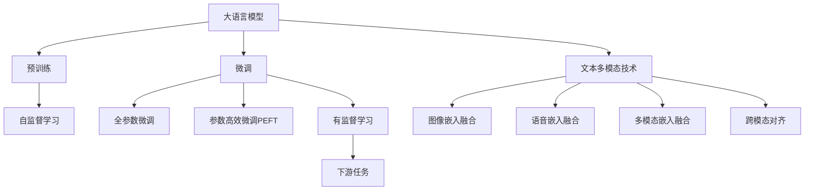
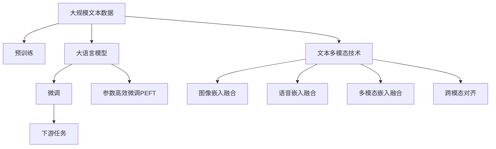
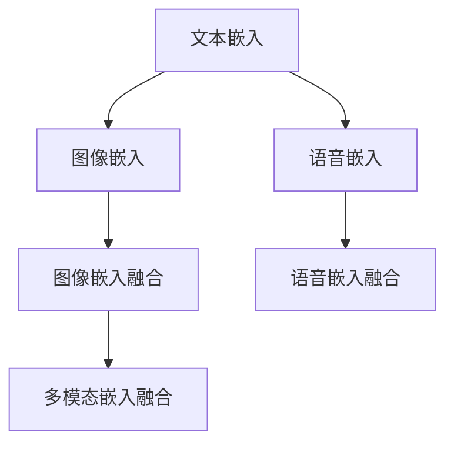
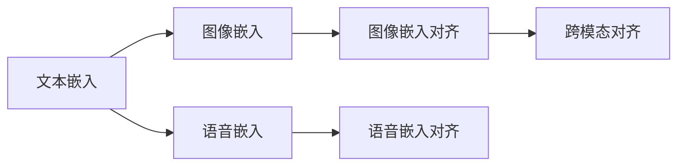

                 

# 多模态大模型：技术原理与实战 文本多模态技术

> 关键词：多模态大模型,文本多模态,Transformer,BERT,预训练,下游任务,参数高效微调,自然语言处理(NLP)

## 1. 背景介绍

### 1.1 问题由来
近年来，随着深度学习技术的快速发展，尤其是自然语言处理(Natural Language Processing, NLP)领域的突破，大语言模型(Large Language Models, LLMs)，如GPT系列模型、BERT、T5等，已经成为了推动NLP技术进步的重要引擎。这些大模型通过在大规模无标签文本数据上进行预训练，学习到了丰富的语言知识和常识，可以通过少量的有标签样本在下游任务上进行微调(Fine-Tuning)，获得优异的性能。然而，由于文本数据的有限性和多样性，这些通用大模型在特定领域应用时，效果往往难以达到实际应用的要求。

为了进一步提升模型在特定领域的表现，人们开始探索将多模态信息融合到语言模型中，构建多模态大模型(Multimodal Large Models)。多模态大模型整合了文本、图像、音频等多种类型的信息，不仅能够从单一的文本信息中提取语义，还能够结合视觉、听觉等多种信息进行推理和生成，显著提高了模型的泛化能力和应用范围。文本多模态技术作为多模态大模型的重要分支，通过将文本信息与其他模态信息融合，提升了模型的理解和生成能力，为NLP任务的跨模态推理和生成提供了新的解决方案。

### 1.2 问题核心关键点
文本多模态技术的核心在于如何有效融合文本信息和其他模态信息，从而提升模型的推理和生成能力。常见的融合方法包括：

- 图像嵌入融合：将图像信息转换为文本可读的向量形式，与文本信息一起输入模型。
- 语音嵌入融合：将语音信息转换为文本可读的向量形式，与文本信息一起输入模型。
- 多模态嵌入融合：将图像、语音等多种模态信息，分别转换为文本可读的向量形式，与文本信息一起输入模型。
- 跨模态对齐：将不同模态的信息对齐到统一的特征空间，便于融合和计算。

这些融合方法能够将多源信息转换为模型可以理解的统一表示，从而提升模型的推理和生成能力。

### 1.3 问题研究意义
文本多模态技术在提升NLP模型性能、拓展应用场景和推动人工智能技术进步方面具有重要意义：

1. **提升模型性能**：通过融合多模态信息，文本多模态模型能够更好地理解现实世界的复杂性，提高对多源信息的综合处理能力，从而在情感分析、事件抽取、视觉问答等任务上获得更好的表现。
2. **拓展应用场景**：多模态信息在许多实际应用场景中无处不在，如智能家居、自动驾驶、医疗诊断等。文本多模态技术能够将这些多模态信息整合到NLP模型中，提高其在这些场景下的应用效果。
3. **推动技术进步**：文本多模态技术是构建多模态大模型的基础，其发展和应用能够推动NLP技术和其他人工智能技术的进步，促进AI在更多领域的落地应用。

## 2. 核心概念与联系

### 2.1 核心概念概述

为了更好地理解文本多模态技术的核心概念，本节将介绍几个关键概念：

- 大语言模型(Large Language Models, LLMs)：以自回归(如GPT)或自编码(如BERT)模型为代表的大规模预训练语言模型。通过在大规模无标签文本语料上进行预训练，学习通用的语言表示，具备强大的语言理解和生成能力。
- 预训练(Pre-training)：指在大规模无标签文本语料上，通过自监督学习任务训练通用语言模型的过程。常见的预训练任务包括言语建模、遮挡语言模型等。预训练使得模型学习到语言的通用表示。
- 微调(Fine-tuning)：指在预训练模型的基础上，使用下游任务的少量标注数据，通过有监督学习优化模型在特定任务上的性能。通常只需要调整顶层分类器或解码器，并以较小的学习率更新全部或部分的模型参数。
- 多模态大模型(Multimodal Large Models)：整合文本、图像、音频等多种信息的大语言模型，通过融合多源信息，提升模型的推理和生成能力。
- 文本多模态技术(Text Multimodal Technology)：专注于文本与其他模态信息融合的NLP技术，通过跨模态对齐、嵌入融合等手段，提升文本信息的表达和理解能力。
- 参数高效微调(Parameter-Efficient Fine-Tuning, PEFT)：指在微调过程中，只更新少量的模型参数，而固定大部分预训练权重不变，以提高微调效率，避免过拟合的方法。
- 嵌入空间对齐(Embedding Space Alignment)：将不同模态的信息对齐到统一的特征空间，便于融合和计算。
- 跨模态对齐(Cross-Modal Alignment)：将不同模态的信息对齐到统一的特征空间，便于融合和计算。

这些核心概念之间的逻辑关系可以通过以下Mermaid流程图来展示：



这个流程图展示了文本多模态技术的核心概念及其之间的关系：

1. 大语言模型通过预训练获得基础能力。
2. 微调是对预训练模型进行任务特定的优化，可以分为全参数微调和参数高效微调（PEFT）。
3. 文本多模态技术通过融合多源信息，提升模型的推理和生成能力。
4. 图像嵌入融合、语音嵌入融合、多模态嵌入融合和跨模态对齐等技术，为文本多模态模型提供了多样化的信息融合手段。
5. 参数高效微调技术，可以在固定大部分预训练参数的情况下，只更新少量任务相关参数，提高微调效率。
6. 下游任务作为微调的目标，通过微调提升模型在特定任务上的性能。

这些概念共同构成了文本多模态技术的完整生态系统，使得模型能够更好地理解和生成多源信息，拓展其在各种场景下的应用。

### 2.2 概念间的关系

这些核心概念之间存在着紧密的联系，形成了文本多模态技术的完整架构。下面我通过几个Mermaid流程图来展示这些概念之间的关系。

#### 2.2.1 文本多模态技术的整体架构



这个综合流程图展示了从预训练到微调，再到文本多模态技术的完整过程。大语言模型首先在大规模文本数据上进行预训练，然后通过微调（包括全参数微调和参数高效微调）或文本多模态技术，融合其他模态信息，提升模型在特定任务上的性能。最后，通过下游任务的微调，模型能够进一步适应新的任务和数据。

#### 2.2.2 多模态嵌入融合方法



这个流程图展示了文本嵌入与其他模态嵌入融合的过程。文本嵌入、图像嵌入和语音嵌入分别转换为模型可读的向量形式，然后通过多模态嵌入融合技术，将这些信息整合并输入模型。

#### 2.2.3 跨模态对齐方法



这个流程图展示了跨模态对齐的过程。通过将文本嵌入、图像嵌入和语音嵌入分别对齐到统一的特征空间，便于模型进行多源信息的融合。

### 2.3 核心概念的整体架构

最后，我们用一个综合的流程图来展示这些核心概念在大语言模型微调过程中的整体架构：


这个综合流程图展示了从预训练到微调，再到文本多模态技术的完整过程。大语言模型首先在大规模文本数据上进行预训练，然后通过微调（包括全参数微调和参数高效微调）或文本多模态技术，融合其他模态信息，提升模型在特定任务上的性能。最后，通过下游任务的微调，模型能够进一步适应新的任务和数据。

## 3. 核心算法原理 & 具体操作步骤
### 3.1 算法原理概述

文本多模态技术本质上是一种多源信息融合的技术，通过将文本信息与其他模态信息融合，提升模型的推理和生成能力。其核心思想是：将文本信息与其他模态信息一起输入到模型中，利用多模态嵌入融合和跨模态对齐等技术，将不同模态的信息转换为模型可以理解的统一表示，从而提升模型的理解和生成能力。

形式化地，假设文本嵌入为 $\text{Enc}(x)$，图像嵌入为 $\text{Enc}_{\text{img}}(i)$，语音嵌入为 $\text{Enc}_{\text{audio}}(a)$，则融合后的多模态嵌入 $\text{Enc}_{\text{multimodal}}(x,i,a)$ 可以通过以下公式计算：

$$
\text{Enc}_{\text{multimodal}}(x,i,a) = f(\text{Enc}(x), \text{Enc}_{\text{img}}(i), \text{Enc}_{\text{audio}}(a))
$$

其中 $f$ 为融合函数，可以是简单的拼接、加权平均等方法，也可以是比较复杂的深度学习方法，如深度融合网络(Deep Fusion Networks)、跨模态注意力机制(Cross-Modal Attention)等。

通过融合多模态信息，文本多模态模型可以更好地理解现实世界的复杂性，提高对多源信息的综合处理能力，从而在情感分析、事件抽取、视觉问答等任务上获得更好的表现。

### 3.2 算法步骤详解

文本多模态技术的一般流程包括以下几个关键步骤：

**Step 1: 准备预训练模型和数据集**
- 选择合适的预训练语言模型 $M_{\theta}$ 作为初始化参数，如 BERT、GPT 等。
- 准备下游任务 $T$ 的标注数据集 $D=\{(x_i,y_i)\}_{i=1}^N$，划分为训练集、验证集和测试集。一般要求标注数据与预训练数据的分布不要差异过大。

**Step 2: 添加任务适配层**
- 根据任务类型，在预训练模型顶层设计合适的输出层和损失函数。
- 对于分类任务，通常在顶层添加线性分类器和交叉熵损失函数。
- 对于生成任务，通常使用语言模型的解码器输出概率分布，并以负对数似然为损失函数。

**Step 3: 设置微调超参数**
- 选择合适的优化算法及其参数，如 AdamW、SGD 等，设置学习率、批大小、迭代轮数等。
- 设置正则化技术及强度，包括权重衰减、Dropout、Early Stopping等。
- 确定冻结预训练参数的策略，如仅微调顶层，或全部参数都参与微调。

**Step 4: 执行梯度训练**
- 将训练集数据分批次输入模型，前向传播计算损失函数。
- 反向传播计算参数梯度，根据设定的优化算法和学习率更新模型参数。
- 周期性在验证集上评估模型性能，根据性能指标决定是否触发 Early Stopping。
- 重复上述步骤直到满足预设的迭代轮数或 Early Stopping 条件。

**Step 5: 测试和部署**
- 在测试集上评估微调后模型 $M_{\hat{\theta}}$ 的性能，对比微调前后的精度提升。
- 使用微调后的模型对新样本进行推理预测，集成到实际的应用系统中。
- 持续收集新的数据，定期重新微调模型，以适应数据分布的变化。

以上是文本多模态技术的一般流程。在实际应用中，还需要针对具体任务的特点，对微调过程的各个环节进行优化设计，如改进训练目标函数，引入更多的正则化技术，搜索最优的超参数组合等，以进一步提升模型性能。

### 3.3 算法优缺点

文本多模态技术具有以下优点：
1. 提升模型性能。通过融合多模态信息，文本多模态模型能够更好地理解现实世界的复杂性，提高对多源信息的综合处理能力，从而在情感分析、事件抽取、视觉问答等任务上获得更好的表现。
2. 拓展应用场景。多模态信息在许多实际应用场景中无处不在，如智能家居、自动驾驶、医疗诊断等。文本多模态技术能够将这些多模态信息整合到NLP模型中，提高其在这些场景下的应用效果。
3. 推动技术进步。文本多模态技术是构建多模态大模型的基础，其发展和应用能够推动NLP技术和其他人工智能技术的进步，促进AI在更多领域的落地应用。

同时，该方法也存在一定的局限性：
1. 依赖标注数据。微调的效果很大程度上取决于标注数据的质量和数量，获取高质量标注数据的成本较高。
2. 迁移能力有限。当目标任务与预训练数据的分布差异较大时，微调的性能提升有限。
3. 负面效果传递。预训练模型的固有偏见、有害信息等，可能通过微调传递到下游任务，造成负面影响。
4. 可解释性不足。微调模型的决策过程通常缺乏可解释性，难以对其推理逻辑进行分析和调试。

尽管存在这些局限性，但就目前而言，文本多模态技术仍是大语言模型应用的重要范式。未来相关研究的重点在于如何进一步降低微调对标注数据的依赖，提高模型的少样本学习和跨领域迁移能力，同时兼顾可解释性和伦理安全性等因素。

### 3.4 算法应用领域

文本多模态技术在NLP领域已经得到了广泛的应用，覆盖了几乎所有常见任务，例如：

- 文本分类：如情感分析、主题分类、意图识别等。通过融合多模态信息，提升模型对文本情感、主题、意图的理解能力。
- 命名实体识别：识别文本中的人名、地名、机构名等特定实体。通过融合图像、语音等多种信息，提高实体边界和类型的识别准确率。
- 关系抽取：从文本中抽取实体之间的语义关系。通过融合图像、视频等多种信息，提高关系抽取的准确性和鲁棒性。
- 问答系统：对自然语言问题给出答案。通过融合多模态信息，提升系统对用户意图的理解能力和回答质量。
- 机器翻译：将源语言文本翻译成目标语言。通过融合图像、语音等多种信息，提高翻译的准确性和自然度。
- 文本摘要：将长文本压缩成简短摘要。通过融合图像、语音等多种信息，提高摘要的全面性和相关性。
- 对话系统：使机器能够与人自然对话。通过融合多模态信息，提升对话系统的自然性和互动性。

除了上述这些经典任务外，文本多模态技术也被创新性地应用到更多场景中，如可控文本生成、常识推理、代码生成、数据增强等，为NLP技术带来了全新的突破。随着预训练模型和文本多模态技术的不断进步，相信NLP技术将在更广阔的应用领域大放异彩。

## 4. 数学模型和公式 & 详细讲解  
### 4.1 数学模型构建

本节将使用数学语言对文本多模态技术的数学模型进行更加严格的刻画。

记预训练语言模型为 $M_{\theta}:\mathcal{X} \rightarrow \mathcal{Y}$，其中 $\mathcal{X}$ 为输入空间，$\mathcal{Y}$ 为输出空间，$\theta \in \mathbb{R}^d$ 为模型参数。假设微调任务的训练集为 $D=\{(x_i,y_i)\}_{i=1}^N, x_i \in \mathcal{X}, y_i \in \mathcal{Y}$。

定义模型 $M_{\theta}$ 在输入 $x$ 上的输出为 $\hat{y}=M_{\theta}(x)$，则融合后的多模态嵌入为 $\text{Enc}_{\text{multimodal}}(x,i,a)$，其中 $x$ 表示文本信息，$i$ 表示图像信息，$a$ 表示语音信息。融合后的多模态嵌入可以表示为：

$$
\text{Enc}_{\text{multimodal}}(x,i,a) = \text{Enc}(x) \oplus \text{Enc}_{\text{img}}(i) \oplus \text{Enc}_{\text{audio}}(a)
$$

其中 $\oplus$ 表示融合操作，可以是简单的拼接、加权平均等方法，也可以是比较复杂的深度学习方法，如深度融合网络(Deep Fusion Networks)、跨模态注意力机制(Cross-Modal Attention)等。

### 4.2 公式推导过程

以下我们以深度融合网络(Deep Fusion Networks)为例，推导融合后的多模态嵌入及其梯度的计算公式。

假设模型 $M_{\theta}$ 在输入 $x$ 上的输出为 $\hat{y}=M_{\theta}(x)$，真实标签 $y \in \{0,1\}$。则融合后的多模态嵌入可以表示为：

$$
\text{Enc}_{\text{multimodal}}(x,i,a) = f(\text{Enc}(x), \text{Enc}_{\text{img}}(i), \text{Enc}_{\text{audio}}(a))
$$

其中 $f$ 为深度融合网络，可以表示为：

$$
f(\text{Enc}(x), \text{Enc}_{\text{img}}(i), \text{Enc}_{\text{audio}}(a)) = \text{Concat}(\text{Enc}(x), \text{Enc}_{\text{img}}(i), \text{Enc}_{\text{audio}}(a)) W
$$

其中 $\text{Concat}$ 表示拼接操作，$W$ 为融合权重矩阵。

假设融合后的多模态嵌入在数据样本 $(x,y)$ 上的损失函数为 $\ell(\text{Enc}_{\text{multimodal}}(x,i,a),y)$，则在数据集 $D$ 上的经验风险为：

$$
\mathcal{L}(\theta) = \frac{1}{N} \sum_{i=1}^N \ell(\text{Enc}_{\text{multimodal}}(x_i,i,a),y_i)
$$

根据链式法则，损失函数对参数 $\theta$ 的梯度为：

$$
\frac{\partial \mathcal{L}(\theta)}{\partial \theta} = \frac{1}{N} \sum_{i=1}^N (\frac{\partial \ell(\text{Enc}_{\text{multimodal}}(x_i,i,a),y_i)}{\partial \text{Enc}_{\text{multimodal}}(x_i,i,a)} \frac{\partial \text{Enc}_{\text{multimodal}}(x_i,i,a)}{\partial \theta}
$$

其中 $\frac{\partial \text{Enc}_{\text{multimodal}}(x_i,i,a)}{\partial \theta}$ 可以通过反向传播算法高效计算。

在得到损失函数的梯度后，即可带入参数更新公式，完成模型的迭代优化。重复上述过程直至收敛，最终得到适应下游任务的最优模型参数 $\theta^*$。

## 5. 项目实践：代码实例和详细解释说明
### 5.1 开发环境搭建

在进行多模态模型微调实践前，我们需要准备好开发环境。以下是使用Python进行PyTorch开发的环境配置流程：

1. 安装Anaconda：从官网下载并安装Anaconda，用于创建独立的Python环境。

2. 创建并激活虚拟环境：
```bash
conda create -n pytorch-env python=3.8 
conda activate pytorch-env
```

3. 安装PyTorch：根据CUDA版本，从官网获取对应的安装命令。例如：
```bash
conda install pytorch torchvision torchaudio cudatoolkit=11.1 -c pytorch -c conda-forge
```

4. 安装Transformers库：
```bash
pip install transformers
```

5. 安装各类工具包：
```bash
pip install numpy pandas scikit-learn matplotlib tqdm jupyter notebook ipython
```

完成上述步骤后，即可在`pytorch-env`环境中开始多模态模型微调实践。

### 5.2 源代码详细实现

下面我们以图像-文本多模态分类任务为例，给出使用Transformers库对ResNet+BERT模型进行多模态微调的PyTorch代码实现。

首先，定义多模态分类任务的数据处理函数：

```python
from transformers import BertTokenizer, ResNetFeatureExtractor
from torch.utils.data import Dataset
import torch

class MultimodalDataset(Dataset):
    def __init__(self, texts, images, tags, tokenizer, feature_extractor):
        self.texts = texts
        self.images = images
        self.tags = tags
        self.tokenizer = tokenizer
        self.feature_extractor = feature_extractor
        
    def __len__(self):
        return len(self.texts)
    
    def __getitem__(self, item):
        text = self.texts[item]
        image = self.images[item]
        tag = self.tags[item]
        
        encoding = self.tokenizer(text, return_tensors='pt', max_length=512, padding='max_length', truncation=True)
        features = self.feature_extractor(image, return_tensors='pt')
        input_ids = encoding['input_ids'][0]
        attention_mask = encoding['attention_mask'][0]
        image_features = features['pixel_values']
        
        # 对token-wise的标签进行编码
        encoded_tags = [tag2id[tag] for tag in tag2id.keys()]
        encoded_tags.extend([tag2id['O']] * (self.max_len - len(encoded_tags)))
        labels = torch.tensor(encoded_tags, dtype=torch.long)
        
        return {'input_ids': input_ids, 
                'attention_mask': attention_mask,
                'image_features': image_features,
                'labels': labels}

# 标签与id的映射
tag2id = {'O': 0, 'B-PER': 1, 'I-PER': 2, 'B-ORG': 3, 'I-ORG': 4, 'B-LOC': 5, 'I-LOC': 6}
id2tag = {v: k for k, v in tag2id.items()}

# 创建dataset
tokenizer = BertTokenizer.from_pretrained('bert-base-cased')
feature_extractor = ResNetFeatureExtractor.from_pretrained('resnet50')

train_dataset = MultimodalDataset(train_texts, train_images, train_tags, tokenizer, feature_extractor)
dev_dataset = MultimodalDataset(dev_texts, dev_images, dev_tags, tokenizer, feature_extractor)
test_dataset = MultimodalDataset(test_texts, test_images, test_tags, tokenizer, feature_extractor)
```

然后，定义模型和优化器：

```python
from transformers import BertForTokenClassification, ResNetForFeatureEmbedding, AdamW

model = BertForTokenClassification.from_pretrained('bert-base-cased', num_labels=len(tag2id))

feature_extractor = ResNetFeatureExtractor.from_pretrained('resnet50')
resnet_model = ResNetForFeatureEmbedding.from_pretrained('resnet50')
resnet_model.eval()

optimizer = AdamW(model.parameters(), lr=2e-5)
```

接着，定义训练和评估函数：

```python
from torch.utils.data import DataLoader
from tqdm import tqdm
from sklearn.metrics import classification_report

device = torch.device('cuda') if torch.cuda.is_available() else torch.device('cpu')
model.to(device)
resnet_model.to(device)

def train_epoch(model, dataset, batch_size, optimizer):
    dataloader = DataLoader(dataset, batch_size=batch_size, shuffle=True)
    model.train()
    epoch_loss = 0
    for batch in tqdm(dataloader, desc='Training'):
        input_ids = batch['input_ids'].to(device)
        attention_mask = batch['attention_mask'].to(device)
        image_features = batch['image_features'].to(device)
        labels = batch['labels'].to(device)
        model.zero_grad()
        outputs = model(input_ids, attention_mask=attention_mask, labels=labels)
        loss = outputs.loss
        epoch_loss += loss.item()
        loss.backward()
        optimizer.step()
    return epoch_loss / len(dataloader)

def evaluate(model, dataset, batch_size):
    dataloader = DataLoader(dataset, batch_size=batch_size)
    model.eval()
    preds, labels = [], []
    with torch.no_grad():
        for batch in tqdm(dataloader, desc='Evaluating'):
            input_ids

