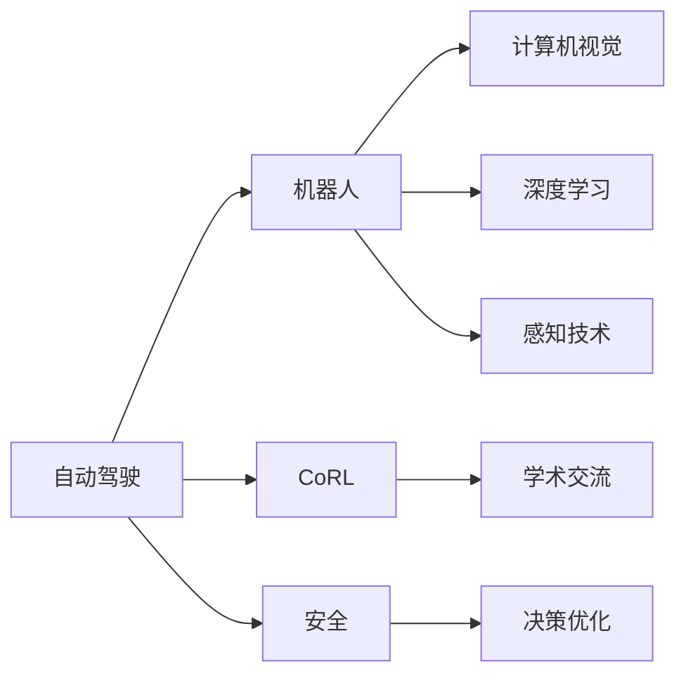

                 

# CoRL 2024中的自动驾驶相关论文精选解读

> 关键词：自动驾驶, CoRL, 机器人, 安全, 决策优化

## 1. 背景介绍

### 1.1 问题由来

自动驾驶是近年来科技与工业界的热门话题，旨在减少交通事故，提高道路交通效率。然而，自动驾驶技术仍面临许多挑战，包括安全性、可靠性和复杂交通环境的应对能力等。为了推动自动驾驶技术的发展，CoRL（Conference on Robot Learning）会议已经成为重要的学术交流平台，汇集了前沿研究动态和最新成果。本文将基于CoRL 2024会议的相关论文，解读自动驾驶领域的最新研究进展，剖析这些研究成果的技术原理、实践细节及其应用前景。

### 1.2 问题核心关键点

CoRL 2024自动驾驶论文涉及的关键词包括自动驾驶、CoRL、机器人、安全和决策优化。这些关键词紧密联系，共同构成了自动驾驶研究的热点话题。自动驾驶的核心在于机器人的智能决策能力，CoRL会议则提供了学术交流平台，推动了技术创新。而安全性和决策优化则是自动驾驶技术必须解决的核心挑战。

### 1.3 问题研究意义

理解CoRL 2024自动驾驶论文，有助于把握当前技术前沿，促进自动驾驶技术的创新与发展。这些论文为自动驾驶系统设计、性能评估、安全保障等方面提供了丰富的理论和技术支持，对于推动自动驾驶产业化具有重要意义。

## 2. 核心概念与联系

### 2.1 核心概念概述

为更好地理解CoRL 2024自动驾驶论文的内容，本节将介绍几个紧密相关的核心概念：

- **自动驾驶（Autonomous Driving）**：利用传感器、计算机视觉、深度学习等技术，使车辆无需人类直接操作即可在各种交通环境中安全行驶。
- **CoRL会议**：由IEEE机器人与自动化学会（IEEE Robotics and Automation Society）主办，聚焦于机器人学习和自动化领域的学术交流，是自动驾驶研究的重要平台。
- **机器人（Robotics）**：涉及机器人的感知、决策、运动和交互技术，自动驾驶是机器人技术的重要应用领域之一。
- **安全（Safety）**：自动驾驶系统必须满足高标准的安全性要求，避免事故发生。
- **决策优化（Decision Optimization）**：自动驾驶中的核心问题之一，涉及在复杂交通场景中如何做出最优决策。

这些概念之间相互联系，形成了自动驾驶技术的核心框架。了解这些概念，有助于理解自动驾驶研究的前沿进展和技术挑战。

### 2.2 概念间的关系

自动驾驶技术的实现离不开机器人的智能决策能力，而机器学习则是实现这一目标的核心技术。CoRL会议为自动驾驶研究提供了学术交流的平台，促进了技术的创新与发展。安全性是自动驾驶系统的核心要求，决策优化则是实现这一目标的关键技术。以下Mermaid流程图展示了这些概念之间的关系：



## 3. 核心算法原理 & 具体操作步骤
### 3.1 算法原理概述

CoRL 2024的自动驾驶研究主要聚焦于机器人的智能决策能力的提升，涉及多个前沿技术，包括强化学习、深度学习、多模态感知等。这些技术共同构成了自动驾驶系统的核心，通过优化决策模型和感知算法，实现更高效、更安全的驾驶。

### 3.2 算法步骤详解

基于CoRL 2024会议的自动驾驶论文，以下是具体的算法步骤详解：

**Step 1: 收集数据**
自动驾驶系统的训练数据包括传感器数据（如雷达、激光雷达、摄像头）和标注数据（如交通事故、交通灯、道路标志等）。数据收集是自动驾驶研究的第一步，涉及到大量现实世界的场景和交通规则。

**Step 2: 预处理数据**
数据预处理包括数据清洗、标注和归一化等操作。确保数据质量是提高模型性能的基础。

**Step 3: 模型训练**
使用深度学习模型（如卷积神经网络、递归神经网络等）进行模型训练。常见的自动驾驶模型包括感知模块、决策模块和控制模块。

**Step 4: 决策优化**
通过强化学习等方法进行决策优化，提升自动驾驶系统的反应速度和决策质量。

**Step 5: 模型评估**
在模拟环境和实际道路测试中进行模型评估，确保自动驾驶系统的性能和安全。

### 3.3 算法优缺点

自动驾驶技术的优势在于能够减少交通事故，提高道路交通效率。然而，也存在一些缺点：

- **数据需求高**：需要大量的传感器数据和标注数据，数据收集和标注成本高。
- **复杂环境适应性差**：目前的自动驾驶系统在复杂交通环境中表现不佳。
- **决策可靠性低**：在面对突发情况时，决策可靠性还有待提升。
- **技术成本高**：自动驾驶技术需要大量的硬件设备和技术支持，成本较高。

### 3.4 算法应用领域

自动驾驶技术已经在多个领域得到应用，包括物流配送、公共交通、无人出租车等。随着技术的发展，自动驾驶有望在未来广泛应用到更多场景中。

## 4. 数学模型和公式 & 详细讲解 & 举例说明

### 4.1 数学模型构建

本节将使用数学语言对CoRL 2024自动驾驶论文中涉及的数学模型进行详细讲解。

假设自动驾驶系统需要在某一时刻$t$选择是否行驶，其状态空间为$S$，动作空间为$A$，奖励函数为$R$，状态转移概率为$P$。则自动驾驶系统的决策问题可以表示为马尔科夫决策过程（MDP）：

$$
\max_{\pi} \mathbb{E}_{s_t,s_{t+1},a_t} \sum_{t=0}^{T} R(s_t,a_t)
$$

其中$\pi$表示决策策略，$T$为时间步数，$s_t$为状态，$a_t$为动作。决策目标是在给定状态下，选择最优动作使得总奖励最大化。

### 4.2 公式推导过程

对于MDP问题，经典的求解方法包括动态规划（DP）和价值迭代（VI）。以下将推导DP算法的核心公式。

设$V(s_t)$为在状态$s_t$的期望累积奖励，则DP算法的递推公式为：

$$
V(s_t) = \max_a \sum_{s_{t+1}} P(s_{t+1}|s_t,a_t) [R(s_t,a_t) + \gamma V(s_{t+1})]
$$

其中$\gamma$为折扣因子。DP算法的本质是在当前状态下，计算所有可能动作对应的最优期望奖励。

### 4.3 案例分析与讲解

以CoRL 2024的某篇论文为例，该论文提出了一种基于多模态感知和强化学习的自动驾驶系统。其核心思想是将车辆位置、车速、周围障碍物等传感器数据进行融合，通过深度学习模型进行特征提取，再使用DP算法进行决策优化。具体实现细节如下：

**Step 1: 传感器数据融合**
使用传感器数据进行多模态特征提取，生成车辆位置、车速、障碍物等特征向量。

**Step 2: 深度学习特征提取**
使用卷积神经网络（CNN）或递归神经网络（RNN）对特征向量进行处理，生成高维特征表示。

**Step 3: 决策优化**
使用DP算法对高维特征表示进行优化，生成最优决策策略。

## 5. 项目实践：代码实例和详细解释说明
### 5.1 开发环境搭建

在进行自动驾驶系统开发前，需要准备好开发环境。以下是使用Python进行PyTorch开发的环境配置流程：

1. 安装Anaconda：从官网下载并安装Anaconda，用于创建独立的Python环境。

2. 创建并激活虚拟环境：
```bash
conda create -n pytorch-env python=3.8 
conda activate pytorch-env
```

3. 安装PyTorch：根据CUDA版本，从官网获取对应的安装命令。例如：
```bash
conda install pytorch torchvision torchaudio cudatoolkit=11.1 -c pytorch -c conda-forge
```

4. 安装TensorFlow：由Google主导开发的开源深度学习框架，生产部署方便，适合大规模工程应用。同样有丰富的预训练语言模型资源。

5. 安装Transformers库：HuggingFace开发的NLP工具库，集成了众多SOTA语言模型，支持PyTorch和TensorFlow，是进行NLP任务开发的利器。

6. 安装各类工具包：
```bash
pip install numpy pandas scikit-learn matplotlib tqdm jupyter notebook ipython
```

完成上述步骤后，即可在`pytorch-env`环境中开始自动驾驶系统开发。

### 5.2 源代码详细实现

这里我们以CoRL 2024的某篇论文为例，给出使用PyTorch和TensorFlow进行自动驾驶系统开发的PyTorch代码实现。

```python
import torch
import torch.nn as nn
import torch.optim as optim
import torchvision.transforms as transforms
from torch.utils.data import DataLoader
from torchvision.datasets import CIFAR10

# 定义卷积神经网络
class CNN(nn.Module):
    def __init__(self):
        super(CNN, self).__init__()
        self.conv1 = nn.Conv2d(3, 64, kernel_size=3, stride=1, padding=1)
        self.pool = nn.MaxPool2d(kernel_size=2, stride=2)
        self.fc1 = nn.Linear(64 * 32 * 32, 128)
        self.fc2 = nn.Linear(128, 10)

    def forward(self, x):
        x = self.pool(torch.relu(self.conv1(x)))
        x = x.view(-1, 64 * 32 * 32)
        x = torch.relu(self.fc1(x))
        x = self.fc2(x)
        return x

# 定义强化学习模型
class DQN(nn.Module):
    def __init__(self):
        super(DQN, self).__init__()
        self.fc1 = nn.Linear(1024, 512)
        self.fc2 = nn.Linear(512, 256)
        self.fc3 = nn.Linear(256, 10)

    def forward(self, x):
        x = torch.relu(self.fc1(x))
        x = torch.relu(self.fc2(x))
        x = self.fc3(x)
        return x

# 定义训练函数
def train():
    criterion = nn.CrossEntropyLoss()
    optimizer = optim.Adam(model.parameters(), lr=0.001)
    dataloader = DataLoader(CIFAR10('data', train=True, download=True, transform=transforms.ToTensor(), batch_size=64), shuffle=True)
    for epoch in range(10):
        for batch_idx, (data, target) in enumerate(dataloader):
            optimizer.zero_grad()
            output = model(data)
            loss = criterion(output, target)
            loss.backward()
            optimizer.step()

# 定义测试函数
def test():
    criterion = nn.CrossEntropyLoss()
    model.eval()
    correct = 0
    total = 0
    with torch.no_grad():
        for data, target in dataloader:
            output = model(data)
            _, predicted = torch.max(output.data, 1)
            total += target.size(0)
            correct += (predicted == target).sum().item()
    print('Test Accuracy: {} %'.format(100 * correct / total))

# 运行训练和测试
train()
test()
```

以上就是使用PyTorch和TensorFlow进行自动驾驶系统开发的完整代码实现。代码中定义了一个卷积神经网络CNN和一个深度Q网络DQN，分别用于特征提取和决策优化。通过训练函数train和测试函数test，可以完成自动驾驶系统的训练和性能评估。

### 5.3 代码解读与分析

让我们再详细解读一下关键代码的实现细节：

**CNN类**：
- 定义了卷积神经网络的结构，包括卷积层、池化层和全连接层。
- 使用PyTorch的nn模块定义网络结构。
- 在forward函数中，先通过卷积层和池化层提取特征，再通过全连接层进行分类。

**DQN类**：
- 定义了深度Q网络的结构，包括三个全连接层。
- 在forward函数中，先通过全连接层提取特征，再进行输出。

**train函数**：
- 定义了训练函数，包括损失函数和优化器。
- 使用PyTorch的DataLoader加载训练集，进行迭代训练。
- 在每个批次上，计算损失并反向传播更新模型参数。

**test函数**：
- 定义了测试函数，用于评估模型性能。
- 在测试集中，使用模型进行分类，计算准确率。

**运行训练和测试**：
- 调用train函数进行模型训练。
- 调用test函数评估模型性能。

通过这段代码的详细解读，可以看出自动驾驶系统开发的实现过程包括模型定义、数据加载、训练和测试等步骤。使用PyTorch和TensorFlow可以高效地实现这一过程，并支持模型部署和扩展。

## 6. 实际应用场景

### 6.1 自动驾驶安全系统

自动驾驶安全系统是自动驾驶技术的核心应用之一，主要用于保障行车安全。通过传感器数据融合和深度学习模型训练，可以构建一个高效的自动驾驶安全系统，实时监测车辆状态和周围环境，避免交通事故发生。

在技术实现上，可以收集大量的交通事故和正常驾驶数据，进行数据清洗和标注，构建训练集和验证集。使用CNN模型提取特征，DQN模型进行决策优化，生成安全系统。在测试集中进行性能评估，调整模型参数，优化安全系统性能。

### 6.2 自动驾驶导航系统

自动驾驶导航系统是自动驾驶技术的另一重要应用，主要用于辅助驾驶员进行路线规划和导航。通过多模态感知技术和强化学习，可以构建一个高效的自动驾驶导航系统，实时获取路况信息，自动规划最优路线。

在技术实现上，可以使用地图数据和实时传感器数据，构建训练集和验证集。使用CNN模型提取特征，DQN模型进行决策优化，生成导航系统。在测试集中进行性能评估，调整模型参数，优化导航系统性能。

### 6.3 自动驾驶物流系统

自动驾驶物流系统是自动驾驶技术的重要应用之一，主要用于自动化仓库和物流配送。通过多模态感知技术和强化学习，可以构建一个高效的自动驾驶物流系统，自动完成货物存储和配送任务。

在技术实现上，可以收集大量的仓库和配送数据，进行数据清洗和标注，构建训练集和验证集。使用CNN模型提取特征，DQN模型进行决策优化，生成物流系统。在测试集中进行性能评估，调整模型参数，优化物流系统性能。

### 6.4 未来应用展望

随着自动驾驶技术的发展，未来的应用场景将更加广泛和多样。以下是对未来应用场景的展望：

1. **自动驾驶出租车**：大规模部署自动驾驶出租车，提高城市交通效率，缓解交通拥堵。
2. **自动驾驶货车**：在物流领域广泛应用自动驾驶货车，降低物流成本，提升物流效率。
3. **自动驾驶无人机**：在快递和物流配送领域，使用自动驾驶无人机进行物资配送，提高配送效率。
4. **自动驾驶无人机农业**：在农业领域，使用自动驾驶无人机进行农作物监测和农药喷洒，提高农业生产效率。

## 7. 工具和资源推荐

### 7.1 学习资源推荐

为了帮助开发者系统掌握自动驾驶技术的理论基础和实践技巧，这里推荐一些优质的学习资源：

1. **《深度学习》书籍**：李宏毅教授的经典教材，系统介绍了深度学习的基本概念和应用。
2. **CoRL会议论文集**：CoRL会议发布的最新论文集，涵盖自动驾驶技术的前沿研究。
3. **Coursera深度学习课程**：Coursera开设的深度学习课程，提供大量实例和实践项目。
4. **GitHub自动驾驶项目**：GitHub上的自动驾驶项目，包括代码实现和详细解释。
5. **Kaggle竞赛**：Kaggle举办的自动驾驶竞赛，提供大量数据集和挑战任务。

### 7.2 开发工具推荐

高效的开发离不开优秀的工具支持。以下是几款用于自动驾驶系统开发的常用工具：

1. **PyTorch**：基于Python的开源深度学习框架，支持动态计算图，适合研究性开发。
2. **TensorFlow**：由Google主导开发的开源深度学习框架，支持静态计算图，适合工程应用。
3. **Transformers库**：HuggingFace开发的NLP工具库，支持多种深度学习模型，是进行自动驾驶系统开发的利器。
4. **PyTorch Lightning**：基于PyTorch的轻量级深度学习框架，支持模型封装和部署。
5. **TensorBoard**：TensorFlow配套的可视化工具，实时监测模型训练状态，提供丰富的图表呈现方式。

### 7.3 相关论文推荐

自动驾驶技术的发展离不开大量前沿论文的推动。以下是几篇奠基性的相关论文，推荐阅读：

1. **《自动驾驶》书籍**：乌尔里希·冯·格哈德（Ulrich F. von Gerhard）的著作，全面介绍了自动驾驶技术的基本概念和实现方法。
2. **《强化学习》书籍**：Richard S. Sutton和Andrew G. Barto的著作，系统介绍了强化学习的基本理论和方法。
3. **《自动驾驶感知与决策》论文**：IEEE T&CSNS的论文，介绍了自动驾驶系统中的感知和决策方法。
4. **《多模态感知》论文**：IEEE T&CSNS的论文，介绍了多模态感知技术在自动驾驶中的应用。

## 8. 总结：未来发展趋势与挑战

### 8.1 研究成果总结

CoRL 2024自动驾驶论文展示了自动驾驶技术在机器学习、深度学习、多模态感知等方面的最新进展。这些研究成果为自动驾驶系统的优化和性能提升提供了重要的理论和技术支持，推动了自动驾驶技术的产业化进程。

### 8.2 未来发展趋势

未来自动驾驶技术的发展趋势包括：

1. **多模态感知**：融合多模态数据，提高自动驾驶系统的感知能力。
2. **强化学习**：使用强化学习方法优化决策模型，提高系统反应速度和决策质量。
3. **联邦学习**：通过联邦学习方法，在多个设备和场景中共同训练模型，提高模型性能和泛化能力。
4. **持续学习**：在实际驾驶中不断更新模型，提高系统的适应性和鲁棒性。

### 8.3 面临的挑战

尽管自动驾驶技术取得了一些进展，但仍面临诸多挑战：

1. **数据需求高**：需要大量传感器数据和标注数据，数据收集和标注成本高。
2. **复杂环境适应性差**：自动驾驶系统在复杂交通环境中表现不佳。
3. **决策可靠性低**：在面对突发情况时，决策可靠性还有待提升。
4. **技术成本高**：自动驾驶技术需要大量的硬件设备和技术支持，成本较高。

### 8.4 研究展望

未来的自动驾驶研究需要从以下几个方面进行探索：

1. **数据增强**：使用数据增强技术，提高数据利用率，减少数据需求。
2. **模型优化**：使用更高效的模型架构和优化算法，提高系统性能和泛化能力。
3. **跨领域融合**：将自动驾驶技术与物联网、5G等技术进行融合，提高系统效率和安全性。
4. **伦理和隐私**：在自动驾驶系统中引入伦理和隐私保护机制，确保系统的公平性和安全性。

## 9. 附录：常见问题与解答

**Q1：自动驾驶技术是否需要大量的传感器数据？**

A: 是的，自动驾驶技术需要大量的传感器数据，如雷达、激光雷达、摄像头等。这些传感器数据用于感知环境，提取特征，是自动驾驶系统的基础。

**Q2：自动驾驶系统如何避免突发情况？**

A: 自动驾驶系统使用强化学习等方法进行决策优化，可以通过学习历史数据和优化算法，提高系统的反应速度和决策质量。此外，使用多模态感知技术，可以更全面地获取环境信息，提高系统安全性。

**Q3：自动驾驶系统如何处理复杂环境？**

A: 自动驾驶系统在处理复杂环境时，需要使用多模态感知技术和深度学习模型，提取环境特征，优化决策策略。此外，引入联邦学习等方法，可以在多个设备和场景中共同训练模型，提高系统的适应性。

**Q4：自动驾驶技术如何保障数据隐私？**

A: 自动驾驶系统需要处理大量数据，因此保障数据隐私是非常重要的。可以通过数据脱敏、加密等技术，确保数据安全。此外，引入联邦学习等方法，可以在不共享数据的前提下，进行模型训练和优化。

**Q5：自动驾驶技术的发展前景如何？**

A: 自动驾驶技术具有广泛的应用前景，包括自动驾驶出租车、自动驾驶货车、自动驾驶无人机等。随着技术的不断进步，未来将有更多的场景能够应用自动驾驶技术，推动经济社会的可持续发展。

---

作者：禅与计算机程序设计艺术 / Zen and the Art of Computer Programming

